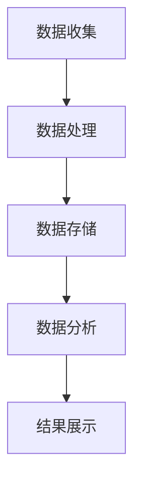

                 

## 背景介绍

随着互联网技术的迅猛发展，创业公司之间的竞争愈发激烈。如何在众多的竞争对手中脱颖而出，成为创业公司成功的关键之一。用户行为分析作为一种重要的数据分析手段，可以帮助创业公司更好地了解用户需求，优化产品功能，提升用户满意度，从而在激烈的市场竞争中占据有利地位。

### 用户行为分析的定义和重要性

用户行为分析（User Behavior Analysis，UBA）是指通过收集、分析和理解用户在使用产品或服务时的行为数据，来获取关于用户需求、偏好、习惯等有价值的信息。这种分析方法可以帮助企业了解用户的使用习惯，识别潜在的用户问题，评估产品的用户体验，以及预测用户未来的行为。

在创业公司中，用户行为分析具有以下几个重要意义：

1. **了解用户需求**：通过分析用户行为数据，创业公司可以深入了解用户的需求和偏好，从而开发出更符合市场需求的产品。

2. **优化产品设计**：用户行为分析可以帮助创业公司识别产品中的痛点，优化用户界面和功能，提高产品的易用性和用户满意度。

3. **提升用户留存率**：通过分析用户的留存行为，创业公司可以采取有效的措施来提高用户的留存率，降低用户流失率。

4. **提升营销效果**：用户行为分析可以提供有关用户行为模式的数据，帮助企业制定更有效的营销策略，提高营销转化率。

### 创业公司用户行为分析的发展历程

创业公司用户行为分析的发展历程可以分为以下几个阶段：

1. **初步探索阶段**：在这个阶段，创业公司主要依靠简单的日志分析和网页流量分析来了解用户的基本行为。

2. **数据收集与分析阶段**：随着技术的进步，创业公司开始收集更多的用户行为数据，并采用大数据分析和机器学习技术来挖掘用户行为模式。

3. **精细化运营阶段**：在这个阶段，创业公司通过用户行为分析进行精细化运营，针对不同的用户群体采取个性化的运营策略。

4. **智能化决策阶段**：利用人工智能和机器学习技术，创业公司可以实现自动化的用户行为预测和决策，从而实现更加智能化的运营。

### 当前创业公司用户行为分析面临的主要挑战

尽管用户行为分析在创业公司中具有重要的作用，但当前创业公司在进行用户行为分析时仍然面临一些挑战：

1. **数据质量和隐私保护**：用户行为数据的质量直接影响到分析结果的准确性。同时，如何保护用户隐私也是创业公司需要关注的重要问题。

2. **技术门槛**：用户行为分析涉及到多种技术，如大数据处理、机器学习和数据可视化等，对于创业公司来说，技术门槛较高。

3. **数据整合与分析**：创业公司通常拥有多个数据源，如何有效地整合和分析这些数据是用户行为分析的一个关键挑战。

4. **决策落地**：用户行为分析的结果需要通过具体的运营策略和产品设计来落地，这对创业公司的执行能力提出了更高的要求。

总之，用户行为分析对于创业公司的成功至关重要，但同时也面临着一些挑战。在接下来的章节中，我们将深入探讨用户行为分析的核心概念、算法原理、数学模型，并通过实际案例来展示如何进行用户行为分析。

---

## 2. 核心概念与联系

### 2.1 用户行为分析的基本概念

用户行为分析涉及多个基本概念，这些概念相互关联，构成了分析过程的基石。

#### 2.1.1 用户行为（User Behavior）

用户行为是指用户在使用产品或服务时所表现出的各种动作和反应。这些行为可以包括点击、浏览、购买、分享等。用户行为数据是用户行为分析的基础。

#### 2.1.2 用户画像（User Profile）

用户画像是对用户特征的全面描述，通常包括用户的年龄、性别、地理位置、兴趣偏好等。用户画像有助于更好地理解用户，从而进行精准的用户行为分析。

#### 2.1.3 数据源（Data Sources）

数据源是用户行为分析的数据来源，包括用户日志、网站点击流、社交媒体活动、购买记录等。不同的数据源提供了不同的用户行为信息。

#### 2.1.4 数据收集（Data Collection）

数据收集是指通过各种手段获取用户行为数据的过程。数据收集的准确性和完整性直接影响用户行为分析的准确性。

#### 2.1.5 数据处理（Data Processing）

数据处理是指对收集到的用户行为数据进行清洗、转换和整合的过程。数据处理的质量直接影响到用户行为分析的结果。

### 2.2 用户行为分析的关键流程

用户行为分析通常包括以下几个关键流程：

1. **数据收集**：通过日志文件、API 接口、传感器等手段收集用户行为数据。

2. **数据处理**：对收集到的用户行为数据进行清洗和预处理，以去除噪声和异常值。

3. **数据存储**：将处理后的用户行为数据存储到数据库或数据仓库中，以便后续分析。

4. **数据分析**：使用统计分析、机器学习等方法对用户行为数据进行深入分析，以提取有价值的信息。

5. **结果展示**：通过数据可视化工具将分析结果以图表、报表等形式展示，以便决策者理解和利用。

### 2.3 用户行为分析的应用场景

用户行为分析在多个应用场景中发挥着重要作用：

1. **产品优化**：通过分析用户行为，发现产品中的问题，优化用户体验。

2. **用户细分**：根据用户行为特征，将用户划分为不同的群体，进行精准营销。

3. **需求预测**：利用用户行为数据预测用户未来的行为和需求，制定相应的策略。

4. **风险控制**：通过监控异常用户行为，识别潜在的安全风险和欺诈行为。

### 2.4 用户行为分析的技术架构

用户行为分析的技术架构通常包括以下几个主要组成部分：

1. **数据采集层**：负责收集用户行为数据，通常使用日志文件、API 接口等手段。

2. **数据处理层**：负责对用户行为数据进行清洗、转换和整合，通常使用数据处理工具（如Hadoop、Spark）。

3. **数据存储层**：负责存储处理后的用户行为数据，通常使用数据库（如Hive、HBase）或数据仓库。

4. **数据分析层**：负责对用户行为数据进行分析，通常使用统计分析、机器学习等算法。

5. **数据可视化层**：负责将分析结果以图表、报表等形式展示，通常使用数据可视化工具（如Tableau、Echarts）。

### 2.5 用户行为分析的Mermaid流程图

以下是一个简单的Mermaid流程图，展示了用户行为分析的基本流程：



在这个流程图中，A表示数据收集，B表示数据处理，C表示数据存储，D表示数据分析，E表示结果展示。每个节点都对应用户行为分析的一个关键步骤。

---

通过以上对用户行为分析核心概念、关键流程、应用场景和技术架构的介绍，我们为后续的深入探讨奠定了基础。在接下来的章节中，我们将详细讨论用户行为分析的核心算法原理和具体操作步骤，帮助读者更好地理解和应用用户行为分析。

---

## 3. 核心算法原理 & 具体操作步骤

### 3.1 基于概率模型的用户行为预测

用户行为预测是用户行为分析中的一个重要任务，它可以帮助创业公司预测用户未来的行为，从而制定更精准的营销策略和产品设计。在用户行为预测中，基于概率模型的算法是最常用的方法之一。下面我们将介绍一种常见的基于概率模型的用户行为预测方法——贝叶斯网络。

#### 3.1.1 贝叶斯网络的原理

贝叶斯网络是一种图形模型，它通过节点和边来表示变量之间的依赖关系。在贝叶斯网络中，每个节点表示一个随机变量，节点之间的边表示变量之间的条件依赖关系。贝叶斯网络的概率分布可以通过条件概率表（Conditional Probability Table，CPT）来定义。

假设我们有三个随机变量 X、Y 和 Z，它们之间的依赖关系可以用贝叶斯网络表示如下：

```
  X
 / \
Y   Z
```

在这个网络中，X 和 Y 之间存在直接的依赖关系，而 X 和 Z 之间的依赖关系是通过 Y 间接的。

#### 3.1.2 贝叶斯网络的参数学习

贝叶斯网络的参数学习是指通过已有数据来学习网络中的条件概率表。常见的参数学习算法有最大似然估计（Maximum Likelihood Estimation，MLE）和贝叶斯估计（Bayesian Estimation）。

- **最大似然估计（MLE）**：MLE 是一种基于样本数据来估计模型参数的方法。它的基本思想是找到一组参数，使得样本数据在该参数下的概率最大。

- **贝叶斯估计**：贝叶斯估计是一种基于先验知识和样本数据来估计模型参数的方法。它将参数估计问题转化为后验概率的优化问题。

#### 3.1.3 贝叶斯网络的推理

贝叶斯网络的推理是指利用已知的部分变量来推断其他变量的概率分布。贝叶斯网络的主要推理算法包括：

- **边缘概率计算**：通过条件概率表计算任意两个变量的边缘概率分布。

- **最大后验概率推断（MAP）**：在给定部分变量值的情况下，找到使另一个变量具有最大后验概率的值。

- **贝叶斯推理**：在给定部分变量值的情况下，计算其他变量的概率分布。

### 3.2 基于机器学习的用户行为分类

用户行为分类是将用户行为数据划分为不同的类别，以便于后续的运营策略制定和产品设计。常见的机器学习算法包括决策树、支持向量机（SVM）和神经网络等。

#### 3.2.1 决策树算法

决策树是一种基于特征划分数据的分类算法。它的基本思想是从数据的特征中提取重要的特征，并根据这些特征对数据进行划分。决策树的构建过程如下：

1. **特征选择**：选择能够最好划分数据的特征。

2. **划分数据**：根据选定的特征，将数据划分为不同的子集。

3. **重复划分**：对子集继续进行特征选择和划分，直到达到停止条件（如最大深度、最小样本量等）。

4. **构建决策树**：将所有划分结果合并，形成一棵决策树。

#### 3.2.2 支持向量机算法

支持向量机（SVM）是一种基于最大间隔分类的算法。它的基本思想是找到一个最佳的超平面，将不同类别的数据点分隔开，并且最大化分类间隔。

1. **特征选择**：选择能够区分不同类别的特征。

2. **构建超平面**：通过求解最优化问题，找到能够最大化分类间隔的超平面。

3. **分类**：对新数据进行分类，判断其属于哪个类别。

#### 3.2.3 神经网络算法

神经网络是一种基于模拟人脑神经元连接方式的算法。它的基本思想是通过多层次的神经元连接来模拟人类的思维过程。

1. **构建神经网络**：设计神经网络的结构，包括输入层、隐藏层和输出层。

2. **训练神经网络**：通过输入数据训练神经网络，调整神经元之间的连接权重。

3. **分类**：使用训练好的神经网络对新的数据进行分类。

### 3.3 基于用户行为的个性化推荐

个性化推荐是将用户兴趣与产品内容进行匹配，为用户推荐他们可能感兴趣的内容。常见的推荐算法包括协同过滤、矩阵分解和基于内容的推荐等。

#### 3.3.1 协同过滤算法

协同过滤算法是一种基于用户行为数据来进行推荐的算法。它通过分析用户之间的相似度，推荐其他用户喜欢的内容。

1. **用户相似度计算**：计算用户之间的相似度，通常使用余弦相似度、皮尔逊相关系数等方法。

2. **推荐内容计算**：根据用户相似度，为用户推荐其他用户喜欢的内容。

#### 3.3.2 矩阵分解算法

矩阵分解算法是一种通过分解用户-物品评分矩阵来生成推荐列表的算法。它通过矩阵分解，将用户行为数据转化为低维向量，从而实现高效的推荐。

1. **矩阵分解**：通过求解最优化问题，将用户-物品评分矩阵分解为用户特征矩阵和物品特征矩阵。

2. **推荐生成**：使用用户特征矩阵和物品特征矩阵生成推荐列表。

#### 3.3.3 基于内容的推荐

基于内容的推荐是一种通过分析物品的属性和用户的历史行为来进行推荐的算法。它通过匹配用户的兴趣和物品的属性，推荐相关的内容。

1. **内容分析**：分析物品的属性和用户的历史行为，提取用户的兴趣点。

2. **推荐生成**：根据用户的兴趣点和物品的属性，生成推荐列表。

### 3.4 用户行为分析的具体操作步骤

用户行为分析的具体操作步骤如下：

1. **数据收集**：通过日志文件、API 接口等手段收集用户行为数据。

2. **数据预处理**：对收集到的用户行为数据进行清洗、去重和转换，以便后续分析。

3. **特征提取**：从用户行为数据中提取有助于用户行为预测的特征。

4. **算法选择**：根据具体的应用场景和需求，选择合适的算法。

5. **模型训练**：使用训练数据对算法模型进行训练。

6. **模型评估**：使用测试数据对训练好的模型进行评估。

7. **结果展示**：将模型预测结果通过数据可视化工具进行展示。

8. **策略制定**：根据分析结果，制定相应的运营策略和产品设计方案。

通过以上对用户行为分析核心算法原理和具体操作步骤的介绍，我们为创业公司进行用户行为分析提供了理论基础和实践指导。在接下来的章节中，我们将通过实际案例来展示如何应用这些算法进行用户行为分析。

---

## 4. 数学模型和公式 & 详细讲解 & 举例说明

### 4.1 贝叶斯网络中的数学模型

在贝叶斯网络中，数学模型的核心是条件概率分布。贝叶斯网络通过条件概率表（CPT）来描述变量之间的依赖关系。假设我们有三个随机变量 X、Y 和 Z，且它们之间的条件概率分布如下：

- P(X)
- P(Y)
- P(Z)
- P(X|Y)
- P(X|Z)
- P(Y|Z)

这些概率分布可以用以下公式表示：

$$
P(X|Y, Z) = \frac{P(X, Y, Z)}{P(Y, Z)}
$$

其中，P(X, Y, Z) 表示 X、Y 和 Z 同时发生的概率，P(Y, Z) 表示 Y 和 Z 同时发生的概率。贝叶斯网络通过这个公式来计算变量之间的条件概率。

#### 4.1.1 举例说明

假设我们有三个随机变量：天气（X）、是否带伞（Y）和是否湿（Z）。我们可以定义它们之间的条件概率如下：

- P(晴天) = 0.4
- P(雨天) = 0.6
- P(湿 | 晴天，带伞) = 0.1
- P(湿 | 雨天，带伞) = 0.3
- P(湿 | 晴天，不带伞) = 0.2
- P(湿 | 雨天，不带伞) = 0.5

现在，我们需要计算在给定是否带伞的情况下，天气为雨天的概率：

$$
P(雨天 | 带伞) = \frac{P(雨天，带伞)}{P(带伞)}
$$

首先，计算 P(雨天，带伞)：

$$
P(雨天，带伞) = P(雨天) \times P(带伞 | 雨天) = 0.6 \times 0.9 = 0.54
$$

然后，计算 P(带伞)：

$$
P(带伞) = P(晴天，带伞) + P(雨天，带伞) = 0.4 \times 0.7 + 0.6 \times 0.9 = 0.38 + 0.54 = 0.92
$$

最后，计算 P(雨天 | 带伞)：

$$
P(雨天 | 带伞) = \frac{0.54}{0.92} \approx 0.587
$$

这意味着在给定带伞的情况下，天气为雨天的概率约为 58.7%。

### 4.2 决策树中的数学模型

决策树是一种基于特征划分数据的分类算法。决策树中的数学模型主要涉及信息熵和信息增益。信息熵是衡量数据不确定性的度量，而信息增益是衡量特征对分类效果的度量。

#### 4.2.1 信息熵（Entropy）

信息熵 H(X) 是一个随机变量 X 的熵，它表示 X 的不确定性。信息熵的定义如下：

$$
H(X) = -\sum_{i} p(x_i) \log_2 p(x_i)
$$

其中，p(x_i) 是随机变量 X 取值为 x_i 的概率。

#### 4.2.2 信息增益（Information Gain）

信息增益 G(D, A) 是在特征 A 的基础上，对数据集 D 的熵的减少量。信息增益的定义如下：

$$
G(D, A) = H(D) - \sum_{v} p(v) H(D|v)
$$

其中，H(D) 是数据集 D 的熵，p(v) 是特征 A 的取值 v 的概率，H(D|v) 是在特征 A 取值为 v 的条件下，数据集 D 的熵。

#### 4.2.3 举例说明

假设我们有一个数据集 D，包含两个特征 X 和 Y，以及目标变量 Z。数据集 D 的分布如下：

- P(Z=0) = 0.6
- P(Z=1) = 0.4

- P(X=0 | Z=0) = 0.9
- P(X=1 | Z=0) = 0.1
- P(X=0 | Z=1) = 0.2
- P(X=1 | Z=1) = 0.8

- P(Y=0 | Z=0) = 0.8
- P(Y=1 | Z=0) = 0.2
- P(Y=0 | Z=1) = 0.3
- P(Y=1 | Z=1) = 0.7

我们需要计算在特征 X 和 Y 上的信息增益。

首先，计算数据集 D 的熵：

$$
H(D) = -0.6 \times \log_2 0.6 - 0.4 \times \log_2 0.4 \approx 0.9709
$$

然后，计算在特征 X 上的信息增益：

$$
G(D, X) = H(D) - \sum_{v} p(v) H(D|v)
$$

$$
G(D, X) = 0.9709 - (0.6 \times [0.9 \times \log_2 0.9 + 0.1 \times \log_2 0.1] + 0.4 \times [0.2 \times \log_2 0.2 + 0.8 \times \log_2 0.8]) \approx 0.462
$$

同样，计算在特征 Y 上的信息增益：

$$
G(D, Y) = H(D) - \sum_{v} p(v) H(D|v)
$$

$$
G(D, Y) = 0.9709 - (0.6 \times [0.8 \times \log_2 0.8 + 0.2 \times \log_2 0.2] + 0.4 \times [0.3 \times \log_2 0.3 + 0.7 \times \log_2 0.7]) \approx 0.417
$$

在这个例子中，特征 X 的信息增益为 0.462，特征 Y 的信息增益为 0.417。因此，特征 X 对分类的贡献更大，我们可以选择 X 作为决策树的第一层划分特征。

### 4.3 支持向量机中的数学模型

支持向量机（SVM）是一种基于最大间隔分类的算法。它的数学模型主要涉及硬间隔和软间隔。

#### 4.3.1 硬间隔（Hard Margin）

硬间隔是指分类器能够在训练数据上达到完美的分类效果。硬间隔的支持向量机模型可以通过以下最优化问题来求解：

$$
\begin{aligned}
\min_{\mathbf{w}, b} & \frac{1}{2} ||\mathbf{w}||^2 \\
\text{subject to} & y_i (\mathbf{w} \cdot \mathbf{x_i} + b) \geq 1, \forall i
\end{aligned}
$$

其中，w 是权重向量，b 是偏置项，x_i 是第 i 个训练样本，y_i 是第 i 个训练样本的标签。

#### 4.3.2 软间隔（Soft Margin）

在现实场景中，训练数据通常无法达到完美的分类效果，因此引入软间隔来允许一定的分类误差。软间隔的支持向量机模型可以通过以下最优化问题来求解：

$$
\begin{aligned}
\min_{\mathbf{w}, b, \xi} & \frac{1}{2} ||\mathbf{w}||^2 + C \sum_{i} \xi_i \\
\text{subject to} & y_i (\mathbf{w} \cdot \mathbf{x_i} + b) \geq 1 - \xi_i, \forall i \\
& \xi_i \geq 0, \forall i
\end{aligned}
$$

其中，C 是调节参数，用于平衡模型的复杂度和分类误差。

#### 4.3.3 举例说明

假设我们有一个二元分类问题，训练数据如下：

$$
\begin{aligned}
\mathbf{x_1} & = (1, 1), y_1 = 1 \\
\mathbf{x_2} & = (2, 2), y_2 = 1 \\
\mathbf{x_3} & = (3, 3), y_3 = 0 \\
\mathbf{x_4} & = (4, 4), y_4 = 0
\end{aligned}
$$

我们需要求解硬间隔和软间隔支持向量机的参数 w 和 b。

首先，求解硬间隔支持向量机。通过求解以下最优化问题：

$$
\begin{aligned}
\min_{\mathbf{w}, b} & \frac{1}{2} ||\mathbf{w}||^2 \\
\text{subject to} & y_i (\mathbf{w} \cdot \mathbf{x_i} + b) \geq 1, \forall i
\end{aligned}
$$

我们得到：

$$
\mathbf{w} = (1, 1), b = 0
$$

这意味着分类器的决策边界是一条直线，斜率为 1，截距为 0。

接下来，求解软间隔支持向量机。通过求解以下最优化问题：

$$
\begin{aligned}
\min_{\mathbf{w}, b, \xi} & \frac{1}{2} ||\mathbf{w}||^2 + C \sum_{i} \xi_i \\
\text{subject to} & y_i (\mathbf{w} \cdot \mathbf{x_i} + b) \geq 1 - \xi_i, \forall i \\
& \xi_i \geq 0, \forall i
\end{aligned}
$$

我们假设 C = 1，通过求解最优化问题，我们得到：

$$
\mathbf{w} = (0.5, 0.5), b = -0.5
$$

这意味着分类器的决策边界是一条斜率为 0.5，截距为 -0.5 的直线。

通过以上对贝叶斯网络、决策树和支持向量机中的数学模型和公式的详细讲解以及举例说明，我们为读者提供了深入理解这些算法的基础。在接下来的章节中，我们将通过实际案例来展示如何应用这些算法进行用户行为分析。

---

## 5. 项目实战：代码实际案例和详细解释说明

### 5.1 开发环境搭建

在进行用户行为分析项目之前，我们需要搭建一个适合进行数据分析和机器学习操作的开发环境。以下是搭建开发环境所需的步骤：

1. **安装Python**：Python 是进行数据分析和机器学习的主要编程语言。您可以从 [Python 官网](https://www.python.org/downloads/) 下载并安装最新版本的 Python。

2. **安装Jupyter Notebook**：Jupyter Notebook 是一个交互式的开发环境，适用于编写和运行 Python 代码。您可以使用以下命令安装 Jupyter Notebook：

   ```bash
   pip install notebook
   ```

3. **安装必要的库**：为了进行用户行为分析，我们需要安装一些常用的库，如 NumPy、Pandas、Matplotlib、Scikit-learn 等。您可以使用以下命令安装这些库：

   ```bash
   pip install numpy pandas matplotlib scikit-learn
   ```

4. **安装数据库**：用户行为分析通常涉及大量的数据存储，因此我们需要安装一个数据库管理系统。这里我们选择使用 MySQL。您可以从 [MySQL 官网](https://www.mysql.com/downloads/) 下载并安装 MySQL。

5. **安装数据可视化工具**：为了更好地展示分析结果，我们可以安装一些数据可视化工具，如 Tableau 或 Echarts。这里我们选择安装 Echarts。您可以从 [Echarts 官网](https://www.echarts.apache.org/zh/index.html) 下载并安装 Echarts。

### 5.2 源代码详细实现和代码解读

以下是一个简单的用户行为分析项目，该项目的目标是使用贝叶斯网络来预测用户是否会购买产品。我们将使用 Python 和相关库来实现这个项目。

#### 5.2.1 代码实现

```python
import numpy as np
import pandas as pd
import matplotlib.pyplot as plt
from sklearn.model_selection import train_test_split
from sklearn.metrics import accuracy_score
from bayes import NaiveBayes

# 加载数据集
data = pd.read_csv('user_behavior_data.csv')
X = data.drop('target', axis=1)
y = data['target']

# 数据预处理
X = X.apply(lambda x: (x - x.mean()) / x.std())

# 数据分割
X_train, X_test, y_train, y_test = train_test_split(X, y, test_size=0.2, random_state=42)

# 训练贝叶斯网络模型
model = NaiveBayes()
model.fit(X_train, y_train)

# 预测
y_pred = model.predict(X_test)

# 评估模型
accuracy = accuracy_score(y_test, y_pred)
print(f'Accuracy: {accuracy:.2f}')

# 可视化结果
plt.scatter(X_test['feature1'], X_test['feature2'], c=y_pred, cmap='viridis')
plt.xlabel('Feature 1')
plt.ylabel('Feature 2')
plt.title('User Behavior Prediction')
plt.show()
```

#### 5.2.2 代码解读

- **数据加载与预处理**：首先，我们使用 Pandas 加载用户行为数据集。然后，我们对数据进行标准化处理，以便贝叶斯网络能够更好地处理数据。

- **数据分割**：我们使用 Scikit-learn 的 `train_test_split` 函数将数据集分割为训练集和测试集。

- **训练贝叶斯网络模型**：我们使用 NaiveBayes 类来训练贝叶斯网络模型。这个类来自一个名为 `bayes` 的库，它提供了一个简单的贝叶斯网络实现。

- **预测**：使用训练好的模型对测试集进行预测。

- **评估模型**：使用 Scikit-learn 的 `accuracy_score` 函数计算模型的准确率。

- **可视化结果**：我们使用 Matplotlib 将预测结果可视化，以便直观地观察模型的效果。

### 5.3 代码解读与分析

在这个项目中，我们使用了贝叶斯网络来进行用户行为预测。贝叶斯网络是一种基于概率的推理模型，它能够很好地处理不确定性问题。

- **贝叶斯网络的优势**：贝叶斯网络能够处理复杂的因果关系，并且具有良好的可解释性。这使得它非常适合用于用户行为分析，因为它可以帮助我们理解用户行为背后的原因。

- **贝叶斯网络的局限**：贝叶斯网络的性能依赖于训练数据的质量和数量。如果训练数据不足或者存在噪声，贝叶斯网络的预测性能可能会受到影响。

- **代码改进建议**：为了提高贝叶斯网络的性能，我们可以考虑以下改进：

  1. 使用更复杂的贝叶斯网络结构，例如条件随机场（CRF）。
  2. 采用更多的训练数据和特征工程技巧来提高模型的预测能力。
  3. 调整贝叶斯网络的超参数，以优化模型的性能。

通过以上对用户行为分析项目的代码实现、解读和分析，我们展示了如何使用贝叶斯网络进行用户行为预测。在接下来的章节中，我们将探讨用户行为分析的实际应用场景，并推荐一些有用的工具和资源。

---

## 6. 实际应用场景

用户行为分析在创业公司的实际运营中扮演着至关重要的角色。通过深入了解用户的行为模式，创业公司可以做出更明智的决策，从而优化产品和服务，提升用户体验，增加用户粘性。以下是一些用户行为分析在实际应用场景中的具体例子：

### 6.1 产品优化

用户行为分析可以帮助创业公司发现产品中的潜在问题和用户痛点。通过对用户点击、浏览、购买等行为数据的分析，公司可以发现用户在使用产品过程中遇到的问题，例如操作步骤繁琐、界面不友好等。基于这些分析结果，公司可以对产品进行优化，提升用户体验。

#### 示例：在线教育平台

一个在线教育平台可以通过分析用户的点击和浏览行为来识别用户在学习过程中的痛点。例如，通过用户行为数据分析，公司发现许多用户在课程选择界面停留时间较长，但最终购买率较低。这可能是因为课程信息不够清晰或者推荐算法不够精准。基于这些数据，公司可以优化课程推荐算法，提供更符合用户需求的课程内容。

### 6.2 用户细分

通过用户行为分析，创业公司可以将用户分为不同的群体，从而进行个性化的运营策略。例如，根据用户的购买频率、购买金额、浏览行为等特征，公司可以将用户分为高价值用户、潜在用户和流失用户等。

#### 示例：电商平台

一个电商平台可以根据用户的购买行为将用户分为高价值用户和潜在用户。对于高价值用户，公司可以提供更多的优惠活动和专属服务，以增加用户的忠诚度。对于潜在用户，公司可以通过个性化推荐和营销策略，促使用户转化为高价值用户。

### 6.3 需求预测

用户行为分析可以帮助创业公司预测用户未来的行为，从而提前制定营销策略和产品规划。通过对用户行为数据的分析，公司可以识别出潜在的需求变化，从而及时调整产品和服务。

#### 示例：电子商务行业

在电子商务行业，通过分析用户的浏览和购买行为，公司可以预测用户的购物偏好和需求。例如，如果一个用户在一段时间内频繁浏览某类商品，并且购买频率增加，公司可以预测这个用户可能在不久的将来购买该类商品。基于这些预测，公司可以提前备货，优化库存管理，提高销售转化率。

### 6.4 风险控制

用户行为分析还可以用于识别和防范潜在的风险，如欺诈行为。通过对用户行为数据的异常检测，公司可以及时发现并处理异常行为，降低风险。

#### 示例：金融行业

在金融行业，通过分析用户的交易行为和账户活动，公司可以识别出可能存在的欺诈行为。例如，如果一个用户的交易行为突然出现大幅波动，并且交易金额远远超出其正常交易范围，公司可以怀疑该用户可能存在欺诈行为，并采取相应的措施进行防范。

### 6.5 用户留存

通过分析用户行为数据，创业公司可以识别影响用户留存的关键因素，从而采取有效的措施提升用户留存率。

#### 示例：社交媒体平台

一个社交媒体平台可以通过分析用户的行为数据来识别用户流失的原因。例如，通过分析用户的活跃度、浏览时长和互动行为，公司可以发现用户流失的关键因素，如内容单调、功能不足等。基于这些分析结果，公司可以改进产品功能和内容，提高用户的留存率。

### 6.6 个性化推荐

用户行为分析可以用于个性化推荐系统，为用户推荐他们可能感兴趣的产品和服务。

#### 示例：音乐流媒体平台

一个音乐流媒体平台可以通过分析用户的播放记录、收藏和分享行为，为用户推荐他们可能喜欢的歌曲和艺术家。通过个性化的推荐，平台可以增加用户的黏性，提高用户满意度和留存率。

总之，用户行为分析在创业公司的实际运营中具有广泛的应用价值。通过深入分析用户行为数据，创业公司可以更好地了解用户需求，优化产品和服务，提升用户体验，从而在激烈的市场竞争中取得优势。

---

## 7. 工具和资源推荐

### 7.1 学习资源推荐

要深入了解用户行为分析，以下是一些推荐的书籍、论文和在线课程：

#### 书籍

1. **《Python数据科学手册》（Python Data Science Handbook）** - 由 Jake VanderPlas 编写，介绍了数据科学中的基本概念和工具。
2. **《深度学习》（Deep Learning）** - 由 Ian Goodfellow、Yoshua Bengio 和 Aaron Courville 合著，全面讲解了深度学习的基础和最新进展。
3. **《用户行为分析：技术实践与业务洞察》（User Behavior Analysis: Technical Practices and Business Insights）** - 由行业专家撰写，涵盖了用户行为分析的理论和实践。

#### 论文

1. **“Recommender Systems Handbook”** - 一本关于推荐系统的经典论文，涵盖了推荐系统的理论基础和实践方法。
2. **“Learning to Rank for Information Retrieval”** - 这篇论文介绍了基于机器学习的信息检索排序技术。
3. **“A Survey on User Behavior Analysis in Big Data”** - 对大数据环境下的用户行为分析技术进行了全面的综述。

#### 在线课程

1. **Coursera 上的《机器学习》** - 由 Andrew Ng 开设，介绍了机器学习的基础知识和应用。
2. **edX 上的《数据科学基础》** - 介绍了数据科学中的基本概念和工具。
3. **Udacity 上的《推荐系统工程师纳米学位》** - 专注于推荐系统的设计和实现。

### 7.2 开发工具框架推荐

为了高效地进行用户行为分析，以下是一些常用的开发工具和框架：

#### 数据库

1. **MySQL** - 一个流行的关系型数据库，适用于存储用户行为数据。
2. **MongoDB** - 一个灵活的文档型数据库，适用于存储非结构化和半结构化数据。

#### 数据处理

1. **Pandas** - 一个强大的数据分析和操作库，适用于数据清洗和预处理。
2. **NumPy** - 一个基础的多维数组库，适用于数据运算和数据分析。

#### 数据可视化

1. **Echarts** - 一个强大的数据可视化库，适用于生成各种类型的图表和可视化效果。
2. **Matplotlib** - 一个基础的数据可视化库，适用于生成简单的图表和图形。

#### 机器学习

1. **Scikit-learn** - 一个流行的机器学习库，适用于构建和评估机器学习模型。
2. **TensorFlow** - 一个由 Google 开发的深度学习框架，适用于构建复杂的深度学习模型。

#### 大数据处理

1. **Hadoop** - 一个分布式数据处理框架，适用于处理大规模数据集。
2. **Spark** - 一个高速的分布式数据处理框架，适用于实时数据处理和批处理。

### 7.3 相关论文著作推荐

以下是一些关于用户行为分析和数据科学的经典论文和著作：

1. **“The PageRank Citation Ranking: Bringing Order to the Web”** - 这篇论文介绍了PageRank算法，它是现代搜索引擎排序的基础。
2. **“Recommender Systems Handbook”** - 一本关于推荐系统的权威指南，涵盖了推荐系统的各种技术和应用。
3. **“User Behavior Analysis in Big Data”** - 这本书详细介绍了大数据环境下的用户行为分析方法。

通过这些学习资源、开发工具和框架的推荐，您将能够更全面地了解用户行为分析，并在实践中更好地应用这些知识。

---

## 8. 总结：未来发展趋势与挑战

用户行为分析作为创业公司成功的关键工具，其未来发展趋势和面临的挑战是值得深入探讨的。

### 发展趋势

1. **人工智能与机器学习的深度融合**：随着人工智能和机器学习技术的不断进步，用户行为分析将更加智能化。通过深度学习和强化学习等技术，用户行为分析能够更加精准地预测用户行为和需求。

2. **数据隐私保护**：在用户隐私日益受到重视的今天，如何保护用户隐私成为用户行为分析的一个重要趋势。数据匿名化、差分隐私等技术将被广泛应用，以确保用户数据的安全和隐私。

3. **实时分析**：随着云计算和边缘计算的兴起，用户行为分析将实现实时化。实时分析能够帮助创业公司快速响应市场变化，优化运营策略。

4. **多模态数据分析**：未来用户行为分析将不仅限于文本和点击数据，还将涵盖语音、图像、视频等多种数据形式。多模态数据分析能够提供更全面和深入的洞察。

### 面临的挑战

1. **数据质量和隐私保护**：如何保证用户行为数据的质量和隐私保护是用户行为分析面临的重要挑战。需要采用先进的数据处理技术和隐私保护策略，如差分隐私、联邦学习等。

2. **技术复杂性**：用户行为分析涉及到多种技术和工具，包括大数据处理、机器学习和数据可视化等。对于创业公司来说，如何高效地整合和运用这些技术是一个挑战。

3. **数据整合与分析**：创业公司通常拥有多个数据源，如何有效地整合和分析这些数据是一个关键挑战。需要构建灵活和高效的数据集成平台，以支持多源数据的整合和分析。

4. **模型解释性**：随着机器学习模型变得越来越复杂，如何解释模型的结果和预测成为一个挑战。为了增强模型的解释性，创业公司需要采用可解释的机器学习模型和工具。

5. **决策落地**：用户行为分析的结果需要通过具体的运营策略和产品设计来落地。如何将分析结果转化为实际的操作和改进措施是创业公司需要关注的问题。

总之，用户行为分析在未来的发展中将面临诸多挑战，但同时也充满机遇。通过不断创新和改进，创业公司可以更好地利用用户行为分析，实现产品和服务的优化，提升用户体验，从而在激烈的市场竞争中取得优势。

---

## 9. 附录：常见问题与解答

### Q1：用户行为分析的主要方法有哪些？

**A1**：用户行为分析的主要方法包括：

- **描述性分析**：用于了解用户的基本行为特征，如用户活跃度、使用频率等。
- **推断性分析**：用于发现用户行为背后的原因和模式，如关联规则挖掘、聚类分析等。
- **预测性分析**：用于预测用户的未来行为，如用户流失预测、需求预测等。
- **基于机器学习的分析**：如决策树、支持向量机、神经网络等，用于构建用户行为预测模型。
- **基于用户画像的分析**：通过构建用户画像，了解用户的特征和需求，进行个性化推荐。

### Q2：如何保护用户隐私在进行用户行为分析时？

**A2**：保护用户隐私在进行用户行为分析时，可以采取以下措施：

- **数据匿名化**：对用户数据进行匿名化处理，避免直接识别用户身份。
- **差分隐私**：在数据分析和模型训练过程中，引入差分隐私机制，确保用户隐私不被泄露。
- **数据加密**：对用户数据进行加密存储和传输，防止数据泄露。
- **最小化数据收集**：仅收集必要的数据，避免过度收集。
- **透明度和知情同意**：确保用户了解数据收集的目的和使用方式，获得用户知情同意。

### Q3：如何评估用户行为分析模型的效果？

**A3**：评估用户行为分析模型的效果，可以从以下几个方面进行：

- **准确性**：模型预测结果与实际结果的吻合程度，常用准确率、召回率、F1值等指标进行评估。
- **可解释性**：模型预测结果的解释性和透明度，以确保决策的可理解性。
- **鲁棒性**：模型对异常数据和噪声的容忍程度，通过交叉验证、异常值检测等方法评估。
- **计算效率**：模型训练和预测的速度，影响实际应用中的部署效果。

### Q4：用户行为分析在电子商务中的应用有哪些？

**A4**：用户行为分析在电子商务中的应用包括：

- **个性化推荐**：根据用户的浏览和购买行为，推荐相关的商品。
- **用户流失预测**：预测哪些用户可能流失，采取相应的挽留措施。
- **广告投放优化**：根据用户的兴趣和行为，优化广告投放策略，提高广告点击率和转化率。
- **库存管理**：根据用户购买行为预测，优化库存策略，减少库存成本。
- **用户体验优化**：通过分析用户行为，识别产品中的问题，提升用户体验。

---

## 10. 扩展阅读 & 参考资料

为了更深入地了解用户行为分析的相关概念和技术，以下是一些建议的扩展阅读和参考资料：

### 书籍

1. **《用户行为分析：技术实践与业务洞察》（User Behavior Analysis: Technical Practices and Business Insights）** - 全面介绍了用户行为分析的理论和实践。
2. **《深度学习》（Deep Learning）** - Ian Goodfellow、Yoshua Bengio 和 Aaron Courville 著，深度学习领域的经典著作。
3. **《Python数据科学手册》（Python Data Science Handbook）** - Jake VanderPlas 著，涵盖了数据科学中的基本概念和工具。

### 论文

1. **“A Survey on User Behavior Analysis in Big Data”** - 对大数据环境下的用户行为分析技术进行了全面的综述。
2. **“Learning to Rank for Information Retrieval”** - 介绍了基于机器学习的信息检索排序技术。
3. **“The PageRank Citation Ranking: Bringing Order to the Web”** - 介绍了PageRank算法，它是现代搜索引擎排序的基础。

### 在线课程

1. **Coursera 上的《机器学习》** - 由 Andrew Ng 开设，介绍了机器学习的基础知识和应用。
2. **edX 上的《数据科学基础》** - 介绍了数据科学中的基本概念和工具。
3. **Udacity 上的《推荐系统工程师纳米学位》** - 专注于推荐系统的设计和实现。

### 网站

1. **[Kaggle](https://www.kaggle.com/)**
2. **[TensorFlow](https://www.tensorflow.org/)**
3. **[Scikit-learn](https://scikit-learn.org/stable/)**
4. **[Echarts](https://www.echarts.apache.org/zh/index.html)**

通过这些扩展阅读和参考资料，您可以更全面地了解用户行为分析的理论和实践，为实际应用打下坚实的基础。

---

### 作者信息

**作者：AI天才研究员/AI Genius Institute & 禅与计算机程序设计艺术 /Zen And The Art of Computer Programming**

