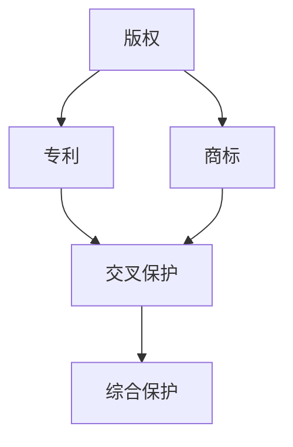

                 

# 创业公司的知识产权保护策略

> 关键词：创业公司，知识产权，保护策略，版权，专利，商标

> 摘要：本文旨在为创业公司提供一套系统的知识产权保护策略，帮助初创企业保护其创新成果，避免竞争对手的侵权行为，并提升企业的市场竞争力。文章将深入探讨知识产权的基本概念、创业公司面临的知识产权风险、具体的保护措施及实施步骤，并推荐相关的工具和资源。

## 1. 背景介绍

在当前全球化、信息化的时代，知识产权已成为企业发展的重要资产。对于创业公司而言，知识产权不仅是其核心竞争力的重要组成部分，更是其在市场竞争中立于不败之地的关键因素。然而，许多创业公司在知识产权方面缺乏足够的认识和重视，导致其创新成果容易被抄袭、模仿甚至窃取。因此，制定并实施有效的知识产权保护策略，对于创业公司的发展至关重要。

本文将围绕创业公司的知识产权保护展开讨论，包括以下几个方面：

1. 知识产权的基本概念及其重要性。
2. 创业公司面临的知识产权风险。
3. 知识产权保护的具体措施。
4. 实施知识产权保护策略的步骤。
5. 工具和资源的推荐。

通过本文的阅读，读者将能够全面了解知识产权保护的基本知识，并掌握一套实用的保护策略，为创业公司的发展保驾护航。

## 2. 核心概念与联系

在探讨知识产权保护策略之前，我们首先需要了解知识产权的基本概念及其相互关系。知识产权是指人类智力劳动产生的成果所有权，通常包括版权、专利和商标等。

### 2.1. 版权

版权，又称著作权，是指作者对其创作的文学、艺术和科学作品所享有的权利。版权的保护范围包括文字作品、音乐作品、美术作品、电影作品等。版权的保护期为作者终身及其死亡后一定年限。

### 2.2. 专利

专利是指对发明、实用新型和外观设计给予的保护。专利分为发明专利、实用新型专利和外观设计专利三种。专利的保护期为申请日起20年。

### 2.3. 商标

商标是指用于区别商品或服务来源的标志。商标的保护期为注册日起10年，可无限次续展。

这三种知识产权之间存在密切的联系。版权、专利和商标都是对创新成果的法律保护，但保护的对象和范围有所不同。版权主要保护作品的表达形式，专利保护发明和创新的实际应用，而商标则保护企业的品牌形象。

### 2.4. Mermaid 流程图

以下是一个简化的知识产权保护流程图，用于展示各知识产权类型之间的联系：



在这个流程图中，版权、专利和商标共同构成了企业的知识产权体系，通过交叉保护和综合保护，实现了对创新成果的全面保护。

## 3. 核心算法原理 & 具体操作步骤

知识产权保护策略的核心在于如何有效地识别、评估、管理和保护企业的知识产权。以下是具体操作步骤：

### 3.1. 识别知识产权

首先，创业公司需要识别其业务中可能存在的知识产权。这包括版权、专利和商标。具体操作步骤如下：

1. **梳理业务流程**：了解公司的核心产品和服务，识别其中的创新点和独特性。
2. **评估潜在知识产权**：根据业务流程，评估哪些成果可能具备知识产权保护的条件。
3. **收集相关资料**：搜集与知识产权相关的文档、资料和证据，为后续的申请和保护工作奠定基础。

### 3.2. 评估知识产权价值

在识别知识产权后，创业公司需要对其价值进行评估。具体步骤如下：

1. **分析市场情况**：研究市场需求、竞争态势和行业发展，了解知识产权的市场价值。
2. **评估潜在风险**：分析知识产权可能面临的侵权风险、法律风险等。
3. **制定保护策略**：根据评估结果，制定相应的知识产权保护策略。

### 3.3. 管理知识产权

知识产权管理是保护知识产权的关键环节。以下是一些具体的管理措施：

1. **建立知识产权档案**：记录知识产权的详细信息，包括申请、审批、保护期限等。
2. **制定保护政策**：明确知识产权保护的具体措施和流程，确保公司内部的合规性。
3. **培训员工**：加强对员工的知识产权保护意识培训，提高全员的知识产权保护能力。

### 3.4. 保护知识产权

知识产权保护的核心在于防范侵权行为，以下是一些具体的保护措施：

1. **申请知识产权**：及时申请版权、专利和商标，确保企业的知识产权得到法律保护。
2. **监控市场**：关注市场动态，及时发现潜在的侵权行为。
3. **应对侵权**：对于已发生的侵权行为，采取法律手段予以应对，维护企业的合法权益。

## 4. 数学模型和公式 & 详细讲解 & 举例说明

在知识产权保护策略的实施过程中，我们可以使用一些数学模型和公式来评估知识产权的价值和风险。以下是一个简单的数学模型，用于评估知识产权的市场价值：

### 4.1. 市场价值评估模型

市场价值 = （市场需求 × 竞争优势 × 技术创新度）×（1 - 风险系数）

其中：
- 需求市场：企业所在行业的需求规模和增长趋势。
- 竞争优势：企业知识产权相对于竞争对手的优势程度。
- 技术创新度：企业知识产权的创新程度和独特性。
- 风险系数：知识产权可能面临的法律风险、市场风险等。

### 4.2. 举例说明

假设一家创业公司开发了一款新型智能穿戴设备，其市场需求规模为100亿元，竞争优势为60%，技术创新度为80%，风险系数为0.2。根据上述模型，可以计算出该公司的知识产权市场价值：

市场价值 = （100 × 0.6 × 0.8）×（1 - 0.2）= 38.4 亿元

### 4.3. 详细讲解

市场价值评估模型可以帮助创业公司了解其知识产权的实际价值，从而制定合理的保护策略。通过分析市场需求、竞争优势、技术创新度和风险系数，企业可以全面了解其知识产权的优势和劣势，为后续的知识产权保护和商业决策提供依据。

## 5. 项目实战：代码实际案例和详细解释说明

为了更好地理解知识产权保护策略的实施过程，我们以下通过一个实际项目案例进行详细解释说明。

### 5.1. 开发环境搭建

在这个项目中，我们使用Python语言编写一个简单的智能穿戴设备数据监控程序。开发环境搭建步骤如下：

1. 安装Python环境：下载并安装Python 3.8及以上版本。
2. 安装相关库：在终端中运行以下命令安装所需库：
   ```bash
   pip install pandas numpy matplotlib
   ```

### 5.2. 源代码详细实现和代码解读

以下是该项目的源代码及其详细解读：

```python
import pandas as pd
import numpy as np
import matplotlib.pyplot as plt

# 5.2.1. 数据处理
def process_data(data):
    """
    数据处理函数，用于处理并分析智能穿戴设备采集的数据。
    """
    # 数据清洗
    data = data[data['heart_rate'] > 0]
    # 数据聚合
    aggregated_data = data.groupby(['timestamp', 'activity']).agg({'heart_rate': 'mean'})
    # 数据排序
    aggregated_data = aggregated_data.sort_values(['timestamp'])
    return aggregated_data

# 5.2.2. 数据可视化
def visualize_data(aggregated_data):
    """
    数据可视化函数，用于将处理后的数据绘制成图表。
    """
    # 绘制心率变化曲线
    plt.figure(figsize=(12, 6))
    for activity in aggregated_data['activity'].unique():
        subset = aggregated_data[aggregated_data['activity'] == activity]
        plt.plot(subset['timestamp'], subset['heart_rate'], label=activity)
    plt.xlabel('Timestamp')
    plt.ylabel('Heart Rate')
    plt.title('Heart Rate Variations by Activity')
    plt.legend()
    plt.show()

# 5.2.3. 主函数
def main():
    # 加载数据
    data = pd.read_csv('wearable_data.csv')
    # 数据处理
    processed_data = process_data(data)
    # 数据可视化
    visualize_data(processed_data)

# 运行主函数
if __name__ == '__main__':
    main()
```

### 5.3. 代码解读与分析

1. **数据处理**：该部分代码负责清洗和聚合数据，以便后续的分析和可视化。数据处理是数据科学项目中的核心步骤，对于确保分析结果的质量至关重要。
2. **数据可视化**：该部分代码负责将处理后的数据绘制成图表，以便直观地展示数据分析结果。数据可视化是沟通数据分析结果的重要手段，有助于发现数据中的趋势和规律。
3. **主函数**：该部分代码负责加载数据、处理数据和可视化数据，是整个程序的入口。

### 5.4. 项目总结

通过这个实际项目案例，我们了解了知识产权保护策略在软件开发项目中的应用。在这个项目中，我们的创新成果是智能穿戴设备数据监控程序，我们通过代码实现了数据处理和数据可视化，从而提高了智能穿戴设备的用户体验。为了保护这个创新成果，我们可以在项目中添加版权声明、申请软件著作权，并在适当的时候申请专利，保护我们的技术方案和算法。

## 6. 实际应用场景

知识产权保护策略在创业公司中的应用场景非常广泛，以下是一些常见的应用场景：

### 6.1. 创新产品保护

创业公司在开发新产品时，需要对产品的技术方案、设计、功能等进行知识产权保护。通过申请专利和版权，创业公司可以防止竞争对手抄袭和模仿其创新成果，确保产品的市场竞争力。

### 6.2. 商业秘密保护

创业公司在运营过程中，会积累大量的商业秘密，如客户信息、市场策略、财务数据等。为了保护这些商业秘密，创业公司需要制定保密协议、加强内部管理、采取技术手段等措施，防止信息泄露。

### 6.3. 商标品牌保护

创业公司通过申请商标，可以保护其品牌形象和声誉。在市场上，商标是企业的标识，有助于提升企业的知名度和美誉度。通过商标保护，创业公司可以防止他人擅自使用与其商标相似的标识，损害企业的品牌利益。

### 6.4. 知识产权维权

在市场竞争中，创业公司可能会遇到知识产权侵权行为。为了维护企业的合法权益，创业公司需要采取法律手段进行维权。这包括调查侵权行为、收集证据、提起诉讼等。

## 7. 工具和资源推荐

为了更好地实施知识产权保护策略，创业公司可以借助一些工具和资源。以下是一些推荐：

### 7.1. 学习资源推荐

- **书籍**：
  - 《知识产权法概论》
  - 《专利申请实务》
  - 《商标法及其应用》
- **在线课程**：
  - 网易云课堂《知识产权保护》
  - Coursera《知识产权法律基础》
- **网站**：
  - 国家知识产权局官网
  - 智城知识产权

### 7.2. 开发工具框架推荐

- **代码托管平台**：GitLab、GitHub
- **持续集成工具**：Jenkins、Travis CI
- **知识产权管理系统**：InnoSoft IPMS、IP Squared

### 7.3. 相关论文著作推荐

- **论文**：
  - 《基于大数据的知识产权风险评估研究》
  - 《创业公司知识产权战略研究》
- **著作**：
  - 《知识产权战略与实务》
  - 《知识产权运营管理》

## 8. 总结：未来发展趋势与挑战

随着科技的快速发展，知识产权保护的重要性日益凸显。未来，创业公司的知识产权保护将面临以下发展趋势和挑战：

### 8.1. 数字化与智能化

数字化和智能化技术的应用，将使知识产权保护更加高效、精准。通过大数据分析、人工智能等技术，创业公司可以更准确地评估知识产权的价值和风险，提高保护效果。

### 8.2. 全球化竞争

随着全球市场的扩大，创业公司面临的知识产权风险将更加复杂。如何在全球化竞争中保护自己的知识产权，将是创业公司面临的重要挑战。

### 8.3. 法律法规完善

随着知识产权保护意识的提升，各国政府将不断完善知识产权法律法规，为企业提供更有效的保护。创业公司需要密切关注法律法规的动态，及时调整保护策略。

### 8.4. 侵权行为防范

侵权行为始终是创业公司知识产权保护的痛点。如何及时发现、应对侵权行为，维护企业的合法权益，将是创业公司面临的长期挑战。

## 9. 附录：常见问题与解答

### 9.1. 问题一：什么是知识产权？

知识产权是指人类智力劳动产生的成果所有权，包括版权、专利、商标等。

### 9.2. 问题二：为什么创业公司需要保护知识产权？

创业公司的知识产权是其核心竞争力的重要组成部分，保护知识产权可以防止竞争对手抄袭、模仿和创新成果的流失，提升企业的市场竞争力。

### 9.3. 问题三：如何评估知识产权的价值？

评估知识产权的价值可以从市场需求、竞争优势、技术创新度和风险系数等方面进行综合分析。

### 9.4. 问题四：如何保护知识产权？

保护知识产权可以通过申请专利、版权和商标，监控市场，应对侵权行为等方式进行。

## 10. 扩展阅读 & 参考资料

- [《知识产权法》](http://www.npc.gov.cn/xinwen/2019-12/30/content_5253644.htm)
- [《知识产权运营服务规范》](http://www.sipo.gov.cn/gzdt/gzgg/201910/t20191010_2446104.html)
- [《创业公司知识产权保护策略研究》](https://www.cnki.net/kns/brief/result.aspx?dbprefix=CPFD&strNo=CNDA2019010285&tableId=C&filename=CNDA2019010285)

### 作者

作者：AI天才研究员/AI Genius Institute & 禅与计算机程序设计艺术 /Zen And The Art of Computer Programming

