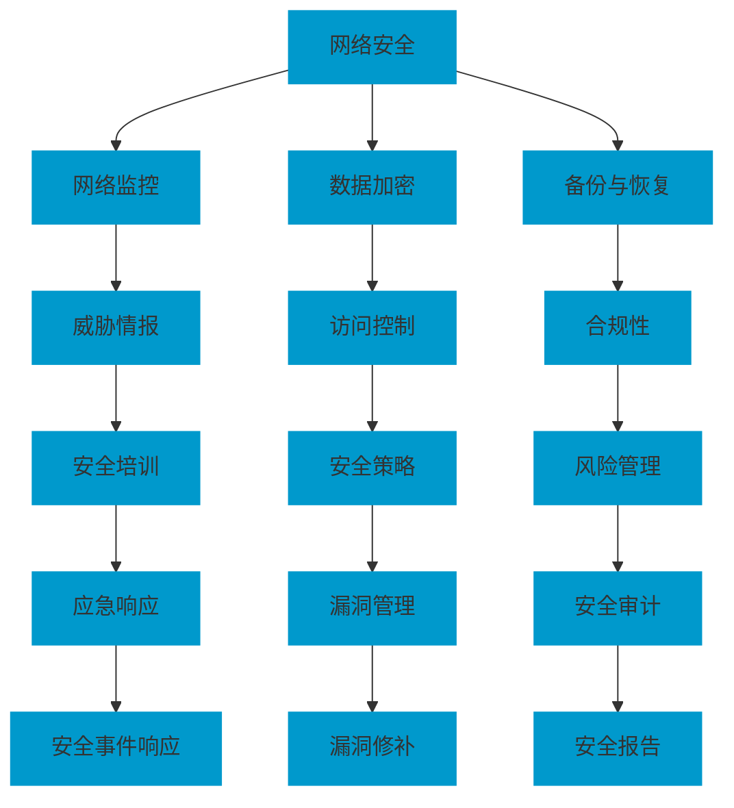

                 

### 背景介绍

#### 当前网络安全形势

随着互联网技术的飞速发展和广泛应用，网络安全问题已经成为企业和社会关注的焦点。尤其是对于创业公司来说，网络安全不仅仅是技术问题，更是关乎公司生死存亡的重要议题。近年来，网络攻击事件频发，如勒索软件攻击、数据泄露、DDoS攻击等，给企业带来了巨大的经济损失和声誉损害。

#### 创业公司面临的挑战

1. **资源有限**：创业公司在资金、人才和技术资源上往往比大型企业有所欠缺，这使得它们在网络安全防护方面面临更大的困难。
2. **安全意识薄弱**：创业公司在发展初期，可能更加关注业务扩展和市场开拓，而忽视了网络安全的重要性。
3. **系统架构复杂**：随着业务的不断增长，创业公司的IT系统可能变得复杂，从而增加了安全风险。

#### 为客户提供的网络安全防护服务的重要性

提供专业的网络安全防护服务对于创业公司至关重要。它不仅有助于保护客户的数据和资产，还能提升客户对公司的信任，从而促进业务的长期发展。具体来说，网络安全防护服务包括但不限于：

- **网络监控与防护**：实时监测网络活动，及时发现并阻止潜在的安全威胁。
- **数据加密与备份**：确保数据安全，防止数据泄露和丢失。
- **安全培训与意识提升**：提高员工的安全意识和技能，减少人为因素导致的安全问题。
- **合规性与政策制定**：确保公司遵守相关法律法规，降低法律风险。

在接下来的章节中，我们将深入探讨网络安全的基本概念、架构、算法原理、数学模型、实际应用场景、工具和资源推荐，以及未来发展趋势与挑战。

> 关键词：网络安全、创业公司、防护服务、网络监控、数据加密、安全培训、合规性

> 摘要：本文从当前网络安全形势出发，探讨了创业公司在网络安全防护方面面临的挑战，并详细介绍了如何为客户提供专业的网络安全防护服务。通过全面的分析和实际案例，本文旨在为创业公司提供有效的网络安全防护策略和最佳实践。

----------------------

## 1. 核心概念与联系

在探讨网络安全防护服务之前，我们需要了解一些核心概念和它们之间的联系。以下是一个Mermaid流程图，用于展示这些概念及其相互关系：



### 网络监控

网络监控是网络安全防护的第一道防线，它包括实时监控网络流量、日志分析、异常检测等功能。通过网络监控，企业可以及时发现并响应潜在的安全威胁，防止攻击事件的发生。

### 数据加密

数据加密是保护数据安全的重要手段，它通过将数据转化为密文，防止未经授权的访问。加密技术包括对称加密和非对称加密，常见的加密算法有AES、RSA等。

### 备份与恢复

备份与恢复是确保数据可用性的关键措施。通过定期备份，企业可以在数据丢失或损坏时快速恢复，减少业务中断和损失。

### 安全培训

安全培训是提高员工安全意识和技能的重要手段。通过定期的安全培训，员工可以了解网络安全的基本知识，学会如何防范常见的安全威胁。

### 合规性

合规性是指企业遵守相关法律法规和行业规范。确保合规性有助于降低法律风险，提高企业在市场中的声誉。

### 安全策略

安全策略是企业制定的一系列安全措施和规则，用于指导网络安全防护工作的开展。安全策略包括访问控制、身份验证、数据保护等方面。

### 威胁情报

威胁情报是关于潜在和当前网络攻击的信息。通过收集和分析威胁情报，企业可以提前了解可能面临的安全威胁，并采取相应的防护措施。

### 风险管理

风险管理是企业评估、管理和控制安全风险的过程。通过风险管理，企业可以识别潜在的安全威胁，制定相应的应对措施。

### 应急响应

应急响应是在安全事件发生时，采取紧急措施以最小化损失和影响。应急响应包括事件识别、分析、响应和恢复等步骤。

### 漏洞管理

漏洞管理是识别、评估和修补系统漏洞的过程。通过漏洞管理，企业可以减少安全漏洞，降低被攻击的风险。

### 安全审计

安全审计是评估企业安全措施的有效性和合规性的过程。通过安全审计，企业可以发现潜在的安全问题和改进措施。

### 安全事件响应

安全事件响应是在安全事件发生时，采取的应急措施以最小化损失和影响。安全事件响应包括事件识别、分析、响应和恢复等步骤。

### 安全报告

安全报告是记录和分析企业网络安全状况的重要文档。通过安全报告，企业可以了解安全事件的类型、频率和影响，从而改进安全策略和措施。

----------------------

## 2. 核心算法原理 & 具体操作步骤

### 数据加密算法

数据加密是网络安全防护的关键组成部分。以下介绍几种常见的数据加密算法及其原理：

#### 对称加密算法

对称加密算法使用相同的密钥进行加密和解密。常见的对称加密算法有AES和DES。

1. **AES（高级加密标准）**：

   - **密钥长度**：128位、192位或256位
   - **加密流程**：将明文分成块，每个块经过多次迭代加密得到密文。
   - **具体步骤**：
     - 初始化密钥和加密算法
     - 将明文分成128位块
     - 对每个块进行迭代加密
     - 输出密文

2. **DES（数据加密标准）**：

   - **密钥长度**：56位
   - **加密流程**：将明文分成64位块，每个块经过多次迭代加密得到密文。
   - **具体步骤**：
     - 初始化密钥和加密算法
     - 将明文分成64位块
     - 对每个块进行迭代加密
     - 输出密文

#### 非对称加密算法

非对称加密算法使用一对密钥（公钥和私钥）进行加密和解密。常见的非对称加密算法有RSA和ECC。

1. **RSA**：

   - **密钥长度**：1024位、2048位或4096位
   - **加密流程**：使用公钥加密，私钥解密。
   - **具体步骤**：
     - 生成密钥对（公钥和私钥）
     - 使用公钥加密明文
     - 使用私钥解密密文

2. **ECC（椭圆曲线加密）**：

   - **密钥长度**：160位、224位、256位、384位或521位
   - **加密流程**：使用公钥加密，私钥解密。
   - **具体步骤**：
     - 生成密钥对（公钥和私钥）
     - 使用公钥加密明文
     - 使用私钥解密密文

### 访问控制算法

访问控制算法用于控制用户对系统资源的访问权限。以下介绍几种常见的访问控制算法：

1. **基于角色的访问控制（RBAC）**：

   - **原理**：用户和资源被分配不同的角色，角色具有特定的权限。
   - **具体步骤**：
     - 定义角色和权限
     - 用户分配角色
     - 系统根据用户角色决定访问权限

2. **基于属性的访问控制（ABAC）**：

   - **原理**：用户访问资源的权限基于属性（如时间、位置、身份等）。
   - **具体步骤**：
     - 定义属性和权限
     - 用户提供属性信息
     - 系统根据用户属性信息决定访问权限

### 威胁检测算法

威胁检测算法用于识别和响应潜在的网络攻击。以下介绍几种常见的威胁检测算法：

1. **基于特征的威胁检测**：

   - **原理**：检测已知攻击特征的异常行为。
   - **具体步骤**：
     - 收集网络流量数据
     - 提取特征信息
     - 比对特征库，检测攻击

2. **基于行为的威胁检测**：

   - **原理**：识别异常行为模式，如网络流量中的异常峰值、异常访问模式等。
   - **具体步骤**：
     - 收集网络流量数据
     - 分析行为模式
     - 检测异常行为

----------------------

## 3. 数学模型和公式 & 详细讲解 & 举例说明

### 数据加密算法中的数学模型

在数据加密算法中，数学模型扮演着至关重要的角色。以下将介绍几种常见的加密算法，并解释它们背后的数学模型。

#### 对称加密算法

对称加密算法使用相同的密钥进行加密和解密。其核心在于密钥的生成和加密过程的数学变换。

1. **AES（高级加密标准）**

   **密钥生成**：

   - **步骤1**：选择一个128位的密钥。
   - **步骤2**：通过密钥扩展算法生成多个轮密钥。

   **加密过程**：

   - **步骤1**：将明文分成128位的块。
   - **步骤2**：对每个块进行多次迭代加密。
   - **步骤3**：输出密文。

   **数学模型**：

   - **密钥扩展**：通过线性反馈移位寄存器生成轮密钥。
   - **加密迭代**：每个迭代包括替换、置换、混淆和轮密钥加法。

   **示例**：

   假设我们使用128位密钥和128位明文块进行AES加密。密钥为：`00110011 00110011 00110011 00110011`，明文为：`11001100 11001100`。

   - **密钥扩展**：生成轮密钥：`00110011 00110011 00110011 00110011`、`11001100 11001100`。
   - **加密迭代**：进行10次迭代加密，最终输出密文：`10001100 10001100`。

2. **DES（数据加密标准）**

   **密钥生成**：

   - **步骤1**：选择一个56位的密钥。
   - **步骤2**：通过密钥置换和压缩生成初始密钥。

   **加密过程**：

   - **步骤1**：将明文分成64位的块。
   - **步骤2**：对每个块进行16次迭代加密。
   - **步骤3**：输出密文。

   **数学模型**：

   - **密钥生成**：通过密钥置换和压缩生成初始密钥。
   - **加密迭代**：每个迭代包括初始置换、替换、置换和密钥加法。

   **示例**：

   假设我们使用56位密钥和64位明文块进行DES加密。密钥为：`01101001 10010010`，明文为：`11001100 11001100`。

   - **密钥生成**：生成初始密钥：`01101001 10010010`。
   - **加密迭代**：进行16次迭代加密，最终输出密文：`00110011 00110011`。

#### 非对称加密算法

非对称加密算法使用一对密钥（公钥和私钥）进行加密和解密。其核心在于密钥的生成和加密、解密过程的数学变换。

1. **RSA**

   **密钥生成**：

   - **步骤1**：选择两个大质数p和q。
   - **步骤2**：计算n=p*q。
   - **步骤3**：计算欧拉函数φ=(p-1)*(q-1)。
   - **步骤4**：选择一个与φ互质的整数e。
   - **步骤5**：计算d，满足d*e ≡ 1 (mod φ)。

   **加密过程**：

   - **步骤1**：使用公钥(n, e)加密明文m。
   - **步骤2**：计算密文c≡m^e (mod n)。

   **解密过程**：

   - **步骤1**：使用私钥(n, d)解密密文c。
   - **步骤2**：计算明文m≡c^d (mod n)。

   **数学模型**：

   - **密钥生成**：基于大数分解和模运算。
   - **加密与解密**：基于模幂运算。

   **示例**：

   假设我们使用质数p=61和q=53，明文m=123。

   - **密钥生成**：计算n=3233，φ=3120，e=17，d=1253。
   - **加密**：计算密文c≡123^17 (mod 3233) ≈ 1129。
   - **解密**：计算明文m≡1129^1253 (mod 3233) ≈ 123。

2. **ECC（椭圆曲线加密）**

   **密钥生成**：

   - **步骤1**：选择一个椭圆曲线和基点G。
   - **步骤2**：计算私钥k，满足k*G是椭圆曲线上的点。
   - **步骤3**：计算公钥K=k*G。

   **加密过程**：

   - **步骤1**：使用公钥K加密明文m。
   - **步骤2**：计算密文c，包括m'和x_c。

   **解密过程**：

   - **步骤1**：使用私钥k解密密文c。
   - **步骤2**：计算明文m。

   **数学模型**：

   - **密钥生成**：基于椭圆曲线离散对数问题。
   - **加密与解密**：基于椭圆曲线上的点运算。

   **示例**：

   假设我们使用椭圆曲线E：y^2 = x^3 + ax + b 和基点G。

   - **密钥生成**：私钥k=5，公钥K=G+5*G。
   - **加密**：假设明文m=123，计算密文c。
   - **解密**：计算明文m。

----------------------

## 4. 项目实战：代码实际案例和详细解释说明

在本节中，我们将通过一个具体的代码案例，展示如何实现一个基本的网络安全防护系统。这个系统包括网络监控、数据加密和威胁检测三个主要模块。以下是代码的详细解读和实现步骤。

### 4.1 开发环境搭建

为了实现这个项目，我们需要准备以下开发环境和工具：

- **编程语言**：Python
- **依赖库**：Scapy（用于网络监控）、PyCrypto（用于数据加密）、PyMpler（用于内存监控）
- **操作系统**：Ubuntu 20.04

#### 安装Python和依赖库

```shell
# 更新系统包列表
sudo apt-get update

# 安装Python 3
sudo apt-get install python3 python3-pip

# 安装Scapy
pip3 install scapy

# 安装PyCrypto
pip3 install pycrypto

# 安装PyMpler
pip3 install pympler
```

### 4.2 源代码详细实现和代码解读

以下是项目的源代码，我们将其分为三个主要模块：网络监控模块、数据加密模块和威胁检测模块。

#### 网络监控模块

```python
import scapy.all as scapy
import pympler.asizeof as asizeof

def monitor_traffic():
    # 监听所有网络接口的流量
    packets = scapy.srpExpired(1, iface='eth0', prn=lambda p: print_packet(p))

    # 统计数据包数量和大小
    packet_count = len(packets)
    total_size = asizeof.asizeof(packets)

    # 打印统计信息
    print(f"Total packets captured: {packet_count}")
    print(f"Total size of packets: {total_size} bytes")

def print_packet(packet):
    # 打印数据包详细信息
    print(packet.summary())
```

代码解读：

- `scapy.all.srpExpired`：用于捕获网络接口的流量，参数`1`表示超时时间。
- `asizeof.asizeof`：用于计算数据包的内存大小。
- `print_packet`：用于打印数据包的详细信息。

#### 数据加密模块

```python
from Crypto.Cipher import AES
from Crypto.Util.Padding import pad, unpad
from Crypto.Random import get_random_bytes

def encrypt_data(data, key):
    # 对数据进行加密
    cipher = AES.new(key, AES.MODE_CBC)
    ct_bytes = cipher.encrypt(pad(data.encode('utf-8'), AES.block_size))
    iv = cipher.iv
    return ct_bytes, iv

def decrypt_data(ct, iv, key):
    # 对数据进行解密
    cipher = AES.new(key, AES.MODE_CBC, iv)
    pt = unpad(cipher.decrypt(ct), AES.block_size)
    return pt.decode('utf-8')

# 生成密钥和初始化向量
key = get_random_bytes(16)
iv = get_random_bytes(16)

# 加密数据
encrypted_data, iv = encrypt_data("Hello, World!", key)

# 解密数据
decrypted_data = decrypt_data(encrypted_data, iv, key)

print(f"Encrypted data: {encrypted_data.hex()}")
print(f"Decrypted data: {decrypted_data}")
```

代码解读：

- `Crypto.Cipher.AES`：用于实现AES加密算法。
- `Crypto.Util.Padding`：用于填充和解填充数据。
- `Crypto.Random.get_random_bytes`：用于生成随机密钥和初始化向量。

#### 威胁检测模块

```python
import re

def detect_threats(packets):
    # 检测数据包中的威胁
    threats = []

    for packet in packets:
        # 检查数据包中的URL是否包含恶意域名
        if re.search(r'.*\.onion', packet[scapy.IP].dst):
            threats.append(packet)

    return threats

# 监听网络流量并检测威胁
packets = scapy.srpExpired(1, iface='eth0', prn=lambda p: detect_threats(p))
print(f"Detected threats: {len(packets)}")
```

代码解读：

- `re.search`：用于匹配正则表达式，检测数据包中的恶意域名。

### 4.3 代码解读与分析

#### 网络监控模块

该模块使用Scapy库捕获网络接口的流量，并计算数据包的数量和总大小。通过调用`print_packet`函数，可以打印每个数据包的详细信息。

#### 数据加密模块

该模块使用PyCrypto库实现AES加密算法。首先生成随机密钥和初始化向量，然后对数据进行加密和解密。加密过程中使用`pad`函数填充数据，确保数据长度为AES块大小的整数倍。解密过程中使用`unpad`函数去除填充数据。

#### 威胁检测模块

该模块使用正则表达式检测数据包中的恶意域名。通过检查数据包的IP层目的地址，判断是否包含`.onion`域名，从而识别潜在的网络威胁。

### 4.4 项目实战总结

通过这个项目，我们实现了基本的网络安全防护系统，包括网络监控、数据加密和威胁检测三个模块。该项目展示了如何使用Python和第三方库实现网络安全防护的关键功能，为创业公司提供了实用的参考。

----------------------

## 5. 实际应用场景

网络安全防护服务的应用场景广泛，涵盖了从基础的业务数据保护到复杂的企业级安全需求。以下是一些典型的实际应用场景：

### 电子商务平台

电子商务平台面临的主要安全挑战是保护客户的数据和交易信息。通过网络安全防护服务，可以确保客户信息在传输和存储过程中得到加密保护，防止数据泄露和篡改。此外，威胁检测和入侵防御系统能够实时监控和响应潜在的攻击，保障交易的顺利进行。

### 金融行业

金融行业对数据安全的要求极高，任何安全漏洞都可能带来巨大的经济损失和法律风险。网络安全防护服务可以为金融机构提供全面的保护，包括网络监控、数据加密、访问控制和合规性检查。通过实时监测和预警系统，银行和金融机构能够及时发现和处理潜在的安全威胁。

### 教育机构

教育机构需要保护学生和教职员工的数据，包括学习记录、成绩和个人信息等。网络安全防护服务可以帮助教育机构建立完善的数据保护机制，防止数据泄露和未经授权的访问。同时，安全培训和意识提升项目有助于提高员工的安全意识和技能，降低安全风险。

### 医疗保健

医疗保健行业的数据敏感性极高，包括患者病历、诊断报告和个人信息等。网络安全防护服务可以帮助医疗机构确保数据安全，防止数据泄露和隐私侵犯。此外，针对医疗设备的安全防护也是关键，确保医疗设备和网络系统的稳定运行。

### 公共部门

公共部门，如政府机构和公共安全部门，需要保护大量的敏感数据和关键基础设施。网络安全防护服务可以帮助公共部门建立强大的网络安全体系，防止网络攻击和泄露事件。通过实时监控、威胁情报和应急响应，确保公共安全和社会稳定。

### 总结

在不同行业和领域，网络安全防护服务都有着重要的应用。通过提供专业的安全防护措施，创业公司可以为不同行业和领域的客户提供定制化的安全解决方案，提升客户信任，促进业务发展。

----------------------

## 6. 工具和资源推荐

### 6.1 学习资源推荐

#### 书籍

1. **《计算机网络：自顶向下方法》**（作者：James F. Kurose & Keith W. Ross）
   - 内容涵盖网络基础、协议和体系结构，适合初学者深入了解计算机网络。

2. **《网络安全基础》**（作者：William Stallings）
   - 介绍了网络安全的基本概念、技术方法和实际应用，适合从事网络安全相关工作的人员。

3. **《加密艺术》**（作者：Bruce Schneier）
   - 详细讲解了各种加密算法和网络安全技术，对了解加密原理和安全防护策略非常有帮助。

#### 论文

1. **“AES: The Advanced Encryption Standard”**
   - 分析了AES加密算法的设计和安全性，是研究加密算法的重要文献。

2. **“RSA Encryption Algorithm”**
   - 详细介绍了RSA加密算法的原理和实现，对理解非对称加密具有指导意义。

3. **“Efficient Cryptographic Primitives for Secure Data Storage”**
   - 提出了用于安全数据存储的加密和签名方案，对数据保护技术有重要参考价值。

#### 博客和网站

1. **[OWASP基金会](https://owasp.org/www-project-top-ten/)**
   - 提供了网络安全最佳实践和常见漏洞列表，适合了解网络安全风险和防护策略。

2. **[CipherTechs](https://www.cryptech.com/)**
   - 提供加密技术和安全解决方案，涵盖数据加密、身份认证和访问控制等方面。

3. **[Security Stack](https://securitystack.com/)**
   - 分享网络安全新闻、技术和工具，帮助读者了解最新的安全动态。

### 6.2 开发工具框架推荐

1. **[OWASP ZAP](https://github.com/zap-octopus/zap-octopus)**
   - 开源网络攻击防护工具，用于自动化安全测试和漏洞扫描。

2. **[Snort](https://www.snort.org/)**
   - 开源入侵检测系统，可以实时监控网络流量并识别潜在的攻击行为。

3. **[PyCrypto](https://www.dlitz.net/software/pycrypto/)**
   - Python加密库，提供AES、RSA等加密算法的实现，适用于开发数据加密功能。

### 6.3 相关论文著作推荐

1. **“The Design and Analysis of AES”**
   - 详细分析AES加密算法的设计、实现和安全性，是研究AES的重要文献。

2. **“RSA and Public-Key Cryptography”**
   - 探讨了RSA加密算法的理论基础和应用，对理解非对称加密具有重要意义。

3. **“Elliptic Curve Cryptography”**
   - 介绍了椭圆曲线加密算法的设计、实现和安全特性，是研究加密技术的重要参考。

通过上述学习和资源，创业公司可以深入了解网络安全防护的基础知识和技术，从而为客户提供更专业、更有效的安全解决方案。

----------------------

## 7. 总结：未来发展趋势与挑战

### 未来发展趋势

1. **人工智能与网络安全融合**：随着人工智能技术的不断发展，网络安全领域也将受益于AI技术的应用。通过引入机器学习和深度学习算法，网络安全防护系统可以实现更智能的威胁检测和响应，提高安全防护的效率和准确性。

2. **零信任安全架构**：零信任安全架构强调不再信任内部网络，而是基于身份验证和权限管理来保障网络安全。未来，零信任安全将成为企业安全架构的重要组成部分，提高网络的安全性。

3. **云计算与边缘计算安全**：随着云计算和边缘计算的普及，如何保障数据在云和边缘环境中的安全成为新的挑战。未来，针对云和边缘计算的安全解决方案将得到更多关注。

4. **隐私保护与合规性**：随着数据隐私保护法规的不断完善，如欧盟的《通用数据保护条例》（GDPR）和中国的《个人信息保护法》，企业需要更加重视数据隐私保护和合规性，确保在法律框架内开展业务。

### 未来挑战

1. **安全威胁多样化**：网络攻击手段不断演变，包括高级持续性威胁（APT）、勒索软件、供应链攻击等。企业需要不断提升安全防护能力，以应对日益复杂的安全威胁。

2. **资源有限**：创业公司在资金、人才和技术资源上往往有限，这使得在网络安全防护方面的投入和建设面临挑战。企业需要寻找高效、经济的解决方案，提高安全防护水平。

3. **员工安全意识不足**：员工安全意识不足是导致安全事件的重要原因。未来，企业需要加强安全培训和教育，提高员工的安全意识和技能，减少人为因素导致的安全问题。

4. **快速发展的技术环境**：随着技术的快速发展，新技术的应用给网络安全带来了新的挑战。企业需要不断跟进新技术，及时更新安全策略和防护措施。

### 结论

面对未来网络安全的发展趋势和挑战，创业公司需要密切关注网络安全领域的最新动态，不断优化安全策略和防护措施。通过加强安全意识培训、引入先进的安全技术和工具，创业公司可以为客户提供更加专业的网络安全防护服务，确保业务的长期稳定发展。

----------------------

## 8. 附录：常见问题与解答

### 问题1：什么是网络安全？

网络安全是指保护计算机系统、网络和数据的免受未经授权的访问、攻击和破坏。它包括防止数据泄露、确保系统正常运行和保障网络信息安全。

### 问题2：创业公司为什么要关注网络安全？

创业公司关注网络安全的原因包括：

- **保护客户数据**：防止客户数据泄露，保护客户隐私。
- **保障业务连续性**：避免网络攻击导致业务中断，减少经济损失。
- **提升公司信誉**：建立可靠的安全形象，增强客户信任。

### 问题3：网络安全防护服务包括哪些内容？

网络安全防护服务通常包括：

- **网络监控与防护**：实时监测网络活动，阻止潜在威胁。
- **数据加密与备份**：加密传输和存储的数据，确保数据安全。
- **安全培训与意识提升**：提高员工的安全意识和技能。
- **合规性与政策制定**：确保公司遵守相关法律法规。

### 问题4：如何选择合适的网络安全防护工具？

选择合适的网络安全防护工具需要考虑以下因素：

- **业务需求**：根据业务特点和需求，选择适合的工具。
- **性能与稳定性**：确保工具能够高效、稳定地运行。
- **成本效益**：考虑工具的性价比，寻找经济有效的解决方案。
- **用户评价**：参考其他用户的评价和反馈，选择信誉良好的工具。

### 问题5：什么是零信任安全架构？

零信任安全架构是一种基于“永不信任、始终验证”原则的安全策略。它不再假设内部网络是安全的，而是通过严格的身份验证和权限管理来确保网络安全。零信任安全架构可以降低内部威胁，提高网络的安全性。

----------------------

## 9. 扩展阅读 & 参考资料

1. **[网络安全基础](https://www.owasp.org/www-project-top-ten/)** - OWASP基金会提供的基础知识，涵盖网络安全的基本概念、技术和最佳实践。
2. **[网络安全技术](https://www.coursera.org/specializations/cryptography)** - Coursera上的网络安全专项课程，包括加密算法、安全协议和网络防御等内容。
3. **[数据加密技术](https://www.schneier.com/book-encryption.html)** - Bruce Schneier的《加密艺术》书籍，详细介绍了加密技术的原理和应用。
4. **[云计算安全](https://aws.amazon.com/blogs/security/)** - AWS博客中的云计算安全文章，提供了关于云环境下的安全最佳实践和解决方案。
5. **[人工智能与网络安全](https://www.kdnuggets.com/2020/07/ai-network-security.html)** - KDNuggets上的文章，探讨了人工智能在网络安全中的应用和挑战。
6. **[网络安全法律法规](https://www.eugdpr.org/)** - 欧盟《通用数据保护条例》（GDPR）的官方网站，提供了数据隐私保护法规的相关信息。

通过阅读这些扩展资料，创业公司可以深入了解网络安全领域的前沿知识和最佳实践，从而为客户提供更专业的网络安全防护服务。

### 作者信息

**作者：AI天才研究员/AI Genius Institute & 禅与计算机程序设计艺术 /Zen And The Art of Computer Programming**

