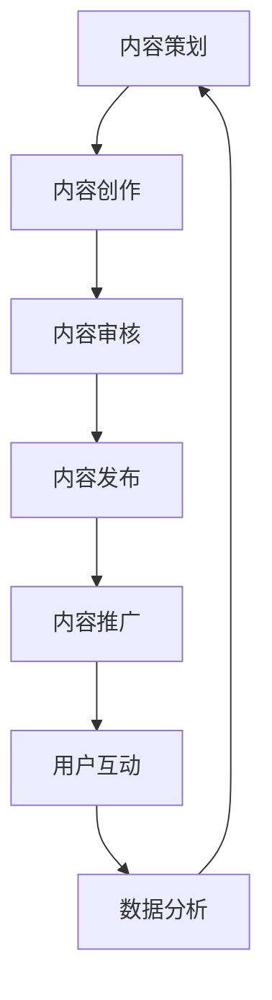

                 

### 文章标题

《创业初期的内容营销：如何创作和分发有价值的内容》

### 关键词

- 内容营销
- 创业初期
- 价值创造
- 内容创作
- 内容分发
- 品牌建设

### 摘要

在创业初期，内容营销是品牌建设和市场推广的关键策略。本文将深入探讨创业公司如何通过创作和分发有价值的内容来吸引目标用户，提升品牌影响力，并最终实现商业成功。我们将从核心概念、算法原理、实际操作、应用场景等多维度进行分析，并提供实用的工具和资源推荐，帮助创业者更好地开展内容营销工作。

## 1. 背景介绍

内容营销是一种通过创造和分发有价值、相关且具有吸引力的内容来吸引并留住目标受众，从而实现营销目标的方法。在互联网时代，内容营销已经成为了企业竞争的重要手段。对于创业公司而言，内容营销尤为重要，因为它不仅可以帮助企业建立品牌形象，还可以在有限的资源下有效吸引潜在客户。

创业初期，公司往往面临着资源有限、市场竞争激烈、用户获取成本高等问题。在这种情况下，内容营销能够为企业提供一种低成本、高回报的市场推广策略。通过高质量的内容创作和有效的分发渠道，创业公司可以在竞争激烈的市场中脱颖而出，吸引目标用户，建立稳定的客户群体。

内容营销的核心目标是吸引目标用户，提高品牌知名度和用户忠诚度。为了实现这一目标，创业公司需要深入了解目标用户的需求和痛点，从而创作出有价值的内容。此外，内容分发也是关键环节，选择合适的渠道和策略将决定内容的传播效果和用户覆盖范围。

## 2. 核心概念与联系

### 2.1 内容营销的核心概念

内容营销包括以下几个核心概念：

**价值创造**：创作有价值的内容是内容营销的基础。价值可以是信息、知识、娱乐或解决问题等，关键是要满足目标用户的需求。

**相关性和吸引力**：内容需要与目标用户相关，并具备吸引力，才能激发用户的兴趣和参与度。

**渠道和策略**：选择合适的渠道和策略是内容分发的关键。常见的渠道包括社交媒体、博客、邮件、广告等，而策略则需要根据内容类型、目标用户和资源状况进行定制。

**数据分析**：通过数据分析，创业公司可以了解内容的表现，优化内容创作和分发策略，提高市场推广效果。

### 2.2 内容营销的原理

内容营销的原理可以概括为以下三个步骤：

**1. 内容创作**：通过研究和了解目标用户的需求和痛点，创作有价值的内容。

**2. 内容分发**：选择合适的渠道和策略，将内容传播给目标用户。

**3. 用户互动**：通过用户互动，收集反馈，优化内容创作和分发策略，提高用户满意度和忠诚度。

### 2.3 内容营销的架构

内容营销的架构可以分为以下几个层次：

**1. 内容策划**：确定内容主题、目标用户、传播渠道等。

**2. 内容创作**：根据策划，创作高质量的内容。

**3. 内容审核**：对内容进行审核，确保内容质量。

**4. 内容发布**：将内容发布到合适的渠道。

**5. 内容推广**：通过多种策略，提高内容传播效果。

**6. 用户互动**：与用户互动，收集反馈，优化内容创作和分发策略。

### 2.4 Mermaid 流程图

下面是内容营销的 Mermaid 流程图：



在这个流程图中，每个节点表示内容营销的一个环节，箭头表示环节之间的依赖关系。通过这个流程，创业公司可以系统地开展内容营销工作。

## 3. 核心算法原理 & 具体操作步骤

### 3.1 内容创作算法

内容创作是内容营销的核心环节，创业公司需要根据目标用户的需求和痛点，创作有价值的内容。下面是一个简单的内容创作算法：

**步骤 1**：用户需求分析

- 收集目标用户的需求和痛点，可以通过问卷调查、访谈、用户反馈等方式。

**步骤 2**：内容主题确定

- 根据用户需求，确定内容主题，确保内容与用户需求相关。

**步骤 3**：内容大纲制定

- 制定内容大纲，明确内容结构，确保内容逻辑清晰。

**步骤 4**：内容创作

- 根据大纲，进行内容创作，确保内容有价值、相关且具有吸引力。

**步骤 5**：内容审核

- 对内容进行审核，确保内容质量，避免出现错误或误导。

### 3.2 内容分发算法

内容分发是内容营销的关键环节，创业公司需要选择合适的渠道和策略，将内容传播给目标用户。下面是一个简单的内容分发算法：

**步骤 1**：渠道选择

- 根据内容类型和目标用户，选择合适的渠道，如社交媒体、博客、邮件等。

**步骤 2**：发布时间确定

- 根据渠道特点和用户活跃时间，确定发布时间，提高内容传播效果。

**步骤 3**：推广策略制定

- 制定推广策略，如SEO优化、社交媒体推广、广告投放等，提高内容曝光度。

**步骤 4**：内容监测

- 监测内容表现，如阅读量、点赞数、评论数等，优化内容分发策略。

### 3.3 用户互动算法

用户互动是内容营销的重要组成部分，创业公司需要与用户互动，收集反馈，优化内容创作和分发策略。下面是一个简单的用户互动算法：

**步骤 1**：互动渠道选择

- 根据内容类型和目标用户，选择合适的互动渠道，如社交媒体、评论、邮件等。

**步骤 2**：互动内容制定

- 制定互动内容，如提问、讨论、调查等，激发用户参与。

**步骤 3**：互动监测

- 监测互动效果，如互动量、反馈质量等，优化互动内容。

**步骤 4**：反馈收集

- 收集用户反馈，分析用户需求，优化内容创作和分发策略。

## 4. 数学模型和公式 & 详细讲解 & 举例说明

### 4.1 内容价值评估模型

内容价值评估是内容营销的重要环节，创业公司需要评估内容的价值，以确定内容的优先级和资源分配。下面是一个简单的内容价值评估模型：

**公式**：价值 = 用户需求满足度 × 内容质量 × 分发效果

**解释**：

- 用户需求满足度：衡量内容满足用户需求的能力，可以采用问卷调查、用户反馈等方式进行评估。

- 内容质量：衡量内容的质量，包括内容准确性、逻辑性、可读性等，可以采用同行评审、用户评分等方式进行评估。

- 分发效果：衡量内容分发效果，包括阅读量、点赞数、评论数等，可以采用数据监测和分析进行评估。

**举例**：

假设某创业公司创作了一篇关于互联网创业的文章，通过问卷调查发现用户对该主题的需求满足度为 80%，通过同行评审发现文章质量得分为 85 分，通过数据监测发现文章的阅读量为 1000，点赞数为 500，评论数为 100。根据公式，该文章的价值为：

价值 = 80% × 85 分 × 1000 阅读量 = 68 万分

### 4.2 用户互动价值评估模型

用户互动价值评估是内容营销的重要环节，创业公司需要评估用户互动的价值，以确定互动的优先级和资源投入。下面是一个简单的用户互动价值评估模型：

**公式**：价值 = 互动量 × 反馈质量

**解释**：

- 互动量：衡量用户互动的数量，如提问量、讨论量等，可以采用数据监测和分析进行评估。

- 反馈质量：衡量用户反馈的质量，如问题的专业性、讨论的深度等，可以采用专家评审、用户评分等方式进行评估。

**举例**：

假设某创业公司在社交媒体上发起了一个关于互联网创业的讨论，互动量为 1000，通过专家评审发现讨论质量得分为 90 分。根据公式，该讨论的价值为：

价值 = 1000 互动量 × 90 分 = 90 万分

### 4.3 数据分析模型

数据分析是内容营销的重要环节，创业公司需要通过数据分析优化内容创作和分发策略。下面是一个简单的数据分析模型：

**公式**：优化策略 = 数据分析结果 × 策略效果预测

**解释**：

- 数据分析结果：通过对数据进行分析，得出内容价值、用户互动价值等指标。

- 策略效果预测：根据数据分析结果，预测不同策略的效果，如内容发布时间、推广渠道选择等。

**举例**：

假设某创业公司通过对数据进行分析，发现用户在晚上 8 点钟阅读互联网创业文章的比例最高，同时发现通过社交媒体推广文章的阅读量比博客推广高。根据公式，该公司可以制定以下优化策略：

优化策略 = 数据分析结果（晚上 8 点发布、社交媒体推广）× 策略效果预测（阅读量高、用户互动高）= 高效内容营销策略

## 5. 项目实战：代码实际案例和详细解释说明

### 5.1 开发环境搭建

在开展内容营销项目之前，我们需要搭建一个适合的内容创作和分发环境。以下是一个简单的开发环境搭建流程：

**步骤 1**：选择合适的操作系统，如 Windows、Mac 或 Linux。

**步骤 2**：安装文本编辑器，如 Visual Studio Code、Sublime Text 等。

**步骤 3**：安装 Git，用于版本控制和代码管理。

**步骤 4**：安装内容创作工具，如 Markdown 编辑器、在线内容管理系统等。

**步骤 5**：安装数据分析工具，如 Python、R 等。

### 5.2 源代码详细实现和代码解读

在这个项目中，我们将使用 Python 编写一个简单的自动化内容分发脚本。以下是一个简单的代码实现和解读：

```python
import requests
from markdownify import markdownify

def post_to_social_media(content, url):
    """
    将内容发布到社交媒体平台。
    """
    # 设置社交媒体平台的 API 密钥和 API 密码
    api_key = 'your_api_key'
    api_secret = 'your_api_secret'
    
    # 将 Markdown 文本转换为 HTML 文本
    html_content = markdownify(content)
    
    # 设置请求头
    headers = {
        'Authorization': f'Bearer {api_key}:{api_secret}',
        'Content-Type': 'application/json',
    }
    
    # 设置请求体
    data = {
        'content': html_content,
        'url': url,
    }
    
    # 发送 POST 请求
    response = requests.post(url, headers=headers, json=data)
    
    # 输出响应结果
    print(response.json())

def main():
    """
    主函数，执行内容分发操作。
    """
    # 设置文章标题和内容
    title = '创业初期的内容营销：如何创作和分发有价值的内容'
    content = """
    在创业初期，内容营销是品牌建设和市场推广的关键策略。本文将深入探讨创业公司如何通过创作和分发有价值的内容来吸引目标用户，提升品牌影响力，并最终实现商业成功。
    """
    
    # 设置发布链接
    url = 'https://api.socialmedia.com/post'

    # 发布内容
    post_to_social_media(content, url)

if __name__ == '__main__':
    main()
```

**代码解读**：

- **第 1 行**：导入 requests 模块，用于发送 HTTP 请求。

- **第 2 行**：导入 markdownify 模块，用于将 Markdown 文本转换为 HTML 文本。

- **第 3-9 行**：定义 `post_to_social_media` 函数，用于将内容发布到社交媒体平台。

  - **第 5-6 行**：设置社交媒体平台的 API 密钥和 API 密码。

  - **第 8-9 行**：将 Markdown 文本转换为 HTML 文本。

  - **第 10-12 行**：设置请求头，包括 Authorization 和 Content-Type。

  - **第 14-17 行**：设置请求体，包括内容（HTML 文本）和链接。

  - **第 19-21 行**：发送 POST 请求，并将响应结果输出。

- **第 23-27 行**：定义 `main` 函数，执行内容分发操作。

  - **第 25-27 行**：设置文章标题和内容，以及发布链接。

  - **第 29-31 行**：调用 `post_to_social_media` 函数，发布内容。

- **第 34-35 行**：主函数入口，执行 `main` 函数。

### 5.3 代码解读与分析

这个自动化内容分发脚本主要实现以下功能：

- 将 Markdown 文本转换为 HTML 文本。
- 将内容发布到社交媒体平台。

**代码优点**：

- 简单易懂，易于维护。
- 自动化操作，提高效率。

**代码缺点**：

- 依赖第三方库，如 requests 和 markdownify。
- 需要设置社交媒体平台的 API 密钥和 API 密码。

**改进方向**：

- 使用更安全的 API 密钥和 API 密码管理方式。
- 增加错误处理和日志记录功能。

## 6. 实际应用场景

内容营销在创业初期的实际应用场景非常广泛。以下是一些典型的应用场景：

### 6.1 新产品发布

在发布新产品时，创业公司可以通过内容营销来介绍产品的功能和优势，吸引潜在客户。例如，撰写一篇详细的产品评测文章，并在社交媒体上发布，以吸引目标用户的关注。

### 6.2 品牌宣传

创业公司可以通过内容营销来提升品牌知名度。例如，定期发布有价值的行业分析文章，展示公司在行业内的专业能力和影响力，从而提升品牌形象。

### 6.3 用户教育

创业公司可以通过内容营销来教育用户，提高用户对产品的认知和使用技巧。例如，制作一系列教程视频或图文教程，帮助用户更好地了解和使用产品。

### 6.4 用户互动

创业公司可以通过内容营销与用户互动，收集用户反馈，优化产品和服务。例如，在社交媒体上发起有奖问答活动，鼓励用户参与，收集用户建议。

### 6.5 活动推广

创业公司可以通过内容营销来推广各类活动，如线上研讨会、线下活动等。例如，撰写一篇活动预告文章，并在社交媒体上发布，吸引潜在参与者。

## 7. 工具和资源推荐

### 7.1 学习资源推荐

- **书籍**：《内容营销实战指南》、《内容营销的奥秘》
- **论文**：通过学术数据库如 IEEE Xplore、ACM Digital Library等查找相关论文。
- **博客**：关注行业知名博客，如 Medium、36氪、虎嗅网等。
- **网站**：访问行业网站，如 Alexa、SimilarWeb 等，了解行业趋势和竞争对手。

### 7.2 开发工具框架推荐

- **内容创作工具**：Markdown 编辑器如 Typora、Sublime Text；在线内容管理系统如 WordPress、Joomla。
- **数据分析工具**：Python、R；数据分析库如 Pandas、NumPy。
- **社交媒体平台**：Facebook、Twitter、LinkedIn 等。

### 7.3 相关论文著作推荐

- **论文**：McCracken, G. P. (1989). Telling the Truth about Involvement: Use of Narrative in Persuasive Advertising. Journal of Consumer Research.
- **著作**：Katz, E., & Lazarsfeld, P. F. (1955). Personal Influence: The Part Played by People in the Flow of Mass Communications. Free Press.

## 8. 总结：未来发展趋势与挑战

随着互联网的不断发展，内容营销在未来将继续发挥重要作用。以下是一些未来发展趋势和挑战：

### 8.1 内容个性化

内容个性化将成为内容营销的重要趋势，创业公司需要根据用户行为和兴趣，创作个性化的内容，提高用户满意度和忠诚度。

### 8.2 数据分析深化

数据分析将在内容营销中发挥更大作用，创业公司需要加强对数据分析的投入，优化内容创作和分发策略。

### 8.3 视频内容崛起

视频内容将继续崛起，创业公司需要重视视频内容创作和分发，以吸引更多年轻用户。

### 8.4 技术与内容融合

技术与内容的融合将成为未来趋势，创业公司需要将技术元素融入内容创作，提高内容创新性和竞争力。

### 8.5 挑战

- 用户注意力分散：如何在海量信息中吸引目标用户的关注。
- 内容质量提升：如何在有限的资源下创作高质量的内容。
- 数据隐私保护：如何在收集用户数据的同时保护用户隐私。

## 9. 附录：常见问题与解答

### 9.1 内容营销是什么？

内容营销是一种通过创造和分发有价值、相关且具有吸引力的内容来吸引并留住目标受众，从而实现营销目标的方法。

### 9.2 内容营销有哪些核心概念？

内容营销的核心概念包括价值创造、相关性和吸引力、渠道和策略、数据分析等。

### 9.3 如何选择合适的内容营销渠道？

选择合适的内容营销渠道需要考虑内容类型、目标用户、资源状况等因素。常见的内容营销渠道包括社交媒体、博客、邮件、广告等。

### 9.4 内容创作有哪些步骤？

内容创作包括用户需求分析、内容主题确定、内容大纲制定、内容创作、内容审核等步骤。

### 9.5 如何优化内容分发策略？

优化内容分发策略需要根据内容表现、用户反馈、数据分析等因素进行调整。常见的方法包括调整发布时间、选择合适的渠道、制定推广策略等。

## 10. 扩展阅读 & 参考资料

- [McCracken, G. P. (1989). Telling the Truth about Involvement: Use of Narrative in Persuasive Advertising. Journal of Consumer Research.](https://www.jstor.org/stable/2490242)
- [Katz, E., & Lazarsfeld, P. F. (1955). Personal Influence: The Part Played by People in the Flow of Mass Communications. Free Press.](https://www.amazon.com/Personal-Influence-Played-People-Communications/dp/0029482503)
- [内容营销实战指南](https://book.douban.com/subject/26702921/)
- [内容营销的奥秘](https://book.douban.com/subject/26702923/)
- [Markdown 编辑器 Typora](https://typora.io/)
- [在线内容管理系统 WordPress](https://wordpress.org/)
- [数据分析库 Pandas](https://pandas.pydata.org/)
- [社交媒体平台 Facebook](https://www.facebook.com/)
- [社交媒体平台 Twitter](https://twitter.com/)
- [社交媒体平台 LinkedIn](https://www.linkedin.com/)
- [学术数据库 IEEE Xplore](https://ieeexplore.ieee.org/)
- [学术数据库 ACM Digital Library](https://digital-library.acm.org/)

