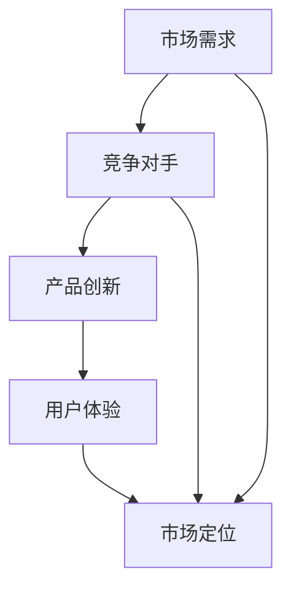
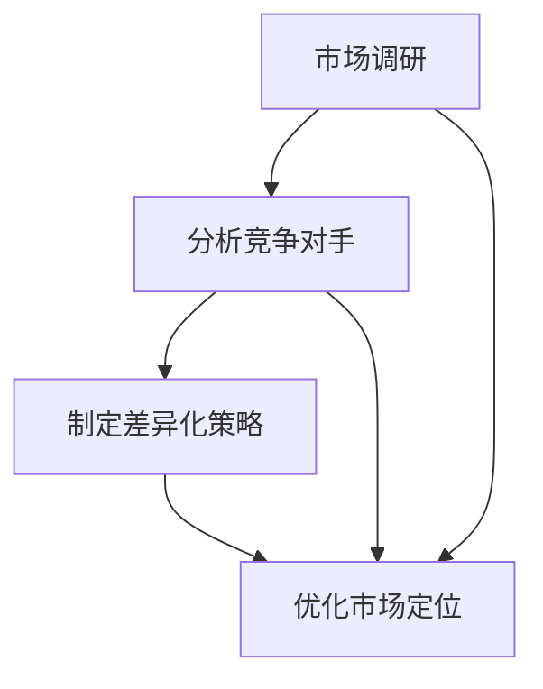

                 

# 创业初期的市场定位策略

> **关键词**：市场定位、战略规划、用户体验、竞争对手分析、产品创新

> **摘要**：本文将探讨创业初期如何进行有效的市场定位策略，包括理解市场需求、分析竞争对手、制定差异化策略以及如何持续优化市场定位。通过逻辑清晰的分析和案例实践，帮助创业者把握市场机遇，打造具有竞争力的产品。

## 1. 背景介绍

在当今竞争激烈的商业环境中，市场定位已成为企业成功的关键因素。对于初创企业而言，市场定位尤为重要。在创业初期，有限的资源和时间使得精准的市场定位成为生存的关键。有效的市场定位不仅可以帮助企业吸引目标客户，还能减少不必要的市场拓展成本，提高资源利用率。

市场定位不仅仅是找到一个空白市场，更重要的是理解目标客户的需求，提供差异化的产品或服务，并在竞争中脱颖而出。本文将从以下几个方面展开讨论：

- **理解市场需求**：通过市场调研和用户反馈，深入挖掘目标客户的需求，从而制定合适的市场策略。
- **分析竞争对手**：了解竞争对手的产品、优势和劣势，找到自己的定位和差异化点。
- **制定差异化策略**：通过创新和独特的价值主张，使产品在市场中具有竞争力。
- **持续优化市场定位**：根据市场反馈和业务发展，不断调整和优化市场定位，以适应市场变化。

## 2. 核心概念与联系

在探讨市场定位策略之前，我们需要理解一些核心概念，并分析它们之间的联系。

### 2.1 市场需求

市场需求是指消费者对某种产品或服务的总体需求。了解市场需求可以帮助企业确定目标市场，并提供有价值的产品或服务。

### 2.2 竞争对手

竞争对手是指那些在同一市场上提供相似产品或服务的公司。了解竞争对手可以帮助企业分析市场现状，找到差异化点。

### 2.3 产品创新

产品创新是指通过改进现有产品或开发新产品来满足市场需求。创新是企业在竞争中获得优势的关键因素。

### 2.4 用户体验

用户体验是指用户在使用产品或服务过程中的感受和体验。良好的用户体验可以增加用户忠诚度，从而提高市场占有率。

### 2.5 市场定位

市场定位是指企业在市场中的定位和差异化策略，以吸引目标客户并建立品牌认知。

以下是一个使用Mermaid绘制的流程图，展示了这些概念之间的联系：



## 3. 核心算法原理 & 具体操作步骤

在理解了核心概念之后，我们需要确定如何进行市场定位。以下是一个简单的算法，用于制定市场定位策略：

### 3.1 确定目标市场

- **步骤1**：进行市场调研，了解目标客户的需求和偏好。
- **步骤2**：使用数据分析工具，如Google Analytics或SurveyMonkey，收集用户反馈。

### 3.2 分析竞争对手

- **步骤1**：列出主要竞争对手，分析他们的产品特点、优势和劣势。
- **步骤2**：使用SWOT分析（优势、劣势、机会、威胁），评估竞争对手的威胁和机会。

### 3.3 制定差异化策略

- **步骤1**：根据市场调研和竞争对手分析，确定产品的差异化点。
- **步骤2**：制定独特的价值主张，使产品在市场中具有竞争力。

### 3.4 优化市场定位

- **步骤1**：根据市场反馈和业务发展，定期评估和调整市场定位。
- **步骤2**：关注行业趋势和竞争对手动态，及时调整策略。

以下是一个使用Mermaid绘制的流程图，展示了核心算法的步骤：



## 4. 数学模型和公式 & 详细讲解 & 举例说明

在市场定位策略中，数学模型和公式可以帮助我们更准确地分析市场和制定策略。以下是一些常用的数学模型和公式：

### 4.1 SWOT分析

SWOT分析是一种用于评估企业的优势、劣势、机会和威胁的工具。以下是一个SWOT分析的示例：

- **优势（Strengths）**：
  - 产品质量高
  - 技术创新
- **劣势（Weaknesses）**：
  - 品牌知名度低
  - 市场份额小
- **机会（Opportunities）**：
  - 市场需求增长
  - 新技术出现
- **威胁（Threats）**：
  - 竞争对手增加
  - 市场饱和

### 4.2 市场份额预测

市场份额预测可以使用以下公式：

$$ \text{市场份额} = \frac{\text{企业销售额}}{\text{行业总销售额}} $$

假设一个初创企业的销售额为100万元，行业总销售额为1000万元，那么其市场份额为：

$$ \text{市场份额} = \frac{100}{1000} = 10\% $$

### 4.3 用户流失率

用户流失率可以使用以下公式计算：

$$ \text{用户流失率} = \frac{\text{流失用户数}}{\text{总用户数}} \times 100\% $$

例如，如果一个初创企业的总用户数为1000人，一个月内流失了100人，那么其用户流失率为：

$$ \text{用户流失率} = \frac{100}{1000} \times 100\% = 10\% $$

## 5. 项目实战：代码实际案例和详细解释说明

### 5.1 开发环境搭建

为了演示市场定位策略的实际应用，我们将使用Python编写一个简单的市场调研工具。首先，我们需要安装Python和几个相关的库。

```bash
pip install pandas numpy matplotlib
```

### 5.2 源代码详细实现和代码解读

以下是一个简单的市场调研工具的代码实现：

```python
import pandas as pd
import numpy as np
import matplotlib.pyplot as plt

# 假设我们从问卷调查中收集了以下数据
data = {
    '年龄': [25, 30, 35, 40, 45],
    '性别': ['男', '女', '男', '女', '男'],
    '收入': [5000, 6000, 7000, 8000, 9000],
    '需求': ['健康', '旅游', '教育', '科技', '健康']
}

# 创建DataFrame
df = pd.DataFrame(data)

# 统计不同年龄段的需求分布
age需求的分布 = df.groupby('年龄')['需求'].value_counts(normalize=True)

# 绘制需求分布图
age需求的分布.plot(kind='bar')
plt.xlabel('年龄')
plt.ylabel('需求占比')
plt.title('不同年龄段的需求分布')
plt.show()

# 分析性别与收入的关系
gender收入的关系 = df.groupby('性别')['收入'].mean()
print("性别与收入的关系：")
print(gender收入的关系)

# 分析收入与需求的关系
income需求的的关系 = df.groupby('收入')['需求'].value_counts(normalize=True)
print("收入与需求的关系：")
print(income需求的的关系)
```

### 5.3 代码解读与分析

上述代码首先导入了必要的库，并创建了一个包含调查数据的DataFrame。接下来，我们进行了以下操作：

- **统计不同年龄段的需求分布**：使用`groupby`和`value_counts`函数，计算了不同年龄段的需求分布，并使用`plot`函数绘制了需求分布图。
- **分析性别与收入的关系**：使用`groupby`函数，计算了不同性别群体的平均收入。
- **分析收入与需求的关系**：使用`groupby`函数，计算了不同收入群体的需求分布。

这些操作可以帮助我们更好地理解市场需求，为市场定位提供数据支持。

## 6. 实际应用场景

市场定位策略在不同行业和场景中有着广泛的应用。以下是一些实际应用场景：

- **电商行业**：通过分析用户购买行为和偏好，为不同客户提供个性化的产品推荐。
- **餐饮行业**：根据顾客需求和口味偏好，制定菜单策略和营销活动。
- **医疗行业**：通过分析患者数据和医疗需求，提供个性化医疗服务和产品推荐。
- **金融行业**：根据客户风险承受能力和投资偏好，提供定制化的金融产品和服务。

## 7. 工具和资源推荐

### 7.1 学习资源推荐

- **书籍**：
  - 《蓝海战略》：提供创新的市场定位方法。
  - 《市场营销原理》：系统讲解市场营销的基本概念和策略。
- **论文**：
  - "Competitive Positioning: An Integrated Approach"：探讨市场定位的理论和实践。
  - "The Role of Market Segmentation in Strategic Planning"：分析市场细分在战略规划中的作用。
- **博客**：
  - HubSpot Blog：提供关于市场营销和战略规划的实用建议。
  - Neil Patel Blog：分享数字营销和用户增长的最佳实践。
- **网站**：
  - Market Research Association：提供市场调研的工具和资源。
  - UserTesting：提供用户体验测试服务。

### 7.2 开发工具框架推荐

- **开发工具**：
  - Python：适合数据分析和处理。
  - R：适用于统计分析和数据可视化。
- **框架**：
  - TensorFlow：用于深度学习模型开发。
  - Flask：用于构建Web应用。

### 7.3 相关论文著作推荐

- **论文**：
  - "A Framework for Market Segmentation Based on User Behavior"：提供基于用户行为的细分框架。
  - "Customer Segmentation Using Machine Learning Techniques"：探讨使用机器学习方法进行客户细分。
- **著作**：
  - 《消费者行为学》：系统讲解消费者行为和市场定位的理论。
  - 《数据挖掘：概念与技术》：介绍数据挖掘的基本概念和技术，包括市场分析。

## 8. 总结：未来发展趋势与挑战

市场定位策略在未来将继续发展，面临以下趋势和挑战：

- **个性化与定制化**：随着消费者需求的多样化，个性化与定制化的市场定位策略将成为主流。
- **数据驱动**：大数据和人工智能技术将为市场定位提供更准确的数据支持。
- **竞争加剧**：市场竞争将更加激烈，企业需要不断创新和调整市场定位策略。

## 9. 附录：常见问题与解答

### 9.1 市场定位策略的重要性是什么？

市场定位策略能够帮助企业明确目标客户，提供有价值的产品或服务，从而在竞争激烈的市场中脱颖而出。

### 9.2 如何进行市场调研？

市场调研可以通过问卷调查、访谈、焦点小组讨论等方式进行。使用数据分析工具，如Excel、Python、R等，可以更有效地处理和解读调研数据。

### 9.3 市场定位策略如何调整？

根据市场反馈和业务发展，定期评估和调整市场定位策略。关注行业趋势和竞争对手动态，及时调整策略，以适应市场变化。

## 10. 扩展阅读 & 参考资料

- "Market Positioning: A Decision-Focused Approach"，John A. Sviokla and Harold J. Morreale，John Wiley & Sons，2016。
- "The Lean Startup"，Eric Ries，Crown Business，2011。
- "Inbound Marketing"，Brian Halligan and Dharmesh Shah，Wiley，2010。
- "Competitive Advantage：Creating and Sustaining Superior Performance"，Michael E. Porter，Free Press，1985。

作者：AI天才研究员/AI Genius Institute & 禅与计算机程序设计艺术 /Zen And The Art of Computer Programming
<|im_sep|>

