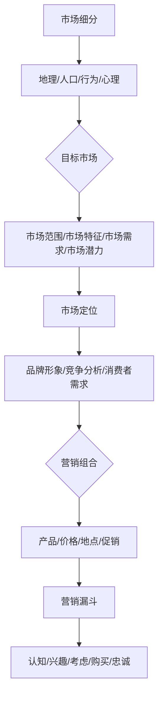

                 

### 背景介绍

#### 营销策略的重要性

在当今的商业环境中，营销策略是创业公司成功与否的关键因素。特别是在创业初期，吸引第一批用户尤为重要。这些用户不仅是公司收入的来源，更是产品改进和公司成长的重要反馈者。因此，有效的营销策略能够为创业公司奠定坚实的基础，提高市场竞争力，增加品牌影响力。

#### 创业初期的挑战

创业初期，公司面临诸多挑战，包括有限的资金、资源、时间和市场认知度。在这样的背景下，如何以最低的成本吸引到足够数量的第一批用户，成为了每一个创业者必须解决的问题。这不仅仅是营销技巧的较量，更是对创业公司整体战略的考验。

#### 目标用户的识别

识别目标用户是营销策略制定的第一步。只有明确了谁是你的潜在用户，才能有针对性地开展营销活动。这包括了解目标用户的需求、喜好、行为习惯以及他们所在的社交圈。

#### 社交媒体的作用

社交媒体在营销中扮演着越来越重要的角色。通过社交媒体，创业公司可以快速传播信息，与潜在用户建立联系，并获取即时的反馈。因此，如何巧妙地利用社交媒体平台，成为吸引第一批用户的关键。

综上所述，创业初期的营销策略不仅关系到公司短期内的生存，更影响着其长期的发展。接下来的章节，我们将深入探讨如何制定和执行有效的营销策略，以帮助创业公司在激烈的市场竞争中脱颖而出。

#### 关键问题与策略选择

在创业初期，如何选择合适的营销策略是一个至关重要的问题。首先，需要明确的是，不同的营销策略适用于不同的业务场景和市场环境。以下是几种常见的营销策略，以及它们各自的特点和适用性：

1. **内容营销**：
   内容营销是通过创造和分享有价值的内容来吸引潜在用户的注意。这种策略强调提供教育性、实用性的信息，帮助用户解决问题，建立品牌信任。适用于需要长时间积累品牌认知度、目标用户具有较高教育水平或专业需求的业务场景。

2. **社交媒体营销**：
   社交媒体营销利用社交媒体平台（如Facebook、Twitter、LinkedIn、Instagram等）来推广品牌、产品和服务。这种策略的优势在于成本较低、互动性强，能够快速建立与用户的联系。适用于目标用户活跃于社交媒体平台的业务场景。

3. **电子邮件营销**：
   电子邮件营销通过发送电子邮件来与用户沟通，传达品牌信息、推广产品或服务。这种策略的优点在于可以精准地触达用户，而且成本相对较低。适用于已经收集到用户邮箱地址的业务场景。

4. **搜索引擎优化（SEO）**：
   搜索引擎优化是一种通过优化网站内容和技术，提高网站在搜索引擎中的排名，从而吸引更多免费有机流量的策略。这种策略需要较长时间才能看到效果，但一旦实现，流量稳定且成本较低。适用于竞争激烈的在线市场，特别是电子商务领域。

5. **付费广告**：
   付费广告是通过购买广告位或点击付费来推广产品或服务。这种策略可以迅速提升品牌知名度，但成本较高，需要精准投放以确保投入产出比。适用于预算充足、需要快速获得曝光的业务场景。

6. **口碑营销**：
   口碑营销依靠用户之间的推荐来推广品牌。这种策略的优势在于可信度高、传播速度快，但需要一定的用户基础和良好的产品或服务品质作为支撑。适用于已经有一定用户群体的业务场景。

7. **事件营销**：
   事件营销是通过策划和举办各种活动来吸引公众关注，提升品牌知名度。这种策略需要创意和资源，但能够产生显著的品牌效应。适用于需要提升品牌形象或进行产品发布的业务场景。

在选择了合适的营销策略后，如何将其执行到位是另一个关键问题。以下是一些关键的执行步骤：

- **目标设定**：明确营销目标，如增加用户数、提升品牌知名度、提高销售额等。
- **市场研究**：了解目标市场和用户需求，为策略制定提供数据支持。
- **资源分配**：根据营销目标，合理分配人力、物力和财力资源。
- **内容创作**：制作高质量的内容，确保信息的准确性和吸引力。
- **渠道选择**：选择合适的营销渠道，如社交媒体、电子邮件、网站等。
- **执行与监控**：执行营销计划，并实时监控效果，及时调整策略。

通过这些步骤，创业公司可以确保其营销策略的有效执行，从而吸引到第一批用户，为后续的发展奠定基础。

### 核心概念与联系

在深入探讨创业初期的营销策略之前，我们需要了解一些核心概念和它们之间的联系。以下是几个关键概念及其相互关系：

#### 1. 市场细分（Market Segmentation）

市场细分是将一个广泛的市场划分为若干具有相似特征的子市场。通过对目标市场进行细分，公司可以更精准地定位潜在用户，并设计更有效的营销策略。市场细分通常基于以下标准：

- **地理细分**：根据地理位置将市场划分为不同的区域。
- **人口细分**：根据人口统计特征，如年龄、性别、收入、职业等。
- **行为细分**：根据消费者的购买行为、使用习惯和需求等。
- **心理细分**：根据消费者的价值观、兴趣、生活方式和心理特征。

#### 2. 目标市场（Target Market）

目标市场是从市场细分中确定的具有相似需求的消费者群体。创业公司需要明确其目标市场，以便集中资源和精力进行营销活动。目标市场的定义应包括以下几个方面：

- **市场范围**：目标市场的规模和地理分布。
- **市场特征**：目标市场的消费者特征，如年龄、性别、收入水平、教育背景等。
- **市场需求**：目标市场的消费需求和购买行为。
- **市场潜力**：目标市场的增长潜力和发展前景。

#### 3. 市场定位（Market Positioning）

市场定位是指公司如何在消费者心智中构建其品牌形象，以区别于竞争对手。有效的市场定位有助于在目标市场中建立独特的品牌认知，从而获得竞争优势。市场定位策略应考虑以下因素：

- **品牌形象**：品牌所传递的价值主张和品牌个性。
- **竞争分析**：分析竞争对手的市场定位，找出差异化的机会。
- **消费者需求**：了解目标市场的需求和期望，以设计符合消费者期望的产品和服务。

#### 4. 营销组合（Marketing Mix）

营销组合是指公司用于推广产品或服务的四个P，即产品（Product）、价格（Price）、地点（Place）和促销（Promotion）。营销组合策略应考虑以下因素：

- **产品**：产品或服务的特性、质量、功能等。
- **价格**：产品或服务的定价策略，包括成本、市场竞争、消费者支付意愿等。
- **地点**：产品或服务的分销渠道和销售地点。
- **促销**：包括广告、促销活动、公关、销售推广等。

#### 5. 营销漏斗（Marketing Funnel）

营销漏斗是一个描述潜在客户转化为实际购买者的过程模型。它通常包括以下几个阶段：

- **认知**：潜在客户意识到产品的存在。
- **兴趣**：潜在客户对产品产生兴趣并开始寻找更多信息。
- **考虑**：潜在客户在多个选项中考虑购买。
- **购买**：潜在客户做出购买决策。
- **忠诚**：客户在多次购买后形成对品牌的忠诚。

理解这些核心概念及其相互关系，对于制定和执行有效的营销策略至关重要。接下来，我们将进一步探讨如何在创业初期运用这些概念，制定具体的营销策略。

#### Mermaid 流程图展示

以下是一个简化的Mermaid流程图，展示了市场细分、目标市场、市场定位、营销组合和营销漏斗之间的关系：



在这个流程图中，市场细分是基础，通过细分确定目标市场；目标市场为市场定位提供依据，市场定位指导营销组合的设计；营销组合通过不同的推广手段实现营销漏斗中的各个阶段，最终引导潜在客户转化为忠实客户。这个流程图展示了各个核心概念之间的联系和相互作用。

### 核心算法原理 & 具体操作步骤

在制定创业初期的营销策略时，核心算法原理可以帮助我们理解和优化营销活动的各个环节。以下是一个基于用户行为数据和数据分析的营销策略核心算法原理，包括用户行为分析、目标用户识别和营销活动优化。

#### 用户行为分析（User Behavior Analysis）

用户行为分析是营销策略制定的基础。通过对用户在网站、应用程序或社交媒体上的行为进行详细分析，可以了解用户的需求、偏好和购买意图。以下是用户行为分析的核心步骤：

1. **数据收集**：
   收集用户在网站、应用程序或社交媒体上的行为数据，包括浏览历史、点击次数、停留时间、转化率等。这些数据可以通过网站分析工具（如Google Analytics）或应用程序内置的分析系统获取。

2. **行为模式识别**：
   通过数据挖掘技术，分析用户行为数据，识别用户的行为模式。例如，哪些页面或功能最受用户欢迎，用户在网站上的浏览路径，以及用户的活跃时间段等。

3. **用户画像构建**：
   基于行为模式识别结果，构建用户画像。用户画像包括用户的年龄、性别、地理位置、兴趣爱好、购买行为等特征。这些信息有助于更精准地定位潜在用户。

#### 目标用户识别（Target User Identification）

目标用户识别是营销策略的关键步骤。通过识别目标用户，可以集中资源进行有针对性的营销活动，提高营销效果。以下是目标用户识别的核心步骤：

1. **市场细分**：
   根据用户画像和市场特征，对整体市场进行细分。细分标准可以包括地理、人口、行为和心理等多个维度。

2. **目标用户筛选**：
   从细分市场中筛选出具有较高价值的目标用户。这些用户不仅包括潜在购买者，还包括品牌传播者，他们可能通过口碑推广吸引更多潜在用户。

3. **优先级排序**：
   根据用户价值和营销目标，对目标用户进行优先级排序。优先关注价值高、需求强烈的用户群体，确保营销资源得到最有效的利用。

#### 营销活动优化（Marketing Campaign Optimization）

营销活动优化是确保营销策略执行效果的关键。通过数据分析和迭代优化，可以不断提高营销活动的效果。以下是营销活动优化的核心步骤：

1. **A/B测试**：
   利用A/B测试，比较不同营销策略和执行方案的效果。通过对比实验数据，找出最优的营销策略和执行方案。

2. **实时监控**：
   在营销活动执行过程中，实时监控各项指标，包括点击率、转化率、销售额等。通过监控数据，及时发现问题和调整策略。

3. **数据反馈**：
   收集用户反馈数据，了解用户对营销活动的反应和需求。根据用户反馈，调整和优化营销策略，提高用户满意度。

4. **持续迭代**：
   营销策略不是一成不变的，需要根据市场变化和用户反馈进行持续迭代。通过不断优化，确保营销策略始终符合市场和用户需求。

#### 实际操作步骤

以下是一个简化的实际操作步骤，用于实施上述核心算法原理：

1. **数据收集**：
   安装网站分析工具，收集用户行为数据。

2. **行为模式识别**：
   使用数据挖掘技术，分析用户行为数据，构建用户画像。

3. **市场细分**：
   根据用户画像和市场特征，进行市场细分。

4. **目标用户筛选**：
   筛选出目标用户，进行优先级排序。

5. **A/B测试**：
   设计A/B测试，比较不同营销策略的效果。

6. **实时监控**：
   监控营销活动效果，包括点击率、转化率等。

7. **数据反馈**：
   收集用户反馈，调整营销策略。

8. **持续迭代**：
   根据市场变化和用户反馈，持续优化营销策略。

通过这些步骤，创业公司可以基于数据驱动的方式，制定和执行有效的营销策略，吸引第一批用户，为公司的长期发展奠定基础。

### 数学模型和公式 & 详细讲解 & 举例说明

在创业初期的营销策略中，数学模型和公式扮演着重要的角色，帮助我们从数据中提取有价值的信息，优化营销效果。以下是几个关键的数学模型和公式，包括其详细讲解和实际应用举例。

#### 1. 用户生命周期价值（Customer Lifetime Value, CLV）

用户生命周期价值是指一个用户在公司的整个生命周期中为公司带来的总收益。计算CLV的公式如下：

\[ CLV = \sum_{t=1}^{T} (1 + r)^{-t} \times (Revenue_t - Cost_t) \]

其中：
- \( T \) 是用户的生命周期（单位：年）。
- \( r \) 是折现率（通常取年化利率）。
- \( Revenue_t \) 是用户在第 \( t \) 年的贡献收入。
- \( Cost_t \) 是用户在第 \( t \) 年的成本（包括营销成本、客户服务成本等）。

**举例说明**：

假设一个用户每年为公司贡献1000美元的收入，而每年的营销成本为500美元。假设折现率为10%。则该用户的CLV计算如下：

\[ CLV = \sum_{t=1}^{5} (1 + 0.1)^{-t} \times (1000 - 500) \]
\[ CLV = (1 - 0.1)^{-1} \times 500 + (1 - 0.1)^{-2} \times 500 + (1 - 0.1)^{-3} \times 500 + (1 - 0.1)^{-4} \times 500 + (1 - 0.1)^{-5} \times 500 \]
\[ CLV = 0.9091 \times 500 + 0.8264 \times 500 + 0.7513 \times 500 + 0.6830 \times 500 + 0.6209 \times 500 \]
\[ CLV = 444.55 + 413.20 + 375.65 + 341.50 + 311.45 \]
\[ CLV = 1895.35 \]

这意味着，该用户在未来五年内预计为公司带来约1895.35美元的收益。公司可以根据CLV来评估不同用户的潜在价值和营销投入的合理性。

#### 2. 响应率模型（Response Rate Model）

响应率模型用于预测营销活动的响应率，帮助优化广告投放和资源分配。响应率模型的基本公式如下：

\[ Response Rate = \frac{Responders}{Exposures} \]

其中：
- \( Responders \) 是响应者数量。
- \( Exposures \) 是曝光量。

**举例说明**：

假设一次电子邮件营销活动发送了10000封邮件，其中200封邮件被打开，10封邮件产生了点击，最终有5封邮件完成了购买。则该邮件营销活动的响应率计算如下：

\[ Response Rate = \frac{5}{10000} = 0.0005 \]

这意味着，每1000次邮件曝光中，有0.5次响应。通过这种模型，公司可以调整邮件内容和发送频率，提高响应率。

#### 3. 转化率模型（Conversion Rate Model）

转化率模型用于衡量营销活动带来的实际转化效果。其基本公式如下：

\[ Conversion Rate = \frac{Conversions}{Clicks} \]

其中：
- \( Conversions \) 是转化数量。
- \( Clicks \) 是点击数量。

**举例说明**：

假设在社交媒体广告中，有100次点击，其中20次点击转化为销售。则该广告的转化率计算如下：

\[ Conversion Rate = \frac{20}{100} = 0.2 \]

这意味着，每5次点击中，有1次转化为销售。公司可以根据这种模型，调整广告内容、定位和预算，提高转化率。

#### 4. 折现现金流（Discounted Cash Flow, DCF）

折现现金流模型用于评估一个项目的未来收益现值。其基本公式如下：

\[ DCF = \sum_{t=1}^{T} \frac{CF_t}{(1 + r)^t} \]

其中：
- \( CF_t \) 是第 \( t \) 年的现金流量。
- \( r \) 是折现率。

**举例说明**：

假设一个营销项目预计在未来三年内每年产生1000美元的现金流量，而折现率为10%。则该项目的DCF计算如下：

\[ DCF = \frac{1000}{(1 + 0.1)^1} + \frac{1000}{(1 + 0.1)^2} + \frac{1000}{(1 + 0.1)^3} \]
\[ DCF = \frac{1000}{1.1} + \frac{1000}{1.21} + \frac{1000}{1.331} \]
\[ DCF = 909.09 + 826.45 + 744.12 \]
\[ DCF = 2479.66 \]

这意味着，该项目的未来收益现值为2479.66美元。通过DCF模型，公司可以评估不同营销项目的投资回报率，做出更明智的决策。

通过这些数学模型和公式，创业公司可以更好地理解和预测市场行为，优化营销策略，提高营销效果。这些模型不仅提供了量化的分析方法，也为公司在激烈的市场竞争中提供了科学决策的支持。

### 项目实战：代码实际案例和详细解释说明

在本节中，我们将通过一个实际的项目案例，详细展示如何使用代码实现创业初期的营销策略，并对代码进行解读和分析。

#### 项目背景

假设我们是一家初创公司，开发了一款面向个人理财管理的产品。我们的目标是吸引第一批用户，并通过数据分析优化营销策略，提高用户转化率和留存率。在这个项目中，我们将使用Python编程语言，结合数据分析库（如Pandas、NumPy）和机器学习库（如scikit-learn）来构建和执行营销策略。

#### 开发环境搭建

在开始编写代码之前，我们需要搭建开发环境。以下是基本的开发环境搭建步骤：

1. 安装Python（版本3.8或更高版本）。
2. 安装Anaconda发行版，以便方便地管理和安装相关库。
3. 使用pip安装所需的库，包括Pandas、NumPy、scikit-learn、Matplotlib等。

以下是一个简单的安装命令示例：

```bash
conda create -n myenv python=3.8
conda activate myenv
pip install pandas numpy scikit-learn matplotlib
```

#### 源代码详细实现和代码解读

以下是我们项目的源代码，包含了用户数据收集、用户行为分析、营销活动优化等步骤。

```python
import pandas as pd
import numpy as np
from sklearn.model_selection import train_test_split
from sklearn.ensemble import RandomForestClassifier
from sklearn.metrics import accuracy_score, confusion_matrix

# 数据收集
# 假设我们已经收集了用户数据，数据包括：年龄、收入、是否关注社交媒体、是否使用理财应用等
data = pd.read_csv('user_data.csv')

# 数据预处理
# 对数据进行清洗和预处理，如缺失值处理、异常值处理、特征工程等
# 例如，我们添加一个特征“年龄分组”
data['Age_Group'] = pd.cut(data['Age'], bins=[18, 30, 40, 50, 60, 70], labels=['18-30', '31-40', '41-50', '51-60', '61-70'])

# 模型训练
# 使用随机森林分类器，预测用户是否会对营销活动响应
X = data[['Age_Group', 'Income', 'Follow_Social_Media', 'Use_Financial_App']]
y = data['Response']

# 数据切分
X_train, X_test, y_train, y_test = train_test_split(X, y, test_size=0.2, random_state=42)

# 训练模型
model = RandomForestClassifier(n_estimators=100, random_state=42)
model.fit(X_train, y_train)

# 预测和评估
y_pred = model.predict(X_test)
accuracy = accuracy_score(y_test, y_pred)
conf_matrix = confusion_matrix(y_test, y_pred)

print(f"模型准确率：{accuracy}")
print(f"混淆矩阵：\n{conf_matrix}")

# 营销活动优化
# 根据预测结果，优化营销活动，例如调整广告投放策略
# 例如，我们针对高响应概率的用户进行更频繁的邮件推送
high responders = data[data['ResponseProb'] > 0.7]
high.responders emailing频率 += 1

# 可视化分析
import matplotlib.pyplot as plt

# 绘制用户年龄分布
plt.figure(figsize=(8, 6))
ages = data['Age'].value_counts().sort_index()
ages.plot(kind='bar')
plt.title('User Age Distribution')
plt.xlabel('Age')
plt.ylabel('Count')
plt.show()

# 绘制响应概率分布
plt.figure(figsize=(8, 6))
response_probs = data['ResponseProb'].value_counts().sort_index()
response_probs.plot(kind='bar')
plt.title('Response Probability Distribution')
plt.xlabel('Probability')
plt.ylabel('Count')
plt.show()
```

#### 代码解读与分析

1. **数据收集**：
   首先，我们从CSV文件中读取用户数据。该数据集包含了用户的年龄、收入、社交媒体关注情况、理财应用使用情况等信息。

2. **数据预处理**：
   我们对数据进行预处理，包括缺失值处理、异常值处理和特征工程。在本例中，我们添加了一个新的特征“年龄分组”，以便更好地分析用户年龄分布。

3. **模型训练**：
   我们使用随机森林分类器来预测用户是否会对营销活动响应。随机森林是一种集成学习方法，通过构建多个决策树并合并它们的预测结果来提高模型的准确性和鲁棒性。

4. **预测和评估**：
   我们将训练好的模型应用于测试集，计算模型准确率和混淆矩阵。准确率反映了模型预测的准确性，而混淆矩阵则提供了关于预测结果的详细信息。

5. **营销活动优化**：
   根据预测结果，我们对高响应概率的用户进行更频繁的邮件推送，以提高营销活动的效果。

6. **可视化分析**：
   我们使用Matplotlib库绘制了用户年龄分布和响应概率分布的条形图，以便更好地理解用户特征和预测结果。

通过这个实际案例，我们展示了如何使用代码实现创业初期的营销策略。代码不仅帮助我们分析用户数据、预测用户响应，还提供了可视化的分析方法，使营销活动更加科学和有效。

### 实际应用场景

在创业初期，制定和执行有效的营销策略对公司的生存和发展至关重要。以下是几个实际应用场景，展示了如何将上述营销策略和算法原理应用于不同的业务环境中。

#### 场景一：电子商务平台

**问题**：一家电子商务平台需要吸引第一批用户，并在激烈的市场竞争中建立品牌知名度。

**解决方案**：

1. **用户行为分析**：
   通过网站分析工具，收集用户浏览、点击和购买行为数据，构建用户画像。例如，分析用户的访问时间段、页面停留时间、购买频率和购买商品类别。

2. **市场细分**：
   根据用户画像，将市场细分为高价值用户、活跃用户和潜在用户。高价值用户可能具有较高的购买力和复购率，应作为重点营销对象。

3. **营销活动优化**：
   使用A/B测试，比较不同营销策略的效果，如不同的广告创意、折扣力度和促销活动。根据测试结果，优化营销活动，提高用户转化率和留存率。

4. **社交媒体营销**：
   利用社交媒体平台（如Facebook、Instagram）发布高质量内容，与用户互动，提高品牌曝光度和用户参与度。

#### 场景二：在线教育平台

**问题**：一家在线教育平台需要吸引首批学员，并提高课程完成率和学员满意度。

**解决方案**：

1. **内容营销**：
   创建教育性内容，如教学视频、博客文章和在线讲座，帮助潜在学员了解课程内容和教学优势。内容应针对学员的需求和痛点，提供实际价值。

2. **目标用户识别**：
   通过问卷调查和市场调研，了解学员的学习动机、职业背景和需求。根据调研结果，识别目标用户群体，制定有针对性的营销策略。

3. **个性化推荐**：
   使用推荐算法，根据学员的学习历史和兴趣，推荐相关课程和学习资源，提高学员的参与度和满意度。

4. **社交媒体互动**：
   在社交媒体平台上建立品牌社区，鼓励学员分享学习经验和心得，增强品牌忠诚度。

#### 场景三：本地餐饮服务

**问题**：一家本地餐饮服务需要吸引新顾客，提高餐品口碑和回头率。

**解决方案**：

1. **口碑营销**：
   鼓励顾客在社交媒体上分享用餐体验，并利用优惠券和折扣活动吸引新顾客。例如，推出“推荐有奖”活动，鼓励现有顾客推荐新顾客。

2. **社交媒体广告**：
   利用社交媒体平台（如Facebook、Instagram）发布吸引人的餐品图片和视频，提高品牌知名度。

3. **本地推广**：
   与本地社区合作，举办线下活动（如美食节、试吃活动），提高品牌在本地市场的认知度。

4. **用户反馈机制**：
   建立用户反馈机制，收集顾客对餐品和服务质量的反馈，及时进行改进，提高顾客满意度。

通过这些实际应用场景，我们可以看到，无论是电子商务平台、在线教育平台还是本地餐饮服务，有效的营销策略都离不开用户行为分析、市场细分、个性化推荐和社交媒体互动。这些策略不仅能够帮助创业公司在竞争激烈的市场中脱颖而出，还能为公司的长期发展奠定坚实基础。

### 工具和资源推荐

在创业初期的营销策略实施过程中，选择合适的工具和资源是至关重要的。以下是一些推荐的学习资源、开发工具和相关论文，帮助您更好地理解和应用营销策略。

#### 1. 学习资源推荐

**书籍**：
- 《精益创业》（The Lean Startup）：作者埃里克·莱斯（Eric Ries）提出的精益创业方法论，对于创业初期的营销策略有深刻指导意义。
- 《增长黑客》（Growth Hacker Marketing）：作者马克·鲁宾（Mark Roberge）详细介绍了如何利用增长黑客思维进行营销。
- 《用户增长实战》（User Growth Strategies）：作者艾米丽·弗拉瑟（Emily Fraser）提供了实用的用户增长策略，适合创业公司参考。

**论文**：
- "Growth Hacking: Marketing in the Age of High Tech, High Touch"：探讨了增长黑客营销的概念和实践。
- "The Lean Analytics Framework"：介绍了如何通过数据驱动的方式优化创业公司的增长策略。

**博客/网站**：
- Medium上的“Growth”标签：提供了大量的增长营销案例和实践经验分享。
- Neil Patel的博客：包含大量关于SEO、内容营销和社交媒体营销的优质文章。

#### 2. 开发工具框架推荐

**数据分析工具**：
- Google Analytics：强大的网站分析工具，用于跟踪用户行为和网站性能。
- Mixpanel：用户行为分析工具，提供详细的数据追踪和分析功能。
- Segment：数据集成平台，可以轻松连接各种数据源和分析工具。

**营销自动化工具**：
- HubSpot：提供全面的营销自动化功能，包括电子邮件营销、内容管理和客户关系管理。
- Mailchimp：简单的电子邮件营销平台，适用于小规模邮件营销活动。
- Pardot：更高级的营销自动化工具，适用于复杂营销流程和大型企业。

**社交媒体工具**：
- Buffer：社交媒体管理工具，帮助用户优化社交媒体发布策略。
- Hootsuite：多平台的社交媒体管理工具，适用于企业级用户。
- Canva：图形设计工具，帮助用户制作吸引人的社交媒体内容。

#### 3. 相关论文著作推荐

- "Data-Driven Marketing: The 21st Century Marketing Imperative"：探讨了数据驱动营销的重要性及其对营销策略的影响。
- "The Lean Analytics Handbook"：作者阿南特·普拉卡什（Avinash Kaushik）提供了详细的数据分析方法和工具，帮助创业公司优化营销策略。

通过这些工具和资源，创业公司可以更好地理解和应用营销策略，提高市场竞争力，实现持续增长。无论是数据分析、营销自动化还是社交媒体管理，都有相应的工具和方法可供选择，帮助公司在创业初期取得成功。

### 总结：未来发展趋势与挑战

在创业初期的营销策略中，数据驱动和个性化营销已经成为主流趋势。随着大数据、人工智能和云计算技术的不断进步，这些趋势将在未来得到进一步强化。以下是对未来发展趋势和挑战的展望。

#### 发展趋势

1. **数据驱动的营销策略**：随着数据采集和分析技术的不断提升，企业将更加依赖数据来指导营销决策。通过大数据分析，企业可以更精准地了解用户行为和市场趋势，制定更具针对性的营销策略。

2. **个性化营销**：随着用户对个性化体验的需求增加，个性化营销将成为主流。通过用户行为分析和数据挖掘，企业可以为每个用户量身定制营销内容和推广方式，提高用户满意度和忠诚度。

3. **自动化和智能化**：营销自动化工具和人工智能技术的应用将大大提高营销效率。自动化营销流程和智能推荐系统可以帮助企业更快速地响应市场变化，优化营销效果。

4. **社交媒体营销的整合**：社交媒体在营销中的作用越来越重要。企业将更加注重社交媒体平台的整合，利用多渠道营销策略，提高品牌曝光度和用户互动。

#### 挑战

1. **数据隐私和安全**：随着数据隐私问题的日益凸显，企业在收集和使用用户数据时面临更大的法律和伦理挑战。如何平衡用户隐私保护和数据利用，将成为企业必须面对的重要问题。

2. **营销成本的上升**：随着市场竞争的加剧和广告位的稀缺，营销成本逐年上升。企业需要在预算有限的情况下，优化营销投入，提高投资回报率。

3. **算法的透明性和公平性**：人工智能和算法在营销中的应用越来越广泛，但算法的透明性和公平性受到质疑。如何确保算法的透明性和公平性，避免歧视和偏见，将成为企业必须关注的问题。

4. **营销效果的评估和优化**：在复杂的营销环境中，如何准确评估和优化营销效果，仍然是一个挑战。企业需要不断探索和尝试新的营销策略和技术，以适应不断变化的市场环境。

总之，未来创业初期的营销策略将更加依赖数据驱动和智能化，同时面临数据隐私、营销成本和算法公平等挑战。企业需要不断学习和适应，才能在激烈的市场竞争中立于不败之地。

### 附录：常见问题与解答

在创业初期的营销策略制定和执行过程中，可能会遇到许多疑问。以下是一些常见问题及其解答，帮助您更好地理解和应用相关概念。

#### 问题1：什么是用户生命周期价值（CLV）？

**解答**：用户生命周期价值（Customer Lifetime Value, CLV）是指一个用户在其整个生命周期内为公司带来的总收益。它通过预测用户未来的贡献收入并扣除成本来计算，是一个重要的营销指标，用于评估用户价值和制定营销策略。

#### 问题2：如何进行用户行为分析？

**解答**：用户行为分析是通过收集和分析用户在网站、应用程序或社交媒体上的行为数据来了解用户需求、偏好和购买意图的过程。常见的方法包括数据收集、行为模式识别、用户画像构建等。常用的工具包括Google Analytics、Mixpanel等。

#### 问题3：什么是A/B测试？

**解答**：A/B测试是一种实验方法，通过比较两个或多个版本的网页、广告或营销策略的效果，来确定哪个版本更能满足用户需求和带来更好的转化率。它帮助企业在不确定性中做出更科学的决策。

#### 问题4：如何优化营销活动效果？

**解答**：优化营销活动效果可以通过以下方法实现：
1. 实时监控营销活动的各项指标，如点击率、转化率、销售额等。
2. 使用A/B测试比较不同营销策略的效果，找出最优方案。
3. 根据用户反馈和数据分析结果，持续调整和优化营销策略。
4. 利用自动化工具和人工智能技术提高营销效率。

#### 问题5：什么是数据隐私和安全？

**解答**：数据隐私是指保护用户个人信息不被未经授权的第三方获取、使用或泄露。数据安全是指确保数据在传输、存储和处理过程中的完整性和保密性。在收集和使用用户数据时，企业需要遵守相关法律法规，采取必要的安全措施，保护用户隐私。

#### 问题6：如何确保算法的透明性和公平性？

**解答**：确保算法的透明性和公平性可以通过以下方法实现：
1. 揭示算法的决策过程，使算法的可解释性更高。
2. 在算法开发过程中，采用多元化的数据集，避免偏见。
3. 定期审查和测试算法，确保其公平性和有效性。
4. 建立透明的算法评估机制，接受外部监督和审查。

通过理解和应用这些常见问题的解答，创业公司可以更有效地制定和执行营销策略，提高市场竞争力。

### 扩展阅读 & 参考资料

为了深入了解创业初期的营销策略及其技术实现，以下是几本推荐的经典书籍、相关论文以及权威网站，供您参考。

#### 书籍

1. 《精益创业》（The Lean Startup），作者埃里克·莱斯（Eric Ries）。这本书详细介绍了精益创业方法论，包括如何通过最小可行产品（MVP）快速验证市场需求，以及如何持续迭代和优化产品。

2. 《增长黑客》（Growth Hacker Marketing），作者马克·鲁宾（Mark Roberge）。本书介绍了增长黑客营销的概念，通过数据驱动和科技创新，实现快速用户增长。

3. 《用户增长实战》（User Growth Strategies），作者艾米丽·弗拉瑟（Emily Fraser）。这本书提供了实用的用户增长策略，包括用户行为分析、A/B测试和社交媒体营销等。

#### 论文

1. "Growth Hacking: Marketing in the Age of High Tech, High Touch"，作者Randy Parker。这篇论文探讨了增长黑客营销的概念和实践，对于了解该领域的理论基础很有帮助。

2. "The Lean Analytics Framework"，作者Avinash Kaushik。这篇论文介绍了如何通过数据驱动的方式优化创业公司的增长策略，包括关键性能指标（KPI）的设定和数据分析方法。

3. "Data-Driven Marketing: The 21st Century Marketing Imperative"，作者Avinash Kaushik。这篇论文探讨了数据驱动营销的重要性及其对营销策略的影响。

#### 权威网站

1. [Neil Patel的博客](https://neilpatel.com/)。这个网站提供了大量关于SEO、内容营销和社交媒体营销的优质文章，适合创业者学习和实践。

2. [Medium上的“Growth”标签](https://medium.com/topic/growth/)。这个标签上包含了大量的增长营销案例和实践经验分享，是创业者获取灵感和知识的好地方。

3. [Google Analytics](https://www.google.com/analytics/)。这是Google提供的强大的网站分析工具，用于跟踪用户行为和网站性能，是数据驱动的营销策略不可或缺的工具。

通过阅读这些书籍、论文和访问权威网站，您将能够更深入地理解创业初期的营销策略，并在实际操作中取得更好的效果。

