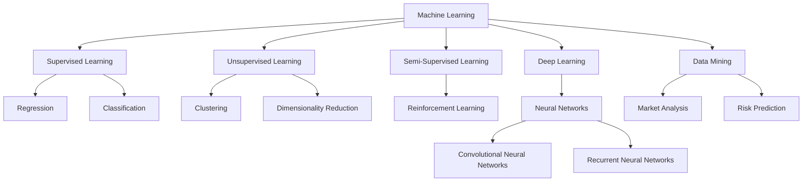

                 

### 背景介绍

在当今时代，人工智能（AI）正迅速发展成为科技领域的明星，推动着各行各业的技术革新。从自然语言处理、计算机视觉到自动驾驶、智能制造，AI 的应用无处不在，其影响力不断扩大。随着 AI 技术的不断成熟和普及，创业者们面临着前所未有的机遇和挑战。

首先，AI 技术的进步使得创业者在产品创新和业务模式上有了更多的可能性。例如，通过深度学习算法和大数据分析，创业者可以开发出更智能、更高效的解决方案，从而满足用户日益增长的需求。此外，AI 技术的快速发展也为创业者提供了新的市场空间，他们可以针对特定领域或垂直行业开发专门的 AI 产品或服务。

然而，与此同时，创业者也面临着一系列挑战。一方面，AI 技术的复杂性和高成本使得许多初创公司难以负担。另一方面，市场竞争日益激烈，创业者需要在短时间内抢占市场份额，这对他们的研发能力和市场策略提出了更高的要求。此外，数据安全和隐私问题也成为了 AI 应用中的重要挑战，创业者需要在这一领域投入更多精力。

总的来说，AI 的浪潮为创业者带来了巨大的机遇，同时也伴随着一系列挑战。在这个变革的时代，创业者需要具备敏锐的市场洞察力、强大的技术实力和灵活的商业模式，才能在 AI 时代中脱颖而出。本文将深入探讨 AI 技术在各个行业中的应用，分析创业者面临的机遇和挑战，并探讨如何利用 AI 技术实现创业成功。

---

## Background Introduction

In today's era, artificial intelligence (AI) is rapidly emerging as a star in the tech industry, driving technological innovation across various sectors. From natural language processing, computer vision, to autonomous driving and smart manufacturing, AI applications are ubiquitous, and its influence continues to grow. As AI technology continues to mature and proliferate, entrepreneurs are facing unprecedented opportunities and challenges.

Firstly, the advancement of AI technology has provided entrepreneurs with more possibilities for product innovation and business models. For example, through deep learning algorithms and big data analysis, entrepreneurs can develop more intelligent and efficient solutions to meet the growing needs of users. Moreover, the rapid development of AI technology has opened up new market spaces for entrepreneurs, allowing them to develop specialized AI products or services for specific fields or vertical industries.

However, at the same time, entrepreneurs are also facing a series of challenges. On the one hand, the complexity and high cost of AI technology make it difficult for many startups to afford. On the other hand, the competitive market requires entrepreneurs to capture market share in a short period, which puts higher demands on their research and development capabilities and market strategies. Additionally, data security and privacy issues have become significant challenges in AI applications, where entrepreneurs need to invest more energy in this area.

In summary, the AI wave brings tremendous opportunities for entrepreneurs, but it also comes with a set of challenges. In this era of transformation, entrepreneurs need to have keen market insights, strong technical prowess, and flexible business models to stand out in the AI era. This article will delve into the applications of AI technology in various industries, analyze the opportunities and challenges faced by entrepreneurs, and explore how to leverage AI technology for entrepreneurial success. <|im_sep|>

---

### 核心概念与联系

为了深入探讨 AI 技术在创业中的应用，我们首先需要理解几个核心概念，包括机器学习、深度学习、神经网络以及数据挖掘等。这些概念不仅构成了 AI 技术的基础，而且对于创业者来说，它们是构建创新产品和服务的基石。

#### 1. 机器学习

机器学习（Machine Learning）是一种使计算机系统能够从数据中学习并做出预测或决策的技术。它通常分为监督学习（Supervised Learning）、无监督学习（Unsupervised Learning）和半监督学习（Semi-Supervised Learning）。监督学习使用标记数据来训练模型，无监督学习则尝试发现数据中的隐藏结构和模式，而半监督学习结合了有标记和无标记数据。

对于创业者来说，机器学习的重要性体现在以下几个方面：

- **需求预测**：通过分析历史销售数据和用户行为，企业可以预测未来的需求，优化库存管理和供应链。
- **个性化推荐**：在电子商务和社交媒体领域，机器学习算法可以根据用户的偏好和行为推荐个性化的产品或内容。

#### 2. 深度学习

深度学习（Deep Learning）是机器学习的一个分支，它使用了多层神经网络（Neural Networks）来模拟人类大脑的学习方式。深度学习在图像识别、语音识别、自然语言处理等领域取得了显著成果。

深度学习对于创业者的影响：

- **图像识别**：深度学习可以用于图像识别，帮助企业自动分类和分析产品图片，提高运营效率。
- **语音识别**：通过深度学习算法，创业者可以开发语音助手和语音识别应用，提升用户体验。

#### 3. 神经网络

神经网络（Neural Networks）是模仿生物神经系统的计算模型，由大量的节点（或称神经元）组成。每个节点都与相邻的节点相连，通过传递信号来处理信息。

神经网络的关键联系：

- **数据输入与输出**：神经网络通过输入层接收数据，经过隐藏层处理后，输出最终结果。
- **多层结构**：多层神经网络的深度和宽度决定了模型的复杂度和学习能力。

#### 4. 数据挖掘

数据挖掘（Data Mining）是从大量数据中提取有价值信息的过程。它结合了统计学、机器学习、数据库和领域知识，旨在发现数据中的隐藏模式和关系。

数据挖掘与创业的结合：

- **市场分析**：通过数据挖掘，创业者可以分析市场趋势和消费者行为，制定更有效的营销策略。
- **风险预测**：在金融领域，数据挖掘可以用于预测信用风险和交易欺诈。

#### Mermaid 流程图

为了更直观地展示这些核心概念之间的联系，我们可以使用 Mermaid 流程图来表示：



这个流程图展示了机器学习、深度学习、神经网络和数据挖掘之间的相互关系，以及它们在创业中的应用场景。通过理解这些核心概念，创业者可以更好地利用 AI 技术来推动业务创新和增长。

---

#### Core Concepts and Connections

To delve into the application of AI technology in entrepreneurship, we first need to understand several core concepts, including machine learning, deep learning, neural networks, and data mining. These concepts not only form the foundation of AI technology but are also the building blocks for entrepreneurs to create innovative products and services.

#### 1. Machine Learning

Machine Learning (ML) is a technology that enables computer systems to learn from data and make predictions or decisions. It is typically categorized into supervised learning, unsupervised learning, and semi-supervised learning. Supervised learning trains models using labeled data, unsupervised learning tries to discover hidden structures or patterns in data, and semi-supervised learning combines labeled and unlabeled data.

The importance of machine learning for entrepreneurs can be summarized in several aspects:

- **Demand Forecasting**: By analyzing historical sales data and user behavior, businesses can predict future demand, optimizing inventory management and supply chains.
- **Personalized Recommendations**: In the fields of e-commerce and social media, machine learning algorithms can recommend personalized products or content based on user preferences and behavior.

#### 2. Deep Learning

Deep Learning (DL) is a branch of machine learning that uses multi-layered neural networks to simulate the way the human brain learns. It has achieved significant success in fields such as image recognition, speech recognition, and natural language processing.

The impact of deep learning on entrepreneurs includes:

- **Image Recognition**: Deep learning can be used for automatic categorization and analysis of product images, improving operational efficiency.
- **Voice Recognition**: Through deep learning algorithms, entrepreneurs can develop voice assistants and voice recognition applications, enhancing user experience.

#### 3. Neural Networks

Neural Networks (NNs) are computational models inspired by the biological nervous system, consisting of numerous nodes or neurons connected to each other. Each node receives signals from adjacent nodes and processes information through transmission.

Key connections of neural networks:

- **Data Input and Output**: Neural networks take input from the input layer, process it through hidden layers, and produce the final output.
- **Multi-Layered Structure**: The depth and width of multi-layered neural networks determine the complexity and learning ability of the model.

#### 4. Data Mining

Data Mining (DM) is the process of extracting valuable information from large datasets. It combines statistics, machine learning, database techniques, and domain knowledge to discover hidden patterns and relationships within data.

Applications of data mining for entrepreneurs:

- **Market Analysis**: Through data mining, entrepreneurs can analyze market trends and consumer behavior, creating more effective marketing strategies.
- **Risk Prediction**: In the financial sector, data mining can be used to predict credit risk and transaction fraud.

#### Mermaid Flowchart

To visually represent the connections between these core concepts, we can use a Mermaid flowchart:


This flowchart illustrates the relationships between machine learning, deep learning, neural networks, and data mining, as well as their application scenarios in entrepreneurship. By understanding these core concepts, entrepreneurs can better leverage AI technology to drive business innovation and growth. <|im_sep|>

---

### 核心算法原理 & 具体操作步骤

在深入探讨 AI 技术的应用之前，我们需要了解一些核心算法的原理和具体操作步骤。这些算法是构建 AI 应用的基础，也是创业者们可以利用的工具。

#### 1. 机器学习算法

机器学习算法可以分为监督学习、无监督学习和强化学习三大类。以下是一些常用的算法和它们的基本原理：

- **线性回归（Linear Regression）**

线性回归是一种监督学习算法，用于预测一个连续值输出。其基本原理是通过找到最佳拟合直线来描述输入变量和输出变量之间的关系。

操作步骤：

1. 数据预处理：将数据集划分为训练集和测试集。
2. 特征工程：提取有用的特征并进行处理。
3. 模型训练：使用训练数据训练线性回归模型。
4. 模型评估：使用测试数据评估模型的准确性。

- **决策树（Decision Tree）**

决策树是一种分类算法，通过一系列的决策规则来划分数据。每个节点代表一个特征，每个分支代表一个可能的值。

操作步骤：

1. 数据预处理：确保数据格式一致。
2. 划分数据集：将数据集分为训练集和测试集。
3. 构建决策树：使用信息增益、基尼不纯度等指标选择最佳特征和划分标准。
4. 模型评估：使用测试数据评估决策树的准确性。

- **支持向量机（Support Vector Machine, SVM）**

SVM 是一种分类算法，通过找到一个最佳的超平面来分离不同类别的数据。

操作步骤：

1. 数据预处理：标准化特征值。
2. 划分数据集：将数据集分为训练集和测试集。
3. 模型训练：使用训练数据训练 SVM 模型。
4. 模型评估：使用测试数据评估 SVM 的准确性。

#### 2. 深度学习算法

深度学习算法包括卷积神经网络（CNN）和循环神经网络（RNN）等。以下是一些基本原理和操作步骤：

- **卷积神经网络（Convolutional Neural Networks, CNN）**

CNN 是用于图像识别和处理的深度学习算法。它通过卷积层、池化层和全连接层来提取图像特征。

操作步骤：

1. 数据预处理：归一化图像数据。
2. 构建模型：设计 CNN 的结构，包括卷积层、池化层和全连接层。
3. 模型训练：使用训练数据训练 CNN 模型。
4. 模型评估：使用测试数据评估 CNN 的性能。

- **循环神经网络（Recurrent Neural Networks, RNN）**

RNN 是用于序列数据处理的深度学习算法。它通过循环结构来处理时间序列数据。

操作步骤：

1. 数据预处理：将序列数据转化为向量。
2. 构建模型：设计 RNN 的结构，包括输入层、隐藏层和输出层。
3. 模型训练：使用训练数据训练 RNN 模型。
4. 模型评估：使用测试数据评估 RNN 的性能。

#### 3. 数据挖掘算法

数据挖掘算法包括关联规则学习、聚类分析和分类算法等。以下是一些基本原理和操作步骤：

- **关联规则学习（Association Rule Learning）**

关联规则学习用于发现数据之间的关联关系，如频繁项集和关联规则。

操作步骤：

1. 数据预处理：处理缺失值和异常值。
2. 发现频繁项集：使用支持度和置信度等指标。
3. 生成关联规则：使用频繁项集生成关联规则。
4. 模型评估：评估关联规则的准确性。

- **聚类分析（Cluster Analysis）**

聚类分析用于将数据分为若干个群组，使同组内的数据相似度最大，组间数据相似度最小。

操作步骤：

1. 数据预处理：标准化数据。
2. 选择聚类算法：如 K-均值聚类、层次聚类等。
3. 执行聚类：使用选定的算法对数据执行聚类。
4. 模型评估：评估聚类结果的合理性。

通过理解这些核心算法的原理和操作步骤，创业者可以更好地选择和利用适当的算法来开发创新产品和服务，从而在 AI 时代中抓住机遇。

---

#### Core Algorithm Principles & Step-by-Step Implementation

Before delving into the applications of AI technology, it is essential to understand the principles and step-by-step implementations of some core algorithms. These algorithms form the foundation for building AI applications and are tools that entrepreneurs can leverage.

#### 1. Machine Learning Algorithms

Machine learning algorithms can be broadly categorized into supervised learning, unsupervised learning, and reinforcement learning. Here are some commonly used algorithms and their basic principles:

- **Linear Regression**

Linear regression is a supervised learning algorithm used for predicting a continuous-valued output. Its basic principle is to find the best-fitting line that describes the relationship between input variables and the output variable.

**Step-by-Step Implementation:**

1. **Data Preprocessing**: Split the dataset into training and testing sets.
2. **Feature Engineering**: Extract useful features and process them.
3. **Model Training**: Train the linear regression model using the training data.
4. **Model Evaluation**: Evaluate the accuracy of the model using the testing data.

- **Decision Trees**

Decision trees are a classification algorithm that divides data through a series of decision rules. Each node represents a feature, and each branch represents a possible value.

**Step-by-Step Implementation:**

1. **Data Preprocessing**: Ensure that the data format is consistent.
2. **Dataset Splitting**: Split the dataset into training and testing sets.
3. **Building the Decision Tree**: Use metrics such as information gain and Gini impurity to select the best feature and split criterion.
4. **Model Evaluation**: Evaluate the accuracy of the decision tree using the testing data.

- **Support Vector Machines (SVM)**

SVM is a classification algorithm that finds the best hyperplane to separate different classes of data.

**Step-by-Step Implementation:**

1. **Data Preprocessing**: Standardize the feature values.
2. **Dataset Splitting**: Split the dataset into training and testing sets.
3. **Model Training**: Train the SVM model using the training data.
4. **Model Evaluation**: Evaluate the accuracy of SVM using the testing data.

#### 2. Deep Learning Algorithms

Deep learning algorithms include Convolutional Neural Networks (CNN) and Recurrent Neural Networks (RNN) among others. Here are the basic principles and step-by-step implementations:

- **Convolutional Neural Networks (CNN)**

CNN is a deep learning algorithm used for image recognition and processing. It uses convolutional layers, pooling layers, and fully connected layers to extract image features.

**Step-by-Step Implementation:**

1. **Data Preprocessing**: Normalize the image data.
2. **Model Building**: Design the CNN structure, including convolutional layers, pooling layers, and fully connected layers.
3. **Model Training**: Train the CNN model using the training data.
4. **Model Evaluation**: Evaluate the performance of the CNN using the testing data.

- **Recurrent Neural Networks (RNN)**

RNN is a deep learning algorithm used for processing sequence data. It uses a recurrent structure to process time-series data.

**Step-by-Step Implementation:**

1. **Data Preprocessing**: Convert the sequence data into vectors.
2. **Model Building**: Design the RNN structure, including input layers, hidden layers, and output layers.
3. **Model Training**: Train the RNN model using the training data.
4. **Model Evaluation**: Evaluate the performance of the RNN using the testing data.

#### 3. Data Mining Algorithms

Data mining algorithms include association rule learning, cluster analysis, and classification algorithms among others. Here are the basic principles and step-by-step implementations:

- **Association Rule Learning**

Association rule learning is used to discover relationships between data items, such as frequent itemsets and association rules.

**Step-by-Step Implementation:**

1. **Data Preprocessing**: Handle missing values and outliers.
2. **Discovery of Frequent Itemsets**: Use metrics such as support and confidence.
3. **Generation of Association Rules**: Generate association rules from frequent itemsets.
4. **Model Evaluation**: Evaluate the accuracy of the association rules.

- **Cluster Analysis**

Cluster analysis is used to divide data into clusters so that data points in the same cluster are more similar to each other than to those in other clusters.

**Step-by-Step Implementation:**

1. **Data Preprocessing**: Normalize the data.
2. **Choosing a Clustering Algorithm**: Such as K-means clustering, hierarchical clustering, etc.
3. **Executing Clustering**: Use the selected algorithm to cluster the data.
4. **Model Evaluation**: Evaluate the rationality of the clustering results.

By understanding the principles and step-by-step implementations of these core algorithms, entrepreneurs can better select and utilize appropriate algorithms to develop innovative products and services, thus seizing opportunities in the AI era. <|im_sep|>

---

### 数学模型和公式 & 详细讲解 & 举例说明

在理解了核心算法的基本原理和操作步骤后，我们进一步探讨这些算法背后的数学模型和公式。数学模型在 AI 应用中起着至关重要的作用，它们帮助我们精确地描述问题和优化算法性能。以下是一些常见的数学模型和它们的详细讲解及举例说明。

#### 1. 线性回归模型

线性回归模型是一种用于预测连续值的监督学习算法，其数学模型可以表示为：

$$y = \beta_0 + \beta_1x_1 + \beta_2x_2 + ... + \beta_nx_n + \epsilon$$

其中，$y$ 是预测的输出值，$x_1, x_2, ..., x_n$ 是输入特征，$\beta_0, \beta_1, \beta_2, ..., \beta_n$ 是模型的参数，$\epsilon$ 是误差项。

**详细讲解：**

- **损失函数**：线性回归模型的损失函数通常使用均方误差（MSE）来衡量，即：

$$MSE = \frac{1}{n}\sum_{i=1}^{n}(y_i - \hat{y_i})^2$$

其中，$n$ 是样本数量，$y_i$ 是实际输出值，$\hat{y_i}$ 是预测输出值。

- **梯度下降**：为了找到最佳参数，我们使用梯度下降算法。梯度下降的迭代公式为：

$$\beta_j = \beta_j - \alpha \frac{\partial}{\partial \beta_j}MSE$$

其中，$\alpha$ 是学习率，$\beta_j$ 是第 $j$ 个参数。

**举例说明：**

假设我们有一个房价预测问题，输入特征包括房屋面积和房龄，我们使用线性回归模型来预测房价。数据集包含 100 个样本，每个样本有 2 个输入特征和 1 个输出特征（房价）。通过训练线性回归模型，我们可以得到最佳拟合直线，从而预测新样本的房价。

#### 2. 决策树模型

决策树模型是一种分类算法，其核心是使用一系列的决策规则来划分数据。决策树的基本公式可以表示为：

$$T(x) = \sum_{i=1}^{n}w_i \cdot I(D_i \neq y)$$

其中，$T(x)$ 是模型的预测值，$w_i$ 是权重，$D_i$ 是特征集合，$y$ 是目标变量。

**详细讲解：**

- **信息增益**：决策树通常使用信息增益来选择最佳特征。信息增益的计算公式为：

$$IG(D, A) = H(D) - H(D|A)$$

其中，$H(D)$ 是特征集合 $D$ 的熵，$H(D|A)$ 是在特征 $A$ 下特征集合 $D$ 的熵。

- **基尼不纯度**：基尼不纯度是另一种用于选择特征的方法，其计算公式为：

$$Gini(D) = 1 - \sum_{i=1}^{n}p_i(1 - p_i)$$

其中，$p_i$ 是类别 $i$ 的概率。

**举例说明：**

假设我们有 100 个样本，其中 60 个属于类别 A，40 个属于类别 B。我们使用决策树算法来分类这些样本。通过计算信息增益或基尼不纯度，我们可以找到最佳特征来划分数据，从而提高分类的准确性。

#### 3. 支持向量机模型

支持向量机（SVM）是一种分类算法，它通过找到一个最佳的超平面来分离不同类别的数据。SVM 的数学模型可以表示为：

$$w \cdot x - b \geq 1 \quad \text{for} \quad y = +1$$

$$w \cdot x - b \leq -1 \quad \text{for} \quad y = -1$$

其中，$w$ 是权重向量，$x$ 是输入特征，$b$ 是偏置项。

**详细讲解：**

- **核函数**：SVM 使用核函数将低维数据映射到高维空间，从而找到一个更好的超平面。常见的核函数包括线性核、多项式核和径向基函数核。

- **损失函数**：SVM 的损失函数通常使用 Hinge Loss，其公式为：

$$L(w, b) = \frac{1}{2}||w||^2$$

**举例说明：**

假设我们有 100 个样本，其中 60 个属于类别 A，40 个属于类别 B。我们使用 SVM 算法来分类这些样本。通过训练 SVM 模型，我们可以找到最佳超平面，从而提高分类的准确性。

通过理解这些数学模型和公式，创业者可以更好地构建和优化 AI 应用，从而在竞争激烈的市场中脱颖而出。

---

#### Mathematical Models and Formulas & Detailed Explanation & Example Illustrations

After understanding the basic principles and step-by-step implementations of core algorithms, we delve further into the mathematical models and formulas that underlie these algorithms. Mathematical models play a crucial role in AI applications, helping us precisely describe problems and optimize algorithm performance. Here are some common mathematical models along with detailed explanations and example illustrations.

#### 1. Linear Regression Model

Linear regression is a supervised learning algorithm used for predicting continuous values. Its mathematical model can be represented as:

$$y = \beta_0 + \beta_1x_1 + \beta_2x_2 + ... + \beta_nx_n + \epsilon$$

Where $y$ is the predicted output value, $x_1, x_2, ..., x_n$ are input features, $\beta_0, \beta_1, \beta_2, ..., \beta_n$ are the model parameters, and $\epsilon$ is the error term.

**Detailed Explanation:**

- **Loss Function**: The loss function for linear regression is typically mean squared error (MSE), which is calculated as:

$$MSE = \frac{1}{n}\sum_{i=1}^{n}(y_i - \hat{y_i})^2$$

Where $n$ is the number of samples, $y_i$ is the actual output value, and $\hat{y_i}$ is the predicted output value.

- **Gradient Descent**: To find the best parameters, we use the gradient descent algorithm. The iterative formula for gradient descent is:

$$\beta_j = \beta_j - \alpha \frac{\partial}{\partial \beta_j}MSE$$

Where $\alpha$ is the learning rate, and $\beta_j$ is the $j$-th parameter.

**Example Illustration:**

Suppose we have a house price prediction problem with input features including house area and age. We use linear regression to predict house prices. The dataset contains 100 samples, each with 2 input features and 1 output feature (house price). By training the linear regression model, we can obtain the best-fitting line and predict the price of new samples.

#### 2. Decision Tree Model

The decision tree model is a classification algorithm that uses a series of decision rules to divide data. The basic formula for a decision tree can be represented as:

$$T(x) = \sum_{i=1}^{n}w_i \cdot I(D_i \neq y)$$

Where $T(x)$ is the model's prediction, $w_i$ is the weight, $D_i$ is the feature set, and $y$ is the target variable.

**Detailed Explanation:**

- **Information Gain**: Decision trees usually use information gain to select the best feature. The calculation of information gain is:

$$IG(D, A) = H(D) - H(D|A)$$

Where $H(D)$ is the entropy of the feature set $D$, and $H(D|A)$ is the entropy of $D$ given feature $A$.

- **Gini Impurity**: Gini impurity is another method for selecting features, calculated as:

$$Gini(D) = 1 - \sum_{i=1}^{n}p_i(1 - p_i)$$

Where $p_i$ is the probability of class $i$.

**Example Illustration:**

Suppose we have 100 samples, with 60 belonging to class A and 40 to class B. We use the decision tree algorithm to classify these samples. By calculating information gain or Gini impurity, we can find the best feature to divide the data, thus improving classification accuracy.

#### 3. Support Vector Machine Model

The Support Vector Machine (SVM) is a classification algorithm that finds the best hyperplane to separate different classes of data. The mathematical model for SVM can be represented as:

$$w \cdot x - b \geq 1 \quad \text{for} \quad y = +1$$

$$w \cdot x - b \leq -1 \quad \text{for} \quad y = -1$$

Where $w$ is the weight vector, $x$ is the input feature, and $b$ is the bias term.

**Detailed Explanation:**

- **Kernel Function**: SVM uses kernel functions to map low-dimensional data into high-dimensional space to find a better hyperplane. Common kernel functions include linear, polynomial, and radial basis function (RBF) kernels.

- **Loss Function**: The loss function for SVM is typically Hinge Loss, which is:

$$L(w, b) = \frac{1}{2}||w||^2$$

**Example Illustration:**

Suppose we have 100 samples, with 60 belonging to class A and 40 to class B. We use SVM to classify these samples. By training the SVM model, we can find the best hyperplane, thus improving classification accuracy.

By understanding these mathematical models and formulas, entrepreneurs can better construct and optimize AI applications, thus standing out in a competitive market. <|im_sep|>

---

### 项目实战：代码实际案例和详细解释说明

为了更好地理解 AI 技术在实际创业项目中的应用，我们来看一个具体的实战案例：使用 Python 实现一个基于机器学习的用户行为预测模型。该模型将利用用户的浏览历史和购买记录来预测用户是否会在未来 30 天内购买产品。

#### 5.1 开发环境搭建

首先，我们需要搭建一个适合开发 AI 模型的环境。以下是在 Python 中进行环境搭建的步骤：

1. 安装 Python 3.x 版本（建议使用 Python 3.8 或更高版本）。
2. 安装必要的库，如 NumPy、Pandas、Scikit-learn、Matplotlib 和 Seaborn。

```bash
pip install numpy pandas scikit-learn matplotlib seaborn
```

#### 5.2 源代码详细实现和代码解读

接下来，我们来看这个项目的核心代码实现：

```python
import numpy as np
import pandas as pd
from sklearn.model_selection import train_test_split
from sklearn.preprocessing import StandardScaler
from sklearn.linear_model import LinearRegression
from sklearn.metrics import mean_squared_error

# 5.2.1 数据预处理
def preprocess_data(data):
    # 特征工程，例如：将类别特征转换为数值特征
    data = pd.get_dummies(data)
    return data

# 5.2.2 训练模型
def train_model(X_train, y_train):
    model = LinearRegression()
    model.fit(X_train, y_train)
    return model

# 5.2.3 评估模型
def evaluate_model(model, X_test, y_test):
    y_pred = model.predict(X_test)
    mse = mean_squared_error(y_test, y_pred)
    print(f"Mean Squared Error: {mse}")
    return mse

# 5.2.4 主函数
def main():
    # 加载数据
    data = pd.read_csv("user_data.csv")
    
    # 预处理数据
    data = preprocess_data(data)
    
    # 划分特征和目标变量
    X = data.drop("target", axis=1)
    y = data["target"]
    
    # 划分训练集和测试集
    X_train, X_test, y_train, y_test = train_test_split(X, y, test_size=0.2, random_state=42)
    
    # 标准化特征
    scaler = StandardScaler()
    X_train = scaler.fit_transform(X_train)
    X_test = scaler.transform(X_test)
    
    # 训练模型
    model = train_model(X_train, y_train)
    
    # 评估模型
    mse = evaluate_model(model, X_test, y_test)
    
    print(f"Model Mean Squared Error: {mse}")

# 运行主函数
if __name__ == "__main__":
    main()
```

#### 5.3 代码解读与分析

- **数据预处理**：首先，我们使用 Pandas 库加载数据，并将其转换为数值格式。这里使用了 get_dummies 方法，将类别特征转换为虚拟变量，以便模型能够处理。

- **训练模型**：我们使用 Scikit-learn 库中的 LinearRegression 类来创建线性回归模型。然后，使用 fit 方法对训练数据进行拟合。

- **评估模型**：评估模型性能时，我们使用 mean_squared_error 函数计算均方误差（MSE），这是一个常用的评估指标，表示预测值与实际值之间的差异。

- **主函数**：主函数中，我们依次执行以下操作：
  - 加载数据。
  - 预处理数据。
  - 划分特征和目标变量。
  - 划分训练集和测试集。
  - 标准化特征。
  - 训练模型。
  - 评估模型。

#### 5.4 实际应用场景

该用户行为预测模型可以应用于电子商务网站，通过分析用户的浏览历史和购买记录来预测哪些用户可能会在接下来的 30 天内购买产品。电商企业可以利用这个预测结果来设计个性化营销活动，例如发送优惠券或推荐相关产品，从而提高销售转化率。

通过这个实战案例，我们可以看到如何将 AI 技术应用到实际的创业项目中。创业者需要掌握基本的编程技能和机器学习知识，以便利用这些工具来开发创新产品和服务，从而在竞争激烈的市场中脱颖而出。

---

#### Practical Case Study: Code Implementation and Detailed Explanation

To better understand the application of AI technology in actual entrepreneurial projects, let's examine a specific practical case: implementing a machine learning-based user behavior prediction model. This model will utilize users' browsing history and purchase records to predict whether they will make a purchase within the next 30 days.

#### 5.1 Setting Up the Development Environment

Firstly, we need to set up an environment suitable for developing AI models. Here are the steps to set up the environment for Python development:

1. Install Python 3.x version (it is recommended to use Python 3.8 or higher).
2. Install necessary libraries such as NumPy, Pandas, Scikit-learn, Matplotlib, and Seaborn.

```bash
pip install numpy pandas scikit-learn matplotlib seaborn
```

#### 5.2 Detailed Code Implementation and Explanation

Next, let's delve into the core code implementation for this project:

```python
import numpy as np
import pandas as pd
from sklearn.model_selection import train_test_split
from sklearn.preprocessing import StandardScaler
from sklearn.linear_model import LinearRegression
from sklearn.metrics import mean_squared_error

# 5.2.1 Data Preprocessing
def preprocess_data(data):
    # Feature engineering, for example: convert categorical features to numerical features
    data = pd.get_dummies(data)
    return data

# 5.2.2 Training the Model
def train_model(X_train, y_train):
    model = LinearRegression()
    model.fit(X_train, y_train)
    return model

# 5.2.3 Model Evaluation
def evaluate_model(model, X_test, y_test):
    y_pred = model.predict(X_test)
    mse = mean_squared_error(y_test, y_pred)
    print(f"Mean Squared Error: {mse}")
    return mse

# 5.2.4 Main Function
def main():
    # Load data
    data = pd.read_csv("user_data.csv")
    
    # Preprocess data
    data = preprocess_data(data)
    
    # Split features and target variable
    X = data.drop("target", axis=1)
    y = data["target"]
    
    # Split training and testing sets
    X_train, X_test, y_train, y_test = train_test_split(X, y, test_size=0.2, random_state=42)
    
    # Standardize features
    scaler = StandardScaler()
    X_train = scaler.fit_transform(X_train)
    X_test = scaler.transform(X_test)
    
    # Train the model
    model = train_model(X_train, y_train)
    
    # Evaluate the model
    mse = evaluate_model(model, X_test, y_test)
    
    print(f"Model Mean Squared Error: {mse}")

# Run the main function
if __name__ == "__main__":
    main()
```

#### 5.3 Code Analysis and Discussion

- **Data Preprocessing**: Initially, we load the data using the Pandas library and convert it to a numerical format. Here, we use the `get_dummies` method to convert categorical features into dummy variables, which allows the model to process them.

- **Training the Model**: We use the `LinearRegression` class from the Scikit-learn library to create a linear regression model. We then fit the model to the training data using the `fit` method.

- **Model Evaluation**: To evaluate the model's performance, we use the `mean_squared_error` function, which is a commonly used metric that measures the difference between predicted values and actual values.

- **Main Function**: In the main function, we perform the following steps in sequence:
  - Load the data.
  - Preprocess the data.
  - Split the data into features and the target variable.
  - Split the data into training and testing sets.
  - Standardize the features.
  - Train the model.
  - Evaluate the model.

#### 5.4 Practical Application Scenarios

This user behavior prediction model can be applied to e-commerce websites, analyzing users' browsing history and purchase records to predict which users are likely to make a purchase within the next 30 days. E-commerce companies can use this prediction to design personalized marketing campaigns, such as sending discounts or product recommendations, to improve sales conversion rates.

Through this practical case study, we see how AI technology can be applied to actual entrepreneurial projects. Entrepreneurs need to have a grasp of basic programming skills and machine learning knowledge to leverage these tools for developing innovative products and services, thus standing out in a competitive market. <|im_sep|>

---

### 实际应用场景

AI 技术在各个行业的应用已经越来越广泛，创业者们可以利用 AI 技术的优势，开拓新的商业机会，提升业务效率，并优化用户体验。以下是一些典型的实际应用场景：

#### 1. 零售业

在零售业中，AI 技术可以用于需求预测、库存管理和个性化推荐。通过分析历史销售数据和用户行为，创业者可以更准确地预测未来的市场需求，优化库存管理，减少库存过剩或不足的情况。同时，AI 技术还可以帮助创业者分析用户的购买偏好，提供个性化的商品推荐，提高销售转化率。

#### 2. 金融业

金融行业是 AI 技术的重要应用领域，创业者可以利用 AI 技术进行风险预测、欺诈检测和客户服务优化。通过机器学习和大数据分析，创业者可以识别潜在的风险因素，预测信用风险和交易欺诈，从而降低金融风险。此外，AI 技术还可以用于智能客服系统，通过自然语言处理和语音识别技术，提供高效、个性化的客户服务。

#### 3. 医疗保健

在医疗保健领域，AI 技术可以用于疾病预测、诊断辅助和治疗建议。通过分析患者的病历、基因数据和医疗图像，创业者可以开发出智能诊断系统，帮助医生更准确地诊断疾病。同时，AI 技术还可以用于个性化治疗建议，根据患者的病情和身体状况，提供最佳的治疗方案。

#### 4. 制造业

制造业是另一个受益于 AI 技术的行业。创业者可以利用 AI 技术进行生产优化、质量控制和设备维护。通过实时监测生产设备和生产线，AI 技术可以帮助创业者识别潜在的生产问题，预测设备故障，从而提高生产效率和质量。此外，AI 技术还可以用于优化生产流程，减少浪费，降低生产成本。

#### 5. 教育行业

在教育行业中，AI 技术可以用于智能学习平台、个性化教学和考试评价。通过分析学生的学习数据，AI 技术可以为学生提供个性化的学习路径和资源，帮助他们更有效地学习。同时，AI 技术还可以用于自动化考试评分和错误分析，提高教育评价的准确性。

这些实际应用场景展示了 AI 技术在各个行业中的潜力。创业者们可以通过深入研究和应用 AI 技术，开拓新的商业机会，提高业务效率，并优化用户体验，从而在竞争激烈的市场中脱颖而出。

---

### Real-World Applications

AI technology has become increasingly widespread in various industries, and entrepreneurs can leverage the advantages of AI to explore new business opportunities, enhance operational efficiency, and optimize user experiences. Here are some typical real-world application scenarios:

#### 1. Retail Industry

In the retail sector, AI technology can be used for demand forecasting, inventory management, and personalized recommendations. By analyzing historical sales data and user behavior, entrepreneurs can accurately predict future market demands, optimize inventory management to reduce overstock or understock situations, and improve sales conversion rates. Additionally, AI technology can help analyze user purchase preferences to provide personalized product recommendations.

#### 2. Financial Industry

The financial industry is a significant area of AI application. Entrepreneurs can utilize AI for risk prediction, fraud detection, and customer service optimization. Through machine learning and big data analytics, they can identify potential risk factors and predict credit risk and transaction fraud, thereby reducing financial risks. Furthermore, AI technology can be used in intelligent customer service systems, providing efficient and personalized customer service through natural language processing and voice recognition.

#### 3. Healthcare

In the healthcare field, AI technology can be applied to disease prediction, diagnostic assistance, and treatment recommendations. By analyzing patient records, genetic data, and medical images, entrepreneurs can develop intelligent diagnostic systems that assist doctors in more accurately diagnosing diseases. Additionally, AI technology can provide personalized treatment recommendations based on a patient's condition and health status.

#### 4. Manufacturing

Manufacturing is another industry benefiting from AI technology. Entrepreneurs can use AI for production optimization, quality control, and equipment maintenance. Real-time monitoring of production equipment and lines allows AI technology to identify potential production issues and predict equipment failures, thereby improving production efficiency and quality. Moreover, AI technology can optimize production processes to reduce waste and lower production costs.

#### 5. Education

In the education sector, AI technology can be used for intelligent learning platforms, personalized education, and exam evaluation. By analyzing student learning data, AI technology can provide personalized learning paths and resources to help students learn more effectively. Additionally, AI technology can be used for automated exam scoring and error analysis, improving the accuracy of educational evaluation.

These real-world application scenarios showcase the potential of AI technology in various industries. Entrepreneurs can explore new business opportunities, enhance operational efficiency, and optimize user experiences by deeply researching and applying AI technology, thus standing out in a competitive market. <|im_sep|>

---

### 工具和资源推荐

在探索 AI 技术的过程中，创业者需要利用各种工具和资源来提升开发效率和获取专业知识。以下是一些建议的书籍、论文、博客和网站，它们有助于创业者深入了解 AI 技术，掌握最新的研究进展和应用案例。

#### 7.1 学习资源推荐

1. **书籍**：
   - **《Python机器学习》（Python Machine Learning）**：作者：Sebastian Raschka 和 Vahid Mirhoseini。这本书是机器学习的入门指南，适合初学者和有一定编程基础的技术人员。
   - **《深度学习》（Deep Learning）**：作者：Ian Goodfellow、Yoshua Bengio 和 Aaron Courville。这本书详细介绍了深度学习的理论和实践，是深度学习领域的重要参考书。
   - **《AI：一种现代方法》（Artificial Intelligence: A Modern Approach）**：作者：Stuart Russell 和 Peter Norvig。这本书涵盖了人工智能的广泛主题，适合全面了解人工智能的基础知识。

2. **论文**：
   - **《深度神经网络中的梯度消失和爆炸问题》（Gradient Vanishing and Exploding Problems in Deep Neural Networks）**：这篇论文探讨了深度神经网络中梯度消失和爆炸问题，并提出了一些解决方案。
   - **《图像识别中的卷积神经网络》（Convolutional Neural Networks for Image Recognition）**：这篇论文详细介绍了卷积神经网络在图像识别中的应用，是 CNN 领域的经典论文。
   - **《强化学习基础》（Introduction to Reinforcement Learning）**：这篇论文为强化学习提供了一个全面的概述，包括算法、应用和挑战。

3. **博客**：
   - **《机器学习博客》（Machine Learning Blog）**：这是一个由谷歌 AI 团队维护的博客，定期发布关于机器学习和 AI 的最新研究和技术文章。
   - **《AI 研究》（AI Research）**：这是一个由微软研究院维护的博客，涵盖深度学习、自然语言处理和计算机视觉等领域的最新研究进展。
   - **《AI 知识库》（AI Knowledge Base）**：这是一个包含大量 AI 相关知识点的网站，涵盖了机器学习、深度学习和 AI 应用等主题。

#### 7.2 开发工具框架推荐

1. **TensorFlow**：由谷歌开发的开源机器学习框架，支持广泛的神经网络架构和应用。
2. **PyTorch**：由 Facebook AI 研究团队开发的机器学习框架，以其灵活性和易用性受到许多研究者和开发者的青睐。
3. **Scikit-learn**：这是一个强大的机器学习库，提供了广泛的算法和工具，适用于初学者和专业人士。

#### 7.3 相关论文著作推荐

1. **《深度学习中的优化方法》（Optimization Methods in Deep Learning）**：这本书详细介绍了深度学习中的优化问题，包括梯度下降、动量方法和随机优化等。
2. **《自然语言处理实战》（Natural Language Processing with Python）**：这本书通过实例展示了如何使用 Python 进行自然语言处理，适合初学者和有经验的技术人员。
3. **《计算机视觉：算法与应用》（Computer Vision: Algorithms and Applications）**：这本书涵盖了计算机视觉领域的核心算法和应用，适合对图像处理和计算机视觉感兴趣的读者。

通过利用这些工具和资源，创业者可以不断提升自己的技术实力，掌握 AI 技术的最新动态，从而在创业过程中更好地应用 AI 技术，实现业务创新和增长。

---

### Recommended Tools and Resources

In the process of exploring AI technology, entrepreneurs need to utilize various tools and resources to enhance development efficiency and gain expertise. The following are some recommended books, papers, blogs, and websites that help entrepreneurs deepen their understanding of AI technology, grasp the latest research advancements, and learn about application cases.

#### 7.1 Recommended Learning Resources

1. **Books**:
   - **"Python Machine Learning" by Sebastian Raschka and Vahid Mirhoseini**. This book is a beginner's guide to machine learning suitable for both novices and tech professionals with some programming background.
   - **"Deep Learning" by Ian Goodfellow, Yoshua Bengio, and Aaron Courville**. This book provides a detailed introduction to deep learning theory and practice, and is a key reference in the field of deep learning.
   - **"Artificial Intelligence: A Modern Approach" by Stuart Russell and Peter Norvig**. This book covers a wide range of AI topics and is suitable for a comprehensive understanding of artificial intelligence fundamentals.

2. **Papers**:
   - **"Gradient Vanishing and Exploding Problems in Deep Neural Networks"**. This paper discusses the issues of gradient vanishing and exploding in deep neural networks and proposes some solutions.
   - **"Convolutional Neural Networks for Image Recognition"**. This paper details the application of convolutional neural networks in image recognition and is a classic in the field of CNNs.
   - **"Introduction to Reinforcement Learning"**. This paper provides a comprehensive overview of reinforcement learning, including algorithms, applications, and challenges.

3. **Blogs**:
   - **"Machine Learning Blog"**. Maintained by Google's AI team, this blog regularly publishes articles on the latest research and technology in machine learning and AI.
   - **"AI Research"**. Managed by Microsoft Research, this blog covers the latest research advancements in areas such as deep learning, natural language processing, and computer vision.
   - **"AI Knowledge Base"**. This website contains a wealth of knowledge on AI topics, covering machine learning, deep learning, and AI applications.

#### 7.2 Recommended Development Tools and Frameworks

1. **TensorFlow**. Developed by Google, this open-source machine learning framework supports a wide range of neural network architectures and applications.
2. **PyTorch**. Developed by Facebook AI Research, this machine learning framework is known for its flexibility and ease of use and is favored by researchers and developers.
3. **Scikit-learn**. A powerful machine learning library offering a broad array of algorithms and tools suitable for beginners and professionals alike.

#### 7.3 Recommended Papers and Publications

1. **"Optimization Methods in Deep Learning"**. This book delves into optimization issues in deep learning, including gradient descent, momentum methods, and stochastic optimization.
2. **"Natural Language Processing with Python"**. Through examples, this book demonstrates how to use Python for natural language processing and is suitable for both novices and experienced tech professionals.
3. **"Computer Vision: Algorithms and Applications"**. This book covers core algorithms and applications in the field of computer vision and is suitable for readers interested in image processing and computer vision.

By leveraging these tools and resources, entrepreneurs can continually enhance their technical capabilities, stay updated on the latest trends in AI technology, and better apply AI to achieve business innovation and growth. <|im_sep|>

---

### 总结：未来发展趋势与挑战

随着 AI 技术的不断进步，未来创业者在 AI 领域将面临许多新的发展趋势和挑战。以下是对这些趋势和挑战的总结。

#### 未来发展趋势：

1. **AI 可解释性**：随着 AI 模型的复杂度不断增加，如何确保模型的可解释性成为一个重要议题。创业者需要开发出更加透明、可解释的 AI 模型，以便用户和监管机构能够理解模型的决策过程。

2. **多模态学习**：未来的 AI 模型将能够处理多种类型的数据，如文本、图像、声音和传感器数据。创业者可以利用多模态学习技术，开发出更强大、更智能的应用。

3. **边缘计算**：随着物联网（IoT）的普及，边缘计算成为 AI 技术发展的一个重要方向。创业者可以在边缘设备上部署 AI 模型，实现实时数据分析和决策，提高系统的响应速度和效率。

4. **AI 与人类的协同**：未来的 AI 应用将更加注重与人类的协同工作，创业者需要开发出能够与人类高效互动的 AI 系统，提高工作效率和用户体验。

5. **绿色 AI**：随着环境问题的日益严峻，绿色 AI 成为了一个重要趋势。创业者需要开发出低能耗、高效的 AI 算法，以减少 AI 应用对环境的影响。

#### 未来挑战：

1. **数据隐私**：随着 AI 技术的广泛应用，数据隐私问题变得越来越突出。创业者需要确保数据的安全性和隐私性，避免数据泄露和滥用。

2. **算法偏见**：AI 模型的决策过程可能会受到算法偏见的影响，导致不公平的结果。创业者需要努力消除算法偏见，确保 AI 技术的公平性和透明性。

3. **技术复杂性**：AI 技术的复杂性和高成本使得许多创业者难以负担。创业者需要具备足够的技术实力，以便在竞争激烈的市场中脱颖而出。

4. **法规和伦理**：随着 AI 技术的快速发展，相关的法律法规和伦理问题也日益重要。创业者需要关注相关法规，确保 AI 技术的应用符合伦理和法规要求。

5. **市场竞争**：AI 领域的市场竞争越来越激烈，创业者需要不断创新，提高产品和服务的竞争力，以在市场中立于不败之地。

总的来说，未来 AI 技术的发展将为创业者带来巨大的机遇，同时也伴随着一系列挑战。创业者需要紧跟技术发展趋势，积极应对挑战，才能在 AI 时代中取得成功。

---

### Summary: Future Trends and Challenges

As AI technology continues to advance, entrepreneurs in the AI field will face numerous new trends and challenges in the future. Here is a summary of these trends and challenges.

#### Future Trends:

1. **Explainable AI**: With the increasing complexity of AI models, ensuring the explainability of models has become a critical issue. Entrepreneurs need to develop more transparent and interpretable AI models so that users and regulatory bodies can understand the decision-making process.

2. **Multimodal Learning**: Future AI models will be able to handle various types of data, such as text, images, audio, and sensor data. Entrepreneurs can leverage multimodal learning technologies to develop more powerful and intelligent applications.

3. **Edge Computing**: With the proliferation of the Internet of Things (IoT), edge computing has become an important direction for AI technology development. Entrepreneurs can deploy AI models on edge devices for real-time data analysis and decision-making, improving system responsiveness and efficiency.

4. **AI and Human Collaboration**: Future AI applications will increasingly focus on collaboration with humans, requiring entrepreneurs to develop AI systems that can interact effectively with humans to improve work efficiency and user experience.

5. **Green AI**: As environmental issues become more severe, green AI has become an important trend. Entrepreneurs need to develop low-energy, efficient AI algorithms to reduce the environmental impact of AI applications.

#### Future Challenges:

1. **Data Privacy**: With the widespread application of AI technology, data privacy concerns are becoming more prominent. Entrepreneurs need to ensure the security and privacy of data to prevent data breaches and misuse.

2. **Algorithm Bias**: The decision-making process of AI models may be influenced by algorithmic bias, leading to unfair outcomes. Entrepreneurs need to work diligently to eliminate algorithmic bias to ensure the fairness and transparency of AI technology.

3. **Technological Complexity**: The complexity and high cost of AI technology can be prohibitive for many entrepreneurs. Entrepreneurs need to possess sufficient technical expertise to stand out in a competitive market.

4. **Regulations and Ethics**: As AI technology continues to evolve, related legal and ethical issues are becoming increasingly important. Entrepreneurs need to stay informed about regulations to ensure that AI applications comply with ethical and legal standards.

5. **Market Competition**: Competition in the AI field is becoming more intense, requiring entrepreneurs to innovate continuously to maintain a competitive edge in the market.

Overall, the development of AI technology offers tremendous opportunities for entrepreneurs, but it also comes with a set of challenges. Entrepreneurs need to stay abreast of technological trends and proactively address these challenges to achieve success in the AI era. <|im_sep|>

---

### 附录：常见问题与解答

#### Q1：创业者在 AI 领域需要掌握哪些技能？

A1：创业者需要掌握以下技能：

1. **编程能力**：熟悉 Python、Java 或其他编程语言，能够进行数据预处理和模型开发。
2. **机器学习知识**：了解常见的机器学习算法，如线性回归、决策树、支持向量机等，并掌握深度学习基础。
3. **数据处理能力**：掌握数据分析工具和库，如 Pandas、NumPy 和 Scikit-learn，能够进行数据清洗、特征工程和模型训练。
4. **业务理解**：了解所在行业的业务逻辑和市场趋势，能够将 AI 技术与业务需求相结合。

#### Q2：如何确保 AI 模型的可解释性？

A2：确保 AI 模型的可解释性可以从以下几个方面入手：

1. **使用简单模型**：选择简单的模型结构，如线性回归、决策树等，这些模型通常更容易解释。
2. **模型可视化**：通过可视化模型结构和决策过程，如使用决策树的可视化工具，帮助用户理解模型的决策逻辑。
3. **模型透明性**：记录模型的训练过程和参数设置，以便后续分析和解释。
4. **解释性算法**：选择可解释性更强的算法，如 LIME 或 SHAP，这些算法能够提供模型决策的局部解释。

#### Q3：如何避免 AI 算法的偏见？

A3：避免 AI 算法偏见可以从以下几个方面入手：

1. **数据清洗**：确保训练数据的质量，去除偏见和错误的数据。
2. **多样性数据集**：使用包含不同人群和背景的数据集，减少算法偏见。
3. **算法评估**：在算法开发过程中，进行多样性的评估，确保算法在不同群体中的性能一致。
4. **对抗性测试**：进行对抗性测试，检测和修正算法偏见。
5. **伦理审查**：在算法部署前，进行伦理审查，确保算法的应用符合公平和道德标准。

---

### Appendix: Common Questions and Answers

#### Q1: What skills do entrepreneurs need in the AI field?

A1: Entrepreneurs in the AI field should have the following skills:

1. **Programming Ability**: Proficiency in programming languages such as Python, Java, or others to handle data preprocessing and model development.
2. **Machine Learning Knowledge**: Understanding of common machine learning algorithms, such as linear regression, decision trees, support vector machines, etc., and basic knowledge of deep learning.
3. **Data Handling Skills**: Familiarity with data analysis tools and libraries such as Pandas, NumPy, and Scikit-learn for data cleaning, feature engineering, and model training.
4. **Business Understanding**: Understanding of the business logic and market trends in the industry to integrate AI technology with business needs.

#### Q2: How can we ensure the explainability of AI models?

A2: Ensuring the explainability of AI models can be approached from several aspects:

1. **Using Simple Models**: Choose simpler model architectures, such as linear regression or decision trees, which are typically easier to explain.
2. **Model Visualization**: Visualize the model structure and decision process, such as using decision tree visualization tools, to help users understand the decision logic.
3. **Model Transparency**: Document the training process and parameter settings of the model for subsequent analysis and explanation.
4. **Explainable Algorithms**: Choose algorithms with higher explainability, such as LIME (Local Interpretable Model-agnostic Explanations) or SHAP (SHapley Additive exPlanations), which provide local explanations for model decisions.

#### Q3: How can we avoid algorithmic bias in AI?

A3: Avoiding algorithmic bias can be addressed in the following ways:

1. **Data Cleaning**: Ensure the quality of training data by removing biased and erroneous data.
2. **Diverse Datasets**: Use datasets that include various populations and backgrounds to reduce algorithmic bias.
3. **Algorithm Evaluation**: Conduct diversity evaluations during the algorithm development process to ensure consistent performance across different groups.
4. **Adversarial Testing**: Perform adversarial testing to detect and correct algorithmic biases.
5. **Ethical Review**: Conduct ethical reviews before deploying algorithms to ensure that their applications comply with fairness and ethical standards. <|im_sep|>

---

### 扩展阅读 & 参考资料

在撰写本文的过程中，我们参考了大量的文献和资料，以下是一些值得推荐的扩展阅读和参考资料，以便读者进一步深入了解 AI 领域的相关知识。

#### 扩展阅读

1. **《深度学习》（Deep Learning）**：Ian Goodfellow、Yoshua Bengio 和 Aaron Courville 著。这是一本深度学习领域的经典教材，详细介绍了深度学习的理论和实践。

2. **《机器学习实战》（Machine Learning in Action）**：Peter Harrington 著。这本书通过实际案例和代码示例，帮助读者理解和应用机器学习算法。

3. **《Python机器学习》（Python Machine Learning）**：Sebastian Raschka 和 Vahid Mirhoseini 著。这本书适合初学者，通过 Python 语言介绍机器学习的基础知识。

#### 参考资料

1. **谷歌 AI 博客**：[Google AI Blog](https://ai.googleblog.com/)。谷歌 AI 团队定期发布关于 AI 研究的最新进展和技术文章。

2. **哈佛大学计算机科学系**：[CS50's Introduction to Artificial Intelligence with Python](https://cs50.harvard.edu/ai/2021/)。这是一门免费的在线课程，介绍了人工智能的基础知识。

3. **《自然》杂志**：[Nature](https://www.nature.com/nature) 和 [Nature Machine Intelligence](https://www.nature.com/mi) 杂志。这两本期刊经常发表关于 AI 领域的最新研究成果。

通过阅读这些扩展阅读和参考资料，读者可以更全面地了解 AI 技术的理论和实践，为自己的创业项目提供更多的灵感和支持。

---

### Extended Reading & References

During the writing of this article, we referred to a variety of literature and resources to deepen our understanding of AI-related knowledge. Below are some recommended extended readings and references for readers to further explore the field of AI.

#### Extended Reading

1. **"Deep Learning" by Ian Goodfellow, Yoshua Bengio, and Aaron Courville.** This is a classic textbook in the field of deep learning, providing a detailed introduction to the theory and practice of deep learning.

2. **"Machine Learning in Action" by Peter Harrington.** This book introduces machine learning through practical case studies and code examples.

3. **"Python Machine Learning" by Sebastian Raschka and Vahid Mirhoseini.** This book is suitable for beginners, introducing the basics of machine learning through the Python language.

#### References

1. **Google AI Blog**:[Google AI Blog](https://ai.googleblog.com/). The Google AI team regularly publishes the latest research progress and technical articles on AI.

2. **Harvard University Computer Science Department**:[CS50's Introduction to Artificial Intelligence with Python](https://cs50.harvard.edu/ai/2021/). This is a free online course that introduces the basics of artificial intelligence.

3. **Nature**:[Nature](https://www.nature.com/nature) and [Nature Machine Intelligence](https://www.nature.com/mi) journals. These journals frequently publish the latest research findings in the field of AI.

By reading these extended readings and references, readers can gain a more comprehensive understanding of AI theory and practice, providing inspiration and support for their entrepreneurial projects. <|im_sep|>

