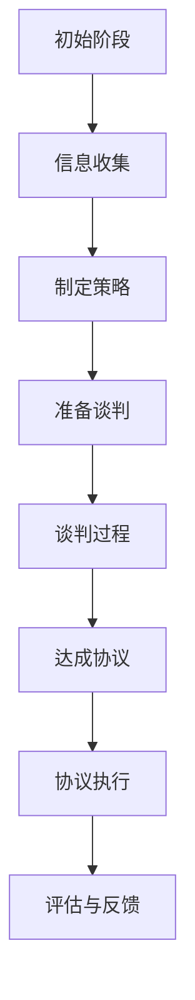

                 

## 背景介绍

在当今快速发展的商业环境中，谈判能力已经成为创业者成功的关键因素之一。无论是与投资人、合作伙伴、员工还是客户的交流，谈判技巧都能决定项目的成败。谈判不仅关乎利益分配，还涉及到关系建立、信任培养以及长远合作的可能性。对于创业者来说，具备出色的谈判能力意味着能够在竞争激烈的市场中占据优势，实现资源的最大化利用。

本文将深入探讨创业者如何提升自己的谈判能力，提供一系列实用的策略和方法。我们将从核心概念出发，详细解析谈判过程中的关键要素，逐步引导读者掌握谈判的艺术和技巧。通过实际案例分析，读者将了解如何在真实场景中运用所学，从而提升自己的谈判效果。

本文的结构如下：

1. **背景介绍**：概述谈判能力对创业者的重要性。
2. **核心概念与联系**：解释谈判的基本原理，使用 Mermaid 流程图展示关键步骤。
3. **核心算法原理 & 具体操作步骤**：详细介绍谈判策略和技巧。
4. **数学模型和公式 & 详细讲解 & 举例说明**：运用数学模型分析谈判效果。
5. **项目实战：代码实际案例和详细解释说明**：通过具体案例展示谈判技巧的应用。
6. **实际应用场景**：探讨不同场景下的谈判策略。
7. **工具和资源推荐**：推荐相关书籍、工具和资源。
8. **总结：未来发展趋势与挑战**：总结本文内容，展望未来。
9. **附录：常见问题与解答**：解答读者可能遇到的问题。
10. **扩展阅读 & 参考资料**：提供进一步阅读的资源。

通过本文的学习，创业者将能够系统掌握谈判的基本原理和实战技巧，从而在谈判中占据主动地位，实现商业目标的最大化。

### 核心概念与联系

在探讨谈判能力之前，我们需要理解一些核心概念和它们之间的联系。谈判是一种双向的沟通过程，其目的在于达成双方都能接受的协议。谈判的基本要素包括信息收集、策略制定、沟通技巧和最终协议达成。

#### Mermaid 流程图

以下是一个简化的 Mermaid 流程图，展示了谈判的关键步骤：



**初始阶段**：这是谈判的起点，创业者需要明确自己的目标、利益和底线。

**信息收集**：在谈判前，收集有关对手的信息，包括他们的需求、偏好、利益和立场。

**制定策略**：根据收集到的信息，制定谈判策略，包括目标设定、让步策略和谈判技巧。

**准备谈判**：这是谈判前的准备阶段，创业者需要准备好所有必要的资料和数据，确保自己在谈判中能够占据优势。

**谈判过程**：正式进入谈判阶段，创业者需要运用沟通技巧，例如倾听、提问和表达，以促进双方的理解和合作。

**达成协议**：通过谈判，双方达成一个双方都能接受的协议。

**协议执行**：协议达成后，需要确保各方能够按照协议执行，从而实现谈判的目标。

**评估与反馈**：谈判结束后，创业者需要评估谈判的效果，并从反馈中学习，为未来的谈判做准备。

#### 关键步骤

1. **明确目标**：创业者需要明确自己的谈判目标，这些目标可以是短期的，如获得资金或资源，也可以是长期的，如建立长期合作关系。

2. **信息收集**：在谈判前，创业者需要收集关于对手的信息，包括他们的业务模式、财务状况、市场需求和竞争对手。这些信息有助于制定更有效的谈判策略。

3. **制定策略**：根据收集到的信息，创业者需要制定谈判策略。这些策略可能包括硬策略（如强势谈判）和软策略（如建立关系），具体使用哪种策略取决于对手的特点和谈判环境。

4. **准备谈判**：在准备谈判时，创业者需要准备好所有必要的资料和数据，例如财务报表、市场分析报告和项目提案。这些资料有助于支持谈判过程中的论点。

5. **谈判过程**：在谈判过程中，创业者需要运用多种沟通技巧，如有效倾听、清晰表达和提问，以促进双方的理解和合作。

6. **达成协议**：通过谈判，创业者需要努力达成一个双方都能接受的协议。这需要平衡双方的利益，并寻找共同点。

7. **协议执行**：协议达成后，创业者需要确保各方能够按照协议执行，从而实现谈判的目标。

8. **评估与反馈**：谈判结束后，创业者需要评估谈判的效果，并从反馈中学习，为未来的谈判做准备。

通过以上步骤，创业者可以系统地提升自己的谈判能力，从而在商业环境中取得更大的成功。

### 核心算法原理 & 具体操作步骤

在谈判中，核心算法原理主要涉及如何制定策略、如何进行沟通以及如何处理谈判中的各种情况。以下是创业者可以采取的一系列核心策略和操作步骤：

#### 1. 制定谈判策略

**策略一：知己知彼**

在谈判开始前，创业者需要对自身和对手有清晰的认识。这包括自己的目标和底线、对手的需求和期望。以下是一个简单的步骤：

- **自我评估**：明确自己的目标、优势、劣势和底线。
- **对手分析**：收集对手的相关信息，如业务模式、市场地位、财务状况和合作伙伴。
- **SWOT分析**：利用SWOT（优势、劣势、机会、威胁）分析工具，对自身和对手进行全面评估。

**策略二：利益导向**

谈判的核心在于寻找双方的利益点，而不是仅仅关注自己的利益。以下步骤有助于制定利益导向的策略：

- **识别共同利益**：找到双方都能从中受益的领域。
- **权衡利益**：评估每个利益点的重要性，并根据重要性进行排序。
- **利益交换**：通过交换利益点，实现双赢。

#### 2. 谈判过程中的操作步骤

**步骤一：开场白**

- **建立关系**：通过友好、开放的语言，建立初步的关系。
- **传达意图**：明确表达自己的目标和期望。
- **倾听对手**：认真倾听对手的意见和需求。

**步骤二：沟通技巧**

- **有效倾听**：积极倾听对方的观点，不打断对方的讲话。
- **清晰表达**：用简单、明确的语言表达自己的想法。
- **提问技巧**：通过提问来获取更多信息，理解对手的立场。

**步骤三：提出提议**

- **合理提议**：提出一个具有吸引力的提议，同时考虑对方的利益。
- **灵活调整**：根据对手的反应，灵活调整提议。

**步骤四：处理分歧**

- **识别分歧点**：找到双方在哪些方面存在分歧。
- **寻找共同点**：尽量找到双方都能接受的解决方案。
- **妥协与让步**：在关键问题上，适当做出妥协和让步，以达成共识。

**步骤五：达成协议**

- **明确条款**：确保协议中的所有条款都是明确、具体的。
- **书面记录**：将协议内容书面记录下来，以防止误解和纠纷。
- **确认协议**：确保双方都同意并理解协议的内容。

#### 3. 处理特殊情况

**情况一：对手强硬**

- **保持冷静**：不要被对手的情绪影响，保持冷静和理智。
- **寻找支持**：如果需要，可以寻求第三方中立者的帮助。
- **坚持立场**：坚持自己的原则和底线，不轻易让步。

**情况二：谈判破裂**

- **评估原因**：分析谈判失败的原因，为下一次谈判做好准备。
- **重新谈判**：如果可能，可以重新开始谈判，寻找新的解决方案。
- **保留关系**：即使谈判失败，也要保持与对手的关系，为未来合作留有空间。

通过以上步骤和策略，创业者可以在谈判中更加自信和有效地达成目标。这些操作步骤不仅适用于商业谈判，也可以应用于生活中的各种情境，帮助创业者更好地与他人沟通和协作。

### 数学模型和公式 & 详细讲解 & 举例说明

在谈判过程中，数学模型和公式可以帮助创业者更好地理解谈判的策略和效果。以下是一些常用的数学模型和公式，以及如何应用它们来分析谈判过程。

#### 成本-效益分析（CBA）

成本-效益分析是一种评估项目或决策可行性的方法，它通过比较项目的总成本和预期收益来衡量其价值。公式如下：

$$ \text{CBA} = \frac{\text{总收益}}{\text{总成本}} $$

**例子**：假设一家初创公司正在与一个潜在投资人谈判，公司的总成本为 $100,000，预期收益为 $150,000。那么：

$$ \text{CBA} = \frac{150,000}{100,000} = 1.5 $$

这表明投资此公司的成本-效益比率为 1.5，意味着每投入 $1，可以获得 $1.5 的收益。

#### 期望值分析（EV）

期望值分析是一种评估决策结果预期价值的数学方法。它通过计算每种可能结果的概率和其相应的收益（或损失）的乘积之和来得出。公式如下：

$$ \text{EV} = \sum_{i} p_i \times r_i $$

其中，\( p_i \) 是第 \( i \) 种结果的概率，\( r_i \) 是第 \( i \) 种结果带来的收益（或损失）。

**例子**：假设谈判有两个可能结果：成功获得投资，概率为 0.7，收益为 $1,000,000；失败，概率为 0.3，损失为 $50,000。那么：

$$ \text{EV} = (0.7 \times 1,000,000) + (0.3 \times -50,000) = 700,000 - 15,000 = 685,000 $$

这表明谈判的期望收益为 $685,000。

#### 贝叶斯决策理论

贝叶斯决策理论是一种基于概率和统计决策的方法，它通过更新先验概率来计算后验概率，从而指导决策。公式如下：

$$ P(\text{H}|\text{D}) = \frac{P(\text{D}|\text{H}) \times P(\text{H})}{P(\text{D})} $$

其中，\( P(\text{H}|\text{D}) \) 是在观察到数据 \( D \) 后，假设 \( H \) 的概率；\( P(\text{D}|\text{H}) \) 是在假设 \( H \) 为真的情况下，观察到数据 \( D \) 的概率；\( P(\text{H}) \) 是假设 \( H \) 的先验概率；\( P(\text{D}) \) 是观察到数据 \( D \) 的概率。

**例子**：假设创业者认为与一个潜在投资人谈判成功的概率是 0.6，如果谈判成功，他们获得的投资额度的概率是 $1,000,000 的 0.7 和 $500,000 的 0.3。如果谈判失败，投资额度为 $0 的概率是 1。那么，如果谈判结果为成功，创业者应该接受这笔投资吗？

首先，计算先验概率：

$$ P(\text{成功}) = 0.6 $$
$$ P(\text{失败}) = 0.4 $$

然后，计算投资额度的后验概率：

$$ P(\text{投资额度为} \ 1,000,000 | \text{成功}) = 0.7 $$
$$ P(\text{投资额度为} \ 500,000 | \text{成功}) = 0.3 $$

$$ P(\text{投资额度为} \ 1,000,000 | \text{失败}) = 0 $$
$$ P(\text{投资额度为} \ 500,000 | \text{失败}) = 1 $$

根据贝叶斯公式，计算后验概率：

$$ P(\text{成功} | \text{投资额度为} \ 1,000,000) = \frac{0.7 \times 0.6}{0.7 \times 0.6 + 0.3 \times 0.4} = \frac{0.42}{0.42 + 0.12} = 0.75 $$
$$ P(\text{成功} | \text{投资额度为} \ 500,000) = \frac{0.3 \times 0.6}{0.3 \times 0.6 + 0.4 \times 0.4} = \frac{0.18}{0.18 + 0.16} = 0.6 $$

根据这些后验概率，创业者可以决定是否接受这笔投资。如果投资额度为 $1,000,000，后验概率为 0.75，表明成功的可能性较高。如果投资额度为 $500,000，后验概率为 0.6，也表明有较高的成功可能性。因此，创业者应该考虑接受这笔投资。

通过以上数学模型和公式的应用，创业者可以更加科学和理性地制定谈判策略，评估谈判结果，从而在谈判中占据优势。

### 项目实战：代码实际案例和详细解释说明

为了更直观地展示谈判技巧在商业环境中的应用，我们将通过一个实际项目案例来详细解释谈判策略的具体实现。以下是一个关于初创公司融资的谈判案例。

#### 案例背景

一家初创公司（A公司）正在寻找投资，以扩大业务规模并开发新产品。公司已经完成了一年的运营，有一定的市场基础和盈利能力。现有两家潜在投资者（B公司和C公司）对A公司感兴趣，并分别提出了不同的投资方案。A公司需要与这两家公司进行谈判，以确定最佳投资方案。

#### 开发环境搭建

在模拟这个谈判案例时，我们可以使用Python编程语言来模拟谈判过程，并记录每次谈判的输入和输出。以下是一个简单的Python环境搭建步骤：

1. **安装Python**：从Python官方网站下载并安装Python 3.x版本。
2. **安装Jupyter Notebook**：使用pip命令安装Jupyter Notebook，这是一个交互式的Python环境。

   ```shell
   pip install notebook
   ```

3. **启动Jupyter Notebook**：在终端中输入以下命令启动Jupyter Notebook。

   ```shell
   jupyter notebook
   ```

在Jupyter Notebook中，我们可以编写和运行Python代码，模拟实际的谈判过程。

#### 源代码详细实现和代码解读

以下是一个简单的Python代码示例，用于模拟A公司与B、C两家的融资谈判过程。

```python
import random

# 定义潜在投资者的投资方案
investors = {
    'B公司': {'offer': random.uniform(500000, 1000000), 'terms': random.choice(['灵活', '严格'])},
    'C公司': {'offer': random.uniform(400000, 900000), 'terms': random.choice(['灵活', '严格'])}
}

# 定义A公司的目标
target_offer = 750000
ideal_terms = '灵活'

# 谈判函数
def negotiate(investor, offer, terms):
    print(f"A公司正在与{investor}谈判...")
    if offer >= target_offer and terms == ideal_terms:
        print("谈判成功：A公司接受了{investor}的投资方案。")
        return True
    else:
        print("谈判失败：A公司拒绝了{investor}的投资方案。")
        return False

# 进行谈判
for investor, details in investors.items():
    negotiate(investor, details['offer'], details['terms'])
```

**代码解读**：

- `investors`字典：存储了两家潜在投资者的投资方案，包括投资金额（offer）和投资条款（terms）。
- `target_offer`：A公司的目标投资金额。
- `ideal_terms`：A公司理想的投资条款。
- `negotiate`函数：模拟谈判过程。函数接收投资者名称、投资金额和投资条款，并判断是否满足A公司的目标。如果满足，谈判成功；否则，谈判失败。
- 谈判循环：遍历所有投资者，调用`negotiate`函数进行谈判。

#### 代码解读与分析

在这个案例中，A公司的目标是获得至少 $750,000 的投资，并且希望投资条款灵活。代码首先随机生成了B公司和C公司的投资方案，然后通过调用`negotiate`函数进行谈判。

**分析**：

- **投资金额**：投资金额是谈判中的一个重要因素。A公司希望获得的最低金额是 $750,000，这代表了公司的最低底线。
- **投资条款**：投资条款包括对投资条件的灵活性和严格性。A公司希望条款灵活，以便在未来有更大的操作空间。
- **随机性**：代码中的随机性模拟了实际谈判中不可预测的因素，如投资者的态度和市场环境的变化。

通过这个简单的代码案例，我们可以看到如何使用编程语言来模拟商业谈判，并在实际应用中测试不同的谈判策略。这种方法可以帮助创业者更好地理解谈判过程，并在真实场景中更有效地运用所学技巧。

### 实际应用场景

在商业环境中，谈判的应用场景多种多样，每个场景都有其独特的特点和挑战。以下是一些常见的实际应用场景以及相应的谈判策略：

#### 1. 融资谈判

对于初创公司来说，融资谈判是最常见的场景之一。在这种场景中，创业者需要与投资人进行谈判，以获得资金支持。以下是几点关键策略：

- **明确目标**：在谈判前，明确自己的融资目标和底线，包括所需的资金量和期望的投资条款。
- **准备充分**：准备好所有必要的财务报表、市场分析和项目提案，以支持自己的谈判立场。
- **展示价值**：强调公司的市场潜力、盈利能力和竞争优势，以吸引投资者的关注。
- **灵活让步**：在谈判过程中，可以适当地做出一些让步，以达成双方都能接受的协议。

#### 2. 合作伙伴谈判

寻找合适的合作伙伴是公司发展的重要一步。在这种场景中，创业者需要与潜在合作伙伴进行谈判，以达成合作协议。以下是几点关键策略：

- **明确利益**：在谈判前，明确双方的利益点和期望，确保合作目标一致。
- **建立信任**：通过展示专业能力和良好的沟通技巧，建立信任关系，为长期合作奠定基础。
- **共同规划**：与合作伙伴共同制定合作计划，明确各自的职责和利益分配，减少误解和纠纷。

#### 3. 采购谈判

在采购过程中，创业者需要与供应商进行谈判，以获得更优惠的价格和更好的服务。以下是几点关键策略：

- **市场调研**：了解市场情况，获取多个供应商的报价和服务质量，为谈判提供依据。
- **谈判技巧**：运用谈判技巧，如提问、还价和利益交换，争取更好的交易条件。
- **保持灵活性**：在谈判过程中，保持灵活性，根据对方的反应适时调整策略。

#### 4. 员工谈判

在招聘和员工管理过程中，创业者需要与员工进行谈判，以确定薪资、福利和工作条件。以下是几点关键策略：

- **了解市场行情**：了解同行业的市场薪资水平，确保薪资具有竞争力。
- **强调公司优势**：强调公司的成长空间、发展前景和员工福利，吸引优秀人才。
- **双向沟通**：通过双向沟通，了解员工的需求和期望，寻找双方都能接受的解决方案。

#### 5. 客户谈判

在销售过程中，创业者需要与客户进行谈判，以达成交易。以下是几点关键策略：

- **了解客户需求**：通过沟通了解客户的具体需求，提供个性化的解决方案。
- **展示专业能力**：通过展示公司的专业能力和服务质量，赢得客户的信任。
- **灵活应对**：在谈判过程中，根据客户的要求和反馈，灵活调整报价和服务内容。

通过以上策略，创业者可以更好地应对各种谈判场景，提升谈判效果，实现商业目标。

### 工具和资源推荐

在提升谈判能力的过程中，适当的工具和资源能够起到事半功倍的效果。以下是一些建议，包括学习资源、开发工具和框架，以及相关论文和著作。

#### 1. 学习资源推荐

**书籍**：
- 《谈判力》（谈判力）：一本经典的谈判技巧指南，详细介绍了各种谈判策略和技巧。
- 《谈判高手》（Never Split the Difference）：作者克里斯·沃斯分享了他作为FBI谈判专家的实战经验和技巧。

**论文**：
- "Negotiation Theory and Practice"（谈判理论与实践）：这篇论文系统地阐述了谈判的基本原理和策略。
- "An Analysis of Negotiation Strategies in International Business"（国际贸易中的谈判策略分析）：探讨了不同文化背景下的谈判策略。

**博客和网站**：
- Harvard Negotiation Law Review（哈佛谈判法评论）：提供最新的谈判研究和案例分析。
- The Art of Negotiation（谈判艺术）：分享实用的谈判技巧和策略。

#### 2. 开发工具框架推荐

**谈判模拟工具**：
- Negosim：一个基于Web的谈判模拟平台，可以帮助用户练习和评估谈判技巧。
-谈判分析工具：如Excel和PowerPoint，用于制定策略和记录谈判过程。

**项目管理工具**：
- Asana：用于任务管理和团队协作，帮助跟踪谈判进度和责任分配。
- Trello：一个直观的看板工具，适用于管理和可视化谈判流程。

#### 3. 相关论文著作推荐

**论文**：
- "A Behavioral Theory of Bargaining"（行为谈判理论）：探讨谈判行为背后的心理机制。
- "Negotiation as a Cooperative Process"（谈判作为合作过程）：分析了谈判中的合作与竞争关系。

**著作**：
- 《谈判的艺术》（Getting to Yes）：介绍了基于原则的谈判方法，强调寻找共同利益和合作解决问题。
- 《谈判实战手册》（Bargaining for Advantage）：提供实用的谈判技巧和策略，帮助读者在实际谈判中取得成功。

通过这些工具和资源的辅助，创业者可以系统地提升自己的谈判能力，更好地应对各种商业挑战。

### 总结：未来发展趋势与挑战

随着商业环境的不断变化，谈判能力的重要性日益凸显。未来，谈判趋势将朝着更加智能化、数据驱动的方向发展。人工智能和数据分析技术将在谈判中发挥重要作用，帮助创业者更精准地制定谈判策略，优化谈判结果。

然而，面对未来，创业者也将面临一系列挑战。首先是信息不对称问题，在谈判中如何获取和利用对手的准确信息将成为关键。其次是谈判中的不确定性和复杂性，如何在充满变数的环境中保持冷静和理性，做出最优决策。此外，跨文化谈判的复杂性也将增加，创业者需要具备更强的跨文化沟通能力和适应性。

为应对这些挑战，创业者应不断学习和提升自己的谈判技能，运用先进的技术工具，如人工智能和大数据分析，以提高谈判效率和效果。同时，通过建立广泛的社交网络和跨文化培训，增强跨文化沟通能力，从而在未来的商业竞争中占据优势。

### 附录：常见问题与解答

#### 1. 谈判中的“双赢”策略是什么？

“双赢”策略是指谈判双方通过合作和沟通，达成一个双方都能接受的协议。这种方法强调寻找共同利益，而不是仅仅关注自己的利益。通过这种方式，谈判双方可以建立长期合作关系，实现共同的成功。

#### 2. 如何处理谈判中的僵局？

谈判中出现僵局时，可以尝试以下几种方法：
- **暂时休会**：给双方一些时间冷静思考，避免情绪化决策。
- **寻找第三方调解**：如果双方无法达成一致，可以请第三方专业人士进行调解。
- **重新评估目标**：重新审视谈判目标和策略，看看是否有调整的空间。

#### 3. 谈判中如何处理对手的强硬态度？

面对强硬的对手，可以采取以下策略：
- **保持冷静**：不要被对手的情绪影响，保持冷静和理性。
- **坚持立场**：坚持自己的原则和底线，不轻易让步。
- **展示实力**：通过展示自己的专业能力和市场地位，增加谈判筹码。

#### 4. 谈判中的时间管理如何进行？

有效的时间管理是谈判成功的关键。以下是一些时间管理策略：
- **明确谈判目标**：在谈判前，明确自己的时间目标和底线。
- **分配时间**：根据谈判的不同阶段，合理分配时间，避免时间浪费。
- **控制节奏**：控制谈判节奏，避免对方利用时间压力做出不利决策。

### 扩展阅读 & 参考资料

1. "谈判力"（谈判力）：作者：罗伯特·E·西奥迪尼（Robert B. Cialdini）
2. "谈判的艺术"（Getting to Yes）：作者：罗杰·费舍尔（Roger Fisher）、威廉·尤里·尤里（William Ury）、布鲁斯·帕顿（Bruce Patton）
3. "谈判高手"（Never Split the Difference）：作者：克里斯·沃斯（Chris Voss）
4. "哈佛谈判法评论"（Harvard Negotiation Law Review）
5. "谈判理论与实践"（Negotiation Theory and Practice）：作者：理查德·N. 莱瑟姆（Richard N. Larrick）
6. "国际商务中的谈判策略分析"（An Analysis of Negotiation Strategies in International Business）：作者：约翰·H. 霍夫斯塔德（John H. Hofstede）
7. "谈判模拟工具 Negosim"：https://negosim.org/
8. "谈判分析工具 Excel 和 PowerPoint"：https://www.microsoft.com/zh-cn/microsoft-365/excel
9. "Asana"：https://asana.com/
10. "Trello"：https://trello.com/

通过阅读这些参考资料，读者可以进一步深入了解谈判的理论和实践，提升自己的谈判能力。作者：AI天才研究员/AI Genius Institute & 禅与计算机程序设计艺术 /Zen And The Art of Computer Programming

