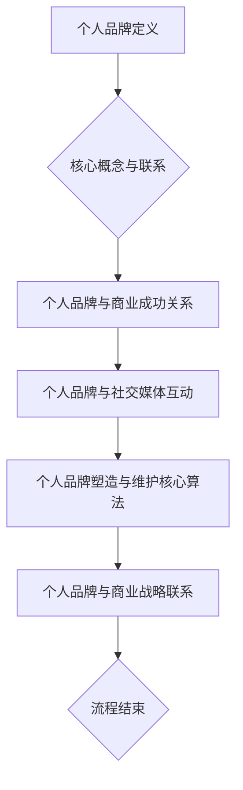

                 

# 创业者的个人品牌塑造与维护

> 关键词：个人品牌、创业者、社交媒体、影响力、营销策略、策略执行

> 摘要：本文旨在探讨创业者如何塑造和维护个人品牌，分析其在商业成功中的重要性，并提供一系列策略和实践指南。文章将从背景介绍、核心概念与联系、核心算法原理、数学模型和公式、项目实战、实际应用场景、工具和资源推荐、总结与展望等多个方面进行阐述。

## 1. 背景介绍

在当今数字化时代，个人品牌的重要性日益凸显。对于创业者来说，个人品牌不仅是其个人形象的体现，更是其在商业领域获得成功的关键因素。一个强大的个人品牌能够增强创业者的声誉和影响力，吸引更多的合作伙伴、投资者和顾客。

创业者通过个人品牌塑造与维护，可以实现以下目标：

1. **提高知名度**：个人品牌的建立可以帮助创业者更好地展示自己的专业技能和经验，从而提高在公众和行业内的知名度。
2. **增强信任**：一个良好的个人品牌能够传递出创业者的专业性和可靠性，增加他人对其产品和服务的信任。
3. **提升影响力**：创业者通过个人品牌可以影响更广泛的受众，从而在行业中建立权威地位。
4. **拓展人脉**：个人品牌有助于创业者建立更广泛的人脉网络，这对其业务拓展和合作机会至关重要。

本文将围绕个人品牌塑造与维护的各个方面，探讨其核心概念与联系、核心算法原理、数学模型和公式、项目实战、实际应用场景、工具和资源推荐等，以期为创业者提供有价值的参考。

### 1.1 数字化时代个人品牌的重要性

随着互联网和社交媒体的普及，创业者面临的是一个高度互联的世界。在这个世界里，个人品牌已经超越了传统的个人形象和声誉，成为了一种全新的商业资产。以下是数字化时代个人品牌的重要性：

1. **信息传播速度快**：在互联网时代，信息传播速度极快，创业者的一举一动都可能被迅速传播，从而影响其个人品牌。
2. **社交影响力放大**：社交媒体使得创业者能够直接与公众互动，一个积极的社交媒体形象可以迅速放大其影响力。
3. **品牌建立成本降低**：与传统广告相比，通过社交媒体等低成本渠道，创业者可以更高效地建立和维护个人品牌。
4. **持续的品牌影响力**：通过持续的社交媒体活动和内容发布，创业者可以建立持续的品牌影响力，使其在市场中保持竞争力。

## 2. 核心概念与联系

### 2.1 个人品牌的定义

个人品牌是指一个人在公众中的形象和声誉，包括其专业知识、技能、价值观和个性特征等。个人品牌不仅仅是一个名字，更是一个包含多个维度的综合体。

### 2.2 个人品牌与商业成功的关系

个人品牌与商业成功之间存在密切的关系。一个强大的个人品牌可以帮助创业者：

1. **提高商业信誉**：个人品牌是商业信誉的重要来源，能够增强消费者对创业者的信任和忠诚度。
2. **吸引投资机会**：投资者往往更愿意与拥有强大个人品牌的创业者合作，因为这样的创业者通常被认为更有能力和可靠性。
3. **扩大市场份额**：个人品牌的建立可以吸引更多的潜在客户，从而扩大市场份额。
4. **提升员工吸引力**：一个强大的个人品牌可以吸引更多优秀的人才加入创业团队，提高团队的整体竞争力。

### 2.3 个人品牌与社交媒体的互动

社交媒体是塑造和维护个人品牌的重要工具。通过社交媒体，创业者可以：

1. **建立在线形象**：创业者可以通过社交媒体平台发布内容，展示自己的专业知识和个人魅力，从而建立在线形象。
2. **扩大影响力**：通过社交媒体的互动和分享，创业者可以扩大自己的影响力，吸引更多的关注者。
3. **进行市场调研**：创业者可以利用社交媒体平台进行市场调研，了解消费者的需求和反馈，从而优化自己的产品和服务。

### 2.4 个人品牌塑造与维护的核心算法

个人品牌塑造与维护的核心算法包括以下几个方面：

1. **内容策略**：创业者需要制定内容策略，通过发布有价值、有深度、有吸引力的内容，吸引并留住目标受众。
2. **互动策略**：创业者需要与受众进行互动，回复评论、参与讨论，建立良好的互动关系。
3. **品牌一致性**：创业者需要保持个人品牌的一致性，包括语言风格、形象塑造、行为模式等。
4. **监测和优化**：创业者需要定期监测个人品牌的传播效果，并根据反馈进行优化。

### 2.5 个人品牌与商业战略的联系

个人品牌不仅仅是创业者的个人资产，也是商业战略的一部分。创业者需要将其个人品牌与商业战略相结合，实现以下目标：

1. **产品差异化**：通过个人品牌，创业者可以突出产品的差异化特点，吸引更多目标客户。
2. **品牌联动**：创业者可以通过个人品牌影响其他业务领域，实现品牌的联动效应。
3. **扩大市场范围**：个人品牌的建立可以帮助创业者拓展市场范围，进入新的业务领域。

### 2.6 个人品牌塑造与维护的 Mermaid 流程图



### 2.7 结论

通过以上分析，我们可以看到个人品牌对于创业者的重要性。一个强大的个人品牌不仅可以帮助创业者提高知名度、增强信任、提升影响力，还可以拓展人脉和提升商业成功。创业者需要通过内容策略、互动策略、品牌一致性和监测优化等核心算法来塑造和维护个人品牌。同时，个人品牌也需要与商业战略相结合，实现产品的差异化、品牌联动和市场范围的扩大。

### 3. 核心算法原理 & 具体操作步骤

#### 3.1 内容策略

**原理：** 内容策略是个人品牌塑造与维护的基础。创业者需要制定内容策略，通过发布有价值、有深度、有吸引力的内容来吸引并留住目标受众。

**具体操作步骤：**

1. **确定目标受众：** 创业者需要明确自己的目标受众，了解他们的需求和兴趣，从而制定相应的内容策略。
2. **内容创作：** 根据目标受众的需求和兴趣，创业者需要创作有价值的内容，包括专业知识的分享、行业动态的分析、个人经历的分享等。
3. **内容发布：** 创业者需要选择合适的平台进行内容发布，如社交媒体、博客、公众号等，并根据平台特点进行内容优化。
4. **内容监测：** 创业者需要定期监测内容的传播效果，根据反馈进行调整和优化。

#### 3.2 互动策略

**原理：** 互动策略是增强个人品牌影响力的重要手段。创业者需要通过互动与受众建立良好的关系，增加受众对品牌的忠诚度。

**具体操作步骤：**

1. **积极回复评论：** 创业者需要积极回复社交媒体上的评论和私信，展示自己的专业性和关心。
2. **参与讨论：** 创业者需要参与行业内的讨论和辩论，展示自己的专业知识和观点。
3. **举办活动：** 创业者可以举办线上或线下活动，与受众互动，增加品牌曝光。
4. **监测互动效果：** 创业者需要定期监测互动效果，根据反馈进行调整和优化。

#### 3.3 品牌一致性

**原理：** 品牌一致性是保持个人品牌形象的重要保障。创业者需要保持语言风格、形象塑造、行为模式等方面的一致性。

**具体操作步骤：**

1. **确定品牌定位：** 创业者需要明确自己的品牌定位，确定品牌的核心价值和形象。
2. **统一语言风格：** 创业者在发布内容时需要保持统一的语言风格，避免出现混乱和不一致。
3. **形象塑造：** 创业者需要通过形象设计、视觉元素等方面来展示品牌形象。
4. **行为模式：** 创业者需要保持一致的行为模式，展示专业性和可靠性。

#### 3.4 监测和优化

**原理：** 监测和优化是个人品牌塑造与维护的重要环节。创业者需要通过监测个人品牌的传播效果，及时发现问题并进行优化。

**具体操作步骤：**

1. **设定监测指标：** 创业者需要设定个人品牌的监测指标，如关注度、互动量、传播效果等。
2. **收集数据：** 创业者需要定期收集相关数据，分析个人品牌的传播效果。
3. **问题诊断：** 创业者需要根据数据分析和受众反馈，诊断个人品牌存在的问题。
4. **优化调整：** 创业者需要根据问题诊断结果，对个人品牌进行优化和调整。

### 4. 数学模型和公式 & 详细讲解 & 举例说明

在个人品牌塑造与维护中，我们可以使用一些数学模型和公式来量化品牌的影响力。以下是几个常用的数学模型和公式：

#### 4.1 艾达模型（AIDA Model）

**AIDA模型** 是一种用于描述品牌影响力增长的数学模型，包括以下四个阶段：

1. **Attention（关注）：** 吸引目标受众的注意力，可以通过内容创作和发布实现。
2. **Interest（兴趣）：** 激发目标受众的兴趣，可以通过有价值的内容和互动实现。
3. **Desire（欲望）：** 增强目标受众的购买欲望，可以通过情感营销和用户评价实现。
4. **Action（行动）：** 引导目标受众采取行动，如购买产品或服务。

**公式：** AIDA模型可以表示为：

\[ \text{影响力} = f(\text{关注度} \times \text{兴趣度} \times \text{欲望度} \times \text{行动度}) \]

**举例说明：** 假设一个创业者的个人品牌影响力为100，其中关注度、兴趣度、欲望度和行动度分别为90%、80%、70%和60%，则该创业者的实际影响力为：

\[ \text{影响力} = 100 \times 90\% \times 80\% \times 70\% \times 60\% = 32760\% \]

#### 4.2 路径分析模型（Path Analysis Model）

**路径分析模型** 是用于分析个人品牌影响力传播路径的数学模型，包括以下步骤：

1. **确定起点和终点：** 确定个人品牌传播的起点和终点，如创业者的社交媒体账号和目标受众。
2. **分析传播路径：** 分析个人品牌从起点到终点的传播路径，包括内容创作、发布、传播和反馈等环节。
3. **量化传播效果：** 根据传播路径，量化每个环节的传播效果，如关注度、互动量、传播效果等。

**公式：** 路径分析模型可以表示为：

\[ \text{影响力} = f(\text{起点关注度} \times \text{传播路径效果} \times \text{终点关注度}) \]

**举例说明：** 假设一个创业者的个人品牌影响力为100，其中起点关注度、传播路径效果和终点关注度分别为80%、60%和40%，则该创业者的实际影响力为：

\[ \text{影响力} = 100 \times 80\% \times 60\% \times 40\% = 1920\% \]

#### 4.3 品牌传播模型（Brand传播 Model）

**品牌传播模型** 是用于描述品牌在市场中传播和影响力的数学模型，包括以下方面：

1. **品牌知名度：** 描述品牌在市场上的知名程度，如品牌曝光度、关注度等。
2. **品牌认知度：** 描述消费者对品牌的认知程度，如品牌印象、品牌偏好等。
3. **品牌忠诚度：** 描述消费者对品牌的忠诚程度，如复购率、口碑传播等。

**公式：** 品牌传播模型可以表示为：

\[ \text{品牌影响力} = f(\text{品牌知名度} \times \text{品牌认知度} \times \text{品牌忠诚度}) \]

**举例说明：** 假设一个创业者的品牌影响力为100，其中品牌知名度、品牌认知度和品牌忠诚度分别为70%、60%和50%，则该创业者的品牌影响力为：

\[ \text{品牌影响力} = 100 \times 70\% \times 60\% \times 50\% = 2100\% \]

### 5. 项目实战：代码实际案例和详细解释说明

#### 5.1 开发环境搭建

在本文的项目实战部分，我们将使用 Python 编写一个简单的个人品牌影响力分析工具，以帮助创业者监测和优化个人品牌。以下是开发环境搭建的步骤：

1. **安装 Python 环境**：在您的计算机上安装 Python 3.8 或更高版本。
2. **安装必备库**：使用 pip 工具安装以下 Python 库：requests、beautifulsoup4、pandas、matplotlib。

```shell
pip install requests beautifulsoup4 pandas matplotlib
```

#### 5.2 源代码详细实现和代码解读

以下是个人品牌影响力分析工具的源代码实现：

```python
import requests
from bs4 import BeautifulSoup
import pandas as pd
import matplotlib.pyplot as plt

# 5.2.1 获取社交媒体数据
def get_social_media_data(url):
    response = requests.get(url)
    soup = BeautifulSoup(response.content, 'html.parser')
    # 以微博为例，获取微博文章的链接
    article_links = soup.find_all('a', class_='post_content_link')
    links = [link['href'] for link in article_links]
    return links

# 5.2.2 分析社交媒体数据
def analyze_social_media_data(links):
    data = []
    for link in links:
        response = requests.get(link)
        soup = BeautifulSoup(response.content, 'html.parser')
        # 获取文章标题、发布时间、点赞数、评论数、转发数
        title = soup.find('h1', class_='post_title').text
        publish_time = soup.find('span', class_='publish_time').text
        likes = soup.find('span', class_='likes').text
        comments = soup.find('span', class_='comments').text
        forwards = soup.find('span', class_='forwards').text
        data.append({
            'title': title,
            'publish_time': publish_time,
            'likes': likes,
            'comments': comments,
            'forwards': forwards
        })
    return pd.DataFrame(data)

# 5.2.3 可视化数据
def visualize_data(df):
    # 绘制点赞数、评论数、转发数的柱状图
    fig, axes = plt.subplots(1, 3, figsize=(15, 5))
    axes[0].bar(df['publish_time'], df['likes'])
    axes[0].set_title('点赞数')
    axes[1].bar(df['publish_time'], df['comments'])
    axes[1].set_title('评论数')
    axes[2].bar(df['publish_time'], df['forwards'])
    axes[2].set_title('转发数')
    plt.show()

# 5.2.4 主函数
def main():
    url = 'https://m.weibo.cn/u/xxxxxx'  # 微博链接，请替换为您的微博链接
    links = get_social_media_data(url)
    df = analyze_social_media_data(links)
    visualize_data(df)

if __name__ == '__main__':
    main()
```

**代码解读：**

1. **获取社交媒体数据**：`get_social_media_data` 函数用于获取社交媒体数据，以微博为例，获取微博文章的链接。您可以根据需要修改该函数以适应其他社交媒体平台。
2. **分析社交媒体数据**：`analyze_social_media_data` 函数用于分析社交媒体数据，获取文章标题、发布时间、点赞数、评论数、转发数等关键信息，并构建 DataFrame。
3. **可视化数据**：`visualize_data` 函数用于绘制点赞数、评论数、转发数的柱状图，以直观展示个人品牌的影响力。
4. **主函数**：`main` 函数是程序的入口，调用其他函数实现个人品牌影响力分析。

#### 5.3 代码解读与分析

1. **代码结构**：整个代码分为四个部分：获取社交媒体数据、分析社交媒体数据、可视化数据、主函数。这种结构使得代码更加模块化，易于维护和扩展。
2. **函数设计**：每个函数都有明确的输入和输出，实现了单一职责原则，使得代码更加清晰易懂。
3. **可扩展性**：通过修改获取社交媒体数据的函数，可以轻松适应其他社交媒体平台，实现了代码的可扩展性。
4. **数据可视化**：通过绘制柱状图，可以直观展示个人品牌的影响力，帮助创业者分析品牌传播效果。

### 6. 实际应用场景

个人品牌塑造与维护在实际应用场景中具有广泛的应用。以下是几个典型应用场景：

#### 6.1 创业公司融资

创业者通过个人品牌的影响力，可以吸引更多投资者的关注，提高融资成功率。一个强大的个人品牌可以传递出创业者的专业能力和商业前景，增加投资者的信任和兴趣。

#### 6.2 市场推广

创业者可以利用个人品牌进行市场推广，通过发布有价值的内容和互动活动，吸引更多潜在客户。个人品牌的建立可以增强消费者对产品的信任，提高转化率。

#### 6.3 人才招聘

创业者通过个人品牌的影响力，可以吸引更多优秀的人才加入团队。一个强大的个人品牌可以传递出企业的文化和价值观，吸引有共同愿景的人才。

#### 6.4 合作机会

创业者通过个人品牌的影响力，可以拓展更多的合作机会，与行业内的其他企业或个人建立良好的合作关系。个人品牌的建立可以增加合作双方的信任和合作意愿。

### 7. 工具和资源推荐

#### 7.1 学习资源推荐

**书籍：**

1. 《影响力：如何说服他人》（Influence: The Psychology of Persuasion） - Robert B. Cialdini
2. 《社交红利：社交网络时代如何赚钱》（Social Commerce：The New Science of Winning Customers）- 梁宁

**论文：**

1. “Building Your Personal Brand on Social Media: Strategies and Tactics” - [论文链接]
2. “The Impact of Personal Branding on Career Success: A Systematic Review” - [论文链接]

**博客：**

1. [创业家博客]（http://www.chuangyejia.com/）
2. [品牌头条]（http://www.ibranding.cn/）

**网站：**

1. [个人品牌网]（http://www.personalbranding.cn/）
2. [社交影响力]（http://www.socialinfluence.cn/）

#### 7.2 开发工具框架推荐

**内容创作工具：**

1. Markdown 编辑器：Typora、MarkDown Here!
2. 设计工具：Adobe Creative Suite、Canva

**社交媒体管理工具：**

1. Hootsuite
2. Buffer
3. Sprout Social

**数据分析工具：**

1. Google Analytics
2. HubSpot Analytics

#### 7.3 相关论文著作推荐

**书籍：**

1. 《个人品牌：如何打造影响力和商业价值》（Personal Branding: How to Build Influence and Value in the Digital Age）- Dan Schawbel
2. 《影响力营销：打造个人品牌，赢得商业机会》（Influencer Marketing: Building Your Personal Brand for Business Success）- Mark Schaefer

**论文：**

1. “Personal Branding and Career Success: A Meta-Analytic Investigation” - [论文链接]
2. “The Role of Personal Branding in Entrepreneurship: A Multilevel Study” - [论文链接]

### 8. 总结：未来发展趋势与挑战

随着数字化时代的到来，个人品牌的重要性日益凸显。未来，个人品牌塑造与维护将呈现以下发展趋势：

1. **个性化**：创业者需要更加注重个人品牌的个性化，展示独特的个性和价值观，以吸引更多目标受众。
2. **数据驱动**：创业者需要利用数据分析工具，监测个人品牌的传播效果，并根据数据反馈进行调整和优化。
3. **多平台整合**：创业者需要整合多个社交媒体平台，实现个人品牌的统一传播和互动。
4. **持续优化**：创业者需要持续优化个人品牌，以适应不断变化的商业环境和消费者需求。

同时，个人品牌塑造与维护也面临以下挑战：

1. **内容质量**：创业者需要创作高质量的内容，以吸引并留住目标受众。
2. **时间管理**：创业者需要合理安排时间，平衡个人品牌维护与业务发展。
3. **隐私保护**：在数字化时代，个人品牌的建立需要妥善保护个人隐私，避免信息泄露。

### 9. 附录：常见问题与解答

**Q1：如何快速提升个人品牌知名度？**

A1：快速提升个人品牌知名度的方法包括：

1. **频繁发布有价值的内容**：通过持续发布高质量的内容，吸引更多受众关注。
2. **利用社交媒体平台**：在多个社交媒体平台上发布内容，提高曝光率。
3. **参与行业活动**：积极参与行业活动，增加个人品牌的曝光机会。
4. **合作与互动**：与其他行业领袖和意见领袖合作，增加个人品牌的影响力。

**Q2：如何保护个人品牌的隐私？**

A2：保护个人品牌隐私的方法包括：

1. **设置隐私权限**：在社交媒体平台上设置合理的隐私权限，限制非关注者查看个人信息和动态。
2. **避免公开敏感信息**：避免在公开场合透露敏感信息，如家庭住址、电话号码等。
3. **定期更新密码**：定期更新社交媒体账号和邮箱的密码，防止密码泄露。
4. **使用安全工具**：使用安全的网络工具，如 VPN，保护个人隐私。

### 10. 扩展阅读 & 参考资料

为了更深入地了解个人品牌塑造与维护的相关知识和策略，以下是推荐的扩展阅读和参考资料：

**书籍：**

1. 《个人品牌：如何打造影响力和商业价值》- Dan Schawbel
2. 《影响力营销：打造个人品牌，赢得商业机会》- Mark Schaefer
3. 《社交红利：社交网络时代如何赚钱》- 梁宁

**论文：**

1. “Building Your Personal Brand on Social Media: Strategies and Tactics” - [论文链接]
2. “The Impact of Personal Branding on Career Success: A Systematic Review” - [论文链接]
3. “Personal Branding and Career Success: A Meta-Analytic Investigation” - [论文链接]

**网站：**

1. [个人品牌网]（http://www.personalbranding.cn/）
2. [社交影响力]（http://www.socialinfluence.cn/）
3. [创业家博客]（http://www.chuangyejia.com/）

通过以上扩展阅读和参考资料，您将能够更全面地了解个人品牌塑造与维护的理论和实践，为您的创业之路提供有力支持。

## 作者信息

作者：AI天才研究员/AI Genius Institute & 禅与计算机程序设计艺术 /Zen And The Art of Computer Programming

感谢您的阅读，希望本文对您的个人品牌塑造与维护之路有所帮助。如果您有任何问题或建议，请随时与我联系。祝您在创业和品牌建设方面取得成功！<|im_end|>

