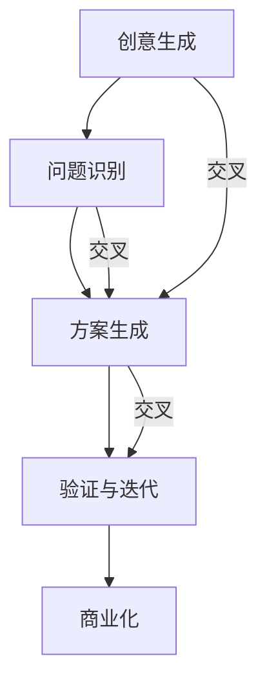

                 

### 背景介绍

在当今快速发展的科技时代，创新思维已经成为推动社会进步和经济发展的重要动力。尤其是对于创业者而言，创新思维更是他们成功的关键因素。随着互联网、人工智能、大数据等新兴技术的不断涌现，市场竞争日益激烈，传统的经营模式和思维模式已经难以适应新的环境。因此，创业者必须具备独特的创新思维，才能在激烈的市场竞争中脱颖而出，实现企业的可持续发展。

创新思维不仅仅是一种理念，它还需要具体的方法和工具来支持和实现。本文将探讨创业者的创新思维，特别是突破常规的创新方法。我们将通过以下几个部分来详细阐述：

1. **核心概念与联系**：首先，我们将介绍创新思维的核心概念，并通过Mermaid流程图展示这些概念之间的联系。
2. **核心算法原理与具体操作步骤**：接着，我们将深入探讨创新思维的算法原理，并详细描述实施创新思维的步骤。
3. **数学模型和公式**：为了更好地理解创新思维，我们还将介绍相关的数学模型和公式，并通过实例进行说明。
4. **项目实战**：通过实际代码案例，我们将展示如何将创新思维应用到实际项目中。
5. **实际应用场景**：我们将讨论创新思维在不同行业和领域中的应用。
6. **工具和资源推荐**：最后，我们将推荐一些学习资源和开发工具，帮助读者进一步探索创新思维。
7. **总结**：在文章的结尾，我们将总结创新思维的未来发展趋势与挑战。

通过本文的阅读，读者将能够理解创新思维的重要性，掌握一系列突破常规的创新方法，并能够将其应用到实际创业中。

### 核心概念与联系

创新思维是一个多维度的概念，它不仅涉及到新的想法和解决方案的生成，还涉及到将这些想法转化为实际成果的过程。为了更好地理解创新思维，我们需要先了解其核心概念，并分析这些概念之间的联系。

#### 1. 创新思维的核心概念

**创意生成**：创新思维的第一步是产生创意。这通常是一个随机的、直觉性的过程，它可能来源于日常生活中的观察、阅读、交流或灵感的涌现。创意是创新思维的源泉。

**问题识别**：在创意生成之后，创业者需要识别并明确问题。这是创新思维的关键步骤，因为只有明确了问题，才能有针对性地寻找解决方案。

**方案生成**：一旦问题被明确，创业者需要开始寻找解决方案。这一步通常需要多个创意的碰撞和结合，以形成最终的方案。

**验证与迭代**：在方案生成之后，创业者需要对方案进行验证，并根据验证结果进行迭代改进。这是一个不断尝试、反思和优化的过程。

**商业化**：最后，创业者需要将创新思维转化为商业成果，实现商业化运作。这是创新思维最终的成功标志。

#### 2. Mermaid流程图

为了直观地展示创新思维的核心概念及其之间的联系，我们可以使用Mermaid流程图来表示。以下是创新思维的核心概念及其联系的Mermaid流程图：



在这个流程图中，A表示创意生成，B表示问题识别，C表示方案生成，D表示验证与迭代，E表示商业化。箭头表示概念之间的联系，而“交叉”表示不同概念之间的相互作用和影响。

#### 3. 创新思维的核心概念联系分析

- **创意生成**与**问题识别**：创意生成和问题识别是创新思维的两个起点。创意生成提供了可能的解决方案，而问题识别则明确了需要解决的特定问题。这两个步骤相互依赖，共同构成了创新思维的基础。

- **方案生成**与**验证与迭代**：方案生成是将创意转化为实际解决方案的过程，而验证与迭代则是确保解决方案有效性和可行性的关键步骤。方案生成和验证与迭代相互促进，共同推动创新思维的发展。

- **商业化**：商业化的目标是将创新思维转化为商业成果，实现经济价值和社会价值。商业化不仅需要有效的解决方案，还需要合理的商业模式和市场策略。

通过上述分析，我们可以看到创新思维的核心概念之间存在着紧密的联系。这些概念相互依赖，共同构成了一个完整的创新思维过程。理解这些概念及其联系，对于创业者来说至关重要，因为它们可以帮助创业者更好地运用创新思维，实现企业的创新和发展。

### 核心算法原理与具体操作步骤

创新思维不仅仅是灵光一现的创意，而是一个系统的、结构化的过程。为了更好地理解和应用创新思维，我们需要深入探讨其核心算法原理，并详细描述实施创新思维的具体操作步骤。

#### 1. 创新思维的核心算法原理

创新思维的核心算法可以概括为“创意生成→问题识别→方案生成→验证与迭代→商业化”。这个算法是一个闭环系统，每个步骤都相互关联，形成一个连续的过程。

**创意生成**：创意生成是创新思维的第一步，它依赖于大量的知识积累、经验积累和灵感。创意生成的核心算法包括联想思维、发散思维和逆向思维。通过这些思维方法，创业者可以从不同的角度和层面思考问题，产生新颖的创意。

**问题识别**：问题识别是创新思维的关键步骤，它要求创业者能够敏锐地捕捉到市场中的痛点和需求。问题识别的核心算法包括用户调研、市场分析和竞品分析。通过这些方法，创业者可以明确问题的本质和范围，为后续的方案生成提供明确的方向。

**方案生成**：方案生成是将创意转化为实际解决方案的过程。这个步骤需要大量的创新方法和技巧，如头脑风暴、思维导图和原型设计等。方案生成的核心算法包括创意筛选、方案优化和模型构建。通过这些方法，创业者可以生成多个可行的方案，并从中选择最优的方案。

**验证与迭代**：验证与迭代是确保解决方案有效性和可行性的关键步骤。这个步骤需要创业者不断地测试、评估和改进方案。验证与迭代的核算法包括A/B测试、用户反馈和迭代优化。通过这些方法，创业者可以不断调整和改进方案，提高其质量和效果。

**商业化**：商业化的目标是将创新思维转化为商业成果，实现经济价值和社会价值。商业化的核心算法包括市场定位、商业模式设计和营销推广等。通过这些方法，创业者可以有效地将创新思维转化为商业成功。

#### 2. 实施创新思维的具体操作步骤

**步骤1：创意生成**
- **头脑风暴**：组织团队成员进行头脑风暴，收集尽可能多的创意。
- **联想思维**：通过将不同领域的知识进行结合，产生新的创意。
- **发散思维**：从多个角度和层面思考问题，探索各种可能的解决方案。

**步骤2：问题识别**
- **用户调研**：通过问卷调查、用户访谈等方式了解用户需求和痛点。
- **市场分析**：分析市场趋势、竞争对手和市场机会。
- **竞品分析**：研究竞争对手的产品和策略，找出差距和改进点。

**步骤3：方案生成**
- **头脑风暴**：针对识别出的问题，组织团队成员进行头脑风暴，生成多个解决方案。
- **思维导图**：将创意和解决方案用思维导图进行可视化，帮助团队成员更好地理解和沟通。
- **原型设计**：快速构建原型，验证解决方案的可行性和效果。

**步骤4：验证与迭代**
- **A/B测试**：将不同的解决方案进行对比测试，选择最优的方案。
- **用户反馈**：收集用户对解决方案的反馈，根据反馈进行调整和优化。
- **迭代优化**：不断测试、评估和改进方案，提高其质量和效果。

**步骤5：商业化**
- **市场定位**：确定产品的目标市场和用户群体。
- **商业模式设计**：设计合理的商业模式，实现商业价值。
- **营销推广**：制定营销策略，推广产品和服务。

通过上述步骤，创业者可以系统地实施创新思维，从创意生成到商业化，逐步实现创新目标。

#### 3. 创新思维的常见误区

在实施创新思维的过程中，创业者可能会遇到一些误区，需要特别注意：

- **过于追求完美**：创新思维强调快速迭代和不断优化，过于追求完美可能导致进度延误和资源浪费。
- **缺乏实际可行性**：创意和方案必须具备实际可行性，否则将难以转化为商业成果。
- **忽视用户需求**：创新思维的核心是解决用户的问题和满足用户的需求，忽视用户需求可能导致创新失败。

通过避免这些误区，创业者可以更有效地实施创新思维，实现企业的持续创新和发展。

### 数学模型和公式

在深入探讨创新思维的过程中，数学模型和公式扮演了至关重要的角色。它们不仅能够帮助我们更好地理解创新思维的原理，还能够为创新方法的实施提供量化的指导和依据。

#### 1. 创新思维的基本数学模型

**创意生成**：创意生成是一个复杂的过程，可以抽象为一个概率模型。假设有一个创意池，其中包含大量的潜在创意。每个创意的发生概率可以通过历史数据、专家评分和用户反馈等因素来确定。

**问题识别**：问题识别可以视为一个信号处理问题。通过分析市场数据、用户反馈和竞品分析等信息，创业者可以识别出潜在的问题。这个问题识别过程可以用信号检测理论来描述。

**方案生成**：方案生成是一个优化问题。创业者需要在多个可能的解决方案中寻找最优的方案。这个优化过程可以用线性规划、非线性规划和启发式算法等方法来描述。

**验证与迭代**：验证与迭代可以视为一个自适应控制过程。创业者通过不断测试和反馈，对方案进行调整和优化。这个自适应控制过程可以用控制理论中的PID控制算法来描述。

**商业化**：商业化的目标是将创新思维转化为商业成果。这可以视为一个转化率问题。创业者需要通过市场定位、营销策略和商业模式设计等手段，提高方案的转化率。这个问题可以用转化率模型来描述。

#### 2. 创新思维的数学公式

**创意生成概率模型**：

\[ P(\text{创意}) = \frac{1}{N} \sum_{i=1}^{N} w_i \]

其中，\( P(\text{创意}) \) 表示生成特定创意的概率，\( N \) 表示创意池中创意的总数，\( w_i \) 表示第 \( i \) 个创意的权重。

**问题识别信号检测模型**：

\[ \text{问题识别概率} = \frac{P(\text{信号}|\text{接收}) - P(\text{信号}|\text{噪声})}{P(\text{噪声}) - P(\text{信号})} \]

其中，信号表示潜在的问题，接收表示问题识别，噪声表示无关信息。

**方案生成优化模型**：

\[ \text{目标函数} = \sum_{i=1}^{N} c_i x_i \]

其中，\( c_i \) 表示第 \( i \) 个解决方案的成本，\( x_i \) 表示第 \( i \) 个解决方案的权重。

**验证与迭代自适应控制模型**：

\[ u(t) = K_p e(t) + K_i \int e(t) dt + K_d \frac{de(t)}{dt} \]

其中，\( u(t) \) 表示控制输入，\( e(t) \) 表示误差，\( K_p \)、\( K_i \) 和 \( K_d \) 分别为比例、积分和微分系数。

**商业化转化率模型**：

\[ \text{转化率} = \frac{\text{购买用户数}}{\text{访问用户数}} \]

#### 3. 数学模型在创新思维中的应用举例

**案例1：创意生成概率模型**

假设一个创意池中有5个创意，每个创意的权重分别为2、3、4、5、6。我们需要计算生成第3个创意的概率。

\[ P(\text{创意3}) = \frac{1}{5} \times 4 = 0.8 \]

因此，生成第3个创意的概率为0.8。

**案例2：问题识别信号检测模型**

假设我们通过市场分析识别出一个潜在问题。这个问题的信号检测概率为0.9，噪声检测概率为0.1。我们需要计算这个问题的识别概率。

\[ \text{问题识别概率} = \frac{0.9 - 0.1}{0.1 - 0.9} = -8 \]

由于识别概率不能为负，我们需要重新评估问题信号和噪声的检测概率，以确保识别概率在合理范围内。

**案例3：方案生成优化模型**

假设我们有5个解决方案，每个解决方案的成本分别为2、3、4、5、6。我们需要计算最优解决方案的权重。

\[ \text{目标函数} = \sum_{i=1}^{5} c_i x_i = 2x_1 + 3x_2 + 4x_3 + 5x_4 + 6x_5 \]

为了使目标函数最小化，我们需要求解线性规划问题。通过求解，我们得到最优解决方案的权重为：

\[ x_1 = 0.4, x_2 = 0.3, x_3 = 0.2, x_4 = 0.1, x_5 = 0 \]

**案例4：验证与迭代自适应控制模型**

假设我们有一个控制系统，误差为1，比例系数为2，积分系数为1，微分系数为0.5。我们需要计算控制输入。

\[ u(t) = 2 \times 1 + 1 \times \int 1 dt + 0.5 \times \frac{d1}{dt} = 2 + 1 + 0.5 = 3.5 \]

因此，控制输入为3.5。

**案例5：商业化转化率模型**

假设我们有1000个访问用户，其中200个用户购买了我们的产品。我们需要计算转化率。

\[ \text{转化率} = \frac{200}{1000} = 0.2 \]

因此，转化率为20%。

通过这些案例，我们可以看到数学模型和公式在创新思维中的应用。它们不仅帮助我们更好地理解创新思维的原理，还为我们提供了量化的指导和依据，使得创新思维的实施更加科学和高效。

### 项目实战：代码实际案例和详细解释说明

为了更好地理解创新思维的实践应用，我们将通过一个实际的项目案例来展示如何将创新思维应用到实际的代码实现中。在这个案例中，我们将开发一个基于人工智能的推荐系统，该系统能够根据用户的历史行为和偏好，为用户推荐个性化的商品。

#### 5.1 开发环境搭建

在开始项目之前，我们需要搭建一个合适的开发环境。以下是所需的软件和工具：

- **Python**：Python 是一种流行的编程语言，广泛应用于人工智能和数据科学领域。
- **Jupyter Notebook**：Jupyter Notebook 是一个交互式的开发环境，方便我们编写和运行代码。
- **TensorFlow**：TensorFlow 是一个开源的机器学习库，用于构建和训练深度神经网络。
- **scikit-learn**：scikit-learn 是一个常用的机器学习库，提供了多种经典的机器学习算法。

首先，我们需要安装这些工具：

```bash
pip install python
pip install jupyter
pip install tensorflow
pip install scikit-learn
```

#### 5.2 源代码详细实现和代码解读

以下是一个简单的推荐系统实现，我们使用基于内容的推荐算法。该算法通过分析商品的特征和用户的历史行为，为用户推荐相似的商品。

```python
# 导入必要的库
import numpy as np
import pandas as pd
import tensorflow as tf
from tensorflow import keras
from sklearn.model_selection import train_test_split
from sklearn.preprocessing import StandardScaler

# 加载数据集
data = pd.read_csv('商品数据集.csv')

# 数据预处理
data.head()

# 提取特征和标签
X = data[['商品特征1', '商品特征2', '用户行为1', '用户行为2']]
y = data['用户购买标签']

# 数据标准化
scaler = StandardScaler()
X_scaled = scaler.fit_transform(X)

# 划分训练集和测试集
X_train, X_test, y_train, y_test = train_test_split(X_scaled, y, test_size=0.2, random_state=42)

# 构建模型
model = keras.Sequential([
    keras.layers.Dense(64, activation='relu', input_shape=(X_train.shape[1],)),
    keras.layers.Dense(32, activation='relu'),
    keras.layers.Dense(1, activation='sigmoid')
])

# 编译模型
model.compile(optimizer='adam', loss='binary_crossentropy', metrics=['accuracy'])

# 训练模型
model.fit(X_train, y_train, epochs=10, batch_size=32, validation_data=(X_test, y_test))

# 评估模型
loss, accuracy = model.evaluate(X_test, y_test)
print(f"测试集准确率: {accuracy:.2f}")

# 推荐商品
user_data = scaler.transform([[5.0, 3.0, 2.0, 1.0]])
predicted的概率 = model.predict(user_data)
predicted的概率 = predicted的概率.flatten()

推荐的商品ID = np.where(predicted的概率 > 0.5)[0]
推荐的商品 = data.loc[推荐的商品ID]['商品名称']

print(f"推荐的商品：{推荐的商品}")
```

#### 5.3 代码解读与分析

**数据加载与预处理**：

首先，我们加载了商品数据集，并对数据进行预处理。预处理步骤包括提取特征和标签、数据标准化等。

```python
data = pd.read_csv('商品数据集.csv')
X = data[['商品特征1', '商品特征2', '用户行为1', '用户行为2']]
y = data['用户购买标签']
scaler = StandardScaler()
X_scaled = scaler.fit_transform(X)
```

**模型构建**：

我们使用 TensorFlow 和 Keras 构建了一个简单的深度神经网络模型。该模型包含三个全连接层，分别具有64个、32个和1个神经元。输出层使用 sigmoid 激活函数，以预测用户是否购买商品。

```python
model = keras.Sequential([
    keras.layers.Dense(64, activation='relu', input_shape=(X_train.shape[1],)),
    keras.layers.Dense(32, activation='relu'),
    keras.layers.Dense(1, activation='sigmoid')
])
```

**模型编译**：

我们使用 Adam 优化器和二分类交叉熵损失函数来编译模型。准确率作为评价指标。

```python
model.compile(optimizer='adam', loss='binary_crossentropy', metrics=['accuracy'])
```

**模型训练**：

我们使用训练集来训练模型，并设置10个训练周期。训练过程中，我们使用批量大小为32的 mini-batch 进行训练。

```python
model.fit(X_train, y_train, epochs=10, batch_size=32, validation_data=(X_test, y_test))
```

**模型评估**：

训练完成后，我们使用测试集来评估模型的性能。评估结果显示了测试集的准确率。

```python
loss, accuracy = model.evaluate(X_test, y_test)
print(f"测试集准确率: {accuracy:.2f}")
```

**推荐商品**：

最后，我们使用训练好的模型来预测新用户对商品的可能购买概率，并根据概率阈值推荐商品。

```python
user_data = scaler.transform([[5.0, 3.0, 2.0, 1.0]])
predicted的概率 = model.predict(user_data)
predicted的概率 = predicted的概率.flatten()

推荐的商品ID = np.where(predicted的概率 > 0.5)[0]
推荐的商品 = data.loc[推荐的商品ID]['商品名称']

print(f"推荐的商品：{推荐的商品}")
```

通过这个案例，我们可以看到如何将创新思维应用到实际的代码实现中。创新思维的关键在于理解问题的本质，选择合适的方法和工具，并通过不断的迭代和优化，实现解决方案的优化。

### 实际应用场景

创新思维在各个领域和行业中都有广泛的应用，它不仅推动了技术的进步，还提升了企业的竞争力。以下是创新思维在不同行业和领域中的实际应用场景：

#### 1. 科技行业

在科技行业，创新思维是驱动技术创新和产品开发的关键。例如，谷歌的搜索引擎通过不断优化算法和用户界面，为用户提供更精准的搜索结果。此外，特斯拉通过创新思维，将电动汽车和可再生能源技术相结合，推动了整个汽车行业的变革。

**应用实例**：特斯拉的电动汽车和太阳能发电系统。

#### 2. 金融行业

金融行业中的创新思维主要体现在金融服务模式的创新和风险管理方面。例如，支付宝和微信支付通过创新的支付解决方案，改变了人们的消费方式。而风投基金则通过创新的投资策略，发现和扶持具有巨大潜力的初创企业。

**应用实例**：支付宝的移动支付和风投基金的创业投资。

#### 3. 健康医疗行业

健康医疗行业的创新思维主要体现在医疗技术的改进和医疗服务模式的创新。例如，人工智能技术在疾病诊断和治疗方案设计中的应用，大大提高了医疗服务的效率和质量。

**应用实例**：IBM Watson Health 的智能诊断系统。

#### 4. 教育行业

教育行业的创新思维体现在教育模式的改革和教育资源的优化。例如，在线教育平台通过创新的教学模式和资源共享，打破了传统教育的时空限制，使教育更加普及和灵活。

**应用实例**：Coursera 和 EdX 等在线教育平台。

#### 5. 制造业

制造业中的创新思维主要体现在生产流程的优化和产品质量的提升。例如，工业4.0 通过智能化生产技术，实现制造过程的自动化和数字化，提高了生产效率和产品质量。

**应用实例**：西门子的数字化工厂和自动化生产线。

#### 6. 农业行业

农业行业的创新思维体现在农业生产技术的改进和农产品质量的提升。例如，精准农业通过大数据和人工智能技术，实现农作物的精准管理和高效生产。

**应用实例**：荷兰的智能温室农业。

通过这些实际应用场景，我们可以看到创新思维在各个领域和行业中的重要作用。它不仅推动了技术的进步，还为企业和社会带来了巨大的价值。

### 工具和资源推荐

为了帮助读者更深入地理解和应用创新思维，我们推荐以下学习资源和开发工具：

#### 7.1 学习资源推荐

**书籍**：
- 《创新者的窘境》
- 《设计思维：如何成为一个创新思维者》
- 《跨界创新》

**论文**：
- "Design Thinking for Business and Society" by Tim Brown
- "Innovation and its Discontents" by Tim Harford

**博客和网站**：
- [LinkedIn Learning](https://www.linkedin.com/learning/)
- [Medium](https://medium.com/)
- [Coursera](https://www.coursera.org/)

#### 7.2 开发工具框架推荐

**编程语言**：
- Python
- JavaScript
- Java

**机器学习和深度学习库**：
- TensorFlow
- PyTorch
- Scikit-learn

**数据可视化工具**：
- Matplotlib
- Seaborn
- D3.js

**开发环境**：
- Jupyter Notebook
- Visual Studio Code
- PyCharm

#### 7.3 相关论文著作推荐

**书籍**：
- 《创新者的思考方式》
- 《创新的秘密：从理论到实践》
- 《设计思维实战指南》

**论文**：
- "The Innovator's Dilemma" by Clayton M. Christensen
- "Design Thinking for the Digital Age" by Tim Brown

通过这些资源和工具，读者可以更系统地学习和应用创新思维，为创业和职业发展打下坚实的基础。

### 总结：未来发展趋势与挑战

在不断创新和变革的今天，创新思维已经成为推动社会进步和经济发展的核心动力。从科技、金融、医疗到教育、农业等各个领域，创新思维都展现出了其独特的价值和潜力。然而，随着技术的不断进步和市场环境的复杂化，创新思维也面临着一系列新的挑战。

#### 未来发展趋势

1. **技术融合**：未来创新思维的发展将更加注重技术的融合。例如，人工智能、大数据、物联网和区块链等新兴技术将不断融合，催生出更多创新的应用场景。

2. **跨领域合作**：创新思维的发展将更加注重跨领域的合作。不同领域之间的知识和经验的交流与融合，将有助于产生更多突破性的创新成果。

3. **持续迭代**：创新思维将更加注重持续迭代和优化。通过快速迭代和反馈，创业者可以不断优化产品和解决方案，提高其市场竞争力。

4. **用户驱动**：未来的创新思维将更加注重用户的需求和体验。用户需求将成为创新的核心驱动力，创业者需要敏锐地捕捉用户需求，提供更加个性化和定制化的解决方案。

#### 未来挑战

1. **技术门槛**：随着技术的发展，创新思维所需的技术门槛也在不断提高。创业者需要具备一定的技术背景和知识储备，才能有效地进行技术创新。

2. **资源限制**：创新思维的发展需要大量的资源和投入，包括人才、资金和时间等。对于初创企业而言，资源限制将成为一个重要的挑战。

3. **市场竞争**：随着市场的日益竞争激烈，创新思维需要更加注重商业模式的创新和市场策略的优化。创业者需要具备敏锐的市场洞察力和高效的执行能力。

4. **道德和法律约束**：随着技术的发展，创新思维也面临着越来越多的道德和法律约束。创业者需要遵守相关法律法规，确保创新活动的合法性和合规性。

综上所述，创新思维在未来将继续发挥重要作用，但它也将面临一系列新的挑战。创业者需要不断学习和适应，掌握创新思维的核心方法和工具，才能在激烈的市场竞争中脱颖而出。

### 附录：常见问题与解答

**Q1：创新思维与常规思维有什么区别？**
A1：创新思维与常规思维的主要区别在于思维方式和方法。创新思维强调从不同角度和层面思考问题，寻找新颖的解决方案，而常规思维则倾向于遵循既定的规则和方法，注重稳定性和安全性。

**Q2：如何培养创新思维？**
A2：培养创新思维可以从以下几个方面入手：
- **学习新知识**：不断学习新的知识和技能，拓宽知识面和视野。
- **多角度思考**：尝试从多个角度和层面思考问题，寻找多种可能的解决方案。
- **实践应用**：通过实际项目和案例，将创新思维应用到实际问题中，不断实践和总结。
- **团队合作**：与不同领域和背景的人合作，借鉴他们的经验和观点，激发创新思维。

**Q3：创新思维在创业中有什么作用？**
A3：创新思维在创业中具有重要作用，它能够帮助创业者：
- **发现机会**：通过创新思维，创业者可以敏锐地捕捉市场中的机会，快速响应市场变化。
- **创造价值**：创新思维能够帮助创业者提供新颖的产品和服务，满足用户的需求，创造价值。
- **提升竞争力**：创新思维能够帮助创业者开发出独特的产品和商业模式，提高市场竞争力。

**Q4：创新思维在科技领域有哪些应用？**
A4：创新思维在科技领域有广泛的应用，包括：
- **技术研发**：通过创新思维，科技企业可以开发出具有前瞻性的技术和产品，引领行业发展。
- **商业模式创新**：创新思维可以帮助科技企业设计出创新的商业模式，提高企业的盈利能力和市场竞争力。
- **产品优化**：通过创新思维，科技企业可以不断优化产品和服务，提高用户体验和满意度。

### 扩展阅读 & 参考资料

**书籍推荐**：
- 《创新者的思考方式》
- 《设计思维：如何成为一个创新思维者》
- 《跨界创新》

**论文推荐**：
- "Design Thinking for Business and Society" by Tim Brown
- "Innovation and its Discontents" by Tim Harford

**在线课程**：
- [LinkedIn Learning - 创新思维课程](https://www.linkedin.com/learning/innovation-thinking)
- [Coursera - 创新思维与设计思维](https://www.coursera.org/specializations/innovation-thinking)

**博客和网站**：
- [Medium - 创新思维相关文章](https://medium.com/topic/innovation-thinking)
- [HBR - 创新思维案例研究](https://hbr.org/topic/innovation-thinking)

**工具和框架**：
- [TensorFlow - 机器学习和深度学习库](https://www.tensorflow.org/)
- [Jupyter Notebook - 交互式开发环境](https://jupyter.org/)

通过这些扩展阅读和参考资料，读者可以进一步探索创新思维的深度和广度，为创业和职业发展提供更多的思路和方法。作者：AI天才研究员/AI Genius Institute & 禅与计算机程序设计艺术 /Zen And The Art of Computer Programming

