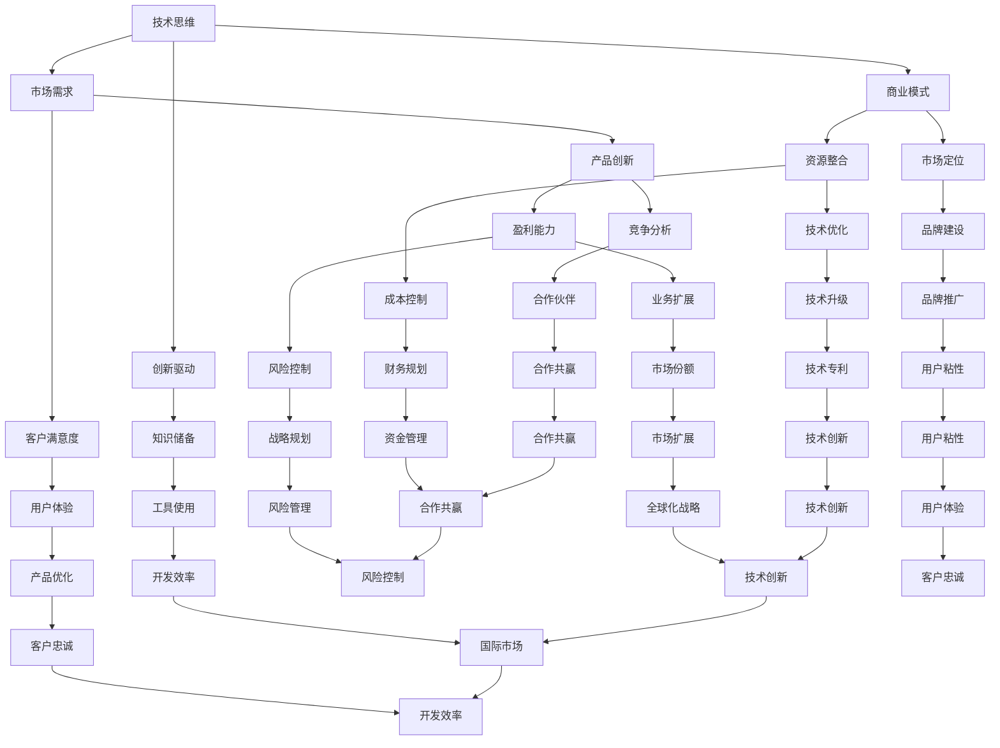

                 

### 背景介绍

在当今快速发展的技术时代，创业已经成为了一种普遍的现象。无论是在科技初创公司、互联网企业，还是传统行业中的数字化转型，创业者都需要具备多种技能和思维方式。然而，对于许多技术背景的创业者来说，如何从技术思维成功过渡到商业思维，是一个至关重要的挑战。

技术思维，主要是指以逻辑、分析和解决问题的方法来理解和处理技术问题。它强调的是技术原理的掌握、算法的优化以及系统的稳定性。而商业思维则更侧重于市场分析、客户需求、商业模式的构建以及盈利能力的提升。这两种思维方式之间虽然有一定的交集，但它们在核心目标和方法上存在显著差异。

本文将深入探讨创业者如何从技术思维转向商业思维。我们将首先分析技术思维和商业思维的基本概念，然后通过具体的案例和实践经验，逐步阐述从技术到商业的转换过程。最后，我们将提供一些建议和策略，帮助创业者更好地实现这一转变。

通过这篇文章，我们希望能够帮助技术背景的创业者们，更好地理解商业思维的重要性，掌握从技术思维向商业思维转换的方法，从而在创业道路上更加顺利和成功。

---

### 核心概念与联系

为了更好地理解从技术思维到商业思维的转变，我们首先需要明确几个核心概念和它们之间的联系。

#### 技术思维

技术思维，通常是指从技术角度出发，以逻辑性和系统性来分析和解决问题的方式。它包括对技术原理的深刻理解、对算法和系统的优化能力，以及对新技术和工具的敏感度。以下是技术思维的一些关键特征：

1. **逻辑分析**：技术思维强调逻辑性和系统性，通过分解问题、逐步分析和验证，以达到解决问题的目的。
2. **知识储备**：技术思维需要深厚的专业知识储备，包括编程语言、数据结构、算法、网络通信等。
3. **创新驱动**：技术思维鼓励创新，通过不断尝试新的方法和技术，以提升系统的性能和稳定性。
4. **工具使用**：技术思维强调对工具的熟练使用，如版本控制、集成开发环境、调试工具等。

#### 商业思维

商业思维则侧重于从商业角度出发，关注市场、客户、产品和盈利等方面。以下是商业思维的一些关键特征：

1. **市场导向**：商业思维强调对市场的敏锐洞察，包括市场需求分析、竞争环境分析等。
2. **客户需求**：商业思维重视客户需求的理解和满足，通过产品设计和优化，提升客户满意度。
3. **商业模式**：商业思维关注商业模式的构建和优化，包括盈利模式、成本结构、市场定位等。
4. **资源整合**：商业思维强调资源的有效整合，通过利用外部资源，实现业务增长和利润最大化。

#### 技术思维与商业思维的联系

虽然技术思维和商业思维在某些方面有所不同，但它们并不是完全独立的。实际上，两者之间存在密切的联系和相互影响：

1. **技术驱动力**：技术思维为商业思维提供了技术基础和可能性。一个具有先进技术能力的企业，往往能够更好地满足市场需求，创造独特的价值。
2. **商业导向**：商业思维则帮助技术思维找到实际应用场景和商业价值。通过商业思维的引导，技术可以被更有效地转化为商业成果。
3. **协同发展**：技术思维和商业思维的协同发展，能够促进企业的持续创新和成长。一方面，技术思维为商业思维提供了强有力的支撑；另一方面，商业思维则为技术思维提供了明确的目标和方向。

为了更好地理解这些概念之间的联系，我们使用以下 Mermaid 流程图来展示技术思维与商业思维的互动过程：



通过这个流程图，我们可以清晰地看到技术思维和商业思维之间是如何相互联系和作用的。技术的进步和商业的运作相互促进，共同推动企业的持续发展。

---

### 核心算法原理 & 具体操作步骤

在从技术思维转向商业思维的过程中，理解并运用核心算法原理和具体操作步骤是至关重要的。以下我们将详细探讨一些关键的算法原理，以及如何将这些原理应用到商业实践中。

#### 数据分析算法

数据分析是商业决策的重要依据。常见的数据分析算法包括回归分析、聚类分析、关联规则挖掘等。以下是这些算法的基本原理和操作步骤：

1. **回归分析**：回归分析用于预测一个或多个自变量对因变量的影响。基本步骤如下：
    - 数据收集：收集相关数据，例如销售额、客户年龄、收入等。
    - 数据预处理：清洗数据，包括缺失值填充、异常值处理等。
    - 模型建立：选择合适的回归模型（如线性回归、多元回归等），并训练模型。
    - 模型评估：使用交叉验证等方法评估模型性能。

2. **聚类分析**：聚类分析用于将数据集分成若干个类别，以发现数据的内在结构。主要步骤包括：
    - 数据标准化：将不同量纲的数据转换为同一量纲。
    - 算法选择：选择合适的聚类算法（如K均值、层次聚类等）。
    - 聚类执行：对数据进行聚类，并根据聚类结果进行分析。

3. **关联规则挖掘**：关联规则挖掘用于发现数据集中的关联关系，例如购物篮分析。主要步骤包括：
    - 数据准备：将原始数据转换成适合挖掘的形式。
    - 算法选择：选择合适的关联规则挖掘算法（如Apriori算法、FP-Growth算法等）。
    - 规则生成：生成满足最小支持度和最小置信度的关联规则。

#### 项目管理算法

项目管理算法帮助创业者更好地管理项目和资源。以下是一些常用的项目管理算法和步骤：

1. **关键路径法（CPM）**：关键路径法用于确定项目中的关键任务和最短完成时间。主要步骤包括：
    - 任务分解：将项目分解为若干个任务。
    - 时序关系：确定各任务之间的先后关系。
    - 时间估计：估计各任务所需的时间。
    - 关键路径：计算各路径的总时间，确定关键路径。

2. **挣值管理（EVM）**：挣值管理用于监控项目的进度和成本。主要步骤包括：
    - 计划价值（PV）：计算项目计划完成时的价值。
    - 挣值（EV）：计算实际完成工作的价值。
    - 费用值（AC）：计算实际发生的费用。
    - 挣值分析：通过计算进度偏差（SV）和费用偏差（CV），评估项目的进度和成本状况。

3. **风险分析**：风险分析用于识别和管理项目风险。主要步骤包括：
    - 风险识别：识别项目可能面临的风险。
    - 风险评估：评估各风险发生的概率和影响。
    - 风险响应：制定应对风险的策略和措施。

#### 产品开发算法

产品开发算法帮助创业者更好地规划和设计产品。以下是一些常用的产品开发算法和步骤：

1. **需求分析**：需求分析用于确定产品功能和用户需求。主要步骤包括：
    - 用户调研：通过访谈、问卷调查等方式收集用户需求。
    - 需求文档：编写详细的需求文档，明确产品功能、性能、用户界面等要求。

2. **原型设计**：原型设计用于创建产品的初始模型。主要步骤包括：
    - 功能原型：设计产品的功能原型，展示主要功能界面。
    - 用户测试：通过用户测试，收集反馈和改进建议。
    - 原型迭代：根据用户反馈，不断优化和迭代原型。

3. **敏捷开发**：敏捷开发是一种迭代和增量的产品开发方法。主要步骤包括：
    - Sprint规划：确定每个迭代周期的目标和工作内容。
    - Daily Stand-up：每日站会，讨论进展和问题。
    - Sprint Review：迭代结束时的评审会议，展示产品进展并收集反馈。
    - Sprint Retrospective：迭代结束时的回顾会议，总结经验教训并制定改进措施。

通过理解并运用这些核心算法原理和具体操作步骤，创业者可以更好地进行商业决策和项目管理，提高产品的成功率和市场竞争力。

---

### 数学模型和公式 & 详细讲解 & 举例说明

在商业决策和技术项目管理中，数学模型和公式发挥着至关重要的作用。以下我们将详细讲解几个关键的数学模型和公式，并辅以具体案例说明。

#### 回归分析模型

回归分析是数据分析中常用的一种方法，用于预测和解释变量之间的关系。线性回归是最基本的回归模型之一，其公式如下：

\[ y = \beta_0 + \beta_1 \cdot x_1 + \beta_2 \cdot x_2 + ... + \beta_n \cdot x_n + \epsilon \]

其中，\( y \) 是因变量，\( x_1, x_2, ..., x_n \) 是自变量，\( \beta_0, \beta_1, ..., \beta_n \) 是回归系数，\( \epsilon \) 是误差项。

**案例**：假设一家电商平台希望预测销售额，根据历史数据，其销售额与广告费用、促销活动频次和用户访问量有关。可以建立如下线性回归模型：

\[ \text{销售额} = \beta_0 + \beta_1 \cdot \text{广告费用} + \beta_2 \cdot \text{促销活动频次} + \beta_3 \cdot \text{用户访问量} + \epsilon \]

通过训练模型，可以得到具体的回归系数，从而预测未来销售额。

#### 决策树模型

决策树是一种常用的分类和回归模型，通过一系列的决策规则，将数据集划分为不同的类别或数值。其基本公式如下：

\[ T(x) = \sum_{i=1}^{n} w_i \cdot t_i(x) \]

其中，\( x \) 是输入特征向量，\( w_i \) 是决策权重，\( t_i(x) \) 是第 \( i \) 个决策函数。

**案例**：假设一家银行希望根据客户的信用评分、收入水平和贷款用途等因素，决定是否批准贷款。可以建立如下决策树模型：

1. 如果信用评分 > 700，则继续判断。
2. 如果收入水平 > 50000，则批准贷款。
3. 否则，拒绝贷款。

通过决策树模型，可以清晰地展示不同条件下的贷款决策过程，并帮助银行更准确地评估贷款风险。

#### 风险分析模型

在项目管理中，风险分析是必不可少的环节。蒙特卡洛模拟是一种常用的风险分析模型，用于评估项目可能面临的多种不确定性。其基本公式如下：

\[ P(X \leq x) = \sum_{i=1}^{n} p_i \cdot f_i(x) \]

其中，\( X \) 是随机变量，\( p_i \) 是第 \( i \) 个场景的概率，\( f_i(x) \) 是第 \( i \) 个场景下的函数值。

**案例**：假设一家公司在项目执行过程中，可能会遇到以下三种风险场景：

1. 场景A：项目延迟1个月，概率0.3。
2. 场景B：项目预算超支10%，概率0.4。
3. 场景C：项目失败，概率0.3。

通过蒙特卡洛模拟，可以计算项目可能的最大延迟时间和最大预算超支，从而为项目风险控制提供依据。

#### 敏度分析模型

敏度分析用于评估项目在不同参数变化下的影响。其基本公式如下：

\[ \text{敏度} = \frac{\partial \text{目标函数}}{\partial \text{参数}} \]

**案例**：假设一家公司在开发新产品时，需要评估不同研发投入对利润的影响。可以建立如下敏度分析模型：

\[ \text{利润} = \text{销售额} - \text{研发成本} - \text{生产成本} \]

通过计算不同研发投入下的利润变化，可以确定最佳研发预算。

通过理解并运用这些数学模型和公式，创业者可以更准确地分析数据、评估风险和制定决策，从而提高项目的成功率。

---

### 项目实战：代码实际案例和详细解释说明

为了更好地理解从技术思维到商业思维的转换过程，我们将通过一个实际的项目实战案例，展示代码的实际应用和详细解释说明。

#### 项目背景

假设我们是一家初创公司的技术团队，公司的主要业务是通过大数据分析和人工智能技术，为客户提供精准的市场营销解决方案。我们的目标是开发一个能够实时分析用户行为，并根据用户偏好进行个性化推荐的系统。

#### 开发环境搭建

首先，我们需要搭建开发环境。以下是所需的主要工具和库：

- **编程语言**：Python
- **数据分析和机器学习库**：NumPy、Pandas、Scikit-learn、TensorFlow
- **Web框架**：Flask
- **数据库**：MongoDB

确保安装了以上库后，我们可以开始编写代码。

#### 源代码详细实现和代码解读

以下是该项目的主要代码实现：

```python
# 导入所需库
import numpy as np
import pandas as pd
from sklearn.model_selection import train_test_split
from sklearn.ensemble import RandomForestClassifier
from sklearn.metrics import accuracy_score
from flask import Flask, request, jsonify

# 数据预处理
def preprocess_data(data):
    # 数据清洗和归一化
    # ...
    return processed_data

# 模型训练
def train_model(data):
    X = data.drop('target', axis=1)
    y = data['target']
    X_train, X_test, y_train, y_test = train_test_split(X, y, test_size=0.2, random_state=42)
    model = RandomForestClassifier()
    model.fit(X_train, y_train)
    return model

# 预测和推荐
def predict_recommendation(model, new_data):
    processed_data = preprocess_data(new_data)
    prediction = model.predict(processed_data)
    return prediction

# Flask应用
app = Flask(__name__)

@app.route('/predict', methods=['POST'])
def predict():
    data = request.get_json()
    prediction = predict_recommendation(model, data)
    return jsonify({'prediction': prediction})

if __name__ == '__main__':
    app.run(debug=True)
```

**代码解读**：

1. **数据预处理**：`preprocess_data` 函数负责数据清洗和归一化，这是模型训练前的重要步骤。
2. **模型训练**：`train_model` 函数使用随机森林分类器训练模型。首先，我们将数据集拆分为特征和标签，然后进行训练集和测试集的划分。随后，使用随机森林分类器进行模型训练。
3. **预测和推荐**：`predict_recommendation` 函数负责预测和推荐。首先，调用`preprocess_data`函数对新的数据进行预处理，然后使用训练好的模型进行预测。
4. **Flask应用**：我们使用Flask框架搭建了一个简单的Web应用，通过`/predict`接口接收新的数据，并进行预测和推荐。

#### 代码解读与分析

1. **数据预处理**：数据预处理是机器学习模型训练的重要环节。通过清洗数据、填补缺失值、归一化等步骤，可以确保数据的质量和一致性，从而提高模型的性能。
2. **模型选择**：在模型训练过程中，我们选择了随机森林分类器。随机森林具有较好的预测性能和泛化能力，适用于多种分类问题。
3. **Flask应用**：通过Flask框架，我们将模型部署为一个Web服务，使得客户可以方便地获取预测结果。这是一个典型的商业应用场景，通过Web服务，我们可以为客户提供定制化的市场营销解决方案。

通过这个实际项目案例，我们可以看到如何将技术思维应用到商业场景中。首先，通过大数据分析和人工智能技术，我们解决了市场营销中的个性化推荐问题。然后，通过Web服务，我们为客户提供了一种便捷的获取预测结果的方式，从而实现了商业价值。

---

### 实际应用场景

在从技术思维转向商业思维的过程中，理解实际应用场景是至关重要的。以下我们将探讨几个典型的应用场景，并分析如何将技术思维转化为商业成果。

#### 市场营销

市场营销是商业思维的核心领域之一，通过大数据分析和人工智能技术，可以显著提升市场营销的效果。以下是一个应用场景：

**应用场景**：一家电商平台希望通过个性化推荐系统，提升用户购买转化率。

**技术实现**：电商平台可以使用用户行为数据，如浏览历史、购买记录、浏览时间等，通过机器学习算法，如协同过滤、决策树等，构建个性化推荐模型。模型可以根据用户的兴趣和行为，推荐符合其需求的商品。

**商业成果**：通过个性化推荐，电商平台可以显著提高用户满意度和购买转化率。同时，通过分析推荐效果，企业可以不断优化推荐算法，提升推荐准确性。

#### 风险管理

在金融行业中，风险管理至关重要。技术思维可以通过数据分析、算法优化等技术手段，帮助金融机构更好地识别和管理风险。

**应用场景**：一家银行希望通过风险评估模型，识别和降低贷款违约风险。

**技术实现**：银行可以使用客户的历史信用记录、财务状况、市场环境等数据，通过回归分析、决策树等算法，构建风险评估模型。模型可以预测客户违约的概率，并为银行提供贷款决策的依据。

**商业成果**：通过风险评估模型，银行可以更准确地评估贷款风险，降低不良贷款率，提高贷款收益。同时，通过不断优化模型，银行可以进一步提高风险评估的准确性。

#### 项目管理

在项目管理中，技术思维可以通过项目管理工具和方法，提高项目效率和质量。

**应用场景**：一家软件公司希望通过敏捷开发方法，提高项目交付效率和产品质量。

**技术实现**：软件公司可以使用敏捷开发工具（如JIRA、Trello等），实施敏捷开发流程。通过每日站会、迭代评审等实践，确保项目按照计划进行，并快速响应需求变化。

**商业成果**：通过敏捷开发，软件公司可以更快地交付高质量的产品，提升客户满意度。同时，通过持续改进和反馈，项目团队能够不断提升开发效率和产品质量。

#### 用户服务

在用户服务领域，技术思维可以通过智能客服系统、用户行为分析等技术，提升用户体验和服务质量。

**应用场景**：一家互联网公司希望通过智能客服系统，提供24/7的在线客服服务。

**技术实现**：互联网公司可以使用自然语言处理（NLP）技术，构建智能客服系统。系统可以理解用户的问题，并提供相应的解决方案。

**商业成果**：通过智能客服系统，互联网公司可以提供高效、便捷的用户服务，提升用户满意度和忠诚度。同时，通过用户行为分析，公司可以更好地了解用户需求，优化产品和服务。

通过以上实际应用场景，我们可以看到，技术思维可以转化为各种商业成果，从而帮助企业实现持续增长和成功。

---

### 工具和资源推荐

在从技术思维转向商业思维的过程中，掌握一些关键的工具和资源是非常重要的。以下我们将推荐一些实用的学习资源、开发工具和相关的论文著作，以帮助创业者更好地实现这一转变。

#### 学习资源推荐

1. **书籍**：
   - 《创业维艰》（Ben Horowitz）：这本书详细阐述了创业过程中的挑战和应对策略，对于技术背景的创业者具有很大的启发意义。
   - 《精益创业》（Eric Ries）：这本书提出了精益创业的方法论，帮助创业者快速验证和优化商业模型。
   - 《增长黑客》（Sean Ellis & Morgan Brown）：这本书介绍了如何利用数据驱动的方法实现快速增长，对于市场营销和用户增长非常有帮助。

2. **论文**：
   - "Innovation and Entrepreneurship: The Need for a New Approach" by Michael E. Porter：这篇文章提出了创新和创业的重要性和必要性，对于理解技术思维与商业思维的关系具有指导意义。
   - "The Lean Startup" by Eric Ries：这篇文章详细阐述了精益创业的方法论，是精益创业领域的经典之作。

3. **博客/网站**：
   - Startup Handbook：这个网站提供了大量的创业资源，包括指导、工具和社区讨论。
   - Hacker News：这是一个以技术创业为主题的内容社区，涵盖了大量的创业新闻、技术和产品动态。

#### 开发工具推荐

1. **数据分析工具**：
   - Python：Python 是一种广泛应用于数据分析的编程语言，具有丰富的库和框架，如Pandas、NumPy、Scikit-learn等。
   - Tableau：Tableau 是一种强大的数据可视化工具，可以帮助创业者直观地展示数据分析结果。

2. **项目管理工具**：
   - JIRA：JIRA 是一种流行的项目管理工具，适用于敏捷开发流程，可以帮助团队跟踪任务和进度。
   - Trello：Trello 是一种简单的任务管理工具，通过看板和卡片，可以清晰地展示任务状态和优先级。

3. **人工智能和机器学习工具**：
   - TensorFlow：TensorFlow 是一种开源的机器学习库，适用于构建和训练深度学习模型。
   - Keras：Keras 是一种基于TensorFlow的高层神经网络API，用于快速构建和训练神经网络模型。

#### 相关论文著作推荐

1. **"The Lean Startup"** by Eric Ries：这本书详细介绍了精益创业的方法论，是创业领域的重要著作。
2. **"Innovation and Entrepreneurship"** by Michael E. Porter：这篇文章探讨了创新和创业的重要性，对于理解技术思维和商业思维的关系具有指导意义。
3. **"Customer Development: Turning the Art of Starting Up into the Science of Scalability"** by Steve Blank：这本书提出了客户开发的方法论，帮助创业者更好地理解市场需求和用户反馈。

通过这些工具和资源的支持，创业者可以更有效地将技术思维转化为商业思维，提升企业的创新能力和市场竞争力。

---

### 总结：未来发展趋势与挑战

在未来的发展趋势中，从技术思维到商业思维的转变将继续成为创业者关注的焦点。随着科技的不断进步和商业环境的日益复杂，创业者需要具备更加全面的技能和思维方式，才能在激烈的市场竞争中脱颖而出。

首先，随着人工智能和大数据技术的不断发展，数据将成为企业最重要的资产。创业者需要具备数据驱动的思维方式，通过深入分析用户数据和市场数据，发现潜在的商业机会，优化产品和服务。同时，数据安全和个人隐私保护也将成为重要的挑战，创业者需要在技术创新的同时，确保用户数据的安全和隐私。

其次，随着全球化的加速，创业者需要具备国际视野和跨文化沟通能力。在全球化市场中，创业者不仅要了解不同国家和地区的市场特点，还要学会与不同文化背景的合作伙伴和客户进行有效沟通，实现业务扩展。

此外，随着市场的不断变化和消费者需求的多变，创业者需要具备敏捷和快速响应市场变化的能力。通过采用敏捷开发、精益创业等方法论，创业者可以更快地验证和调整商业模型，提高市场竞争力。

然而，从技术思维到商业思维的转变也面临着诸多挑战。首先，技术背景的创业者可能对市场和市场运作不够敏感，需要加强对市场营销、客户需求等方面的学习和了解。其次，创业者需要在技术创新和商业模式构建之间找到平衡，确保技术能够为商业目标服务。此外，创业者还需要具备良好的团队管理能力和资源整合能力，以实现企业的持续发展和增长。

总之，从技术思维到商业思维的转变是一个复杂而系统的过程，需要创业者不断学习和实践，通过不断探索和优化，实现技术的商业价值。未来，创业者需要更加注重数据驱动、国际化视野和敏捷响应能力，以应对不断变化的市场环境，实现企业的持续成功。

---

### 附录：常见问题与解答

在探讨从技术思维到商业思维转变的过程中，创业者可能会遇到一些常见的问题。以下我们将针对这些问题进行解答，并提供一些实用的建议。

#### 问题1：如何平衡技术思维和商业思维？

**解答**：平衡技术思维和商业思维的关键在于找到两者之间的共同点和联系。首先，创业者需要明确技术思维和商业思维的核心目标，即通过技术实现商业价值。在项目开发过程中，创业者可以采用以下策略：

1. **定期回顾**：定期回顾项目进度和目标，确保技术决策符合商业需求。
2. **团队合作**：组建多元化团队，包括技术、市场和销售等领域的专家，共同讨论和决策。
3. **用户反馈**：通过用户反馈，了解产品的市场表现和用户需求，调整技术方向。

#### 问题2：技术背景的创业者如何提升商业能力？

**解答**：技术背景的创业者可以通过以下方式提升商业能力：

1. **学习商业知识**：参加商业课程、阅读相关书籍，了解市场营销、商业模式等基本概念。
2. **实践和经验**：通过实际操作和项目经验，逐步积累商业知识和技能。
3. **咨询专家**：与经验丰富的商业顾问、创业导师等进行交流，获取宝贵的建议和指导。

#### 问题3：如何确保技术投入与商业回报的平衡？

**解答**：确保技术投入与商业回报的平衡可以通过以下方法实现：

1. **市场调研**：在项目启动前，进行充分的市场调研，确保技术投入符合市场需求。
2. **成本控制**：在项目开发过程中，严格控制成本，避免不必要的浪费。
3. **盈利模式**：明确项目的盈利模式，确保技术投入能够带来可持续的商业回报。

#### 问题4：如何应对市场变化和竞争压力？

**解答**：应对市场变化和竞争压力的策略包括：

1. **敏捷开发**：采用敏捷开发方法，快速响应市场需求和变化。
2. **用户反馈**：通过用户反馈，及时调整产品和服务，满足用户需求。
3. **持续创新**：保持技术创新，不断提升产品竞争力。

#### 问题5：如何建立和维护良好的合作关系？

**解答**：建立和维护良好的合作关系可以通过以下方式实现：

1. **透明沟通**：保持沟通的透明性，确保合作伙伴了解项目的进展和目标。
2. **互惠互利**：在合作中寻求互惠互利，确保双方都能从中获得利益。
3. **信任建立**：通过长期合作和诚信经营，建立合作伙伴之间的信任。

通过以上问题的解答，创业者可以更好地理解从技术思维到商业思维的转变，并采取相应的策略和措施，实现技术的商业价值。

---

### 扩展阅读 & 参考资料

为了帮助创业者更深入地理解从技术思维到商业思维的转变，以下推荐一些扩展阅读和参考资料：

1. **书籍**：
   - 《创业者的技能升级：从技术到商业的跃迁》（作者：李笑来）：这本书详细阐述了技术创业者如何提升商业能力，实现技术到商业的跃迁。
   - 《商业模式新生代》（作者：亚历山大·奥斯特沃尔德、耶日·齐夫曼）：这本书介绍了商业模式的创新方法和应用，对于创业者具有很好的启发作用。

2. **论文**：
   - "Innovation, entrepreneurship, and growth" by Paul Romer：这篇文章探讨了创新、创业与经济增长之间的关系，是创业研究领域的重要文献。
   - "The Lean Startup" by Eric Ries：这篇文章详细介绍了精益创业的方法论，对于创业者理解和应用精益创业具有指导意义。

3. **博客/网站**：
   - TechCrunch：这是一个知名的技术新闻网站，涵盖了最新的科技创业动态和行业趋势。
   - Hacker News：这是一个以技术创业为主题的内容社区，提供了大量的创业新闻、技术和产品动态。

4. **在线课程**：
   - Coursera：这是一个提供在线课程的平台，包括市场营销、商业模式设计、项目管理等课程，适合创业者学习。
   - Udemy：这是一个提供各种在线课程的平台，包括技术、商业和领导力等课程，适合创业者提升技能。

通过这些扩展阅读和参考资料，创业者可以进一步深入理解商业思维和技术思维之间的联系，掌握从技术到商业的跃迁策略，提升自身的创业能力。

