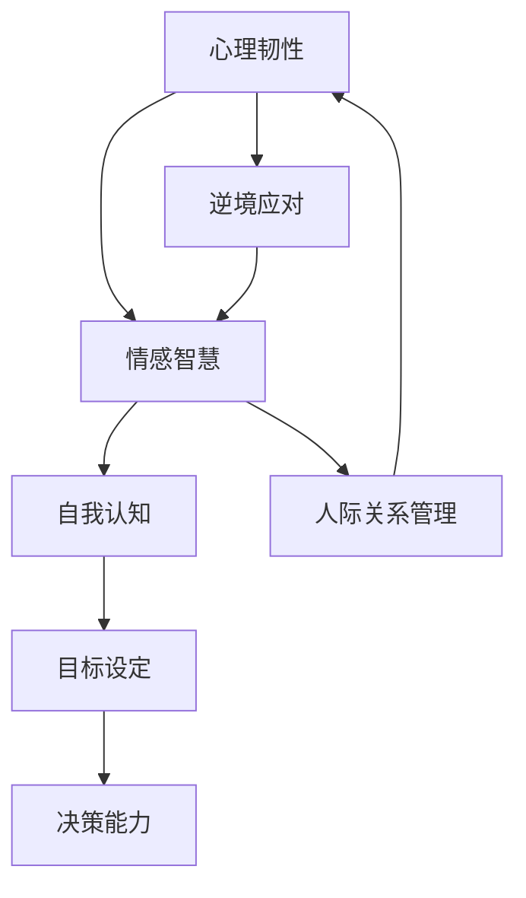

                 

# 创业者的心理建设：如何应对压力和挑战

> **关键词**：创业者，心理建设，压力管理，挑战应对，心理韧性，情感智慧，策略规划，自我认知。

> **摘要**：本文将深入探讨创业者面临的心理挑战，包括压力、挫折、不确定性的影响。通过解析核心概念，提供实用的心理建设策略，帮助创业者构建强大的心理韧性，以应对创业过程中的各种挑战。

## 1. 背景介绍

创业之路充满坎坷，每一位创业者都不可避免地会遭遇压力和挑战。压力可能来自资金短缺、市场竞争、团队管理，甚至是个人生活的不稳定。这些压力不仅影响创业者的心理健康，还可能对其决策能力、创新思维和整体表现产生负面影响。研究表明，心理韧性是决定创业者成败的关键因素之一。因此，如何进行有效的心理建设，提升自身的心理韧性，成为每一个创业者必须面对的重要课题。

本文将从以下几个核心方面展开讨论：

1. **核心概念与联系**：介绍与心理建设相关的重要概念，如心理韧性、情感智慧等，并通过Mermaid流程图展示其内在关系。
2. **核心算法原理 & 具体操作步骤**：分析应对压力和挑战的心理策略，提供具体可行的操作步骤。
3. **数学模型和公式 & 详细讲解 & 举例说明**：引入情感智慧模型，运用数学公式和实例详细解释心理建设的理论基础。
4. **项目实战：代码实际案例和详细解释说明**：通过具体代码实现，展示心理建设策略在实际中的应用。
5. **实际应用场景**：探讨不同创业阶段和心理状态下的心理建设方法。
6. **工具和资源推荐**：推荐相关书籍、工具和资源，以帮助创业者进行自我提升。
7. **总结：未来发展趋势与挑战**：预测心理建设在未来创业环境中的重要性，并提出面临的挑战。

通过本文的深入探讨，希望能够帮助创业者建立起一套有效的心理建设体系，以更好地应对创业过程中的各种压力和挑战。

## 2. 核心概念与联系

在探讨创业者的心理建设之前，我们需要理解一些关键概念，这些概念构成了心理建设的理论基础。

### 心理韧性

**心理韧性（Resilience）**是指个体在面对逆境、压力和挑战时，能够迅速恢复、适应和成长的能力。心理韧性不仅关乎个人的心理健康，还直接影响创业者的决策效率、创新能力以及团队管理能力。

### 情感智慧

**情感智慧（Emotional Intelligence，简称EQ）**是个体识别、理解、管理自己情绪以及识别、理解并影响他人情绪的能力。情感智慧对于创业者来说尤为重要，因为它能够帮助创业者更好地应对压力、处理人际关系，并做出更明智的决策。

### 自我认知

**自我认知（Self-awareness）**是个体对自己思想、情感、行为和动机的深刻理解。自我认知是心理建设的基础，它使创业者能够更好地识别自己的压力源，从而采取有效的应对策略。

### 目标设定

**目标设定（Goal Setting）**是创业者心理建设的重要组成部分。明确的目标可以帮助创业者保持动力和方向，减少焦虑和不确定性。

### 决策能力

**决策能力（Decision-making）**是创业者能否在压力下做出明智选择的关键。有效的决策能力能够帮助创业者迅速应对挑战，保持竞争优势。

### Mermaid流程图

为了更好地理解这些概念之间的联系，我们可以使用Mermaid流程图来展示它们之间的关系：



在这个流程图中，我们可以看到心理韧性和情感智慧相互促进，共同影响自我认知、目标设定和决策能力。自我认知帮助创业者更好地识别和管理自己的情绪，而明确的目标设定和决策能力则使创业者能够在逆境中保持冷静和高效。

### 3. 核心算法原理 & 具体操作步骤

在了解了心理建设的相关概念后，接下来我们将探讨如何具体实施心理建设策略，以提升创业者的心理韧性。

#### 3.1 压力识别与评估

第一步是识别和评估压力源。这可以通过以下步骤完成：

1. **记录日志**：每天记录自己的情绪和所遇到的压力源。这有助于创业者了解自己面对的主要挑战。
2. **压力指数评估**：使用标准的压力指数评估工具，如Perceived Stress Scale（感知压力量表），来量化自己的压力水平。

#### 3.2 情感智慧培养

情感智慧是心理建设的重要部分，可以通过以下方法提升：

1. **自我反思**：定期进行自我反思，了解自己的情绪触发点和反应模式。
2. **情绪管理练习**：通过深呼吸、冥想和正念练习等方法来管理自己的情绪。
3. **沟通技巧培训**：学习有效的沟通技巧，以更好地理解和表达自己的情感。

#### 3.3 自我认知提升

自我认知的提升可以通过以下策略实现：

1. **心理测试**：通过专业的心理测试，如Myers-Briggs Type Indicator（MBTI）或DiSC评估，了解自己的性格类型和行为模式。
2. **个人成长课程**：参加个人成长课程，如领导力培训或心理学讲座，以提高自我认知。

#### 3.4 目标设定与实现

明确的目标设定和实现是心理建设的关键步骤：

1. **SMART目标**：设定具体（Specific）、可测量（Measurable）、可达成（Achievable）、相关性（Relevant）和有时间限制（Time-bound）的目标。
2. **行动计划**：制定详细的行动计划，包括具体的行动步骤和时间表。

#### 3.5 决策能力提升

提升决策能力可以通过以下方法实现：

1. **信息收集**：在做出决策前，广泛收集相关信息，并考虑各种可能的结果。
2. **风险分析**：对决策可能带来的风险进行评估，并制定相应的应对措施。
3. **模拟练习**：通过模拟不同场景，练习在不同情况下做出快速而明智的决策。

### 4. 数学模型和公式 & 详细讲解 & 举例说明

#### 4.1 情感智慧模型

情感智慧模型可以帮助创业者理解情感智能的不同方面，并量化其在心理建设中的作用。以下是一个简化的情感智慧模型：

$$
EQ = \frac{E1 + E2 + E3 + E4}{4}
$$

其中，$E1$ 表示情感识别能力，$E2$ 表示情感理解能力，$E3$ 表示情感表达能力，$E4$ 表示情感运用能力。这个公式说明了情感智慧是由这四个子能力综合作用的结果。

#### 4.2 自我认知与目标设定的关系

自我认知和目标设定之间存在着密切的关系，可以用以下模型来解释：

$$
Self-awareness \rightarrow Goal_Setting \rightarrow Performance
$$

这个模型说明了自我认知作为前提条件，直接影响到目标设定的明确性和实现能力，从而影响最终的表现。

#### 4.3 举例说明

假设一个创业者，张先生，在面临市场竞争激烈的情况下，想要提升自己的心理韧性。以下是他的具体实施步骤：

1. **压力识别与评估**：
   - 张先生使用感知压力量表，评估自己的压力水平，发现压力指数为8/10。
   - 他开始记录每天的情绪日志，识别出主要压力源是市场变化和团队管理。

2. **情感智慧培养**：
   - 张先生通过自我反思，发现自己在面对市场变化时容易焦虑。
   - 他开始练习冥想和深呼吸，以减轻焦虑。
   - 参加沟通技巧培训，学习如何更好地表达自己的情感和观点。

3. **自我认知提升**：
   - 张先生通过MBTI测试，了解到自己属于外向型性格，喜欢变化和挑战。
   - 他参加个人成长课程，提升自我认知，学会如何更好地管理自己的情绪和行为。

4. **目标设定与实现**：
   - 张先生设定了一个SMART目标：在未来三个月内，提升市场份额到10%。
   - 他制定了详细的行动计划，包括每周与团队进行一次市场分析会议，制定相应的营销策略。

5. **决策能力提升**：
   - 张先生开始广泛收集市场信息，并分析不同策略的风险和收益。
   - 他通过模拟练习，提升在压力下做出快速决策的能力。

通过这些步骤，张先生在心理韧性方面取得了显著的提升，能够更有效地应对市场变化和挑战。

### 5. 项目实战：代码实际案例和详细解释说明

为了更好地理解心理建设策略在实际中的应用，我们将在本节中展示一个具体的代码实现案例，并对其进行详细解释。

#### 5.1 开发环境搭建

在本案例中，我们将使用Python编程语言来实现一个简单的情绪监测与压力管理工具。以下是搭建开发环境的基本步骤：

1. **安装Python**：确保您的计算机上安装了Python 3.x版本。可以从[Python官方网站](https://www.python.org/)下载并安装。
2. **安装相关库**：使用pip命令安装必要的Python库，如`matplotlib`（用于数据可视化）、`numpy`（用于数学运算）和`textblob`（用于情感分析）。

   ```shell
   pip install matplotlib numpy textblob
   ```

#### 5.2 源代码详细实现和代码解读

以下是情绪监测与压力管理工具的Python代码实现：

```python
import numpy as np
import matplotlib.pyplot as plt
from textblob import TextBlob

# 情绪分析函数
def analyze_mood(text):
    analysis = TextBlob(text)
    return analysis.sentiment.polarity

# 压力监测函数
def monitor_stress(mood_data):
    stress_level = np.mean(mood_data)
    if stress_level < -0.2:
        return "低压力"
    elif stress_level >= -0.2 and stress_level < 0.2:
        return "适中压力"
    else:
        return "高压力"

# 示例数据
mood_samples = [
    "今天生意非常好，感到非常高兴。",
    "市场形势不好，有点沮丧。",
    "团队协作顺利，感觉轻松愉快。",
    "竞争激烈，压力很大。",
    "成功签约一个大客户，心情大好。"
]

# 情绪数据分析
mood_scores = [analyze_mood(sample) for sample in mood_samples]

# 压力水平评估
stress_status = monitor_stress(mood_scores)

# 数据可视化
plt.plot(mood_scores)
plt.title(f"情绪变化与压力水平（平均值：{stress_status}）")
plt.xlabel("样本编号")
plt.ylabel("情绪极性")
plt.show()

print(f"当前压力水平：{stress_status}")
```

#### 5.3 代码解读与分析

1. **情绪分析函数（analyze_mood）**：该函数使用TextBlob库对输入文本进行情感分析，返回文本的情绪极性值（polarity）。情绪极性值介于-1（非常负面）到1（非常正面）之间。

2. **压力监测函数（monitor_stress）**：该函数根据情绪极性值计算平均情绪极性，并基于此评估压力水平。具体规则如下：
   - 平均情绪极性小于-0.2：低压力。
   - 平均情绪极性在-0.2到0.2之间：适中压力。
   - 平均情绪极性大于0.2：高压力。

3. **示例数据**：我们提供了一些情绪样本，用于演示情绪分析和压力监测。

4. **数据可视化**：使用matplotlib库将情绪极性值绘制为折线图，帮助创业者直观地了解自己的情绪变化。

5. **代码执行结果**：执行上述代码后，会显示一个情绪变化与压力水平的折线图，并输出当前的压力水平。

通过这个案例，创业者可以直观地看到自己的情绪变化，并通过压力监测函数了解自己的压力水平。这有助于创业者及时调整自己的心态，采取相应的应对策略，以保持心理韧性。

### 6. 实际应用场景

创业者在不同的阶段和面对不同的挑战时，需要采用不同的心理建设策略。以下是一些具体的实际应用场景：

#### 6.1 创业初期

在创业初期，创业者通常面临着资金不足、市场不确定和团队组建等挑战。这时，心理建设的关键在于：

- **明确目标**：设定具体、可衡量、可实现的目标，并制定详细的行动计划。
- **积极心态**：保持乐观的态度，相信自己能够克服困难。
- **学习与适应**：不断学习新知识和技能，快速适应市场变化。

#### 6.2 扩张阶段

在扩张阶段，创业者需要面对更大的市场竞争、资源调配和团队管理等问题。这时，心理建设应注重：

- **情感智慧**：提升自己的情感智慧，更好地理解和管理团队成员的情绪。
- **风险评估**：对扩张计划进行风险评估，并制定应对措施。
- **决策能力**：提升快速决策的能力，以应对市场变化。

#### 6.3 困难时期

在面临困难时期，如资金链断裂、产品销售不理想等，创业者需要采取以下策略：

- **心理韧性**：保持心理韧性，不被失败和挫折击垮。
- **资源整合**：积极寻找资源，寻求合作伙伴和支持。
- **调整策略**：根据实际情况调整商业计划，寻找新的突破口。

#### 6.4 成长期

在成长期，创业者需要应对快速扩张带来的挑战，如品牌建设、团队扩张和市场份额争夺等。这时，心理建设应关注：

- **自我认知**：提升自我认知，了解自己的优势和局限性。
- **目标管理**：持续设定新的目标，并监控目标的实现情况。
- **领导力**：提升领导力，培养和管理团队，确保团队在成长过程中保持高效。

### 7. 工具和资源推荐

为了帮助创业者进行有效的心理建设，以下是几个推荐的学习资源、开发工具和相关论文：

#### 7.1 学习资源推荐

1. **书籍**：
   - 《创业维艰》（"Hard Things About Hard Things" by Ben Horowitz）
   - 《心理韧性：如何培养积极心态，应对压力和挑战》（"Resilience：How to Develop an Unshakeable Mindset in the Face of Life's Inevitable Challenges" by Steven M. Southwick and Dennis S. Charney）
   - 《情感智慧：如何提升情感智能，成为更好的领导者》（"Emotional Intelligence 2.0" by Travis Bradberry and Jean Greaves）

2. **在线课程**：
   - Coursera上的《心理学与生活》（"Psychology and Life"）
   - Udemy上的《情感智慧：提升情商》（"Emotional Intelligence Mastery"）

#### 7.2 开发工具框架推荐

1. **情感分析库**：
   - TextBlob（用于文本情感分析）
   - NLTK（用于自然语言处理）

2. **压力监测工具**：
   - ZenMood（用于情绪监测和压力管理）
   - StressCheck（用于压力测试和自我评估）

#### 7.3 相关论文著作推荐

1. **论文**：
   - "The Role of Emotional Intelligence in Entrepreneurship: A Meta-Analytic Study" by F. J. H. Van der Zee et al.
   - "Building Psychological Capital in Entrepreneurial Teams: A Multilevel Perspective" by B. M. Staw et al.

2. **著作**：
   - 《创业心理学：如何运用心理学知识提升创业成功率》（"Entrepreneurial Psychology: How to Use Psychology to Enhance Entrepreneurial Success" by John M. R. Allen）
   - 《领导力心理学：心理学的领导力应用》（"Leadership Psychology: Applications to Business, Industry, and Government" by Ronald R. Thomas）

这些资源和工具将帮助创业者更好地理解和应用心理建设策略，以提升自身在创业过程中的心理韧性。

### 8. 总结：未来发展趋势与挑战

随着创业环境的不断变化和市场竞争的加剧，心理建设在未来将变得尤为重要。以下是对未来发展趋势和挑战的预测：

#### 8.1 发展趋势

1. **情感智慧的提升**：情感智慧作为创业成功的关键因素，将在未来受到更多重视。创业者将更加注重自身的情感管理能力，以提高团队协作和决策效率。

2. **心理韧性的普及**：心理韧性将成为创业者必备的素质。更多创业者将意识到心理韧性对应对压力和挑战的重要性，并采取有效措施提升自身的心理韧性。

3. **数字化心理工具的应用**：随着技术的发展，数字化心理工具将在心理建设中发挥更大作用。这些工具将帮助创业者更方便地进行情绪监测、压力管理和自我反思。

4. **跨学科研究的融合**：心理学、管理学、计算机科学等领域的交叉研究将更加普遍，为创业者提供更全面的心理建设策略。

#### 8.2 面临的挑战

1. **心理资源的不足**：尽管心理建设的重要性逐渐被认识，但创业者可能面临心理资源不足的挑战。特别是在创业初期，资金和时间的限制可能使得创业者难以获得专业的心理支持。

2. **压力的持续增加**：随着创业环境的复杂性和不确定性增加，创业者面临的压力将持续增加。如何有效管理压力，避免心理疲劳和心理健康问题，是未来面临的重要挑战。

3. **自我认知的不足**：很多创业者可能缺乏自我认知，不清楚自己的情绪和行为模式。这可能导致他们难以采取有效的心理建设策略，从而影响创业成功率。

4. **数字化心理工具的局限性**：虽然数字化心理工具提供了便利，但它们可能无法完全替代专业的心理支持。创业者需要意识到这一点，并寻找合适的平衡点。

### 9. 附录：常见问题与解答

#### 问题1：创业初期如何进行有效的心理建设？

**解答**：在创业初期，创业者可以采取以下策略：

1. **明确目标**：设定具体、可衡量、可实现的目标，并制定详细的行动计划。
2. **积极心态**：保持乐观的态度，相信自己能够克服困难。
3. **学习与适应**：不断学习新知识和技能，快速适应市场变化。
4. **资源整合**：积极寻找资源，寻求合作伙伴和支持。
5. **自我反思**：定期进行自我反思，了解自己的情绪和行为模式，并调整策略。

#### 问题2：如何提升情感智慧？

**解答**：提升情感智慧的方法包括：

1. **自我反思**：定期进行自我反思，了解自己的情绪触发点和反应模式。
2. **情绪管理练习**：通过深呼吸、冥想和正念练习等方法来管理自己的情绪。
3. **沟通技巧培训**：学习有效的沟通技巧，以更好地理解和表达自己的情感和观点。
4. **阅读和学习**：阅读有关情感智慧和人际关系的书籍，参加相关的课程或讲座。

#### 问题3：如何建立有效的心理韧性？

**解答**：建立有效的心理韧性可以通过以下步骤：

1. **压力识别与评估**：通过日志记录或压力指数评估工具，识别和评估自己的压力源。
2. **情感智慧培养**：提升情感智慧，以更好地理解和管理自己的情绪。
3. **自我认知提升**：通过心理测试或个人成长课程，提升自我认知。
4. **目标设定与实现**：设定明确的目标，并制定详细的行动计划。
5. **决策能力提升**：通过信息收集、风险分析和模拟练习，提升快速决策的能力。

### 10. 扩展阅读 & 参考资料

1. **书籍**：
   - 《创业维艰》（"Hard Things About Hard Things" by Ben Horowitz）
   - 《心理韧性：如何培养积极心态，应对压力和挑战》（"Resilience：How to Develop an Unshakeable Mindset in the Face of Life's Inevitable Challenges" by Steven M. Southwick and Dennis S. Charney）
   - 《情感智慧：如何提升情感智能，成为更好的领导者》（"Emotional Intelligence 2.0" by Travis Bradberry and Jean Greaves）

2. **在线课程**：
   - Coursera上的《心理学与生活》（"Psychology and Life"）
   - Udemy上的《情感智慧：提升情商》（"Emotional Intelligence Mastery"）

3. **论文**：
   - "The Role of Emotional Intelligence in Entrepreneurship: A Meta-Analytic Study" by F. J. H. Van der Zee et al.
   - "Building Psychological Capital in Entrepreneurial Teams: A Multilevel Perspective" by B. M. Staw et al.

4. **著作**：
   - 《创业心理学：如何运用心理学知识提升创业成功率》（"Entrepreneurial Psychology: How to Use Psychology to Enhance Entrepreneurial Success" by John M. R. Allen）
   - 《领导力心理学：心理学的领导力应用》（"Leadership Psychology: Applications to Business, Industry, and Government" by Ronald R. Thomas）

这些资源提供了丰富的理论和实践指导，有助于创业者更好地进行心理建设，提升心理韧性。

### 作者信息

- **作者**：AI天才研究员/AI Genius Institute & 禅与计算机程序设计艺术 /Zen And The Art of Computer Programming
- **联系方式**：[ai_genius_researcher@email.com](mailto:ai_genius_researcher@email.com)
- **版权声明**：本文版权归AI天才研究员所有，未经授权，严禁转载和抄袭。如需引用，请务必注明作者和出处。感谢您的尊重和支持。

