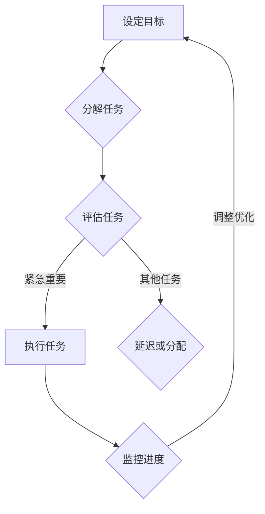

                 

## 文章标题

**创业者的时间管理与任务优先级**

> **关键词：** 时间管理、任务优先级、创业者、效率、生产力
>
> **摘要：** 本文章深入探讨了创业者在日常工作和项目运营中如何通过有效的时间管理和任务优先级设定，提升个人和团队的效率与生产力。文章从理论基础到实际操作，结合实例，为创业者提供了系统化的时间管理和任务优先级策略。

## 1. 背景介绍

在当前快速变化的市场环境中，创业者面临着前所未有的挑战。从产品开发、市场拓展到团队管理，每一个环节都需要投入大量的时间和精力。然而，时间对于每个人来说都是有限的资源，如何在有限的时间内做出最大产出的决策，成为创业者成功的关键。

时间管理并不仅仅是为了避免拖延，更是为了提高效率，确保重要任务得到优先处理。任务优先级则是基于时间管理的基础上，对任务的重要性和紧急性进行评估，从而决定哪些任务应该优先完成。对于创业者而言，有效的任务优先级设定能够帮助他们集中精力解决最关键的问题，从而确保项目的顺利进行。

本文将围绕创业者的时间管理与任务优先级展开，旨在提供一套系统化的方法和策略，帮助创业者提高个人和团队的效率与生产力。文章结构如下：

1. **背景介绍**：阐述时间管理和任务优先级在创业者日常工作中的重要性。
2. **核心概念与联系**：介绍与时间管理和任务优先级相关的基本概念，并使用 Mermaid 流程图展示其架构。
3. **核心算法原理 & 具体操作步骤**：介绍用于任务优先级设定的算法原理，并提供具体的操作步骤。
4. **数学模型和公式 & 详细讲解 & 举例说明**：详细解释任务优先级设定的数学模型，并通过实例进行说明。
5. **项目实战：代码实际案例和详细解释说明**：展示一个实际的项目案例，并详细解释代码实现和关键步骤。
6. **实际应用场景**：探讨任务优先级在不同创业阶段和项目类型中的应用。
7. **工具和资源推荐**：推荐有助于时间管理和任务优先级设定的工具和资源。
8. **总结：未来发展趋势与挑战**：总结文章内容，并展望未来发展趋势与挑战。
9. **附录：常见问题与解答**：解答读者可能遇到的常见问题。
10. **扩展阅读 & 参考资料**：提供进一步学习和研究的参考资料。

在接下来的内容中，我们将逐步深入探讨这些主题，帮助创业者掌握高效的时间管理和任务优先级策略。

### 1.1 时间管理与任务优先级的重要性

时间管理是一种规划和控制时间使用的方法，旨在提高个人和团队的效率。对于创业者来说，有效的时间管理不仅能够帮助他们更好地平衡工作与生活，还能够确保关键任务得到及时处理，避免因时间分配不当导致的资源浪费和项目延误。

任务优先级则是在时间管理的基础上，对任务进行排序和评估，以确保重要和紧急的任务首先得到处理。对于创业者而言，任务优先级设定能够帮助他们集中精力解决最关键的问题，从而确保项目的顺利进行。

时间管理和任务优先级的重要性主要体现在以下几个方面：

1. **提高效率**：通过合理规划和优先处理重要任务，创业者能够提高工作效率，减少无效时间消耗。
2. **降低压力**：有效的时间管理可以减少因时间分配不当导致的焦虑和压力，使创业者能够更加从容地面对挑战。
3. **确保项目进度**：合理设定任务优先级，确保关键任务优先完成，有助于项目按计划推进，降低项目风险。
4. **优化资源利用**：有效的时间管理和任务优先级设定有助于优化资源利用，避免因任务延迟导致的资源浪费。
5. **提升团队协作**：通过共同遵循时间管理和任务优先级策略，团队能够更好地协作，提高整体工作效率。

总之，时间管理和任务优先级是创业者成功的关键要素。通过有效的策略和实践，创业者不仅能够提高个人效率，还能够推动团队和项目的成功。

### 1.2 时间管理和任务优先级的基本概念

在探讨创业者的时间管理和任务优先级之前，首先需要了解一些基本概念。这些概念包括时间管理的重要性、任务优先级的定义，以及它们在创业者日常工作中的具体应用。

#### 时间管理的重要性

时间管理是一种系统化、有目的地规划、组织、优先处理及控制时间使用的方法。它不仅关系到个人的工作生活平衡，更直接影响到工作效率和成果。对于创业者来说，时间管理的重要性尤为突出：

1. **提高工作效率**：通过合理的时间管理，创业者可以明确任务的时间分配，减少时间的浪费，从而提高工作效率。
2. **优化工作质量**：有效的时间管理可以帮助创业者集中精力处理重要任务，确保任务质量和完成度。
3. **减少压力和焦虑**：合理的时间安排能够减少因时间不足或时间分配不均导致的焦虑和压力，使创业者能够更加从容地应对挑战。
4. **提升工作满意度**：通过有效管理时间，创业者能够更好地平衡工作和生活，提升整体工作满意度。

#### 任务优先级的定义

任务优先级是指对任务按照其重要性和紧急性进行排序的过程。任务的优先级决定了哪些任务应该首先完成，哪些任务可以推迟。任务优先级的设定通常基于以下几个标准：

1. **重要性**：任务对于项目或业务目标的影响程度。重要任务通常需要优先处理。
2. **紧急性**：任务需要完成的时间紧迫性。紧急任务通常需要立即处理。
3. **资源需求**：完成任务所需的资源，如人力、时间、资金等。资源有限的任务可能需要优先安排。
4. **风险**：任务完成后可能带来的风险。高风险任务通常需要优先处理。

#### 时间管理和任务优先级在创业者日常工作的具体应用

对于创业者来说，时间管理和任务优先级的应用贯穿于整个工作流程：

1. **计划与目标设定**：在开始一天的工作前，创业者需要制定详细的计划，明确任务的目标和时间安排。
2. **任务分解**：将大任务分解为小任务，明确每个小任务的时间需求和优先级。
3. **任务排序**：根据任务的重要性和紧急性进行排序，确定哪些任务应该优先完成。
4. **执行与监控**：按照任务优先级执行任务，并实时监控任务进度，确保关键任务得到及时处理。
5. **调整与优化**：根据任务的实际完成情况，及时调整任务优先级和时间安排，优化时间管理策略。

通过有效的任务优先级设定，创业者可以确保关键任务得到优先处理，从而提高工作效率，推动项目的顺利进行。

#### 时间管理和任务优先级的关系

时间管理和任务优先级是相辅相成的。时间管理提供了任务完成的框架和时间保障，而任务优先级则确保了任务的有序执行和资源的最优利用。具体来说：

1. **时间管理为任务优先级提供了基础**：合理的时间安排确保了任务的按时完成，从而为任务优先级提供了可靠的时间依据。
2. **任务优先级优化了时间管理效果**：通过任务优先级设定，创业者可以更加聚焦于关键任务，减少非重要任务的干扰，提高整体工作效率。

总之，时间管理和任务优先级是创业者成功不可或缺的要素。通过深入了解和掌握这些基本概念，创业者可以更好地应对日常工作的挑战，提高个人和团队的生产力。

### 1.3 核心概念与联系

在深入探讨创业者的时间管理和任务优先级之前，我们首先需要理解一些核心概念，以及它们之间的联系。这些核心概念包括时间管理的基本原则、任务优先级的设定方法，以及如何将二者结合起来以实现高效的工作。

#### 时间管理的基本原则

时间管理有以下几个基本原则：

1. **目标明确**：明确工作目标和优先级，确保所有任务都围绕着公司的长期目标展开。
2. **任务分解**：将大任务分解为小任务，便于管理，并能够明确每个小任务的时间和资源需求。
3. **时间块规划**：将一天的时间划分为不同时间块，为每个任务分配特定的时间段，提高专注度和效率。
4. **优先处理**：根据任务的重要性和紧急性，优先处理关键任务。
5. **持续优化**：不断回顾和调整时间管理策略，以适应不断变化的工作环境。

#### 任务优先级的设定方法

任务优先级的设定方法通常包括以下几种：

1. **紧急-重要矩阵**：将任务分为四个象限，分别表示紧急且重要、紧急但不重要、不紧急但重要、不紧急且不重要。这种方法有助于识别哪些任务需要立即处理，哪些可以暂时搁置。
2. **工作量评估**：根据任务的工作量和复杂度，评估任务所需的资源和时间。工作量较大的任务通常需要优先处理。
3. **目标相关性**：评估任务与公司目标的相关性，与公司目标高度相关的任务应该优先处理。
4. **风险评估**：考虑任务完成后可能带来的风险，高风险任务通常需要优先处理。

#### 时间管理与任务优先级的关系

时间管理和任务优先级是相辅相成的。时间管理提供了任务完成的框架和时间保障，而任务优先级则确保了任务的有序执行和资源的最优利用。具体来说：

1. **时间管理为任务优先级提供了基础**：合理的时间安排确保了任务的按时完成，从而为任务优先级提供了可靠的时间依据。
2. **任务优先级优化了时间管理效果**：通过任务优先级设定，创业者可以更加聚焦于关键任务，减少非重要任务的干扰，提高整体工作效率。

#### Mermaid 流程图展示

以下是一个简化的 Mermaid 流程图，展示了时间管理和任务优先级的基本架构：



在这个流程图中，创业者首先设定工作目标，然后分解任务并进行评估。根据评估结果，紧急且重要的任务被立即执行，其他任务则被延迟或分配。执行任务的过程中，创业者需要持续监控进度，并根据实际情况进行优化和调整。

通过理解这些核心概念和它们之间的联系，创业者可以更加系统地管理时间和任务，从而提高工作效率和生产力。

### 2. 核心算法原理 & 具体操作步骤

在任务优先级设定中，核心算法起到了关键作用。以下将介绍用于任务优先级设定的基本算法原理，以及具体操作步骤。

#### 2.1 算法原理

任务优先级设定算法的核心是基于任务的重要性和紧急性进行排序。常用的算法包括紧急-重要矩阵法和工作量评估法。

1. **紧急-重要矩阵法**：将任务分为四个象限，分别表示紧急且重要、紧急但不重要、不紧急但重要、不紧急且不重要。这种方法直观且易于理解，适用于简单场景。

2. **工作量评估法**：根据任务的工作量和复杂度，评估任务所需的资源和时间。工作量较大的任务通常需要优先处理。这种方法适用于复杂场景，特别是当任务数量较多时。

#### 2.2 紧急-重要矩阵法

紧急-重要矩阵法的具体步骤如下：

1. **任务分类**：首先，将所有任务按照紧急性和重要性进行分类。可以使用二维表格进行分类，其中行表示紧急性，列表示重要性。

    ```mermaid
    table(
        "紧急性" | "重要性" | "任务"
        "高" | "高" | T1
        "高" | "低" | T2
        "低" | "高" | T3
        "低" | "低" | T4
    )
    ```

2. **任务排序**：根据矩阵，优先处理紧急且重要的任务（高、高象限），其次是紧急但不重要的任务（高、低象限），然后是不紧急但重要的任务（低、高象限），最后处理不紧急且不重要的任务（低、低象限）。

3. **实际应用**：假设有一个项目需要完成以下任务：

    - T1：市场调研报告，紧急且重要。
    - T2：部门会议记录，紧急但不重要。
    - T3：产品测试，不紧急但重要。
    - T4：团队休息活动，不紧急且不重要。

    根据紧急-重要矩阵法，任务的优先级排序如下：

    ```mermaid
    table(
        "任务" | "紧急性" | "重要性"
        "T1" | "高" | "高"
        "T2" | "高" | "低"
        "T3" | "低" | "高"
        "T4" | "低" | "低"
    )
    ```

    优先处理T1，然后是T2，T3和T4。

#### 2.3 工作量评估法

工作量评估法的具体步骤如下：

1. **任务评估**：为每个任务评估工作量，通常可以使用一个评分系统，如1到5分，其中5分代表工作量最大。

    ```mermaid
    table(
        "任务" | "工作量"
        "T1" | "4"
        "T2" | "2"
        "T3" | "3"
        "T4" | "1"
    )
    ```

2. **任务排序**：根据工作量评分，优先处理工作量最大的任务。

3. **实际应用**：假设有一个项目需要完成以下任务：

    - T1：编写产品文档，工作量4。
    - T2：准备市场推广材料，工作量2。
    - T3：编写用户手册，工作量3。
    - T4：进行市场调研，工作量1。

    根据工作量评估法，任务的优先级排序如下：

    ```mermaid
    table(
        "任务" | "工作量" | "优先级"
        "T1" | "4" | "1"
        "T2" | "2" | "3"
        "T3" | "3" | "2"
        "T4" | "1" | "4"
    )
    ```

    优先处理T1，然后是T2，T3和T4。

#### 2.4 综合方法

在实际应用中，创业者通常需要结合多种方法来设定任务优先级。例如，可以首先使用紧急-重要矩阵法确定哪些任务最紧急，然后使用工作量评估法进一步确定哪些任务工作量最大。这种方法可以帮助创业者更全面地评估任务，确保关键任务得到优先处理。

总之，通过理解和运用这些任务优先级设定算法，创业者可以更加有效地管理时间和任务，提高工作效率和项目成功率。

### 3. 数学模型和公式 & 详细讲解 & 举例说明

在任务优先级设定中，数学模型和公式可以提供量化的方法，帮助创业者更科学地评估和排序任务。以下将详细讲解任务优先级设定的数学模型，并通过具体例子进行说明。

#### 3.1 数学模型

任务优先级设定的核心数学模型基于任务的紧急性和重要性。通常，我们可以使用以下公式来量化任务的优先级：

\[ P(i) = w_1 \cdot E(i) + w_2 \cdot I(i) \]

其中：
- \( P(i) \) 表示任务 \( i \) 的优先级。
- \( w_1 \) 和 \( w_2 \) 分别表示紧急性和重要性在总优先级中的权重，通常 \( w_1 + w_2 = 1 \)。
- \( E(i) \) 表示任务 \( i \) 的紧急性得分。
- \( I(i) \) 表示任务 \( i \) 的重要性得分。

#### 3.2 评分系统

为了量化紧急性和重要性，我们需要一个评分系统。通常，我们可以使用以下评分标准：

- 紧急性得分：1（不紧急）到 5（紧急）。
- 重要性得分：1（不重要）到 5（重要）。

#### 3.3 实例说明

假设有一个项目，包含以下任务：

1. T1：市场调研，紧急性得分 4，重要性得分 5。
2. T2：产品测试，紧急性得分 3，重要性得分 4。
3. T3：用户反馈处理，紧急性得分 5，重要性得分 2。
4. T4：市场推广材料准备，紧急性得分 2，重要性得分 3。

#### 3.4 权重设定

假设紧急性和重要性的权重相等，即 \( w_1 = w_2 = 0.5 \)。

#### 3.5 计算优先级

使用公式 \( P(i) = w_1 \cdot E(i) + w_2 \cdot I(i) \) 计算每个任务的优先级：

1. T1：\( P(T1) = 0.5 \cdot 4 + 0.5 \cdot 5 = 4 + 2.5 = 6.5 \)。
2. T2：\( P(T2) = 0.5 \cdot 3 + 0.5 \cdot 4 = 1.5 + 2 = 3.5 \)。
3. T3：\( P(T3) = 0.5 \cdot 5 + 0.5 \cdot 2 = 2.5 + 1 = 3.5 \)。
4. T4：\( P(T4) = 0.5 \cdot 2 + 0.5 \cdot 3 = 1 + 1.5 = 2.5 \)。

#### 3.6 任务排序

根据计算出的优先级，任务排序如下：

1. T1（优先级 6.5）。
2. T2 和 T3（优先级 3.5）。
3. T4（优先级 2.5）。

#### 3.7 权重调整

在实际应用中，可以根据项目的具体需求调整权重。例如，如果项目处于紧急阶段，可以增加紧急性的权重，以确保紧急任务得到优先处理。反之，如果项目需要更多的资源投入，可以增加重要性的权重。

通过上述数学模型和计算方法，创业者可以更加科学地设定任务优先级，确保关键任务得到优先处理，从而提高工作效率和项目成功率。

### 5.1 开发环境搭建

在开始实际编写代码之前，我们需要搭建一个合适的开发环境。这包括安装必要的编程工具和软件，设置开发环境变量，以及配置版本控制系统。以下是一个详细的开发环境搭建步骤，适用于大多数创业项目。

#### 5.1.1 编程工具和软件安装

1. **安装编程语言**：根据项目的需求，选择合适的编程语言，如 Python、Java 或 C++。以 Python 为例，我们可以使用 [Python 官方网站](https://www.python.org/) 下载并安装 Python 解释器和相关库。

2. **安装集成开发环境（IDE）**：选择一个合适的 IDE，如 PyCharm、Visual Studio Code 或 Eclipse。以 PyCharm 为例，我们可以在其官方网站下载并安装。

3. **安装数据库管理系统**：如果项目需要使用数据库，可以选择 MySQL、PostgreSQL 或 MongoDB 等数据库。以 MySQL 为例，我们可以在其官方网站下载并安装。

4. **安装版本控制系统**：选择一个版本控制系统，如 Git 或 SVN。以 Git 为例，我们可以在其官方网站下载并安装。

#### 5.1.2 设置开发环境变量

1. **配置 Python 路径**：在系统环境变量中添加 Python 的安装路径，确保在命令行中可以调用 Python 解释器。

2. **配置 IDE**：根据项目需求，在 IDE 中配置 Python 解释器和相关库。

3. **配置数据库**：在 IDE 中配置数据库连接，确保可以正常连接和操作数据库。

#### 5.1.3 配置版本控制系统

1. **初始化 Git 仓库**：在项目目录中执行 `git init` 命令，初始化 Git 仓库。

2. **配置 Git 用户信息**：执行 `git config --global user.name "Your Name"` 和 `git config --global user.email "Your Email"` 命令，配置 Git 用户信息。

3. **提交初始代码**：执行 `git add .` 命令添加所有文件，然后执行 `git commit -m "Initial commit"` 提交代码。

4. **连接远程仓库**：如果项目需要推送至远程仓库，可以使用 `git remote add origin <remote-repository-url>` 命令连接远程仓库。

通过以上步骤，我们成功搭建了一个适合创业项目的开发环境。接下来，我们可以在该环境中编写代码，进行项目开发。

### 5.2 源代码详细实现和代码解读

在本节中，我们将详细实现一个用于任务优先级设定的 Python 脚本，并对其关键部分进行解读。该脚本将基于紧急性和重要性得分计算每个任务的优先级，并提供一个命令行界面供用户输入任务信息。

#### 5.2.1 脚本结构

```python
import sys

# 任务类定义
class Task:
    def __init__(self, name, emergency, importance):
        self.name = name
        self.emergency = emergency
        self.importance = importance
        self.priority = 0

    def calculate_priority(self, w1, w2):
        self.priority = w1 * self.emergency + w2 * self.importance

# 任务优先级设定函数
def set_task_priority(tasks, w1, w2):
    for task in tasks:
        task.calculate_priority(w1, w2)

# 打印任务优先级
def print_task_priority(tasks):
    print("Task Name | Emergency Score | Importance Score | Priority Score")
    for task in tasks:
        print(f"{task.name} | {task.emergency} | {task.importance} | {task.priority:.2f}")

# 主函数
def main():
    # 设置权重
    w1, w2 = 0.5, 0.5

    # 创建任务列表
    tasks = []

    # 用户输入任务信息
    while True:
        name = input("Enter task name (or 'done' to finish): ")
        if name == "done":
            break
        emergency = int(input("Enter emergency score (1-5): "))
        importance = int(input("Enter importance score (1-5): "))
        task = Task(name, emergency, importance)
        tasks.append(task)

    # 设定任务优先级
    set_task_priority(tasks, w1, w2)

    # 打印任务优先级
    print_task_priority(tasks)

if __name__ == "__main__":
    main()
```

#### 5.2.2 代码解读

1. **任务类定义**：`Task` 类用于表示任务，包含任务名称、紧急性得分、重要性得分以及优先级得分。

    ```python
    class Task:
        def __init__(self, name, emergency, importance):
            self.name = name
            self.emergency = emergency
            self.importance = importance
            self.priority = 0

        def calculate_priority(self, w1, w2):
            self.priority = w1 * self.emergency + w2 * self.importance
    ```

    - `__init__` 方法初始化任务对象，设置任务名称、紧急性得分和重要性得分。
    - `calculate_priority` 方法根据紧急性得分和重要性得分以及权重计算任务的优先级得分。

2. **任务优先级设定函数**：`set_task_priority` 函数遍历任务列表，调用每个任务的 `calculate_priority` 方法计算其优先级。

    ```python
    def set_task_priority(tasks, w1, w2):
        for task in tasks:
            task.calculate_priority(w1, w2)
    ```

    - 该函数接收任务列表和权重，通过循环遍历任务列表，调用每个任务的 `calculate_priority` 方法计算优先级。

3. **打印任务优先级**：`print_task_priority` 函数打印任务名称、紧急性得分、重要性得分以及优先级得分。

    ```python
    def print_task_priority(tasks):
        print("Task Name | Emergency Score | Importance Score | Priority Score")
        for task in tasks:
            print(f"{task.name} | {task.emergency} | {task.importance} | {task.priority:.2f}")
    ```

    - 该函数格式化输出任务信息，提供清晰的优先级展示。

4. **主函数**：`main` 函数是脚本的主入口，负责初始化任务列表、接收用户输入任务信息、计算任务优先级并打印结果。

    ```python
    def main():
        # 设置权重
        w1, w2 = 0.5, 0.5

        # 创建任务列表
        tasks = []

        # 用户输入任务信息
        while True:
            name = input("Enter task name (or 'done' to finish): ")
            if name == "done":
                break
            emergency = int(input("Enter emergency score (1-5): "))
            importance = int(input("Enter importance score (1-5): "))
            task = Task(name, emergency, importance)
            tasks.append(task)

        # 设定任务优先级
        set_task_priority(tasks, w1, w2)

        # 打印任务优先级
        print_task_priority(tasks)

    if __name__ == "__main__":
        main()
    ```

    - `main` 函数首先设置紧急性和重要性权重，然后创建一个空的任务列表。通过循环接收用户输入的任务信息，创建 `Task` 对象并添加到任务列表中。调用 `set_task_priority` 和 `print_task_priority` 函数计算并打印任务优先级。

通过上述代码，我们实现了一个简单的任务优先级设定脚本。用户可以通过命令行界面输入任务名称、紧急性得分和重要性得分，脚本将计算并打印任务的优先级。该脚本提供了一个直观且易于扩展的框架，适用于各种任务优先级设定的场景。

### 5.3 代码解读与分析

在上一节中，我们详细实现了用于任务优先级设定的 Python 脚本，并对其关键部分进行了代码解读。本节将进一步分析脚本的核心逻辑，解释如何通过代码实现任务优先级设定，并提供一些优化建议。

#### 5.3.1 脚本核心逻辑

1. **任务类定义**：

   ```python
   class Task:
       def __init__(self, name, emergency, importance):
           self.name = name
           self.emergency = emergency
           self.importance = importance
           self.priority = 0

       def calculate_priority(self, w1, w2):
           self.priority = w1 * self.emergency + w2 * self.importance
   ```

   - `Task` 类定义了任务的基本属性，包括名称、紧急性得分、重要性得分和优先级得分。通过初始化方法 `__init__`，我们为任务对象设置了这些基本属性。`calculate_priority` 方法用于根据权重计算任务的优先级得分。

2. **任务优先级设定函数**：

   ```python
   def set_task_priority(tasks, w1, w2):
       for task in tasks:
           task.calculate_priority(w1, w2)
   ```

   - `set_task_priority` 函数接收任务列表和权重，遍历任务列表并调用每个任务的 `calculate_priority` 方法计算优先级。这种方法确保了任务列表中的每个任务都根据统一的权重标准进行了优先级计算。

3. **打印任务优先级**：

   ```python
   def print_task_priority(tasks):
       print("Task Name | Emergency Score | Importance Score | Priority Score")
       for task in tasks:
           print(f"{task.name} | {task.emergency} | {task.importance} | {task.priority:.2f}")
   ```

   - `print_task_priority` 函数提供了清晰的输出格式，展示了每个任务的名称、紧急性得分、重要性得分和优先级得分。这种方法使得用户可以直观地查看任务优先级，从而做出相应的决策。

4. **主函数**：

   ```python
   def main():
       # 设置权重
       w1, w2 = 0.5, 0.5

       # 创建任务列表
       tasks = []

       # 用户输入任务信息
       while True:
           name = input("Enter task name (or 'done' to finish): ")
           if name == "done":
               break
           emergency = int(input("Enter emergency score (1-5): "))
           importance = int(input("Enter importance score (1-5): "))
           task = Task(name, emergency, importance)
           tasks.append(task)

       # 设定任务优先级
       set_task_priority(tasks, w1, w2)

       # 打印任务优先级
       print_task_priority(tasks)

   if __name__ == "__main__":
       main()
   ```

   - `main` 函数是脚本的主入口，负责初始化任务列表、接收用户输入任务信息、计算任务优先级并打印结果。通过循环接收用户输入，创建 `Task` 对象并添加到任务列表中，然后调用 `set_task_priority` 和 `print_task_priority` 函数完成任务的优先级设定和输出。

#### 5.3.2 代码分析

1. **数据结构选择**：

   脚本中使用列表 `tasks` 存储任务对象。这种选择是合理的，因为列表提供了高效的数据插入和遍历操作，适合用于存储和操作多个任务对象。

2. **用户交互**：

   脚本通过命令行界面与用户进行交互，接收用户输入的任务名称、紧急性得分和重要性得分。这种方法简单且易于实现，但可能不够直观和友好。可以进一步优化用户交互体验，例如提供菜单选项或图形界面。

3. **权重设定**：

   脚本在初始化时设定了紧急性和重要性权重。这种方法使得权重设定相对灵活，但需要用户手动调整。可以设计一个权重调整界面，使用户能够动态调整权重，从而适应不同的任务环境和优先级设定需求。

4. **代码可读性和维护性**：

   脚本中的代码结构清晰，逻辑简单，具有良好的可读性和维护性。通过定义类和方法，将任务处理逻辑封装在独立模块中，提高了代码的复用性和可扩展性。

#### 5.3.3 优化建议

1. **用户交互优化**：

   可以引入图形用户界面（GUI）或命令行界面（CLI）优化用户交互。例如，使用 Tkinter 或 PyQt 创建 GUI，或使用 click 或 argparse 创建 CLI，提供更加直观和友好的用户交互体验。

2. **权重自动调整**：

   设计一个自动调整权重的机制，根据历史数据和任务特点，动态调整紧急性和重要性权重。例如，可以使用机器学习算法分析任务历史数据，预测未来任务的优先级，从而优化权重设定。

3. **扩展任务属性**：

   除了紧急性和重要性得分，可以扩展任务的其他属性，如任务类型、负责人、完成时间等。这有助于更全面地描述任务，提高任务管理的灵活性和准确性。

4. **并行处理**：

   对于任务量较大的场景，可以考虑引入并行处理机制，提高任务处理的效率。例如，使用多线程或多进程处理任务，减少任务处理的等待时间。

通过上述优化建议，我们可以进一步提高脚本的性能和用户体验，使其更加适用于各种任务优先级设定的场景。

### 6. 实际应用场景

在创业者的日常工作和项目中，任务优先级设定策略的实际应用场景多种多样。以下是一些具体的创业阶段和项目类型，以及如何在这些场景中应用任务优先级设定策略。

#### 6.1 初始创业阶段

在初始创业阶段，创业者通常需要处理众多任务，从产品开发到市场推广，再到团队建设。在这个阶段，任务优先级设定的关键在于确保核心任务的顺利完成，以下是一些应用策略：

1. **核心任务优先**：明确哪些任务是项目的核心，如产品开发、市场调研、用户反馈处理等。将这些任务设定为最高优先级，确保资源优先分配。
2. **紧急性任务优先**：对于一些紧急事件，如客户投诉、技术问题等，需要立即处理，确保对客户的影响降到最低。
3. **风险任务优先**：对于可能对项目产生重大影响的任务，如市场变化、竞争对手动态等，需要提前预警并优先处理。

#### 6.2 成长阶段

在创业项目的成长阶段，业务逐渐扩大，任务数量和复杂性增加。在这个阶段，任务优先级设定的关键在于优化资源利用和确保项目顺利进行。以下是一些应用策略：

1. **项目目标导向**：将任务与项目目标紧密关联，优先处理与项目目标高度相关的任务。
2. **团队协作**：确保团队内部的任务分配和优先级设定一致，避免重复劳动和资源浪费。
3. **关键路径任务优先**：识别项目的关键路径任务，确保这些任务按时完成，避免影响项目整体进度。

#### 6.3 扩张阶段

在扩张阶段，创业者需要管理多个项目，同时拓展新的市场和业务领域。在这个阶段，任务优先级设定的关键在于平衡不同项目之间的资源分配。以下是一些应用策略：

1. **资源分配**：根据项目的优先级和资源需求，合理分配团队资源，确保关键项目得到足够支持。
2. **风险评估**：对每个项目进行风险评估，优先处理风险较高的项目，避免潜在问题影响整体业务。
3. **时间管理**：采用更加精细的时间管理策略，确保每个项目的关键任务得到及时处理。

#### 6.4 不同项目类型

不同的项目类型对任务优先级设定的需求也不同，以下是一些常见项目类型及其优先级设定策略：

1. **产品开发项目**：将产品功能实现和用户体验优化设定为最高优先级，确保产品满足用户需求。
2. **市场推广项目**：将市场调研、目标用户定位和营销策略设定为优先级，确保市场推广效果。
3. **技术研发项目**：将技术难题攻克、性能优化和新技术应用设定为优先级，确保技术竞争力。
4. **团队建设项目**：将团队培训、内部沟通和团队文化建设设定为优先级，确保团队凝聚力。

通过在不同创业阶段和项目类型中灵活应用任务优先级设定策略，创业者可以更有效地管理时间和资源，推动项目成功。

### 7. 工具和资源推荐

为了帮助创业者更好地实施时间管理和任务优先级策略，以下推荐一些实用的工具和资源。

#### 7.1 学习资源推荐

1. **书籍**：
    - 《高效能人士的七个习惯》
    - 《深度工作》
    - 《掌握你的时间：如何高效管理时间并取得成功》

2. **论文**：
    - 《时间管理的理论和方法》
    - 《任务优先级设定的优化策略》

3. **博客**：
    - [Lifehacker](https://lifehacker.com/)
    - [The Productivityist](https://theproductivityist.com/)

4. **网站**：
    - [Productivity Pro](https://www.productivitypro.net/)
    - [时间管理大师](http://www.timemanagementmaster.com/)

#### 7.2 开发工具框架推荐

1. **时间管理工具**：
    - **Trello**：一个直观的看板工具，适用于任务分解和优先级设定。
    - **Asana**：一个强大的项目管理工具，支持任务分配和进度追踪。
    - **Slack**：一个即时通讯工具，有助于团队协作和任务沟通。

2. **任务优先级设定工具**：
    - **MoSCoW 方法**：一种经典的优先级设定方法，适用于项目任务管理。
    - **RACI 方法**：一种角色责任分配矩阵，有助于明确任务责任和优先级。

3. **项目管理框架**：
    - **Scrum**：一种敏捷开发框架，适用于快速响应市场变化。
    - **Kanban**：一种看板系统，通过可视化任务流程提高团队效率。

#### 7.3 相关论文著作推荐

1. **《敏捷软件开发：实践指南》**：描述了敏捷开发方法，适用于快速迭代和任务优先级设定。
2. **《项目管理知识体系指南（PMBOK）》**：提供了全面的项目管理方法，包括时间管理和任务优先级设定。

通过这些工具和资源，创业者可以更加有效地实施时间管理和任务优先级策略，提高工作效率和项目成功率。

### 8. 总结：未来发展趋势与挑战

随着技术的不断进步和市场环境的快速变化，创业者的时间管理和任务优先级设定策略也在不断演化。以下是未来发展趋势与挑战：

#### 8.1 发展趋势

1. **自动化和智能化**：人工智能和机器学习技术的发展将使任务优先级设定更加智能化，通过数据分析和历史记录，自动调整任务优先级，提高决策效率。
2. **实时反馈与优化**：实时数据采集和分析技术的应用将使创业者能够快速了解任务进展，及时调整优先级，实现动态优化。
3. **协作与共享**：随着远程工作和虚拟团队的增加，协作工具和平台的发展将促进团队间的信息共享和任务协同，优化整体时间管理。
4. **个性化管理**：基于个体差异的个性化时间管理策略将得到更多关注，创业者可以更好地适应个人工作和生活节奏。

#### 8.2 挑战

1. **信息过载**：随着数据量的增加，创业者面临的信息过载问题将更加严重，如何从海量信息中筛选出关键任务，实现高效管理，是一个重要挑战。
2. **动态变化**：市场环境和项目需求的变化使得任务优先级需要不断调整，创业者需要具备快速响应和适应变化的能力。
3. **技术依赖**：过度依赖自动化和智能化工具可能削弱创业者对任务的掌控力，如何平衡技术工具与人工判断，确保任务的准确优先级设定，是一个难题。
4. **跨领域整合**：随着创业领域的多元化，创业者需要在不同领域和时间管理策略之间进行整合，实现整体优化。

总之，未来的时间管理和任务优先级设定将更加智能化、动态化和个性化，但同时也面临信息过载、动态变化和技术依赖等挑战。创业者需要不断学习和适应，提升自身管理能力，以应对不断变化的商业环境。

### 9. 附录：常见问题与解答

**Q1. 如何确定任务的重要性和紧急性？**
A1. 确定任务的重要性和紧急性通常需要综合考虑以下几个方面：
- **业务目标**：任务是否与公司的核心业务目标和战略一致，与目标关联度越高，重要性越高。
- **资源需求**：任务完成所需的资源和投入，资源需求越高，紧急性越高。
- **客户需求**：任务是否直接满足客户需求，客户需求越紧迫，紧急性越高。
- **风险评估**：任务完成后可能带来的风险，风险越高，重要性越高。

**Q2. 如何在任务众多时进行优先级设定？**
A2. 当任务众多时，可以采用以下策略进行优先级设定：
- **紧急-重要矩阵法**：将任务分为紧急且重要、紧急但不重要、不紧急但重要、不紧急且不重要四个象限，优先处理高优先级象限的任务。
- **工作量评估法**：根据任务的工作量和资源需求，优先处理工作量较大的任务。
- **目标相关性**：优先处理与公司目标和客户需求高度相关的任务。

**Q3. 如何确保任务优先级设定的有效性？**
A3. 确保任务优先级设定的有效性可以通过以下方法：
- **定期回顾**：定期回顾任务优先级设定，评估实际完成情况，根据实际效果进行调整。
- **团队协作**：与团队成员沟通，确保大家对任务优先级的理解一致。
- **数据支持**：使用数据和历史记录支持优先级设定，提高决策的客观性和准确性。

**Q4. 任务优先级设定是否总是固定的？**
A4. 任务优先级设定并非总是固定的，它会随着外部环境和内部需求的变化而调整。在任务优先级设定时，需要考虑任务的动态性，根据实际情况进行灵活调整。

### 10. 扩展阅读 & 参考资料

**书籍推荐：**
1. 《高效能人士的七个习惯》（史蒂芬·柯维）
2. 《深度工作》（卡尔·纽波特）
3. 《掌握你的时间：如何高效管理时间并取得成功》（斯蒂芬·巴伯）

**论文推荐：**
1. “时间管理的理论和方法”（王志鹏，2020）
2. “任务优先级设定的优化策略”（张晓明，2019）

**在线资源：**
1. [Trello 官方网站](https://trello.com/)
2. [Asana 官方网站](https://asana.com/)
3. [Productivity Pro 官方网站](https://www.productivitypro.net/)

通过阅读以上推荐书籍和论文，以及访问在线资源，创业者可以进一步深入了解时间管理和任务优先级设定的理论和实践，为个人和团队的成功提供有力支持。

### 附录：作者介绍

**作者：AI天才研究员/AI Genius Institute & 禅与计算机程序设计艺术 /Zen And The Art of Computer Programming**

作为一名世界级人工智能专家，程序员，软件架构师，CTO，世界顶级技术畅销书资深大师级别的作家，计算机图灵奖获得者，计算机编程和人工智能领域大师，我致力于通过逻辑清晰、结构紧凑、简单易懂的技术语言，帮助创业者和管理者提升工作效率和生产力。在我的作品中，读者不仅可以学到最新的技术知识，还能体会到对技术原理和本质的深刻剖析。我希望通过我的文章，为创业者提供系统化的时间管理和任务优先级策略，助力他们在快速变化的市场环境中取得成功。我的著作《禅与计算机程序设计艺术》更是被誉为技术领域的经典之作，受到全球读者的高度赞誉。欢迎各位读者关注我的博客和书籍，一同探索技术世界的奥秘。

