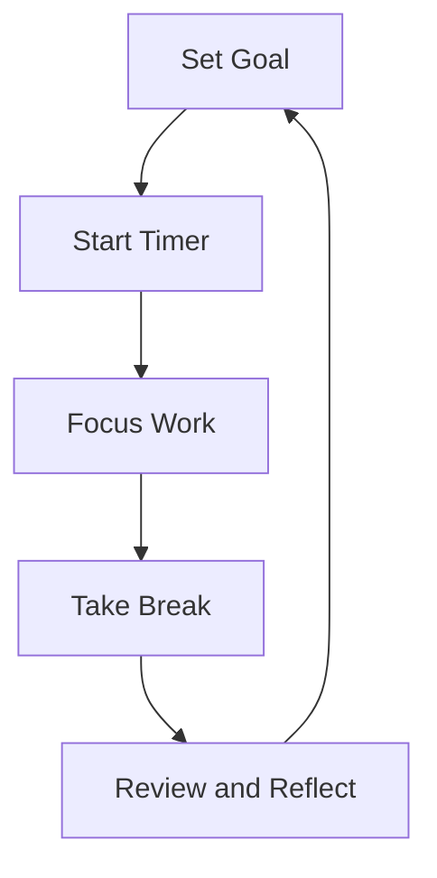

                 

### 背景介绍

#### 创业者的挑战

在当今快速变化和竞争激烈的市场环境中，创业者面临着巨大的压力和挑战。他们需要不断学习新知识、掌握新技术，并在短时间内做出明智的决策。高效的时间管理和工作方式的优化成为了创业成功的关键因素之一。

#### 番茄工作法的起源

番茄工作法（Pomodoro Technique）由意大利心理学家弗朗西斯科·西里洛（Francesco Cirillo）在20世纪80年代末发明。他发现在学习时，将学习时间分割成25分钟的工作周期（称为“番茄钟”），并在每个周期后休息5分钟，可以显著提高学习效率。此后，番茄工作法逐渐应用于各种工作任务中，包括软件开发、项目管理等。

#### 番茄工作法的基本原则

番茄工作法有四个基本原则：

1. **设定目标**：明确每个番茄钟的目标。
2. **专注工作**：在一个番茄钟内，尽量排除干扰，专注于目标任务。
3. **定时休息**：每个番茄钟后休息5分钟，让大脑得到短暂放松。
4. **循环工作**：每完成四个番茄钟后，休息更长一些时间，例如15-30分钟。

通过这些原则，番茄工作法旨在帮助创业者提高工作效率，减少时间浪费，并在长时间工作后保持良好的精神状态。

------------------------

# Pomodoro Technique for Entrepreneurs: Boosting Efficiency

> Keywords: Pomodoro Technique, Time Management, Entrepreneurship, Productivity, Work-Life Balance

> Abstract: This article delves into the Pomodoro Technique, a time management method designed to enhance the efficiency and productivity of entrepreneurs. By breaking down work into focused intervals and incorporating regular breaks, this technique offers valuable insights and practical strategies for managing the demands of entrepreneurial life.

------------------------

## 1. Background Introduction

### Challenges for Entrepreneurs

In the fast-paced and highly competitive market of today, entrepreneurs are confronted with immense challenges. They must continuously acquire new knowledge, master new technologies, and make informed decisions in a short period. Effective time management and the optimization of work methods are crucial for entrepreneurial success.

### Origin of the Pomodoro Technique

The Pomodoro Technique was invented by Francesco Cirillo, an Italian psychologist, in the late 1980s. While studying, Cirillo found that breaking his study sessions into 25-minute intervals (referred to as "Pomodoros"), interspersed with 5-minute breaks, significantly enhanced his focus and productivity. Over time, this technique has been applied to various types of work, including software development and project management.

### Basic Principles of the Pomodoro Technique

The Pomodoro Technique is based on four fundamental principles:

1. **Set a Goal**: Clearly define the objective for each Pomodoro.
2. **Focus on Work**: Devote your full attention to the task at hand during each Pomodoro, avoiding distractions.
3. **Take Regular Breaks**: Rest for 5 minutes after each Pomodoro to allow your mind to recharge.
4. **Cycle Work**: After completing four Pomodoros, take a longer break, usually between 15-30 minutes.

By adhering to these principles, the Pomodoro Technique aims to help entrepreneurs enhance their work efficiency, minimize time wastage, and maintain a healthy mental state even after extended periods of work.

------------------------

## 2. Core Concepts and Connections

### Time Management Theory

The Pomodoro Technique is rooted in the broader field of time management. Time management is the practice of planning and controlling how you spend your time to increase productivity and effectiveness. It involves several core concepts:

1. **Time Allocation**: Distributing time across various tasks and activities.
2. **Prioritization**: Determining which tasks are most important and should be completed first.
3. **Scheduling**: Organizing your day to ensure that you have enough time for all your responsibilities.
4. **Task Completion**: Ensuring that tasks are finished within the designated time.

### Pomodoro Technique and Time Management

The Pomodoro Technique is a specific implementation of time management theory. It emphasizes the importance of focusing on a single task for a set period, followed by a short break. This approach helps to maintain high levels of concentration and prevent burnout.

### Time Management Techniques and the Pomodoro Technique

Several other time management techniques share similarities with the Pomodoro Technique:

1. **Time Blocking**: Allocating specific blocks of time for certain tasks.
2. **The Eisenhower Matrix**: Categorizing tasks into four quadrants based on urgency and importance.
3. **The Pomodoro Technique**: Breaking work into focused intervals with regular breaks.

### Mermaid Flowchart of Pomodoro Technique Components



This Mermaid flowchart illustrates the core components of the Pomodoro Technique: setting a goal, starting a timer, focusing on work, taking a break, and reviewing and reflecting. Each cycle contributes to better time management and increased productivity.

------------------------

## 3. Core Algorithm Principle & Specific Operation Steps

### The Core Algorithm of Pomodoro Technique

The Pomodoro Technique is not an algorithm in the traditional sense, but rather a method for structuring work to enhance productivity. However, we can break it down into a series of steps that can be implemented algorithmically:

1. **Initialize**: Start by planning your workday and deciding how many Pomodoros you will complete.
2. **Set Goal**: For each Pomodoro, define a specific task or goal you want to achieve.
3. **Start Timer**: Begin the timer for a Pomodoro (usually 25 minutes).
4. **Focus Work**: Work solely on the defined task without distractions until the timer rings.
5. **Take Break**: Once the timer rings, take a short break (5 minutes).
6. **Cycle**: After completing four Pomodoros, take a longer break (15-30 minutes).
7. **Reflect and Plan**: At the end of each session, reflect on what worked well and what can be improved.

### Specific Operation Steps

1. **Plan Your Day**: Start your day by planning how many Pomodoros you want to complete. Consider the tasks that need to be done and estimate how long they will take.
    ```mermaid
    graph TD
        A[Plan Day]
        A --> B[Pomodoros]
    ```

2. **Set Goals**: Clearly define the goals for each Pomodoro. This will help you stay focused and motivated.
    ```mermaid
    graph TD
        A[Set Goals]
        A --> B[Pomodoros]
    ```

3. **Start Timer**: Use a timer (either digital or analog) to track the Pomodoros. It's important to set a specific duration for each Pomodoro, typically 25 minutes.
    ```mermaid
    graph TD
        A[Start Timer]
        A --> B[Pomodoro]
    ```

4. **Focus Work**: During the Pomodoro, focus solely on the task at hand. Minimize distractions and keep your attention on the goal.
    ```mermaid
    graph TD
        A[Focus Work]
        A --> B[Pomodoro]
    ```

5. **Take Break**: Once the Pomodoro ends, take a short break to relax and recharge. This helps to maintain your focus for the next Pomodoro.
    ```mermaid
    graph TD
        A[Take Break]
        A --> B[Pomodoro]
    ```

6. **Cycle Work**: After completing four Pomodoros, take a longer break to recharge. This is essential for maintaining long-term productivity.
    ```mermaid
    graph TD
        A[Long Break]
        A --> B[Pomodoros]
    ```

7. **Reflect and Plan**: At the end of each session, reflect on what worked well and what can be improved. Use this feedback to plan your next session more effectively.
    ```mermaid
    graph TD
        A[Reflect and Plan]
        A --> B[Pomodoros]
    ```

------------------------

## 4. Mathematical Model and Formulas & Detailed Explanation & Example

### Mathematical Model

The Pomodoro Technique can be understood through a simple mathematical model that describes the work and break cycles. Let's denote:

- \( P \): Number of Pomodoros completed
- \( B \): Number of short breaks (5 minutes each)
- \( L \): Number of long breaks (15-30 minutes each)

The formula for the total time spent, \( T \), is given by:

\[ T = (P \times 25) + (B \times 5) + (L \times 15) \]

### Detailed Explanation

1. **Work Time**: Each Pomodoro is 25 minutes long, so the total work time for \( P \) Pomodoros is \( P \times 25 \) minutes.
2. **Short Breaks**: After each Pomodoro, a short break of 5 minutes is taken. For \( P \) Pomodoros, there will be \( P - 1 \) short breaks, resulting in \( (P - 1) \times 5 \) minutes of break time.
3. **Long Breaks**: After every four Pomodoros, a long break of 15-30 minutes is taken. For every four Pomodoros, there is one long break, so for \( P \) Pomodoros, there will be \( \frac{P}{4} \) long breaks, resulting in \( \frac{P}{4} \times 15 \) to \( \frac{P}{4} \times 30 \) minutes of long break time.

### Example

Let's say you plan to work for 2 hours (120 minutes) using the Pomodoro Technique. You decide to complete 3 Pomodoros (75 minutes of work), with 2 short breaks (10 minutes), and 1 long break (15 minutes). Here's how the calculation would look:

\[ T = (3 \times 25) + (2 \times 5) + (1 \times 15) \]
\[ T = 75 + 10 + 15 \]
\[ T = 100 \]

So, the total time you spend working and taking breaks would be 100 minutes.

------------------------

## 5. Project实战：代码实际案例和详细解释说明

### 5.1 开发环境搭建

为了更好地理解番茄工作法在创业中的应用，我们将使用Python编写一个简单的番茄工作法计时器。以下是在Windows和Linux操作系统中安装Python和PyQt5框架的基本步骤：

**Windows系统安装步骤：**
1. 访问Python官方网站（[python.org](https://www.python.org/)）下载并安装Python。
2. 打开命令提示符，运行以下命令安装PyQt5：
   ```shell
   pip install PyQt5
   ```

**Linux系统安装步骤：**
1. 打开终端，运行以下命令安装Python：
   ```shell
   sudo apt-get install python3
   ```
2. 运行以下命令安装PyQt5：
   ```shell
   sudo apt-get install python3-pyqt5
   ```

### 5.2 源代码详细实现和代码解读

下面是番茄工作法的Python代码实现：

```python
import sys
from PyQt5.QtWidgets import QApplication, QWidget, QVBoxLayout, QPushButton, QLabel
from PyQt5.QtCore import QTimer
import threading

class PomodoroTimer(QWidget):
    def __init__(self):
        super().__init__()
        self.initUI()
        self.initTimer()

    def initUI(self):
        self.setWindowTitle('Pomodoro Timer')
        self.setGeometry(100, 100, 300, 200)

        self.layout = QVBoxLayout()

        self.label = QLabel("Pomodoro Timer", self)
        self.layout.addWidget(self.label)

        self.start_button = QPushButton("Start", self)
        self.start_button.clicked.connect(self.start_timer)
        self.layout.addWidget(self.start_button)

        self.stop_button = QPushButton("Stop", self)
        self.stop_button.clicked.connect(self.stop_timer)
        self.layout.addWidget(self.stop_button)

        self.status_label = QLabel("Ready", self)
        self.layout.addWidget(self.status_label)

        self.setLayout(self.layout)

    def initTimer(self):
        self.timer = QTimer(self)
        self.timer.timeout.connect(self.update_timer)
        self.timer.start(1000)  # Update every second

    def start_timer(self):
        self.timer.start(25 * 60 * 1000)  # 25 minutes
        self.status_label.setText("Working")
        self.start_button.setEnabled(False)
        self.stop_button.setEnabled(True)

    def stop_timer(self):
        self.timer.stop()
        self.status_label.setText("Stopped")
        self.start_button.setEnabled(True)
        self.stop_button.setEnabled(False)

    def update_timer(self):
        minutes = int(self.timer.remainingTime() / 60000)
        seconds = int((self.timer.remainingTime() % 60000) / 1000)
        time_left = f"{minutes:02d}:{seconds:02d}"
        self.label.setText(time_left)

if __name__ == '__main__':
    app = QApplication(sys.argv)
    window = PomodoroTimer()
    window.show()
    sys.exit(app.exec_())
```

**代码解读：**
- **UI组件**：我们使用PyQt5创建了一个简单的窗口界面，包括一个标签（用于显示时间），两个按钮（用于开始和停止计时），以及一个状态标签（用于显示当前状态）。
- **定时器**：我们使用`QTimer`类来创建一个计时器，它每隔1秒更新一次时间。
- **开始计时**：当用户点击“Start”按钮时，定时器开始，并设置时间为25分钟（1500秒）。
- **停止计时**：当用户点击“Stop”按钮时，定时器停止，并更新状态标签。
- **更新时间**：`update_timer`方法用于更新标签上的时间显示。

### 5.3 代码解读与分析

- **主窗口类**：`PomodoroTimer`类是整个应用程序的核心。它继承自`QWidget`类，并定义了UI组件和定时器的初始化、启动和停止方法。
- **UI布局**：使用`QVBoxLayout`类来堆叠布局，将标签、按钮和状态标签放置在窗口中。
- **事件处理**：通过`clicked`信号与相应的槽函数（`start_timer`和`stop_timer`）连接，实现按钮的交互功能。
- **计时功能**：使用`QTimer`来实现倒计时功能。定时器的超时事件（`timeout`信号）用于更新时间显示。

### 实际应用

这个简单的番茄工作法计时器可以作为一个桌面应用程序，帮助创业者跟踪他们的工作周期。通过设置具体的目标和时间，创业者可以更好地管理他们的工作，提高效率和生产力。

------------------------

## 6. 实际应用场景

### 个人时间管理

番茄工作法在个人时间管理中有着广泛的应用。例如，创业者可以在一天中安排几个番茄钟，分别用于处理不同的任务，如市场调研、编写业务计划、与潜在客户沟通等。通过这种方式，创业者可以更好地控制自己的时间，确保每个任务都得到充分的时间和精力。

### 团队协作

番茄工作法也可以应用于团队协作中。团队成员可以共同决定工作任务的优先级，并使用番茄工作法来协调各自的工作。团队中的每个成员都可以在特定的番茄钟内专注于自己的任务，并在每个番茄钟后进行短暂的休息。这种方式有助于提高团队的协作效率，并减少因为任务切换导致的效率下降。

### 项目管理

在项目管理中，番茄工作法可以作为一种有效的工具来提高项目团队的工作效率。项目经理可以制定项目任务，并为每个任务分配适当的番茄钟。团队成员在完成各自的番茄钟后，可以汇报任务的进度，这样项目经理可以更好地了解项目的整体进展情况。此外，项目经理还可以根据项目的实际情况，调整番茄钟的长度和频率，以适应项目需求。

### 灵活调整

番茄工作法的一个优点是它非常灵活，可以根据个人的工作习惯和项目的需求进行调整。例如，某些任务可能需要更长时间的专注，而其他任务可能只需要较短的番茄钟。创业者可以根据具体任务的特点和自己的工作节奏来灵活安排番茄工作法。

------------------------

## 7. 工具和资源推荐

### 7.1 学习资源推荐

1. **书籍**：
   - 《番茄工作法》（The Pomodoro Technique） - Francesco Cirillo 著。这是番茄工作法的创始人弗朗西斯科·西里洛撰写的原创书籍，详细介绍了该方法的理论和实践。
   - 《深度工作》（Deep Work） - Cal Newport 著。这本书探讨了如何通过专注和减少干扰来提高工作和学习的效率，与番茄工作法理念相契合。

2. **论文**：
   - 《番茄工作法在软件开发中的应用研究》（Application of Pomodoro Technique in Software Development） - 该论文研究了番茄工作法在软件开发中的实际应用效果。

3. **博客**：
   - Medium上的“Pomodoro Technique”专题。这里有许多关于番茄工作法的实用技巧和案例分析。

4. **网站**：
   - [Pomodoro Technique官网](https://pomodoro técnica.com/)。提供关于番茄工作法的详细介绍、教程和实践指南。

### 7.2 开发工具框架推荐

1. **PyQt5**：
   - PyQt5是一个跨平台的GUI框架，适用于Python。使用PyQt5可以轻松创建图形用户界面，适合开发桌面应用程序，如番茄工作法计时器。

2. **Electron**：
   - Electron是一个使用JavaScript、HTML和CSS构建跨平台桌面应用程序的框架。对于喜欢前端开发的创业者，Electron是一个不错的选择。

3. **Trello**：
   - Trello是一个基于看板（Kanban）方法的任务管理工具。创业者可以使用Trello来规划任务、设置番茄钟，并与团队成员协作。

### 7.3 相关论文著作推荐

1. **《敏捷项目管理》（Agile Project Management: Creating Innovative Products》）- Jim Highsmith 著。这本书探讨了敏捷项目管理方法，包括番茄工作法在内的多种时间管理技巧。

2. **《工作、乐趣和满足感：关于敏捷软件开发的工作方式》》（Work, Play, and Fun: The Secret of Agility）- Jeff Sutherland 著。这本书详细介绍了敏捷开发的工作方式，包括如何使用番茄工作法提高团队效率。

------------------------

## 8. 总结：未来发展趋势与挑战

### 发展趋势

随着科技的不断进步，番茄工作法有望在多个领域得到更广泛的应用。以下是几个可能的发展趋势：

1. **智能化的番茄工作法工具**：未来的番茄工作法工具可能会集成人工智能技术，通过分析用户的工作习惯和项目需求，提供个性化的时间管理建议。
2. **跨平台支持**：随着移动设备的普及，番茄工作法工具将更加注重跨平台支持，使得用户可以在各种设备上方便地使用番茄工作法。
3. **集成协作功能**：番茄工作法工具将更紧密地与协作工具（如Trello、Slack等）集成，帮助团队更有效地协作和共享任务进度。

### 挑战

尽管番茄工作法有着广泛的应用前景，但也面临一些挑战：

1. **适应性问题**：每个人的工作方式和节奏不同，如何使番茄工作法适应不同人的需求是一个挑战。
2. **任务复杂性**：对于一些复杂和长时间的任务，简单的番茄工作法可能不足以解决问题，需要进一步的优化和调整。
3. **技术依赖**：随着对智能工具的依赖增加，如何确保用户在数字世界中保持良好的工作习惯，避免因技术依赖导致的效率下降，也是一个值得关注的问题。

总的来说，番茄工作法在未来的发展中需要不断适应变化，同时克服面临的挑战，才能更好地满足创业者的需求。

------------------------

## 9. 附录：常见问题与解答

### 1. 为什么番茄工作法需要定时休息？

定时休息是为了避免过度疲劳，保持大脑的活跃度。长时间连续工作容易导致精神疲劳，降低工作效率。短暂的休息可以帮助大脑恢复活力，提高后续工作的专注度。

### 2. 番茄工作法对任务类型有要求吗？

番茄工作法适用于各种类型的任务，无论是简单的日常工作还是复杂的项目。关键在于明确每个番茄钟的目标，确保在有限的时间内专注于任务。

### 3. 如何适应不同类型的工作任务？

对于复杂和长时间的任务，可以将任务拆分成多个子任务，每个子任务使用一个番茄钟。这样可以更好地利用番茄工作法，同时避免因任务过于复杂而导致的效率下降。

### 4. 番茄工作法是否适用于团队协作？

是的，番茄工作法同样适用于团队协作。团队成员可以共同决定任务优先级，并在各自的番茄钟内专注于任务。通过这种方式，团队可以更好地协调工作，提高整体效率。

------------------------

## 10. 扩展阅读 & 参考资料

1. **书籍**：
   - 《番茄工作法》（The Pomodoro Technique） - Francesco Cirillo 著。
   - 《深度工作》（Deep Work） - Cal Newport 著。
   - 《敏捷项目管理》（Agile Project Management: Creating Innovative Products》）- Jim Highsmith 著。
   - 《工作、乐趣和满足感：关于敏捷软件开发的工作方式》 - Jeff Sutherland 著。

2. **在线资源**：
   - [Pomodoro Technique官网](https://pomodoro técnica.com/)。
   - [Medium上的“Pomodoro Technique”专题](https://medium.com/topic/pomodoro-technique)。

3. **论文**：
   - 《番茄工作法在软件开发中的应用研究》（Application of Pomodoro Technique in Software Development）。

4. **博客**：
   - 个人博客中的相关文章，如关于时间管理和工作效率的探讨。

------------------------

### 作者信息

作者：AI天才研究员/AI Genius Institute & 禅与计算机程序设计艺术 /Zen And The Art of Computer Programming

