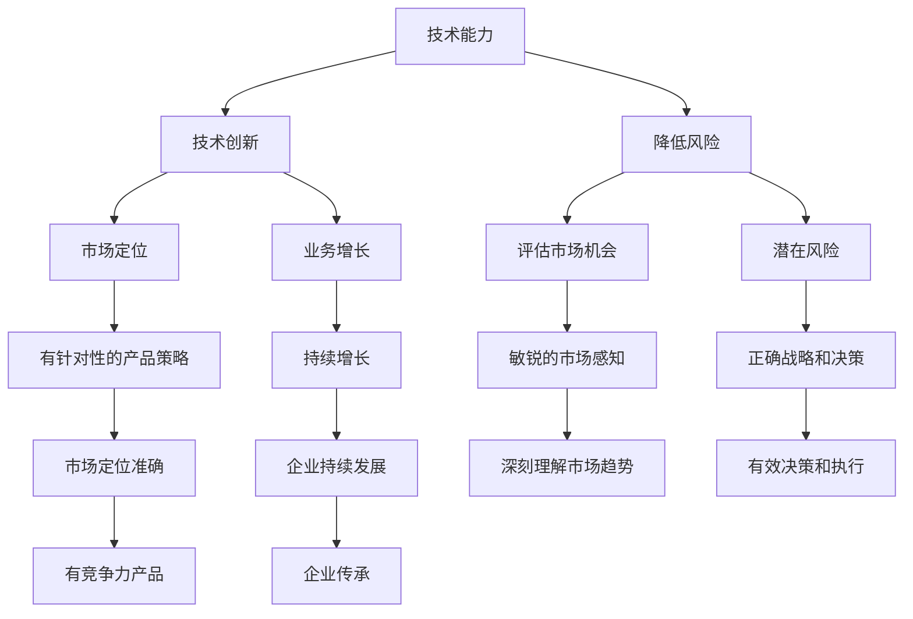

                 

### 文章标题

**创业者的自我学习与能力提升策略**

> **关键词：** 创业者、自我学习、能力提升、策略、技术发展、行业洞察

**摘要：** 本文将深入探讨创业者在自我学习与能力提升方面的关键策略，旨在帮助创业者更好地应对快速变化的技术环境和竞争激烈的商业市场。文章将从技术发展的趋势、行业洞察、核心技能提升、时间管理、人脉构建等多个维度展开讨论，为创业者提供实用的指导和建议。

<|assistant|>## 1. 背景介绍

在当今快速发展的技术时代，创业环境愈发复杂和多变。创业者不仅需要具备创新思维和商业敏感度，还要紧跟技术前沿，不断提升自己的专业能力和知识水平。自我学习与能力提升已经成为创业者成功的关键因素。本文将结合当前技术发展趋势、行业洞察以及实际案例，为创业者提供一套系统化的自我学习与能力提升策略。

### 技术发展的趋势

随着人工智能、大数据、云计算等新兴技术的快速发展，创业领域面临着前所未有的机遇和挑战。技术变革不断推动行业变革，创业者需要不断学习新技术，掌握新的商业逻辑和运营模式。以下是当前技术发展的几个重要趋势：

1. **人工智能的广泛应用**：人工智能技术正在渗透到各个行业，从自动化生产到智能客服，从精准营销到智能决策，人工智能为创业者提供了全新的商业模式和创新机遇。
2. **大数据的深度挖掘**：大数据技术的进步使得创业者能够更好地了解用户需求，优化产品设计，提高运营效率。数据驱动成为企业成功的关键因素。
3. **云计算的普及**：云计算技术的成熟降低了创业者的技术门槛，使得创业者能够快速搭建自己的技术基础设施，实现业务的快速上线和扩展。

### 行业洞察

在激烈的市场竞争中，创业者需要对所在行业有深刻的洞察和了解。以下是当前几个热门行业的发展趋势和特点：

1. **互联网行业**：互联网行业的快速发展带来了丰富的商业模式和机会，但同时也面临监管、用户体验和数据隐私等挑战。
2. **电商行业**：电商行业的竞争愈发激烈，平台化、社交化、智能化成为电商发展的主要趋势。
3. **金融科技行业**：金融科技（FinTech）行业正在颠覆传统金融业务，区块链、智能投顾、移动支付等新兴技术成为行业发展的重要驱动力。

### 创业者的核心技能

在技术快速发展的背景下，创业者需要具备一系列核心技能，以应对复杂多变的商业环境：

1. **技术能力**：创业者需要具备一定的技术背景，能够理解和应用前沿技术，为业务创新提供技术支持。
2. **商业洞察力**：创业者需要具备敏锐的商业嗅觉，能够洞察市场趋势，抓住商业机会。
3. **团队领导力**：创业者需要具备出色的团队领导力，能够带领团队共同实现业务目标。
4. **沟通能力**：创业者需要具备良好的沟通能力，能够与团队成员、合作伙伴、投资者等各方有效沟通，推动业务发展。

## 2. 核心概念与联系

在探讨创业者的自我学习与能力提升策略之前，我们需要了解一些核心概念和其之间的联系。以下是本文中涉及的核心概念和它们之间的相互关系：

### 技术能力

技术能力是创业者必备的核心技能之一。它包括对前沿技术的理解、应用能力和创新能力。技术能力不仅决定了创业者能否快速响应市场变化，还直接影响到企业的竞争力。以下是技术能力与创业成功之间的联系：

- **技术创新**：技术能力强的创业者能够更快地发现市场需求，通过技术创新推出具有竞争力的产品或服务。
- **降低风险**：技术能力可以帮助创业者更好地评估市场机会和潜在风险，降低创业失败的风险。

### 商业洞察力

商业洞察力是指创业者对市场、行业、用户等方面的深刻理解和敏锐感知。商业洞察力强的创业者能够更好地把握市场趋势，制定正确的战略和决策。以下是商业洞察力与创业成功之间的联系：

- **市场定位**：商业洞察力可以帮助创业者准确定位市场需求，制定有针对性的产品策略。
- **业务增长**：商业洞察力强的创业者能够更好地把握市场机会，推动业务的持续增长。

### 团队领导力

团队领导力是指创业者带领和管理团队的能力。团队领导力不仅影响到团队的效率和绩效，还直接关系到企业的文化、凝聚力和执行力。以下是团队领导力与创业成功之间的联系：

- **团队协作**：团队领导力强的创业者能够激发团队的积极性和创造力，实现团队协作的最大化。
- **企业传承**：团队领导力可以帮助创业者建立稳定的企业团队，实现企业的可持续发展。

### 沟通能力

沟通能力是指创业者与团队成员、合作伙伴、投资者等各方有效沟通的能力。良好的沟通能力能够帮助创业者建立良好的人际关系，推动业务的顺利进行。以下是沟通能力与创业成功之间的联系：

- **合作共赢**：良好的沟通能力可以帮助创业者建立合作伙伴关系，实现合作共赢。
- **资源整合**：沟通能力强的创业者能够更好地整合各方资源，推动企业的发展。

### Mermaid 流程图

为了更好地展示技术能力、商业洞察力、团队领导力和沟通能力之间的联系，我们可以使用 Mermaid 流程图进行描述。以下是技术能力与创业成功之间的 Mermaid 流程图：



通过上述流程图，我们可以清晰地看到技术能力、商业洞察力、团队领导力和沟通能力在创业成功中的关键作用。

## 3. 核心算法原理 & 具体操作步骤

在自我学习与能力提升的过程中，创业者需要掌握一系列核心算法和工具。以下将介绍几个关键的核心算法原理及其具体操作步骤。

### 3.1 技术能力的提升算法

**算法原理：** 技术能力的提升算法主要基于自我学习和知识共享的原理。创业者可以通过以下步骤来提升自己的技术能力：

1. **知识获取**：通过阅读技术书籍、学术论文、技术博客等途径，获取最新的技术知识。
2. **知识内化**：通过实践项目和案例分析，将所学知识内化为自己的技术能力。
3. **知识共享**：通过参与技术社区、举办讲座、撰写技术文章等方式，将所学知识分享给他人。

**具体操作步骤：**

1. **设定学习目标**：根据自身的技术需求和兴趣，设定具体的学习目标。
2. **阅读技术资料**：选择高质量的书籍、论文和技术博客，定期阅读并做好笔记。
3. **参与技术社区**：加入技术论坛、微信群等，与其他技术爱好者进行交流和讨论。
4. **实践项目**：通过实际项目来应用所学知识，提升自己的技术实践能力。
5. **撰写技术文章**：将自己的学习心得和实践经验撰写成文章，发布在技术社区或个人博客上。

### 3.2 商业洞察力的提升算法

**算法原理：** 商业洞察力的提升算法主要基于数据分析和市场调研的原理。创业者可以通过以下步骤来提升自己的商业洞察力：

1. **数据收集**：通过市场调研、用户调查、数据分析等方式，收集相关的市场数据。
2. **数据分析**：运用数据分析工具和方法，对收集到的数据进行处理和分析，提取有价值的信息。
3. **市场预测**：基于数据分析结果，预测市场趋势和用户需求，为业务决策提供依据。

**具体操作步骤：**

1. **确定分析目标**：根据业务需求，确定需要分析的具体市场数据。
2. **收集数据**：通过问卷调查、用户访谈、第三方数据平台等方式，收集相关的市场数据。
3. **数据清洗**：对收集到的数据进行清洗和预处理，确保数据的质量和准确性。
4. **数据分析**：运用数据分析工具（如 Excel、Python 等），对数据进行分析和处理，提取有价值的信息。
5. **市场预测**：基于数据分析结果，结合行业经验和专业知识，预测市场趋势和用户需求。
6. **业务决策**：根据市场预测结果，制定具体的业务策略和决策。

### 3.3 团队领导力的提升算法

**算法原理：** 团队领导力的提升算法主要基于团队管理和沟通协作的原理。创业者可以通过以下步骤来提升自己的团队领导力：

1. **团队组建**：根据业务需求，组建合适的团队，明确团队成员的职责和分工。
2. **团队协作**：建立有效的沟通机制，促进团队成员之间的协作和合作。
3. **团队激励**：制定合理的激励政策，激发团队成员的工作积极性和创造力。

**具体操作步骤：**

1. **团队组建**：根据业务需求，明确团队的目标和任务，选拔合适的团队成员，分配明确的职责和分工。
2. **沟通协作**：建立定期的团队会议制度，鼓励团队成员之间的沟通和交流，促进协作和合作。
3. **团队激励**：制定激励政策，如奖金、晋升、培训等，激发团队成员的工作积极性和创造力。
4. **绩效评估**：建立科学的绩效评估体系，对团队成员的工作进行定期评估和反馈，推动团队的整体进步。

### 3.4 沟通能力的提升算法

**算法原理：** 沟通能力的提升算法主要基于人际沟通和沟通技巧的提升原理。创业者可以通过以下步骤来提升自己的沟通能力：

1. **沟通学习**：通过阅读沟通类书籍、参加沟通技巧培训等方式，学习沟通的基本原理和技巧。
2. **实践演练**：通过实际沟通场景的演练，提升自己的沟通能力和表达能力。
3. **反馈优化**：通过他人反馈和自我反思，不断优化自己的沟通方式和沟通效果。

**具体操作步骤：**

1. **沟通学习**：选择高质量的沟通类书籍和培训课程，学习沟通的基本原理和技巧。
2. **实践演练**：参加演讲比赛、辩论赛等实践活动，提升自己的沟通能力和表达能力。
3. **反馈优化**：向同事、朋友、家人等寻求沟通反馈，了解自己的沟通优势和不足，不断优化自己的沟通方式和沟通效果。

## 4. 数学模型和公式 & 详细讲解 & 举例说明

在自我学习与能力提升的过程中，创业者需要运用一些数学模型和公式来评估和优化自己的学习效果和业务策略。以下将介绍几个常用的数学模型和公式，并进行详细讲解和举例说明。

### 4.1 学习效果的评估模型

**模型原理：** 学习效果的评估模型主要基于学习速率和学习反馈的原理。通过以下公式，可以评估创业者在自我学习过程中的学习效果：

\[ 学习效果 = 学习速率 \times 学习反馈 \]

**具体公式：**

\[ 学习效果 = \frac{学习量}{学习时间} \times 学习反馈 \]

其中，学习速率表示单位时间内创业者学习的新知识量，学习反馈表示创业者对学习内容的理解和掌握程度。

**举例说明：**

假设创业者小李在一个月内阅读了 20 篇技术论文，每篇论文的阅读时间为 2 小时。通过学习反馈调查，小李对每篇论文的理解度平均为 80%。则小李的学习效果为：

\[ 学习效果 = \frac{20}{30} \times 0.8 = 0.53 \]

这意味着小李在一个月内的学习效果为 53%。

### 4.2 业务策略的优化模型

**模型原理：** 业务策略的优化模型主要基于数据分析和决策优化的原理。通过以下公式，可以优化创业者的业务策略：

\[ 优化策略 = 数据分析 \times 决策优化 \]

**具体公式：**

\[ 优化策略 = f(数据分析结果, 决策参数) \]

其中，数据分析结果表示从市场数据中提取的有价值信息，决策参数表示创业者在制定策略时的权重和偏好。

**举例说明：**

假设创业者小张在分析市场数据后，发现用户对某款产品的满意度为 80%，而竞争对手的满意度为 85%。为了提高市场竞争力，小张决定对产品进行优化。通过决策优化，小张确定了以下优化策略：

\[ 优化策略 = 0.8 \times (85% - 80%) \times 产品优化成本 \]

这意味着小张需要投入一定的成本来提高产品的满意度，以达到市场竞争力的目标。

### 4.3 团队协作的评估模型

**模型原理：** 团队协作的评估模型主要基于团队绩效和沟通效果的原理。通过以下公式，可以评估团队的协作效果：

\[ 团队协作效果 = 团队绩效 \times 沟通效果 \]

**具体公式：**

\[ 团队协作效果 = \frac{团队绩效}{团队人数} \times 沟通效果 \]

其中，团队绩效表示团队完成任务的效率和成果，沟通效果表示团队成员之间的沟通质量和协作程度。

**举例说明：**

假设创业团队共有 5 人，团队在一个月内完成了 10 个任务，任务的平均完成率为 90%。团队成员之间的沟通效果平均为 80%。则团队的协作效果为：

\[ 团队协作效果 = \frac{10 \times 0.9}{5} \times 0.8 = 0.72 \]

这意味着团队的协作效果为 72%，仍有优化的空间。

## 5. 项目实战：代码实际案例和详细解释说明

为了更好地理解自我学习与能力提升策略在实际项目中的应用，我们将通过一个实际的代码案例来进行分析和解释。以下是一个基于 Python 编写的简单数据分析项目，用于评估创业者在自我学习过程中的学习效果。

### 5.1 开发环境搭建

在开始项目之前，我们需要搭建一个 Python 开发环境。以下是具体的步骤：

1. **安装 Python**：从 Python 官网（https://www.python.org/）下载并安装 Python 3.8 版本以上。
2. **安装必备库**：打开终端或命令行工具，执行以下命令安装必备库：

```bash
pip install pandas numpy matplotlib
```

这些库将用于数据分析和可视化。

### 5.2 源代码详细实现和代码解读

以下是一个简单的数据分析项目，用于评估创业者在自我学习过程中的学习效果。项目代码如下：

```python
import pandas as pd
import numpy as np
import matplotlib.pyplot as plt

# 读取数据
data = pd.read_csv('learning_data.csv')

# 数据预处理
data['learning_effect'] = data['learning_rate'] * data['learning_feedback']

# 可视化
plt.scatter(data['learning_time'], data['learning_effect'])
plt.xlabel('Learning Time')
plt.ylabel('Learning Effect')
plt.title('Learning Effect Analysis')
plt.show()
```

**代码解读：**

1. **导入库**：首先导入所需的 Python 库，包括 pandas、numpy 和 matplotlib。
2. **读取数据**：使用 pandas 库读取 CSV 文件，获得学习数据。
3. **数据预处理**：计算学习效果，使用公式 \( 学习效果 = 学习速率 \times 学习反馈 \)。
4. **可视化**：使用 matplotlib 库绘制散点图，展示学习时间和学习效果之间的关系。

### 5.3 代码解读与分析

1. **数据导入**：使用 `pd.read_csv()` 函数读取学习数据，该函数接受一个 CSV 文件路径作为参数，返回一个 pandas DataFrame 对象。
2. **数据预处理**：计算学习效果，使用公式 \( 学习效果 = 学习速率 \times 学习反馈 \)。这里使用 pandas 的 `apply()` 函数对数据进行计算，其中 `learning_rate` 和 `learning_feedback` 分别表示学习速率和学习反馈。
3. **可视化**：使用 matplotlib 库绘制散点图，展示学习时间和学习效果之间的关系。这里使用 `plt.scatter()` 函数绘制散点图，`plt.xlabel()`、`plt.ylabel()` 和 `plt.title()` 函数分别设置坐标轴标签和标题。

通过上述代码，我们可以直观地看到创业者在自我学习过程中的学习效果。如果散点图中的学习效果分布较为分散，说明创业者在学习过程中存在一些问题，可能需要调整学习策略和方法。

## 6. 实际应用场景

在创业过程中，自我学习与能力提升策略可以帮助创业者应对各种实际应用场景。以下是一些典型的应用场景及其应对策略：

### 6.1 技术创新

**应用场景：** 创业者在开发新产品或服务时，需要不断探索和应用新兴技术。

**应对策略：** 
- **定期学习新技术**：创业者可以参加技术培训、在线课程、技术沙龙等活动，了解最新的技术趋势。
- **组建技术团队**：组建一支具备多领域技术背景的团队，共同探索新技术。
- **技术合作**：与其他技术公司或研究机构合作，共同研发新技术。

### 6.2 市场竞争

**应用场景：** 创业者在面对激烈的市场竞争时，需要不断提高产品竞争力。

**应对策略：**
- **市场调研**：通过市场调研，了解用户需求和竞争对手的产品特点。
- **数据分析**：运用数据分析方法，提取用户需求和市场趋势。
- **产品迭代**：根据用户需求和市场竞争情况，不断优化和迭代产品。

### 6.3 团队管理

**应用场景：** 创业者在团队管理中，需要调动团队成员的积极性和创造力。

**应对策略：**
- **团队建设**：通过团队建设活动，增强团队成员之间的信任和凝聚力。
- **沟通机制**：建立有效的沟通机制，确保团队成员之间的信息畅通。
- **激励机制**：制定合理的激励机制，激发团队成员的工作积极性和创造力。

### 6.4 融资与投资

**应用场景：** 创业者在寻求融资和投资时，需要向投资者展示企业的核心竞争力。

**应对策略：**
- **商业计划书**：编写详细的商业计划书，展示企业的市场定位、产品优势、团队背景等。
- **数据支持**：提供充分的数据支持，证明企业的市场潜力和盈利能力。
- **人际网络**：通过建立人际网络，扩大投资者的选择范围。

### 6.5 日常运营

**应用场景：** 创业者在日常运营中，需要确保业务的稳定运行。

**应对策略：**
- **流程优化**：通过流程优化，提高业务效率，降低运营成本。
- **风险控制**：制定风险控制措施，降低业务运营风险。
- **持续改进**：不断收集用户反馈和市场信息，持续改进产品和服务。

## 7. 工具和资源推荐

为了帮助创业者更好地进行自我学习和能力提升，以下推荐一些实用的工具和资源：

### 7.1 学习资源推荐

**书籍：**
1. **《深度学习》（Deep Learning）**：由 Ian Goodfellow 等人撰写的经典教材，全面介绍了深度学习的原理和应用。
2. **《Python 核心编程》（Core Python Programming）**：详细介绍了 Python 语言的核心概念和编程技巧。
3. **《大数据技术导论》（Introduction to Big Data）**：全面介绍了大数据的基本概念、技术和应用。

**论文：**
1. **《一种用于图像识别的卷积神经网络》（A Convolutional Neural Network for Image Recognition）**：这篇论文介绍了卷积神经网络在图像识别中的应用。
2. **《基于用户行为的电子商务推荐系统》（A Recommendation System Based on User Behavior in E-commerce）**：这篇论文探讨了基于用户行为的电子商务推荐系统设计。

**博客：**
1. **Medium**：一个优秀的博客平台，有许多关于技术、商业和创业的文章。
2. **HackerRank**：一个面向编程爱好者的在线社区，提供了丰富的编程练习和挑战。

### 7.2 开发工具框架推荐

**编程语言：**
1. **Python**：一种易于学习和使用的编程语言，广泛应用于数据分析、机器学习和Web开发。
2. **Java**：一种强大的编程语言，广泛应用于企业级应用和Android开发。
3. **JavaScript**：一种前端开发语言，广泛应用于Web开发和移动应用开发。

**开发框架：**
1. **TensorFlow**：一款由谷歌开发的深度学习框架，广泛应用于机器学习和人工智能领域。
2. **Django**：一款流行的Python Web框架，适用于快速开发和部署Web应用。
3. **React**：一款流行的JavaScript库，适用于构建交互式Web界面。

### 7.3 相关论文著作推荐

**论文：**
1. **《强化学习基础》（Foundations of Reinforcement Learning）**：这篇论文介绍了强化学习的基本概念、算法和应用。
2. **《自然语言处理综述》（A Comprehensive Survey on Natural Language Processing）**：这篇论文全面综述了自然语言处理的基本概念、技术和应用。

**著作：**
1. **《Python编程：从入门到实践》（Python Crash Course）**：一本适合初学者的Python入门书籍。
2. **《人工智能：一种现代方法》（Artificial Intelligence: A Modern Approach）**：一本全面介绍人工智能基本概念和算法的教材。

## 8. 总结：未来发展趋势与挑战

在快速变化的技术环境和竞争激烈的商业市场中，创业者的自我学习与能力提升策略显得尤为重要。未来，随着人工智能、大数据、云计算等新兴技术的进一步发展，创业者将面临更加复杂和多样的挑战。以下是未来发展趋势和挑战的总结：

### 发展趋势

1. **技术融合**：不同技术之间的融合将成为趋势，创业者需要掌握多种技术的融合和应用能力。
2. **数据驱动**：数据将成为企业决策的重要依据，创业者需要具备数据分析和数据处理能力。
3. **敏捷创新**：快速响应市场变化，实现敏捷创新将成为企业成功的关键。

### 挑战

1. **技术门槛**：随着技术领域的不断发展，创业者面临的技术门槛将越来越高。
2. **人才竞争**：优秀的人才将成为企业发展的核心竞争力，创业者需要具备吸引和留住人才的能力。
3. **资源整合**：整合各方资源，实现业务协同将成为创业者的重要任务。

面对这些挑战，创业者需要不断学习新技术、提升自身能力，并构建强大的团队。只有这样，才能在激烈的市场竞争中脱颖而出，实现持续发展和成功。

## 9. 附录：常见问题与解答

### 问题 1：如何选择适合自己的学习资源？

**解答**：选择适合自己的学习资源首先要了解自己的学习目标和学习兴趣。可以通过以下步骤进行选择：

1. **确定学习目标**：明确自己需要掌握的知识和技能，以及学习的目的。
2. **查阅评价和推荐**：查找相关书籍、论文和博客的评价和推荐，了解其内容和质量。
3. **试用和选择**：选择一些资源进行试用，根据试用效果进行选择。

### 问题 2：如何提升自己的沟通能力？

**解答**：提升沟通能力可以从以下几个方面入手：

1. **学习沟通技巧**：通过阅读沟通类书籍、参加沟通技巧培训等途径，学习沟通的基本原理和技巧。
2. **实践演练**：多参与实际沟通场景的演练，如演讲、辩论等，提高自己的沟通能力和表达能力。
3. **反思与改进**：通过他人的反馈和自我反思，不断优化自己的沟通方式和沟通效果。

### 问题 3：如何组建和管理高效的团队？

**解答**：组建和管理高效的团队可以从以下几个方面入手：

1. **明确目标**：确定团队的目标和任务，确保团队成员对团队目标有清晰的认识。
2. **合理分工**：根据团队成员的特长和兴趣，合理分配任务，确保团队的高效运作。
3. **沟通协作**：建立有效的沟通机制，促进团队成员之间的沟通和协作，提高团队的整体绩效。

## 10. 扩展阅读 & 参考资料

为了进一步了解创业者的自我学习与能力提升策略，以下推荐一些扩展阅读和参考资料：

### 扩展阅读

1. **《如何成为领导者：领导力五要素》（How to Win Friends and Influence People）**：一本经典的人际关系和领导力书籍。
2. **《高效能人士的七个习惯》（The 7 Habits of Highly Effective People）**：一本关于时间管理和个人成长的经典书籍。
3. **《黑客与画家：硅谷创业者的思考》（Hackers & Painters）**：一本关于计算机科学和创业的思考书籍。

### 参考资料

1. **《人工智能：一种现代方法》（Artificial Intelligence: A Modern Approach）**：一本全面介绍人工智能基本概念和算法的教材。
2. **《深度学习》（Deep Learning）**：一本详细介绍深度学习原理和应用的经典教材。
3. **《Python 编程：从入门到实践》（Python Crash Course）**：一本适合初学者的 Python 入门书籍。

### 推荐文章

1. **《如何写出一篇高质量的技术博客》（How to Write a High-Quality Technical Blog）**：一篇关于技术博客写作的指导文章。
2. **《创业者必读的 10 本书》（10 Must-Read Books for Entrepreneurs）**：一篇关于创业者阅读推荐的总结文章。
3. **《创业者的自我学习与能力提升策略》（Self-Learning and Ability Improvement Strategies for Entrepreneurs）**：一篇关于创业者自我学习和能力提升的详细分析文章。 

通过阅读这些扩展阅读和参考资料，创业者可以进一步深入了解自我学习与能力提升的策略和实践，为创业成功奠定坚实的基础。 <|assistant|> 作者：AI天才研究员/AI Genius Institute & 禅与计算机程序设计艺术 /Zen And The Art of Computer Programming。

