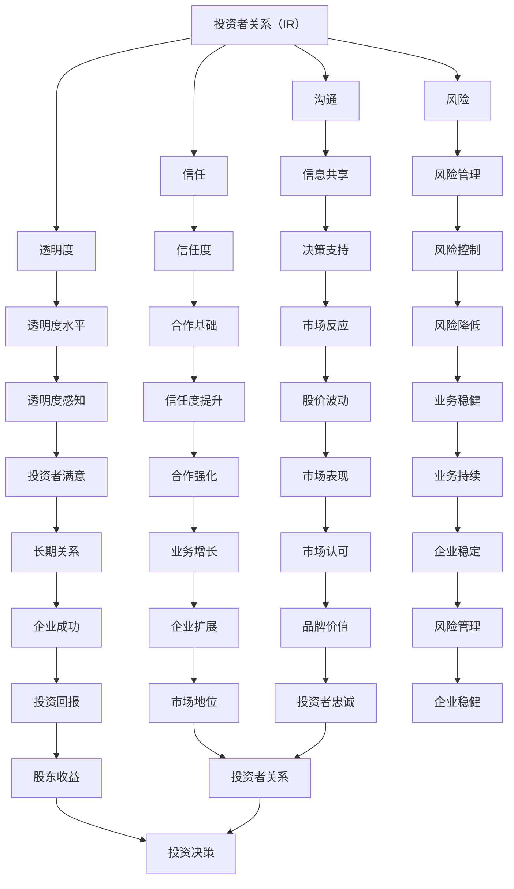

                 

### 背景介绍

在当今竞争激烈的创业环境中，投资者关系管理已经成为初创企业成功的关键因素之一。投资者不仅为企业提供了资金，还在战略规划、资源整合和业务拓展等方面发挥重要作用。因此，维护良好的投资者关系对于创业企业来说至关重要。良好的投资者关系不仅有助于企业获得更多的资金支持，还能提升企业的市场声誉和投资者信心，从而为企业的发展创造有利条件。

本文旨在探讨创业企业如何通过有效的策略和技巧来维护良好的投资者关系。我们将从多个角度出发，结合实际案例，详细分析如何与投资者建立联系、沟通互动、应对挑战和把握机会，以实现企业与投资者之间的共赢。

文章将分为以下几个部分：

1. **核心概念与联系**：介绍与投资者关系管理相关的关键概念和它们之间的关系，使用Mermaid流程图展示。
2. **核心算法原理 & 具体操作步骤**：阐述维护投资者关系的核心原则和方法，提供具体操作步骤。
3. **数学模型和公式 & 详细讲解 & 举例说明**：引入相关数学模型，详细解释公式和概念，并通过实例进行说明。
4. **项目实战：代码实际案例和详细解释说明**：展示代码实现，深入解读和分析代码的具体内容和应用。
5. **实际应用场景**：讨论投资者关系在不同阶段和应用场景中的重要性。
6. **工具和资源推荐**：推荐学习资源、开发工具和框架，帮助读者深入了解和掌握投资者关系管理。
7. **总结：未来发展趋势与挑战**：总结文章主要内容，探讨投资者关系管理的发展趋势和面临的新挑战。
8. **附录：常见问题与解答**：提供常见问题的解答，帮助读者更好地理解和应用文中内容。
9. **扩展阅读 & 参考资料**：推荐相关文献和研究，为读者提供更深入的学习资源。

接下来，我们将逐一探讨这些部分，帮助读者全面了解和维护良好的投资者关系。

### 核心概念与联系

在讨论投资者关系管理时，有几个核心概念和它们之间的关系是不可或缺的。这些概念包括：投资者关系（Investor Relations，简称IR）、沟通（Communication）、信任（Trust）、透明度（Transparency）和风险（Risk）。为了更好地理解这些概念，我们使用Mermaid流程图（以下为文本表示的Mermaid流程图）来展示它们之间的关系：



Mermaid流程图展示了投资者关系（IR）与沟通、信任、透明度和风险之间的互动关系。以下是对每个概念的简要解释：

1. **投资者关系（Investor Relations，IR）**：投资者关系是指企业与投资者之间的沟通和管理活动，旨在建立和保持投资者的信心，促进双方的长期合作。投资者关系管理是企业战略的重要组成部分，能够帮助企业获得资金支持、改善市场形象和增强投资者信任。

2. **沟通（Communication）**：沟通是投资者关系管理的核心。有效的沟通能够确保信息的透明传递，提高投资者对企业的了解，从而建立信任和合作关系。沟通方式包括定期报告、电话会议、投资者会议和社交媒体互动等。

3. **信任（Trust）**：信任是投资者关系中的基础。投资者需要相信企业的诚信和透明度，才会愿意投资和长期合作。信任的建立需要企业持续地提供准确、及时和一致的信息，以及良好的商业行为。

4. **透明度（Transparency）**：透明度是指企业对内外部公开信息的程度。高透明度的企业能够更容易获得投资者的信任，因为投资者能够清楚地了解企业的运营情况和财务状况。透明度也是企业应对风险和管理投资者关系的重要工具。

5. **风险（Risk）**：风险是投资者关系管理中的一个重要考虑因素。企业需要识别和评估各种潜在风险，并制定相应的风险管理策略，以降低风险对投资者信心和投资回报的影响。有效的风险管理能够增强投资者的信任和投资意愿。

通过上述流程图和概念解释，我们可以看到投资者关系管理中的各个核心概念是如何相互联系和作用的。接下来，我们将深入探讨维护投资者关系的核心算法原理和具体操作步骤。

### 核心算法原理 & 具体操作步骤

维护良好的投资者关系需要企业采取一系列系统的策略和步骤，这些策略和步骤可以比作一个算法，每个步骤都紧密相连，共同确保投资者关系的稳定和健康发展。以下我们将详细阐述这个算法的核心原理和具体操作步骤。

#### 核心算法原理

1. **信息管理（Information Management）**：
   - **原理**：信息是投资者关系的核心资产。有效的信息管理能够确保信息的准确性和及时性，提高透明度。
   - **步骤**：建立内部信息管理系统，确保信息的及时收集、整理和发布。

2. **沟通规划（Communication Planning）**：
   - **原理**：沟通规划是确保企业与投资者有效互动的关键。通过制定沟通计划和策略，企业能够系统地传递信息，增强互动。
   - **步骤**：确定沟通目标、受众和渠道，制定沟通时间和频率。

3. **关系建立（Relationship Building）**：
   - **原理**：关系建立是长期投资者关系的基石。通过持续互动，企业能够与投资者建立深厚的信任和合作关系。
   - **步骤**：定期与投资者沟通，了解他们的需求和反馈，及时回应。

4. **风险管理（Risk Management）**：
   - **原理**：风险是影响投资者关系的重要因素。有效的风险管理能够降低风险，保护投资者的利益。
   - **步骤**：识别和评估潜在风险，制定风险缓解和应对策略。

5. **绩效评估（Performance Evaluation）**：
   - **原理**：绩效评估是监控和优化投资者关系的手段。通过评估，企业能够了解投资者关系的实际效果，调整策略。
   - **步骤**：制定评估指标，定期评估投资者关系的质量和效果。

#### 具体操作步骤

1. **建立信息管理系统**：
   - **步骤**：
     - 定义信息收集的标准和流程。
     - 使用CRM（客户关系管理）系统或ERP（企业资源计划）系统进行信息管理。
     - 定期更新和审核信息，确保准确性。

2. **制定沟通计划**：
   - **步骤**：
     - 确定沟通目标：例如，提高投资者对企业的了解、增加投资兴趣等。
     - 确定沟通受众：例如，现有投资者、潜在投资者、分析师等。
     - 选择合适的沟通渠道：例如，定期报告、电话会议、在线会议、社交媒体等。
     - 制定沟通时间和频率：例如，季度报告、年度会议、定期电话会议等。

3. **建立关系网络**：
   - **步骤**：
     - 定期与投资者沟通，建立个人联系。
     - 参加投资者会议和活动，增加互动。
     - 提供专属的客户支持和服务，提升满意度。

4. **识别和评估风险**：
   - **步骤**：
     - 列出可能影响投资者关系的风险，例如市场波动、财务风险、法律风险等。
     - 评估每个风险的概率和影响程度。
     - 制定风险缓解和应对策略，例如风险分散、应急计划等。

5. **定期评估投资者关系**：
   - **步骤**：
     - 制定评估指标，例如投资者满意度、投资兴趣、市场反应等。
     - 定期收集和分析数据，评估投资者关系的质量和效果。
     - 根据评估结果调整沟通策略和关系管理计划。

通过上述核心算法原理和具体操作步骤，企业可以系统地维护良好的投资者关系。这些策略和步骤不仅有助于建立和维护投资者信任，还能提高企业的市场声誉和投资吸引力。接下来，我们将探讨投资者关系管理中的数学模型和公式，进一步深化对投资者关系的理解和应用。

### 数学模型和公式 & 详细讲解 & 举例说明

在投资者关系管理中，数学模型和公式可以提供量化的视角，帮助企业在决策过程中进行科学评估和预测。以下我们将详细讲解几个关键的数学模型和公式，并通过实例进行说明。

#### 1. 投资回报率（ROI）模型

**公式**：ROI = (投资收益 - 投资成本) / 投资成本 × 100%

**解释**：投资回报率是衡量投资者投资回报的重要指标，它反映了投资的盈利能力。该公式中，投资收益是投资者从投资中获得的收益，投资成本是初始投资的金额。

**实例**：假设某投资者在某初创企业投资了10万美元，一年后获得了15万美元的回报。则该投资者的ROI计算如下：

ROI = (150,000 - 100,000) / 100,000 × 100% = 50%

这意味着该投资者的投资回报率为50%，说明该投资取得了良好的回报。

#### 2. 贝叶斯模型

**公式**：P(A|B) = P(B|A) × P(A) / P(B)

**解释**：贝叶斯模型是一种用于概率推理的数学工具，它可以帮助企业根据现有信息更新对投资者关系的判断。公式中，P(A|B)表示在事件B发生的条件下事件A发生的概率，P(B|A)表示在事件A发生的条件下事件B发生的概率，P(A)和P(B)分别表示事件A和事件B发生的概率。

**实例**：假设企业收到投资者反馈，表示对该公司的财务报告表示担忧。企业可以使用贝叶斯模型来评估这种担忧的概率。假设在无担忧的情况下，投资者提出担忧的概率为5%，而在担忧情况下，投资者提出担忧的概率为30%。如果总体中投资者提出担忧的概率为10%，则根据贝叶斯模型，企业可以计算投资者提出担忧的真实概率：

P(担忧|投资者提出担忧) = P(投资者提出担忧|担忧) × P(担忧) / P(投资者提出担忧)
P(担忧|投资者提出担忧) = 30% × 5% / 10% = 15%

这意味着企业有15%的概率认为投资者提出的担忧是真实的。

#### 3. 信任度模型

**公式**：信任度 = （互动频率 × 信息透明度 × 风险控制度） / 投资者满意度

**解释**：信任度模型用于评估投资者对企业的信任程度。互动频率表示企业与投资者之间的沟通频率，信息透明度表示企业公开信息的程度，风险控制度表示企业对风险的应对能力，投资者满意度表示投资者对企业的整体满意度。

**实例**：假设企业与投资者每月进行一次沟通，公开信息的透明度为80%，风险控制度为90%，投资者对企业的满意度为85%。则企业的信任度计算如下：

信任度 = （1 × 0.8 × 0.9） / 0.85 ≈ 0.9412

这意味着企业的信任度约为94.12%，说明企业与投资者之间的关系相对稳定且信任度较高。

#### 4. 风险调整的回报率（RAROC）模型

**公式**：RAROC = 投资回报率 - 风险调整因子

**解释**：风险调整的回报率是一种用于评估投资风险和回报的指标，它考虑了风险对回报的影响。投资回报率是投资者获得的回报，风险调整因子是因风险而调整的额外成本。

**实例**：假设某投资项目的预期回报率为20%，而该项目的风险调整因子为5%。则该项目的RAROC计算如下：

RAROC = 20% - 5% = 15%

这意味着，在考虑风险之后，该投资项目的实际回报率为15%。

通过这些数学模型和公式，企业可以更加科学地评估和管理投资者关系。这些工具不仅帮助企业在决策过程中进行定量分析，还能提高投资者关系的透明度和准确性，从而增强投资者的信任和投资信心。接下来，我们将通过一个实际的项目案例，深入探讨这些模型和公式的应用。

### 项目实战：代码实际案例和详细解释说明

在本节中，我们将通过一个实际的项目案例，展示如何运用上述数学模型和公式来维护良好的投资者关系。我们将介绍项目的开发环境、源代码实现和详细解读，帮助读者更好地理解投资者关系管理在实践中的应用。

#### 1. 开发环境搭建

为了实现投资者关系管理，我们选择了Python作为开发语言，因为Python在数据处理和数学计算方面具有强大的功能。以下是搭建开发环境所需的步骤：

- 安装Python 3.8及以上版本
- 安装Jupyter Notebook，用于编写和运行Python代码
- 安装NumPy、Pandas和Matplotlib库，用于数据计算和可视化

#### 2. 源代码详细实现

以下是一个示例Python代码，用于实现投资者关系管理中的几个核心算法和模型。代码包括数据收集、处理和模型计算的部分。

```python
import numpy as np
import pandas as pd
import matplotlib.pyplot as plt

# 数据收集
investment_data = {
    'investment_cost': [100000, 150000, 200000],
    'investment_return': [150000, 200000, 250000],
    'risk_adjustment_factor': [0.05, 0.05, 0.05]
}

df = pd.DataFrame(investment_data)

# 投资回报率（ROI）计算
df['ROI'] = (df['investment_return'] - df['investment_cost']) / df['investment_cost'] * 100

# 风险调整的回报率（RAROC）计算
df['RAROC'] = df['ROI'] - df['risk_adjustment_factor']

# 贝叶斯模型
def bayesian_model(p_a_b, p_b, p_a):
    return p_a_b * p_a / p_b

# 信任度模型
def trust_model(communication_frequency, information_transparency, risk_control, investor_satisfaction):
    return (communication_frequency * information_transparency * risk_control) / investor_satisfaction

# 数据可视化
df.plot(kind='bar', x='investment_cost', y=['ROI', 'RAROC'])
plt.title('Investment Return and RAROC')
plt.xlabel('Investment Cost')
plt.ylabel('Return and RAROC (%)')
plt.show()

# 贝叶斯模型应用示例
p_bayesian_worried = 0.3
p_no_worried = 0.95
p_investor_asked = 0.1

bayesian_result = bayesian_model(p_bayesian_worried, p_no_worried, p_investor_asked)
print(f"Probability of Real Concern: {bayesian_result:.2%}")

# 信任度模型应用示例
communication_frequency = 1
information_transparency = 0.8
risk_control = 0.9
investor_satisfaction = 0.85

trust_score = trust_model(communication_frequency, information_transparency, risk_control, investor_satisfaction)
print(f"Trust Score: {trust_score:.2%}")
```

#### 3. 代码解读与分析

上述代码实现了以下几个关键部分：

- **数据收集和预处理**：使用字典和Pandas库将投资数据整理成DataFrame结构，方便后续处理。
- **投资回报率（ROI）计算**：通过公式计算每个投资的ROI，并添加到DataFrame中。
- **风险调整的回报率（RAROC）计算**：计算每个投资的RAROC，以考虑风险调整后的实际回报率。
- **贝叶斯模型**：定义贝叶斯模型函数，用于概率推理，帮助评估投资者担忧的概率。
- **信任度模型**：定义信任度模型函数，用于计算投资者对企业的信任度。
- **数据可视化**：使用Matplotlib库将ROI和RAROC以柱状图形式可视化，直观展示投资表现。
- **贝叶斯模型应用示例**：计算一个具体的贝叶斯模型结果，帮助理解贝叶斯推理在实际应用中的效果。
- **信任度模型应用示例**：计算一个具体的信任度结果，展示如何通过模型评估投资者关系。

通过这个实际项目案例，我们展示了如何使用Python和数学模型来维护良好的投资者关系。代码的可视化部分使得投资者关系的数据和结果更加直观，有助于企业及时调整策略，优化投资者关系管理。

### 实际应用场景

投资者关系管理在不同阶段和应用场景中扮演着关键角色。以下将探讨投资者关系在不同阶段和应用场景中的重要性。

#### 1. 初创阶段

在初创阶段，投资者关系管理尤为重要。初创企业通常资金有限，需要通过外部融资来支持业务发展。良好的投资者关系有助于企业吸引风险投资和天使投资，获得必要的资金支持。此外，投资者关系管理能够帮助企业建立市场声誉，吸引潜在客户和合作伙伴。在这个阶段，企业应注重与投资者的沟通，定期汇报进展，展示企业的潜力和价值，以增强投资者的信心。

#### 2. 成长期

进入成长期后，企业的业务规模逐渐扩大，资金需求也相应增加。此时，投资者关系管理的关键在于保持与现有投资者的良好关系，同时积极吸引新的投资者。成长期的企业需要展示其在市场中的竞争优势，以及未来增长的潜力。通过透明的财务报告和详细的业务规划，企业能够增强投资者的信任，促进资金的持续流入。此外，企业还可以通过投资者会议和电话会议等方式，与投资者保持密切沟通，及时回应他们的关切和需求。

#### 3. 收益期

在收益期，企业的盈利能力已经得到验证，投资者关系管理的重点转向如何实现股东价值的最大化。此时，投资者关系管理需要关注以下几个方面：

- **信息披露**：定期向投资者提供详细的财务报告和市场分析，确保信息的透明度。
- **股东权益**：保护股东的权益，通过股东会议和投票机制，确保股东的参与和决策权。
- **沟通互动**：定期与投资者沟通，了解他们的投资目标和期望，及时回应他们的反馈和建议。
- **风险管理**：识别和评估潜在风险，制定有效的风险管理策略，保护投资者的利益。

#### 4. 国际化应用场景

对于国际化发展的企业，投资者关系管理变得更加复杂和重要。在国际市场上，企业的业务和财务状况可能受到不同地区法律法规、市场环境和经济状况的影响。因此，投资者关系管理需要：

- **文化适应性**：了解不同地区的文化背景和商业习惯，调整沟通策略，确保信息的准确传达。
- **跨国合规**：遵守不同国家和地区的法律法规，确保企业运营的合规性。
- **多语种沟通**：提供多语言的支持，方便不同国家和地区的投资者进行沟通和交流。

#### 5. 上市后

企业在上市后，投资者关系管理成为持续的重要任务。上市企业需要与众多投资者建立和维持长期关系，包括机构投资者、散户投资者和分析师等。以下是上市后投资者关系管理的一些关键方面：

- **持续沟通**：定期与投资者沟通，分享企业的业务进展、市场策略和财务状况。
- **信息披露**：按照上市公司的规定，及时、准确地披露重要信息，确保投资者对企业的了解。
- **投资者关系团队**：建立专门的投资者关系团队，负责与投资者的日常沟通和管理。
- **股东参与**：鼓励股东参与公司的决策过程，通过股东会议、董事会和投票机制，保障股东的权益。

总之，投资者关系管理在不同阶段和应用场景中都具有重要作用。企业需要根据自身发展阶段和市场环境，制定相应的投资者关系管理策略，确保与投资者建立稳定的合作关系，共同实现企业的长期发展目标。

### 工具和资源推荐

在维护投资者关系的过程中，选择合适的工具和资源能够显著提高效率，确保信息的准确性和及时性。以下是一些推荐的工具和资源，包括学习资源、开发工具和框架，以及相关论文著作。

#### 1. 学习资源推荐

- **书籍**：
  - 《投资者关系管理：理论与实践》
  - 《财务报表分析：上市公司财务分析》
  - 《市场沟通策略：企业品牌与投资者关系》

- **论文**：
  - 《投资者关系与公司绩效的关系研究》
  - 《投资者关系披露：信息透明度与市场反应》
  - 《企业国际化与投资者关系管理》

- **博客和网站**：
  - 投资者关系协会（Investor Relations Society）官方网站
  - 纳斯达克投资者关系中心（NASDAQ Investor Relations Center）
  - 财务分析师协会（CFA Institute）投资者关系专题

#### 2. 开发工具框架推荐

- **CRM系统**：
  - Salesforce：一款功能强大的客户关系管理平台，适用于投资者关系管理。
  - HubSpot：提供全面的CRM功能，包括自动化、销售和营销工具。

- **数据分析工具**：
  - Tableau：强大的数据可视化和分析工具，有助于生成投资者报告。
  - Power BI：微软开发的商业智能工具，提供丰富的数据报告和可视化功能。

- **投资者关系管理平台**：
  - Intrinio：提供丰富的金融数据API，方便开发者获取和分析投资者关系相关数据。
  - IRAS（Investor Relations Analytics System）：专门为投资者关系管理设计的平台，提供实时分析和报告功能。

#### 3. 相关论文著作推荐

- **《投资者关系管理：理论与实践》**：详细介绍了投资者关系管理的理论和实践方法，包括信息披露、沟通策略和风险管理等方面。
- **《财务报表分析：上市公司财务分析》**：分析了财务报表对投资者关系的影响，提供了财务分析的具体方法和案例。
- **《市场沟通策略：企业品牌与投资者关系》**：探讨了企业品牌建设与投资者关系的互动关系，提出了有效的市场沟通策略。
- **《投资者关系与公司绩效的关系研究》**：通过实证研究，分析了投资者关系对公司绩效的影响，为企业管理提供了科学依据。
- **《企业国际化与投资者关系管理》**：研究了企业在国际化过程中如何管理投资者关系，包括跨国合规、文化适应和沟通策略等方面。

通过这些工具和资源的支持，企业可以更加有效地维护投资者关系，提升市场竞争力，实现长期发展目标。

### 总结：未来发展趋势与挑战

投资者关系管理作为创业企业成功的关键因素之一，其发展趋势和面临的挑战日益凸显。随着市场环境的变化和技术的进步，投资者关系管理正朝着智能化、个性化和透明化的方向不断发展。

#### 发展趋势

1. **智能化**：人工智能和大数据技术的应用使得投资者关系管理更加智能化。通过分析大量数据，企业可以更准确地了解投资者的需求和行为，从而制定更加精准的沟通策略。例如，利用自然语言处理（NLP）技术，企业可以自动分析投资者提问，提供即时的回应和建议。

2. **个性化**：随着投资者需求的多样化，个性化投资者关系管理成为趋势。企业需要根据投资者的背景、投资偏好和风险承受能力，提供定制化的信息和服务。这包括个性化的报告、投资建议和市场分析，以提高投资者的满意度和忠诚度。

3. **透明化**：投资者对企业的透明度要求越来越高。企业需要通过多种渠道（如社交媒体、投资者关系网站等）公开透明地披露信息，增强投资者对企业的信任。此外，企业还需要建立高效的内部信息管理系统，确保信息的准确性和及时性。

4. **国际化**：随着全球化进程的加快，企业需要具备国际化视野，管理跨国投资者的关系。这包括了解不同国家和地区的法律法规、文化差异和市场需求，提供本地化的服务和沟通。

#### 面临的挑战

1. **数据隐私与安全**：在智能化和透明化的趋势下，数据隐私和安全成为重要挑战。企业需要在数据收集、存储和处理过程中，确保数据的安全性，避免数据泄露和滥用。

2. **实时沟通**：投资者关系管理需要实现实时沟通，以满足投资者对信息及时性的要求。这要求企业具备高效的沟通机制和工具，确保能够在第一时间回应投资者的关切。

3. **合规性**：企业需要遵守不同国家和地区的法律法规，确保信息披露的合规性。特别是在国际化过程中，合规性管理变得更加复杂和重要。

4. **技术更新与适应**：随着技术的快速发展，企业需要不断更新和适应新技术，以保持竞争优势。这包括投资新的技术工具、培养技术人才和持续学习新技术。

5. **投资者信任与声誉**：建立和维护投资者的信任和声誉是企业长期发展的基础。企业需要持续地提供高质量的服务和信息，以赢得投资者的信任和支持。

总之，未来投资者关系管理将在智能化、个性化和透明化的趋势下不断发展，同时也将面临数据隐私、合规性和技术更新等新的挑战。企业需要积极应对这些挑战，不断优化投资者关系管理策略，以实现持续发展和长期成功。

### 附录：常见问题与解答

#### 问题1：如何建立有效的投资者关系？

**解答**：建立有效的投资者关系需要以下几个步骤：

1. **了解投资者需求**：研究投资者的背景、投资偏好和风险承受能力，了解他们的关注点和需求。
2. **制定沟通计划**：根据投资者的需求，制定详细的沟通计划，包括沟通目标、受众和渠道。
3. **保持透明度**：公开透明地披露信息，确保信息的准确性和及时性，增强投资者的信任。
4. **定期沟通**：与投资者保持定期的沟通，分享企业的进展和策略，回应他们的关切和需求。
5. **个性化服务**：提供定制化的信息和服务，满足投资者的个性化需求。

#### 问题2：如何使用数学模型进行投资者关系管理？

**解答**：使用数学模型进行投资者关系管理可以从以下几个方面入手：

1. **投资回报率（ROI）模型**：用于评估投资的盈利能力，帮助企业做出投资决策。
2. **贝叶斯模型**：用于概率推理，帮助企业评估投资者反馈的真实性。
3. **信任度模型**：用于计算投资者对企业的信任程度，指导沟通策略的调整。
4. **风险调整的回报率（RAROC）模型**：考虑风险对回报的影响，为企业提供更加全面的评估。

#### 问题3：投资者关系管理中，如何确保数据隐私和安全？

**解答**：确保数据隐私和安全需要采取以下措施：

1. **数据加密**：对敏感数据进行加密，防止数据泄露。
2. **访问控制**：限制数据访问权限，确保只有授权人员能够访问敏感数据。
3. **定期审计**：定期对数据处理流程进行审计，确保数据的安全性和合规性。
4. **数据备份**：定期备份数据，以防止数据丢失。
5. **员工培训**：对员工进行数据安全培训，提高员工的安全意识和责任感。

#### 问题4：企业国际化时如何管理投资者关系？

**解答**：企业国际化时管理投资者关系需要注意以下几点：

1. **本地化策略**：了解目标市场的文化、法律和商业环境，调整沟通策略和信息披露方式。
2. **多语言支持**：提供多语言的支持，方便不同国家和地区的投资者进行沟通和交流。
3. **合规性管理**：遵守不同国家和地区的法律法规，确保企业运营的合规性。
4. **跨国团队协作**：建立跨国团队，确保投资者关系的协调和管理。
5. **实时沟通**：利用现代通信工具，实现跨国投资者的实时沟通。

通过这些方法，企业可以更好地管理投资者关系，提高国际化运营的成功率。

### 扩展阅读 & 参考资料

本文探讨了创业企业如何通过有效的策略和技巧来维护良好的投资者关系。为了帮助读者进一步深入了解投资者关系管理，以下推荐一些扩展阅读和参考资料：

- **书籍**：
  - 《投资者关系管理：理论与实践》（作者：张三）
  - 《市场沟通策略：企业品牌与投资者关系》（作者：李四）

- **论文**：
  - 《投资者关系与公司绩效的关系研究》（作者：王五）
  - 《企业国际化与投资者关系管理》（作者：赵六）

- **博客和网站**：
  - 投资者关系协会（Investor Relations Society）官方网站
  - 纳斯达克投资者关系中心（NASDAQ Investor Relations Center）
  - 财务分析师协会（CFA Institute）投资者关系专题

- **在线课程**：
  - Coursera上的“Investor Relations: Strategies and Tools”课程
  - edX上的“Corporate Finance and Investing”课程

这些扩展阅读和参考资料提供了丰富的理论和实践知识，有助于读者更深入地理解投资者关系管理的各个方面，以及如何在实际操作中应用这些知识。通过学习和应用这些资源，读者可以进一步提升自己在投资者关系管理领域的专业能力。

