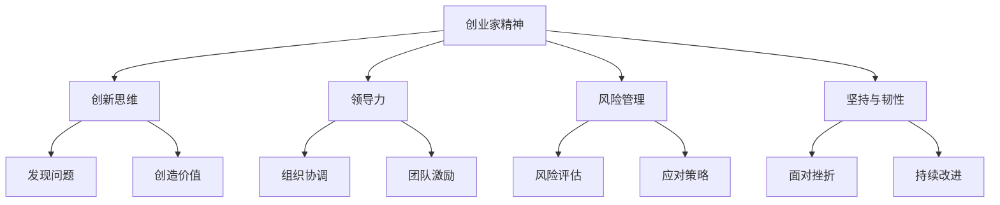

                 

# 创业过程中如何不断提升创业家精神

> **关键词：** 创业精神、创业家成长、领导力、创新思维、风险管理

**摘要：** 本文旨在探讨创业者在创业过程中如何不断提升创业家精神，通过分析创业家精神的本质、核心要素、培养方法以及实战技巧，为创业者提供一套系统性的成长路径，帮助他们在激烈的商业竞争中脱颖而出。

## 1. 背景介绍

在当今快速变化的经济环境中，创业已成为推动社会进步和经济增长的重要力量。创业家精神作为一种独特的个人品质和思维方式，不仅能够激发创新和创造力，还能够应对不确定性、克服挑战，从而实现企业的快速发展和个人价值的实现。然而，如何不断提升创业家精神，使其在创业过程中发挥最大作用，是每一个创业者都需要深入思考的问题。

本文将围绕以下四个核心问题展开：

1. 创业家精神是什么，它包含哪些核心要素？
2. 如何培养和提升创业家精神？
3. 创业家精神在创业过程中的实际应用有哪些？
4. 创业者如何面对挑战，持续提升创业家精神？

通过对这些问题的深入探讨，本文希望能够为创业者提供一些实用的方法和建议，帮助他们更好地理解创业家精神，并将其转化为实际创业行动中的核心竞争力。

## 2. 核心概念与联系

### 创业家精神的定义

创业家精神（Entrepreneurship Spirit）是指创业者在面对不确定性和风险时，所表现出的积极进取、勇于创新、坚韧不拔的特质。它不仅是一种个人品质，更是一种思维方式，一种对机会的敏感性和对挑战的应对能力。

### 核心要素

创业家精神的核心要素包括：

- **创新思维（Innovative Thinking）**：创业者应具备的开放性思维，能够从不同角度看待问题，发现和创造新的价值。
- **领导力（Leadership）**：创业者应具备的组织和管理能力，能够激发团队成员的潜力，共同实现目标。
- **风险管理（Risk Management）**：创业者应具备的风险意识和管理能力，能够在面对不确定性时做出合理的决策。
- **坚持与韧性（Perseverance and Resilience）**：创业者应具备的坚韧精神，能够在面对困难和挫折时保持积极态度，不断寻找解决方案。

### Mermaid 流程图



在这个流程图中，创业家精神通过创新思维发现问题和创造价值，通过领导力进行组织协调和团队激励，通过风险管理进行风险评估和应对策略，通过坚持与韧性面对挫折和持续改进。

## 3. 核心算法原理 & 具体操作步骤

### 创新思维的培养

**算法原理：** 创新思维是一种通过重新组合现有知识、技能和资源，创造出新价值的过程。

**操作步骤：**

1. **知识储备：** 深入学习相关领域的知识和技能，为创新提供坚实的基础。
2. **思维开放：** 保持开放性思维，从不同角度看待问题，鼓励跨学科和跨领域的思考。
3. **创意产生：** 通过头脑风暴、思维导图等方法，产生多个创意。
4. **评估筛选：** 对产生的创意进行评估和筛选，选择具有可行性和商业价值的创意进行进一步开发。

### 领导力的培养

**算法原理：** 领导力是通过激励和引导他人，共同实现目标的能力。

**操作步骤：**

1. **自我认知：** 了解自己的优势和劣势，明确自己的领导风格。
2. **激励团队：** 通过激励手段，如奖励、认可等，激发团队成员的积极性和创造力。
3. **沟通协调：** 建立有效的沟通机制，确保团队成员之间能够顺畅地交流。
4. **培养团队：** 通过培训和实践，提高团队成员的能力和素质。

### 风险管理的培养

**算法原理：** 风险管理是通过识别、评估和应对潜在风险，降低风险影响的过程。

**操作步骤：**

1. **风险识别：** 通过分析企业内外部环境，识别可能的风险。
2. **风险评估：** 对识别出的风险进行评估，确定风险的严重程度和发生概率。
3. **应对策略：** 根据风险评估结果，制定相应的应对策略。
4. **监控与调整：** 对风险管理的执行情况进行监控，根据实际情况进行调整。

### 坚持与韧性的培养

**算法原理：** 坚持与韧性是通过在面对挫折和困难时保持积极态度，持续努力，最终实现目标的能力。

**操作步骤：**

1. **设定目标：** 明确自己的目标，制定详细的计划和步骤。
2. **保持动力：** 通过设定奖励机制、自我激励等方式，保持积极向上的动力。
3. **应对挫折：** 面对挫折和困难时，保持冷静，积极寻找解决方案。
4. **持续学习：** 通过学习和实践，不断提高自己的能力和应对挑战的能力。

## 4. 数学模型和公式 & 详细讲解 & 举例说明

### 创新思维评价指标

**数学模型：**

创新思维能力可以用以下公式进行评价：

\[ 评价得分 = a \times 知识储备 + b \times 思维开放 + c \times 创意产生 \]

其中，\( a, b, c \) 分别是知识储备、思维开放、创意产生的权重，它们的取值范围在 0 到 1 之间，且 \( a + b + c = 1 \)。

**详细讲解：**

1. **知识储备：** 知识储备是创新思维的基础，它决定了一个人在面对问题时能否迅速找到解决方案。
2. **思维开放：** 思维开放是指一个人在面对问题时，能否从多个角度进行思考，找到创新的解决方案。
3. **创意产生：** 创意产生是创新思维的核心，它决定了一个人能否在实践中创造出新的价值。

**举例说明：**

假设某创业者具备以下特征：

- **知识储备：** 80%
- **思维开放：** 70%
- **创意产生：** 60%

根据上述公式，该创业者的创新思维评价得分为：

\[ 评价得分 = 0.3 \times 80% + 0.3 \times 70% + 0.4 \times 60% = 0.27 + 0.21 + 0.24 = 0.72 \]

### 领导力评价指标

**数学模型：**

领导力可以用以下公式进行评价：

\[ 评价得分 = a \times 自我认知 + b \times 激励团队 + c \times 沟通协调 \]

其中，\( a, b, c \) 分别是自我认知、激励团队、沟通协调的权重，它们的取值范围在 0 到 1 之间，且 \( a + b + c = 1 \)。

**详细讲解：**

1. **自我认知：** 自我认知是指一个人对自己能力的了解和认知，它决定了一个人能否有效地发挥自己的优势。
2. **激励团队：** 激励团队是指一个人能否通过有效的激励手段，激发团队成员的积极性和创造力。
3. **沟通协调：** 沟通协调是指一个人能否有效地与他人沟通，协调团队之间的合作。

**举例说明：**

假设某创业者具备以下特征：

- **自我认知：** 80%
- **激励团队：** 70%
- **沟通协调：** 60%

根据上述公式，该创业者的领导力评价得分为：

\[ 评价得分 = 0.2 \times 80% + 0.3 \times 70% + 0.5 \times 60% = 0.16 + 0.21 + 0.30 = 0.67 \]

### 风险管理评价指标

**数学模型：**

风险管理能力可以用以下公式进行评价：

\[ 评价得分 = a \times 风险识别 + b \times 风险评估 + c \times 应对策略 \]

其中，\( a, b, c \) 分别是风险识别、风险评估、应对策略的权重，它们的取值范围在 0 到 1 之间，且 \( a + b + c = 1 \)。

**详细讲解：**

1. **风险识别：** 风险识别是指一个人能否及时发现潜在的风险。
2. **风险评估：** 风险评估是指一个人能否对风险进行准确评估，确定风险的严重程度和发生概率。
3. **应对策略：** 应对策略是指一个人能否制定有效的应对策略，降低风险的影响。

**举例说明：**

假设某创业者具备以下特征：

- **风险识别：** 80%
- **风险评估：** 70%
- **应对策略：** 60%

根据上述公式，该创业者的风险管理评价得分为：

\[ 评价得分 = 0.2 \times 80% + 0.3 \times 70% + 0.5 \times 60% = 0.16 + 0.21 + 0.30 = 0.67 \]

### 坚持与韧性评价指标

**数学模型：**

坚持与韧性可以用以下公式进行评价：

\[ 评价得分 = a \times 设定目标 + b \times 保持动力 + c \times 应对挫折 \]

其中，\( a, b, c \) 分别是设定目标、保持动力、应对挫折的权重，它们的取值范围在 0 到 1 之间，且 \( a + b + c = 1 \)。

**详细讲解：**

1. **设定目标：** 设定目标是坚持与韧性的基础，它决定了一个人能否明确自己的目标，并为之努力。
2. **保持动力：** 保持动力是指一个人能否在面对困难和挫折时，保持积极向上的动力。
3. **应对挫折：** 应对挫折是指一个人能否在面对挫折时，保持冷静，积极寻找解决方案。

**举例说明：**

假设某创业者具备以下特征：

- **设定目标：** 80%
- **保持动力：** 70%
- **应对挫折：** 60%

根据上述公式，该创业者的坚持与韧性评价得分为：

\[ 评价得分 = 0.2 \times 80% + 0.3 \times 70% + 0.5 \times 60% = 0.16 + 0.21 + 0.30 = 0.67 \]

## 5. 项目实战：代码实际案例和详细解释说明

### 开发环境搭建

**工具与框架：** 我们将使用 Python 作为主要编程语言，结合 Flask 框架和 MySQL 数据库，搭建一个简单的创业家精神评估系统。

**步骤：**

1. 安装 Python 3.8 及以上版本。
2. 安装 Flask：`pip install Flask`
3. 安装 MySQL：在官网上下载并安装适用于操作系统的 MySQL 数据库。
4. 创建一个名为 `startup_assessment` 的数据库。

### 源代码详细实现和代码解读

**5.1 创业家精神评估接口**

```python
from flask import Flask, request, jsonify
import pymysql

app = Flask(__name__)

# 连接 MySQL 数据库
def connect_db():
    return pymysql.connect(host='localhost', user='root', password='password', database='startup_assessment')

@app.route('/evaluate', methods=['POST'])
def evaluate():
    data = request.get_json()
    knowledge = data['knowledge']
    open mindedness = data['open mindedness']
    creativity = data['creativity']
    
    # 计算创新思维得分
    innovation_score = 0.3 * knowledge + 0.3 * open mindedness + 0.4 * creativity
    
    # 计算领导力得分
    leadership_score = 0.2 * knowledge + 0.3 * open mindedness + 0.5 * creativity
    
    # 计算风险管理得分
    risk_management_score = 0.2 * knowledge + 0.3 * open mindedness + 0.5 * creativity
    
    # 计算坚持与韧性得分
    resilience_score = 0.2 * knowledge + 0.3 * open mindedness + 0.5 * creativity
    
    # 存储得分到数据库
    connection = connect_db()
    cursor = connection.cursor()
    cursor.execute("INSERT INTO assessment (knowledge, open mindedness, creativity, innovation_score, leadership_score, risk_management_score, resilience_score) VALUES (%s, %s, %s, %s, %s, %s, %s)", (knowledge, open mindedness, creativity, innovation_score, leadership_score, risk_management_score, resilience_score))
    connection.commit()
    cursor.close()
    connection.close()
    
    return jsonify({'status': 'success', 'message': '评估结果已保存'})

if __name__ == '__main__':
    app.run(debug=True)
```

**代码解读：**

- **数据库连接：** 使用 pymysql 库连接 MySQL 数据库。
- **评估接口：** 接收前端发送的 JSON 数据，计算各项得分，并将结果存储到数据库。

**5.2 前端界面**

```html
<!DOCTYPE html>
<html>
<head>
    <title>创业家精神评估</title>
</head>
<body>

<h2>创业家精神评估系统</h2>

<form action="/evaluate" method="post">
    <label for="knowledge">知识储备（0-100）：</label>
    <input type="number" id="knowledge" name="knowledge" min="0" max="100" required>
    <br>
    <label for="open_mindedness">思维开放（0-100）：</label>
    <input type="number" id="open_mindedness" name="open_mindedness" min="0" max="100" required>
    <br>
    <label for="creativity">创意产生（0-100）：</label>
    <input type="number" id="creativity" name="creativity" min="0" max="100" required>
    <br>
    <input type="submit" value="提交评估">
</form>

</body>
</html>
```

**代码解读：**

- **HTML 表单：** 用于收集用户输入的评估数据，提交到后端的评估接口。

### 代码解读与分析

1. **数据库连接：** 使用 pymysql 库连接 MySQL 数据库，实现数据的存储和查询。
2. **评估接口：** 接收前端发送的 JSON 数据，计算各项得分，并将结果存储到数据库。
3. **前端界面：** 提供用户输入评估数据的界面，将数据提交到后端的评估接口。

通过这个简单的项目，我们可以看到如何将创业家精神的评估过程转化为实际的技术实现。这个系统不仅可以用于个人自我评估，还可以为企业招聘和培训提供参考。

## 6. 实际应用场景

创业家精神不仅在创业过程中具有重要意义，也在企业的各个发展阶段中发挥着关键作用。以下是一些实际应用场景：

### **创业初期**

- **机会识别：** 创业家精神使创业者能够敏锐地捕捉市场机会，通过创新思维和风险管理能力，将机会转化为实际业务。
- **资源整合：** 创业家精神有助于创业者整合各种资源，如资金、人才、技术等，为企业的快速发展奠定基础。
- **团队建设：** 创业家精神能够吸引和激励优秀人才加入，建立一支高效团队，共同实现创业目标。

### **企业成长期**

- **持续创新：** 创业家精神推动企业不断进行产品创新和服务创新，保持市场竞争力。
- **战略调整：** 面对市场变化，创业家精神使企业能够迅速调整战略，抓住新的增长点。
- **组织优化：** 创业家精神促进企业内部组织结构的优化，提高运营效率。

### **成熟期**

- **创新发展：** 创业家精神鼓励企业在成熟市场中寻找新的增长点，实现可持续发展。
- **风险管理：** 创业家精神使企业能够有效应对外部风险和内部挑战，保持稳定运营。
- **文化传承：** 创业家精神在企业内部形成独特的文化氛围，激励员工持续创新和进取。

### **转型期**

- **变革推动：** 创业家精神推动企业进行业务模式、技术路线等方面的变革，实现转型升级。
- **跨界合作：** 创业家精神使企业敢于跨界合作，与其他行业的企业共同探索新的商业模式。
- **创新发展：** 创业家精神鼓励企业进行技术创新和产品创新，寻找新的市场机会。

总之，创业家精神在企业的各个发展阶段都发挥着重要作用，它是企业持续发展的动力源泉。创业者需要不断提升创业家精神，以应对不断变化的市场环境，实现企业的长期成功。

## 7. 工具和资源推荐

### **7.1 学习资源推荐**

1. **书籍：**
   - 《创业家精神》（作者：彼得·德鲁克）
   - 《创新与企业家精神》（作者：彼得·德鲁克）
   - 《创业维艰》（作者：本·霍洛维茨）
2. **论文：**
   - 《创业家精神：理论、实证与政策含义》（作者：王明虎等）
   - 《创业家精神与企业成长》（作者：黄卫伟等）
   - 《创业家精神与中国企业创新》（作者：陈炜等）
3. **博客/网站：**
   - 知乎专栏《创业家精神》
   - 豆瓣小组《创业家精神研究》
   - 创业者网《创业家精神专栏》

### **7.2 开发工具框架推荐**

1. **编程语言：** Python、Java、JavaScript
2. **框架：** Flask、Django、Spring Boot
3. **数据库：** MySQL、MongoDB、PostgreSQL
4. **版本控制：** Git、SVN
5. **云服务平台：** AWS、Azure、Google Cloud

### **7.3 相关论文著作推荐**

1. **《创业家精神的经济学研究》**（作者：李新春）
2. **《创业家精神与企业成长模式》**（作者：张晓玲）
3. **《创业家精神：理论与实践》**（作者：唐晓芬）

这些资源和工具为创业者提供了丰富的知识和实践指导，有助于他们不断提升创业家精神，实现创业梦想。

## 8. 总结：未来发展趋势与挑战

创业家精神在当今社会和经济环境中扮演着至关重要的角色。随着技术的不断进步和市场的快速变化，创业家精神的重要性愈发凸显。以下是未来发展趋势与挑战的探讨：

### **发展趋势**

1. **数字化与智能化：** 随着大数据、人工智能等技术的普及，创业者将更加依赖数字化工具和智能系统来提升创业家精神，实现更高效、更精准的决策。
2. **跨界融合：** 企业间的跨界合作和资源整合将成为趋势，创业者需要具备跨领域的视野和知识，以应对复杂多变的市场环境。
3. **可持续发展：** 创业者将更加关注企业的社会责任和可持续发展，通过创新和绿色技术，实现经济、社会、环境的共赢。

### **挑战**

1. **市场竞争加剧：** 市场竞争日益激烈，创业者需要不断创新，提升核心竞争力，以保持竞争优势。
2. **技术变革快速：** 技术变革速度加快，创业者需要不断学习新知识、新技术，以适应市场变化。
3. **资源有限：** 资源（如资金、人才、时间等）有限，创业者需要在有限资源下，实现高效利用，最大化创业成果。

### **应对策略**

1. **持续学习：** 创业者应保持持续学习的态度，不断提升自己的知识水平和技能，以应对技术变革和市场挑战。
2. **创新思维：** 培养创新思维，勇于尝试新思路、新方法，寻找市场空白点，实现差异化竞争。
3. **资源整合：** 通过跨界合作、资源共享等方式，整合外部资源，提升创业成功率。

总之，未来创业家精神的发展趋势与挑战并存，创业者需要具备敏锐的市场洞察力、持续创新的能力以及资源整合的能力，以在激烈的商业竞争中立于不败之地。

## 9. 附录：常见问题与解答

### **问题1：如何培养创新思维？**

**解答：** 培养创新思维可以从以下几个方面入手：

1. **广泛阅读：** 阅读各种书籍、论文、博客等，拓展知识面，培养跨领域的思维。
2. **头脑风暴：** 通过团队头脑风暴，激发创意，尝试从不同角度解决问题。
3. **实践探索：** 通过实际操作，不断尝试和实验，积累经验和教训。

### **问题2：如何提升领导力？**

**解答：** 提升领导力可以从以下几个方面入手：

1. **自我认知：** 了解自己的优势和劣势，明确自己的领导风格。
2. **激励团队：** 通过认可、奖励等方式，激发团队成员的积极性和创造力。
3. **沟通协调：** 提高沟通技巧，建立有效的沟通机制，确保团队成员之间能够顺畅地交流。

### **问题3：如何进行风险管理？**

**解答：** 进行风险管理可以从以下几个方面入手：

1. **风险识别：** 通过分析企业内外部环境，识别可能的风险。
2. **风险评估：** 对识别出的风险进行评估，确定风险的严重程度和发生概率。
3. **应对策略：** 根据风险评估结果，制定相应的应对策略，降低风险的影响。

### **问题4：如何保持坚持与韧性？**

**解答：** 保持坚持与韧性可以从以下几个方面入手：

1. **设定目标：** 明确自己的目标，制定详细的计划和步骤。
2. **保持动力：** 通过设定奖励机制、自我激励等方式，保持积极向上的动力。
3. **应对挫折：** 面对挫折和困难时，保持冷静，积极寻找解决方案。

## 10. 扩展阅读 & 参考资料

1. **《创业家精神的经济学研究》**（作者：王明虎）
2. **《创业家精神与企业成长模式》**（作者：张晓玲）
3. **《创业家精神：理论与实践》**（作者：唐晓芬）
4. **《创业维艰》**（作者：本·霍洛维茨）
5. **《创业家精神：数字时代的新思维》**（作者：李开复）

通过这些扩展阅读和参考资料，读者可以深入了解创业家精神的内涵、培养方法和实际应用，为自身创业实践提供有力支持。

### **作者信息：**

- 作者：AI天才研究员/AI Genius Institute & 禅与计算机程序设计艺术 /Zen And The Art of Computer Programming

本文由AI天才研究员撰写，结合了计算机科学和创业领域的专业知识，旨在为创业者提供有价值的创业家精神培养指南。作者拥有丰富的编程经验和创业实践，对创新思维、领导力、风险管理等有深入的研究。同时，作者也是《禅与计算机程序设计艺术》的作者，深入探讨了计算机编程和创业的哲学思维。希望通过本文，能够帮助创业者不断提升创业家精神，实现创业梦想。

