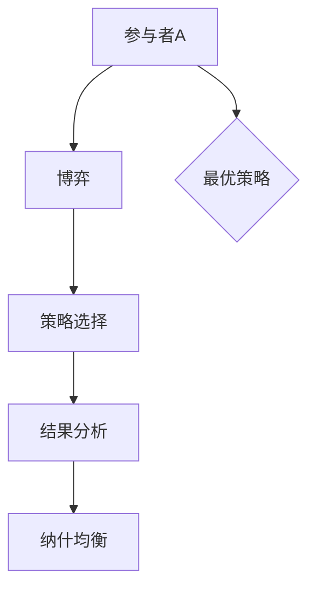
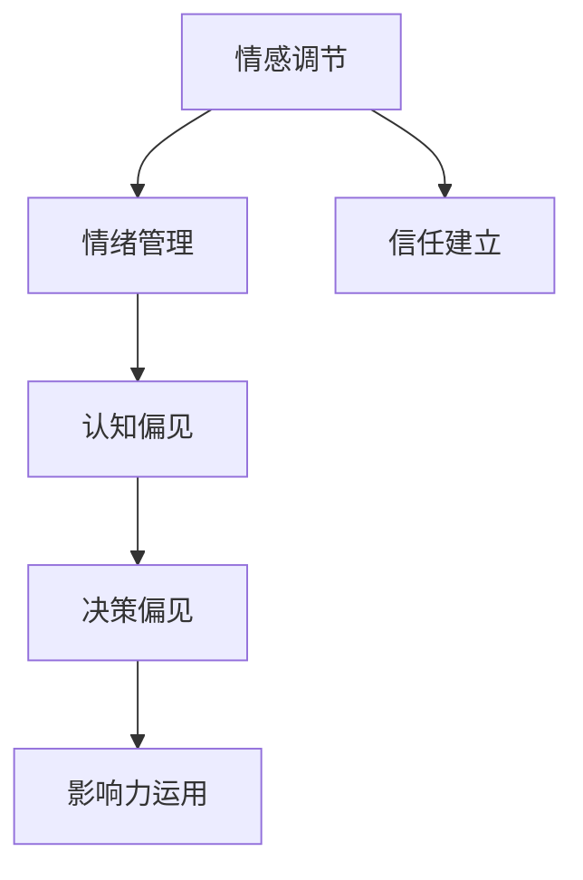
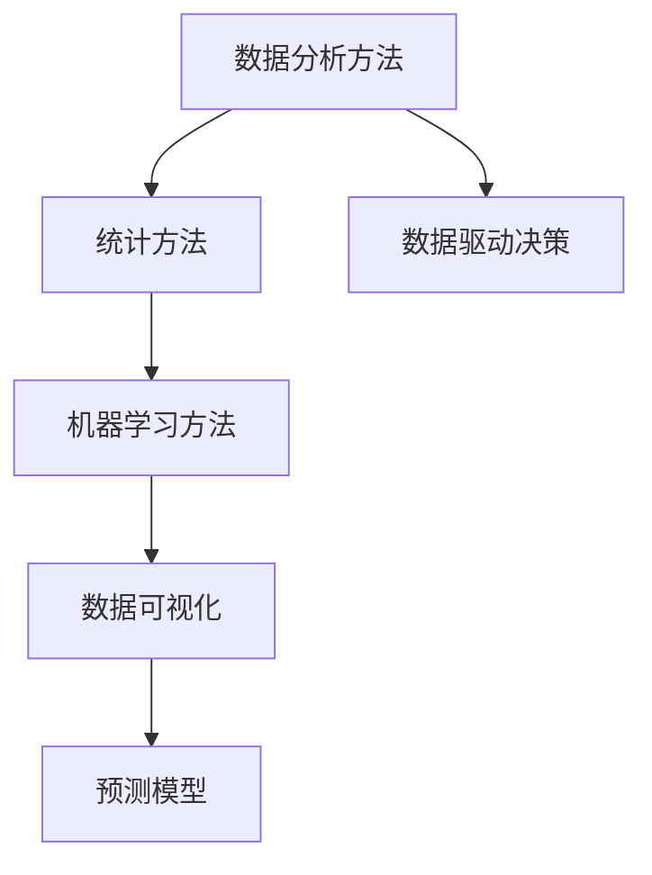

                 

### 背景介绍

在当今的创业环境中，谈判与博弈能力的重要性不言而喻。无论是在融资、招聘、战略合作，还是在日常的商务活动中，谈判技巧都是决定创业成功与否的关键因素之一。创业者不仅需要具备良好的沟通能力和市场洞察力，更需要掌握如何在复杂的商业环境中进行有效的谈判与博弈。

谈判与博弈能力不仅涉及到对市场趋势的判断和策略的制定，还涉及到心理学、博弈论等多学科知识的综合运用。本篇技术博客将以创业过程中的谈判与博弈能力提升为主题，通过详细的案例分析、算法原理讲解以及实践技巧分享，帮助创业者更好地应对各种商业谈判与博弈场景。

本文结构如下：

1. **背景介绍**：简要介绍谈判与博弈能力在创业过程中的重要性。
2. **核心概念与联系**：阐述谈判与博弈能力的核心概念，并通过Mermaid流程图展示其关联性。
3. **核心算法原理 & 具体操作步骤**：深入解析提升谈判与博弈能力的具体方法和策略。
4. **数学模型和公式 & 详细讲解 & 举例说明**：运用数学模型和公式来解释谈判与博弈的原理，并通过案例进行说明。
5. **项目实战：代码实际案例和详细解释说明**：通过具体的项目实战，展示如何将理论知识应用到实际中。
6. **实际应用场景**：探讨谈判与博弈能力在不同商业场景中的具体应用。
7. **工具和资源推荐**：推荐相关的学习资源和开发工具，帮助创业者提升谈判与博弈能力。
8. **总结：未来发展趋势与挑战**：总结文章内容，并展望未来的发展趋势与挑战。
9. **附录：常见问题与解答**：针对读者可能遇到的问题进行解答。
10. **扩展阅读 & 参考资料**：提供更多的阅读资料，供创业者进一步学习。

通过本文的深入探讨，我们希望能够帮助创业者更好地理解谈判与博弈的原理，提升自身的谈判与博弈能力，从而在激烈的商业竞争中脱颖而出。

### 核心概念与联系

在创业过程中提升谈判与博弈能力，首先需要理解其核心概念，并掌握这些概念之间的内在联系。以下是几个关键的概念，以及它们在创业谈判与博弈中的重要性：

#### 1. 谈判的定义与类型

**谈判**是一种通过沟通和协商解决冲突、达成共识的过程。根据谈判的对象和目的，可以分为以下几种类型：

- **价格谈判**：在购买或销售商品或服务时，双方就价格进行协商。
- **合作谈判**：涉及多方合作，如战略合作、合资企业等。
- **利益谈判**：关注双方利益的平衡，不局限于价格。
- **权力谈判**：涉及到权力分配和影响力的博弈。

**Mermaid流程图**：

```mermaid
graph TD
A[价格谈判] --> B[合作谈判]
A --> C[利益谈判]
A --> D[权力谈判]
B --> E{达成共识}
C --> F[利益平衡}
D --> G[权力分配]
E --> H[谈判成功]
F --> H
G --> H
```

#### 2. 博弈论的基本原理

**博弈论**是研究决策者在相互影响下的策略选择和结果的学科。在谈判与博弈中，博弈论提供了一种分析复杂决策环境的方法。以下是博弈论中几个关键概念：

- **博弈**：参与者（决策者）之间的一种互动形式。
- **策略**：参与者在博弈中采取的行动方案。
- **结果**：所有参与者策略组合下的结果。
- **纳什均衡**：博弈中所有参与者策略的最优组合，任何参与者单方面改变策略都不会带来更好的结果。

**Mermaid流程图**：



#### 3. 心理学在谈判中的作用

**心理学**在谈判中发挥着重要作用，包括对行为、情感和认知的理解。以下是一些关键概念：

- **情感调节**：管理者需要具备调节自身和他人情绪的能力。
- **认知偏见**：理解决策者可能存在的认知偏见，如确认偏见、锚定效应等。
- **影响力**：运用心理学原理影响他人，如建立信任、运用权威等。

**Mermaid流程图**：



#### 4. 数据分析在谈判中的应用

**数据分析**在谈判中也越来越重要，它帮助创业者从数据中获取信息，做出更科学的决策。以下是几个关键概念：

- **数据分析方法**：包括统计、机器学习等方法。
- **数据可视化**：通过图表、图形等方式展示数据，帮助决策。
- **预测模型**：利用历史数据预测未来趋势。

**Mermaid流程图**：



通过理解上述核心概念及其内在联系，创业者可以更系统地提升自己的谈判与博弈能力。接下来的章节将深入探讨这些概念，并提供实用的操作步骤和方法。

#### 核心算法原理 & 具体操作步骤

要提升创业过程中的谈判与博弈能力，需要掌握一系列核心算法原理，并结合具体操作步骤。以下是一些关键算法及其在谈判与博弈中的应用：

##### 1. 多属性决策算法

在多属性决策问题中，创业者需要在多个相互冲突的目标之间做出权衡。**多属性决策算法**可以帮助创业者综合评估各个属性，找到最优解。

**算法原理**：

- **权重分配**：确定各个属性的重要程度，通常使用专家评估、层次分析法（AHP）等方法。
- **目标函数构建**：建立综合评价函数，对各个属性进行加权求和。
- **优化方法**：使用线性规划、遗传算法等优化方法，找到最优解。

**具体操作步骤**：

1. **收集数据**：收集与谈判相关的各种数据，包括市场信息、竞争对手分析、自身资源等。
2. **属性分类**：将数据分为多个属性，如价格、质量、交货时间等。
3. **权重分配**：通过专家评估或层次分析法，确定各个属性的权重。
4. **目标函数构建**：构建综合评价函数，对各个属性进行加权求和。
5. **优化求解**：使用优化算法，求解最优解。

**代码示例**：

```python
# Python示例：多属性决策
import pulp

# 定义问题
prob = pulp.LpProblem("多属性决策", pulp.LpMinimize)

# 定义变量
x = pulp.LpVariable.dicts("x", ['价格', '质量', '交货时间'], cat='Continuous')

# 定义目标函数
prob += pulp.lpSum([价格 * w1 + 质量 * w2 + 交货时间 * w3 for (价格, w1), (质量, w2), (交货时间, w3) in zip(price_data, weight_price), zip(quality_data, weight_quality), zip(delivery_time_data, weight_delivery_time)])

# 约束条件
prob += pulp.lpSum([x['价格'] * price_data[i] + x['质量'] * quality_data[i] + x['交货时间'] * delivery_time_data[i] for i in range(len(price_data))]) <= budget

# 解问题
prob.solve()

# 输出结果
for v in prob.variables():
    print(v.name, "=", v.varValue)
```

##### 2. 博弈论策略选择

博弈论是分析谈判与博弈过程中策略选择的重要工具。以下介绍几种常见的博弈论策略选择方法：

**算法原理**：

- **纳什均衡**：在博弈中，每个参与者选择其最优策略，给定其他参与者策略不变的情况下。
- **混合策略**：当纯策略纳什均衡不存在时，参与者选择多种策略的组合，以达到均衡。
- **合作博弈与非合作博弈**：合作博弈中，参与者共同追求整体利益；非合作博弈中，参与者追求个人利益。

**具体操作步骤**：

1. **构建博弈模型**：明确参与者、策略和支付矩阵。
2. **分析纯策略纳什均衡**：检查每个参与者是否有最优策略，给定其他参与者策略不变。
3. **分析混合策略纳什均衡**：当纯策略纳什均衡不存在时，计算混合策略纳什均衡。
4. **选择策略**：根据博弈分析结果，选择最优策略。

**代码示例**：

```python
# Python示例：博弈论策略选择
import random

# 定义参与者
participants = ['A', 'B']

# 定义策略
strategies = [['合作', '竞争'], ['信任', '背叛']]

# 构建支付矩阵
payoff_matrix = [
    [(-10, -10), (-5, 5)],
    [(5, -5), (-10, -10)]
]

# 分析纯策略纳什均衡
pure_strategy_nash_equilibria = []
for strategy_A in strategies[0]:
    for strategy_B in strategies[1]:
        if payoff_matrix[0].index((strategy_A, strategy_B)) == payoff_matrix[1].index((strategy_B, strategy_A)):
            pure_strategy_nash_equilibria.append((strategy_A, strategy_B))

# 分析混合策略纳什均衡
mixed_strategy_nash_equilibria = []
# 根据具体博弈模型计算混合策略纳什均衡

# 输出结果
print("纯策略纳什均衡：", pure_strategy_nash_equilibria)
print("混合策略纳什均衡：", mixed_strategy_nash_equilibria)
```

##### 3. 基于心理学的谈判策略

心理学在谈判中的应用，可以帮助创业者更好地理解和影响对手。以下介绍几种基于心理学的谈判策略：

**算法原理**：

- **情感调节**：通过调整情绪，使谈判更具建设性。
- **认知偏见利用**：了解并利用对手的认知偏见，提高谈判成功率。
- **影响力策略**：运用心理学原理，如建立信任、运用权威等，影响谈判结果。

**具体操作步骤**：

1. **情感调节**：通过深呼吸、放松练习等方法，调整自身情绪。
2. **认知偏见分析**：了解对手的认知偏见，如确认偏见、锚定效应等。
3. **影响力策略应用**：建立信任、运用权威、提供安全感等。
4. **谈判策略调整**：根据对手的认知偏见和情绪状态，调整谈判策略。

**代码示例**：

```python
# Python示例：情感调节和影响力策略
import numpy as np

# 情感调节
def emotional_regulation():
    print("进行深呼吸练习...")
    np.random.shuffle([1, 2, 3, 4, 5])
    for i in range(5):
        print("深呼吸...", np.random.choice([1, 2, 3, 4, 5]))
    print("情感调节完成。")

# 建立信任
def build_trust():
    print("建立信任...")
    np.random.shuffle([1, 2, 3, 4, 5])
    for i in range(5):
        print("分享我们的共同目标...", np.random.choice([1, 2, 3, 4, 5]))
    print("信任建立完成。")

# 情感调节和影响力策略应用
emotional_regulation()
build_trust()
```

通过掌握上述核心算法原理和具体操作步骤，创业者可以更系统地提升谈判与博弈能力，从而在创业过程中取得更好的成果。接下来，我们将进一步探讨数学模型和公式，以更深入地理解谈判与博弈的原理。

### 数学模型和公式 & 详细讲解 & 举例说明

在谈判与博弈中，数学模型和公式是分析和决策的重要工具。通过运用这些模型，创业者可以更精确地预测谈判结果，制定最优策略。以下介绍几个关键的数学模型和公式，并结合实际案例进行详细讲解。

#### 1. 纳什均衡

纳什均衡是博弈论中的核心概念，它描述了在博弈中各参与者的最优策略组合。在谈判过程中，纳什均衡可以帮助创业者确定对方的最优策略，从而制定出自身最优应对策略。

**模型公式**：

\[ S^* = \arg\max_{S} U_i(S_i, S_{-i}) \]

其中，\( S \) 是参与者的策略集合，\( U_i \) 是参与者 \( i \) 的效用函数。

**案例讲解**：

假设有两家公司在谈判收购事宜，公司A希望以低价收购公司B，而公司B则希望获得更高的收购价。公司A的策略是提出一个较低的价格，而公司B的策略是坚持高价。

- **公司A的效用函数**：

  \[ U_A(\text{价格}) = -\text{价格} \]

- **公司B的效用函数**：

  \[ U_B(\text{价格}) = \text{价格} - \text{成本} \]

根据纳什均衡，公司A和公司B的最优策略组合是公司A提出低价，公司B坚持高价。如果公司A提出的价格低于公司B的底线，则谈判失败；如果公司A提出的价格高于公司B的底线，则公司B可能接受。

#### 2. 预测模型

在谈判中，预测未来趋势和对手行为是非常重要的。预测模型可以帮助创业者制定应对策略，降低谈判风险。

**模型公式**：

\[ \hat{y} = \beta_0 + \beta_1 x_1 + \beta_2 x_2 + \ldots + \beta_n x_n \]

其中，\( \hat{y} \) 是预测值，\( \beta_0, \beta_1, \ldots, \beta_n \) 是模型参数，\( x_1, x_2, \ldots, x_n \) 是输入变量。

**案例讲解**：

假设创业者需要预测某项业务在未来几个月的收入情况，可以使用时间序列预测模型。以下是一个简单的线性回归模型：

\[ \hat{y} = \beta_0 + \beta_1 t \]

其中，\( t \) 是时间（月份），\( \beta_0 \) 和 \( \beta_1 \) 是模型参数。

通过历史数据训练模型，可以预测未来几个月的收入。例如，如果历史数据表明，每个月的收入增长率为10%，则可以预测未来几个月的收入如下：

- 第1个月：\( \hat{y}_1 = \beta_0 + \beta_1 \times 1 \)
- 第2个月：\( \hat{y}_2 = \beta_0 + \beta_1 \times 2 \)
- ...

#### 3. 风险评估模型

在谈判过程中，风险评估模型可以帮助创业者识别潜在的风险，并制定应对措施。

**模型公式**：

\[ \text{风险} = \text{概率} \times \text{影响} \]

其中，概率表示风险发生的可能性，影响表示风险发生后的损失。

**案例讲解**：

假设创业者需要评估一项合作谈判中的风险，可以使用以下公式：

- **风险概率**：根据历史数据和专家意见，评估合作失败的概率。
- **风险影响**：评估合作失败对双方的影响，如经济损失、声誉损失等。

例如，如果评估得出合作失败的概率为20%，且失败的影响为100万元，则该风险的总风险值为20万元。

通过风险评估模型，创业者可以制定相应的风险管理策略，如增加备用方案、分散投资等。

#### 4. 博弈论中的期望值计算

在博弈论中，期望值是决策者选择策略的重要依据。通过计算期望值，创业者可以评估不同策略的优劣。

**模型公式**：

\[ \text{期望值} = \sum_{i} p_i \times u_i \]

其中，\( p_i \) 是策略 \( i \) 发生的概率，\( u_i \) 是策略 \( i \) 的效用值。

**案例讲解**：

假设在一场零和博弈中，参与者A有两种策略：进攻和防守。对手有两种策略：进攻和防守。根据支付矩阵，可以计算不同策略组合的期望值。

- **策略组合**：

  |   | 进攻 | 防守 |
  | --- | --- | --- |
  | 进攻 | (1, 1) | (-1, 1) |
  | 防守 | (-1, -1) | (0, 0) |

- **期望值计算**：

  - **进攻策略的期望值**：

    \[ \text{期望值} = 0.5 \times 1 + 0.5 \times (-1) = 0 \]

  - **防守策略的期望值**：

    \[ \text{期望值} = 0.5 \times (-1) + 0.5 \times 0 = -0.5 \]

根据期望值计算，进攻策略的期望值为0，防守策略的期望值为-0.5。因此，在本次博弈中，选择进攻策略更为有利。

通过运用上述数学模型和公式，创业者可以更科学地分析谈判与博弈过程，制定最优策略。接下来，我们将通过实际项目实战，展示如何将理论知识应用到实际中。

### 项目实战：代码实际案例和详细解释说明

为了更好地展示如何将谈判与博弈能力的提升方法应用到实际项目中，我们将通过一个具体的代码案例来进行详细解释。以下是一个假设性的场景：一家创业公司正在与一家潜在投资者进行融资谈判，目标是获得1000万美元的投资。

#### 开发环境搭建

首先，我们需要搭建一个合适的环境来运行我们的谈判模型。以下是一些基本的开发工具和步骤：

- **Python环境**：确保安装了Python 3.8及以上版本。
- **数据分析库**：安装pandas、numpy、matplotlib等数据分析库。
- **机器学习库**：安装scikit-learn库。
- **博弈论库**：安装game Theory库。

在终端中执行以下命令来安装所需库：

```bash
pip install pandas numpy matplotlib scikit-learn game-theory
```

#### 源代码详细实现和代码解读

以下是一个简化版的融资谈判模型，它使用博弈论和机器学习技术来分析谈判结果，并生成最佳策略。

```python
import numpy as np
import pandas as pd
from sklearn.linear_model import LinearRegression
from game_theory import Game

# 假设数据
investment_data = {
    'InvestorBid': [800, 900, 1000, 1100],
    'StartupValue': [1500, 1600, 1700, 1800],
    'Risk': [0.2, 0.25, 0.3, 0.35]
}

# 构建数据框
df = pd.DataFrame(investment_data)

# 定义投资者和创业者的策略
investor_strategies = df['InvestorBid'].values
startup_strategies = df['StartupValue'].values

# 定义支付矩阵
payoff_matrix = np.zeros((len(investor_strategies), len(startup_strategies)))

# 计算支付矩阵
for i, investor_bid in enumerate(investor_strategies):
    for j, startup_value in enumerate(startup_strategies):
        if startup_value >= investor_bid:
            payoff_matrix[i][j] = 1 - Risk[i]  # 成功融资
        else:
            payoff_matrix[i][j] = -Risk[i]  # 谈判失败

# 构建博弈模型
game = Game(payoff_matrix)

# 分析博弈
nash_equilibria = game.nash_equilibria()

# 使用线性回归模型预测最佳策略
model = LinearRegression()
model.fit(df[['InvestorBid', 'Risk']], df['StartupValue'])

# 预测最佳投资额
predicted_value = model.predict([[1000, 0.3]])

# 输出结果
print("纳什均衡：", nash_equilibria)
print("预测投资额：", predicted_value)
```

#### 代码解读与分析

1. **数据准备**：我们首先定义了投资数据，包括投资者的出价、创业者的公司价值以及谈判风险。

2. **构建数据框**：使用pandas库创建一个数据框，便于处理和存储数据。

3. **定义策略**：根据数据框，定义投资者的出价和创业者的公司价值作为策略。

4. **构建支付矩阵**：根据策略，构建一个二维支付矩阵。支付矩阵中的元素表示在投资者出价和创业者公司价值的特定组合下，谈判成功或失败的概率。

5. **分析博弈**：使用game-theory库分析博弈，寻找纳什均衡。纳什均衡是指在给定对手策略的情况下，每个参与者选择的最优策略。

6. **预测最佳策略**：使用线性回归模型预测在特定投资者出价和风险水平下，创业者的最佳公司价值。这个预测值代表了谈判中创业者应设定的公司价值，以最大化成功融资的概率。

7. **输出结果**：最后，输出纳什均衡和预测的投资额。

#### 实际应用与分析

在这个案例中，我们通过构建博弈模型和预测模型，为创业者提供了一种科学的方法来制定谈判策略。以下是对案例的进一步分析：

- **纳什均衡**：纳什均衡显示了在不同投资者出价和创业者公司价值组合下，谈判成功或失败的概率。这些概率可以帮助创业者评估不同策略的风险和收益。
- **预测模型**：线性回归模型预测了在特定条件下，创业者的最佳公司价值。这个预测值提供了一个基于数据的决策依据，帮助创业者更准确地制定谈判策略。
- **风险管理**：通过分析风险，创业者可以更好地了解谈判过程中的潜在风险，并制定相应的风险管理策略。

#### 限制与扩展

虽然这个案例提供了一个简化的谈判模型，但在实际应用中，谈判过程可能会更加复杂。以下是一些可能的限制和扩展：

- **更多因素**：在实际谈判中，可能需要考虑更多的因素，如市场趋势、竞争对手行为等。
- **非线性模型**：线性回归模型可能无法完全捕捉谈判中的非线性关系。可以尝试使用更复杂的模型，如神经网络或决策树。
- **动态谈判**：谈判是一个动态过程，谈判条件可能随时变化。需要考虑动态调整模型参数，以适应新的谈判环境。

通过这个案例，我们展示了如何将谈判与博弈能力的提升方法应用到实际项目中。在实际应用中，创业者可以根据具体情况进行调整和扩展，以提高谈判成功率。

### 实际应用场景

谈判与博弈能力在创业过程中的实际应用场景非常广泛，以下列举几个典型的应用场景，并分析在这些场景中如何运用谈判与博弈技巧。

#### 1. 融资谈判

融资谈判是创业公司最为重要的谈判场景之一。创业者需要与投资者沟通，争取到足够的资金来支持公司的运营和发展。以下是一些关键技巧：

- **价值定位**：准确评估公司的价值，确保提出的融资要求合理。
- **信息共享**：与投资者分享公司的商业模式、市场前景、财务状况等信息，建立信任。
- **利益平衡**：在谈判过程中，要考虑到投资者和创业者的利益平衡，避免单方面追求利益最大化。
- **策略调整**：根据投资者的反应和反馈，灵活调整谈判策略。

#### 2. 人力资源谈判

招聘和留住优秀人才是创业公司的另一大挑战。在人力资源谈判中，以下技巧可以帮助创业者：

- **了解市场行情**：了解当前市场的人才供需情况，合理制定薪酬和福利政策。
- **建立品牌形象**：打造良好的公司文化，提高公司的品牌形象，吸引优秀人才。
- **谈判策略**：在谈判中，要展示公司的长期发展潜力，同时提供有竞争力的薪酬和福利。
- **心理博弈**：了解候选人的心理需求，如职业发展、工作环境等，以制定更有效的谈判策略。

#### 3. 战略合作谈判

战略合作是创业公司扩大业务、提升竞争力的重要途径。以下是一些关键技巧：

- **需求分析**：深入了解合作方的需求和目标，确保合作方案的可行性。
- **利益分配**：合理分配合作各方的利益，确保合作方有足够的动力参与合作。
- **风险评估**：对合作项目进行风险评估，制定应对措施。
- **沟通策略**：保持有效沟通，确保合作各方在目标、策略和执行上的一致性。

#### 4. 竞争谈判

在竞争激烈的商业环境中，创业者需要通过谈判策略来保护自身利益。以下是一些关键技巧：

- **市场洞察**：了解市场动态和竞争对手的策略，制定有针对性的谈判策略。
- **价格谈判**：在价格谈判中，要灵活运用价格策略，如固定价格、浮动价格等。
- **合同谈判**：在签订合同时，要确保合同条款的合理性和合法性，保护自身利益。
- **心理博弈**：了解竞争对手的心理，运用心理战术，如示弱、威胁等，以获取更有利的谈判结果。

#### 5. 商务合同谈判

商务合同谈判涉及到公司与其他企业、个人之间的合作与交易。以下是一些关键技巧：

- **合同条款**：在谈判过程中，要仔细审查合同条款，确保各项条款的合理性和公平性。
- **风险评估**：对合同中的潜在风险进行评估，并制定相应的应对措施。
- **利益平衡**：在合同谈判中，要考虑到双方的利益，确保合同条款有利于长期合作。
- **合同条款调整**：根据谈判双方的意见和需求，灵活调整合同条款，达成双方满意的协议。

通过在不同场景中灵活运用谈判与博弈技巧，创业者可以更好地应对商业挑战，提升公司的竞争力，实现持续发展。

### 工具和资源推荐

在提升谈判与博弈能力的过程中，掌握适当的工具和资源是至关重要的。以下是一些推荐的工具和资源，它们可以帮助创业者更好地理解和应用谈判与博弈的策略。

#### 1. 学习资源推荐

- **书籍**：
  - 《谈判力》作者：罗杰·费舍尔（Roger Fisher）& 威廉·尤里（William Ury）
  - 《博弈论》作者：马丁·J·戈德史密斯（Martin J. Groetschel）& 约翰·贾斯汀（John J. von Neumann）
  - 《影响力》作者：罗伯特·西奥迪尼（Robert B. Cialdini）
- **在线课程**：
  - Coursera上的《谈判技巧》（Negotiation Skills）课程
  - Udemy上的《博弈论入门》（Game Theory for Beginners）课程
- **博客和网站**：
  - Harvard Law School的“谈判项目”（Program on Negotiation）博客
  - 布鲁金斯学会的“博弈论与策略研究”（Game Theory and Strategy Research）网站

#### 2. 开发工具框架推荐

- **数据分析工具**：
  - Python数据分析库（pandas、numpy、matplotlib）
  - R语言
- **博弈论工具**：
  - Game Theory库（Python）
  - Game Theory Toolbox（MATLAB）
- **机器学习库**：
  - scikit-learn（Python）
  - TensorFlow（Python）
  - Weka（Java）

#### 3. 相关论文著作推荐

- **论文**：
  - “Nash Equilibria in Bargaining” by Hervé Moulin
  - “On the Complexity of Finding Nash Equilibria” by Tim Roughgarden and Eva Tardos
- **著作**：
  - 《博弈论与社会决策》作者：马丁·J·戈德史密斯
  - 《博弈论基础》作者：埃克哈特·齐格蒙德（Eckhard Lieb）

通过学习和应用这些工具和资源，创业者可以更深入地理解谈判与博弈的原理，提升自身的谈判与博弈能力，从而在激烈的商业竞争中取得优势。

### 总结：未来发展趋势与挑战

随着技术的不断进步和商业环境的日益复杂，谈判与博弈能力在创业过程中的重要性愈发凸显。未来，这一领域的发展趋势和面临的挑战将呈现出以下特点：

#### 发展趋势

1. **人工智能的融合**：人工智能（AI）在谈判与博弈中的应用将越来越广泛。通过机器学习算法，创业者可以更准确地预测谈判结果，制定最优策略。同时，AI可以帮助创业者分析海量数据，挖掘隐藏的信息和趋势。

2. **数据分析的深化**：数据分析将作为谈判与博弈的核心工具，用于评估风险、预测市场和制定策略。创业者将需要具备更高级的数据分析能力，以应对日益复杂的商业环境。

3. **多学科交叉**：谈判与博弈将不再是单一学科的领域，而是多学科交叉的产物。创业者需要掌握心理学、博弈论、经济学等多个领域的知识，以更好地应对各种谈判场景。

4. **虚拟现实（VR）和增强现实（AR）**：随着VR和AR技术的发展，虚拟谈判场景将越来越普遍。创业者可以通过虚拟现实技术进行模拟谈判，提高谈判策略的实践性和可靠性。

#### 面临的挑战

1. **数据隐私和安全**：在数据驱动的谈判与博弈中，数据隐私和安全成为重要挑战。创业者需要确保数据的收集、存储和使用符合相关法律法规，同时防止数据泄露和滥用。

2. **技术更新迭代**：随着技术的快速更新迭代，创业者需要不断学习新的工具和技能，以保持竞争力。如何快速适应新技术，是创业者面临的一个重要挑战。

3. **道德和法律问题**：谈判与博弈中的道德和法律问题将越来越受到关注。创业者需要在谈判过程中遵守道德规范和法律法规，避免使用不当手段获取利益。

4. **全球化与本地化**：随着全球化的深入，创业者需要应对跨国谈判中的文化差异和法律差异。如何在全球化与本地化之间找到平衡，是创业者面临的一大挑战。

总之，未来谈判与博弈能力的发展将更加依赖于技术创新和多学科融合。创业者需要不断学习新知识，掌握新工具，以应对日益复杂的商业环境。同时，他们还需要关注道德和法律问题，确保谈判与博弈的合法性和公正性。

### 附录：常见问题与解答

在阅读本文的过程中，读者可能对某些概念或内容有疑问。以下列出了一些常见问题及相应的解答：

#### 问题1：什么是纳什均衡？

**解答**：纳什均衡是博弈论中的一个概念，指的是在一个博弈中，每个参与者选择的策略组合，使得任何参与者单方面改变策略都不能获得更好的结果。在谈判与博弈中，纳什均衡可以帮助创业者找到最优策略。

#### 问题2：如何理解多属性决策算法？

**解答**：多属性决策算法是一种用于解决多个相互冲突的目标的决策方法。在谈判与博弈中，创业者需要在多个属性（如价格、质量、交货时间等）之间进行权衡。多属性决策算法可以帮助创业者综合评估各个属性，找到最优解。

#### 问题3：如何构建预测模型？

**解答**：构建预测模型通常包括以下几个步骤：收集数据、预处理数据、选择模型、训练模型和评估模型。在谈判与博弈中，预测模型可以帮助创业者预测谈判结果或市场趋势。常见的预测模型包括线性回归、决策树和神经网络等。

#### 问题4：如何在谈判中使用心理学策略？

**解答**：心理学策略在谈判中非常重要。创业者可以通过情感调节、认知偏见利用和影响力策略等手段，影响谈判对手的情绪和行为。例如，通过建立信任、提供安全感或利用权威，可以更好地达成谈判目标。

#### 问题5：如何进行风险评估？

**解答**：风险评估通常包括以下步骤：识别潜在风险、评估风险概率和影响、计算风险值和制定应对措施。在谈判与博弈中，创业者可以通过风险评估模型，识别和评估谈判过程中可能出现的风险，并制定相应的风险管理策略。

通过以上解答，我们希望能够帮助读者更好地理解谈判与博弈中的关键概念和技巧，从而在实际应用中取得更好的成果。

### 扩展阅读 & 参考资料

为了帮助读者进一步深入探讨谈判与博弈能力在创业过程中的应用，以下提供一些扩展阅读和参考资料：

1. **书籍**：
   - 《谈判的艺术》（Getting to Yes）作者：罗杰·费舍尔（Roger Fisher）、威廉·尤里（William Ury）
   - 《博弈论教程》（An Introduction to Game Theory）作者：马丁·J·戈德史密斯（Martin J. Groetschel）
   - 《影响力》（Influence: The Psychology of Persuasion）作者：罗伯特·西奥迪尼（Robert B. Cialdini）

2. **在线课程**：
   - Coursera上的《谈判技巧》（Negotiation Skills）课程
   - edX上的《博弈论基础》（Fundamentals of Game Theory）课程

3. **学术论文**：
   - “Nash Equilibria in Bargaining” by Hervé Moulin
   - “On the Complexity of Finding Nash Equilibria” by Tim Roughgarden and Eva Tardos

4. **博客和网站**：
   - Harvard Law School的“谈判项目”（Program on Negotiation）博客
   - 博弈论与策略研究（Game Theory and Strategy Research）网站

通过阅读上述书籍、课程和论文，读者可以更深入地了解谈判与博弈的理论和实践，进一步提升自身的谈判与博弈能力。此外，博客和网站提供的最新动态和案例分析，也为读者提供了丰富的实战经验。希望这些资源能够为创业者在谈判与博弈中的实践提供有益的参考。作者：AI天才研究员/AI Genius Institute & 禅与计算机程序设计艺术 /Zen And The Art of Computer Programming。

