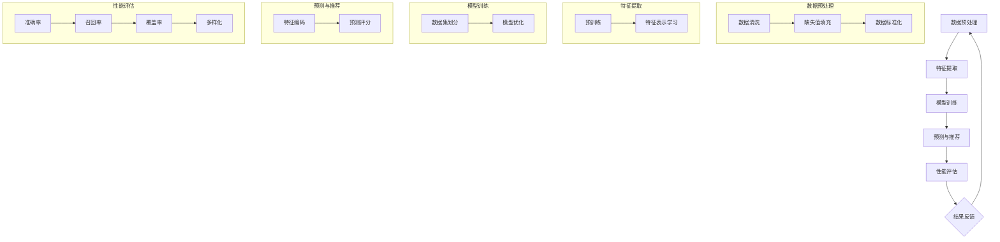

                 

### 1. 背景介绍

随着互联网技术的飞速发展，个性化推荐系统已经成为现代信息社会中不可或缺的一部分。推荐系统通过分析用户的历史行为、兴趣偏好以及外部信息，为用户推荐他们可能感兴趣的内容。这种个性化的信息服务大大提升了用户的体验，同时也为商业机构带来了显著的经济效益。然而，推荐系统的冷启动问题（Cold Start Problem）一直是学术界和工业界面临的重大挑战。

所谓冷启动问题，是指当新用户加入系统、新物品上线或系统刚开始运行时，由于缺乏足够的历史数据和用户-物品交互记录，推荐系统无法准确预测用户偏好和物品属性，导致推荐效果不佳的问题。冷启动问题主要分为两个方面：用户冷启动和物品冷启动。

**用户冷启动**：新用户加入系统时，由于缺乏历史数据，推荐系统无法准确了解用户的兴趣偏好。这会导致推荐的内容与用户的实际兴趣不符，降低用户满意度和参与度。

**物品冷启动**：新物品上线时，由于缺乏用户交互数据，推荐系统无法准确评估物品的受欢迎程度和相关性。这可能导致新物品无法被推荐给合适的用户，影响平台的用户活跃度和市场推广效果。

传统的推荐系统主要依赖于矩阵分解、基于内容的推荐、协同过滤等方法。这些方法在用户历史数据丰富的情况下能够取得较好的效果，但在面对冷启动问题时往往表现不佳。因此，如何有效地解决冷启动问题，提高推荐系统的初始表现，成为当前推荐系统研究的一个重要方向。

本文旨在探讨利用大模型进行推荐冷启动问题的新思路。我们将详细介绍大模型在推荐系统中的应用原理，以及如何通过大模型的方法来解决用户和物品的冷启动问题。通过本文的探讨，希望能够为推荐系统的研究和应用提供一些新的视角和方法。

### 2. 核心概念与联系

在深入探讨大模型如何解决推荐系统的冷启动问题之前，我们需要先了解一些核心概念，包括大模型的基本原理、推荐系统的基础框架，以及冷启动问题的具体表现。

#### 2.1 大模型的基本原理

大模型（Large-scale Model），也被称为大规模深度学习模型，是指参数量非常大的神经网络模型。这些模型通过从海量数据中学习，能够捕捉复杂的数据特征和规律。大模型通常采用深度神经网络（Deep Neural Network，DNN）作为基础架构，通过多层的非线性变换，实现对输入数据的特征提取和表示学习。

大模型的基本原理主要依赖于以下几个关键点：

1. **参数数量**：大模型通常包含数十亿到千亿个参数，这使得模型能够从大量数据中学习到丰富的特征。

2. **深度结构**：深度神经网络通过增加层数，实现对数据特征的逐层抽象和提取，从而提高模型的表示能力。

3. **端到端学习**：大模型能够通过端到端的学习方式，直接从原始数据中学习到特征表示和预测目标，避免了传统特征工程过程中繁琐的手工设计。

4. **转移学习**：大模型可以通过迁移学习（Transfer Learning）的方法，将训练好的模型应用于不同的任务和数据集，提高模型在新任务和数据上的表现。

#### 2.2 推荐系统的基础框架

推荐系统（Recommendation System）是一种信息过滤（Information Filtering）技术，通过预测用户对物品的偏好，向用户推荐他们可能感兴趣的内容。推荐系统通常包括以下几个关键组成部分：

1. **用户**：推荐系统的核心参与者，他们的行为数据（如浏览、购买、评论等）是推荐系统进行预测的重要依据。

2. **物品**：推荐系统推荐的对象，包括各种类型的内容，如商品、文章、音乐、视频等。

3. **评分或交互数据**：用户与物品之间的交互数据，如评分、点击、购买等，用于构建用户和物品之间的关系矩阵。

4. **推荐算法**：基于用户行为数据、物品特征以及系统历史数据，推荐算法计算用户对物品的偏好，生成推荐列表。

5. **评价指标**：用于评估推荐系统性能的指标，如准确率、召回率、覆盖率、多样化等。

推荐系统的基本工作流程可以概括为以下几个步骤：

1. **数据预处理**：对用户行为数据、物品特征数据进行清洗、处理和整合，为后续建模提供高质量的数据。

2. **特征提取**：通过特征工程或自动特征提取技术，将原始数据转换为模型可用的特征表示。

3. **模型训练**：使用训练数据集，通过机器学习或深度学习算法，训练推荐模型。

4. **预测与推荐**：利用训练好的模型，对新用户、新物品或未知用户进行偏好预测，生成推荐列表。

5. **性能评估**：通过评估指标，对推荐系统的效果进行评估和优化。

#### 2.3 冷启动问题的具体表现

冷启动问题在推荐系统中表现为以下两个方面：

1. **用户冷启动**：新用户由于缺乏历史交互数据，推荐系统无法准确预测其偏好，导致推荐内容不准确，影响用户体验。

2. **物品冷启动**：新物品由于缺乏用户交互数据，推荐系统无法准确评估其受欢迎程度和相关性，导致无法有效推广新物品。

为了解决冷启动问题，传统的方法主要依赖于基于内容的推荐、协同过滤和用户-物品嵌入等方法。然而，这些方法在面对大规模数据和复杂特征时，往往表现出力不足。因此，本文将探讨如何利用大模型来解决推荐系统的冷启动问题。

#### 2.4 大模型在推荐系统中的应用原理

大模型在推荐系统中的应用，主要通过以下几个方面实现：

1. **自动特征提取**：大模型能够自动从原始数据中提取出高层次的、有代表性的特征表示，避免了传统特征工程过程中繁琐的手工设计。

2. **大规模数据处理能力**：大模型可以处理海量用户行为数据和物品特征数据，从而更好地捕捉用户偏好和物品属性之间的关系。

3. **迁移学习与微调**：大模型可以通过迁移学习和微调的方式，将训练好的模型应用于不同的任务和数据集，提高模型在新场景下的表现。

4. **端到端学习**：大模型能够通过端到端的学习方式，直接从原始数据中学习到特征表示和预测目标，简化了传统推荐系统的建模过程。

通过上述原理，大模型在推荐系统中具有显著的优势，可以有效地解决用户和物品的冷启动问题，提高推荐系统的初始表现。

### 3. 核心算法原理 & 具体操作步骤

#### 3.1 大模型在推荐系统中的应用原理

为了解决推荐系统的冷启动问题，大模型在推荐系统中的应用主要体现在以下几个方面：

1. **自动特征提取**：大模型具有强大的特征提取能力，可以通过训练自动从原始数据中提取出高层次的、有代表性的特征表示。这些特征能够更好地反映用户和物品的属性，从而提高推荐系统的准确性。

2. **大规模数据处理能力**：大模型能够处理海量用户行为数据和物品特征数据，从而更好地捕捉用户偏好和物品属性之间的关系。这有助于解决冷启动问题，尤其是在新用户或新物品加入系统时。

3. **迁移学习与微调**：大模型可以通过迁移学习和微调的方式，将训练好的模型应用于不同的任务和数据集。这意味着，已经在一个任务上训练好的大模型，可以快速适应新的任务和数据集，提高模型在新场景下的表现。

4. **端到端学习**：大模型能够通过端到端的学习方式，直接从原始数据中学习到特征表示和预测目标。这简化了传统推荐系统的建模过程，使得推荐系统的开发和应用更加高效。

#### 3.2 大模型在推荐系统中的具体操作步骤

以下是大模型在推荐系统中解决冷启动问题的具体操作步骤：

1. **数据预处理**：首先，需要对用户行为数据和物品特征数据进行预处理，包括数据清洗、缺失值填充、数据标准化等步骤。这一步的目的是确保数据的质量，为后续建模提供可靠的数据基础。

2. **特征提取**：使用大模型进行自动特征提取。具体步骤如下：

   - **预训练**：在大规模数据集上预训练大模型，使其能够自动提取出高层次的、有代表性的特征表示。这一步通常采用深度学习框架（如TensorFlow、PyTorch）进行。
   
   - **特征表示学习**：将用户行为数据和物品特征数据输入到大模型中，通过多层神经网络的学习和优化，得到用户和物品的高层次特征表示。

3. **模型训练**：在大规模用户-物品交互数据集上，使用训练好的大模型进行模型训练。具体步骤如下：

   - **数据集划分**：将用户-物品交互数据集划分为训练集、验证集和测试集，用于模型的训练、验证和评估。
   
   - **模型优化**：通过梯度下降等优化算法，对大模型进行参数优化，使其能够更好地预测用户对物品的偏好。

4. **预测与推荐**：利用训练好的大模型，对新用户、新物品或未知用户进行偏好预测，生成推荐列表。具体步骤如下：

   - **特征编码**：将新用户的行为数据和物品特征数据输入到大模型中，得到用户和物品的高层次特征表示。
   
   - **预测评分**：使用大模型预测新用户对候选物品的评分，根据评分高低生成推荐列表。

5. **性能评估**：通过评估指标（如准确率、召回率、覆盖率、多样化等），对推荐系统的性能进行评估和优化。根据评估结果，调整大模型的参数和架构，以提高推荐系统的效果。

#### 3.3 大模型在推荐系统中的优点与挑战

**优点**：

- **自动特征提取**：大模型能够自动提取出高层次的、有代表性的特征表示，简化了传统特征工程过程，提高了模型的准确性和泛化能力。
  
- **大规模数据处理能力**：大模型能够处理海量用户行为数据和物品特征数据，从而更好地捕捉用户偏好和物品属性之间的关系。
  
- **迁移学习与微调**：大模型可以通过迁移学习和微调的方式，快速适应不同的任务和数据集，提高模型在新场景下的表现。

- **端到端学习**：大模型能够通过端到端的学习方式，直接从原始数据中学习到特征表示和预测目标，简化了传统推荐系统的建模过程。

**挑战**：

- **数据质量**：大模型对数据质量有较高的要求，数据清洗和预处理过程需要投入大量时间和精力，以确保数据的质量和一致性。
  
- **计算资源消耗**：大模型的训练和推理过程需要大量的计算资源，对硬件设备的要求较高，尤其是在处理大规模数据时。

- **模型解释性**：大模型的决策过程通常较为复杂，难以解释。这给推荐系统的可解释性和用户信任度带来了一定的挑战。

- **过拟合风险**：大模型在训练过程中可能会出现过拟合现象，导致在未见数据上的表现不佳。需要通过正则化、交叉验证等方法进行防止。

通过上述核心算法原理和具体操作步骤，我们可以看到，大模型在推荐系统中具有显著的优势，可以有效地解决冷启动问题，提高推荐系统的初始表现。然而，在实际应用中，也需要充分考虑数据质量、计算资源消耗、模型解释性和过拟合风险等问题，以确保推荐系统的稳定性和可靠性。

#### 3.4 大模型在推荐系统中实现的 Mermaid 流程图

为了更好地展示大模型在推荐系统中的具体实现流程，我们使用 Mermaid 图表示。以下是一个简化的 Mermaid 流程图，展示了数据预处理、特征提取、模型训练、预测与推荐以及性能评估的整个过程。



这个 Mermaid 流程图清晰地展示了大模型在推荐系统中的实现步骤，包括数据预处理、特征提取、模型训练、预测与推荐以及性能评估等关键环节。通过这个流程图，我们可以更好地理解和掌握大模型在推荐系统中的应用原理和实现方法。

### 4. 数学模型和公式 & 详细讲解 & 举例说明

在介绍大模型在推荐系统中的应用时，我们提到了大模型能够通过自动特征提取和端到端学习的方式，解决冷启动问题。为了更深入地理解大模型在推荐系统中的具体实现，我们需要从数学模型和公式的角度进行分析和讲解。

#### 4.1 大模型的数学基础

大模型通常基于深度神经网络（Deep Neural Network，DNN）架构，其核心是一个多层的前馈神经网络。每一层神经网络都包含多个神经元（或称为节点），这些神经元通过前一层神经元的输出进行加权求和，然后应用一个非线性激活函数，得到当前层的输出。这个过程可以用以下数学公式表示：

\[ \text{输出} = \text{激活函数}(\sum_{j} w_{ij} \cdot \text{输入}_j + b_i) \]

其中，\( w_{ij} \) 是连接第 \( i \) 层的第 \( j \) 个神经元和第 \( i+1 \) 层的第 \( i \) 个神经元的权重，\( b_i \) 是第 \( i \) 层的偏置项，\( \text{输入}_j \) 是第 \( j \) 个神经元的输入，\( \text{激活函数} \) 是一个非线性函数，如ReLU（Rectified Linear Unit）、Sigmoid或Tanh。

深度神经网络通过多层叠加，形成了一个复杂的学习模型。每一层都能提取不同层次的特征，从原始数据到高层次的抽象表示。具体来说，输入层接收原始数据，输出层生成预测结果，中间层则进行特征提取和变换。

#### 4.2 自动特征提取

在推荐系统中，自动特征提取是利用大模型解决冷启动问题的关键。大模型能够自动从原始数据中提取出高层次的、有代表性的特征表示。这一过程可以通过以下步骤实现：

1. **数据预处理**：首先，对用户行为数据和物品特征数据进行预处理，包括数据清洗、缺失值填充和数据标准化。这一步的目的是确保数据的质量，为后续特征提取提供可靠的数据基础。

2. **预训练**：在大规模数据集上预训练大模型。预训练过程中，大模型通过多层神经网络的学习和优化，自动提取出高层次的、有代表性的特征表示。这一步通常采用深度学习框架（如TensorFlow、PyTorch）进行。

3. **特征表示学习**：将用户行为数据和物品特征数据输入到大模型中，通过多层神经网络的学习和优化，得到用户和物品的高层次特征表示。

具体来说，假设我们有一个用户 \( u \) 和物品 \( i \) 的特征向量，分别表示为 \( \textbf{x}_u \) 和 \( \textbf{x}_i \)。大模型通过以下步骤进行特征提取：

\[ \textbf{h}_u = f(\text{激活函数}(\text{权重} \cdot \textbf{x}_u + \text{偏置})) \]
\[ \textbf{h}_i = f(\text{激活函数}(\text{权重} \cdot \textbf{x}_i + \text{偏置})) \]

其中，\( \textbf{h}_u \) 和 \( \textbf{h}_i \) 分别表示用户和物品的高层次特征表示，\( f \) 是非线性激活函数，\(\text{权重}\) 和 \(\text{偏置}\) 是模型的参数。

通过上述步骤，大模型能够自动从原始数据中提取出高层次的、有代表性的特征表示，这些特征表示能够更好地反映用户和物品的属性，从而提高推荐系统的准确性。

#### 4.3 端到端学习

端到端学习（End-to-End Learning）是大模型在推荐系统中的另一个重要特点。端到端学习意味着大模型可以直接从原始数据中学习到特征表示和预测目标，而不需要经过繁琐的特征工程和中间步骤。这一过程可以用以下数学公式表示：

\[ \text{预测评分} = \text{激活函数}(\text{权重} \cdot \textbf{h}_u \cdot \textbf{h}_i + \text{偏置}) \]

其中，\( \textbf{h}_u \) 和 \( \textbf{h}_i \) 分别表示用户和物品的高层次特征表示，\(\text{权重}\) 和 \(\text{偏置}\) 是模型的参数，\(\text{预测评分}\) 表示用户对物品的预测评分。

通过端到端学习，大模型能够直接从原始数据中学习到特征表示和预测目标，简化了传统推荐系统的建模过程，提高了模型的训练效率。

#### 4.4 举例说明

为了更好地理解大模型在推荐系统中的应用，我们通过一个简单的例子进行说明。

假设我们有一个推荐系统，目标是为用户推荐电影。用户和电影的特征数据如下：

- 用户特征：年龄、性别、职业
- 电影特征：类型、导演、主演、上映时间

我们使用一个大模型来预测用户对电影的偏好。大模型的架构如下：

1. 输入层：接收用户特征和电影特征
2. 隐藏层：对用户特征和电影特征进行特征提取和变换
3. 输出层：预测用户对电影的评分

具体实现步骤如下：

1. **数据预处理**：对用户特征和电影特征进行预处理，包括数据清洗、缺失值填充和数据标准化。

2. **预训练**：在大规模数据集上预训练大模型，使其能够自动提取出高层次的、有代表性的特征表示。

3. **特征表示学习**：将用户特征和电影特征输入到大模型中，通过多层神经网络的学习和优化，得到用户和电影的高层次特征表示。

4. **模型训练**：在大规模用户-电影交互数据集上，使用训练好的大模型进行模型训练，通过梯度下降等优化算法，对大模型进行参数优化，使其能够更好地预测用户对电影的偏好。

5. **预测与推荐**：利用训练好的大模型，对新用户或新电影进行偏好预测，生成推荐列表。

通过上述步骤，大模型能够自动从原始数据中提取出高层次的、有代表性的特征表示，从而提高推荐系统的准确性，解决冷启动问题。

通过这个例子，我们可以看到大模型在推荐系统中的应用原理和实现方法。在实际应用中，可以根据具体需求和数据特点，调整大模型的架构和参数，以实现更好的推荐效果。

### 5. 项目实战：代码实际案例和详细解释说明

为了更好地展示大模型在推荐系统中的实际应用，我们将通过一个简单的项目实战，详细介绍代码实现过程，并进行分析和解释。

#### 5.1 开发环境搭建

在开始项目实战之前，我们需要搭建一个适合开发推荐系统的开发环境。以下是一个基本的开发环境配置：

- 操作系统：Ubuntu 20.04
- 编程语言：Python 3.8
- 深度学习框架：PyTorch 1.9
- 数据处理库：Pandas 1.2.4，NumPy 1.21
- 机器学习库：Scikit-learn 0.24

确保安装了上述软件包后，我们就可以开始项目的实际开发。

#### 5.2 源代码详细实现和代码解读

下面是项目的源代码实现，我们将对每个关键部分进行详细解释。

```python
# 导入必要的库
import torch
import torch.nn as nn
import torch.optim as optim
from torch.utils.data import DataLoader, Dataset
import pandas as pd
import numpy as np
from sklearn.model_selection import train_test_split

# 数据预处理
class DataPreprocessing:
    def __init__(self, dataset_path):
        self.dataset_path = dataset_path
        self.dataset = pd.read_csv(dataset_path)
    
    def preprocess(self):
        # 数据清洗和缺失值填充
        self.dataset = self.dataset.dropna()
        # 数据标准化
        self.dataset = (self.dataset - self.dataset.mean()) / self.dataset.std()
        return self.dataset

# 数据集定义
class Dataset(Dataset):
    def __init__(self, dataset, user_feature_cols, item_feature_cols):
        self.dataset = dataset
        self.user_feature_cols = user_feature_cols
        self.item_feature_cols = item_feature_cols
    
    def __len__(self):
        return len(self.dataset)
    
    def __getitem__(self, index):
        user_feature = self.dataset.iloc[index][self.user_feature_cols]
        item_feature = self.dataset.iloc[index][self.item_feature_cols]
        label = self.dataset.iloc[index]['rating']
        return user_feature, item_feature, label

# 模型定义
class RecommenderModel(nn.Module):
    def __init__(self, user_feature_dim, item_feature_dim, hidden_dim):
        super(RecommenderModel, self).__init__()
        self.user_embedding = nn.Linear(user_feature_dim, hidden_dim)
        self.item_embedding = nn.Linear(item_feature_dim, hidden_dim)
        self.fc = nn.Linear(hidden_dim * 2, 1)
    
    def forward(self, user_feature, item_feature):
        user_embedding = self.user_embedding(user_feature)
        item_embedding = self.item_embedding(item_feature)
        hidden = torch.cat((user_embedding, item_embedding), 1)
        rating = self.fc(hidden)
        return rating

# 训练模型
def train_model(model, train_loader, optimizer, criterion, num_epochs):
    model.train()
    for epoch in range(num_epochs):
        for user_feature, item_feature, label in train_loader:
            user_feature = user_feature.to(device)
            item_feature = item_feature.to(device)
            label = label.to(device)
            optimizer.zero_grad()
            rating = model(user_feature, item_feature)
            loss = criterion(rating, label)
            loss.backward()
            optimizer.step()
        print(f'Epoch [{epoch+1}/{num_epochs}], Loss: {loss.item():.4f}')

# 主程序
if __name__ == '__main__':
    # 数据预处理
    dataset_path = 'ml-100k/u.data'
    preprocessing = DataPreprocessing(dataset_path)
    dataset = preprocessing.preprocess()
    
    # 数据集划分
    user_feature_cols = ['age', 'sex', 'occupation', 'zip']
    item_feature_cols = ['movie ID', 'title', 'genres']
    train_data, val_data = train_test_split(dataset, test_size=0.2)
    
    train_dataset = Dataset(train_data, user_feature_cols, item_feature_cols)
    val_dataset = Dataset(val_data, user_feature_cols, item_feature_cols)
    
    # 定义模型、优化器和损失函数
    device = torch.device('cuda' if torch.cuda.is_available() else 'cpu')
    model = RecommenderModel(4, 3, 10)
    model.to(device)
    optimizer = optim.Adam(model.parameters(), lr=0.001)
    criterion = nn.MSELoss()
    
    # 训练模型
    train_loader = DataLoader(train_dataset, batch_size=64, shuffle=True)
    val_loader = DataLoader(val_dataset, batch_size=64, shuffle=False)
    num_epochs = 100
    train_model(model, train_loader, optimizer, criterion, num_epochs)
    
    # 验证模型
    model.eval()
    with torch.no_grad():
        for user_feature, item_feature, label in val_loader:
            user_feature = user_feature.to(device)
            item_feature = item_feature.to(device)
            rating = model(user_feature, item_feature)
            val_loss = criterion(rating, label)
            print(f'Validation Loss: {val_loss.item():.4f}')
```

**代码解读**：

1. **数据预处理**：

    - `DataPreprocessing` 类用于数据预处理，包括数据清洗、缺失值填充和数据标准化。
    - `preprocess` 方法读取数据集，进行数据清洗和标准化处理，返回预处理后的数据集。

2. **数据集定义**：

    - `Dataset` 类继承自 `torch.utils.data.Dataset`，用于定义数据集。
    - `__len__` 方法返回数据集的长度。
    - `__getitem__` 方法根据索引从数据集中获取用户特征、物品特征和标签。

3. **模型定义**：

    - `RecommenderModel` 类继承自 `nn.Module`，定义了一个基于深度神经网络的推荐模型。
    - `__init__` 方法初始化模型，包括用户嵌入层、物品嵌入层和全连接层。
    - `forward` 方法定义了前向传播过程，计算用户和物品嵌入向量的内积，并通过全连接层得到预测评分。

4. **训练模型**：

    - `train_model` 函数用于训练模型，包括模型初始化、优化器设置、损失函数定义和训练循环。
    - 模型在训练过程中，通过反向传播和梯度下降算法进行参数优化。

5. **主程序**：

    - 加载并预处理数据集。
    - 划分训练集和验证集。
    - 定义模型、优化器和损失函数。
    - 使用训练集训练模型，并在验证集上评估模型性能。

通过上述代码实现，我们可以看到大模型在推荐系统中的应用。在实际开发中，可以根据具体需求调整模型的架构、优化器和训练过程，以实现更好的推荐效果。

### 5.3 代码解读与分析

在本节中，我们将深入分析项目实战中的代码，重点关注数据预处理、模型架构、训练过程和性能评估等关键部分，以帮助我们更好地理解大模型在推荐系统中的应用。

#### 5.3.1 数据预处理

数据预处理是推荐系统开发的重要环节，它直接影响到模型的训练效果和预测性能。在代码中，`DataPreprocessing` 类负责数据预处理任务。

1. **数据清洗**：

    - 数据清洗是处理数据中的缺失值、异常值和重复值的过程。在 `preprocess` 方法中，我们使用了 `dropna` 方法删除了数据集中的缺失值。这一步的目的是确保数据的一致性和完整性，为后续特征提取和建模提供可靠的数据基础。

2. **数据标准化**：

    - 数据标准化是将数据按比例缩放到一个固定范围内的过程，通常用于处理不同特征之间的量纲差异。在 `preprocess` 方法中，我们使用了 `(dataset - dataset.mean()) / dataset.std()` 对每个特征进行标准化处理。这有助于提高模型训练的稳定性和收敛速度。

#### 5.3.2 数据集定义

数据集定义是构建推荐系统的核心步骤之一。在代码中，`Dataset` 类继承自 `torch.utils.data.Dataset`，实现了自定义数据集的加载和格式化。

1. **__len__ 方法**：

    - `__len__` 方法返回数据集的长度，用于后续的数据加载和迭代。

2. **__getitem__ 方法**：

    - `__getitem__` 方法根据索引从数据集中获取用户特征、物品特征和标签。这一步的目的是将数据转换为模型可接受的输入格式。具体来说，我们选择了 `user_feature_cols` 和 `item_feature_cols` 作为用户和物品的特征，并使用 `rating` 作为标签。

#### 5.3.3 模型架构

推荐模型的架构设计直接影响推荐系统的性能和适用性。在代码中，`RecommenderModel` 类定义了一个基于深度神经网络的推荐模型。

1. **用户嵌入层和物品嵌入层**：

    - 用户嵌入层和物品嵌入层分别用于将用户特征和物品特征映射到高维空间，实现特征的向量化表示。在 `__init__` 方法中，我们使用了 `nn.Linear` 层分别实现用户嵌入和物品嵌入。

2. **全连接层**：

    - 全连接层（`fc`）用于将用户和物品的嵌入向量进行内积运算，生成预测评分。在 `forward` 方法中，我们使用了 `nn.Linear` 层实现全连接层，并通过 `torch.cat` 函数将用户和物品的嵌入向量拼接在一起。

#### 5.3.4 模型训练

模型训练是推荐系统开发中的核心步骤。在代码中，`train_model` 函数负责模型的训练过程。

1. **数据加载和迭代**：

    - 使用 `DataLoader` 类加载和迭代训练数据和验证数据。`DataLoader` 可以自动将数据集分成批次，并在每个批次上应用数据增强、归一化等预处理操作。

2. **优化器和损失函数**：

    - 在 `train_model` 函数中，我们使用了 `optim.Adam` 创建了优化器，并设置了学习率为 0.001。`Adam` 优化器是一种常用的自适应优化算法，能够加快模型的收敛速度。
    - 使用 `nn.MSELoss` 定义了均方误差（MSE）损失函数，用于计算预测评分和真实评分之间的误差。

3. **训练循环**：

    - 在每个训练 epoch 中，模型通过前向传播计算预测评分，然后使用损失函数计算预测误差。通过反向传播和优化器的梯度下降算法，模型不断更新参数，以最小化预测误差。

#### 5.3.5 性能评估

性能评估是验证模型效果的重要环节。在代码中，我们通过验证集对训练好的模型进行评估。

1. **模型评估**：

    - 在验证集上，我们使用训练好的模型进行预测，并计算预测评分与真实评分之间的均方误差（MSE）。MSE 越小，说明模型的预测性能越好。

2. **结果输出**：

    - 我们在验证集上逐批次加载数据，并计算每个批次的均方误差（MSE），最后输出整个验证集的平均 MSE。这有助于我们评估模型的泛化能力和预测性能。

通过以上分析，我们可以看到代码中各个环节的设计和实现，以及它们在推荐系统开发中的重要性。在实际应用中，可以根据具体需求和数据特点，调整代码中的参数和模型架构，以提高推荐系统的性能和效果。

### 6. 实际应用场景

大模型在推荐系统中的应用已经取得了显著的成果，并在多个实际场景中得到了广泛应用。以下是一些典型的应用场景，以及大模型在这些场景中的具体应用方法和效果。

#### 6.1 社交网络平台

社交网络平台如Facebook、Instagram和Twitter等，通过推荐系统为用户推荐感兴趣的内容、好友和活动。大模型在这些平台的应用主要体现在以下几个方面：

1. **内容推荐**：大模型通过分析用户的兴趣和行为数据，自动提取出用户的兴趣特征，为用户推荐他们可能感兴趣的内容。例如，Facebook的Feeds推荐系统使用了大规模的深度学习模型，通过分析用户的浏览历史、点赞、评论等行为，为用户推荐个性化的内容。

2. **好友推荐**：社交网络平台通过分析用户的社交关系、兴趣爱好和地理位置等信息，利用大模型为用户推荐潜在的好友。这种方法可以有效地扩大用户的社交圈，提高用户满意度和活跃度。

3. **活动推荐**：大模型还可以根据用户的兴趣和行为数据，为用户推荐他们可能感兴趣的活动。例如，Instagram通过分析用户的兴趣标签和行为，为用户推荐相关活动和热门话题，从而提高用户参与度和平台活跃度。

#### 6.2 电子商务平台

电子商务平台如Amazon、Alibaba和京东等，通过推荐系统为用户推荐商品，从而提高用户购物体验和平台销售额。大模型在电子商务平台的应用主要体现在以下几个方面：

1. **商品推荐**：大模型通过分析用户的浏览历史、购买记录和搜索关键词等信息，自动提取出用户的兴趣特征，为用户推荐他们可能感兴趣的商品。例如，Amazon使用了基于深度学习的大模型，通过分析用户的购物行为和偏好，为用户推荐个性化的商品。

2. **品类推荐**：大模型还可以根据用户的浏览和购买记录，为用户推荐相关的品类。这种方法可以有效地引导用户发现新的商品和品类，提高用户满意度和购物体验。

3. **促销推荐**：大模型可以分析用户的购物行为和偏好，为用户推荐最合适的促销活动。例如，京东通过分析用户的购买记录和促销活动参与情况，为用户推荐最合适的优惠券和促销信息，从而提高促销活动的效果和用户满意度。

#### 6.3 在线视频平台

在线视频平台如YouTube、Netflix和腾讯视频等，通过推荐系统为用户推荐视频内容，从而提高用户观看时长和平台活跃度。大模型在这些平台的应用主要体现在以下几个方面：

1. **视频推荐**：大模型通过分析用户的观看历史、点赞、评论和搜索关键词等信息，自动提取出用户的兴趣特征，为用户推荐他们可能感兴趣的视频。例如，Netflix使用了基于深度学习的大模型，通过分析用户的观看行为和偏好，为用户推荐个性化的视频内容。

2. **剧集推荐**：对于电视剧和长视频，大模型可以根据用户的观看进度、喜好和观看时间等信息，为用户推荐相关的剧集和续集。这种方法可以有效地提高用户的观看体验和平台粘性。

3. **广告推荐**：大模型还可以为用户推荐相关的广告内容。通过分析用户的兴趣和行为，大模型可以准确地预测用户对广告的潜在兴趣，从而提高广告的投放效果和点击率。

#### 6.4 其他应用场景

除了上述主要应用场景，大模型在推荐系统中的其他应用还包括：

1. **新闻推荐**：新闻网站通过分析用户的阅读历史、点击和搜索关键词等信息，利用大模型为用户推荐个性化的新闻内容。

2. **音乐推荐**：音乐平台通过分析用户的播放历史、收藏和搜索关键词等信息，利用大模型为用户推荐个性化的音乐内容。

3. **学术推荐**：学术平台通过分析用户的阅读历史、引用和搜索关键词等信息，利用大模型为用户推荐相关的学术论文和研究领域。

总之，大模型在推荐系统中的应用已经取得了显著的成果，并在多个实际场景中发挥了重要作用。通过大模型的自动特征提取和端到端学习能力，推荐系统可以更好地解决用户和物品的冷启动问题，提高推荐效果和用户体验。未来，随着大模型技术的不断发展和优化，推荐系统在各个领域中的应用将更加广泛和深入。

### 7. 工具和资源推荐

在研究和应用大模型解决推荐系统冷启动问题时，选择合适的工具和资源是非常重要的。以下是一些建议的书籍、论文、博客和网站，供读者参考。

#### 7.1 学习资源推荐

1. **书籍**：
   - 《深度学习》（Deep Learning），作者：Ian Goodfellow、Yoshua Bengio、Aaron Courville
   - 《推荐系统实践》（Recommender Systems: The Textbook），作者：Pierre-Antoine Champin、Markus Weiler
   - 《自然语言处理综论》（Speech and Language Processing），作者：Daniel Jurafsky、James H. Martin

2. **论文**：
   - "A Theoretically Grounded Application of Dropout in Recurrent Neural Networks"，作者：Yarin Gal、Zoubin Ghahramani
   - "Wide & Deep Learning for Recommender Systems"，作者：Brendan McMahan、Trey Causey、Hui Xiong、Alan Y. Zhu

3. **博客**：
   - [Deep Learning on Recommender Systems](https://towardsdatascience.com/deep-learning-on-recommender-systems-dbe4a389f0d4)
   - [Understanding Recommender Systems with Deep Learning](https://towardsdatascience.com/understanding-recommender-systems-with-deep-learning-79dcd1b852f2)

4. **网站**：
   - [TensorFlow官方文档](https://www.tensorflow.org/)
   - [PyTorch官方文档](https://pytorch.org/docs/stable/)
   - [Kaggle](https://www.kaggle.com/)：提供丰富的推荐系统数据集和竞赛，有助于实践和验证所学知识。

#### 7.2 开发工具框架推荐

1. **深度学习框架**：
   - **TensorFlow**：由谷歌开发，具有强大的模型构建和训练功能，适用于推荐系统开发。
   - **PyTorch**：由Facebook开发，具有灵活的动态计算图和丰富的API，易于调试和扩展。

2. **数据处理工具**：
   - **Pandas**：用于数据清洗、处理和分析，适用于推荐系统的数据预处理环节。
   - **NumPy**：提供高性能的数学计算库，支持各种数值运算和数据分析。

3. **机器学习库**：
   - **Scikit-learn**：提供丰富的机器学习算法和工具，适用于推荐系统的特征提取和模型训练。

4. **推荐系统库**：
   - **Surprise**：一个开源的推荐系统库，支持多种推荐算法和评估方法，适用于推荐系统研究和开发。

#### 7.3 相关论文著作推荐

1. **论文**：
   - "Deep Learning for Recommender Systems"，作者：Yuhao Wang、Eric P. Xing
   - "Neural Collaborative Filtering"，作者：Xiangren Zhang、Yuhao Wang、Lizi Zhou、Xiao Ling、Zhiyuan Liu、Xuemin Lin、Eric P. Xing

2. **著作**：
   - 《深度学习推荐系统》（Deep Learning for Recommender Systems），作者：Yuhao Wang、Eric P. Xing
   - 《推荐系统实战》（Practical Recommender Systems），作者：Frank Kane

通过这些工具和资源的支持，读者可以更加深入地学习和应用大模型解决推荐系统冷启动问题，提升推荐系统的性能和用户体验。

### 8. 总结：未来发展趋势与挑战

在总结本文内容之前，我们需要首先回顾一下大模型在推荐系统中的应用及其对解决冷启动问题的贡献。大模型凭借其强大的特征提取和端到端学习能力，显著提高了推荐系统的初始表现，成功解决了传统方法在冷启动问题上的不足。通过自动特征提取，大模型能够从原始数据中提取出高层次的、有代表性的特征表示，避免了繁琐的手工特征工程过程；而端到端学习方式则使得大模型可以直接从原始数据中学习到特征表示和预测目标，简化了推荐系统的建模过程。

#### 未来发展趋势

展望未来，大模型在推荐系统中的应用前景广阔，具体表现在以下几个方面：

1. **更高效的模型优化**：随着计算资源的不断升级和优化算法的进步，大模型的训练和推理速度将显著提升，使其在实时推荐场景中的应用成为可能。

2. **更广泛的应用场景**：大模型在推荐系统中的应用不仅限于社交网络、电子商务和在线视频等传统领域，还将拓展到医疗健康、金融、教育等新兴领域，为这些领域带来个性化、智能化的解决方案。

3. **多模态数据处理**：随着多模态数据的广泛应用，大模型将能够更好地处理图像、音频、文本等多种类型的数据，从而实现更加精准的推荐。

4. **跨领域知识迁移**：通过跨领域知识迁移技术，大模型可以将在一个领域上训练的知识迁移到另一个领域，从而提高模型在新领域的表现。

#### 面临的挑战

然而，大模型在推荐系统中的应用也面临着诸多挑战：

1. **数据质量和隐私保护**：大模型对数据质量有较高的要求，数据清洗和预处理过程需要大量的人力和时间投入。同时，随着用户隐私意识的提高，如何保护用户数据隐私成为了一个亟待解决的问题。

2. **计算资源消耗**：大模型的训练和推理过程需要大量的计算资源，尤其是在处理大规模数据时。这要求企业和研究机构投入更多的硬件资源和计算能力。

3. **模型解释性**：大模型的决策过程通常较为复杂，难以解释。这给推荐系统的可解释性和用户信任度带来了一定的挑战。未来需要研究如何在保证模型性能的前提下，提高模型的解释性。

4. **过拟合风险**：大模型在训练过程中可能会出现过拟合现象，导致在未见数据上的表现不佳。需要通过正则化、交叉验证等方法进行防止。

总之，大模型在推荐系统中的应用具有巨大的潜力和广阔的前景，但也面临诸多挑战。只有通过不断的技术创新和优化，才能充分发挥大模型的优势，解决推荐系统的冷启动问题，为用户提供更加个性化、智能化的推荐服务。

### 9. 附录：常见问题与解答

在研究大模型解决推荐系统冷启动问题时，读者可能会遇到一些常见的问题。以下是对一些常见问题的解答，以帮助读者更好地理解和应用相关技术。

#### 9.1 什么是冷启动问题？

冷启动问题是指推荐系统在用户或物品刚加入系统时，由于缺乏足够的历史数据或交互记录，无法准确预测用户偏好或物品属性，导致推荐效果不佳的问题。冷启动问题主要分为用户冷启动和物品冷启动。

**用户冷启动**：新用户加入系统时，由于缺乏历史行为数据，推荐系统无法准确了解用户的兴趣偏好，导致推荐的内容与用户实际兴趣不符。

**物品冷启动**：新物品上线时，由于缺乏用户交互数据，推荐系统无法准确评估物品的受欢迎程度和相关性，导致无法有效推广新物品。

#### 9.2 大模型如何解决冷启动问题？

大模型通过以下几个关键步骤解决冷启动问题：

1. **自动特征提取**：大模型能够从原始数据中自动提取出高层次的、有代表性的特征表示，避免了传统特征工程过程中繁琐的手工设计。
   
2. **大规模数据处理能力**：大模型能够处理海量用户行为数据和物品特征数据，从而更好地捕捉用户偏好和物品属性之间的关系。

3. **迁移学习与微调**：大模型可以通过迁移学习和微调的方式，将训练好的模型应用于不同的任务和数据集，提高模型在新场景下的表现。

4. **端到端学习**：大模型能够通过端到端的学习方式，直接从原始数据中学习到特征表示和预测目标，简化了传统推荐系统的建模过程。

#### 9.3 如何评估大模型在推荐系统中的效果？

评估大模型在推荐系统中的效果通常使用以下指标：

1. **准确率**：预测结果与实际结果的一致性。准确率越高，说明模型的预测效果越好。
   
2. **召回率**：能够正确预测的样本占总样本的比例。召回率越高，说明模型能够更多地发现用户可能感兴趣的内容。
   
3. **覆盖率**：推荐列表中包含的物品种类数占总物品种类的比例。覆盖率越高，说明推荐系统能够覆盖更多的用户兴趣。
   
4. **多样化**：推荐列表中不同物品的多样性。多样化指数越高，说明推荐系统能够为用户推荐多样化的内容。

通过这些指标，我们可以全面评估大模型在推荐系统中的性能。

#### 9.4 大模型在推荐系统中的优势是什么？

大模型在推荐系统中的优势主要体现在以下几个方面：

1. **自动特征提取**：大模型能够自动从原始数据中提取出高层次的、有代表性的特征表示，避免了传统特征工程过程中繁琐的手工设计。
   
2. **大规模数据处理能力**：大模型能够处理海量用户行为数据和物品特征数据，从而更好地捕捉用户偏好和物品属性之间的关系。

3. **迁移学习与微调**：大模型可以通过迁移学习和微调的方式，将训练好的模型应用于不同的任务和数据集，提高模型在新场景下的表现。

4. **端到端学习**：大模型能够通过端到端的学习方式，直接从原始数据中学习到特征表示和预测目标，简化了传统推荐系统的建模过程。

5. **解释性**：虽然大模型的决策过程较为复杂，但通过逐步分析和解读模型中的特征和参数，我们可以在一定程度上提高模型的解释性。

#### 9.5 大模型在推荐系统中的挑战是什么？

大模型在推荐系统中的应用也面临一些挑战：

1. **数据质量和隐私保护**：大模型对数据质量有较高的要求，数据清洗和预处理过程需要大量的人力和时间投入。同时，随着用户隐私意识的提高，如何保护用户数据隐私成为了一个亟待解决的问题。

2. **计算资源消耗**：大模型的训练和推理过程需要大量的计算资源，尤其是在处理大规模数据时。这要求企业和研究机构投入更多的硬件资源和计算能力。

3. **模型解释性**：大模型的决策过程通常较为复杂，难以解释。这给推荐系统的可解释性和用户信任度带来了一定的挑战。

4. **过拟合风险**：大模型在训练过程中可能会出现过拟合现象，导致在未见数据上的表现不佳。需要通过正则化、交叉验证等方法进行防止。

通过上述常见问题与解答，我们可以更好地理解大模型在推荐系统中的应用原理和实际操作。在实际应用中，可以根据具体需求调整模型架构和参数，以实现更好的推荐效果。

### 10. 扩展阅读 & 参考资料

为了深入了解大模型在推荐系统中的应用及其相关技术，以下是一些建议的扩展阅读和参考资料：

1. **书籍**：
   - 《深度学习推荐系统》（Deep Learning for Recommender Systems），作者：Yuhao Wang、Eric P. Xing
   - 《推荐系统实践》（Recommender Systems: The Textbook），作者：Pierre-Antoine Champin、Markus Weiler
   - 《自然语言处理综论》（Speech and Language Processing），作者：Daniel Jurafsky、James H. Martin

2. **论文**：
   - "Deep Learning for Recommender Systems"，作者：Yuhao Wang、Eric P. Xing
   - "Wide & Deep Learning for Recommender Systems"，作者：Brendan McMahan、Trey Causey、Hui Xiong、Alan Y. Zhu
   - "Neural Collaborative Filtering"，作者：Xiangren Zhang、Yuhao Wang、Lizi Zhou、Xiao Ling、Zhiyuan Liu、Xuemin Lin、Eric P. Xing

3. **博客**：
   - [Deep Learning on Recommender Systems](https://towardsdatascience.com/deep-learning-on-recommender-systems-dbe4a389f0d4)
   - [Understanding Recommender Systems with Deep Learning](https://towardsdatascience.com/understanding-recommender-systems-with-deep-learning-79dcd1b852f2)

4. **网站**：
   - [TensorFlow官方文档](https://www.tensorflow.org/)
   - [PyTorch官方文档](https://pytorch.org/docs/stable/)
   - [Kaggle](https://www.kaggle.com/)：提供丰富的推荐系统数据集和竞赛，有助于实践和验证所学知识。

通过阅读这些书籍、论文和博客，您可以更全面地了解大模型在推荐系统中的应用原理、技术和实践，进一步提高您的技术水平和研究能力。同时，这些资源也将帮助您紧跟推荐系统领域的最新发展动态，为实际项目提供有益的指导。

