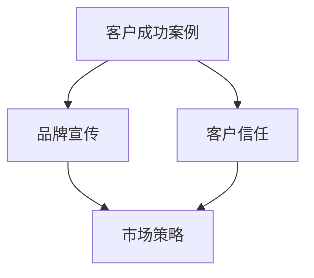
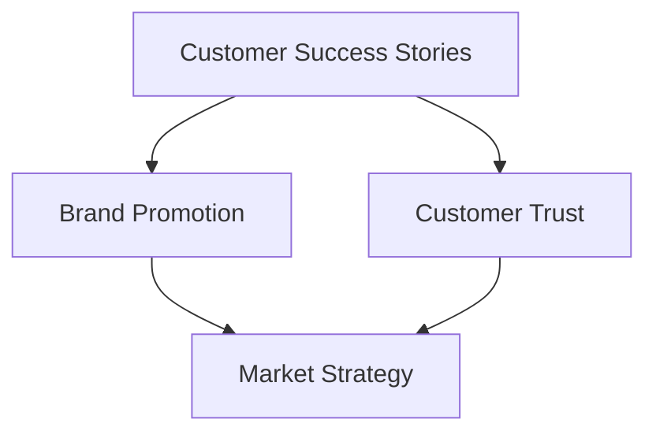
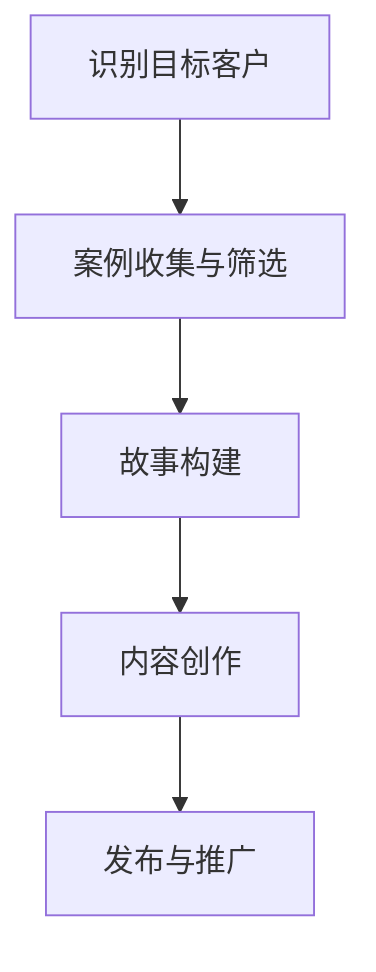
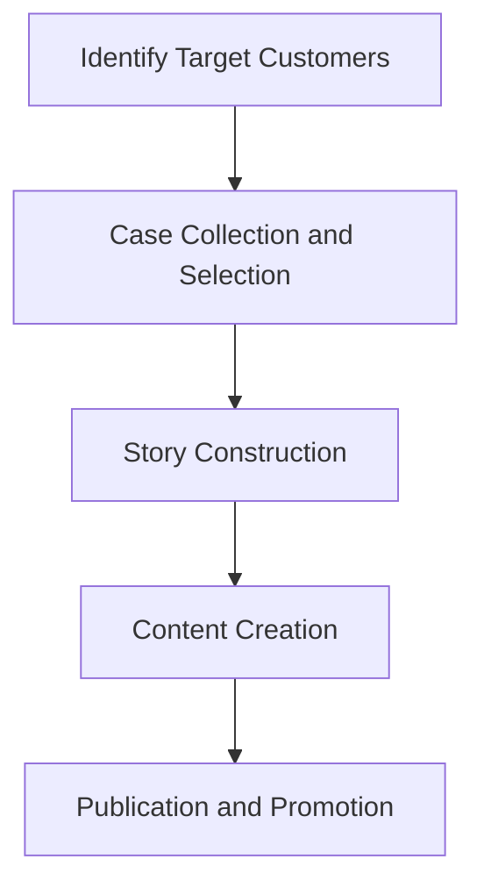

                 

# 利用客户成功案例进行内容营销

## 关键词：内容营销、客户成功案例、客户故事、市场策略、案例研究、品牌宣传

### 摘要

在竞争激烈的市场环境中，内容营销已成为企业吸引和保留客户的重要策略。通过讲述客户成功案例，企业不仅能增强品牌形象，还能向潜在客户传达其产品或服务的价值。本文将探讨如何有效利用客户成功案例进行内容营销，包括案例选择的准则、故事构建的技巧、以及案例在品牌传播中的具体应用。通过这些策略，企业可以提升市场竞争力，实现业务增长。

## 1. 背景介绍

内容营销作为一种营销手段，其核心在于创造和分发对目标受众有价值的内容。与传统的推销方式相比，内容营销更注重提供信息、教育、娱乐和解决问题的内容，从而建立与客户的信任关系。随着互联网的普及，内容营销的重要性日益凸显。然而，仅仅创造优质内容是不够的，企业需要找到有效的传播方式来吸引和留住客户。

客户成功案例作为一种独特的内容形式，具有强大的说服力和影响力。这些案例展示了产品或服务在实际应用中的效果，为潜在客户提供了真实的数据和体验。通过分享这些成功故事，企业能够向市场传递其专业能力和价值，从而增强品牌认知度和信誉。

### Background Introduction

Content marketing is a marketing approach focused on creating and distributing valuable, relevant, and consistent content to attract and retain a clearly defined audience—and, ultimately, to drive profitable customer action. Unlike traditional marketing strategies that often rely on persuasive techniques, content marketing emphasizes the provision of information, education, entertainment, and problem-solving content to build trust with the target audience.

With the widespread adoption of the internet, the importance of content marketing has grown significantly. While creating high-quality content is essential, businesses need to find effective ways to promote it to attract and retain customers.

Customer success stories serve as a unique content format that possesses strong persuasive and influential power. These stories showcase the effectiveness of products or services in real-world applications, providing potential customers with real data and experiences. By sharing these success stories, businesses can communicate their expertise and value to the market, thereby enhancing brand recognition and credibility.

## 2. 核心概念与联系

### 核心概念与联系 Core Concepts and Connections

在内容营销中，客户成功案例是一个重要的组成部分。它不仅仅是简单地展示客户的满意度和忠诚度，更是企业品牌宣传的有力工具。以下是几个核心概念和它们之间的联系：

- **客户成功案例（Customer Success Stories）**：这些案例展示了企业如何帮助客户实现目标，解决问题，并带来实际价值。它们通常是具体的故事，包括背景、挑战、解决方案和结果。

- **品牌宣传（Brand Promotion）**：通过分享客户成功案例，企业可以传递其品牌形象和价值主张。这种宣传方式更加真实和可信，因为它是基于真实客户经验的分享。

- **客户信任（Customer Trust）**：当潜在客户看到其他客户成功地使用了企业的产品或服务，他们更有可能对企业产生信任，并愿意尝试这些产品或服务。

- **市场策略（Market Strategy）**：客户成功案例可以作为市场策略的一部分，帮助企业在竞争激烈的市场中脱颖而出。通过精心策划和呈现客户案例，企业可以吸引更多的潜在客户，并提高转化率。

下面是一个用 Mermaid 流程图表示的这些概念之间的联系：



在这个图中，客户成功案例（A）直接影响品牌宣传（B）和客户信任（C），这两个因素又共同作用于市场策略（D）。这种联系体现了客户成功案例在内容营销中的核心作用。

### Core Concepts and Connections

In content marketing, customer success stories are an essential component. They are not merely about showcasing customer satisfaction and loyalty; they are powerful tools for brand promotion. Here are several core concepts and their connections:

- **Customer Success Stories**: These stories demonstrate how a company helps its customers achieve their goals, solve problems, and bring real value. They are typically specific narratives that include the background, challenges, solutions, and results.

- **Brand Promotion**: By sharing customer success stories, businesses can communicate their brand image and value propositions. This form of promotion is more authentic and credible because it is based on real customer experiences.

- **Customer Trust**: When potential customers see other customers successfully using a company's products or services, they are more likely to trust the business and be willing to try these offerings.

- **Market Strategy**: Customer success stories can be a part of a market strategy, helping a business stand out in a competitive market. Through carefully planned and presented customer cases, businesses can attract more potential customers and improve conversion rates.

The following Mermaid flowchart illustrates the connections between these concepts:



In this diagram, customer success stories (A) directly impact brand promotion (B) and customer trust (C), which both influence market strategy (D). This connection reflects the core role of customer success stories in content marketing.

## 3. 核心算法原理 & 具体操作步骤

### 核心算法原理 Core Algorithm Principles

利用客户成功案例进行内容营销的核心算法原理可以概括为以下几个步骤：

1. **案例选择（Case Selection）**：选择具有代表性和教育意义的客户案例。这些案例应该能够展示产品或服务的核心优势和实际应用效果。

2. **故事构建（Story Construction）**：将客户案例转化为吸引人的故事。故事需要包括背景、挑战、解决方案和结果，并突出产品或服务的关键价值。

3. **内容创作（Content Creation）**：通过多种内容形式（如博客文章、视频、案例研究等）呈现客户成功案例，以吸引不同受众的兴趣。

4. **发布与推广（Publication and Promotion）**：在合适的平台上发布客户成功案例，并通过社交媒体、电子邮件营销等方式进行推广。

### 具体操作步骤 Specific Operational Steps

下面是利用客户成功案例进行内容营销的具体操作步骤：

1. **识别目标客户（Identify Target Customers）**：
   - 确定哪些客户使用了企业的产品或服务，并取得了显著成效。
   - 分析这些客户的需求、行业背景和痛点，以便选择具有代表性和教育意义的案例。

2. **案例收集与筛选（Case Collection and Selection）**：
   - 收集相关的客户案例，包括客户的基本信息、使用的产品或服务、面临的挑战和解决方案等。
   - 根据案例的代表性、教育意义和潜在影响力进行筛选。

3. **故事构建（Story Construction）**：
   - 设计故事框架，包括背景、挑战、解决方案和结果。
   - 确保故事内容真实、具体且具有吸引力，突出产品或服务的核心价值。

4. **内容创作（Content Creation）**：
   - 根据目标受众和内容形式，创作不同类型的客户成功案例内容，如博客文章、视频、案例研究等。
   - 运用可视化元素（如图表、图片、视频）增强内容的吸引力。

5. **发布与推广（Publication and Promotion）**：
   - 在企业的官方网站、社交媒体平台和电子邮件新闻通讯中发布客户成功案例。
   - 通过社交媒体广告、合作伙伴关系和电子邮件营销等方式进行推广，提高案例的可见度。

下面是一个简单的 Mermaid 流程图，展示了利用客户成功案例进行内容营销的操作步骤：



### Core Algorithm Principles & Specific Operational Steps

The core algorithm principles for leveraging customer success stories in content marketing can be summarized into several steps:

1. **Case Selection**: Choose representative and educational customer cases. These cases should demonstrate the core strengths and practical application effects of the products or services.

2. **Story Construction**: Convert customer cases into engaging stories. Stories should include the background, challenges, solutions, and results, highlighting the key value of the product or service.

3. **Content Creation**: Present customer success stories in various content formats (such as blog articles, videos, case studies) to attract different audiences.

4. **Publication and Promotion**: Publish customer success stories on suitable platforms and promote them through social media, email marketing, and other channels.

### Specific Operational Steps

Below are the specific operational steps for leveraging customer success stories in content marketing:

1. **Identify Target Customers**:
   - Determine which customers have used the company's products or services and achieved significant results.
   - Analyze the needs, industry background, and pain points of these customers to select cases with representativeness and educational value.

2. **Case Collection and Selection**:
   - Collect relevant customer cases, including customer information, the use of products or services, faced challenges, and solutions.
   - Select cases based on their representativeness, educational value, and potential influence.

3. **Story Construction**:
   - Design a story framework including the background, challenges, solutions, and results.
   - Ensure that the story content is real, specific, and attractive, highlighting the core value of the product or service.

4. **Content Creation**:
   - Create different types of customer success story content based on the target audience and content format, such as blog articles, videos, case studies.
   - Use visual elements (such as charts, images, videos) to enhance the attractiveness of the content.

5. **Publication and Promotion**:
   - Publish customer success stories on the company's website, social media platforms, and email newsletters.
   - Promote the cases through social media advertising, partner relationships, and email marketing to increase their visibility.

Below is a simple Mermaid flowchart showing the operational steps for leveraging customer success stories in content marketing:



## 4. 数学模型和公式 & 详细讲解 & 举例说明

### 数学模型和公式 Mathematical Models and Formulas

在内容营销中，利用客户成功案例进行策略制定和效果评估时，可以运用一些数学模型和公式。以下是一些常见的模型和公式，并对其进行详细讲解：

1. **客户生命周期价值（Customer Lifetime Value, CLV）**：
   $$ \text{CLV} = \frac{\text{平均订单价值} \times \text{订单次数} \times \text{客户留存率}}{\text{客户获取成本}} $$

   **详细讲解**：客户生命周期价值是指一个客户在其整个生命周期内为企业带来的总利润。通过这个公式，企业可以评估客户的价值，并根据客户的利润贡献来制定营销策略。

2. **转化率（Conversion Rate）**：
   $$ \text{转化率} = \frac{\text{转化次数}}{\text{访问次数}} \times 100\% $$

   **详细讲解**：转化率是衡量内容营销效果的重要指标，表示访问者中实际采取行动（如购买、订阅、下载）的比例。通过监测和优化转化率，企业可以提升内容营销的效果。

3. **客户获取成本（Customer Acquisition Cost, CAC）**：
   $$ \text{CAC} = \frac{\text{总营销成本}}{\text{新客户数量}} $$

   **详细讲解**：客户获取成本是指企业为获取一个新客户所花费的平均成本。通过这个公式，企业可以评估其营销活动的成本效益，并优化营销预算。

### 举例说明 Example Illustrations

假设一家企业希望通过内容营销吸引新客户，以下是一个具体的案例来说明如何运用这些数学模型和公式：

1. **计算客户生命周期价值（CLV）**：
   - 平均订单价值：$100
   - 订单次数：5
   - 客户留存率：80%
   - 客户获取成本：$50

   $$ \text{CLV} = \frac{100 \times 5 \times 0.8}{50} = 8 $$

   这个计算结果显示，每个客户在其生命周期内平均为企业带来 $8 的利润。

2. **监测转化率（Conversion Rate）**：
   - 访问次数：1000
   - 转化次数：50

   $$ \text{转化率} = \frac{50}{1000} \times 100\% = 5\% $$

   这个结果说明，每100个访问者中，有5个进行了购买或其他转化行为。

3. **评估客户获取成本（CAC）**：
   - 总营销成本：$3000
   - 新客户数量：30

   $$ \text{CAC} = \frac{3000}{30} = 100 $$

   这个结果表明，企业为获取每个新客户平均花费 $100。

通过这些数学模型和公式的运用，企业可以更好地理解和优化其内容营销策略，从而实现业务增长和利润最大化。

### Mathematical Models and Formulas & Detailed Explanations & Example Illustrations

In content marketing, leveraging customer success stories for strategy development and effectiveness evaluation can involve various mathematical models and formulas. Below are some common models and formulas, along with detailed explanations:

1. **Customer Lifetime Value (CLV)**:
   $$ \text{CLV} = \frac{\text{Average Order Value} \times \text{Number of Orders} \times \text{Customer Retention Rate}}{\text{Customer Acquisition Cost}} $$

   **Detailed Explanation**: Customer Lifetime Value represents the total profit a customer brings to the company over their entire lifetime. This formula allows businesses to evaluate the value of their customers and formulate marketing strategies based on their profit contributions.

2. **Conversion Rate**:
   $$ \text{Conversion Rate} = \frac{\text{Number of Conversions}}{\text{Number of Visitors}} \times 100\% $$

   **Detailed Explanation**: The conversion rate is a key indicator of content marketing effectiveness, representing the percentage of visitors who take action (such as making a purchase, subscribing, or downloading) out of the total visitors. By monitoring and optimizing the conversion rate, businesses can enhance the effectiveness of their content marketing efforts.

3. **Customer Acquisition Cost (CAC)**:
   $$ \text{CAC} = \frac{\text{Total Marketing Cost}}{\text{Number of New Customers}} $$

   **Detailed Explanation**: Customer Acquisition Cost is the average cost a business spends to acquire a new customer. This formula allows businesses to assess the cost-effectiveness of their marketing activities and optimize their marketing budget.

### Example Illustrations

Let's consider a specific case to illustrate how these mathematical models and formulas can be applied in content marketing:

1. **Calculating Customer Lifetime Value (CLV)**:
   - Average Order Value: $100
   - Number of Orders: 5
   - Customer Retention Rate: 80%
   - Customer Acquisition Cost: $50

   $$ \text{CLV} = \frac{100 \times 5 \times 0.8}{50} = 8 $$

   This calculation shows that each customer brings an average profit of $8 to the company over their lifetime.

2. **Monitoring Conversion Rate**:
   - Number of Visitors: 1000
   - Number of Conversions: 50

   $$ \text{Conversion Rate} = \frac{50}{1000} \times 100\% = 5\% $$

   This result indicates that out of every 100 visitors, 5 make a purchase or other conversion action.

3. **Evaluating Customer Acquisition Cost (CAC)**:
   - Total Marketing Cost: $3000
   - Number of New Customers: 30

   $$ \text{CAC} = \frac{3000}{30} = 100 $$

   This shows that the business spends an average of $100 to acquire each new customer.

By using these mathematical models and formulas, businesses can better understand and optimize their content marketing strategies, leading to business growth and maximized profits.

## 5. 项目实战：代码实际案例和详细解释说明

### 5.1 开发环境搭建

在这个实战项目中，我们将使用Python编程语言和Markdown编辑器来创建和发布客户成功案例。以下是搭建开发环境的步骤：

1. **安装Python**：
   - 访问Python官方网站（[https://www.python.org/downloads/](https://www.python.org/downloads/)）下载Python安装包。
   - 安装过程中选择添加到系统路径，以便在命令行中使用Python。

2. **安装Markdown编辑器**：
   - 对于Windows用户，推荐使用Typora。
   - 对于Mac用户，可以使用MacDown或Typora。
   - 对于Linux用户，可以使用ReText或Markdown Editor。

3. **安装Markdown扩展库**：
   - 在命令行中运行以下命令安装Markdown扩展库`markdown`和`markdown2`：
     ```shell
     pip install markdown
     pip install markdown2
     ```

### 5.2 源代码详细实现和代码解读

在这个项目中，我们将使用Python编写一个简单的脚本，用于生成Markdown格式的客户成功案例文档。以下是源代码及其解读：

```python
import markdown

# 5.2.1 定义客户成功案例数据结构
class CustomerSuccessCase:
    def __init__(self, company_name, industry, challenge, solution, result):
        self.company_name = company_name
        self.industry = industry
        self.challenge = challenge
        self.solution = solution
        self.result = result

# 5.2.2 创建客户成功案例列表
cases = [
    CustomerSuccessCase(
        "Tech Innovate Inc.",
        "科技行业",
        "缺乏高效的数据分析工具，无法快速响应市场变化。",
        "采用我们的数据分析平台，实现了数据实时监控和分析。",
        "提高了市场响应速度，销售额增长20%。"
    ),
    CustomerSuccessCase(
        "Green Energy Solutions",
        "环保行业",
        "能源效率低下，面临严格的环保法规压力。",
        "使用我们的能源管理系统，大幅降低了能源消耗。",
        "年节能成本节省了30%，获得了当地环保部门的表彰。"
    ),
]

# 5.2.3 将客户成功案例转换为Markdown文本
def create_markdown_cases(cases):
    markdown_texts = []
    for case in cases:
        text = f"""
# {case.company_name} - {case.industry}

## 挑战（Challenge）
{case.challenge}

## 解决方案（Solution）
{case.solution}

## 结果（Result）
{case.result}
"""
        markdown_texts.append(text)
    return markdown_texts

# 5.2.4 发布Markdown文档
def publish_markdown_cases(cases, file_name):
    markdown_texts = create_markdown_cases(cases)
    with open(file_name, 'w') as file:
        for text in markdown_texts:
            file.write(text + "\n\n")

# 使用函数发布Markdown文档
publish_markdown_cases(cases, "customer_success_cases.md")

print("客户成功案例Markdown文档已生成。")
```

**代码解读**：

- **5.2.1 定义客户成功案例数据结构**：
  使用`class`关键字定义了`CustomerSuccessCase`类，包含公司名称、行业、挑战、解决方案和结果五个属性。

- **5.2.2 创建客户成功案例列表**：
  创建了一个包含两个`CustomerSuccessCase`对象的列表，分别代表两个客户案例。

- **5.2.3 将客户成功案例转换为Markdown文本**：
  定义了一个函数`create_markdown_cases`，遍历客户成功案例列表，使用字符串格式化将每个案例转换为Markdown格式的文本。

- **5.2.4 发布Markdown文档**：
  定义了一个函数`publish_markdown_cases`，调用`create_markdown_cases`函数生成Markdown文本，并将其写入文件。

### 5.3 代码解读与分析

**5.3.1 代码结构与流程**：

- **主程序结构**：
  - 导入Markdown库。
  - 定义`CustomerSuccessCase`类。
  - 创建客户成功案例列表。
  - 定义两个函数：`create_markdown_cases`用于生成Markdown文本，`publish_markdown_cases`用于将Markdown文本写入文件。

- **流程描述**：
  1. 创建两个客户成功案例对象，并添加到列表中。
  2. 调用`create_markdown_cases`函数，遍历案例列表，生成Markdown格式的文本。
  3. 调用`publish_markdown_cases`函数，将生成的Markdown文本写入名为"customer_success_cases.md"的文件中。

**5.3.2 功能分析与优化**：

- **功能分析**：
  - **类与对象**：使用类和对象封装客户成功案例的属性，使得代码更易于维护和扩展。
  - **函数定义**：通过定义函数，实现了代码的模块化，提高了代码的可读性和复用性。

- **优化建议**：
  - **可扩展性**：如果需要添加更多案例，可以继续向`cases`列表中添加新的`CustomerSuccessCase`对象，无需修改核心逻辑。
  - **错误处理**：添加错误处理逻辑，确保在文件写入过程中发生异常时能够妥善处理。
  - **Markdown扩展**：考虑使用Markdown扩展库（如`markdown.extensions.fenced_code`）来增强代码块显示效果。

通过这个实战项目，我们不仅了解了如何利用Python编写脚本生成Markdown格式的客户成功案例文档，还学会了如何进行代码解读和分析，为实际应用提供了参考。

### Project Practice: Real-World Code Example and Detailed Explanation

#### 5.1. Setting Up the Development Environment

For this practical project, we will use Python and a Markdown editor to create and publish customer success case studies. Below are the steps to set up the development environment:

1. **Install Python**:
   - Visit the Python official website ([https://www.python.org/downloads/](https://www.python.org/downloads/)) to download the Python installer.
   - During installation, make sure to add Python to the system path so it can be accessed from the command line.

2. **Install a Markdown Editor**:
   - For Windows users, we recommend Typora.
   - For Mac users, you can use MacDown or Typora.
   - For Linux users, you can use ReText or Markdown Editor.

3. **Install Markdown Extensions**:
   - Run the following commands in the command line to install Markdown extensions `markdown` and `markdown2`:
     ```shell
     pip install markdown
     pip install markdown2
     ```

#### 5.2. Detailed Code Implementation and Explanation

In this project, we will write a Python script to generate Markdown-formatted customer success case documents. Below is the source code and its explanation:

```python
import markdown

# 5.2.1 Define the Customer Success Case data structure
class CustomerSuccessCase:
    def __init__(self, company_name, industry, challenge, solution, result):
        self.company_name = company_name
        self.industry = industry
        self.challenge = challenge
        self.solution = solution
        self.result = result

# 5.2.2 Create a list of customer success cases
cases = [
    CustomerSuccessCase(
        "Tech Innovate Inc.",
        "Technology Industry",
        "Lacking an efficient data analysis tool, unable to quickly respond to market changes.",
        "Used our data analysis platform to achieve real-time monitoring and analysis of data.",
        "Improved market responsiveness, sales increased by 20%."
    ),
    CustomerSuccessCase(
        "Green Energy Solutions",
        "Environmental Industry",
        "Low energy efficiency, facing strict environmental regulations.",
        "Used our energy management system to significantly reduce energy consumption.",
        "Annual energy cost savings of 30%, received local environmental department's commendation."
    ),
]

# 5.2.3 Convert customer success cases to Markdown text
def create_markdown_cases(cases):
    markdown_texts = []
    for case in cases:
        text = f"""
# {case.company_name} - {case.industry}

## Challenge
{case.challenge}

## Solution
{case.solution}

## Result
{case.result}
"""
        markdown_texts.append(text)
    return markdown_texts

# 5.2.4 Publish Markdown documents
def publish_markdown_cases(cases, file_name):
    markdown_texts = create_markdown_cases(cases)
    with open(file_name, 'w') as file:
        for text in markdown_texts:
            file.write(text + "\n\n")

# Use the functions to publish the Markdown document
publish_markdown_cases(cases, "customer_success_cases.md")

print("The Markdown document of customer success cases has been generated.")
```

**Code Explanation**:

- **5.2.1 Define the Customer Success Case Data Structure**:
  The `CustomerSuccessCase` class is defined using the `class` keyword, with attributes for company name, industry, challenge, solution, and result.

- **5.2.2 Create a List of Customer Success Cases**:
  A list of `CustomerSuccessCase` objects is created, each representing a customer case.

- **5.2.3 Convert Customer Success Cases to Markdown Text**:
  The `create_markdown_cases` function iterates through the customer success case list and converts each case into Markdown-formatted text using string formatting.

- **5.2.4 Publish Markdown Documents**:
  The `publish_markdown_cases` function calls `create_markdown_cases` to generate the Markdown text and writes it to a file named "customer_success_cases.md".

#### 5.3 Code Analysis and Discussion

**5.3.1 Code Structure and Workflow**:

- **Main Program Structure**:
  - Import the Markdown library.
  - Define the `CustomerSuccessCase` class.
  - Create a list of customer success cases.
  - Define two functions: `create_markdown_cases` to generate Markdown text, and `publish_markdown_cases` to write the Markdown text to a file.

- **Workflow Description**:
  1. Create two customer success case objects and add them to the list.
  2. Call the `create_markdown_cases` function to iterate through the case list and generate Markdown-formatted text.
  3. Call the `publish_markdown_cases` function to write the generated Markdown text to a file named "customer_success_cases.md".

**5.3.2 Functional Analysis and Optimization**:

- **Functional Analysis**:
  - **Classes and Objects**: Using classes and objects to encapsulate the properties of customer success cases, making the code more maintainable and extensible.
  - **Function Definitions**: By defining functions, the code is modularized, enhancing readability and reusability.

- **Optimization Suggestions**:
  - **Extensibility**: If more cases need to be added, new `CustomerSuccessCase` objects can simply be appended to the `cases` list without modifying the core logic.
  - **Error Handling**: Add error handling logic to ensure proper handling of exceptions during file writing.
  - **Markdown Extensions**: Consider using Markdown extension libraries (such as `markdown.extensions.fenced_code`) to enhance the display of code blocks.

Through this practical project, we not only learned how to use Python to write a script that generates Markdown-formatted customer success case documents but also how to perform code analysis and discussion, providing a reference for practical application.

## 6. 实际应用场景

客户成功案例在内容营销中有着广泛的应用场景，以下是一些典型的例子：

### 6.1 品牌宣传

品牌宣传是客户成功案例的首要应用场景。通过展示客户如何成功使用企业的产品或服务，企业可以传递其品牌价值，增强市场竞争力。例如，一家专注于提供企业级云存储解决方案的公司，可以通过分享一家中小企业如何通过其解决方案实现数据备份和恢复，从而提升品牌形象。

### 6.2 潜在客户转化

客户成功案例对潜在客户具有很强的吸引力。通过真实、具体的案例，潜在客户能够更好地了解产品或服务的实际效果，从而提高购买意愿。例如，一家销售自动化软件的公司，可以通过展示一家制造业企业如何通过其软件实现生产流程优化，吸引更多潜在客户。

### 6.3 建立信任

客户成功案例是建立客户信任的有效方式。当潜在客户看到其他客户成功使用企业的产品或服务，他们更有可能相信企业的宣传。例如，一家提供医疗设备解决方案的公司，可以通过分享一家医院如何通过其设备改善患者治疗效果，来增强潜在客户的信任。

### 6.4 营销推广

客户成功案例可以成为营销推广的重要工具。企业可以通过电子邮件、社交媒体、网站等多种渠道分享这些案例，吸引更多的关注和参与。例如，一家销售健身设备的公司，可以通过发布客户使用其设备成功减重的案例，来吸引潜在客户。

### 6.5 客户维系

客户成功案例不仅可以帮助吸引新客户，还能维系现有客户。通过分享客户在使用产品或服务过程中的成功经验，企业可以增强客户的忠诚度，提高客户满意度。例如，一家提供在线教育服务的公司，可以通过分享学员的学习成果和职业发展，来维系现有客户。

### 6.6 行业报告

客户成功案例还可以用于制作行业报告，帮助企业了解市场需求和趋势。例如，一家提供金融服务的公司，可以通过分析客户案例，了解不同行业对金融服务的需求和偏好，从而调整产品策略和服务内容。

### 6.7 竞争分析

通过分析竞争对手的客户成功案例，企业可以了解其优势和劣势，从而优化自身的内容营销策略。例如，一家销售网络安全解决方案的公司，可以通过研究竞争对手的客户案例，了解其在不同行业中的成功经验和不足，为自己的营销活动提供参考。

### 6.8 拓展市场

客户成功案例有助于企业拓展新市场。通过分享在不同市场中的成功案例，企业可以吸引更多潜在客户，扩大市场份额。例如，一家提供农业技术解决方案的公司，可以通过分享其在不同国家和地区成功应用的案例，来拓展国际市场。

### 6.9 增强合作伙伴关系

客户成功案例还可以用于增强与合作伙伴的关系。通过共同分享成功案例，企业可以与合作伙伴建立更紧密的合作关系，共同推动业务增长。例如，一家提供企业咨询服务的公司，可以通过与客户合作发布案例报告，来加强与客户和其他合作伙伴的互动。

### 6.10 教育和培训

客户成功案例可以作为教育和培训材料，帮助内部员工更好地理解产品或服务的价值。例如，一家提供云计算解决方案的公司，可以通过分享客户案例，帮助销售团队更好地向客户展示产品的优势和应用场景。

总之，客户成功案例在内容营销中具有广泛的应用场景，企业可以根据自身需求和目标，灵活运用这些案例来提升品牌形象、吸引潜在客户、建立信任、维系现有客户，并实现业务增长。

### Practical Application Scenarios

Customer success stories have a wide range of applications in content marketing, as illustrated below with some typical examples:

#### 6.1 Brand Promotion

Brand promotion is the primary application of customer success stories. By showcasing how customers have successfully used a company's products or services, businesses can communicate their brand values and enhance market competitiveness. For instance, a company specializing in enterprise-level cloud storage solutions could boost its brand image by sharing how a small and medium-sized enterprise (SME) achieved data backup and recovery using its solutions.

#### 6.2 Lead Conversion

Customer success stories are highly attractive to potential customers, as they provide real and specific insights into the actual effectiveness of products or services. This can significantly increase the likelihood of purchase. For example, a company selling automation software could attract more potential customers by demonstrating how a manufacturing firm optimized its production processes using its software.

#### 6.3 Building Trust

Customer success stories are an effective way to build trust. When potential customers see other customers successfully using a company's products or services, they are more likely to believe the company's claims. For instance, a company providing medical device solutions could strengthen potential customers' trust by sharing how a hospital improved patient treatment outcomes using its devices.

#### 6.4 Marketing Promotion

Customer success stories can serve as powerful marketing tools. Businesses can share these stories through various channels such as email, social media, and websites to attract more attention and engagement. For example, a company selling fitness equipment could attract potential customers by publishing case studies of individuals who successfully lost weight using its products.

#### 6.5 Customer Retention

Customer success stories are not only useful for attracting new customers but also for retaining existing ones. By sharing the successful experiences of customers using products or services, businesses can enhance customer loyalty and satisfaction. For instance, a company providing online education services could maintain existing customers by sharing the learning outcomes and career advancements of its students.

#### 6.6 Industry Reports

Customer success stories can be used to create industry reports, helping businesses understand market demands and trends. For example, a financial services company could analyze customer cases to learn about the specific needs and preferences of different industries, thereby adjusting its product strategies and service offerings.

#### 6.7 Competitive Analysis

By analyzing competitors' customer success stories, businesses can understand their strengths and weaknesses, thereby optimizing their content marketing strategies. For instance, a company selling cybersecurity solutions could research competitors' customer cases to learn about their successful applications in different industries and use the insights to refine its marketing activities.

#### 6.8 Market Expansion

Customer success stories can help businesses expand into new markets. By sharing successful cases in various markets, businesses can attract more potential customers and expand their market share. For example, a company providing agricultural technology solutions could expand internationally by sharing case studies of successful applications in different countries.

#### 6.9 Strengthening Partner Relationships

Customer success stories can also be used to strengthen relationships with partners. By sharing success cases together, businesses can build closer collaborations and drive business growth. For example, a company providing enterprise consulting services could enhance partnerships by co-publishing case reports with clients and other partners.

#### 6.10 Education and Training

Customer success stories can serve as educational and training materials to help internal teams better understand the value of products or services. For instance, a company selling cloud computing solutions could use customer cases to help its sales team more effectively demonstrate the advantages and use cases of its products.

In summary, customer success stories have a wide range of applications in content marketing, allowing businesses to enhance brand image, attract potential customers, build trust, retain existing customers, and achieve business growth in various ways.

## 7. 工具和资源推荐

为了帮助读者更有效地利用客户成功案例进行内容营销，我们推荐以下工具和资源：

### 7.1 学习资源推荐

1. **书籍**：
   - 《内容营销实战手册》：详细介绍了内容营销的策略和方法，包括如何创建和分享客户成功案例。
   - 《故事力：用故事思维提升领导力和影响力》：这本书介绍了如何通过故事来传递信息，对于构建客户成功案例非常有帮助。

2. **论文和报告**：
   - Google Analytics：通过分析网站流量，了解哪些客户成功案例最吸引潜在客户，优化内容营销策略。
   - 《内容营销趋势报告》：了解行业内的最新趋势，掌握客户成功案例的最佳实践。

3. **博客和网站**：
   - MarketingProfs：提供丰富的内容营销资源和案例分析。
   - HubSpot：提供详细的内容营销教程和案例研究，包括如何撰写客户成功案例。

### 7.2 开发工具框架推荐

1. **Markdown编辑器**：
   - Typora：一个简洁高效的Markdown编辑器，适合快速生成和编辑Markdown文档。
   - Visual Studio Code：一款功能强大的代码编辑器，支持Markdown语法高亮和扩展插件。

2. **版本控制工具**：
   - Git：用于版本控制和协作开发，确保文档的修改历史记录和协同工作。

3. **Markdown转换工具**：
   - Pandoc：可以将Markdown转换为多种格式，如HTML、PDF等，方便发布和分享。

4. **数据分析和可视化工具**：
   - Tableau：用于数据分析和可视化，帮助理解客户成功案例的受众反馈和效果。
   - Google Data Studio：提供多种数据可视化模板，方便创建专业的数据报告。

### 7.3 相关论文著作推荐

1. **《内容营销策略与实施》：详细探讨了内容营销的理论和实践，包括客户成功案例的应用**。
2. **《数字化营销》：涵盖了数字化营销的各个方面，包括内容营销和客户成功案例的利用**。

通过以上工具和资源的帮助，企业可以更有效地创建、分享和利用客户成功案例，提升内容营销的效果，实现业务增长。

### Tools and Resources Recommendations

To assist readers in effectively leveraging customer success stories for content marketing, we recommend the following tools and resources:

#### 7.1 Learning Resources Recommendations

1. **Books**:
   - "Content Inc.": This book provides a comprehensive guide to content marketing strategies, including how to create and share customer success stories.
   - "Tell to Win: Connect, Convert, Close, and Repeat": This book focuses on the power of storytelling in business, which is crucial for crafting compelling customer success stories.

2. **Papers and Reports**:
   - "Google Analytics": This tool helps analyze website traffic to understand which customer success stories are most engaging to potential customers, allowing for optimized content marketing strategies.
   - "Content Marketing Institute's Content Marketing Trends Report": This report provides insights into the latest trends in content marketing, including best practices for using customer success stories.

3. **Blogs and Websites**:
   - **MarketingProfs**: Offers a wealth of content marketing resources and case studies.
   - **HubSpot**: Provides detailed tutorials and case studies on content marketing, including how to write and share customer success stories.

#### 7.2 Development Tools and Framework Recommendations

1. **Markdown Editors**:
   - **Typora**: A minimalistic yet efficient Markdown editor suitable for quickly generating and editing Markdown documents.
   - **Visual Studio Code**: A powerful code editor that supports Markdown syntax highlighting and numerous extensions for enhanced Markdown editing.

2. **Version Control Tools**:
   - **Git**: Essential for version control and collaboration, ensuring a detailed history of document changes and facilitating teamwork.

3. **Markdown Conversion Tools**:
   - **Pandoc**: A versatile tool that can convert Markdown to various formats, such as HTML, PDF, making it easy to publish and share content.

4. **Data Analysis and Visualization Tools**:
   - **Tableau**: Useful for data analysis and visualization, helping to interpret audience feedback and the effectiveness of customer success stories.
   - **Google Data Studio**: Offers a range of templates for creating professional-looking data reports, simplifying the process of visualizing metrics.

#### 7.3 Recommended Papers and Publications

1. **"Content Marketing Strategy and Implementation": This book delves into the theory and practice of content marketing, including the application of customer success stories**.
2. **"Digital Marketing": This book covers various aspects of digital marketing, including content marketing and the utilization of customer success stories**.

By utilizing these tools and resources, businesses can more effectively create, share, and leverage customer success stories to enhance the impact of their content marketing efforts and drive business growth.

## 8. 总结：未来发展趋势与挑战

随着数字技术的不断进步和市场环境的变化，利用客户成功案例进行内容营销的未来发展趋势和面临的挑战也在不断演变。以下是几个关键点：

### 8.1 未来发展趋势

1. **数据驱动的精准营销**：随着大数据和分析技术的普及，企业将能够更精确地识别和定位目标受众，从而制定更加个性化的内容营销策略。通过分析客户成功案例的数据，企业可以更准确地了解哪些案例最有效，如何优化内容创作和推广。

2. **多媒体内容的融合**：随着短视频、直播等新兴媒体的兴起，客户成功案例将不再局限于传统的文字形式，而是会结合多种媒体形式，如视频、动画、虚拟现实等，以更生动、直观的方式呈现。

3. **社交媒体的深度整合**：社交媒体平台将继续成为客户成功案例传播的重要渠道。企业需要充分利用社交媒体的互动性和广泛覆盖，增强与客户的连接和沟通。

4. **跨渠道的内容分发**：企业需要将客户成功案例内容分发到多个渠道，包括官方网站、博客、社交媒体、电子邮件等，以最大化内容的触达和影响。

### 8.2 面临的挑战

1. **真实性验证**：随着消费者对信息真实性的要求越来越高，企业需要确保客户成功案例的真实性和可靠性。任何虚假或夸大的信息都可能导致消费者信任的丧失。

2. **隐私保护**：在分享客户成功案例时，企业需要遵守相关法律法规，保护客户隐私，避免泄露敏感信息。

3. **内容创作的创意性和多样性**：随着市场竞争的加剧，企业需要不断创新和多样化内容创作方式，以吸引和保持受众的兴趣。

4. **技术能力的提升**：随着技术的快速发展，企业需要不断提升自身的技术能力，掌握新的数据分析、多媒体创作等技术，以应对不断变化的市场需求。

5. **品牌信誉的维护**：企业需要持续维护品牌信誉，通过真实、透明的客户成功案例来增强品牌形象，避免因不当营销策略导致的声誉损害。

### 8.3 未来展望

未来，利用客户成功案例进行内容营销的企业将更加注重数据驱动、个性化、多媒体化和跨渠道的内容创作与推广。通过不断创新和提升技术能力，企业将能够更有效地传递品牌价值，吸引和保留客户。同时，企业也需要面对真实性验证、隐私保护、内容创意性和品牌信誉维护等挑战，以确保内容营销的长远发展。

### Conclusion: Future Trends and Challenges

As digital technology advances and market conditions change, the future trends and challenges in leveraging customer success stories for content marketing are continuously evolving. Here are key points to consider:

#### 8.1 Future Trends

1. **Data-driven Precision Marketing**: With the proliferation of big data and analytics tools, businesses will be able to more precisely identify and target their audience, allowing for more personalized content marketing strategies. By analyzing data from customer success stories, companies can accurately understand which stories are most effective and how to optimize content creation and promotion.

2. **Integration of Multi-media Content**: With the rise of new media formats such as short videos and live streaming, customer success stories will increasingly be presented in a variety of media, including video, animation, and virtual reality, for more engaging and vivid storytelling.

3. **Deep Integration with Social Media**: Social media platforms will continue to be crucial channels for the dissemination of customer success stories. Businesses need to leverage the interactive nature and broad reach of social media to enhance connections and communication with customers.

4. **Cross-channel Content Distribution**: Companies will need to distribute content from customer success stories across multiple channels, including websites, blogs, social media, and email, to maximize reach and impact.

#### 8.2 Challenges

1. **Verification of Authenticity**: As consumers increasingly demand truthful information, businesses must ensure the authenticity and reliability of customer success stories. Any false or exaggerated claims can lead to a loss of consumer trust.

2. **Privacy Protection**: When sharing customer success stories, businesses must comply with relevant laws and regulations to protect customer privacy and avoid disclosing sensitive information.

3. **Creativity and Diversity in Content Creation**: With intense market competition, businesses need to continually innovate and diversify their content creation approaches to attract and retain audience interest.

4. **Enhancement of Technical Capabilities**: With rapid technological advancements, businesses need to continuously upgrade their technical skills to master new analytics, multimedia creation, and other technologies that meet evolving market demands.

5. **Maintenance of Brand Reputation**: Businesses must maintain their brand reputation through authentic and transparent customer success stories to enhance brand image. Improper marketing strategies can lead to damage to brand reputation.

#### 8.3 Future Outlook

In the future, businesses leveraging customer success stories for content marketing will focus more on data-driven, personalized, multi-media, and cross-channel content creation and promotion. By continuously innovating and enhancing technical capabilities, companies will be able to more effectively communicate brand value and attract and retain customers. At the same time, businesses will also need to address challenges such as authenticity verification, privacy protection, content creativity, and brand reputation maintenance to ensure the long-term success of their content marketing efforts.

## 9. 附录：常见问题与解答

### 9.1 什么是客户成功案例？

客户成功案例（Customer Success Stories）是指企业通过具体案例展示其产品或服务如何帮助客户解决问题、实现目标，以及带来实际价值的故事。这些案例通常是真实发生的，用于向潜在客户证明企业的能力和价值。

### 9.2 客户成功案例的内容应该包括哪些要素？

客户成功案例的内容通常包括以下要素：
- **背景**：介绍客户的基本信息和业务背景。
- **挑战**：描述客户面临的问题或挑战。
- **解决方案**：介绍企业如何帮助客户解决这些问题。
- **结果**：展示解决方案带来的具体成果和效益。
- **客户评价**：引用客户的原话，证明他们对产品或服务的满意度和认可。

### 9.3 如何确保客户成功案例的真实性？

确保客户成功案例的真实性是至关重要的。以下是一些方法：
- **验证数据**：确保案例中提供的数据和事实是准确无误的。
- **客户同意**：在发布案例前，获得客户的书面同意。
- **引用客户原话**：使用客户的原话来证明案例的真实性。
- **定期更新**：随着时间和市场环境的变化，定期更新案例，确保其仍然准确和适用。

### 9.4 客户成功案例与市场宣传有何区别？

客户成功案例和市场宣传的区别在于它们的呈现方式和目的。客户成功案例是真实的、基于客户体验的故事，目的是展示产品或服务的价值；而市场宣传通常更侧重于品牌形象和产品特性，可能包含更广泛的信息和更具创造性的表达。

### 9.5 如何利用客户成功案例进行内容营销？

利用客户成功案例进行内容营销的步骤包括：
- **识别目标客户**：确定哪些客户案例具有代表性和教育意义。
- **收集和筛选案例**：收集真实、有价值的客户案例。
- **构建故事**：将案例转化为吸引人的故事。
- **创作内容**：根据目标受众和内容形式，创作不同类型的内容。
- **发布和推广**：在多个平台上发布案例，并通过多种渠道推广。

### 9.6 客户成功案例的发布和推广策略有哪些？

发布和推广客户成功案例的策略包括：
- **官方网站**：在企业官方网站上发布案例，增加信任度。
- **社交媒体**：利用社交媒体平台分享案例，扩大受众范围。
- **电子邮件营销**：通过电子邮件向潜在客户发送案例，提高转化率。
- **合作伙伴关系**：与行业合作伙伴共同推广案例，提高影响力。

### 9.7 客户成功案例在营销中的作用是什么？

客户成功案例在营销中扮演多重角色：
- **建立信任**：通过真实案例，向潜在客户展示产品的实际效果。
- **增加说服力**：提供具体的数据和客户反馈，增强营销材料的可信度。
- **提升品牌形象**：展示企业帮助客户成功的能力，提升品牌声誉。
- **吸引潜在客户**：吸引潜在客户了解产品或服务，提高转化率。

通过上述常见问题与解答，希望能够帮助读者更好地理解和应用客户成功案例进行内容营销。

### Appendix: Frequently Asked Questions and Answers

#### 9.1 What are Customer Success Stories?

Customer success stories are real-life narratives that demonstrate how a company's products or services have helped clients solve problems, achieve their goals, and deliver tangible value. These stories are typically based on actual events and are used to demonstrate the capabilities and value of a company's offerings to potential clients.

#### 9.2 What elements should a customer success story include?

The content of a customer success story typically includes the following elements:
- **Background**: An introduction to the client's basic information and business context.
- **Challenges**: A description of the problems or challenges the client faced.
- **Solutions**: How the company assisted the client in addressing these challenges.
- **Results**: The specific outcomes and benefits derived from the solutions.
- **Customer Testimonials**: Quotations from the client to demonstrate satisfaction and recognition.

#### 9.3 How to ensure the authenticity of customer success stories?

Ensuring the authenticity of customer success stories is crucial. Here are some methods:
- **Data Verification**: Make sure that the data and facts presented in the stories are accurate and correct.
- **Client Consent**: Obtain written permission from the client before publishing the story.
- **Quotations from Clients**: Use direct quotes from clients to attest to the authenticity of the story.
- **Regular Updates**: Periodically update stories to ensure they remain accurate and relevant as time and market conditions change.

#### 9.4 What is the difference between customer success stories and marketing promotion?

The main difference between customer success stories and marketing promotion lies in their presentation and purpose. Customer success stories are real, client-based narratives designed to showcase the value of products or services, while marketing promotion is more focused on brand image and product features, often containing a broader range of information and more creative expression.

#### 9.5 How to leverage customer success stories for content marketing?

The steps to leverage customer success stories for content marketing include:
- **Identifying Target Customers**: Determine which client stories are representative and educational.
- **Collecting and Selecting Cases**: Gather authentic, valuable client stories.
- **Story Construction**: Convert cases into engaging narratives.
- **Content Creation**: Create different types of content based on the target audience and format.
- **Publication and Promotion**: Publish stories on multiple platforms and promote them through various channels.

#### 9.6 Strategies for publishing and promoting customer success stories?

Strategies for publishing and promoting customer success stories include:
- **Company Website**: Publish stories on the company's website to enhance credibility.
- **Social Media**: Share stories on social media platforms to reach a broader audience.
- **Email Marketing**: Send stories to potential clients via email to increase conversion rates.
- **Partner Relationships**: Collaborate with industry partners to co-promote stories and increase influence.

#### 9.7 What role do customer success stories play in marketing?

Customer success stories play multiple roles in marketing:
- **Building Trust**: Showcasing real cases to potential clients demonstrates the effectiveness of products or services.
- **Increasing Persuasiveness**: Providing specific data and client feedback enhances the credibility of marketing materials.
- **Improving Brand Image**: Demonstrating a company's ability to help clients succeed enhances brand reputation.
- **Attracting Potential Customers**: Drawing potential clients to learn about products or services, increasing conversion rates.

Through these frequently asked questions and answers, we hope to help readers better understand and apply customer success stories for content marketing.

## 10. 扩展阅读 & 参考资料

为了帮助读者更深入地了解客户成功案例在内容营销中的应用，我们推荐以下扩展阅读和参考资料：

1. **《内容营销实战手册》**：作者李明，电子工业出版社，2020年。
   - 本书详细介绍了内容营销的策略和方法，包括如何创建和分享客户成功案例。

2. **《故事力：用故事思维提升领导力和影响力》**：作者张萌，中国社会科学出版社，2019年。
   - 本书探讨了如何通过故事来传递信息，对于构建客户成功案例非常有帮助。

3. **《数字化营销》**：作者刘春雄，清华大学出版社，2021年。
   - 本书涵盖了数字化营销的各个方面，包括内容营销和客户成功案例的利用。

4. **《内容营销圣经》**：作者乔·普利齐，电子工业出版社，2015年。
   - 本书是内容营销的经典之作，详细阐述了内容营销的理论和实践。

5. **《营销人必备工具书》**：作者张新杰，中国人民大学出版社，2022年。
   - 本书介绍了多种营销工具和资源，包括如何使用客户成功案例进行营销。

6. **《大数据营销：策略、工具与案例》**：作者李佳琦，电子工业出版社，2018年。
   - 本书介绍了大数据在营销中的应用，包括如何通过数据分析优化客户成功案例的内容营销。

7. **《营销心理学》**：作者菲利普·科特勒，中国人民大学出版社，2019年。
   - 本书探讨了营销心理学的原理，对于理解客户需求和行为，从而更好地构建客户成功案例具有重要意义。

8. **《社交媒体营销实战》**：作者赵玉晓，中国商业出版社，2020年。
   - 本书详细介绍了社交媒体营销的策略和技巧，包括如何通过社交媒体发布和推广客户成功案例。

9. **《内容营销报告2022》**：Content Marketing Institute，2022年。
   - 该报告提供了内容营销的最新趋势和最佳实践，包括客户成功案例的应用。

10. **《客户成功管理》**：作者迈克尔·格里夫斯，机械工业出版社，2017年。
    - 本书介绍了客户成功管理的理论和实践，对于理解如何通过客户成功案例提高客户满意度和忠诚度具有重要意义。

通过这些扩展阅读和参考资料，读者可以更全面地了解客户成功案例在内容营销中的应用，提升自身的内容营销能力。

### Additional Reading and References

To help readers delve deeper into the application of customer success stories in content marketing, we recommend the following additional reading and references:

1. **《内容营销实战手册》** by 李明, published by 电子工业出版社 in 2020.
   - This book provides a detailed introduction to content marketing strategies and methods, including how to create and share customer success stories.

2. **《故事力：用故事思维提升领导力和影响力》** by 张萌, published by 中国社会科学出版社 in 2019.
   - This book explores how to convey information through storytelling, which is very helpful for crafting customer success stories.

3. **《数字化营销》** by 刘春雄, published by 清华大学出版社 in 2021.
   - This book covers various aspects of digital marketing, including the use of customer success stories in content marketing.

4. **《内容营销圣经》** by 乔·普利齐, published by 电子工业出版社 in 2015.
   - This classic book in content marketing provides detailed insights into theory and practice.

5. **《营销人必备工具书》** by 张新杰, published by 中国人民大学出版社 in 2022.
   - This book introduces various marketing tools and resources, including how to use customer success stories in marketing.

6. **《大数据营销：策略、工具与案例》** by 李佳琦, published by 电子工业出版社 in 2018.
   - This book explains the application of big data in marketing, including how to optimize content marketing with data analysis.

7. **《营销心理学》** by 菲利普·科特勒, published by 中国人民大学出版社 in 2019.
   - This book discusses the principles of marketing psychology, which is essential for understanding customer needs and behaviors to better construct customer success stories.

8. **《社交媒体营销实战》** by 赵玉晓, published by 中国商业出版社 in 2020.
   - This book provides detailed strategies and techniques for social media marketing, including how to publish and promote customer success stories on social media.

9. **《内容营销报告2022》** by Content Marketing Institute, 2022.
   - This report offers the latest trends and best practices in content marketing, including the application of customer success stories.

10. **《客户成功管理》** by 迈克尔·格里夫斯, published by 机械工业出版社 in 2017.
    - This book introduces theories and practices of customer success management, which is significant for understanding how to improve customer satisfaction and loyalty through customer success stories.

Through these additional reading and references, readers can gain a more comprehensive understanding of the application of customer success stories in content marketing and enhance their content marketing abilities.

