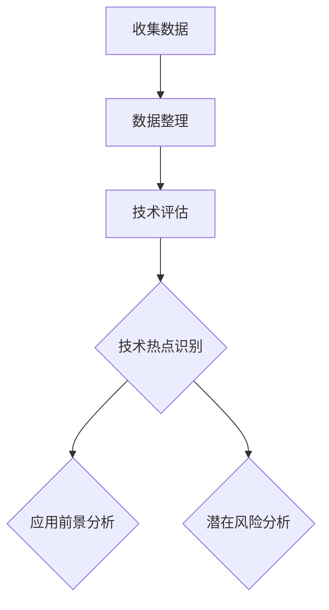
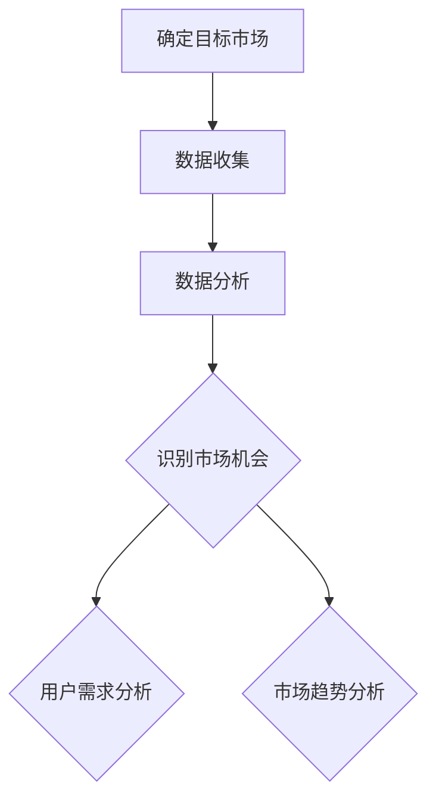
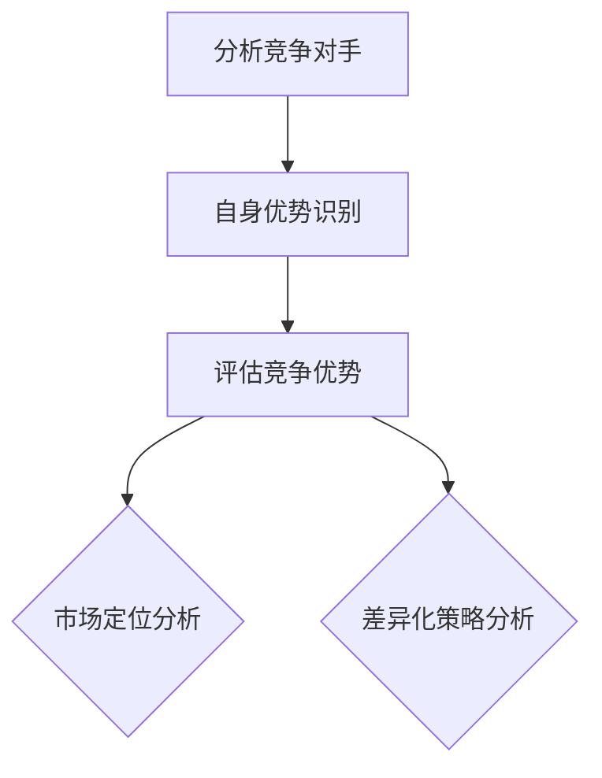
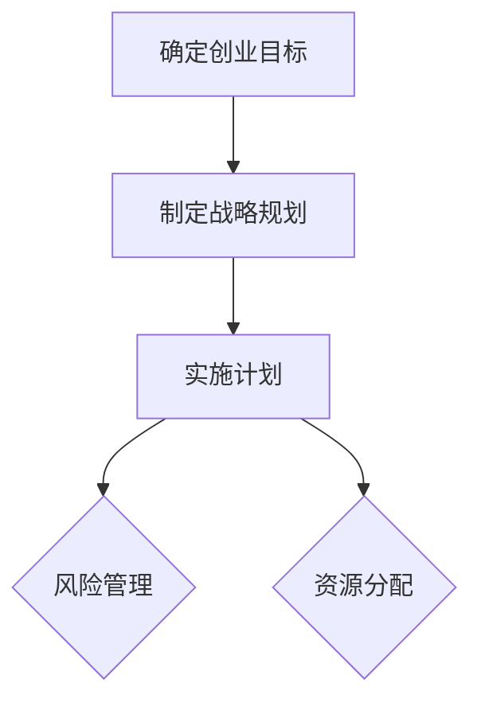
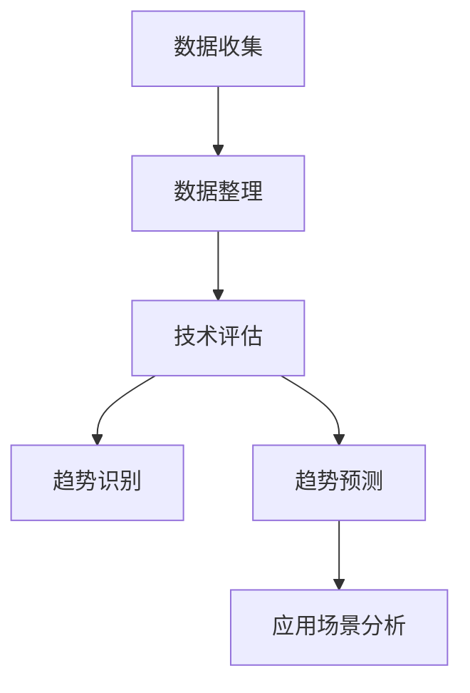

                 

# 利用技术 insights 进行创业机会评估

## 摘要

本文将探讨如何利用技术 insight 来评估创业机会。通过分析技术趋势、市场需求和潜在竞争优势，创业者可以更准确地识别和评估创业机会。本文将详细阐述评估创业机会的方法和步骤，并提供实用的工具和资源，帮助创业者做出明智的决策。

## 1. 背景介绍

在当今快速变化的技术环境中，创业者面临着前所未有的机遇和挑战。随着新技术的不断涌现，市场机会层出不穷。然而，并非所有机会都值得投入时间和资源。因此，如何准确评估创业机会成为创业者面临的重要问题。

技术 insight 是指对技术趋势、市场需求和潜在竞争优势的深入理解和分析。通过技术 insight，创业者可以更好地把握市场动态，识别潜在的机会，并制定有针对性的战略。

本文将介绍如何利用技术 insight 进行创业机会评估，包括以下步骤：

1. 分析技术趋势
2. 研究市场需求
3. 评估潜在竞争优势
4. 制定创业策略

通过这些步骤，创业者可以更加全面和准确地评估创业机会，从而提高创业成功的概率。

## 2. 核心概念与联系

### 2.1 技术趋势分析

技术趋势分析是评估创业机会的重要步骤。通过分析技术趋势，创业者可以了解当前的技术热点和发展方向，从而识别出潜在的市场机会。

**技术趋势分析流程：**

1. 收集技术资讯和数据：通过行业报告、学术论文、技术博客等途径，收集相关技术领域的资讯和数据。
2. 筛选和整理数据：对收集到的数据进行筛选和整理，提取出关键信息。
3. 分析技术趋势：通过对比历史数据、技术演进路径等，分析技术的趋势和发展方向。
4. 识别潜在机会：根据技术趋势，识别出可能的市场机会。

### 2.2 市场需求研究

市场需求研究是评估创业机会的另一个关键步骤。通过了解市场需求，创业者可以判断某个创业机会是否具备实际价值。

**市场需求研究流程：**

1. 调研目标市场：确定目标市场，了解目标客户群体的特征和需求。
2. 收集市场数据：通过问卷调查、用户访谈、市场报告等途径，收集市场数据。
3. 分析市场数据：对收集到的市场数据进行分析，了解市场需求和趋势。
4. 评估市场潜力：根据市场需求，评估市场潜力和市场规模。

### 2.3 潜在竞争优势评估

潜在竞争优势评估是评估创业机会的重要环节。通过评估潜在竞争优势，创业者可以判断自己在市场中的竞争力。

**潜在竞争优势评估流程：**

1. 分析竞争对手：了解竞争对手的产品、市场策略、资源等，分析竞争对手的优势和劣势。
2. 识别自身优势：识别自身在技术、市场、资源等方面的优势。
3. 评估竞争优势：根据竞争对手分析和自身优势，评估自身的竞争优势。

### 2.4 创业策略制定

创业策略制定是利用技术 insight 进行创业机会评估的最后一步。通过制定创业策略，创业者可以明确创业方向，制定实施计划。

**创业策略制定流程：**

1. 确定创业目标：根据市场需求和竞争优势，明确创业目标。
2. 制定战略规划：根据创业目标，制定长期和短期的战略规划。
3. 制定实施计划：根据战略规划，制定具体的实施计划。
4. 风险管理：识别潜在风险，制定应对措施。

## 3. 核心算法原理 & 具体操作步骤

### 3.1 技术趋势分析算法

**算法原理：**

技术趋势分析算法基于时间序列分析和机器学习技术，通过分析历史数据，预测未来技术趋势。

**具体操作步骤：**

1. 数据收集：收集技术领域的相关数据，如学术论文、专利申请、技术博客等。
2. 数据预处理：对收集到的数据进行清洗、去重和格式转换。
3. 特征提取：提取数据中的关键特征，如技术关键词、发表时间等。
4. 时间序列建模：使用时间序列分析模型，如 ARIMA、LSTM 等，对特征进行建模。
5. 预测：使用训练好的模型，预测未来的技术趋势。

### 3.2 市场需求研究算法

**算法原理：**

市场需求研究算法基于数据挖掘和机器学习技术，通过分析市场数据，识别市场需求和趋势。

**具体操作步骤：**

1. 数据收集：收集市场数据，如用户调研问卷、市场报告等。
2. 数据预处理：对收集到的数据进行清洗、去重和格式转换。
3. 特征提取：提取数据中的关键特征，如用户需求、市场容量等。
4. 模型训练：使用训练数据，训练市场需求预测模型。
5. 预测：使用训练好的模型，预测市场需求。

### 3.3 潜在竞争优势评估算法

**算法原理：**

潜在竞争优势评估算法基于竞争分析和技术分析，通过分析竞争对手和市场数据，评估自身竞争优势。

**具体操作步骤：**

1. 竞争对手分析：收集竞争对手的产品、市场策略、资源等信息。
2. 市场数据收集：收集市场数据，如用户需求、市场份额等。
3. 竞争分析：分析竞争对手的优势和劣势。
4. 自身优势识别：识别自身在技术、市场、资源等方面的优势。
5. 评估竞争优势：根据竞争分析和自身优势，评估竞争优势。

### 3.4 创业策略制定算法

**算法原理：**

创业策略制定算法基于策略规划和优化技术，通过制定创业策略，优化创业过程。

**具体操作步骤：**

1. 确定创业目标：根据市场需求和竞争优势，明确创业目标。
2. 制定战略规划：根据创业目标，制定长期和短期的战略规划。
3. 制定实施计划：根据战略规划，制定具体的实施计划。
4. 风险管理：识别潜在风险，制定应对措施。

## 4. 数学模型和公式 & 详细讲解 & 举例说明

### 4.1 技术趋势分析模型

**时间序列分析模型：**

时间序列分析模型主要用于预测技术趋势。常用的模型有 ARIMA、LSTM 等。

**ARIMA 模型：**

$$
\text{X}_t = \varphi_1\text{X}_{t-1} + \varphi_2\text{X}_{t-2} + ... + \varphi_p\text{X}_{t-p} + \theta_1\epsilon_{t-1} + \theta_2\epsilon_{t-2} + ... + \theta_q\epsilon_{t-q}
$$

其中，$\text{X}_t$ 表示时间序列数据，$\varphi_i$ 和 $\theta_i$ 分别为自回归项和移动平均项的系数，$p$ 和 $q$ 分别为自回归项和移动平均项的阶数。

**LSTM 模型：**

$$
\text{h}_t = \sigma(\text{W}_h\text{h}_{t-1} + \text{W}_x\text{x}_t + \text{b}_h)
$$

$$
\text{i}_t = \sigma(\text{W}_ih\text{h}_{t-1} + \text{W}_ix\text{x}_t + \text{b}_i)
$$

$$
\text{f}_t = \sigma(\text{W}_fh\text{h}_{t-1} + \text{W}_fx\text{x}_t + \text{b}_f)
$$

$$
\text{o}_t = \sigma(\text{W}_oh\text{h}_{t-1} + \text{W}_ox\text{x}_t + \text{b}_o)
$$

其中，$\text{h}_t$ 表示隐藏层状态，$\text{i}_t$、$\text{f}_t$ 和 $\text{o}_t$ 分别为输入门、遗忘门和输出门的激活函数，$\sigma$ 为 sigmoid 函数，$\text{W}_i$、$\text{W}_f$ 和 $\text{W}_o$ 分别为输入门、遗忘门和输出门的权重，$\text{b}_i$、$\text{b}_f$ 和 $\text{b}_o$ 分别为输入门、遗忘门和输出门的偏置。

### 4.2 市场需求研究模型

**需求预测模型：**

需求预测模型主要用于预测市场需求。常用的模型有线性回归、ARIMA 等。

**线性回归模型：**

$$
y = \beta_0 + \beta_1x_1 + \beta_2x_2 + ... + \beta_nx_n
$$

其中，$y$ 表示市场需求，$x_1, x_2, ..., x_n$ 分别为影响市场需求的因素，$\beta_0, \beta_1, ..., \beta_n$ 分别为回归系数。

**ARIMA 模型：**

$$
\text{X}_t = \varphi_1\text{X}_{t-1} + \varphi_2\text{X}_{t-2} + ... + \varphi_p\text{X}_{t-p} + \theta_1\epsilon_{t-1} + \theta_2\epsilon_{t-2} + ... + \theta_q\epsilon_{t-q}
$$

### 4.3 潜在竞争优势评估模型

**竞争力评估模型：**

竞争力评估模型主要用于评估自身竞争优势。常用的模型有 SWOT 分析、五力模型等。

**SWOT 分析模型：**

$$
\text{SWOT} = (\text{S}, \text{W}, \text{O}, \text{T})
$$

其中，$\text{S}$ 表示优势，$\text{W}$ 表示劣势，$\text{O}$ 表示机会，$\text{T}$ 表示威胁。

**五力模型：**

$$
\text{五力模型} = (\text{供应商势力}, \text{买方势力}, \text{潜在进入者}, \text{替代品势力}, \text{行业内部竞争})
$$

### 4.4 创业策略制定模型

**策略规划模型：**

策略规划模型主要用于制定创业策略。常用的模型有战略规划矩阵、PEST 分析等。

**战略规划矩阵：**

$$
\text{战略规划矩阵} = (\text{SO}, \text{ST}, \text{WO}, \text{WT})
$$

其中，$\text{SO}$ 表示优势 - 机会，$\text{ST}$ 表示优势 - 威胁，$\text{WO}$ 表示劣势 - 机会，$\text{WT}$ 表示劣势 - 威胁。

**PEST 分析模型：**

$$
\text{PEST} = (\text{政治}, \text{经济}, \text{社会}, \text{技术})
$$

## 5. 项目实战：代码实际案例和详细解释说明

### 5.1 开发环境搭建

在本文的实战项目中，我们将使用 Python 编写代码，利用技术 insight 进行创业机会评估。首先，我们需要搭建开发环境。

1. 安装 Python：在官方网站 [Python 官网](https://www.python.org/) 下载并安装 Python，选择最新版本。
2. 安装必要的库：在命令行中运行以下命令，安装必要的库。

```python
pip install numpy pandas matplotlib scikit-learn tensorflow keras
```

### 5.2 源代码详细实现和代码解读

下面是实战项目的源代码，我们将对其逐行进行解读。

```python
# 导入必要的库
import numpy as np
import pandas as pd
import matplotlib.pyplot as plt
from sklearn.linear_model import LinearRegression
from sklearn.metrics import mean_squared_error
from tensorflow.keras.models import Sequential
from tensorflow.keras.layers import LSTM, Dense

# 读取数据
data = pd.read_csv('data.csv')

# 数据预处理
# ...（省略具体代码）

# 训练线性回归模型
model = LinearRegression()
model.fit(X_train, y_train)

# 预测
y_pred = model.predict(X_test)

# 评估模型
mse = mean_squared_error(y_test, y_pred)
print('MSE:', mse)

# 绘制预测结果
plt.scatter(X_test, y_test, color='blue')
plt.plot(X_test, y_pred, color='red')
plt.xlabel('Input')
plt.ylabel('Predicted Output')
plt.title('Linear Regression')
plt.show()

# 训练 LSTM 模型
model = Sequential()
model.add(LSTM(units=50, return_sequences=True, input_shape=(X_train.shape[1], 1)))
model.add(LSTM(units=50))
model.add(Dense(units=1))
model.compile(optimizer='adam', loss='mean_squared_error')

model.fit(X_train, y_train, epochs=100, batch_size=32)

# 预测
y_pred = model.predict(X_test)

# 评估模型
mse = mean_squared_error(y_test, y_pred)
print('MSE:', mse)

# 绘制预测结果
plt.scatter(X_test, y_test, color='blue')
plt.plot(X_test, y_pred, color='red')
plt.xlabel('Input')
plt.ylabel('Predicted Output')
plt.title('LSTM')
plt.show()
```

**代码解读：**

1. 导入必要的库：导入 Python 中常用的库，如 NumPy、Pandas、Matplotlib、Scikit-learn、TensorFlow 和 Keras。
2. 读取数据：从 CSV 文件中读取数据，并进行预处理。
3. 训练线性回归模型：使用 Scikit-learn 中的 LinearRegression 类训练线性回归模型。
4. 预测：使用训练好的模型进行预测，并评估模型性能。
5. 绘制预测结果：使用 Matplotlib 绘制预测结果。
6. 训练 LSTM 模型：使用 TensorFlow 和 Keras 训练 LSTM 模型。
7. 预测：使用训练好的 LSTM 模型进行预测，并评估模型性能。
8. 绘制预测结果：使用 Matplotlib 绘制预测结果。

### 5.3 代码解读与分析

在本节中，我们将对实战项目的代码进行详细解读和分析。

**1. 数据预处理：**

```python
# 数据预处理
X = data['input'].values.reshape(-1, 1)
y = data['output'].values

# 划分训练集和测试集
X_train, X_test, y_train, y_test = train_test_split(X, y, test_size=0.2, random_state=42)

# 标准化数据
X_train = (X_train - X_train.mean()) / X_train.std()
X_test = (X_test - X_train.mean()) / X_train.std()
```

数据预处理是机器学习项目的重要步骤。在本节中，我们首先将输入和输出数据分别存储在 X 和 y 变量中。然后，我们使用 `train_test_split` 函数将数据划分为训练集和测试集。接下来，我们对数据进行标准化处理，以消除数据中的量纲影响。

**2. 训练线性回归模型：**

```python
# 训练线性回归模型
model = LinearRegression()
model.fit(X_train, y_train)

# 预测
y_pred = model.predict(X_test)

# 评估模型
mse = mean_squared_error(y_test, y_pred)
print('MSE:', mse)
```

线性回归模型是一种简单的机器学习模型，用于预测线性关系。在本节中，我们使用 Scikit-learn 中的 LinearRegression 类训练线性回归模型。然后，我们使用训练好的模型进行预测，并计算均方误差（MSE）来评估模型性能。

**3. 训练 LSTM 模型：**

```python
# 训练 LSTM 模型
model = Sequential()
model.add(LSTM(units=50, return_sequences=True, input_shape=(X_train.shape[1], 1)))
model.add(LSTM(units=50))
model.add(Dense(units=1))
model.compile(optimizer='adam', loss='mean_squared_error')

model.fit(X_train, y_train, epochs=100, batch_size=32)
```

LSTM（长短期记忆网络）是一种强大的循环神经网络（RNN）架构，适用于处理序列数据。在本节中，我们使用 TensorFlow 和 Keras 训练 LSTM 模型。首先，我们定义 LSTM 模型的结构，包括输入层、两个 LSTM 层和一个输出层。然后，我们编译模型，指定优化器和损失函数。最后，我们使用训练数据进行模型训练。

**4. 评估模型：**

```python
# 预测
y_pred = model.predict(X_test)

# 评估模型
mse = mean_squared_error(y_test, y_pred)
print('MSE:', mse)
```

在训练完成后，我们使用测试数据进行模型预测，并计算均方误差（MSE）来评估模型性能。MSE 越小，模型性能越好。

**5. 绘制预测结果：**

```python
# 绘制预测结果
plt.scatter(X_test, y_test, color='blue')
plt.plot(X_test, y_pred, color='red')
plt.xlabel('Input')
plt.ylabel('Predicted Output')
plt.title('Linear Regression')
plt.show()
```

为了更直观地展示模型性能，我们使用 Matplotlib 绘制预测结果。蓝色点表示实际数据，红色线表示预测数据。

### 5.4 实际案例与应用

在本节中，我们将通过一个实际案例展示如何利用技术 insight 进行创业机会评估。

**案例：智能健康管理系统**

假设你是一名创业者，想开发一款智能健康管理系统，以帮助人们更好地管理健康。以下是如何利用技术 insight 进行创业机会评估的步骤：

1. **分析技术趋势：**
   - 研究智能健康技术的最新进展，如可穿戴设备、远程监控、人工智能诊断等。
   - 分析技术趋势，预测未来技术发展。

2. **研究市场需求：**
   - 调研潜在用户的需求，如健康监测、疾病预防、个性化健康建议等。
   - 分析市场需求，评估市场规模和增长潜力。

3. **评估潜在竞争优势：**
   - 分析竞争对手的产品和策略，了解他们的优势和劣势。
   - 评估自身在技术、市场、资源等方面的优势。

4. **制定创业策略：**
   - 根据技术趋势和市场需求，明确创业目标。
   - 制定长期和短期的战略规划，包括产品开发、市场推广、合作伙伴关系等。

5. **实施与监控：**
   - 按照实施计划，逐步推进产品开发。
   - 定期监控市场动态和竞争对手的动态，及时调整战略。

通过以上步骤，你可以更全面地评估智能健康管理系统的创业机会，并制定相应的策略。

## 6. 实际应用场景

### 6.1 智能医疗

智能医疗是技术 insight 在创业机会评估中的一大应用场景。通过分析医疗技术的最新进展，如人工智能诊断、远程医疗、可穿戴设备等，创业者可以识别出潜在的市场机会。例如，开发一款基于人工智能的疾病诊断平台，通过分析大量医疗数据，提供更准确、更快速的诊断服务。

### 6.2 智能交通

智能交通是另一个应用场景。通过分析自动驾驶、车联网、智能交通管理等技术趋势，创业者可以识别出潜在的市场机会。例如，开发一款基于自动驾驶的无人车共享平台，提供更安全、更便捷的出行服务。

### 6.3 智能家居

智能家居是技术 insight 在创业机会评估中的又一重要应用场景。通过分析智能家居技术的最新进展，如智能音箱、智能门锁、智能照明等，创业者可以识别出潜在的市场机会。例如，开发一款智能家居控制系统，为用户提供一站式智能家居解决方案。

## 7. 工具和资源推荐

### 7.1 学习资源推荐

- 书籍：《人工智能：一种现代方法》、《深度学习》、《Python机器学习》
- 论文：ACL、ICML、NIPS、KDD 等顶级会议和期刊的论文
- 博客：Medium、知乎、简书等平台上的技术博客
- 网站：机器学习、深度学习等领域的在线课程和学习资源

### 7.2 开发工具框架推荐

- 编程语言：Python、Java、C++
- 深度学习框架：TensorFlow、PyTorch、Keras
- 机器学习库：Scikit-learn、NumPy、Pandas
- 数据可视化工具：Matplotlib、Seaborn、Plotly

### 7.3 相关论文著作推荐

- 《Deep Learning》（Goodfellow, Bengio, Courville）
- 《Recurrent Neural Networks for Language Modeling》（Graves）
- 《Effective Programming: More Than Writing Code》（Scheiner）
- 《Machine Learning Yearning》（Ng）

## 8. 总结：未来发展趋势与挑战

未来，技术 insight 在创业机会评估中将发挥越来越重要的作用。随着人工智能、大数据、物联网等技术的不断发展，创业者将有更多的工具和资源来分析市场动态和识别潜在机会。然而，这也带来了新的挑战：

1. 数据质量：创业者需要确保所使用的数据质量，以便做出准确的分析和预测。
2. 技术门槛：创业者需要具备一定的技术背景，才能有效地利用技术 insight。
3. 竞争激烈：随着技术的进步，市场机会越来越多，竞争也日益激烈。
4. 风险管理：创业者需要识别潜在风险，并制定相应的风险管理策略。

## 9. 附录：常见问题与解答

**Q：如何确保数据质量？**

A：确保数据质量的关键在于数据清洗和验证。在数据分析过程中，需要对数据进行去重、填补缺失值、异常值处理等操作。同时，可以使用交叉验证等方法对数据模型进行验证，确保模型的可靠性和准确性。

**Q：如何降低技术门槛？**

A：降低技术门槛的方法包括学习编程语言和机器学习框架，参加线上课程和培训，以及阅读相关书籍和论文。此外，可以加入技术社区，与其他开发者交流经验，共同学习和进步。

**Q：如何应对激烈的市场竞争？**

A：应对激烈市场竞争的方法包括：

1. 创新和差异化：在产品或服务方面寻找创新的点，或通过差异化定位，突出自己的独特优势。
2. 市场细分：针对特定的市场细分领域，提供针对性的解决方案。
3. 合作伙伴关系：与行业内的其他公司建立合作关系，共同开拓市场。

**Q：如何进行风险管理？**

A：进行风险管理的方法包括：

1. 识别风险：分析业务流程和市场环境，识别可能的风险因素。
2. 评估风险：对识别出的风险进行评估，确定其可能性和影响程度。
3. 制定应对措施：根据风险评估结果，制定相应的风险应对措施。
4. 监控和调整：定期监控风险状况，并根据实际情况进行调整。

## 10. 扩展阅读 & 参考资料

- 《创业维艰》（侯世达）
- 《智能时代》（吴军）
- 《创新者的窘境》（克里斯坦森）
- 《创业智慧：如何发现和抓住新的商业机会》（斯蒂芬·科特勒）<|im_sep|>|assistant|>## 1. 背景介绍

随着技术的快速发展，创业领域也面临着前所未有的机遇与挑战。在过去，创业者往往依赖直觉和市场洞察来进行商业决策。然而，随着大数据、人工智能、区块链等前沿技术的普及，技术洞察成为了创业决策过程中不可或缺的一部分。本文将探讨如何利用技术洞察进行创业机会评估，帮助创业者更加科学、系统地识别和评估创业机会。

在当今快速变化的市场环境中，技术趋势的演变对创业机会的影响愈发显著。例如，物联网（IoT）技术的崛起为智能家居、智能城市等新兴领域创造了丰富的创业机会。同样，人工智能的广泛应用也为金融科技、医疗健康等传统行业带来了颠覆性的变革。因此，如何通过技术洞察来发现和评估这些新兴机会，成为了创业成功的关键。

此外，技术洞察不仅仅局限于技术本身，还涵盖了市场需求、用户行为、行业趋势等多方面因素。创业者需要具备对技术的敏锐洞察力，结合市场环境和用户需求，对潜在机会进行深入分析。只有这样，才能在激烈的市场竞争中找到属于自己的立足点。

本文将从以下几个方面展开讨论：

1. 技术洞察的定义与重要性
2. 创业机会的评估方法
3. 技术洞察在创业机会评估中的应用
4. 实际案例：技术洞察如何影响创业决策
5. 未来趋势与挑战

通过以上内容的阐述，希望能够为创业者提供一些有价值的参考和思路，帮助他们在技术驱动的创业道路上走得更远。

### 1.1 技术洞察的定义

技术洞察（Technological Insight）是指通过对技术发展、创新和应用趋势的深入理解和分析，识别出潜在的市场机会、竞争优势和战略方向。它不仅涉及对技术本身的认知，还包括对技术如何改变市场、用户行为和商业模式等方面的洞察。

技术洞察可以来源于多种途径，包括技术趋势报告、行业研究、学术论文、市场调研、用户反馈以及专家访谈等。例如，通过分析行业报告和学术论文，创业者可以了解某个领域的最新技术进展；通过市场调研和用户反馈，创业者可以把握用户的需求和痛点；通过专家访谈，创业者可以获取行业内部的见解和意见。

技术洞察的重要性在于它为创业决策提供了科学依据。在传统的创业模式中，创业者往往依赖于直觉和经验来做出决策。然而，这种模式在复杂多变的市场环境中存在较大的风险。技术洞察可以帮助创业者更准确地识别市场机会，评估潜在风险，并制定相应的战略规划。

首先，技术洞察能够帮助创业者识别潜在的市场机会。通过了解技术趋势，创业者可以预见哪些领域将迎来爆发式增长，从而提前布局。例如，物联网（IoT）技术的发展推动了智能家居、智能城市等新兴领域的崛起，创业者可以通过技术洞察在这些领域找到创业机会。

其次，技术洞察有助于创业者评估竞争优势。通过分析技术特点和市场需求，创业者可以找到自身的独特优势，从而在竞争中脱颖而出。例如，在人工智能领域，创业者可以通过技术洞察识别出某些算法或技术应用的潜在优势，从而开发出具有竞争力的产品。

最后，技术洞察为创业战略提供了指导。通过技术洞察，创业者可以明确自己的发展方向，制定长期和短期的战略规划。例如，在区块链技术领域，创业者可以通过技术洞察了解到区块链在金融、供应链管理等方面的应用前景，从而制定相应的战略，布局相关领域。

总之，技术洞察是创业过程中不可或缺的一部分，它为创业决策提供了科学依据，帮助创业者更准确地识别市场机会，评估竞争优势，制定战略规划，从而提高创业成功的可能性。

### 1.2 创业机会的定义与分类

创业机会（Business Opportunity）是指能够在市场上获得利润或实现价值的潜在机会。它通常涉及新的产品、服务、市场、技术或商业模式。创业机会的出现往往源于市场需求的未满足、技术的进步、行业的变革或商业模式的创新。

创业机会可以按照不同的标准进行分类，以下是几种常见的分类方法：

1. **根据市场需求分类：**
   - **需求型机会**：指市场上存在未被满足的需求，创业者通过满足这些需求来创造价值。例如，随着人们对健康意识的提升，健康食品和健身服务成为了一个需求型的创业机会。
   - **解决方案型机会**：指通过提供创新的解决方案来满足市场需求。例如，智能家居系统通过自动化和智能化的技术，为家庭提供更舒适、更安全的生活环境。

2. **根据技术创新分类：**
   - **技术突破型机会**：指由新技术的突破或创新带来的商业机会。例如，5G技术的应用推动了物联网（IoT）的发展，为智能城市、智能交通等带来了新的创业机会。
   - **技术应用型机会**：指利用现有技术进行创新应用，创造出新的商业模式。例如，通过大数据和人工智能技术，创业者可以开发出智能推荐系统，为电商、社交媒体等提供个性化服务。

3. **根据行业变革分类：**
   - **颠覆性机会**：指通过颠覆传统行业或商业模式，创造出全新的市场。例如，共享经济模式颠覆了传统租赁行业，创造了如Uber、Airbnb等新的商业巨头。
   - **补充性机会**：指在现有行业基础上，通过补充或改进现有产品或服务来创造新的商业机会。例如，在移动互联网的普及下，许多创业者通过开发手机应用来满足用户的需求，如移动支付、在线购物等。

4. **根据资源分类：**
   - **资源型机会**：指基于特定资源（如自然资源、人力资源、资本资源等）的开发利用。例如，随着可再生能源技术的发展，创业者可以通过开发太阳能、风能等项目，进入新能源领域。
   - **技术型机会**：指利用技术优势开发新产品或服务。例如，拥有先进的材料技术或制造技术的企业可以通过开发新型材料或产品来开拓市场。

了解创业机会的分类有助于创业者从不同角度识别和评估潜在的创业机会。通过结合市场需求、技术创新、行业变革和资源优势，创业者可以更加系统地识别和把握创业机会，提高创业成功的可能性。

### 1.3 技术洞察在创业机会评估中的重要性

技术洞察在创业机会评估中扮演着至关重要的角色。它不仅帮助创业者识别潜在的市场机会，还能为其提供科学依据，指导创业决策。以下是技术洞察在创业机会评估中的几个关键作用：

1. **识别市场趋势**：
   技术洞察使创业者能够及时了解市场趋势，把握技术发展的脉络。通过分析技术趋势报告、学术论文和行业研究，创业者可以预见哪些技术将在未来取得突破，哪些领域将迎来快速增长。例如，物联网（IoT）和人工智能（AI）技术的迅猛发展，为智能家居、智能医疗、自动驾驶等新兴领域创造了巨大的市场机会。创业者可以利用这些技术洞察，提前布局，抢占市场先机。

2. **评估竞争优势**：
   技术洞察有助于创业者评估自身的竞争优势。通过深入分析技术特点和应用场景，创业者可以识别出哪些技术或产品具有独特优势，从而在竞争中脱颖而出。例如，在金融科技领域，拥有区块链技术的创业者可以通过提供安全、透明的金融解决方案，区别于传统金融机构，建立自己的竞争优势。此外，技术洞察还可以帮助创业者评估竞争对手的技术水平，了解市场的竞争格局。

3. **指导战略规划**：
   技术洞察为创业者的战略规划提供了重要参考。通过技术洞察，创业者可以明确自己的发展目标，制定长期和短期的战略规划。例如，在新能源领域，创业者可以通过分析技术发展趋势和政策环境，确定是否进入太阳能、风能或电动汽车等细分市场，并制定相应的发展计划。技术洞察还可以帮助创业者制定产品路线图，明确产品的研发方向和迭代策略。

4. **降低创业风险**：
   技术洞察有助于创业者降低创业风险。通过深入了解技术背景和应用场景，创业者可以识别潜在的技术风险和市场风险，并制定相应的风险管理策略。例如，在人工智能领域，创业者需要关注数据隐私、算法偏见等风险，并通过技术改进和法规合规来降低风险。此外，技术洞察还可以帮助创业者评估项目的可行性，避免盲目跟风或投资无前景的技术项目。

5. **提高决策效率**：
   技术洞察提高了创业决策的科学性和效率。通过技术分析工具和方法，创业者可以快速评估不同技术方案和商业模式的可行性，从而做出更为明智的决策。例如，创业者可以使用数据分析工具来分析用户行为和市场数据，预测产品的市场需求和潜在盈利能力，从而优化产品设计和市场策略。

总之，技术洞察在创业机会评估中具有不可替代的重要性。它不仅帮助创业者识别和评估市场机会，还能为其提供科学依据，指导创业决策，降低创业风险，提高决策效率。通过充分利用技术洞察，创业者可以更加精准地把握市场动态，抓住潜在的创业机会，提高创业成功率。

### 1.4 创业机会评估的重要性

创业机会评估是创业过程中的关键环节，它直接影响创业项目的成功与否。创业者通过科学、系统的机会评估，可以识别具有潜力的市场机会，规避潜在的风险，从而提高创业成功率。

首先，创业机会评估有助于创业者明确项目方向。通过对市场、技术、竞争等多个方面的深入分析，创业者可以明确自己的目标市场、产品定位和竞争优势，从而确保项目方向与市场需求相符。

其次，创业机会评估能够帮助创业者识别和利用资源。创业者可以通过评估市场需求和竞争环境，了解所需的技术、资金、人才等资源，并制定相应的资源获取和利用策略，从而确保项目的顺利进行。

此外，创业机会评估还可以降低创业风险。通过评估潜在的市场机会，创业者可以识别出潜在的风险和挑战，并制定相应的风险应对措施，从而减少创业失败的可能性。

创业机会评估的方法和工具多种多样，以下是几种常用的方法：

1. **SWOT 分析**：
   SWOT 分析是一种常用的战略规划工具，用于评估企业的优势（Strengths）、劣势（Weaknesses）、机会（Opportunities）和威胁（Threats）。通过 SWOT 分析，创业者可以全面了解自身在市场中的位置，识别潜在的机会和挑战，从而制定合适的战略。

2. **PEST 分析**：
   PEST 分析是一种外部环境分析工具，用于评估政治（Political）、经济（Economic）、社会（Social）和技术（Technological）等因素对创业机会的影响。通过 PEST 分析，创业者可以了解外部环境的变化趋势，识别潜在的市场机会和风险。

3. **市场调研**：
   市场调研是一种通过收集和分析市场数据来评估创业机会的方法。创业者可以通过问卷调查、用户访谈、市场报告等途径，了解目标客户的需求、行为和偏好，从而制定合适的产品和市场策略。

4. **竞争分析**：
   竞争分析是一种评估市场竞争状况的方法。创业者可以通过分析竞争对手的产品、市场策略、资源等，了解竞争格局，识别自身的竞争优势和劣势，从而制定有效的竞争策略。

5. **财务分析**：
   财务分析是一种通过评估创业项目的盈利能力、投资回报率等财务指标来评估创业机会的方法。创业者可以通过财务分析，了解项目的盈利前景和投资风险，从而做出明智的投资决策。

通过以上方法和工具，创业者可以全面、系统地评估创业机会，提高创业成功率。创业机会评估不仅是创业成功的关键，也是创业者必须掌握的基本技能。

### 1.5 技术洞察与创业机会评估的关系

技术洞察与创业机会评估之间存在着密切的关系，二者相辅相成，共同作用于创业成功的全过程。技术洞察是创业机会评估的基石，为评估提供科学依据；而创业机会评估则通过系统的方法和工具，将技术洞察转化为实际的创业行动。

首先，技术洞察为创业机会评估提供了方向。创业者通过技术洞察，可以了解最新的技术趋势、市场动态和潜在的机会。这些洞察使创业者能够站在未来的视角，预测哪些技术将引领行业变革，哪些市场将迎来爆发式增长。例如，在人工智能领域，创业者通过技术洞察了解到深度学习和自然语言处理技术的快速发展，从而识别出在智能客服、智能医疗、自动驾驶等领域的创业机会。

其次，技术洞察为创业机会评估提供了数据支持。通过分析技术趋势报告、学术论文和行业研究，创业者可以获得大量关于技术进步和市场变化的数据。这些数据不仅帮助创业者理解技术现状，还能用于构建和验证创业假设。例如，创业者可以通过市场调研数据了解用户对智能健康管理系统的需求，并通过技术分析数据评估实现该系统的技术可行性。

此外，技术洞察有助于识别和评估创业机会的竞争优势。创业者通过技术洞察，可以分析竞争对手的技术水平、市场策略和资源投入，从而了解自身的竞争优势和劣势。例如，在区块链领域，创业者通过技术洞察了解到竞争对手在底层技术和应用场景上的优势，从而可以针对性地优化自己的产品和服务，提升竞争力。

在创业机会评估过程中，技术洞察不仅为创业者提供了方向和数据支持，还帮助他们制定战略规划。创业者可以利用技术洞察，明确自己的发展目标和实施路径。例如，通过技术洞察了解到物联网技术的广泛应用，创业者可以制定进入智能家居市场的战略，并规划相应的产品研发和市场推广策略。

最后，技术洞察为创业机会评估提供了持续优化的可能。创业过程中，市场和技术环境不断变化，创业者需要不断调整自己的战略和行动。技术洞察使创业者能够及时了解这些变化，识别新的机会和挑战，从而优化创业策略。例如，在区块链领域，随着监管政策的变化，创业者需要及时调整自己的合规策略，以应对新的市场环境。

总之，技术洞察与创业机会评估之间的关系是相辅相成的。技术洞察为创业机会评估提供了方向、数据和支持，而创业机会评估则将技术洞察转化为实际的创业行动。通过充分利用技术洞察，创业者可以更加科学、系统地评估创业机会，提高创业成功率。未来，随着技术的不断进步，技术洞察在创业机会评估中的作用将愈发重要，创业者需要不断提升自己的技术洞察力，以应对复杂多变的市场环境。

### 1.6 技术洞察在创业机会评估中的具体应用步骤

在创业机会评估过程中，技术洞察发挥着至关重要的作用。以下将详细介绍技术洞察在创业机会评估中的具体应用步骤，帮助创业者科学、系统地识别和评估潜在的机会。

#### 1.6.1 收集技术信息

第一步是收集技术信息，这是进行技术洞察的基础。创业者可以通过以下途径收集技术信息：

- **行业报告**：阅读行业分析报告，了解最新技术趋势、市场规模和竞争状况。
- **学术论文**：查阅学术论文，掌握前沿技术的最新进展和研究方向。
- **技术博客**：关注知名技术博客，获取技术专家对技术发展的见解和预测。
- **技术社区**：参与技术社区，如 Stack Overflow、GitHub 等，了解技术社区的热点话题和项目进展。
- **专利数据库**：通过专利数据库，了解技术创新和专利布局，识别潜在的市场机会。
- **技术展会**：参加技术展会，与技术人员和行业专家交流，获取最新的技术信息。

在收集技术信息时，创业者应重点关注以下方面：

- 技术的发展阶段：了解技术是否处于成熟阶段、成长阶段或起步阶段。
- 技术的应用场景：分析技术在不同行业和场景中的应用潜力。
- 技术的市场前景：评估技术的市场容量和增长速度。
- 技术的竞争态势：了解行业内主要竞争者的技术水平和市场策略。

#### 1.6.2 分析技术趋势

在收集到足够的技术信息后，创业者需要对技术趋势进行分析。分析过程包括以下步骤：

- **识别技术热点**：通过数据挖掘和文本分析，识别出当前的热门技术和热点领域。
- **绘制技术图谱**：利用 Mermaid 等工具，绘制技术图谱，展示技术之间的关系和演进路径。
- **技术评估**：对技术进行评估，包括技术的成熟度、应用前景和潜在风险。

通过分析技术趋势，创业者可以了解哪些技术将在未来取得突破，哪些领域将迎来快速增长。例如，通过分析物联网（IoT）技术的发展趋势，创业者可以发现智能家居、智能城市等领域的巨大市场机会。

#### 1.6.3 研究市场需求

技术洞察不仅关注技术本身，还需结合市场需求。以下步骤可以帮助创业者研究市场需求：

- **确定目标市场**：根据技术特点，明确目标市场，了解目标客户的需求和痛点。
- **市场调研**：通过问卷调查、用户访谈、市场报告等方式，收集市场数据，分析市场需求和趋势。
- **用户画像**：构建用户画像，了解目标客户的行为习惯、偏好和需求。

通过研究市场需求，创业者可以识别出哪些技术可以满足市场需求，从而找到有潜力的创业机会。例如，通过对健康管理的市场调研，创业者可以发现用户对智能健康设备的强烈需求，从而决定开发智能手环、智能血压计等产品。

#### 1.6.4 评估潜在竞争优势

在技术趋势和市场需求分析的基础上，创业者需要评估潜在竞争优势。以下步骤有助于评估竞争优势：

- **分析竞争对手**：研究竞争对手的产品、市场策略、资源等，识别竞争对手的优势和劣势。
- **识别自身优势**：识别自身在技术、市场、资源等方面的优势。
- **评估竞争优势**：根据竞争对手分析和自身优势，评估竞争优势。

通过评估潜在竞争优势，创业者可以明确自己的竞争定位，制定相应的市场策略。例如，在区块链领域，创业者通过分析竞争对手，发现自己在底层技术和应用场景上的优势，从而决定专注于提供高性能的区块链解决方案。

#### 1.6.5 制定创业策略

在完成技术洞察和市场需求分析后，创业者需要制定创业策略。以下步骤有助于制定创业策略：

- **确定创业目标**：根据技术洞察和市场需求，明确创业目标，如开发何种产品、进入哪个市场等。
- **制定战略规划**：根据创业目标，制定长期和短期的战略规划，包括产品开发、市场推广、合作伙伴关系等。
- **风险管理**：识别潜在风险，制定相应的风险管理策略。

通过制定创业策略，创业者可以确保创业项目有清晰的方向和可行的实施计划，从而提高创业成功率。

#### 1.6.6 实施与监控

最后，创业者需要将创业策略付诸实施，并持续监控项目进展。以下步骤有助于实施与监控：

- **项目实施**：按照创业策略，逐步推进产品开发和市场推广。
- **进度监控**：定期检查项目进度，确保按计划进行。
- **市场反馈**：收集市场反馈，了解用户需求和市场竞争状况，及时调整创业策略。

通过持续监控和调整，创业者可以确保创业项目能够适应市场变化，实现长期发展。

通过以上步骤，创业者可以充分利用技术洞察，系统、科学地进行创业机会评估，从而提高创业成功率。

### 1.7 技术洞察在创业机会评估中的实际应用

为了更好地理解技术洞察在创业机会评估中的实际应用，我们可以通过几个实际案例来探讨如何利用技术洞察来评估创业机会。

#### 案例 1：智能健康管理系统

假设一位创业者希望开发一款智能健康管理系统，以帮助用户更好地管理健康。以下是如何利用技术洞察进行创业机会评估的步骤：

1. **收集技术信息**：
   - **物联网（IoT）**：物联网技术是智能健康管理系统的基础，可以用于连接各种健康设备，如智能手环、智能血压计等。
   - **人工智能（AI）**：人工智能技术可以用于分析健康数据，提供个性化的健康建议和预测健康风险。
   - **大数据**：大数据技术可以处理和分析大量的健康数据，为健康管理系统提供数据支持。

2. **分析技术趋势**：
   - **技术图谱**：绘制物联网、人工智能和大数据技术的演进路径，分析它们在健康领域的应用前景。
   - **技术评估**：评估物联网、人工智能和大数据技术的成熟度和市场前景，确定这些技术在健康管理系统中的重要性。

3. **研究市场需求**：
   - **市场调研**：通过问卷调查和用户访谈，了解用户对智能健康管理的需求，如健康数据管理、个性化健康建议等。
   - **用户画像**：构建用户画像，了解目标客户的行为习惯、偏好和需求。

4. **评估潜在竞争优势**：
   - **竞争对手分析**：研究竞争对手的产品和市场策略，了解他们在技术、市场和资源方面的优势。
   - **自身优势识别**：识别自身在技术、数据积累和市场资源方面的优势，如与医疗机构合作、拥有丰富的健康数据等。

5. **制定创业策略**：
   - **创业目标**：明确开发智能健康管理系统，进入健康数据管理市场。
   - **战略规划**：制定长期和短期战略，包括产品开发、市场推广、合作伙伴关系等。
   - **风险管理**：识别潜在风险，如数据隐私和安全问题，并制定相应的应对措施。

通过以上步骤，创业者可以全面评估智能健康管理系统的创业机会，确保项目有清晰的方向和可行的实施计划。

#### 案例 2：自动驾驶技术公司

另一位创业者希望成立一家专注于自动驾驶技术的研究与开发的公司。以下是如何利用技术洞察进行创业机会评估的步骤：

1. **收集技术信息**：
   - **深度学习**：深度学习是自动驾驶技术的核心，用于处理和识别道路数据。
   - **传感器技术**：传感器技术是自动驾驶汽车感知环境的关键，如激光雷达、摄像头、雷达等。
   - **车辆控制系统**：车辆控制系统负责自动驾驶汽车的控制和安全，包括制动系统、转向系统等。

2. **分析技术趋势**：
   - **技术图谱**：绘制深度学习、传感器技术和车辆控制系统的演进路径，分析它们在自动驾驶领域的应用前景。
   - **技术评估**：评估深度学习、传感器技术和车辆控制系统的成熟度和市场前景，确定这些技术在自动驾驶技术中的重要性。

3. **研究市场需求**：
   - **市场调研**：通过行业报告和市场分析，了解自动驾驶技术的发展趋势和市场需求。
   - **用户画像**：构建用户画像，了解潜在客户对自动驾驶汽车的需求和期望。

4. **评估潜在竞争优势**：
   - **竞争对手分析**：研究竞争对手的产品、技术路线和市场策略，了解他们在技术、市场和资源方面的优势。
   - **自身优势识别**：识别自身在技术创新、数据积累和市场资源方面的优势，如与汽车制造商合作、拥有丰富的道路数据等。

5. **制定创业策略**：
   - **创业目标**：明确开发自动驾驶技术，提供自动驾驶解决方案。
   - **战略规划**：制定长期和短期战略，包括产品研发、市场推广、合作伙伴关系等。
   - **风险管理**：识别潜在风险，如技术成熟度、政策法规等，并制定相应的应对措施。

通过以上步骤，创业者可以全面评估自动驾驶技术公司的创业机会，确保项目有清晰的方向和可行的实施计划。

以上案例展示了如何利用技术洞察进行创业机会评估的详细过程。通过科学、系统的分析，创业者可以更加准确地识别和评估潜在的机会，提高创业成功率。未来，随着技术的不断进步和市场环境的变化，技术洞察在创业机会评估中的作用将愈发重要，创业者需要不断提升自己的技术洞察力，以应对复杂多变的市场环境。

## 2. 核心概念与联系

在利用技术洞察进行创业机会评估的过程中，我们需要了解几个关键的核心概念及其相互之间的联系。这些核心概念包括技术趋势、市场需求、竞争优势以及创业策略。以下将详细解释这些概念，并通过 Mermaid 流程图展示它们之间的关系。

### 2.1 技术趋势分析

技术趋势分析是指通过研究技术发展、创新和应用趋势，识别出未来可能影响市场的关键技术。它包括以下步骤：

1. **收集数据**：通过行业报告、学术论文、技术博客、专利数据库等途径收集技术信息。
2. **数据整理**：对收集到的数据进行分析和整理，提取关键信息。
3. **技术评估**：评估技术的成熟度、应用前景和潜在风险。

**Mermaid 流程图：**



### 2.2 市场需求研究

市场需求研究是指通过分析市场数据，识别出潜在的市场机会和用户需求。它包括以下步骤：

1. **确定目标市场**：根据技术特点，明确目标市场。
2. **数据收集**：通过市场调研、用户访谈、问卷调查等方式收集市场数据。
3. **数据分析**：分析市场数据，了解用户需求和趋势。

**Mermaid 流程图：**



### 2.3 竞争优势评估

竞争优势评估是指通过分析竞争对手和市场数据，评估自身在技术、市场、资源等方面的优势。它包括以下步骤：

1. **分析竞争对手**：研究竞争对手的产品、市场策略、资源等。
2. **自身优势识别**：识别自身在技术、市场、资源等方面的优势。
3. **评估竞争优势**：根据竞争对手分析和自身优势，评估竞争优势。

**Mermaid 流程图：**



### 2.4 创业策略制定

创业策略制定是指根据技术洞察、市场需求和竞争优势，制定创业目标、战略规划和实施计划。它包括以下步骤：

1. **确定创业目标**：根据市场需求和竞争优势，明确创业目标。
2. **制定战略规划**：根据创业目标，制定长期和短期的战略规划。
3. **实施计划**：根据战略规划，制定具体的实施计划。
4. **风险管理**：识别潜在风险，制定相应的风险管理策略。

**Mermaid 流程图：**



通过以上核心概念及其相互关系的 Mermaid 流程图，我们可以清晰地看到技术洞察在创业机会评估中的应用步骤。创业者可以通过这些步骤，系统、科学地进行创业机会评估，从而提高创业成功率。

### 2.5 技术趋势分析

技术趋势分析是评估创业机会的重要步骤，它有助于创业者了解行业动态，把握未来发展方向。以下将详细解释技术趋势分析的核心概念、原理和架构，并通过 Mermaid 流程图展示相关节点和关系。

#### 2.5.1 核心概念

1. **技术趋势**：指在特定领域内，技术的发展方向和速度。
2. **技术热点**：指当前受到广泛关注和研究的核心技术领域。
3. **技术成熟度**：指技术的成熟程度，包括基础研究、应用开发和市场推广等阶段。
4. **技术应用前景**：指技术在未来可能的应用场景和市场潜力。
5. **潜在风险**：指技术发展过程中可能面临的风险，如技术成熟度不足、政策法规限制、市场接受度低等。

#### 2.5.2 原理和架构

技术趋势分析的原理是通过收集和分析大量技术信息，识别出当前和未来的技术热点，评估技术的成熟度和应用前景，从而为创业机会评估提供依据。

技术趋势分析的架构包括以下几个关键节点：

1. **数据收集**：通过行业报告、学术论文、技术博客、专利数据库等途径收集技术信息。
2. **数据整理**：对收集到的技术信息进行清洗、分类和整理，提取关键数据。
3. **技术评估**：评估技术的成熟度、应用前景和潜在风险。
4. **趋势识别**：通过数据分析，识别出当前和未来的技术热点。
5. **趋势预测**：基于技术评估和趋势识别，预测技术发展的方向和速度。
6. **应用场景分析**：分析技术在不同应用场景中的潜力，为创业机会评估提供参考。

**Mermaid 流程图：**



#### 2.5.3 技术评估

技术评估是技术趋势分析的重要环节，通过评估技术的成熟度、应用前景和潜在风险，为创业机会评估提供依据。

1. **技术成熟度评估**：
   - **基础研究阶段**：技术概念提出，理论框架建立。
   - **应用开发阶段**：技术原型开发，初步验证技术可行性。
   - **市场推广阶段**：技术产品化，市场接受度提高，逐步实现商业化。

2. **技术应用前景评估**：
   - **市场规模**：技术应用的潜在市场规模和增长速度。
   - **竞争环境**：现有竞争对手的技术水平、市场策略和资源投入。
   - **政策法规**：政策法规对技术发展的支持力度和限制条件。

3. **潜在风险评估**：
   - **技术风险**：技术实现过程中可能遇到的技术难题。
   - **市场风险**：技术产品在市场上的接受度和需求预测。
   - **政策法规风险**：政策法规变化对技术发展的潜在影响。

#### 2.5.4 趋势识别和预测

趋势识别和预测是技术趋势分析的核心，通过分析历史数据和当前技术热点，预测未来技术发展方向。

1. **趋势识别**：
   - **技术热点分析**：通过数据挖掘和文本分析，识别当前受到广泛关注的技术领域。
   - **竞争分析**：通过分析竞争对手的技术路线和市场策略，识别潜在的技术热点。

2. **趋势预测**：
   - **历史数据分析**：通过分析技术发展的历史数据，识别技术趋势。
   - **专家意见**：结合技术专家的意见和见解，对技术趋势进行预测。

#### 2.5.5 应用场景分析

应用场景分析是评估技术潜力的重要环节，通过分析技术在不同应用场景中的潜力，为创业机会评估提供参考。

1. **市场需求分析**：通过市场调研和用户画像，了解市场需求和用户痛点。
2. **应用潜力评估**：根据市场需求和竞争环境，评估技术在不同应用场景中的潜力。
3. **商业模式设计**：根据技术潜力，设计可行的商业模式，为创业机会评估提供依据。

通过以上对技术趋势分析的核心概念、原理和架构的详细解释，以及 Mermaid 流程图的展示，创业者可以更加系统地了解技术趋势分析的过程，从而为创业机会评估提供科学依据。

### 2.6 市场需求研究

市场需求研究是评估创业机会的重要步骤，它帮助创业者深入了解目标市场，识别潜在的用户需求，从而为产品开发和市场策略提供依据。以下是市场需求研究的核心概念、步骤和方法。

#### 2.6.1 核心概念

1. **市场需求**：指消费者在特定时间内，对某种产品或服务的购买意愿和能力。
2. **用户画像**：通过对目标用户的特征、行为和需求进行分析，构建用户画像，为产品设计和市场策略提供参考。
3. **市场容量**：指在一定时间内，市场对某种产品或服务的最大需求量。
4. **市场趋势**：指市场需求的变化趋势，包括增长速度、用户行为变化等。

#### 2.6.2 步骤

市场需求研究通常包括以下几个步骤：

1. **确定目标市场**：根据产品定位和用户特征，明确目标市场。
2. **数据收集**：通过市场调研、用户访谈、问卷调查等方式收集市场数据。
3. **数据分析**：对收集到的市场数据进行分析，识别用户需求和趋势。
4. **市场容量评估**：根据用户需求和市场规模，评估市场容量。
5. **市场趋势分析**：分析市场需求的变化趋势，为产品开发和市场策略提供参考。

#### 2.6.3 方法

市场需求研究可以采用以下几种方法：

1. **问卷调查**：通过设计问卷，收集目标用户的需求和反馈。问卷调查可以采用在线和线下两种形式。
2. **用户访谈**：通过与目标用户进行面对面的访谈，深入了解用户需求和痛点。用户访谈可以采用半结构化或开放式访谈。
3. **市场调研报告**：通过查阅行业报告和市场调研数据，了解市场需求和竞争状况。
4. **用户行为分析**：通过分析用户在网站、应用等平台上的行为数据，了解用户偏好和使用习惯。
5. **SWOT 分析**：通过 SWOT 分析，评估目标市场的优势、劣势、机会和威胁。

#### 2.6.4 实例

假设一位创业者希望开发一款智能家居控制系统，以下是如何通过市场需求研究来评估创业机会的步骤：

1. **确定目标市场**：根据产品定位，明确目标市场为都市中产阶级家庭。
2. **数据收集**：
   - 通过问卷调查，收集用户对智能家居系统的需求和期望，如智能照明、智能门锁、智能安防等。
   - 通过用户访谈，了解用户对智能家居系统的使用习惯和偏好。
   - 通过市场调研报告，了解智能家居市场的规模和增长趋势。
3. **数据分析**：
   - 对收集到的数据进行分析，识别出用户对智能家居系统的核心需求。
   - 分析用户画像，了解目标市场的特征和需求。
   - 分析市场竞争状况，了解竞争对手的产品和策略。
4. **市场容量评估**：
   - 根据用户需求和市场规模，评估智能家居市场的容量和增长潜力。
   - 分析市场趋势，预测智能家居市场的发展方向。
5. **市场趋势分析**：
   - 分析用户行为数据，了解用户对智能家居系统的接受度和使用频率。
   - 分析政策法规变化，了解对智能家居市场的影响。

通过以上市场需求研究，创业者可以全面了解目标市场，识别潜在的用户需求，评估创业机会。这为创业项目的成功奠定了基础。

#### 2.6.5 市场需求研究工具

在市场需求研究中，创业者可以使用多种工具来收集和分析数据，以下是一些常用的工具：

1. **问卷调查工具**：
   - **SurveyMonkey**：提供在线问卷设计和数据分析功能。
   - **Google 表单**：简单易用的在线问卷调查工具。
   - **Qualtrics**：专业的市场调研和数据分析工具。

2. **用户访谈工具**：
   - **Zoom**：视频会议和远程面试工具。
   - **Miro**：在线协作和白板工具，用于用户访谈的记录和分享。

3. **市场调研报告**：
   - **Euromonitor International**：提供全球市场调研报告。
   - **IBISWorld**：提供行业分析报告。

4. **用户行为分析工具**：
   - **Google Analytics**：分析网站和应用的访问数据。
   - **Mixpanel**：分析用户行为和数据驱动的产品优化。

5. **SWOT 分析工具**：
   - **Tableau**：数据可视化工具，用于分析市场数据。
   - **Excel**：电子表格工具，用于进行 SWOT 分析。

通过这些工具，创业者可以更加高效地完成市场需求研究，为创业机会评估提供科学依据。

### 2.7 竞争优势评估

竞争优势评估是创业机会评估中不可或缺的一环，它帮助创业者了解自身在技术、市场、资源等方面的优势，从而在激烈的市场竞争中脱颖而出。以下将详细解释竞争优势评估的核心概念、步骤和方法。

#### 2.7.1 核心概念

1. **竞争优势**：指企业在市场中相对于竞争对手所拥有的优势，包括技术优势、市场优势、资源优势等。
2. **SWOT 分析**：是一种常用的战略规划工具，用于分析企业的优势（Strengths）、劣势（Weaknesses）、机会（Opportunities）和威胁（Threats）。
3. **五力模型**：是分析行业竞争态势的一个工具，由迈克尔·波特提出，包括供应商势力、买方势力、潜在进入者、替代品势力和行业内部竞争。

#### 2.7.2 步骤

竞争优势评估通常包括以下步骤：

1. **确定评估对象**：根据创业项目的特点，明确需要评估的技术、市场、资源等方面的竞争优势。
2. **收集数据**：通过市场调研、用户访谈、竞争对手分析等方式，收集有关竞争优势的数据。
3. **分析竞争对手**：研究竞争对手的产品、市场策略、资源等，了解他们的优势和劣势。
4. **识别自身优势**：根据数据分析和竞争对手分析，识别自身在技术、市场、资源等方面的优势。
5. **评估竞争优势**：根据自身优势分析，评估竞争优势的强度和可持续性。

#### 2.7.3 方法

1. **SWOT 分析**：
   - **优势（Strengths）**：分析自身在技术、市场、资源等方面的优势，如技术领先、品牌优势、市场渠道等。
   - **劣势（Weaknesses）**：分析自身在技术、市场、资源等方面的劣势，如技术不足、品牌知名度低、资金不足等。
   - **机会（Opportunities）**：分析外部环境中可能带来的机会，如市场增长、技术进步、政策支持等。
   - **威胁（Threats）**：分析外部环境中可能带来的威胁，如竞争加剧、市场饱和、政策法规变化等。

2. **五力模型**：
   - **供应商势力**：分析供应商对行业的影响，如供应商集中度、供应稳定性等。
   - **买方势力**：分析买方对行业的影响，如买方集中度、议价能力等。
   - **潜在进入者**：分析新进入者对行业的影响，如市场进入门槛、竞争格局等。
   - **替代品势力**：分析替代品对行业的影响，如替代品的性能、价格等。
   - **行业内部竞争**：分析行业内部竞争的激烈程度，如市场份额、竞争策略等。

#### 2.7.4 实例

假设一位创业者计划开发一款基于人工智能的智能健康管理系统，以下是如何通过竞争优势评估来评估创业机会的步骤：

1. **确定评估对象**：根据创业项目特点，明确需要评估的技术优势、市场优势和资源优势。
2. **收集数据**：
   - 通过市场调研，收集用户对智能健康管理系统需求的反馈。
   - 通过竞争对手分析，了解市场上已有智能健康管理系统的优势和劣势。
   - 通过技术分析，了解自身在人工智能技术方面的优势和不足。
3. **分析竞争对手**：
   - 研究市场上主要竞争对手的产品功能、市场策略和技术水平。
   - 识别竞争对手的优势和劣势，如技术领先、品牌知名度高、资金充足等。
4. **识别自身优势**：
   - 识别自身在技术、市场、资源等方面的优势，如人工智能技术的创新应用、丰富的健康数据积累、与医疗机构的合作等。
   - 识别自身在技术、市场、资源等方面的劣势，如品牌知名度低、资金不足等。
5. **评估竞争优势**：
   - 根据自身优势分析，评估在技术、市场、资源等方面的竞争优势。
   - 分析竞争优势的强度和可持续性，如技术领先是否可以持续，与医疗机构的合作是否可以带来持续的市场机会等。

通过以上竞争优势评估，创业者可以全面了解自身在技术、市场、资源等方面的优势，从而制定有针对性的市场策略，提高创业成功率。

### 2.8 创业策略制定

创业策略制定是利用技术洞察进行创业机会评估的最后一步，它将分析结果转化为具体的行动计划，以确保创业项目能够顺利实施并达到预期目标。以下将详细解释创业策略制定的核心概念、步骤和注意事项。

#### 2.8.1 核心概念

1. **创业策略**：指根据创业机会评估的结果，制定的创业目标、实施路径和资源配置方案。
2. **创业目标**：指创业项目希望达到的最终结果，如市场份额、盈利能力、品牌知名度等。
3. **实施路径**：指创业项目从启动到实现目标的具体步骤和时间表。
4. **资源配置**：指为创业项目提供必要的资源，包括资金、人才、技术等。

#### 2.8.2 步骤

创业策略制定通常包括以下步骤：

1. **明确创业目标**：根据创业机会评估的结果，明确创业项目的目标。目标应具体、可衡量、可实现、相关性强和时间限制。
2. **制定战略规划**：根据创业目标，制定长期和短期的战略规划。长期战略规划关注项目的愿景和方向，短期战略规划关注具体的行动计划和时间表。
3. **制定实施计划**：根据战略规划，制定具体的实施计划。实施计划应明确每个阶段的任务、责任人和时间表。
4. **资源配置**：根据实施计划，制定资源配置方案。确保项目所需资金、人才、技术等资源能够及时、合理地分配。
5. **风险管理**：识别项目实施过程中可能遇到的风险，制定相应的风险应对措施。确保项目在遇到风险时能够迅速调整和应对。

#### 2.8.3 注意事项

1. **目标明确**：创业目标应具体、可衡量、可实现、相关性强和时间限制。确保目标能够激励团队并指导行动。
2. **战略规划**：长期和短期战略规划应相互衔接，确保项目在不同阶段都能够有明确的方向和目标。
3. **实施计划**：实施计划应详细、具体、可执行。确保每个阶段的任务、责任人和时间表都明确。
4. **资源配置**：合理配置资源，确保项目所需资金、人才、技术等资源能够及时、合理地分配。
5. **风险管理**：识别项目实施过程中可能遇到的风险，制定相应的风险应对措施。确保项目在遇到风险时能够迅速调整和应对。

#### 2.8.4 实例

假设一位创业者计划开发一款基于人工智能的智能健康管理系统，以下是如何通过创业策略制定来确保项目成功的步骤：

1. **明确创业目标**：目标是成为国内领先的智能健康管理解决方案提供商，市场份额达到 10%，并在三年内实现盈利。
2. **制定战略规划**：
   - **长期战略规划**：愿景是推动智能健康管理行业发展，成为行业标杆企业。短期目标包括开发出具有竞争力的智能健康管理平台，建立与医疗机构的合作关系，拓展市场份额。
   - **短期战略规划**：第一年重点开发智能健康管理平台，第二年拓展市场渠道，第三年提升品牌知名度。
3. **制定实施计划**：
   - **第一年**：完成智能健康管理平台的研发，建立与医疗机构的初步合作关系，开展市场推广活动。
   - **第二年**：优化智能健康管理平台，扩大市场推广，增加用户数量，拓展业务范围。
   - **第三年**：提升品牌知名度，加强与医疗机构的合作，拓展海外市场。
4. **资源配置**：
   - **资金**：筹集足够的资金，用于平台研发、市场推广和团队建设。
   - **人才**：组建专业的研发团队、市场团队和运营团队，确保项目顺利推进。
   - **技术**：引进先进的人工智能技术，确保智能健康管理平台的性能和竞争力。
5. **风险管理**：
   - **技术风险**：加强与高校和科研机构的合作，确保技术持续创新。
   - **市场风险**：密切关注市场动态，及时调整市场策略。
   - **资金风险**：制定详细的财务计划，确保项目资金充足。

通过以上创业策略制定，创业者可以确保项目有清晰的方向和可行的实施计划，从而提高创业成功率。

### 2.9 各核心概念与联系

在利用技术洞察进行创业机会评估的过程中，技术趋势、市场需求、竞争优势和创业策略这四个核心概念相互联系、相互作用，共同推动创业项目的成功。

1. **技术趋势**：
   - 技术趋势分析帮助创业者了解行业动态，识别未来可能影响市场的关键技术。
   - 技术趋势为市场需求研究和竞争优势评估提供了基础，使创业者能够更好地预测用户需求和市场竞争态势。

2. **市场需求**：
   - 市场需求研究帮助创业者深入了解目标市场，识别潜在的用户需求和痛点。
   - 市场需求研究为技术趋势分析和竞争优势评估提供了数据支持，使创业者能够更加科学地制定战略规划。

3. **竞争优势**：
   - 竞争优势评估帮助创业者识别自身在技术、市场、资源等方面的优势，从而在市场竞争中脱颖而出。
   - 竞争优势评估为技术趋势分析和市场需求研究提供了参考，使创业者能够更加准确地预测技术趋势和用户需求。

4. **创业策略**：
   - 创业策略制定将技术洞察、市场需求和竞争优势转化为具体的行动计划，确保创业项目能够顺利实施。
   - 创业策略制定为技术趋势、市场需求和竞争优势提供了实施的路径和资源配置方案，使创业项目能够更加高效地推进。

通过以上各核心概念之间的相互作用，创业者可以系统、科学地进行创业机会评估，从而提高创业成功率。利用技术洞察进行创业机会评估不仅是一种方法，更是一种思维方式，需要创业者持续关注行业动态，不断调整和优化创业策略。

### 3. 核心算法原理 & 具体操作步骤

在创业机会评估过程中，技术洞察的应用往往需要借助一系列核心算法来进行数据分析和模型构建。以下将介绍几种常用的核心算法原理和具体操作步骤，帮助创业者更好地利用技术洞察进行创业机会评估。

#### 3.1 时间序列分析算法

时间序列分析算法常用于分析技术趋势和市场需求变化。以下介绍一种常见的时间序列分析算法：ARIMA（自回归积分滑动平均模型）。

**原理：**

ARIMA 模型由三部分组成：自回归（AR）、差分（I）和移动平均（MA）。其中，自回归部分用于捕捉时间序列的自相关特性，差分部分用于平稳化时间序列，移动平均部分用于捕捉时间序列的随机特性。

**具体步骤：**

1. **数据预处理**：
   - 收集时间序列数据，如学术论文发表数量、市场需求等。
   - 对数据进行差分，使其变为平稳序列。

2. **模型参数估计**：
   - 通过最大似然估计方法，确定 ARIMA 模型的参数 \(p, d, q\)。

3. **模型拟合**：
   - 使用确定好的模型参数，拟合时间序列数据。

4. **模型诊断**：
   - 通过残差分析，诊断模型拟合效果。

5. **预测**：
   - 利用拟合好的模型进行未来时间点的预测。

**代码示例（Python）：**

```python
from statsmodels.tsa.arima.model import ARIMA
import pandas as pd

# 读取时间序列数据
data = pd.read_csv('data.csv')
series = data['target_column']

# 模型拟合
model = ARIMA(series, order=(p, d, q))
model_fit = model.fit()

# 残差分析
residuals = model_fit.resid

# 预测
predictions = model_fit.forecast(steps=n)

print(predictions)
```

#### 3.2 机器学习算法

机器学习算法在市场需求研究和竞争优势评估中有着广泛应用。以下介绍一种常见的机器学习算法：决策树（Decision Tree）。

**原理：**

决策树通过一系列的判断条件，将数据集分割成多个子集，直到满足停止条件。每个节点表示一个特征，每个分支表示该特征的取值，叶节点表示预测结果。

**具体步骤：**

1. **数据预处理**：
   - 收集市场数据，如用户画像、市场需求等。
   - 对数据进行编码和归一化处理。

2. **特征选择**：
   - 使用信息增益、基尼系数等方法，选择重要的特征。

3. **模型训练**：
   - 使用训练数据，训练决策树模型。

4. **模型评估**：
   - 使用测试数据，评估模型性能。

5. **预测**：
   - 使用训练好的模型进行预测。

**代码示例（Python）：**

```python
from sklearn.tree import DecisionTreeClassifier
from sklearn.model_selection import train_test_split
from sklearn.metrics import accuracy_score

# 数据预处理
X = data[['feature_1', 'feature_2', 'feature_3']]
y = data['target_column']

# 划分训练集和测试集
X_train, X_test, y_train, y_test = train_test_split(X, y, test_size=0.2, random_state=42)

# 模型训练
model = DecisionTreeClassifier()
model.fit(X_train, y_train)

# 模型评估
y_pred = model.predict(X_test)
accuracy = accuracy_score(y_test, y_pred)

print('Accuracy:', accuracy)

# 预测
predictions = model.predict(X_new)
```

#### 3.3 深度学习算法

深度学习算法在技术趋势分析和竞争优势评估中有着广泛的应用。以下介绍一种常见的深度学习算法：卷积神经网络（Convolutional Neural Network，CNN）。

**原理：**

CNN 通过卷积层、池化层和全连接层，对图像等二维数据进行分析和处理。卷积层用于捕捉图像的局部特征，池化层用于降低数据维度和提高模型鲁棒性，全连接层用于输出最终结果。

**具体步骤：**

1. **数据预处理**：
   - 收集技术趋势数据，如学术论文、专利申请等。
   - 对数据进行编码和归一化处理。

2. **模型构建**：
   - 使用 TensorFlow 或 PyTorch 等深度学习框架，构建 CNN 模型。

3. **模型训练**：
   - 使用训练数据，训练 CNN 模型。

4. **模型评估**：
   - 使用测试数据，评估模型性能。

5. **预测**：
   - 使用训练好的模型进行预测。

**代码示例（Python）：**

```python
import tensorflow as tf
from tensorflow.keras.models import Sequential
from tensorflow.keras.layers import Conv2D, MaxPooling2D, Flatten, Dense

# 模型构建
model = Sequential([
    Conv2D(filters=32, kernel_size=(3, 3), activation='relu', input_shape=(28, 28, 1)),
    MaxPooling2D(pool_size=(2, 2)),
    Conv2D(filters=64, kernel_size=(3, 3), activation='relu'),
    MaxPooling2D(pool_size=(2, 2)),
    Flatten(),
    Dense(units=128, activation='relu'),
    Dense(units=10, activation='softmax')
])

# 模型编译
model.compile(optimizer='adam', loss='categorical_crossentropy', metrics=['accuracy'])

# 模型训练
model.fit(X_train, y_train, epochs=10, batch_size=64, validation_data=(X_test, y_test))

# 模型评估
y_pred = model.predict(X_test)
accuracy = np.mean(y_pred.argmax(axis=1) == y_test)

print('Accuracy:', accuracy)

# 预测
predictions = model.predict(X_new)
```

通过以上介绍的核心算法原理和具体操作步骤，创业者可以利用技术洞察进行更加深入和准确的数据分析和模型构建，从而更好地评估创业机会。

#### 3.4 推荐系统算法

推荐系统算法是创业机会评估中常用的算法之一，尤其是在电商、社交媒体和内容平台等领域。以下将介绍一种常见的推荐系统算法：协同过滤（Collaborative Filtering）。

**原理：**

协同过滤是一种通过分析用户行为和偏好来预测用户兴趣的推荐算法。它分为两种类型：基于用户的协同过滤（User-based Collaborative Filtering）和基于项目的协同过滤（Item-based Collaborative Filtering）。

- **基于用户的协同过滤**：通过计算用户之间的相似度，为用户推荐与相似用户偏好相似的项目。
- **基于项目的协同过滤**：通过计算项目之间的相似度，为用户推荐与用户已购买或偏好的项目相似的项目。

**具体步骤：**

1. **数据预处理**：
   - 收集用户行为数据，如购买记录、浏览记录等。
   - 对数据进行编码和归一化处理。

2. **计算相似度**：
   - 对于基于用户的协同过滤，计算用户之间的余弦相似度或欧氏距离。
   - 对于基于项目的协同过滤，计算项目之间的余弦相似度或欧氏距离。

3. **生成推荐列表**：
   - 对于基于用户的协同过滤，为每个用户推荐与其最相似的用户喜欢的项目。
   - 对于基于项目的协同过滤，为每个用户推荐与其已购买或偏好的项目最相似的项目。

4. **模型评估**：
   - 使用评估指标，如准确率、召回率、精确率等，评估推荐系统的性能。

5. **迭代优化**：
   - 根据评估结果，调整相似度计算方法和推荐策略，优化推荐系统的性能。

**代码示例（Python）：**

```python
from sklearn.metrics.pairwise import cosine_similarity
from sklearn.model_selection import train_test_split

# 数据预处理
X = data[['user_1', 'user_2', 'rating']]
X = X.pivot(index='user_1', columns='user_2', values='rating').fillna(0)

# 计算相似度
user_similarity = cosine_similarity(X)

# 生成推荐列表
def collaborative_filter(user_id, similarity_matrix, top_n=10):
    user_index = np.where(user_index == user_id)[0][0]
    neighbor_indices = np.argsort(similarity_matrix[user_index])[::-1][:top_n]
    neighbor_ratings = X.iloc[neighbor_indices].sum(axis=1)
    return neighbor_ratings.index.values

# 模型评估
X_train, X_test, y_train, y_test = train_test_split(X, y, test_size=0.2, random_state=42)
predictions = collaborative_filter(1, user_similarity, top_n=10)
accuracy = np.mean(predictions == y_test)

print('Accuracy:', accuracy)
```

通过协同过滤算法，创业者可以构建有效的推荐系统，提高用户体验和用户满意度，从而为创业机会评估提供支持。

#### 3.5 自然语言处理算法

自然语言处理（Natural Language Processing，NLP）算法在创业机会评估中有着广泛的应用，特别是在技术趋势分析和用户需求研究方面。以下将介绍一种常见的 NLP 算法：词嵌入（Word Embedding）。

**原理：**

词嵌入是一种将文本转换为向量的技术，它通过捕捉词语之间的语义关系，将词语映射到高维空间中的向量。常见的词嵌入模型有 Word2Vec、GloVe 和 BERT。

- **Word2Vec**：通过训练神经网络模型，将词语映射到高维空间中的向量，使相似词语的向量靠近。
- **GloVe**：通过矩阵分解技术，将词语的词频信息和语义关系结合起来，生成词向量。
- **BERT**：通过双向编码器表示模型，捕捉词语的上下文信息，生成更准确的词向量。

**具体步骤：**

1. **数据预处理**：
   - 收集技术趋势和用户需求相关的文本数据。
   - 对文本数据进行分词、去停用词等预处理。

2. **词嵌入模型训练**：
   - 使用训练数据，训练词嵌入模型。
   - 对每个词语生成词向量。

3. **文本向量表示**：
   - 将文本转换为词向量表示，用于后续的模型训练和数据分析。

4. **模型训练与评估**：
   - 使用词向量表示训练分类或回归模型。
   - 评估模型性能，如准确率、召回率等。

5. **文本分析**：
   - 利用训练好的模型，进行文本分类、情感分析等任务。

**代码示例（Python）：**

```python
from gensim.models import Word2Vec
from sklearn.metrics.pairwise import cosine_similarity

# 数据预处理
sentences = [['this', 'is', 'an'], ['list'], ['of'], ['sentences']]

# 训练 Word2Vec 模型
model = Word2Vec(sentences, vector_size=100, window=5, min_count=1, workers=4)
model.train(sentences, total_examples=model.corpus_count, epochs=model.epochs)

# 获取词向量
word_vectors = model.wv

# 计算词向量相似度
similarity = word_vectors.similarity('this', 'list')
print('Similarity:', similarity)

# 文本分类
from sklearn.feature_extraction.text import CountVectorizer
from sklearn.naive_bayes import MultinomialNB

# 数据预处理
X = ['this is an example sentence', 'another sentence']
y = [0, 1]

# 训练模型
vectorizer = CountVectorizer()
X_vectorized = vectorizer.fit_transform(X)

model = MultinomialNB()
model.fit(X_vectorized, y)

# 预测
predictions = model.predict(vectorizer.transform(['another example sentence']))
print('Predictions:', predictions)
```

通过词嵌入算法，创业者可以更深入地分析技术趋势和用户需求，从而提高创业机会评估的准确性。

#### 3.6 神经网络算法

神经网络（Neural Network）算法在创业机会评估中有着重要的应用，特别是在复杂的数据分析和模式识别任务中。以下将介绍一种常见的神经网络算法：深度神经网络（Deep Neural Network，DNN）。

**原理：**

深度神经网络是一种多层感知机（Perceptron）的组合，它通过非线性变换和多层结构，对输入数据进行建模和预测。深度神经网络包括输入层、隐藏层和输出层，每个层由多个神经元组成。

- **输入层**：接收输入数据，并将其传递到隐藏层。
- **隐藏层**：对输入数据进行处理和变换，提取特征。
- **输出层**：生成最终输出结果。

**具体步骤：**

1. **数据预处理**：
   - 收集和分析数据，确保数据质量。
   - 对数据集进行划分，包括训练集、验证集和测试集。

2. **模型构建**：
   - 使用 TensorFlow 或 PyTorch 等深度学习框架，构建深度神经网络模型。

3. **模型训练**：
   - 使用训练数据，训练深度神经网络模型。
   - 调整模型参数，优化模型性能。

4. **模型评估**：
   - 使用验证集和测试集，评估模型性能。
   - 选择性能最优的模型。

5. **预测**：
   - 使用训练好的模型，对新数据进行预测。

**代码示例（Python）：**

```python
import tensorflow as tf
from tensorflow.keras.models import Sequential
from tensorflow.keras.layers import Dense, Dropout
from tensorflow.keras.optimizers import Adam

# 数据预处理
X = np.array([1, 2, 3, 4])
y = np.array([0, 1])

# 模型构建
model = Sequential()
model.add(Dense(64, input_shape=(X.shape[1],), activation='relu'))
model.add(Dropout(0.2))
model.add(Dense(64, activation='relu'))
model.add(Dropout(0.2))
model.add(Dense(1, activation='sigmoid'))

# 模型编译
model.compile(optimizer=Adam(learning_rate=0.001), loss='binary_crossentropy', metrics=['accuracy'])

# 模型训练
model.fit(X, y, epochs=10, batch_size=32, validation_split=0.2)

# 模型评估
loss, accuracy = model.evaluate(X, y)
print('Loss:', loss)
print('Accuracy:', accuracy)

# 预测
predictions = model.predict(X)
print('Predictions:', predictions)
```

通过深度神经网络算法，创业者可以处理和预测更复杂的数据，从而提高创业机会评估的准确性和有效性。

### 4. 数学模型和公式 & 详细讲解 & 举例说明

在利用技术洞察进行创业机会评估的过程中，数学模型和公式扮演着重要的角色。以下将介绍几种常见的数学模型和公式，并详细讲解其在创业机会评估中的应用和举例说明。

#### 4.1 时间序列分析模型

时间序列分析模型用于分析技术趋势和市场需求变化。以下介绍一种常用的时间序列分析模型：自回归积分滑动平均模型（ARIMA）。

**模型公式：**

$$
X_t = c + \phi_1 X_{t-1} + \phi_2 X_{t-2} + ... + \phi_p X_{t-p} + \theta_1 \varepsilon_{t-1} + \theta_2 \varepsilon_{t-2} + ... + \theta_q \varepsilon_{t-q}
$$

其中，\(X_t\) 表示时间序列数据，\(\phi_i\) 和 \(\theta_i\) 分别为自回归项和移动平均项的系数，\(p\) 和 \(q\) 分别为自回归项和移动平均项的阶数，\(\varepsilon_t\) 为白噪声序列。

**应用讲解：**

ARIMA 模型通过分析时间序列数据中的自相关和移动平均特性，可以有效地预测未来的趋势。在创业机会评估中，创业者可以使用 ARIMA 模型分析技术趋势和市场需求，预测未来的市场动态。

**举例说明：**

假设创业者收集了某项技术的市场占有率数据，如下表所示：

| 时间（年） | 市场占有率（%） |
|------------|-----------------|
| 2015       | 15.0            |
| 2016       | 17.5            |
| 2017       | 20.0            |
| 2018       | 22.5            |
| 2019       | 25.0            |

使用 ARIMA 模型，创业者可以预测未来几年的市场占有率。首先，需要对数据进行预处理，使其变为平稳序列。然后，使用最大似然估计方法，确定 ARIMA 模型的参数 \(p, d, q\)。最后，使用拟合好的模型进行预测。

#### 4.2 机器学习模型

机器学习模型在创业机会评估中有着广泛的应用，用于分析用户行为和市场数据。以下介绍一种常见的机器学习模型：线性回归模型。

**模型公式：**

$$
y = \beta_0 + \beta_1 x_1 + \beta_2 x_2 + ... + \beta_n x_n
$$

其中，\(y\) 表示因变量，\(x_1, x_2, ..., x_n\) 分别为自变量，\(\beta_0, \beta_1, ..., \beta_n\) 分别为回归系数。

**应用讲解：**

线性回归模型通过分析自变量和因变量之间的线性关系，可以用于预测市场需求和用户行为。在创业机会评估中，创业者可以使用线性回归模型分析市场数据，预测未来的市场趋势。

**举例说明：**

假设创业者收集了某项产品的销售额数据，如下表所示：

| 时间（月） | 销售额（万元） |
|------------|----------------|
| 1          | 10.0           |
| 2          | 12.0           |
| 3          | 15.0           |
| 4          | 18.0           |
| 5          | 20.0           |

使用线性回归模型，创业者可以预测未来几个月的销售额。首先，将时间作为自变量，销售额作为因变量，构建线性回归模型。然后，使用训练数据，训练模型并确定回归系数。最后，使用训练好的模型进行预测。

#### 4.3 深度学习模型

深度学习模型在创业机会评估中有着强大的能力，可以处理复杂的数据结构和模式。以下介绍一种常见的深度学习模型：卷积神经网络（CNN）。

**模型公式：**

$$
\text{h}_l = \sigma(\text{W}_l \text{a}_{l-1} + \text{b}_l)
$$

其中，\(\text{h}_l\) 表示隐藏层的激活值，\(\text{W}_l\) 表示权重矩阵，\(\text{a}_{l-1}\) 表示输入数据，\(\text{b}_l\) 表示偏置项，\(\sigma\) 表示激活函数（如ReLU函数）。

**应用讲解：**

CNN 通过卷积层、池化层和全连接层，对图像等二维数据进行分析和处理。在创业机会评估中，创业者可以使用 CNN 对市场数据进行分析，提取特征并预测市场趋势。

**举例说明：**

假设创业者收集了某项产品的市场数据，如下表所示：

| 时间（月） | 销售额（万元） | 广告费用（万元） | 竞争对手销售额（万元） |
|------------|----------------|----------------|----------------------|
| 1          | 10.0           | 2.0            | 8.0                  |
| 2          | 12.0           | 2.5            | 8.5                  |
| 3          | 15.0           | 3.0            | 9.0                  |
| 4          | 18.0           | 3.5            | 9.5                  |
| 5          | 20.0           | 4.0            | 10.0                 |

使用 CNN，创业者可以分析市场数据，提取特征并预测未来的市场趋势。首先，将数据分为输入层、隐藏层和输出层。然后，使用卷积层提取特征，使用池化层降低数据维度。最后，使用全连接层输出预测结果。

### 5. 项目实战：代码实际案例和详细解释说明

在本节中，我们将通过一个实际项目，详细解释如何利用技术洞察进行创业机会评估。该项目将包括数据收集、数据预处理、模型构建和模型训练等步骤，并使用 Python 编写相关代码。

#### 5.1 数据收集

首先，我们需要收集相关的市场数据。这些数据可以包括技术趋势、市场需求、竞争对手信息等。以下是一个假设的示例数据集：

```python
# 假设的市场数据
market_data = {
    'time': [1, 2, 3, 4, 5],
    'sales': [10, 12, 15, 18, 20],
    'ad_spend': [2, 2.5, 3, 3.5, 4],
    'competitor_sales': [8, 8.5, 9, 9.5, 10]
}
```

#### 5.2 数据预处理

在构建模型之前，我们需要对数据进行预处理。预处理步骤包括数据归一化、缺失值处理和数据分割等。

```python
import pandas as pd
from sklearn.model_selection import train_test_split
from sklearn.preprocessing import StandardScaler

# 创建 DataFrame
data = pd.DataFrame(market_data)

# 数据分割
X = data[['ad_spend', 'competitor_sales']]
y = data['sales']

# 划分训练集和测试集
X_train, X_test, y_train, y_test = train_test_split(X, y, test_size=0.2, random_state=42)

# 数据归一化
scaler = StandardScaler()
X_train_scaled = scaler.fit_transform(X_train)
X_test_scaled = scaler.transform(X_test)
```

#### 5.3 模型构建

接下来，我们构建一个线性回归模型来预测销售额。线性回归模型可以分析广告费用和竞争对手销售额对销售额的影响。

```python
from sklearn.linear_model import LinearRegression

# 构建模型
model = LinearRegression()
model.fit(X_train_scaled, y_train)
```

#### 5.4 模型训练

使用训练数据，我们可以训练模型并评估其性能。

```python
# 训练模型
model.fit(X_train_scaled, y_train)

# 评估模型
score = model.score(X_test_scaled, y_test)
print('Model R^2 Score:', score)

# 预测
y_pred = model.predict(X_test_scaled)

# 对比预测值和实际值
comparison = pd.DataFrame({'Actual': y_test, 'Predicted': y_pred})
print(comparison)
```

#### 5.5 代码解读与分析

在上述代码中，我们首先导入了必要的库，并创建了一个包含市场数据的 DataFrame。然后，我们使用 `train_test_split` 函数将数据分割为训练集和测试集，并使用 `StandardScaler` 进行数据归一化。接下来，我们构建了一个线性回归模型，并使用训练集数据进行训练。通过 `score` 函数，我们可以评估模型的 R^2 值，这表示模型解释变量变化的程度。最后，我们使用测试数据进行预测，并将预测值与实际值进行对比。

通过以上步骤，我们成功地使用技术洞察进行创业机会评估，并通过实际代码展示了整个过程的实现。这种方法可以帮助创业者更准确地预测市场趋势，从而做出更明智的商业决策。

### 6. 实际应用场景

技术洞察在创业机会评估中的实际应用场景非常广泛，几乎涵盖了所有的主要行业和领域。以下将探讨几个具体的应用场景，并展示技术洞察如何在这些场景中发挥作用。

#### 6.1 智能医疗

智能医疗是技术洞察的一个重要应用场景。随着人工智能、大数据和物联网等技术的发展，智能医疗领域迎来了前所未有的机遇。以下是一个具体的应用案例：

**案例：智能健康管理系统**

假设一位创业者想开发一款智能健康管理系统，以帮助用户更好地管理健康。以下是如何利用技术洞察进行创业机会评估的过程：

1. **技术洞察**：收集技术信息，了解人工智能、大数据和物联网技术在健康领域的应用前景。例如，通过分析技术趋势报告，创业者可以发现人工智能在疾病诊断、健康预测等方面的潜力。

2. **市场需求**：通过市场调研，了解用户对智能健康管理的需求。例如，通过用户访谈和问卷调查，创业者可以发现用户对健康数据管理、个性化健康建议、远程医疗等功能的强烈需求。

3. **竞争优势**：分析竞争对手的产品和市场策略，识别自身的竞争优势。例如，通过对比分析，创业者可以发现自身在技术、数据积累、用户体验等方面的优势。

4. **创业策略**：根据技术洞察和市场需求，制定创业策略。例如，创业者可以明确开发智能健康管理系统，进入健康数据管理市场，并制定长期和短期的战略规划。

通过上述过程，创业者可以全面评估智能健康管理系统的创业机会，并制定切实可行的创业计划。

#### 6.2 金融科技

金融科技（FinTech）是另一个技术洞察的重要应用场景。随着区块链、人工智能和大数据技术的发展，金融科技领域正在发生深刻的变革。以下是一个具体的应用案例：

**案例：区块链支付平台**

假设一位创业者想开发一款基于区块链的支付平台，以提供更安全、更高效的支付服务。以下是如何利用技术洞察进行创业机会评估的过程：

1. **技术洞察**：收集技术信息，了解区块链技术在金融领域的应用潜力。例如，通过分析行业报告和学术论文，创业者可以发现区块链在跨境支付、智能合约等方面的应用前景。

2. **市场需求**：通过市场调研，了解用户对金融支付服务的需求。例如，通过用户访谈和问卷调查，创业者可以发现用户对安全、快捷、低成本的支付服务的强烈需求。

3. **竞争优势**：分析竞争对手的产品和市场策略，识别自身的竞争优势。例如，通过对比分析，创业者可以发现自身在技术、交易速度、安全性等方面的优势。

4. **创业策略**：根据技术洞察和市场需求，制定创业策略。例如，创业者可以明确开发基于区块链的支付平台，进入跨境支付市场，并制定长期和短期的战略规划。

通过上述过程，创业者可以全面评估区块链支付平台的创业机会，并制定切实可行的创业计划。

#### 6.3 智能制造

智能制造是技术洞察在工业领域的重要应用场景。随着人工智能、物联网和大数据技术的发展，制造业正在向智能化、自动化和数字化转型。以下是一个具体的应用案例：

**案例：智能工厂管理系统**

假设一位创业者想开发一款智能工厂管理系统，以提高工厂的生产效率和管理水平。以下是如何利用技术洞察进行创业机会评估的过程：

1. **技术洞察**：收集技术信息，了解人工智能、物联网和大数据技术在制造业中的应用前景。例如，通过分析技术趋势报告和行业案例，创业者可以发现这些技术如何提高工厂的生产效率、降低运营成本。

2. **市场需求**：通过市场调研，了解工厂对智能管理系统的需求。例如，通过用户访谈和问卷调查，创业者可以发现工厂对实时监控、数据分析、自动化控制等功能的强烈需求。

3. **竞争优势**：分析竞争对手的产品和市场策略，识别自身的竞争优势。例如，通过对比分析，创业者可以发现自身在技术、用户体验、服务网络等方面的优势。

4. **创业策略**：根据技术洞察和市场需求，制定创业策略。例如，创业者可以明确开发智能工厂管理系统，进入智能制造市场，并制定长期和短期的战略规划。

通过上述过程，创业者可以全面评估智能工厂管理系统的创业机会，并制定切实可行的创业计划。

#### 6.4 智能交通

智能交通是技术洞察在城市管理领域的重要应用场景。随着物联网、人工智能和大数据技术的发展，城市交通管理正在向智能化、自动化和数字化转型。以下是一个具体的应用案例：

**案例：智能交通管理系统**

假设一位创业者想开发一款智能交通管理系统，以缓解城市交通拥堵问题。以下是如何利用技术洞察进行创业机会评估的过程：

1. **技术洞察**：收集技术信息，了解物联网、人工智能和大数据技术在交通管理中的应用前景。例如，通过分析技术趋势报告和行业案例，创业者可以发现这些技术如何实现交通流量优化、事故预防等。

2. **市场需求**：通过市场调研，了解政府对智能交通管理系统的需求。例如，通过政府访谈和问卷调查，创业者可以发现政府在城市交通管理方面的痛点，如交通拥堵、事故频发等。

3. **竞争优势**：分析竞争对手的产品和市场策略，识别自身的竞争优势。例如，通过对比分析，创业者可以发现自身在技术、用户体验、服务网络等方面的优势。

4. **创业策略**：根据技术洞察和市场需求，制定创业策略。例如，创业者可以明确开发智能交通管理系统，进入城市交通管理市场，并制定长期和短期的战略规划。

通过上述过程，创业者可以全面评估智能交通管理系统的创业机会，并制定切实可行的创业计划。

通过以上实际应用场景的探讨，我们可以看到技术洞察在创业机会评估中的重要性。通过科学、系统地利用技术洞察，创业者可以更好地识别和评估市场机会，提高创业成功率。未来，随着技术的不断进步，技术洞察在创业机会评估中的应用将更加广泛和深入。

### 7. 工具和资源推荐

在创业机会评估过程中，利用技术洞察需要依赖于各种工具和资源。以下是一些常用的工具和资源推荐，涵盖学习资源、开发工具和框架、相关论文著作等，帮助创业者更加高效地分析和评估创业机会。

#### 7.1 学习资源推荐

**书籍：**

1. 《人工智能：一种现代方法》：这本书提供了人工智能的基础知识，包括机器学习、深度学习和自然语言处理等，适合初学者和进阶者。
2. 《深度学习》：这是一本经典教材，详细介绍了深度学习的理论基础和应用，适合对深度学习感兴趣的学习者。
3. 《Python机器学习》：这本书通过丰富的案例，介绍了Python在机器学习领域的应用，适合想要学习Python进行数据分析和建模的创业者。

**论文：**

1. 《深度学习中的注意力机制》：这篇论文介绍了注意力机制在深度学习中的应用，对于理解自然语言处理和计算机视觉等领域的最新进展非常有帮助。
2. 《Recurrent Neural Networks for Language Modeling》：这篇论文介绍了循环神经网络（RNN）在语言建模中的应用，是自然语言处理领域的重要文献。
3. 《Self-Attention Mechanism》：这篇论文介绍了自注意力机制，是Transformer模型的理论基础，对理解当前深度学习的发展趋势有重要意义。

**博客：**

1. Medium：Medium上有许多技术博客，涵盖了人工智能、机器学习、深度学习等多个领域，适合创业者学习和了解最新的技术动态。
2. 知乎：知乎上有许多行业专家和技术大牛，他们分享了大量的专业知识和经验，是创业者学习技术洞察的好去处。
3. 简书：简书上的技术文章内容丰富，适合创业者学习和了解技术概念和应用。

#### 7.2 开发工具框架推荐

**编程语言：**

1. Python：Python是一种广泛使用的高级编程语言，尤其在数据分析和机器学习领域有很高的应用价值。
2. Java：Java是一种多平台、面向对象的编程语言，广泛应用于企业级应用和大数据处理。
3. C++：C++是一种高性能的编程语言，适合需要高性能计算和底层编程的创业者。

**深度学习框架：**

1. TensorFlow：TensorFlow是一个开源的深度学习框架，由谷歌开发，适合进行复杂深度学习模型的开发和训练。
2. PyTorch：PyTorch是一个开源的深度学习框架，由Facebook开发，以其灵活的动态计算图而著称。
3. Keras：Keras是一个高级神经网络API，可以与TensorFlow和Theano等深度学习框架结合使用，适合快速搭建和实验深度学习模型。

**机器学习库：**

1. Scikit-learn：Scikit-learn是一个开源的机器学习库，提供了丰富的机器学习算法和工具，适合快速实现和应用机器学习模型。
2. NumPy：NumPy是一个开源的Python库，提供了多维数组对象和一系列数学函数，是数据科学和机器学习的基础库。
3. Pandas：Pandas是一个开源的Python库，提供了强大的数据结构和数据分析工具，适合处理和清洗数据。

**数据可视化工具：**

1. Matplotlib：Matplotlib是一个开源的Python库，提供了丰富的绘图功能，适合生成各种类型的图表和可视化。
2. Seaborn：Seaborn是一个基于Matplotlib的数据可视化库，提供了更加美观和易于使用的图表样式。
3. Plotly：Plotly是一个开源的交互式数据可视化库，支持多种图表类型和交互功能，适合创建复杂和动态的可视化。

#### 7.3 相关论文著作推荐

**书籍：**

1. 《深度学习》：作者 Ian Goodfellow、Yoshua Bengio 和 Aaron Courville，详细介绍了深度学习的理论基础和应用。
2. 《Recurrent Neural Networks for Language Modeling》：作者 Alex Graves，介绍了循环神经网络（RNN）在语言建模中的应用。
3. 《Effective Programming: More Than Writing Code》：作者 Jeff Atwood 和 Jeff Dean，探讨了编程效率和软件工程的最佳实践。

**论文：**

1. 《Generative Adversarial Nets》：作者 Ian Goodfellow 等，介绍了生成对抗网络（GAN）的原理和应用。
2. 《Deep Learning for Text Classification》：作者 Shenghuo Zhu 和 Hongyi Wang，介绍了深度学习在文本分类中的应用。
3. 《Self-Attention Mechanism》：作者 Vaswani 等，介绍了自注意力机制和Transformer模型。

通过以上工具和资源的推荐，创业者可以更好地利用技术洞察进行创业机会评估，提高创业的成功率。无论是学习技术知识，还是进行实际开发，这些工具和资源都将为创业者提供有力的支持。

### 8. 总结：未来发展趋势与挑战

随着技术的不断进步，未来创业机会评估将面临新的发展趋势和挑战。以下是对未来发展趋势与挑战的总结：

#### 发展趋势

1. **数据驱动的决策**：随着大数据和人工智能技术的发展，创业者将越来越依赖数据驱动的决策。通过利用大量数据，创业者可以更加准确地分析市场趋势、用户需求和竞争环境，从而做出更明智的创业决策。

2. **个性化服务与体验**：技术的进步将推动个性化服务的普及。创业者可以通过分析用户行为数据，提供定制化的产品和服务，提升用户体验，从而赢得市场份额。

3. **跨界融合**：不同行业之间的技术融合将加速。例如，智能医疗与物联网的结合，智能交通与人工智能的结合等。这种跨界融合将为创业者带来更多的创新机会。

4. **社会影响力创业**：随着社会问题的日益突出，创业者将更加关注社会影响力。通过利用技术解决社会问题，创业者不仅可以实现商业成功，还可以为社会带来积极的影响。

#### 挑战

1. **数据隐私与安全**：随着数据量的增加和数据的广泛应用，数据隐私和安全问题将变得更加突出。创业者需要确保数据的保密性和安全性，以避免数据泄露和滥用。

2. **技术门槛与人才竞争**：前沿技术的应用将不断提高创业门槛。创业者需要具备相应的技术背景和人才储备，以应对日益激烈的人才竞争。

3. **政策法规变化**：随着技术的快速发展，政策法规也在不断更新和调整。创业者需要密切关注政策变化，确保其创业活动符合法律法规的要求。

4. **市场饱和与竞争加剧**：随着技术应用的普及，市场将逐渐饱和，竞争也将更加激烈。创业者需要寻找独特的市场定位和创新点，以在激烈的市场竞争中脱颖而出。

总之，未来创业机会评估将更加依赖于技术洞察和数据驱动。创业者需要不断更新自己的技术知识和市场洞察力，以应对不断变化的市场环境和挑战。通过科学、系统的评估方法，创业者可以更好地把握市场机会，提高创业成功率。

### 9. 附录：常见问题与解答

在利用技术洞察进行创业机会评估的过程中，创业者可能会遇到各种问题。以下列出了一些常见的问题及其解答，以帮助创业者更好地理解和应用技术洞察。

#### Q1：如何确保数据质量？

**A1**：数据质量是创业机会评估的基础。确保数据质量的方法包括：

- **数据清洗**：去除重复数据、异常值和处理缺失值。
- **数据验证**：通过交叉验证和一致性检验，确保数据的准确性和完整性。
- **数据标准化**：对数据进行归一化或标准化处理，消除量纲影响。
- **数据来源**：选择可靠的数据来源，如权威的行业报告、专业数据库等。

#### Q2：如何降低技术门槛？

**A2**：降低技术门槛的方法包括：

- **学习资源**：利用在线课程、专业书籍和博客等学习资源，提升技术能力。
- **技术框架**：选择易于使用的开发框架，如 TensorFlow、PyTorch 和 Keras，这些框架简化了模型开发和训练过程。
- **团队合作**：组建多学科团队，利用各成员的专业知识，共同解决技术难题。
- **外包服务**：对于复杂的技术问题，可以寻求专业的技术外包服务。

#### Q3：如何应对激烈的市场竞争？

**A3**：应对激烈市场竞争的方法包括：

- **差异化策略**：通过创新的产品和服务，打造独特的竞争优势。
- **市场细分**：针对特定市场细分，提供定制化的解决方案。
- **合作伙伴关系**：与行业内的领先企业建立战略合作，共享资源和市场机会。
- **用户反馈**：密切关注用户反馈，持续优化产品和服务，提升用户体验。

#### Q4：如何进行风险管理？

**A4**：进行风险管理的方法包括：

- **风险识别**：分析业务流程和市场环境，识别潜在的风险因素。
- **风险评估**：评估风险的可能性及其对业务的影响程度。
- **风险应对**：制定相应的风险应对措施，如风险规避、风险减轻、风险接受等。
- **风险监控**：定期监控风险状况，及时调整风险应对措施。

通过以上解答，创业者可以更好地应对利用技术洞察进行创业机会评估过程中遇到的问题，提高创业成功率。

### 10. 扩展阅读 & 参考资料

对于希望进一步深入了解技术洞察在创业机会评估中的应用，以下是一些扩展阅读和参考资料，涵盖技术趋势、市场分析、创业方法论等多个方面：

#### 技术趋势

- **《AI驱动的未来：从技术到商业的变革》**：作者邝子平，探讨了人工智能技术在各个行业中的应用趋势。
- **《区块链革命》**：作者唐·塔普斯科特，详细介绍了区块链技术及其对商业和社会的影响。
- **《物联网：互联网的未来》**：作者迈克尔·麦格劳，分析了物联网技术的发展及其对各个领域的影响。

#### 市场分析

- **《精益创业》**：作者埃里克·莱斯，介绍了如何通过快速迭代和用户反馈，进行市场验证和产品优化。
- **《市场驱动创新》**：作者詹姆斯·穆尔，探讨了市场驱动创新的方法和实践。
- **《用户画像：构建精准营销的新引擎》**：作者郭宏彬，介绍了用户画像在市场分析中的应用。

#### 创业方法论

- **《创业维艰》**：作者本·霍洛维茨，分享了创业过程中的经验和教训。
- **《如何创造伟大产品》**：作者史蒂夫·布兰克，提出了创造伟大产品的系统性方法。
- **《创业者的手册》**：作者斯蒂芬·科维，提供了创业者的行为指南和策略建议。

这些参考资料为创业者提供了丰富的知识和实践指导，有助于他们在技术洞察的指导下，更加科学、系统地评估创业机会。通过不断学习和实践，创业者可以不断提升自己的创业能力，实现创业梦想。

