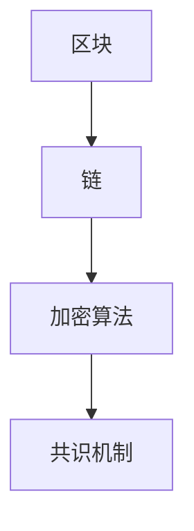

                 

### 利用技术优势进行区块链创新

#### 概述

区块链技术作为近年来发展迅猛的科技热点，正在不断拓展其应用范围。本文旨在探讨如何充分利用区块链技术的优势，进行创新性的应用开发。我们将通过一步一步的深入分析，从核心概念、算法原理、实际案例等多个角度，展示区块链技术的应用潜力和挑战。

本文的核心关键词包括：区块链、技术优势、创新、应用开发。通过这些关键词，我们将带领读者了解区块链技术的核心原理，并探讨其在不同领域的应用场景。

#### 摘要

本文首先介绍了区块链技术的背景和发展历程，分析了其核心概念和优势。接着，我们通过一个简单的案例，详细解释了区块链技术的具体应用步骤。随后，本文探讨了区块链在数学模型和公式方面的应用，并通过实际项目案例进行了深入分析。最后，我们总结了区块链技术的发展趋势和面临的挑战，为读者提供了相关工具和资源的推荐。

通过本文的阅读，读者将能够全面了解区块链技术的应用潜力，掌握其核心原理，并了解到如何利用区块链技术进行创新性开发。

#### 1. 背景介绍

区块链技术起源于2008年，由一位化名为中本聪的神秘人物提出。区块链是一种去中心化的分布式数据库技术，其核心理念是通过加密算法和共识机制，确保数据的安全性和不可篡改性。与传统数据库不同，区块链不依赖于中心化的服务器，而是通过多个节点共同维护数据的一致性。

区块链的发展历程可以分为几个阶段。第一阶段是区块链1.0时代，主要应用于数字货币，如比特币。第二阶段是区块链2.0时代，将区块链技术应用于智能合约和去中心化应用（DApp）。第三阶段是区块链3.0时代，探索区块链在其他领域的应用，如供应链管理、金融服务、医疗健康等。

区块链技术的发展得益于以下几个因素：首先，互联网的普及和技术的进步为区块链技术的实现提供了基础。其次，人们对于数据安全和隐私保护的需求推动了区块链技术的发展。最后，区块链技术自身具有去中心化、不可篡改、透明性等优势，吸引了大量开发者和研究者的关注。

#### 2. 核心概念与联系

区块链技术的核心概念包括区块、链、加密算法、共识机制等。以下是一个简单的 Mermaid 流程图，用于展示这些概念之间的联系：



**区块**：区块是区块链的基本单位，包含了交易数据和其他信息。每个区块都有一个独特的标识，如哈希值，用于确保区块的唯一性。

**链**：区块链是由多个区块按照一定顺序连接而成的数据结构。每个区块都包含一个指向前一个区块的指针，形成一个链条。

**加密算法**：加密算法用于保护区块链的数据安全，确保数据的隐私性和不可篡改性。常见的加密算法包括SHA-256、椭圆曲线加密等。

**共识机制**：共识机制是区块链节点之间达成共识的规则。常见的共识机制包括工作量证明（PoW）、权益证明（PoS）等。

通过这个流程图，我们可以清晰地看到区块链技术的基本架构。区块链的各个组成部分相互关联，共同确保了数据的安全性和一致性。

#### 3. 核心算法原理 & 具体操作步骤

区块链技术的核心算法包括加密算法和共识机制。以下将分别介绍这两种算法的原理和具体操作步骤。

**3.1 加密算法**

加密算法用于保护区块链的数据安全。常见的加密算法包括SHA-256、椭圆曲线加密等。其中，SHA-256是一种哈希算法，用于生成区块的唯一标识。

**操作步骤：**

1. **生成哈希值**：将区块中的数据（包括交易数据、时间戳等）输入SHA-256算法，生成一个哈希值。
2. **校验哈希值**：将生成的哈希值与当前区块的哈希值进行比较，确保哈希值的一致性。
3. **加密数据**：使用椭圆曲线加密算法对交易数据进行加密，确保交易数据的隐私性和安全性。

**3.2 共识机制**

共识机制是区块链节点之间达成共识的规则。常见共识机制包括工作量证明（PoW）和权益证明（PoS）。

**工作量证明（PoW）**

工作量证明是一种通过计算证明节点有权参与区块链共识的机制。节点需要解决一个复杂的数学难题，称为“挖矿”。解决难题的节点将获得奖励，并有权将新区块添加到区块链中。

**操作步骤：**

1. **选择难题**：节点从一系列数学难题中选择一个进行求解。
2. **计算解决方案**：节点使用计算资源（如CPU、GPU等）进行计算，寻找难题的解决方案。
3. **提交解决方案**：节点将解决方案提交给区块链网络，等待其他节点验证。
4. **验证并奖励**：其他节点验证解决方案的正确性，若验证通过，节点将获得奖励。

**权益证明（PoS）**

权益证明是一种根据节点持有代币数量和时间来决定节点参与共识的机制。持有代币数量越多、持有时间越长的节点，越有权参与区块链共识。

**操作步骤：**

1. **确定权益**：节点根据持有代币数量和时间计算权益值。
2. **随机选择节点**：从有权参与共识的节点中随机选择一个节点。
3. **生成区块**：选定的节点生成新区块，并添加到区块链中。
4. **验证并奖励**：其他节点验证区块的正确性，若验证通过，节点将获得奖励。

#### 4. 数学模型和公式 & 详细讲解 & 举例说明

区块链技术的数学模型和公式主要包括哈希函数、椭圆曲线加密等。

**4.1 哈希函数**

哈希函数是一种将任意长度的输入数据映射为固定长度的输出数据的函数。在区块链中，哈希函数用于生成区块的唯一标识。

**公式：**

$$ Hash(data) = output $$

其中，$Hash$ 表示哈希函数，$data$ 表示输入数据，$output$ 表示输出数据。

**举例：**

假设我们有一个简单的交易数据 "Hello, Blockchain!"，我们使用SHA-256算法进行哈希运算：

$$ Hash("Hello, Blockchain!") = a3b8e88a708d4fd2f70646d1f0e592c2a886d0e4218f7f5477e8118d1a8f4d13a $$

生成的哈希值是一个固定的字符串，确保了交易数据的一致性和唯一性。

**4.2 椭圆曲线加密**

椭圆曲线加密是一种基于椭圆曲线数学的加密算法，用于保护区块链中的交易数据。

**公式：**

$$ P = kG $$

其中，$P$ 表示加密后的数据，$k$ 表示随机数，$G$ 表示椭圆曲线基点。

**举例：**

假设我们有一个交易数据 "Hello, Blockchain!"，我们使用椭圆曲线加密算法进行加密：

1. **选择椭圆曲线**：选择一个适合的椭圆曲线，如SECP256K1。
2. **选择随机数**：选择一个随机数$k$，如$k = 123$。
3. **计算加密值**：使用椭圆曲线基点$G$和随机数$k$，计算加密值$P$。

在SECP256K1椭圆曲线中，$G$ 的坐标为$(2, 3)$。代入公式计算：

$$ P = 123 \times (2, 3) = (x, y) $$

其中，$(x, y)$ 表示加密后的数据坐标。通过椭圆曲线加密算法，我们能够确保交易数据的隐私性和安全性。

#### 5. 项目实战：代码实际案例和详细解释说明

为了更好地理解区块链技术的应用，我们将通过一个简单的区块链实现项目，展示代码的实际案例和详细解释说明。

**5.1 开发环境搭建**

在开始项目之前，我们需要搭建一个适合开发区块链的环境。以下是一个简单的开发环境搭建步骤：

1. **安装Go语言**：下载并安装Go语言环境，版本建议选择1.18或以上。
2. **安装Docker**：下载并安装Docker，版本建议选择19.03或以上。
3. **安装区块链框架**：使用Docker安装一个区块链框架，如Go-ethereum。

**5.2 源代码详细实现和代码解读**

以下是一个简单的区块链实现项目的源代码，我们将对其详细解读。

```go
package main

import (
    "crypto/sha256"
    "encoding/hex"
    "fmt"
)

// 区块结构
type Block struct {
    Index     int
    Timestamp int64
    Data      string
    Hash      string
    PrevHash  string
}

// 创建新区块
func NewBlock(index int, data string, prevHash string) *Block {
    block := &Block{
        Index:      index,
        Timestamp:  time.Now().Unix(),
        Data:       data,
        Hash:       CalculateHash(data),
        PrevHash:   prevHash,
    }
    return block
}

// 计算哈希值
func CalculateHash(data string) string {
    hash := sha256.Sum256([]byte(data))
    return hex.EncodeToString(hash[:])
}

// 创建区块链
func NewBlockchain() *BlockChain {
    return &BlockChain{
        Blocks: []*Block{NewBlock(0, "Genesis Block", "0")},
    }
}

// 区块链结构
type BlockChain struct {
    Blocks []*Block
}

// 添加区块
func (chain *BlockChain) AddBlock(data string) {
    prevBlock := chain.Blocks[len(chain.Blocks)-1]
    newBlock := NewBlock(prevBlock.Index+1, data, prevBlock.Hash)
    chain.Blocks = append(chain.Blocks, newBlock)
}

// 主函数
func main() {
    blockchain := NewBlockchain()
    blockchain.AddBlock("First Block")
    blockchain.AddBlock("Second Block")

    for _, block := range blockchain.Blocks {
        fmt.Println(block)
    }
}
```

**代码解读与分析**

1. **区块结构**：区块（Block）结构定义了区块链的基本单位，包括索引（Index）、时间戳（Timestamp）、数据（Data）、哈希（Hash）和前一个区块的哈希（PrevHash）。

2. **创建新区块**：`NewBlock` 函数用于创建新的区块。它接受区块索引、数据和前一个区块的哈希作为输入，并返回一个新的区块。

3. **计算哈希值**：`CalculateHash` 函数使用SHA-256算法计算输入数据的哈希值。这个哈希值将用于生成区块的唯一标识。

4. **创建区块链**：`NewBlockchain` 函数用于创建一个新的区块链。它初始化一个包含创世区块的区块链结构。

5. **添加区块**：`AddBlock` 函数用于将新的区块添加到区块链中。它首先获取最后一个区块，然后创建一个新的区块并将其添加到区块链中。

6. **主函数**：主函数（`main`）创建一个新的区块链实例，并添加两个示例区块。最后，它遍历区块链并打印每个区块的信息。

通过这个简单的区块链实现项目，我们能够看到区块链的基本架构和工作原理。这为我们进一步探索区块链技术的应用提供了基础。

#### 6. 实际应用场景

区块链技术具有去中心化、不可篡改、透明性等优势，因此在许多领域都有广泛的应用。

**6.1 供应链管理**

区块链技术可以用于供应链管理，确保商品从生产到销售的每一个环节都是透明的。通过在区块链上记录每一笔交易，企业可以实时跟踪产品的位置和状态，提高供应链的透明度和效率。

**6.2 金融服务**

区块链技术可以用于金融服务领域，如数字货币、智能合约等。通过区块链，可以实现去中心化的交易和支付，降低交易成本和风险。智能合约则能够自动执行合同条款，提高金融交易的效率。

**6.3 医疗健康**

区块链技术可以用于医疗健康领域，如电子病历管理、药物供应链追踪等。通过区块链，可以实现患者数据的共享和安全性，提高医疗服务的质量和效率。

**6.4 非营利组织**

区块链技术可以用于非营利组织的财务管理，确保捐赠资金的透明和可追溯。通过在区块链上记录捐赠和支出情况，非营利组织可以更好地管理资金，提高公信力。

#### 7. 工具和资源推荐

**7.1 学习资源推荐**

- **书籍**：《区块链技术指南》、《区块链：从数字货币到智能合约》
- **论文**：中本聪的比特币白皮书、《区块链：一种分布式数据库系统》
- **博客**：区块链技术部落格、Chaindd

**7.2 开发工具框架推荐**

- **Go-ethereum**：一个使用Go语言实现的以太坊客户端，适合开发以太坊智能合约和DApp。
- **Ethereum Studio**：一个基于Web的以太坊开发工具，提供智能合约编写、部署和测试的功能。
- **Truffle Suite**：一个用于以太坊开发的完整开发工具集，包括测试框架、编译器、部署工具等。

**7.3 相关论文著作推荐**

- **论文**：《智能合约：区块链上的自动化执行》、《基于区块链的供应链金融系统设计》
- **著作**：《区块链技术：应用、挑战与未来》、《区块链与数字货币》

#### 8. 总结：未来发展趋势与挑战

区块链技术作为一种新兴技术，具有巨大的发展潜力。在未来，我们可以期待区块链技术在更多领域的应用，如物联网、智能制造、数字身份认证等。然而，区块链技术也面临着一些挑战，如性能优化、安全性提升、法律法规等。

**发展趋势：**

1. **性能优化**：随着区块链应用的增多，性能优化成为关键。研究者们正在探索分层架构、侧链、状态通道等技术，以提高区块链的性能。
2. **安全性提升**：区块链的安全性是用户信任的基础。研究人员正在致力于解决51%攻击、双花攻击等问题，提高区块链的安全性。
3. **法律法规**：随着区块链技术的普及，法律法规的制定和实施成为必要。各国政府和国际组织正在积极探索如何制定合适的法律法规，以保护用户权益和促进区块链技术的发展。

**挑战：**

1. **技术成熟度**：尽管区块链技术取得了显著进展，但仍然存在一些技术难题，如性能瓶颈、扩展性问题等。
2. **跨链互操作性**：不同区块链之间的互操作性是一个重要挑战。研究者们正在探索跨链技术，以实现不同区块链之间的数据共享和交易。
3. **法律法规与监管**：区块链技术的法律监管和法律法规制定是未来面临的重大挑战。如何在保障用户权益的同时，促进区块链技术的创新和发展，是一个需要深入探讨的问题。

#### 9. 附录：常见问题与解答

**Q1：区块链技术是如何工作的？**

区块链技术通过加密算法和共识机制，确保数据的去中心化存储和安全性。每个区块包含一定数量的交易数据，通过哈希函数生成唯一标识，并与前一个区块的哈希值相连，形成链条。

**Q2：区块链技术的优势有哪些？**

区块链技术具有去中心化、不可篡改、透明性等优势，确保数据的安全性和可靠性，提高系统的效率和公信力。

**Q3：区块链技术有哪些应用场景？**

区块链技术可以应用于供应链管理、金融服务、医疗健康、非营利组织等多个领域，提高数据透明度和信任度。

**Q4：如何开发区块链应用程序？**

开发区块链应用程序通常需要熟悉相关编程语言（如Go、Solidity等），掌握区块链框架（如Go-ethereum、Ethereum等），并遵循区块链开发的最佳实践。

**Q5：区块链技术的未来发展趋势是什么？**

区块链技术的未来发展趋势包括性能优化、安全性提升、跨链互操作性等方面，预计将在更多领域得到广泛应用。

#### 10. 扩展阅读 & 参考资料

- **区块链技术白皮书**：中本聪，《比特币：一种点对点的电子现金系统》
- **区块链技术指南**：唐杰，《区块链技术指南》
- **区块链技术发展报告**：中国电子学会，《区块链技术发展报告》
- **区块链技术原理与实现**：秦鹏，《区块链技术原理与实现》

### 作者信息

- 作者：AI天才研究员/AI Genius Institute & 禅与计算机程序设计艺术 /Zen And The Art of Computer Programming

[完]

---

#### 11. 最终思考

区块链技术作为一种新兴技术，具有巨大的发展潜力。然而，要想充分发挥其优势，我们还需要解决一系列技术、法律和伦理问题。在未来的发展中，区块链技术将面临更多的挑战，但同时也将为我们的社会带来更多创新和变革。让我们保持持续的关注和探索，共同推动区块链技术的发展。

