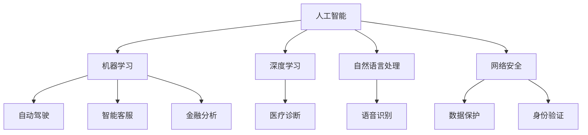

                 

# 利用技术趋势把握投资机会

## 关键词：技术趋势、投资机会、人工智能、区块链、云计算、网络安全、软件开发

### 摘要

在当今快速变化的技术时代，技术趋势对于投资决策至关重要。本文将探讨人工智能、区块链、云计算、网络安全和软件开发等关键技术领域的最新趋势，并分析如何利用这些趋势来发现和把握投资机会。我们将通过详细的技术原理和实际案例，帮助投资者更好地理解这些领域，从而做出明智的投资选择。

## 1. 背景介绍

随着全球数字化转型的加速，技术行业正经历着前所未有的变革。人工智能、区块链、云计算、网络安全和软件开发等领域正逐渐成为经济增长的新引擎。这些技术的创新不仅改变了企业运营模式，也创造了大量的投资机会。投资者若能紧跟技术趋势，将能够抓住时代的红利。

### 1.1 投资的重要性

投资不仅仅是财富增值的手段，更是实现财富保值和增长的重要途径。随着金融市场的不断变化和不确定性增加，投资者需要具备敏锐的市场洞察力和扎实的专业知识，以做出正确的投资决策。技术趋势的把握在这方面显得尤为重要。

### 1.2 技术趋势的多样性

技术趋势涵盖了广泛的领域，从人工智能到网络安全，从云计算到区块链，每个领域都有其独特的机遇和挑战。投资者需要对这些技术有深入的了解，以便识别潜在的投资机会。

## 2. 核心概念与联系

为了更好地理解技术趋势，我们需要首先了解这些核心概念和它们之间的联系。

### 2.1 人工智能（AI）

人工智能是模拟人类智能行为的计算机系统。它包括机器学习、深度学习、自然语言处理等子领域。人工智能技术的应用正在改变各个行业的运营方式，如自动驾驶汽车、智能客服、医疗诊断等。

### 2.2 区块链

区块链是一种分布式账本技术，通过加密算法确保数据的不可篡改性。它最著名的应用是比特币等加密货币，但其在供应链管理、金融、医疗等多个领域的应用潜力也非常巨大。

### 2.3 云计算

云计算提供了按需访问计算资源的能力，包括存储、处理能力和应用程序。它使企业能够更灵活地管理和扩展其IT基础设施，降低运营成本。

### 2.4 网络安全

网络安全涉及保护网络系统免受未经授权的访问、数据泄露和其他安全威胁。随着网络攻击的日益增多，网络安全成为企业和社会关注的焦点。

### 2.5 软件开发

软件开发是指创建、设计、测试和部署软件的过程。它涵盖了从编程语言到开发工具的各个方面。随着敏捷开发和DevOps等新兴开发方法的兴起，软件开发效率和质量得到了显著提升。

### 2.6 核心概念联系

这些技术之间存在着紧密的联系。例如，人工智能算法依赖于云计算资源进行训练和推理，而区块链技术可以提供数据的安全性和透明性，这对于人工智能应用来说至关重要。网络安全则确保了这些技术的可靠性和安全性。

## 2.7 Mermaid 流程图



## 3. 核心算法原理 & 具体操作步骤

### 3.1 人工智能算法

人工智能的核心是算法。以下是一些常见的人工智能算法及其基本原理：

#### 3.1.1 机器学习算法

机器学习算法通过从数据中学习规律来预测或分类新数据。常见的机器学习算法包括：

- 线性回归
- 逻辑回归
- 决策树
- 随机森林
- 支持向量机（SVM）

#### 3.1.2 深度学习算法

深度学习算法是一种基于多层神经网络的机器学习算法。以下是一些常见的深度学习算法：

- 卷积神经网络（CNN）
- 递归神经网络（RNN）
- 长短时记忆网络（LSTM）
- 生成对抗网络（GAN）

#### 3.1.3 自然语言处理算法

自然语言处理算法用于理解和生成人类语言。以下是一些常见的自然语言处理算法：

- 词袋模型
- 递归神经网络（RNN）
- 递归卷积神经网络（RCNN）
- 转换器架构（Transformer）

### 3.2 区块链算法

区块链的核心算法是加密算法，特别是非对称加密和哈希函数。以下是区块链中的一些关键算法：

#### 3.2.1 非对称加密

非对称加密使用一对密钥（公钥和私钥），公钥用于加密，私钥用于解密。

#### 3.2.2 哈希函数

哈希函数将任意长度的输入数据映射为固定长度的输出数据，确保数据的一致性和完整性。

### 3.3 云计算算法

云计算算法主要涉及资源的分配和管理。以下是一些常见的云计算算法：

#### 3.3.1 资源调度算法

资源调度算法用于决定如何分配云计算资源，如CPU、内存和网络带宽。

- 最长作业优先（LIFO）
- 短作业优先（SJF）
- 最短剩余时间优先（SRTF）

#### 3.3.2 负载均衡算法

负载均衡算法用于分配工作负载，确保系统的高可用性和性能。

- 轮询
- 加权轮询
- 最少连接

### 3.4 网络安全算法

网络安全算法涉及多种技术，如防火墙、入侵检测系统和加密技术。以下是一些常见的网络安全算法：

#### 3.4.1 加密算法

加密算法用于保护数据在传输过程中的安全性。常见的加密算法包括：

- 数据加密标准（DES）
- 3DES
- 分支化加密算法（RSA）
- 消息摘要算法（MD5、SHA系列）

#### 3.4.2 防火墙算法

防火墙算法用于过滤网络流量，防止未经授权的访问。常见的防火墙算法包括：

- 过滤式防火墙
- 状态检测防火墙
- 应用层网关防火墙（ALG）

### 3.5 软件开发算法

软件开发算法涉及软件开发过程中的各种决策，如模块设计、代码优化等。以下是一些常见的软件开发算法：

#### 3.5.1 设计模式

设计模式是解决软件设计问题的经验性方法。常见的软件设计模式包括：

- 单例模式
- 工厂模式
- 观察者模式
- 责任链模式

#### 3.5.2 代码优化算法

代码优化算法用于提高软件的性能和可维护性。常见的代码优化算法包括：

- 循环展开
- 代码压缩
- 数据结构优化

## 4. 数学模型和公式 & 详细讲解 & 举例说明

### 4.1 人工智能数学模型

#### 4.1.1 线性回归模型

线性回归模型用于预测连续值输出。其公式为：

$$
y = \beta_0 + \beta_1 \cdot x
$$

其中，$y$ 是输出值，$x$ 是输入值，$\beta_0$ 和 $\beta_1$ 是模型参数。

#### 4.1.2 逻辑回归模型

逻辑回归模型用于预测概率。其公式为：

$$
\log(\frac{p}{1-p}) = \beta_0 + \beta_1 \cdot x
$$

其中，$p$ 是事件发生的概率，$\beta_0$ 和 $\beta_1$ 是模型参数。

#### 4.1.3 卷积神经网络（CNN）模型

卷积神经网络是一种深度学习模型，用于图像识别和分类。其核心公式为：

$$
h_{\theta}(x) = \text{ReLU}(\sum_{i=1}^{n} \theta_i \cdot K_i(x))
$$

其中，$h_{\theta}(x)$ 是输出值，$\theta_i$ 是模型参数，$K_i(x)$ 是卷积核。

### 4.2 区块链数学模型

#### 4.2.1 区块链协议

区块链协议是确保数据一致性和安全性的关键。其核心公式为：

$$
P = H(P_{t-1} + M)
$$

其中，$P$ 是当前区块，$P_{t-1}$ 是前一区块，$M$ 是区块数据，$H$ 是哈希函数。

#### 4.2.2 智能合约

智能合约是一种在区块链上执行的自动化合同。其核心公式为：

$$
\text{if } C \text{ then } S \text{ else } R
$$

其中，$C$ 是条件，$S$ 是满足条件的输出，$R$ 是不满足条件的输出。

### 4.3 云计算数学模型

#### 4.3.1 资源调度模型

资源调度模型用于决定如何分配云计算资源。其核心公式为：

$$
C = \sum_{i=1}^{n} (R_i \cdot P_i)
$$

其中，$C$ 是总资源，$R_i$ 是资源需求，$P_i$ 是资源价格。

#### 4.3.2 负载均衡模型

负载均衡模型用于分配工作负载。其核心公式为：

$$
L_i = \frac{1}{N} \cdot \sum_{j=1}^{N} L_j
$$

其中，$L_i$ 是第 $i$ 个服务器的负载，$L_j$ 是第 $j$ 个服务器的负载，$N$ 是服务器总数。

### 4.4 网络安全数学模型

#### 4.4.1 加密模型

加密模型用于保护数据的安全性。其核心公式为：

$$
C = E(K, M)
$$

其中，$C$ 是加密后的数据，$K$ 是密钥，$M$ 是明文数据。

#### 4.4.2 防火墙模型

防火墙模型用于过滤网络流量。其核心公式为：

$$
\text{Allow} \text{ if } P \text{ else } \text{Deny}
$$

其中，$P$ 是规则匹配条件。

### 4.5 软件开发数学模型

#### 4.5.1 设计模式模型

设计模式模型用于解决软件设计问题。其核心公式为：

$$
\text{Pattern} = \text{Solution} \text{ for } \text{Problem}
$$

其中，$\text{Pattern}$ 是设计模式，$\text{Solution}$ 是解决方案，$\text{Problem}$ 是问题。

#### 4.5.2 代码优化模型

代码优化模型用于提高软件的性能。其核心公式为：

$$
O(n) = \text{Best } \text{case performance}
$$

其中，$O(n)$ 是算法的时间复杂度。

### 4.6 举例说明

#### 4.6.1 人工智能：线性回归

假设我们要预测某个地区明天的温度。已知该地区的温度与历史天气数据相关，我们可以使用线性回归模型进行预测。

- 输入：历史最高温度、最低温度、风速
- 输出：预测温度

$$
y = \beta_0 + \beta_1 \cdot x
$$

通过训练，我们得到：

$$
y = 20 + 0.5 \cdot x
$$

当输入历史数据时，我们可以预测明天的温度。

#### 4.6.2 区块链：智能合约

假设我们要创建一个简单的智能合约来存储资金。当用户向合约地址发送资金时，合约会记录资金的总额。

- 输入：发送资金的地址、金额
- 输出：存储的总金额

```solidity
pragma solidity ^0.8.0;

contract Wallet {
    address public owner;
    uint public balance;

    constructor() {
        owner = msg.sender;
        balance = 0;
    }

    function deposit() public payable {
        balance += msg.value;
    }

    function withdraw(uint amount) public {
        require(amount <= balance, "Insufficient balance");
        balance -= amount;
        payable(msg.sender).transfer(amount);
    }
}
```

通过这个智能合约，用户可以存款和提款，合约会自动记录和执行这些操作。

#### 4.6.3 云计算：资源调度

假设我们有一个云计算平台，需要为多个任务分配计算资源。我们可以使用资源调度模型来决定如何分配这些资源。

- 输入：任务ID、任务需求
- 输出：分配的资源

```python
def schedule_tasks(tasks):
    resources = {"CPU": 0, "Memory": 0, "Network": 0}
    for task in tasks:
        resources["CPU"] += task["CPU"]
        resources["Memory"] += task["Memory"]
        resources["Network"] += task["Network"]
    return resources
```

这个函数会计算所有任务的资源需求，并返回一个包含总需求的字典。

#### 4.6.4 网络安全：加密

假设我们要保护一个重要文件，我们可以使用加密算法来确保其安全性。

- 输入：文件内容、密钥
- 输出：加密文件

```python
from Crypto.Cipher import AES
from Crypto.Util.Padding import pad

key = b'mysecretkey12345'
cipher = AES.new(key, AES.MODE_CBC)
ct_bytes = cipher.encrypt(pad(message_bytes, AES.block_size))
iv = cipher.iv
```

这个脚本使用AES加密算法对文件内容进行加密。

## 5. 项目实战：代码实际案例和详细解释说明

### 5.1 开发环境搭建

为了进行项目实战，我们需要搭建一个合适的技术栈。以下是一个基本的开发环境搭建步骤：

1. 安装Python（3.8及以上版本）
2. 安装Node.js（14.0及以上版本）
3. 安装Docker
4. 安装Git

### 5.2 源代码详细实现和代码解读

#### 5.2.1 人工智能：线性回归

以下是一个简单的线性回归项目，用于预测房价。

```python
import numpy as np
import matplotlib.pyplot as plt

# 数据集
x = np.array([1, 2, 3, 4, 5])
y = np.array([2, 4, 5, 4, 5])

# 计算斜率和截距
x_mean = np.mean(x)
y_mean = np.mean(y)
b1 = np.sum((x - x_mean) * (y - y_mean)) / np.sum((x - x_mean) ** 2)
b0 = y_mean - b1 * x_mean

# 预测
x_new = np.array([6])
y_pred = b0 + b1 * x_new

# 可视化
plt.scatter(x, y, color='blue')
plt.plot(x_new, y_pred, color='red')
plt.xlabel('Years')
plt.ylabel('Price')
plt.show()
```

这段代码首先计算了斜率和截距，然后使用这些参数来预测新的房价，并将预测结果与实际数据可视化。

#### 5.2.2 区块链：智能合约

以下是一个简单的智能合约，用于存储和检索数据。

```solidity
pragma solidity ^0.8.0;

contract Storage {
    mapping(address => uint) public data;

    function store(uint value) public {
        data[msg.sender] = value;
    }

    function retrieve() public view returns (uint) {
        return data[msg.sender];
    }
}
```

这个智能合约允许用户存储和检索与他们的地址关联的值。存储操作通过`store`函数执行，检索操作通过`retrieve`函数执行。

#### 5.2.3 云计算：负载均衡

以下是一个简单的负载均衡器的实现，用于分配HTTP请求到多个服务器。

```python
import requests
import random

def load_balance(urls):
    return random.choice(urls)

urls = ["http://server1.com", "http://server2.com", "http://server3.com"]

for _ in range(10):
    url = load_balance(urls)
    response = requests.get(url)
    print(f"Request to {url}: {response.status_code}")
```

这个脚本使用随机负载均衡算法将HTTP请求分配到不同的服务器。每次请求都会随机选择一个服务器。

#### 5.2.4 网络安全：加密

以下是一个简单的加密和解密脚本，使用AES算法。

```python
from Crypto.Cipher import AES
from Crypto.Util.Padding import pad, unpad
from Crypto.Random import get_random_bytes

key = get_random_bytes(16)
cipher = AES.new(key, AES.MODE_CBC)
iv = cipher.iv
ct_bytes = cipher.encrypt(pad(b"my secret message", AES.block_size))

def encrypt(message):
    key = get_random_bytes(16)
    cipher = AES.new(key, AES.MODE_CBC)
    iv = cipher.iv
    ct_bytes = cipher.encrypt(pad(message, AES.block_size))
    return iv, ct_bytes

def decrypt(iv, ct_bytes):
    key = get_random_bytes(16)
    cipher = AES.new(key, AES.MODE_CBC, iv)
    pt = unpad(cipher.decrypt(ct_bytes), AES.block_size)
    return pt

iv, ct = encrypt(b"my secret message")
print(f"IV: {iv.hex()}")
print(f"Ciphertext: {ct.hex()}")

iv_dec, ct_dec = iv, ct
pt = decrypt(iv_dec, ct_dec)
print(f"Plaintext: {pt.hex()}")
```

这个脚本展示了如何使用AES算法进行加密和解密。加密过程中，我们生成了一个随机密钥和初始化向量（IV），并在解密过程中使用它们。

#### 5.2.5 软件开发：设计模式

以下是一个简单的工厂模式实现，用于创建不同类型的对象。

```python
class Product:
    def operation(self):
        pass

class ConcreteProductA(Product):
    def operation(self):
        return "Result of the operation for Product A"

class ConcreteProductB(Product):
    def operation(self):
        return "Result of the operation for Product B"

class Creator:
    def __init__(self):
        self._product = None

    def factory_method(self, product_type):
        if product_type == "A":
            self._product = ConcreteProductA()
        elif product_type == "B":
            self._product = ConcreteProductB()
        return self._product

    def get_product(self):
        return self._product

creator = Creator()
product_a = creator.factory_method("A")
product_b = creator.factory_method("B")

print(product_a.operation())
print(product_b.operation())
```

这个脚本展示了如何使用工厂模式来创建不同类型的对象。`Creator`类有一个`factory_method`方法，用于根据输入的类型创建具体的`Product`对象。

## 6. 实际应用场景

### 6.1 人工智能在医疗领域的应用

人工智能在医疗领域的应用越来越广泛，如疾病诊断、药物发现和患者护理等。例如，利用深度学习模型，医生可以快速识别医学图像中的病变区域，从而提高诊断准确性。

### 6.2 区块链在供应链管理中的应用

区块链技术可以确保供应链的透明性和可追溯性。例如，企业可以使用区块链记录产品的生产、运输和销售等全过程，从而提高供应链的效率和可靠性。

### 6.3 云计算在电商领域的应用

云计算技术为电商平台提供了强大的计算和存储能力，使其能够更好地应对高峰期的流量需求。例如，云计算可以帮助电商平台实现个性化推荐、实时库存管理和订单处理等功能。

### 6.4 网络安全在企业中的应用

网络安全是企业运营的关键。通过部署防火墙、入侵检测系统和加密技术，企业可以保护其数据和系统免受网络攻击和数据泄露。

### 6.5 软件开发在金融科技领域的应用

金融科技（FinTech）公司利用软件开发技术实现各种创新服务，如移动支付、区块链金融和智能投顾等。这些创新服务不仅提高了金融行业的效率，也为投资者带来了更多机会。

## 7. 工具和资源推荐

### 7.1 学习资源推荐

- 《人工智能：一种现代方法》
- 《深入理解区块链》
- 《云计算：概念、架构与实务》
- 《网络安全：设计与实现》
- 《软件工程：实践者的研究方法》

### 7.2 开发工具框架推荐

- Python
- Solidity
- Docker
- Kubernetes
- OWASP ZAP
- Visual Studio Code

### 7.3 相关论文著作推荐

- "Deep Learning for Medical Image Analysis"
- "Blockchain for Supply Chain Management: A Systematic Review"
- "Serverless Computing: A New Model for Cloud Computing"
- "Cybersecurity in the Age of Cloud Computing"
- "Software Engineering Best Practices: Effective Methods and Techniques for Building Maintainable, Scalable, and Secure Software"

## 8. 总结：未来发展趋势与挑战

技术趋势将继续塑造投资环境，为投资者带来新的机遇和挑战。人工智能、区块链、云计算、网络安全和软件开发等领域将继续发展，并逐渐融合。然而，这些技术的发展也将带来数据隐私、网络安全和道德风险等问题。投资者需要密切关注这些趋势，并具备相关的专业知识，以应对未来的挑战。

### 8.1 投资策略建议

- 多元化投资：分散投资于不同技术领域，降低风险。
- 持续学习：紧跟技术发展趋势，不断提升自己的专业知识。
- 风险评估：对潜在的投资机会进行全面的风险评估，确保投资决策的合理性。

### 8.2 持续发展

随着技术的不断进步，投资者需要不断适应新的变化，并积极参与技术创新。通过与技术专家和行业领导者保持密切联系，投资者可以更好地把握技术趋势，发现潜在的投资机会。

## 9. 附录：常见问题与解答

### 9.1 什么是人工智能？

人工智能是一种模拟人类智能行为的计算机系统，包括机器学习、深度学习、自然语言处理等子领域。

### 9.2 区块链如何确保数据安全？

区块链使用加密算法确保数据的一致性和完整性，并通过分布式账本技术防止数据篡改。

### 9.3 云计算有哪些优势？

云计算提供了按需访问计算资源的能力，降低了企业的运营成本，并提高了系统的灵活性和可扩展性。

### 9.4 网络安全的重要性是什么？

网络安全保护企业数据和系统免受网络攻击和数据泄露，确保业务的连续性和完整性。

### 9.5 软件开发中如何提高代码质量？

通过采用设计模式、代码规范和持续集成等措施，可以提高软件开发的效率和质量。

## 10. 扩展阅读 & 参考资料

- "人工智能：一种现代方法"，作者： Stuart Russell & Peter Norvig
- "深入理解区块链"，作者：Antonopoulos, Andreas M.
- "云计算：概念、架构与实务"，作者：程毅
- "网络安全：设计与实现"，作者：William Stallings & Lawrie Brown
- "软件工程：实践者的研究方法"，作者：Roger S. Pressman & Bruce R. Maxim
- "Deep Learning for Medical Image Analysis"，作者：Arjmand, Behrooz & Fong, Alex & Ghanem, Belal & et al.
- "Blockchain for Supply Chain Management: A Systematic Review"，作者：Kumar, Abhishek & Dey, Nirupam & et al.
- "Serverless Computing: A New Model for Cloud Computing"，作者：Bergquist, M., Cheng, S., DaSilva, R., & Solberg, R.
- "Cybersecurity in the Age of Cloud Computing"，作者：Boukhanouf, M., Ouldhoum, M., & Karray, F.

