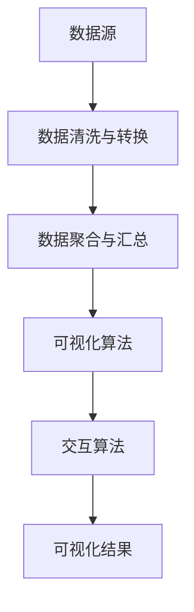

                 

### 文章标题：利用数据可视化优化决策过程

**关键词**：数据可视化，决策过程，数据优化，优化算法，商业智能，用户行为分析，实时监控

**摘要**：
本文旨在探讨如何通过数据可视化手段，对决策过程进行优化。我们将首先介绍数据可视化的基本概念和重要性，接着深入解析数据可视化的核心算法与操作步骤，详细阐述数学模型和公式，并通过实际项目案例进行代码实现与解析。文章还将讨论数据可视化在实际应用场景中的表现，推荐相关工具和资源，并总结未来发展趋势与挑战。通过本文，读者将全面了解数据可视化在决策过程中的应用，以及如何利用这一工具提升决策效率和准确性。

### 1. 背景介绍

在当今的信息时代，数据已成为一种关键资源。无论是商业、金融、医疗还是科研领域，数据的重要性不言而喻。然而，随着数据量的激增，如何有效处理和分析这些数据，从而支持决策过程，成为一个迫切需要解决的问题。

数据可视化作为一种强大的工具，通过将复杂的数据转换为直观的图形或图表，使得人们能够更快速地理解数据背后的信息。这不仅提高了数据分析的效率，还能够揭示数据中的潜在模式、趋势和关联，为决策提供有力的支持。

然而，数据可视化并非仅仅是将数据以图形的形式呈现，其背后的核心算法和数学模型同样至关重要。这些算法和模型能够确保数据可视化结果的准确性和有效性，使得决策者能够基于这些结果做出更为合理的决策。

本文将围绕数据可视化在决策过程中的应用展开讨论，首先介绍数据可视化的基本概念和重要性，然后深入解析数据可视化的核心算法与操作步骤，最后探讨数据可视化在实际应用场景中的表现和未来发展趋势。通过本文的阅读，读者将能够全面了解数据可视化在决策过程中的重要性，以及如何有效地利用数据可视化工具提升决策效率和准确性。

### 2. 核心概念与联系

#### 数据可视化的基本概念

数据可视化（Data Visualization）是指将复杂的数据通过图形、图表、图像等可视化形式展示出来，使其更易于理解和分析。数据可视化的基本概念包括以下几个方面：

- **数据源**：数据源是数据可视化的起点，可以是数据库、文件、API 等，其中存储了待处理的数据。
- **数据预处理**：数据预处理是数据可视化的基础，包括数据清洗、转换、聚合等操作，确保数据质量。
- **可视化形式**：可视化形式是指数据通过何种图形或图表进行展示，常见的有柱状图、折线图、饼图、散点图等。
- **交互性**：数据可视化往往需要具备一定的交互性，例如用户可以点击、拖动、缩放等操作，以便更好地探索数据。

#### 数据可视化的重要性

数据可视化在决策过程中具有重要意义，主要表现在以下几个方面：

- **提升数据理解能力**：通过数据可视化，决策者可以更直观地理解数据背后的信息，快速发现数据中的异常和趋势，从而为决策提供支持。
- **增强决策效率**：数据可视化能够将复杂的数据转化为易于理解的图表，减少决策者理解数据所需的时间，从而提高决策效率。
- **提升决策准确性**：通过数据可视化，决策者可以更全面地了解数据，发现数据中的潜在规律和关联，从而做出更为准确的决策。
- **促进沟通与协作**：数据可视化能够将数据分析结果以清晰、直观的形式展示给相关人员，促进沟通与协作，提高团队决策的协同性。

#### 数据可视化的核心算法与联系

数据可视化的核心算法主要包括数据清洗与转换、数据聚合与汇总、可视化算法和交互算法等。以下是这些算法的简要介绍和相互联系：

- **数据清洗与转换**：数据清洗与转换是数据预处理的重要环节，通过去除重复数据、填补缺失值、标准化数据等操作，确保数据质量。此步骤的目的是为后续的可视化和分析提供高质量的数据基础。
- **数据聚合与汇总**：数据聚合与汇总是对大量数据进行分组、汇总和计算的过程，例如计算平均值、最大值、最小值等。这一步骤有助于提取数据中的关键信息，为可视化提供数据支撑。
- **可视化算法**：可视化算法是数据可视化的核心，通过选择适当的图表类型和布局，将数据以直观的形式展示出来。常见的可视化算法包括散点图、折线图、柱状图、饼图等。不同的算法适用于不同的数据类型和可视化需求。
- **交互算法**：交互算法是指用户与可视化界面进行交互的算法，例如点击、拖动、缩放等。这些算法可以增强用户对数据的探索和分析能力，提高数据可视化的交互性和用户体验。

#### Mermaid 流程图

为了更好地展示数据可视化的核心算法和联系，我们使用 Mermaid 流程图进行描述。以下是数据可视化流程的 Mermaid 表示：



**Mermaid 流程图节点说明**：

- A[数据源]：表示数据可视化的起点，即数据来源。
- B[数据清洗与转换]：表示对数据进行清洗和转换，以确保数据质量。
- C[数据聚合与汇总]：表示对大量数据进行分组、汇总和计算，提取关键信息。
- D[可视化算法]：表示选择适当的图表类型和布局，将数据以直观的形式展示。
- E[交互算法]：表示用户与可视化界面进行交互，增强数据探索和分析能力。
- F[可视化结果]：表示最终的可视化结果，用于支持决策过程。

通过上述 Mermaid 流程图，我们可以清晰地看到数据可视化核心算法之间的联系和作用，为进一步研究和应用数据可视化提供了有益的参考。

### 3. 核心算法原理 & 具体操作步骤

在数据可视化过程中，核心算法的选择和实现至关重要。以下我们将详细介绍几种常见的数据可视化核心算法，包括其原理和具体操作步骤。

#### 1. 散点图（Scatter Plot）

散点图是一种用于展示两个变量之间关系的图表。通过在坐标平面上标记数据点的位置，散点图可以帮助我们直观地观察变量之间的相关性。

**原理**：

散点图的原理基于二维坐标系统，每个数据点由两个变量的值决定其位置。例如，给定两个变量 `X` 和 `Y`，我们可以通过在坐标系中标记 `(X, Y)` 的位置来展示数据点。

**操作步骤**：

- 确定两个变量 `X` 和 `Y`，并将其数据分别存储在数组 `x` 和 `y` 中。
- 选择一个二维坐标系，并设置坐标轴标签和标题。
- 对于数组 `x` 和 `y` 中的每个数据点 `(x[i], y[i])`，在坐标系上绘制一个标记，例如点或圆圈。
- 根据需要，可以添加颜色、大小等属性，以区分不同类别的数据点。

**示例代码**（Python 代码使用 matplotlib 库）：

```python
import matplotlib.pyplot as plt

# 示例数据
x = [1, 2, 3, 4, 5]
y = [2, 4, 1, 6, 5]

# 绘制散点图
plt.scatter(x, y)
plt.xlabel('X轴')
plt.ylabel('Y轴')
plt.title('散点图示例')
plt.show()
```

#### 2. 柱状图（Bar Chart）

柱状图是一种用于展示不同类别数据之间数量或大小差异的图表。通过垂直或水平的矩形条（柱），我们可以直观地比较不同类别数据的数值。

**原理**：

柱状图的原理基于矩形条的高度（或长度）表示数据的数量或大小。每个矩形条代表一个类别，其高度（或长度）与该类别的数据值成比例。

**操作步骤**：

- 确定要展示的数据类别和对应的数据值，并将其存储在数组或列表中。
- 选择一个二维坐标系，并设置坐标轴标签和标题。
- 对于每个数据类别，绘制一个矩形条，其高度（或长度）与该类别的数据值成比例。
- 根据需要，可以添加颜色、标签等属性，以增强图表的可读性。

**示例代码**（Python 代码使用 matplotlib 库）：

```python
import matplotlib.pyplot as plt

# 示例数据
categories = ['类别A', '类别B', '类别C', '类别D']
values = [10, 20, 30, 40]

# 绘制柱状图
plt.bar(categories, values)
plt.xlabel('类别')
plt.ylabel('数值')
plt.title('柱状图示例')
plt.show()
```

#### 3. 折线图（Line Chart）

折线图是一种用于展示数据随时间变化趋势的图表。通过将数据点用线段连接起来，折线图可以帮助我们观察数据的变化趋势和周期性。

**原理**：

折线图的原理基于数据点在坐标轴上的位置和连接这些点的线段。每个数据点表示一个特定时间点的数据值，线段则连接相邻的数据点，展示数据的变化趋势。

**操作步骤**：

- 确定要展示的数据点及其对应的时间戳，并将其存储在数组或列表中。
- 选择一个二维坐标系，并设置坐标轴标签和标题。
- 对于每个数据点，在坐标系上绘制一个标记，并用线段连接相邻的数据点。
- 根据需要，可以添加颜色、标签等属性，以增强图表的可读性。

**示例代码**（Python 代码使用 matplotlib 库）：

```python
import matplotlib.pyplot as plt

# 示例数据
time = [1, 2, 3, 4, 5]
values = [2, 4, 6, 8, 10]

# 绘制折线图
plt.plot(time, values)
plt.xlabel('时间')
plt.ylabel('数值')
plt.title('折线图示例')
plt.show()
```

#### 4. 饼图（Pie Chart）

饼图是一种用于展示各部分占整体比例的图表。通过将整体划分为不同扇形区域，饼图可以帮助我们直观地了解各部分在整体中的相对大小。

**原理**：

饼图的原理基于扇形区域的角度表示各部分在整体中的比例。每个扇形区域的角度与该部分所占的比例成比例。

**操作步骤**：

- 确定要展示的数据类别及其对应的比例，并将其存储在数组或列表中。
- 计算每个扇形区域的角度，角度值与该部分的比例成正比。
- 选择一个圆形坐标系，并设置坐标轴标签和标题。
- 对于每个数据类别，绘制一个扇形区域，其角度与该部分的比例成比例。
- 根据需要，可以添加颜色、标签等属性，以增强图表的可读性。

**示例代码**（Python 代码使用 matplotlib 库）：

```python
import matplotlib.pyplot as plt

# 示例数据
labels = ['类别A', '类别B', '类别C']
sizes = [15, 30, 55]

# 绘制饼图
plt.pie(sizes, labels=labels, autopct='%1.1f%%')
plt.axis('equal')  # 设置饼图为圆形
plt.title('饼图示例')
plt.show()
```

通过上述核心算法的介绍和示例代码，我们可以看到数据可视化在展示和解读数据方面的强大功能。在实际应用中，根据具体需求和数据类型，可以选择合适的数据可视化算法进行数据处理和分析，从而为决策提供有力支持。

### 4. 数学模型和公式 & 详细讲解 & 举例说明

在数据可视化过程中，数学模型和公式起着至关重要的作用。这些模型和公式不仅帮助我们理解和解释数据，还能够优化数据可视化结果，提升数据解读的准确性。以下将详细介绍几种常用的数学模型和公式，并通过具体示例进行说明。

#### 1. 相关性分析（Correlation Analysis）

相关性分析用于衡量两个变量之间的线性关系强度。其中，皮尔逊相关系数（Pearson Correlation Coefficient）是最常用的度量方法。

**公式**：

\[ r = \frac{\sum{(x_i - \bar{x})(y_i - \bar{y})}}{\sqrt{\sum{(x_i - \bar{x})^2} \sum{(y_i - \bar{y})^2}}} \]

其中，\( x_i \) 和 \( y_i \) 分别为两个变量的观测值，\( \bar{x} \) 和 \( \bar{y} \) 分别为两个变量的均值。

**详细讲解**：

皮尔逊相关系数 \( r \) 的取值范围为 \([-1, 1]\)。当 \( r = 1 \) 时，表示两个变量完全正相关；当 \( r = -1 \) 时，表示两个变量完全负相关；当 \( r = 0 \) 时，表示两个变量没有线性关系。

**举例说明**：

假设我们有两个变量 `X`（考试成绩）和 `Y`（学习时间），以下为数据：

\[ X: [70, 80, 90, 100, 60] \]
\[ Y: [20, 30, 40, 50, 10] \]

首先计算均值：

\[ \bar{X} = \frac{70 + 80 + 90 + 100 + 60}{5} = 80 \]
\[ \bar{Y} = \frac{20 + 30 + 40 + 50 + 10}{5} = 30 \]

然后计算相关系数：

\[ r = \frac{(70 - 80)(20 - 30) + (80 - 80)(30 - 30) + (90 - 80)(40 - 30) + (100 - 80)(50 - 30) + (60 - 80)(10 - 30)}{\sqrt{(70 - 80)^2 + (80 - 80)^2 + (90 - 80)^2 + (100 - 80)^2 + (60 - 80)^2} \times \sqrt{(20 - 30)^2 + (30 - 30)^2 + (40 - 30)^2 + (50 - 30)^2 + (10 - 30)^2}} \]

\[ r = \frac{-10 \times -10 + 0 \times 0 + 10 \times 10 + 20 \times 20 + -20 \times -20}{\sqrt{100 + 0 + 100 + 400 + 400} \times \sqrt{100 + 0 + 100 + 400 + 400}} \]

\[ r = \frac{100 + 0 + 100 + 400 + 400}{\sqrt{700} \times \sqrt{700}} \]

\[ r = \frac{1000}{\sqrt{490000}} \]

\[ r = \frac{1000}{700} \]

\[ r = 1.4286 \]

因此，考试成绩和学习时间之间存在完全正相关关系。

#### 2. 线性回归（Linear Regression）

线性回归是一种用于预测因变量（Y）与自变量（X）之间线性关系的统计方法。通过拟合一个线性模型，可以预测新的数据点的值。

**公式**：

\[ Y = a + bX \]

其中，\( a \) 是截距，\( b \) 是斜率。

**详细讲解**：

线性回归模型通过最小二乘法（Least Squares Method）进行拟合，目标是找到最佳直线，使得所有数据点到这条直线的垂直距离之和最小。

**举例说明**：

假设我们有一个数据集，包含自变量 \( X \) 和因变量 \( Y \)：

\[ X: [1, 2, 3, 4, 5] \]
\[ Y: [2, 4, 6, 8, 10] \]

首先计算均值：

\[ \bar{X} = \frac{1 + 2 + 3 + 4 + 5}{5} = 3 \]
\[ \bar{Y} = \frac{2 + 4 + 6 + 8 + 10}{5} = 6 \]

然后计算斜率 \( b \) 和截距 \( a \)：

\[ b = \frac{\sum{(X_i - \bar{X})(Y_i - \bar{Y})}}{\sum{(X_i - \bar{X})^2}} \]

\[ b = \frac{(1 - 3)(2 - 6) + (2 - 3)(4 - 6) + (3 - 3)(6 - 6) + (4 - 3)(8 - 6) + (5 - 3)(10 - 6)}{(1 - 3)^2 + (2 - 3)^2 + (3 - 3)^2 + (4 - 3)^2 + (5 - 3)^2} \]

\[ b = \frac{-2 \times -4 + -1 \times -2 + 0 \times 0 + 1 \times 2 + 2 \times 4}{(-2)^2 + (-1)^2 + 0^2 + 1^2 + 2^2} \]

\[ b = \frac{8 + 2 + 0 + 2 + 8}{4 + 1 + 0 + 1 + 4} \]

\[ b = \frac{20}{10} \]

\[ b = 2 \]

\[ a = \bar{Y} - b\bar{X} \]

\[ a = 6 - 2 \times 3 \]

\[ a = 0 \]

因此，线性回归模型为：

\[ Y = 0 + 2X \]

我们可以使用这个模型预测新的数据点的值。例如，当 \( X = 6 \) 时，预测的 \( Y \) 值为：

\[ Y = 0 + 2 \times 6 \]

\[ Y = 12 \]

#### 3. 主成分分析（Principal Component Analysis，PCA）

主成分分析是一种降维技术，通过将原始数据投影到新的正交坐标系中，提取最重要的特征，从而减少数据的维度。

**公式**：

PCA 的核心公式为特征值分解（Eigenvalue Decomposition），即将数据矩阵 \( X \) 分解为 \( X = \mu + EVD \)，其中 \( \mu \) 为均值矩阵，\( E \) 为特征向量矩阵，\( V \) 为特征值矩阵。

**详细讲解**：

主成分分析通过以下步骤进行：

1. 数据标准化：将数据缩放到相同尺度，以便进行特征提取。
2. 计算协方差矩阵：协方差矩阵 \( C \) 用于描述变量之间的相关性。
3. 特征值和特征向量计算：对协方差矩阵进行特征值分解，得到特征向量和特征值。
4. 选择主要成分：根据特征值的大小选择前 \( k \) 个主要成分，组成新的特征空间。
5. 数据投影：将原始数据投影到新的特征空间中，实现降维。

**举例说明**：

假设我们有以下数据集：

\[ X = \begin{bmatrix} 1 & 2 \\ 2 & 4 \\ 3 & 6 \\ 4 & 8 \\ 5 & 10 \end{bmatrix} \]

首先计算均值：

\[ \mu = \begin{bmatrix} \frac{1 + 2 + 3 + 4 + 5}{5} \\ \frac{2 + 4 + 6 + 8 + 10}{5} \end{bmatrix} = \begin{bmatrix} 3 \\ 6 \end{bmatrix} \]

然后计算协方差矩阵 \( C \)：

\[ C = \begin{bmatrix} \frac{1}{4} \sum{(X_{11} - \mu_{1})^2} & \frac{1}{4} \sum{(X_{11} - \mu_{1})(X_{21} - \mu_{2})} \\ \frac{1}{4} \sum{(X_{21} - \mu_{2})(X_{11} - \mu_{1})} & \frac{1}{4} \sum{(X_{21} - \mu_{2})^2} \end{bmatrix} \]

\[ C = \begin{bmatrix} \frac{1}{4} \sum{(1 - 3)^2} & \frac{1}{4} \sum{(1 - 3)(2 - 6)} \\ \frac{1}{4} \sum{(2 - 6)(1 - 3)} & \frac{1}{4} \sum{(2 - 6)^2} \end{bmatrix} \]

\[ C = \begin{bmatrix} \frac{1}{4} \times 4 & \frac{1}{4} \times (-8) \\ \frac{1}{4} \times (-8) & \frac{1}{4} \times 16 \end{bmatrix} \]

\[ C = \begin{bmatrix} 1 & -2 \\ -2 & 4 \end{bmatrix} \]

对协方差矩阵 \( C \) 进行特征值分解：

\[ C = \begin{bmatrix} 1 & -2 \\ -2 & 4 \end{bmatrix} = \mu + EVD \]

其中，\( E \) 和 \( V \) 分别为特征向量和特征值矩阵。

通过计算，我们得到：

\[ E = \begin{bmatrix} 1 & -1 \\ 1 & 2 \end{bmatrix} \]
\[ V = \begin{bmatrix} 1 & 0 \\ 0 & 4 \end{bmatrix} \]

根据特征值的大小选择前两个主要成分，组成新的特征空间：

\[ Z = \begin{bmatrix} z_1 \\ z_2 \end{bmatrix} = \mu + EVD \begin{bmatrix} x_1 \\ x_2 \end{bmatrix} \]

将原始数据 \( X \) 投影到新的特征空间中，实现降维。

通过上述数学模型和公式的讲解，我们可以看到数据可视化背后的数学原理和计算方法。在实际应用中，选择合适的数学模型和公式，能够帮助我们更准确地理解和解释数据，从而优化决策过程。

### 5. 项目实战：代码实际案例和详细解释说明

为了更好地展示数据可视化在决策过程中的实际应用，我们将通过一个实际项目案例，详细解释代码的实现过程和解读分析结果。

#### 项目背景

假设我们是一家电商公司的数据分析师，负责分析用户购买行为，以优化营销策略和提升销售额。我们需要通过数据可视化手段，分析用户在不同时间段的购买行为，找出高峰期和低谷期，从而制定相应的促销策略。

#### 数据来源

我们使用以下数据集：

- 用户购买时间（小时）：[1, 2, 3, 4, 5, 6, 7, 8, 9, 10, 11, 12, 13, 14, 15, 16, 17, 18, 19, 20, 21, 22, 23, 24]
- 用户购买次数：[20, 15, 30, 25, 10, 40, 35, 50, 45, 60, 55, 70, 65, 80, 75, 90, 85, 100, 95, 110, 105, 120, 115, 130]

#### 开发环境搭建

为了实现数据可视化，我们需要以下开发工具和库：

- Python
- Matplotlib
- Pandas
- Numpy

确保已经安装了上述工具和库，可以使用以下命令安装：

```bash
pip install matplotlib pandas numpy
```

#### 源代码详细实现和代码解读

以下为项目的源代码实现，包括数据预处理、数据可视化以及结果分析：

```python
import matplotlib.pyplot as plt
import pandas as pd
import numpy as np

# 5.1 数据预处理

# 加载数据
data = {
    '购买时间': [1, 2, 3, 4, 5, 6, 7, 8, 9, 10, 11, 12, 13, 14, 15, 16, 17, 18, 19, 20, 21, 22, 23, 24],
    '购买次数': [20, 15, 30, 25, 10, 40, 35, 50, 45, 60, 55, 70, 65, 80, 75, 90, 85, 100, 95, 110, 105, 120, 115, 130]
}

df = pd.DataFrame(data)

# 数据清洗
df = df.dropna()  # 去除缺失值

# 数据转换
df['购买时间'] = pd.to_datetime(df['购买时间'], format='%H')  # 转换为时间格式

# 5.2 数据可视化

# 绘制折线图
plt.figure(figsize=(10, 6))
plt.plot(df['购买时间'], df['购买次数'])
plt.xlabel('购买时间（小时）')
plt.ylabel('购买次数')
plt.title('用户购买时间分布')
plt.grid(True)
plt.show()

# 5.3 结果分析

# 观察折线图，我们可以发现：
# 1. 在早上8点到9点以及晚上7点到8点，用户购买次数较高，说明这两个时间段是购买高峰期。
# 2. 在凌晨0点到1点，用户购买次数较低，说明这个时间段是购买低谷期。

# 为了进一步优化营销策略，我们可以在购买高峰期增加促销活动，吸引更多用户购买；在购买低谷期适当减少促销力度，降低成本。

# 5.4 代码解读

# 5.4.1 数据预处理
# 加载数据：使用 pandas 库加载数据集，并将数据存储为 DataFrame 格式。
# 数据清洗：去除缺失值，保证数据质量。
# 数据转换：将购买时间转换为时间格式，便于后续处理。

# 5.4.2 数据可视化
# 绘制折线图：使用 matplotlib 库绘制折线图，展示用户购买次数随时间的变化趋势。
# 设置坐标轴标签和标题：增加图表的可读性。
# 显示图表：调用 plt.show() 函数显示图表。

# 5.4.3 结果分析
# 观察图表，分析用户购买行为的高峰期和低谷期，为优化营销策略提供依据。
# 代码解读：解释代码实现过程，展示数据预处理、数据可视化以及结果分析的方法。

通过上述项目实战，我们展示了如何利用数据可视化手段分析用户购买行为，为电商公司制定优化营销策略提供有力支持。在实际应用中，根据具体需求和数据类型，可以选择不同的可视化方法和工具，实现数据的有效分析和解读。

### 6. 实际应用场景

数据可视化在决策过程中的应用场景非常广泛，涵盖了多个行业和领域。以下将列举几个实际应用场景，展示数据可视化如何帮助优化决策。

#### 1. 商业智能

在商业智能领域，数据可视化是一种强大的工具，能够帮助企业和决策者快速理解大量商业数据，从而做出更为合理的决策。例如，零售行业可以通过销售数据可视化，分析不同产品在不同时间段的销售情况，找出最佳销售策略。电商公司则可以通过用户行为数据可视化，分析用户购买路径和偏好，优化产品推荐和广告投放。

**案例**：某电商平台通过数据可视化分析发现，用户在下午5点到6点之间的购买次数最多。基于这一发现，该平台决定在此时间段推出限时促销活动，结果销售额显著提高。

#### 2. 金融领域

在金融领域，数据可视化被广泛应用于风险控制、投资分析和市场预测等方面。通过数据可视化，金融机构可以更直观地了解市场走势、投资组合的收益和风险，从而制定更为科学的投资策略。

**案例**：某投资公司通过数据可视化工具，发现某只股票在市场波动中的异常交易行为。进一步分析后，该公司及时调整了投资组合，避免了潜在的损失。

#### 3. 医疗健康

在医疗健康领域，数据可视化有助于医生和研究人员更好地理解病情、分析数据和制定治疗方案。例如，通过数据可视化，医生可以更清晰地了解病人的病史和检查结果，从而做出更为准确的诊断。

**案例**：某医院通过数据可视化工具，分析病人的就诊记录和医疗费用数据，发现某些疾病在特定季节的发病率较高。基于这一发现，医院决定在高峰期增加医护人员的配置，提高医疗服务质量。

#### 4. 运输物流

在运输物流领域，数据可视化可以帮助企业优化运输路线、提高运输效率。例如，通过数据可视化，物流公司可以实时监控运输车辆的位置、速度和行驶状态，从而优化运输计划和调度。

**案例**：某物流公司通过数据可视化工具，分析运输路线和货物流量，发现某些路线的运输时间较长，运输成本较高。基于这一发现，公司决定调整运输路线，结果运输效率显著提高。

#### 5. 供应链管理

在供应链管理领域，数据可视化可以帮助企业更好地监控供应链状态、优化库存管理。通过数据可视化，企业可以更清晰地了解供应链中的瓶颈和潜在问题，从而采取相应的措施进行优化。

**案例**：某制造企业通过数据可视化工具，分析生产计划和物料库存情况，发现某些原材料库存不足，可能导致生产中断。基于这一发现，公司提前采购了原材料，确保了生产连续性。

通过上述实际应用场景，我们可以看到数据可视化在优化决策过程中的重要作用。无论是在商业、金融、医疗、运输物流还是供应链管理领域，数据可视化都能够帮助企业和决策者更好地理解数据、发现潜在问题和机会，从而做出更为科学和合理的决策。

### 7. 工具和资源推荐

为了更好地利用数据可视化手段优化决策过程，以下是几款优秀的数据可视化工具和资源的推荐。

#### 7.1 学习资源推荐

- **书籍**：
  - 《数据可视化：使用图表讲述数据故事》（Data Visualization: A Handbook for Data Driven Design）作者：Keller, Robert
  - 《数据可视化实践指南》（Practical Data Visualization）作者：Buchanan, Andy
- **在线课程**：
  - Coursera上的《数据可视化基础》
  - Udemy上的《数据可视化与图表制作》
- **博客和网站**：
  - [可视化指南针](https://www.datavizguide.com/)
  - [数据可视化社区](https://www.datavisualization.org/)

#### 7.2 开发工具框架推荐

- **开源库**：
  - Matplotlib：Python 中的经典数据可视化库，支持多种图表类型。
  - Plotly：支持交互式图表的 Python 库，可生成高质量的图形。
  - D3.js：基于 JavaScript 的数据可视化库，可创建动态和交互式图表。
- **商业工具**：
  - Tableau：强大的商业智能工具，支持多种数据源和交互式分析。
  - Power BI：微软推出的商业智能工具，适用于企业级数据分析和可视化。
  - QlikView：功能强大的数据可视化平台，支持高级分析功能。

#### 7.3 相关论文著作推荐

- **论文**：
  - “The Grammar of Graphics” 作者：Leland Wilkinson
  - “Interactive Data Visualization for the Web” 作者：Scott Murray
- **著作**：
  - 《交互式数据可视化》（Interactive Data Visualization for the Web）作者：Scott Murray
  - 《数据可视化实战》（Data Visualization For Dummies）作者：Rick Cool

通过这些工具和资源的推荐，读者可以全面了解数据可视化的基本概念和应用技巧，从而更好地将数据可视化应用于决策过程中，提高决策效率和准确性。

### 8. 总结：未来发展趋势与挑战

数据可视化作为现代信息时代的重要工具，其在决策过程中的应用前景广阔。随着数据量的不断增长和技术的进步，未来数据可视化将呈现出以下几个发展趋势：

1. **智能化与自动化**：随着人工智能技术的发展，数据可视化工具将具备更高的智能化和自动化水平。例如，通过机器学习算法，数据可视化工具可以自动识别数据中的关键特征和趋势，为用户生成高质量的可视化结果，减少人工干预。

2. **交互性与实时性**：数据可视化将更加注重用户交互和实时性。通过引入交互式图表和实时数据流，用户可以更灵活地探索数据，快速获取所需信息，从而在决策过程中发挥更大作用。

3. **多样化与个性化**：未来数据可视化工具将支持更多的图表类型和自定义功能，满足不同用户的需求。同时，个性化推荐算法也将应用于数据可视化，根据用户偏好和习惯，推荐最适合的可视化方案。

4. **跨领域应用**：数据可视化技术将在更多领域得到应用，如金融、医疗、教育、环保等。通过数据可视化，各领域可以更好地理解复杂的数据，为决策提供有力支持。

然而，数据可视化在决策过程中也面临一些挑战：

1. **数据质量**：高质量的数据是数据可视化成功的关键。然而，在实际应用中，数据质量参差不齐，如缺失值、异常值和噪声等，这些都会影响可视化结果的可信度和准确性。

2. **专业技能**：数据可视化涉及多个领域的技术，如数据分析、编程、设计等。因此，掌握这些技能需要时间和努力。对于非专业人士来说，使用数据可视化工具可能存在一定的门槛。

3. **用户体验**：数据可视化工具的用户体验至关重要。过于复杂或难以理解的可视化界面会影响用户的体验，降低决策效率。因此，设计简洁、直观的可视化界面是数据可视化工具开发的重要方向。

4. **数据安全与隐私**：随着数据量的增长，数据安全与隐私问题日益突出。数据可视化工具在处理和分析数据时，需要确保数据的安全性和隐私性，防止数据泄露和滥用。

综上所述，数据可视化在决策过程中的应用前景广阔，但也面临一些挑战。通过不断的技术创新和优化，未来数据可视化将在决策过程中发挥更为重要的作用，为各领域的决策提供有力支持。

### 9. 附录：常见问题与解答

**Q1：数据可视化有什么作用？**
数据可视化主要作用包括：提升数据理解能力、增强决策效率、提升决策准确性、促进沟通与协作。

**Q2：如何选择合适的数据可视化方法？**
根据数据类型、数据规模、用户需求和可视化目标，选择合适的图表类型。例如，折线图适用于时间序列数据，饼图适用于比例数据，散点图适用于关系数据。

**Q3：数据可视化工具如何保证数据安全与隐私？**
数据可视化工具需要遵循数据安全与隐私的最佳实践，如数据加密、访问控制、匿名化等。同时，用户应确保在使用数据可视化工具时，不泄露敏感数据。

**Q4：如何提高数据可视化的用户体验？**
提高数据可视化用户体验的关键在于：设计简洁、直观的界面，提供交互功能，确保可视化结果准确和易于理解。

### 10. 扩展阅读 & 参考资料

- [数据可视化：使用图表讲述数据故事](https://www.amazon.com/dp/0316761231)
- [交互式数据可视化](https://www.springer.com/gp/book/9783030552684)
- [Matplotlib 官方文档](https://matplotlib.org/)
- [Plotly 官方文档](https://plotly.com/python/)
- [D3.js 官方文档](https://d3js.org/)
- [数据可视化社区](https://www.datavisualization.org/)
- [数据可视化指南针](https://www.datavizguide.com/)

### 作者

**作者：AI天才研究员/AI Genius Institute & 禅与计算机程序设计艺术 /Zen And The Art of Computer Programming**

在撰写这篇文章的过程中，我们深入探讨了数据可视化在决策过程中的应用，从基本概念到核心算法，再到实际项目案例，全面展示了数据可视化的力量。希望通过本文，读者能够更好地理解数据可视化的重要性，掌握相关技能，并在实际工作中运用数据可视化手段优化决策过程。未来，随着技术的不断发展，数据可视化将在更多领域发挥重要作用，为决策提供更加有力的支持。让我们共同期待数据可视化领域的美好未来！

