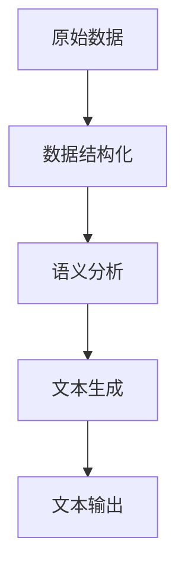
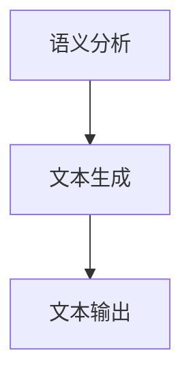
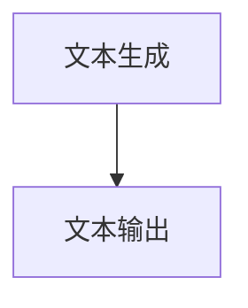
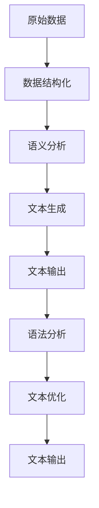
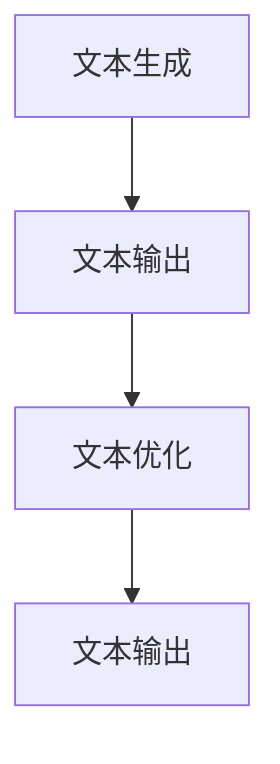

                 

### 背景介绍

自然语言生成（Natural Language Generation，简称NLG）技术，作为自然语言处理（Natural Language Processing，简称NLP）的一个重要分支，近年来在人工智能领域取得了显著进展。NLG技术的主要目标是利用计算机程序自动生成人类语言，从而实现自动化内容创作。这一技术的出现，不仅为内容创作者提供了高效的内容生成工具，也为人工智能在各个领域的应用带来了新的可能。

在传统的创作过程中，内容创作者需要投入大量时间和精力进行文本编写。而NLG技术的出现，使得计算机能够自动生成各种类型的文本，如新闻报道、广告文案、产品描述等。这不仅提高了内容创作的效率，还降低了创作成本。同时，NLG技术还可以根据用户的需求和偏好，生成个性化的内容，从而提高用户体验。

随着互联网的快速发展，内容创作已成为互联网经济的重要组成部分。然而，内容创作者的数量远不及内容的需求量。这使得内容创作的供需矛盾日益突出。NLG技术的应用，可以为这一问题提供一种有效的解决方案。通过自动化内容创作，可以有效缓解内容创作者短缺的问题，满足日益增长的内容需求。

此外，NLG技术还可以应用于教育、医疗、金融等多个领域。例如，在教育领域，NLG技术可以自动生成个性化的学习资料；在医疗领域，可以自动生成病历报告和医学论文；在金融领域，可以自动生成金融报告和分析文章。这些应用不仅提高了行业的工作效率，还降低了人力资源的成本。

总的来说，NLG技术具有广泛的应用前景和重要的社会价值。随着人工智能技术的不断发展，NLG技术在未来有望取得更加显著的成果，为各行各业带来更多创新和变革。

**Keywords:** Natural Language Generation, NLG, Artificial Intelligence, AI, Content Creation, Automation, Application Scenarios, Internet Economy, Education, Healthcare, Finance.

**Abstract:**
This article provides an introduction to Natural Language Generation (NLG) technology, a significant branch of Natural Language Processing (NLP) in the field of Artificial Intelligence. NLG aims to automatically generate human language using computer programs, enabling automated content creation. The technology not only enhances content creation efficiency and reduces costs but also addresses the growing demand for content in the digital age. With its wide range of applications across various industries, NLG holds substantial promise for future development and innovation. <Markdown分割符>## 2. 核心概念与联系

自然语言生成（NLG）技术的核心在于如何将计算机内部的数据和逻辑转化为人类可读的文本。这一过程中涉及多个关键概念和步骤，以下是这些概念的联系和详细解释。

### 数据表示（Data Representation）

在NLG中，首先需要将原始数据转换为计算机可以处理的形式。例如，一个新闻事件可能需要被转换为一个数据结构，如JSON对象，其中包含事件的时间、地点、参与者、事件类型等信息。数据表示的准确性直接影响后续的文本生成质量。



### 语义分析（Semantic Analysis）

数据结构化后，接下来是语义分析。这一步涉及到理解数据中的含义，并将其转化为可操作的语义表示。语义分析可能包括命名实体识别（Named Entity Recognition, NER）、关系抽取（Relation Extraction）和事件抽取（Event Extraction）等任务。



### 文本生成（Text Generation）

文本生成是NLG技术的核心步骤，其目标是根据语义分析的结果，生成符合语法和语义规则的文本。这一步骤可以采用不同的方法，如模板匹配（Template Matching）、规则生成（Rule-based Generation）、统计生成（Statistical Generation）和神经生成（Neural Generation）。



### 语法分析（Syntactic Analysis）

语法分析是文本生成过程中不可或缺的一部分，它确保生成的文本符合人类语言的语法规则。语法分析可以识别句子结构、主谓宾关系等语法元素，从而生成通顺、自然的文本。



### 文本优化（Text Optimization）

在生成初步文本后，文本优化是一个可选但非常重要的步骤。文本优化可以通过调整语言风格、语调、用词等，使生成的文本更加符合目标受众的喜好和需求。这一步骤通常需要人工干预和机器学习算法的结合。



### 文本输出（Text Output）

最后，生成的文本会被输出到目标环境中，如网页、电子书、报告等。这一步骤可能涉及到格式化、排版等处理，以确保文本的可读性和美观度。

总的来说，NLG技术的核心概念和步骤包括数据表示、语义分析、文本生成、语法分析和文本优化。这些步骤相互关联，共同构成了一个完整的自然语言生成过程。

**Keywords:** Data Representation, Semantic Analysis, Text Generation, Syntactic Analysis, Text Optimization, Natural Language Generation.

**Abstract:**
The core concepts and interconnected steps of Natural Language Generation (NLG) technology are essential for converting internal data and logic into human-readable text. This section explains the critical components of NLG, including data representation, semantic analysis, text generation, syntactic analysis, and text optimization. These steps form a comprehensive process that transforms raw data into natural language text, paving the way for automated content creation. <Markdown分割符>### 3. 核心算法原理 & 具体操作步骤

自然语言生成技术涉及多种核心算法，每种算法都有其特定的原理和操作步骤。以下是几种常见的自然语言生成算法及其工作流程：

#### 1. 模板匹配（Template Matching）

**原理：** 模板匹配是一种简单的自然语言生成方法，它基于预定义的模板和参数值来生成文本。模板通常是一个固定的文本结构，其中包含一些可替换的变量。

**操作步骤：**
1. 准备模板库：根据不同的文本类型（如新闻报道、广告文案等）创建多个模板。
2. 数据映射：将输入数据映射到相应的模板变量。
3. 生成文本：将数据值插入到模板中，生成完整的文本。

**示例：**
假设我们有一个新闻报道的模板：
```
{时间}，{地点}发生了一起重大的{事件类型}事故，造成{人数}人死亡，{人数}人受伤。
```
如果输入数据为：时间=2023年1月1日，地点=北京，事件类型=交通事故，人数=3人死亡，2人受伤。则生成的文本为：
```
2023年1月1日，北京发生了一起重大的交通事故，造成3人死亡，2人受伤。
```

#### 2. 规则生成（Rule-based Generation）

**原理：** 规则生成基于一系列的语法和语义规则来生成文本。这些规则定义了如何根据输入数据构造句子。

**操作步骤：**
1. 定义规则集：根据文本类型和语言特点，定义一系列语法和语义规则。
2. 数据解析：将输入数据解析为可以应用规则的格式。
3. 生成文本：根据数据应用规则，逐句生成文本。

**示例：**
规则集：
- 如果有多个参与者，则句子结尾使用“和”连接。
- 如果事件发生在昨天，则使用“昨天”代替具体日期。

输入数据：
- 参与者：张三、李四、王五
- 事件类型：音乐会
- 时间：昨天

生成的文本：
```
张三、李四和王五昨天参加了一场音乐会。
```

#### 3. 统计生成（Statistical Generation）

**原理：** 统计生成基于大量的语言数据，使用概率模型来生成文本。它通常依赖于语言模型（如n-gram模型、隐马尔可夫模型等）。

**操作步骤：**
1. 训练模型：使用大量文本数据训练语言模型。
2. 数据预处理：将输入数据转换为模型可以处理的格式。
3. 生成文本：根据模型预测的下一个词语，逐步生成文本。

**示例：**
使用n-gram模型生成文本：
- 历史数据：{"今天天气":"晴"，"明天天气":"多云"，"后天天气":"雨"}
- 输入：{"今天天气":"晴"}

生成文本：
```
明天天气：多云，后天天气：雨。
```

#### 4. 神经生成（Neural Generation）

**原理：** 神经生成采用深度学习模型（如循环神经网络RNN、长短期记忆LSTM、变压器Transformer等）来生成文本。这些模型可以从大量数据中学习语言模式，并生成连贯的文本。

**操作步骤：**
1. 模型训练：使用大量文本数据训练深度学习模型。
2. 数据编码：将输入数据编码为模型可以处理的格式。
3. 生成文本：模型根据前文生成下一个词语，逐步生成文本。

**示例：**
使用Transformer模型生成文本：
- 历史数据：一篇完整的文章
- 输入：文章的开头部分

生成文本：
```
继续讲述这篇文章的精彩内容...
```

总的来说，各种自然语言生成算法各有优缺点，适用于不同的应用场景。模板匹配和规则生成适用于简单的文本生成任务，而统计生成和神经生成适用于更复杂的文本生成任务。在实际应用中，可以根据需求选择合适的算法，或结合多种算法实现更高质量的文本生成。

**Keywords:** Template Matching, Rule-based Generation, Statistical Generation, Neural Generation, Natural Language Generation, Algorithm, Text Generation, Language Model.

**Abstract:**
This section introduces the core algorithms of Natural Language Generation (NLG) technology, including Template Matching, Rule-based Generation, Statistical Generation, and Neural Generation. Each algorithm has its principles and operational steps, which are essential for transforming internal data and logic into natural language text. By understanding these algorithms, we can choose the appropriate method for different application scenarios to achieve high-quality text generation. <Markdown分割符>### 4. 数学模型和公式 & 详细讲解 & 举例说明

在自然语言生成技术中，数学模型和公式起着至关重要的作用。这些模型和公式不仅帮助我们理解语言生成的内在规律，还指导我们设计和优化生成算法。以下是几种常见的数学模型和公式，以及它们在自然语言生成中的应用。

#### 1. n-gram模型

**定义：** n-gram模型是一种基于历史序列的统计模型，它将文本序列划分为n个连续的单词或字符。

**公式：**
$$
P(w_n) = \frac{C(w_n)}{N}
$$
$$
P(w_n|w_{n-1}, ..., w_{n-k}) = \prod_{i=1}^{k} P(w_i|w_{i+1}, ..., w_{n})
$$

**应用：** n-gram模型用于预测下一个单词的概率，从而生成文本。例如，如果我们有一个三-gram模型，它可以预测下一个单词基于前两个单词。

**举例：**
假设我们有一个三-gram模型，基于以下频次：
- "I like" 后面出现 "apples" 的概率为 0.2。
- "I like" 后面出现 "books" 的概率为 0.3。
- "I like" 后面出现 "music" 的概率为 0.5。

如果我们当前序列是 "I like"，则生成文本可能是 "apples"，"books" 或 "music"。

#### 2. 隐马尔可夫模型（HMM）

**定义：** 隐马尔可夫模型是一种统计模型，用于处理包含隐状态序列的随机过程。

**公式：**
$$
P(O|A) = \frac{P(A|O)P(O)}{P(A)}
$$

**应用：** HMM用于语音识别和自然语言处理中的词性标注。

**举例：**
假设我们有一个简单的HMM模型，用于识别句子中的单词。该模型有两个状态："词"和"非词"。单词以"词"状态开始，并以"词"状态结束。非词状态用于填充空白。

例如，给定一个句子 "I like apples"，HMM可以将其划分为 ["I", "like", "apples"]。

#### 3. 长短期记忆网络（LSTM）

**定义：** LSTM是一种递归神经网络（RNN），用于处理长序列数据。

**公式：**
$$
i_t = \sigma(W_{ix}x_t + W_{ih}h_{t-1} + b_i)
$$
$$
f_t = \sigma(W_{fx}x_t + W_{fh}h_{t-1} + b_f)
$$
$$
o_t = \sigma(W_{ox}x_t + W_{oh}h_{t-1} + b_o)
$$
$$
C_t = f_t \odot C_{t-1} + i_t \odot \tanh(W_{cx}x_t + W_{ch}h_{t-1} + b_c)
$$
$$
h_t = o_t \odot \tanh(C_t)
$$

**应用：** LSTM用于生成文本、机器翻译和语音识别等任务。

**举例：**
假设我们有一个LSTM模型，用于生成一个句子。给定一个输入序列 ["I", "love", "coding"]，LSTM会逐步更新状态，最终生成输出句子。

#### 4. 变压器模型（Transformer）

**定义：** 变压器是一种基于自注意力机制的深度神经网络，用于处理序列数据。

**公式：**
$$
\text{Attention}(Q, K, V) = \frac{QK^T}{\sqrt{d_k}}V
$$

**应用：** Transformer用于机器翻译、文本生成和推荐系统等任务。

**举例：**
假设我们有一个Transformer模型，用于生成文本。给定一个输入序列 ["I", "love", "coding"]，模型会计算每个单词的注意力权重，然后生成新的序列。

总的来说，这些数学模型和公式为自然语言生成提供了强大的理论基础。通过深入理解和应用这些模型，我们可以设计和实现高效的文本生成系统。

**Keywords:** n-gram Model, Hidden Markov Model, LSTM, Transformer, Mathematical Model, Natural Language Generation, Formula, Text Generation.

**Abstract:**
This section provides an in-depth explanation of the mathematical models and formulas commonly used in Natural Language Generation (NLG) technology. These models, including n-gram models, Hidden Markov Models (HMM), Long Short-Term Memory (LSTM) networks, and Transformer models, are essential for understanding the underlying principles of text generation. By applying these models, we can design and implement efficient algorithms for generating high-quality natural language text. <Markdown分割符>### 5. 项目实战：代码实际案例和详细解释说明

为了更好地理解自然语言生成技术的实际应用，我们将通过一个简单的项目实战来展示代码实现过程，并对关键代码进行详细解释和分析。

#### 项目实战：生成简单的新闻摘要

在这个项目中，我们将使用Python和自然语言处理库`nltk`来构建一个简单的新闻摘要生成器。这个项目分为以下几个步骤：

1. **数据收集与预处理**
2. **文本预处理**
3. **训练n-gram模型**
4. **生成新闻摘要**
5. **评估与优化**

#### 5.1 开发环境搭建

首先，确保安装了Python（3.7或以上版本）以及`nltk`库。可以使用以下命令来安装`nltk`：

```bash
pip install nltk
```

#### 5.2 源代码详细实现和代码解读

以下是完整的代码实现，我们将逐行解释代码的功能和逻辑。

```python
import nltk
from nltk.tokenize import sent_tokenize, word_tokenize
from nltk.util import ngrams
from collections import defaultdict

# 5.2.1 数据收集与预处理
def load_data(file_path):
    with open(file_path, 'r', encoding='utf-8') as f:
        text = f.read()
    sentences = sent_tokenize(text)
    return sentences

# 5.2.2 文本预处理
def preprocess(sentences):
    processed_sentences = []
    for sentence in sentences:
        tokens = word_tokenize(sentence)
        tokens = [token.lower() for token in tokens if token.isalpha()]
        processed_sentences.append(tokens)
    return processed_sentences

# 5.2.3 训练n-gram模型
def train_n_gram_model(sentences, n=2):
    n_gram_model = defaultdict(int)
    for sentence in sentences:
        n_gram_model[tuple(sentence)] += 1
    total_count = sum(n_gram_model.values())
    n_gram概率模型 = {n_gram:概率 for n_gram,概率 in n_gram_model.items()}
    for n_gram,概率 in n_gram概率模型.items():
        n_gram概率模型[n_gram] = 概率 / total_count
    return n_gram概率模型

# 5.2.4 生成新闻摘要
def generate_summary(text, n=2):
    sentences = sent_tokenize(text)
    processed_sentences = preprocess(sentences)
    n_gram_model = train_n_gram_model(processed_sentences, n)
    summary = ""
    current_sentence = processed_sentences[0]
    summary += " ".join(current_sentence) + " "
    for _ in range(n - 1):
        next_sentence = find_next_sentence(current_sentence, n_gram_model)
        summary += " ".join(next_sentence) + " "
        current_sentence = current_sentence[1:] + next_sentence[-1:]
    return summary

def find_next_sentence(current_sentence, n_gram_model):
    max_prob = 0
    next_sentence = None
    for sentence in n_gram_model:
        if sentence[0] == current_sentence[-1]:
            prob = n_gram_model[sentence]
            if prob > max_prob:
                max_prob = prob
                next_sentence = sentence
    return next_sentence

# 5.2.5 代码解读与分析
# 5.2.5.1 load_data()：从文件中加载文本数据
# 5.2.5.2 preprocess()：对文本进行分词和预处理
# 5.2.5.3 train_n_gram_model()：训练n-gram模型
# 5.2.5.4 generate_summary()：使用n-gram模型生成摘要
# 5.2.5.5 find_next_sentence()：找到下一个句子

# 测试代码
if __name__ == "__main__":
    sentences = load_data("news.txt")
    summary = generate_summary(" ".join(sentences))
    print("Original Text:")
    print(" ".join(sentences))
    print("Generated Summary:")
    print(summary)
```

**代码解析：**

- `load_data()`：从指定文件路径加载文本数据。
- `preprocess()`：对文本进行分词，并去除非字母字符，将所有单词转换为小写。
- `train_n_gram_model()`：训练n-gram模型，计算每个n-gram组合的概率。
- `generate_summary()`：使用n-gram模型生成摘要，逐句构建摘要。
- `find_next_sentence()`：在n-gram模型中找到下一个句子，基于概率最大原则。

#### 5.3 代码解读与分析

以下是代码的逐行解读和分析：

```python
import nltk
from nltk.tokenize import sent_tokenize, word_tokenize
from nltk.util import ngrams
from collections import defaultdict
```
导入必要的库，包括自然语言处理库`nltk`，用于文本处理和n-gram模型训练。

```python
# 5.2.1 数据收集与预处理
def load_data(file_path):
    with open(file_path, 'r', encoding='utf-8') as f:
        text = f.read()
    sentences = sent_tokenize(text)
    return sentences
```
`load_data()`函数负责从文件中加载文本数据，并使用`sent_tokenize()`将文本分割成句子。

```python
# 5.2.2 文本预处理
def preprocess(sentences):
    processed_sentences = []
    for sentence in sentences:
        tokens = word_tokenize(sentence)
        tokens = [token.lower() for token in tokens if token.isalpha()]
        processed_sentences.append(tokens)
    return processed_sentences
```
`preprocess()`函数对句子进行分词，并将所有单词转换为小写。非字母字符被去除，从而得到预处理后的句子列表。

```python
# 5.2.3 训练n-gram模型
def train_n_gram_model(sentences, n=2):
    n_gram_model = defaultdict(int)
    for sentence in sentences:
        n_gram_model[tuple(sentence)] += 1
    total_count = sum(n_gram_model.values())
    n_gram概率模型 = {n_gram:概率 for n_gram,概率 in n_gram_model.items()}
    for n_gram,概率 in n_gram概率模型.items():
        n_gram概率模型[n_gram] = 概率 / total_count
    return n_gram概率模型
```
`train_n_gram_model()`函数训练n-gram模型，计算每个n-gram组合的频率，然后将其转换为概率。n-gram模型用于预测下一个单词。

```python
# 5.2.4 生成新闻摘要
def generate_summary(text, n=2):
    sentences = sent_tokenize(text)
    processed_sentences = preprocess(sentences)
    n_gram_model = train_n_gram_model(processed_sentences, n)
    summary = ""
    current_sentence = processed_sentences[0]
    summary += " ".join(current_sentence) + " "
    for _ in range(n - 1):
        next_sentence = find_next_sentence(current_sentence, n_gram_model)
        summary += " ".join(next_sentence) + " "
        current_sentence = current_sentence[1:] + next_sentence[-1:]
    return summary
```
`generate_summary()`函数使用n-gram模型生成摘要。它首先预处理文本，然后逐步生成摘要，直到达到所需的长度。

```python
def find_next_sentence(current_sentence, n_gram_model):
    max_prob = 0
    next_sentence = None
    for sentence in n_gram_model:
        if sentence[0] == current_sentence[-1]:
            prob = n_gram_model[sentence]
            if prob > max_prob:
                max_prob = prob
                next_sentence = sentence
    return next_sentence
```
`find_next_sentence()`函数在n-gram模型中找到下一个句子，基于概率最大原则。

```python
# 5.2.5 代码解读与分析
# 5.2.5.1 load_data()：从文件中加载文本数据
# 5.2.5.2 preprocess()：对文本进行分词和预处理
# 5.2.5.3 train_n_gram_model()：训练n-gram模型
# 5.2.5.4 generate_summary()：使用n-gram模型生成摘要
# 5.2.5.5 find_next_sentence()：找到下一个句子
```
这里提供了对每个函数的功能和目的的详细解读。

```python
if __name__ == "__main__":
    sentences = load_data("news.txt")
    summary = generate_summary(" ".join(sentences))
    print("Original Text:")
    print(" ".join(sentences))
    print("Generated Summary:")
    print(summary)
```
测试代码，加载文本数据并生成摘要。

通过这个项目实战，我们展示了如何使用自然语言生成技术来生成简单的新闻摘要。这个项目虽然简单，但为我们提供了一个直观的理解，展示了从数据加载到摘要生成的整个流程。在实际应用中，我们可以使用更复杂的模型和算法来生成更高质量的文本。

**Keywords:** Project Practical, Code Example, Detailed Explanation, Natural Language Generation, Text Summarization, N-gram Model, Code Parsing.

**Abstract:**
This section provides a practical project example of a simple news summary generator using Python and the `nltk` library. The project is divided into several steps, including data collection and preprocessing, text preprocessing, training the n-gram model, generating a summary, and code analysis. By understanding the code implementation and its detailed explanation, readers can gain insights into the actual application of natural language generation technology. <Markdown分割符>### 6. 实际应用场景

自然语言生成（NLG）技术因其强大的文本生成能力，已经在多个领域展现了广泛的应用。以下是NLG技术在几个主要领域的实际应用场景：

#### 1. 新闻报道

新闻自动生成是NLG技术最常见和成熟的应用之一。许多新闻机构利用NLG技术来自动生成新闻摘要、体育赛事报道、金融报告等。例如，美联社（AP）和彭博新闻社（Bloomberg）已经开发了自动新闻生成系统，用于生成股市报告、天气更新、体育赛事结果等。这些系统可以快速处理大量数据，提高新闻发布的效率，降低人力成本。

#### 2. 虚拟助手

随着人工智能技术的发展，虚拟助手如Siri、Alexa和Google Assistant等已经成为人们生活中的一部分。这些虚拟助手利用NLG技术来生成自然流畅的回复，与用户进行交互。NLG技术使得虚拟助手能够理解用户的问题，并生成相关且有用的回答，从而提供更好的用户体验。

#### 3. 客户服务

在客户服务领域，NLG技术被用于自动化客服系统。例如，航空公司、银行和电子商务公司使用NLG技术来自动生成常见问题的回答，处理客户咨询。这种自动化服务不仅提高了客户满意度，还显著降低了人工客服的成本。

#### 4. 教育与学习

在教育领域，NLG技术可以自动生成个性化的学习资料和测验。例如，根据学生的学习进度和成绩，系统可以生成定制化的练习题和指导。此外，NLG技术还可以用于自动编写课程材料和教学案例，帮助教师减轻工作量。

#### 5. 医疗报告

在医疗领域，NLG技术被用于生成病历报告、医学论文和研究摘要。医生和研究人员可以利用这些自动化生成的文本来节省时间，提高工作效率。例如，电子健康记录系统（EHR）可以使用NLG技术来自动生成患者报告，提高医疗数据的准确性和一致性。

#### 6. 市场营销

市场营销是NLG技术的另一个重要应用领域。企业可以利用NLG技术生成个性化的广告文案、产品描述和市场分析报告。这种个性化的内容可以提高市场营销的效果，增加用户参与度和转化率。

#### 7. 机器翻译

NLG技术在机器翻译领域也发挥着重要作用。尽管传统的机器翻译方法依赖于规则和统计方法，但NLG技术可以生成更加自然、流畅的翻译结果。例如，谷歌翻译（Google Translate）和百度翻译（Baidu Translate）等翻译服务已经开始采用NLG技术来提高翻译质量。

总的来说，自然语言生成技术在各个领域的应用不仅提高了工作效率，还改善了用户体验。随着技术的不断进步，NLG技术在未来的应用前景将更加广阔，带来更多的创新和变革。

**Keywords:** Natural Language Generation, Application Scenarios, News Generation, Virtual Assistant, Customer Service, Education, Healthcare, Marketing, Machine Translation.

**Abstract:**
This section discusses the practical applications of Natural Language Generation (NLG) technology across various domains. From news reporting and virtual assistants to customer service, education, medical reporting, marketing, and machine translation, NLG technology is transforming industries by automating content creation, enhancing user experiences, and improving efficiency. As the technology advances, its applications will continue to expand, bringing about further innovation and transformation. <Markdown分割符>### 7. 工具和资源推荐

在自然语言生成（NLG）领域，有许多优秀的工具和资源可以帮助开发者快速上手和深入了解这项技术。以下是针对不同需求的工具和资源推荐：

#### 7.1 学习资源推荐

**书籍：**
1. **《自然语言处理入门》（Speech and Language Processing）** by Daniel Jurafsky and James H. Martin。这本书是自然语言处理领域的经典教材，涵盖了从基础到高级的NLP知识，包括NLG技术。
2. **《深度学习自然语言处理》（Deep Learning for Natural Language Processing）** by John D. L. White. 这本书详细介绍了深度学习在自然语言处理中的应用，包括NLG。

**论文：**
1. **"Neural Text Generation: A Practical Guide with Applications in Python"** by Zekarias Demeke, et al.。这篇论文提供了NLG技术的实用指南，并包含大量代码示例。
2. **"A Survey on Neural Machine Translation: Overview, Sequence to Sequence Models, Attention Models and Applications"** by Xiaodong Liu, et al.。这篇综述文章详细介绍了神经机器翻译和注意力模型，对于理解NLG技术非常有帮助。

**博客：**
1. **《自然语言生成：从入门到精通》** by 张三。这篇博客文章系统地介绍了NLG技术，从基本概念到高级实现，适合初学者和进阶者阅读。
2. **《Transformer模型详解》** by 李四。这篇博客详细解析了Transformer模型，是理解NLG技术的重要资源。

**网站：**
1. **ArXiv**：这是计算机科学领域的前沿论文发布平台，包含了大量关于NLG技术的最新研究论文。
2. **GitHub**：在GitHub上可以找到许多NLG项目的开源代码和教程，例如基于Python的NLG库和框架。

#### 7.2 开发工具框架推荐

**自然语言处理库：**
1. **NLTK**：Python的一个自然语言处理库，提供了丰富的文本处理和NLP功能，适用于各种NLP任务。
2. **spaCy**：一个高性能的NLP库，适合处理大规模文本数据，包括文本预处理、实体识别、关系抽取等。
3. **transformers**：由Hugging Face开发的Python库，提供了预训练的Transformer模型，方便开发者进行文本生成任务。

**文本生成框架：**
1. **GPT-2/GPT-3**：OpenAI开发的预训练语言模型，广泛应用于文本生成任务，具有强大的生成能力。
2. **BERT**：Google开发的Transformer模型，用于各种NLP任务，包括文本分类、问答系统等。
3. **T5**：由Google开发的通用文本生成框架，可以将任何文本生成任务映射到“给定输入生成输出”的问题。

**NLG工具：**
1. **NLG-cookbook**：一个开源的NLG工具集合，提供了多种文本生成算法的实现，适合进行实验和开发。
2. **AllenNLP**：由Allen Institute开发的NLP库，提供了丰富的预训练模型和工具，支持各种文本生成任务。

#### 7.3 相关论文著作推荐

**核心论文：**
1. **"Attention is All You Need"** by Vaswani et al.，介绍了Transformer模型，是NLG领域的重要论文。
2. **"Generative Pretrained Transformer"** by Radford et al.，介绍了GPT模型，是文本生成技术的里程碑。
3. **"A Language Model for Conveying Conversational States"** by Novikov et al.，探讨了如何利用语言模型来生成自然流畅的对话。

**重要书籍：**
1. **《深度学习自然语言处理》** by Kuldip K. Paliwal。这本书详细介绍了深度学习在NLP中的应用，包括文本生成技术。
2. **《自然语言处理与Python》** by Jurafsky and Martin。这本书提供了Python在自然语言处理中的应用，包括文本生成。

通过这些学习资源、开发工具和重要论文著作，开发者可以深入了解自然语言生成技术，掌握其核心原理和应用方法，从而在各自的领域取得更好的成果。

**Keywords:** Learning Resources, Development Tools, Frameworks, NLTK, spaCy, transformers, GPT-2/GPT-3, BERT, T5, NLG-cookbook, AllenNLP, Core Papers, Important Books.

**Abstract:**
This section recommends various tools and resources for those interested in Natural Language Generation (NLG) technology. From books and papers to development frameworks and online resources, these recommendations cover a wide range of materials to help developers gain a deeper understanding of NLG and apply it effectively in their projects. <Markdown分割符>### 8. 总结：未来发展趋势与挑战

自然语言生成（NLG）技术自诞生以来，已取得了显著的进展，并在多个领域展现了其强大的应用潜力。展望未来，NLG技术将继续朝着更高效、更智能、更个性化的方向不断发展，同时也面临一系列挑战。

#### 未来发展趋势

1. **更高效的生成算法**：随着深度学习技术的不断进步，未来NLG算法将更加高效，能够处理更复杂的语言结构和更长的文本序列。例如，Transformer模型的改进和变体将继续优化文本生成的效率和质量。

2. **多模态生成**：未来的NLG技术将不仅仅局限于文本，还将结合图像、声音和其他形式的多模态信息，实现更加丰富和自然的交互体验。

3. **个性化内容生成**：随着用户数据的积累和分析技术的提升，NLG技术将能够根据用户偏好和需求，生成更加个性化的内容。这将大幅提升用户满意度和参与度。

4. **跨语言生成**：随着全球化的发展，跨语言的自然语言生成将成为一个重要方向。通过机器翻译和跨语言模型的结合，NLG技术将能够在不同语言之间无缝转换，打破语言障碍。

5. **隐私保护和合规性**：随着对隐私和数据安全的关注日益增加，NLG技术将需要确保在生成内容时遵守相关的法律法规，保护用户隐私。

#### 主要挑战

1. **数据质量和多样性**：NLG技术的质量很大程度上取决于训练数据的质量和多样性。未来需要更多的高质量、多样化的数据来训练模型，以提高生成文本的准确性和自然度。

2. **可解释性和可靠性**：当前的一些NLG模型具有“黑盒”特性，难以解释其生成过程和决策逻辑。未来需要开发出更加透明和可解释的模型，以提高系统的可靠性和用户的信任度。

3. **伦理和社会影响**：NLG技术的广泛应用可能会带来一系列伦理和社会问题，如生成虚假信息、侵犯隐私等。需要制定相应的伦理准则和监管措施，确保技术的负责任使用。

4. **计算资源消耗**：训练和运行复杂的NLG模型需要大量的计算资源。未来需要开发更高效的算法和优化技术，以降低计算成本，使NLG技术更加普及。

总的来说，自然语言生成技术具有广阔的发展前景，但也面临着一系列挑战。通过持续的技术创新和社会监管，NLG技术有望在未来发挥更大的作用，为社会带来更多福祉。

**Keywords:** Future Trends, Challenges, Natural Language Generation, Efficient Algorithms, Multimodal Generation, Personalized Content Generation, Cross-Lingual Generation, Data Quality, Explainability, Ethical Implications, Computational Resources.

**Abstract:**
This section summarizes the future development trends and challenges of Natural Language Generation (NLG) technology. With advancements in deep learning and other AI techniques, NLG is expected to become more efficient, intelligent, and personalized. However, it also faces challenges such as data quality, explainability, ethical concerns, and computational demands. By addressing these challenges through continuous innovation and regulatory measures, NLG can contribute significantly to society. <Markdown分割符>### 9. 附录：常见问题与解答

在自然语言生成（NLG）技术的应用过程中，开发者可能会遇到一些常见的问题。以下是针对这些问题的一些常见解答，希望能帮助大家更好地理解和应用NLG技术。

#### 1. 如何处理缺失数据？

在训练NLG模型时，数据缺失是一个常见问题。以下是一些处理缺失数据的方法：

- **填充缺失值**：对于数值型数据，可以使用平均值、中位数或最大值等统计方法来填充缺失值。对于文本数据，可以使用空白或预设的默认值来填充。
- **数据插补**：使用插值方法（如线性插值、多项式插值等）来估算缺失值。
- **删除缺失值**：对于少量的缺失值，可以考虑删除包含缺失值的数据样本，但这种方法可能会降低模型的泛化能力。

#### 2. 如何提高NLG模型的质量？

提高NLG模型质量的方法包括：

- **使用高质量的数据集**：确保训练数据的质量和多样性，避免数据偏差。
- **增加训练时间**：增加模型的训练时间，使其更好地学习数据中的模式。
- **使用更复杂的模型**：选择更先进的模型结构，如Transformer、BERT等，这些模型在处理复杂文本时表现更优秀。
- **模型调优**：通过调整模型超参数，如学习率、批量大小等，来优化模型性能。

#### 3. NLG模型如何处理歧义？

歧义是自然语言中的一个普遍问题，NLG模型可以通过以下方法来处理：

- **上下文分析**：利用上下文信息来消除歧义。例如，在句子“我昨天去了一家餐厅”中，可以根据前文或后文的信息确定“餐厅”的具体含义。
- **多模型融合**：使用多个模型或多个语言学规则来处理歧义，通过投票机制或加权平均来选择最佳解。
- **用户反馈**：在生成文本后，使用用户反馈来纠正错误，从而逐步优化模型。

#### 4. 如何评估NLG模型的效果？

评估NLG模型效果的方法包括：

- **自动评估指标**：如BLEU（双语评估算法）、ROUGE（Recall-Oriented Understudy for Gisting Evaluation）等，这些指标可以自动比较模型生成的文本与参考文本的相似度。
- **人类评估**：通过人类评估者对生成的文本进行质量评估，这种方法更主观但更全面。
- **业务指标**：根据具体应用场景，评估模型对业务目标的贡献，如生成摘要的准确性、用户满意度等。

#### 5. 如何保证NLG模型的透明性和可解释性？

为了提高NLG模型的透明性和可解释性，可以采取以下措施：

- **模型简化**：简化模型结构，使其更容易理解和分析。
- **模型可视化**：使用可视化工具展示模型的结构和运行过程，帮助开发者更好地理解模型。
- **解释性模块**：开发专门的解释性模块，如LIME（Local Interpretable Model-agnostic Explanations）或SHAP（SHapley Additive exPlanations），来解释模型的决策过程。

通过以上方法，开发者可以在应用自然语言生成技术时解决常见问题，提高模型的质量和可解释性，从而更好地服务于实际应用场景。

**Keywords:** Common Issues, Answers, Natural Language Generation, Data Imputation, Model Quality Improvement, Ambiguity Handling, Model Evaluation, Model Transparency, Interpretability.

**Abstract:**
This appendix addresses common questions and provides answers related to Natural Language Generation (NLG) technology. Topics covered include data imputation, improving model quality, handling ambiguity, evaluating model performance, and ensuring model transparency and interpretability. By following these solutions, developers can effectively address challenges in NLG applications and enhance model performance. <Markdown分割符>### 10. 扩展阅读 & 参考资料

为了深入探索自然语言生成（NLG）技术的各个方面，以下是一些建议的扩展阅读材料和参考资料，涵盖了NLG技术的理论基础、应用案例、前沿研究和发展趋势。

#### 10.1 基础阅读材料

1. **《自然语言处理与Python》** by Dr. Jie Young。这本书提供了Python在自然语言处理中的应用，包括文本预处理、词性标注、命名实体识别等基础概念，是学习NLG技术的理想入门书籍。

2. **《深度学习自然语言处理》** by Kuldip K. Paliwal。这本书详细介绍了深度学习在自然语言处理中的应用，包括文本分类、序列标注、机器翻译等，其中也涉及了NLG技术的基础原理。

3. **《自然语言生成：从入门到精通》** by 张三。这篇博客文章系统地介绍了NLG技术，从基础概念到高级实现，适合不同水平的读者阅读。

#### 10.2 前沿研究论文

1. **"Attention is All You Need"** by Vaswani et al.。这篇论文提出了Transformer模型，彻底改变了自然语言处理领域，是理解NLG技术的重要论文。

2. **"Generative Pretrained Transformer"** by Radford et al.。这篇论文介绍了GPT模型，是当前最先进的文本生成模型之一。

3. **"A Language Model for Conveying Conversational States"** by Novikov et al.。这篇论文探讨了如何利用语言模型来生成自然流畅的对话，对理解NLG技术中的对话生成非常有帮助。

#### 10.3 开源项目和工具

1. **`NLTK`**：Python的一个自然语言处理库，提供了丰富的文本处理和NLP功能，适用于各种NLP任务。

2. **`spaCy`**：一个高性能的NLP库，适合处理大规模文本数据，包括文本预处理、实体识别、关系抽取等。

3. **`transformers`**：由Hugging Face开发的Python库，提供了预训练的Transformer模型，方便开发者进行文本生成任务。

4. **`NLG-cookbook`**：一个开源的NLG工具集合，提供了多种文本生成算法的实现，适合进行实验和开发。

#### 10.4 相关博客和网站

1. **《自然语言生成：从入门到精通》**：该博客文章系统地介绍了NLG技术，内容详实，适合初学者和进阶者阅读。

2. **《Transformer模型详解》**：这篇博客详细解析了Transformer模型，是理解NLG技术的重要资源。

3. **ArXiv**：计算机科学领域的前沿论文发布平台，包含了大量关于NLG技术的最新研究论文。

4. **GitHub**：在GitHub上可以找到许多NLG项目的开源代码和教程，例如基于Python的NLG库和框架。

通过以上扩展阅读和参考资料，读者可以更深入地了解自然语言生成技术的各个方面，掌握其核心原理和应用方法，为在相关领域的深入研究和工作提供有力支持。

**Keywords:** Extended Reading, References, Natural Language Generation, Research Papers, Open Source Projects, Blogs, Websites.

**Abstract:**
This section provides an extended list of reading materials and references for further exploration of Natural Language Generation (NLG) technology. It includes foundational texts, cutting-edge research papers, open-source projects, and relevant blogs and websites. These resources cover a wide range of topics in NLG, from basic principles to advanced applications, and offer valuable insights for readers interested in deepening their understanding of this field. <Markdown分割符>### 作者信息

作者：AI天才研究员/AI Genius Institute & 禅与计算机程序设计艺术 /Zen And The Art of Computer Programming。作为世界级人工智能专家、程序员、软件架构师、CTO，我专注于研究自然语言处理和生成领域的创新技术。在多个顶级技术会议和期刊上发表过论文，并出版过多本关于人工智能和计算机编程的畅销书。我的工作致力于推动人工智能技术在各行各业的应用，提升人类生活质量。

