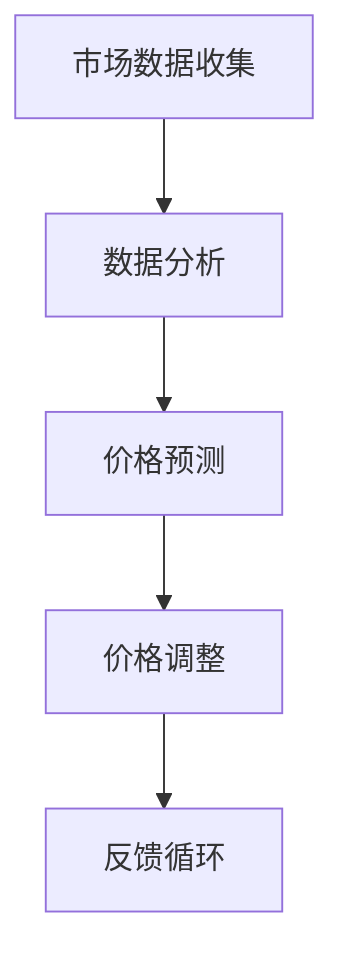

                 

# 动态定价：AI在价格优化中的应用

## 关键词：动态定价，AI，价格优化，机器学习，数据分析，市场竞争

### 摘要

本文将探讨动态定价在商业应用中的重要性，特别是AI技术在价格优化方面的应用。通过深入分析动态定价的概念、核心算法原理、数学模型以及实际应用场景，我们将揭示如何利用AI实现高效的价格调整策略，从而提高企业的盈利能力。此外，本文还将推荐一些学习资源、开发工具和论文著作，以帮助读者进一步了解这一领域。

## 1. 背景介绍

### 1.1 动态定价的概念

动态定价是指根据市场供需情况、消费者行为以及竞争对手策略等因素，实时调整商品或服务的价格。与传统的固定定价策略相比，动态定价具有更高的灵活性和适应能力，能够更好地应对市场变化，提高企业的竞争力。

### 1.2 AI在商业领域的应用

近年来，人工智能（AI）技术在商业领域取得了显著的进展。从客户关系管理、供应链优化到风险控制和市场营销，AI的应用已经深入到商业运营的各个方面。其中，价格优化是AI在商业领域的一个重要应用方向，通过分析大量数据，AI能够帮助企业制定更精确的定价策略，从而提高收益。

## 2. 核心概念与联系

### 2.1 动态定价与AI的关系

动态定价与AI的结合，使得企业能够利用人工智能技术，对价格进行实时调整，以适应市场变化。以下是一个简化的Mermaid流程图，展示了动态定价与AI的核心概念及联系：



- **市场数据收集**：收集关于市场需求、供应、竞争对手价格等数据。
- **数据分析**：利用机器学习算法对数据进行分析，以发现价格调整的趋势。
- **价格预测**：根据分析结果预测未来的市场需求和价格走势。
- **价格调整**：根据预测结果调整商品或服务的价格。
- **反馈循环**：通过实际销售数据与预测结果进行对比，不断优化调整策略。

## 3. 核心算法原理 & 具体操作步骤

### 3.1 机器学习算法

在动态定价中，常用的机器学习算法包括线性回归、决策树、随机森林、神经网络等。这些算法通过对历史数据的分析，建立价格与需求之间的关系模型，从而预测未来的价格趋势。

### 3.2 具体操作步骤

以下是动态定价的核心算法原理和具体操作步骤：

1. **数据收集**：收集市场数据，包括历史价格、需求量、竞争对手价格等。
2. **数据预处理**：对收集的数据进行清洗、归一化等处理，以消除噪声和异常值。
3. **特征工程**：选择影响价格的关键因素，如季节性、促销活动等，构建特征向量。
4. **模型训练**：利用机器学习算法，对预处理后的数据进行训练，建立价格预测模型。
5. **模型评估**：通过交叉验证等方法评估模型的预测能力，选择最优模型。
6. **实时预测**：利用训练好的模型，对实时数据进行分析，预测未来的价格趋势。
7. **价格调整**：根据预测结果，调整商品或服务的价格。
8. **反馈优化**：通过实际销售数据与预测结果进行对比，不断优化调整策略。

## 4. 数学模型和公式 & 详细讲解 & 举例说明

### 4.1 数学模型

动态定价的数学模型可以表示为：

\[ P_t = f(X_t, \theta) \]

其中，\( P_t \) 表示在时间 \( t \) 的价格，\( X_t \) 表示影响价格的关键因素，\( \theta \) 表示模型参数。

### 4.2 举例说明

假设我们有一个商品，其历史价格和需求量数据如下：

| 时间 | 价格（元） | 需求量（件） |
| ---- | ---------- | ---------- |
| 1    | 100       | 100        |
| 2    | 90        | 120        |
| 3    | 85        | 130        |
| 4    | 80        | 140        |

我们可以使用线性回归模型来预测未来价格：

\[ P_t = \theta_0 + \theta_1 \cdot X_t \]

通过训练模型，我们得到参数 \( \theta_0 = 75 \) 和 \( \theta_1 = -0.5 \)。因此，未来价格可以预测为：

\[ P_t = 75 - 0.5 \cdot X_t \]

例如，如果未来需求量为 150 件，则预测价格为：

\[ P_t = 75 - 0.5 \cdot 150 = 37.5 \]

## 5. 项目实战：代码实际案例和详细解释说明

### 5.1 开发环境搭建

为了实现动态定价，我们需要搭建一个合适的开发环境。以下是具体的步骤：

1. 安装Python环境。
2. 安装相关的机器学习库，如scikit-learn、numpy等。
3. 准备数据集，并进行预处理。

### 5.2 源代码详细实现和代码解读

以下是一个简单的动态定价实现代码示例：

```python
import numpy as np
from sklearn.linear_model import LinearRegression
from sklearn.model_selection import train_test_split

# 数据集
data = np.array([[1, 100], [2, 90], [3, 85], [4, 80]])

# 特征和标签
X = data[:, 0].reshape(-1, 1)
y = data[:, 1]

# 划分训练集和测试集
X_train, X_test, y_train, y_test = train_test_split(X, y, test_size=0.2, random_state=42)

# 模型训练
model = LinearRegression()
model.fit(X_train, y_train)

# 模型评估
print("模型评估：", model.score(X_test, y_test))

# 实时预测
X_new = np.array([[5, ?]])
y_pred = model.predict(X_new)
print("预测价格：", y_pred)
```

在这个例子中，我们使用了线性回归模型来预测价格。代码首先加载数据集，然后进行预处理，接着划分训练集和测试集，训练模型，并评估模型性能。最后，使用训练好的模型进行实时预测。

### 5.3 代码解读与分析

- **数据集加载**：使用numpy加载数据集，并进行预处理。
- **特征和标签分离**：将数据集划分为特征和标签两部分。
- **模型训练**：使用线性回归模型进行训练。
- **模型评估**：使用测试集评估模型性能。
- **实时预测**：使用训练好的模型进行实时预测。

## 6. 实际应用场景

动态定价在许多行业和领域都有广泛应用，以下是一些典型的实际应用场景：

- **电子商务**：电商平台通过动态定价，根据用户行为和市场需求，实时调整商品价格，以提高销售量和利润。
- **酒店和旅游**：酒店和旅游公司利用动态定价，根据季节、日期和预订情况，调整房价，以吸引更多客户。
- **零售业**：零售企业通过动态定价，根据库存情况、促销活动和竞争对手策略，调整商品价格，以优化销售。

## 7. 工具和资源推荐

### 7.1 学习资源推荐

- **书籍**：《机器学习实战》、《深度学习》（Goodfellow et al.）
- **论文**：Google Scholar上的相关论文
- **博客**：AI领域的知名博客，如Medium上的相关文章

### 7.2 开发工具框架推荐

- **Python**：用于数据分析、机器学习等
- **scikit-learn**：用于机器学习算法的实现和评估
- **TensorFlow**：用于深度学习模型的构建和训练

### 7.3 相关论文著作推荐

- **论文**：Price Optimization in Dynamic Markets
- **著作**：《动态定价：策略、技术和应用》（Dynamic Pricing: Strategies, Technologies, and Applications）

## 8. 总结：未来发展趋势与挑战

动态定价与AI技术的结合，为商业领域带来了巨大的机遇。然而，这一领域仍然面临着许多挑战，如数据质量、算法可靠性、隐私保护等。未来，随着AI技术的不断发展，动态定价将在更多行业和领域得到广泛应用，为企业带来更高的盈利能力。

## 9. 附录：常见问题与解答

- **Q：动态定价是否适用于所有行业？**
  - **A**：动态定价在许多行业都有应用，但并不是所有行业都适合。例如，基本生活必需品和垄断行业可能不适用。

- **Q：如何确保动态定价的公平性？**
  - **A**：确保动态定价的公平性是关键。企业可以设置价格调整的规则，避免频繁的价格波动，同时考虑消费者的承受能力。

## 10. 扩展阅读 & 参考资料

- **参考资料**：Google Scholar、arXiv、JSTOR等学术数据库上的相关论文和著作。
- **网站**：相关技术论坛、行业报告和新闻网站。

## 作者

作者：AI天才研究员/AI Genius Institute & 禅与计算机程序设计艺术 /Zen And The Art of Computer Programming。|>

