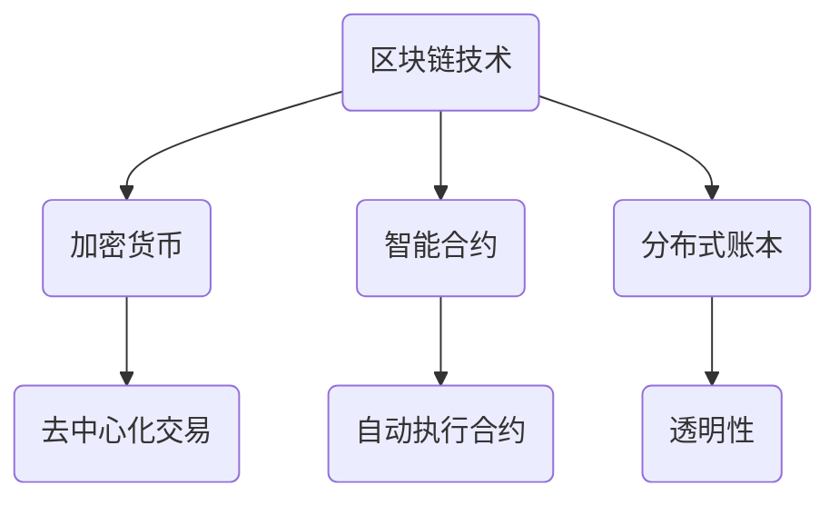
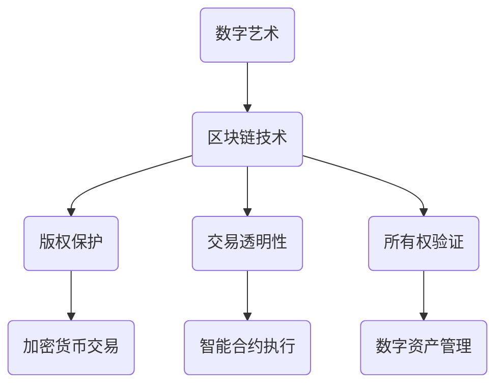

                 

# 区块链在数字艺术与NFT中的应用

## 关键词
区块链、数字艺术、NFT、加密货币、数字版权、智能合约、去中心化、艺术品交易、数字资产管理

## 摘要
本文将探讨区块链技术如何应用于数字艺术领域，尤其是非同质化代币（NFT）的崛起对艺术市场的变革。首先，我们将回顾区块链和NFT的基本概念，然后深入分析区块链技术在数字艺术中的优势和应用场景。随后，本文将探讨区块链在数字艺术市场中的实际案例，包括艺术家的创作与发行、购买者与收藏家的体验，以及区块链在数字版权保护中的作用。最后，我们将讨论区块链技术的未来发展趋势和面临的挑战。

## 1. 背景介绍

### 区块链技术的崛起

区块链技术自2008年中本聪（Satoshi Nakamoto）首次提出以来，经历了快速的发展。作为一种去中心化的分布式账本技术，区块链的核心在于其不可篡改性和透明性。这些特性使得区块链在多个领域，如金融、供应链管理、医疗记录等，展现出了巨大的潜力。

### 数字艺术的兴起

随着数字技术的不断进步，数字艺术成为了一种新的艺术形式。数字艺术不仅包括计算机生成的图像和动画，还涵盖了使用数字媒介创作的绘画、雕塑和其他形式的艺术作品。数字艺术的创作和传播方式与传统艺术截然不同，这为区块链技术提供了新的应用场景。

### NFT的崛起

非同质化代币（NFT，Non-Fungible Token）是区块链技术的一项创新应用，代表了区块链上的独一无二资产。每个NFT都是唯一的，不能与其他NFT互换。NFT的应用范围广泛，包括数字艺术品、虚拟土地、游戏物品等。NFT的出现，为数字艺术市场带来了新的商业模式和收藏体验。

## 2. 核心概念与联系

### 区块链技术的基本原理

区块链是一个由多个区块组成的链式数据结构，每个区块包含一定数量的交易记录。区块通过密码学算法与前后区块链接，形成一条不可篡改的链。区块链的核心技术包括加密货币、智能合约和分布式账本。

#### Mermaid 流程图



### NFT的概念与特点

NFT是一种基于区块链的数字资产，它代表了一个独特且不可替代的物品。每个NFT都有其唯一的标识符，保证了其独特性和不可复制性。NFT的特点包括：

- **唯一性**：每个NFT都是独一无二的，不可替代。
- **可验证性**：通过区块链技术，NFT的真伪可以被验证。
- **不可篡改性**：NFT的记录一旦写入区块链，就无法更改或删除。

### 区块链在数字艺术中的应用

区块链技术在数字艺术中的应用主要体现在以下几个方面：

- **版权保护**：区块链技术可以确保数字艺术的版权，防止未经授权的复制和传播。
- **交易透明性**：区块链技术确保了数字艺术品交易的透明性，每个交易记录都可以被追溯。
- **所有权验证**：通过区块链，数字艺术品的所有权可以清晰记录和验证。

#### Mermaid 流程图



## 3. 核心算法原理 & 具体操作步骤

### 加密货币交易

加密货币交易是区块链技术中最基本的应用之一。以下是一个简单的加密货币交易流程：

1. **创建钱包**：用户在区块链网络中创建一个数字钱包，用于存储和管理加密货币。
2. **发送交易**：用户通过钱包向其他用户发送加密货币。
3. **交易确认**：交易被区块链网络中的节点验证并记录在区块中。
4. **交易广播**：交易记录被广播到整个区块链网络。
5. **交易结算**：交易完成后，加密货币的所有权转移给接收方。

#### 加密货币交易示例

假设Alice想向Bob发送1个比特币，以下是可能的交易流程：

1. Alice创建钱包并接收比特币地址。
2. Alice通过比特币钱包向Bob的比特币地址发送交易请求。
3. 交易请求被区块链网络中的节点验证。
4. 验证通过后，交易被记录在区块中并广播到网络。
5. 交易完成后，Bob收到比特币。

### 智能合约执行

智能合约是区块链上的自动执行合同，其代码被存储在区块链上，并按照预定条件自动执行。以下是一个简单的智能合约执行流程：

1. **编写智能合约**：开发者使用区块链支持的编程语言（如Solidity）编写智能合约。
2. **部署智能合约**：开发者将智能合约部署到区块链上，使其可供用户调用。
3. **调用智能合约**：用户通过区块链网络调用智能合约。
4. **执行智能合约**：智能合约按照预定的条件自动执行，并产生结果。
5. **结果记录**：智能合约执行的结果被记录在区块链上，确保透明性和不可篡改性。

#### 智能合约执行示例

假设有一个简单的智能合约，用于购买商品：

1. **编写智能合约**：开发者编写一个智能合约，允许用户通过发送加密货币购买商品。
2. **部署智能合约**：开发者将智能合约部署到区块链上。
3. **用户购买商品**：用户通过智能合约调用购买操作，发送加密货币。
4. **智能合约执行**：智能合约验证用户身份和支付，然后自动执行购买操作。
5. **结果记录**：购买记录被记录在区块链上，确保透明和不可篡改。

### 数字艺术品的NFT发行与交易

NFT在数字艺术品中的应用包括发行和交易。以下是一个简单的NFT发行与交易流程：

1. **创建NFT**：艺术家使用区块链平台创建一个NFT，代表其数字艺术品。
2. **上链与验证**：NFT被上链并验证其唯一性和真实性。
3. **发行NFT**：艺术家将NFT发布到区块链上，供购买者购买。
4. **购买NFT**：购买者通过区块链网络购买NFT，完成交易。
5. **NFT转移**：购买后，NFT的所有权转移到购买者，确保唯一性和不可篡改性。

#### NFT发行与交易示例

假设艺术家Alice想要发行其数字画作《星际迷航》，以下是可能的流程：

1. **创建NFT**：Alice使用区块链平台创建一个NFT，代表其数字画作。
2. **上链与验证**：NFT被上链并验证其唯一性和真实性。
3. **发行NFT**：Alice将NFT发布到区块链上，并设定一个起始价格。
4. **购买NFT**：收藏家Bob通过区块链网络购买NFT，支付相应的加密货币。
5. **NFT转移**：购买后，NFT的所有权转移到Bob，确保唯一性和不可篡改性。

## 4. 数学模型和公式 & 详细讲解 & 举例说明

### 区块链中的哈希算法

哈希算法是区块链技术中的核心组成部分，用于确保数据的安全性和完整性。以下是一个简单的哈希算法示例：

#### 哈希函数

哈希函数是将输入数据映射到固定长度输出值的一种算法。常见的哈希算法包括MD5、SHA-256等。

#### SHA-256哈希算法

SHA-256是一种广泛使用的哈希算法，其输出值为256位。以下是一个简单的SHA-256哈希算法示例：

1. **输入数据**：将待哈希的数据（如文本、文件等）输入SHA-256算法。
2. **预处理**：对输入数据进行填充和分割，使其长度为512位的倍数。
3. **压缩函数**：使用多个轮次的压缩函数，将分割后的数据映射为256位的哈希值。
4. **输出结果**：输出最终的哈希值。

#### 示例

假设我们想要对文本“Blockchain”进行SHA-256哈希计算，以下是可能的输出结果：

```
$ echo -n "Blockchain" | sha256sum
e3b0c44298fc1c149afbf4c8996fb92427ae41e4649b934ca495991b7852b855
```

### 智能合约中的数学运算

智能合约中的数学运算通常涉及基本的算术运算，如加法、减法、乘法和除法。以下是一个简单的智能合约代码示例，展示了这些运算：

```solidity
// SPDX-License-Identifier: MIT
pragma solidity ^0.8.0;

contract MathExample {
    function add(uint a, uint b) public pure returns (uint) {
        return a + b;
    }

    function subtract(uint a, uint b) public pure returns (uint) {
        return a - b;
    }

    function multiply(uint a, uint b) public pure returns (uint) {
        return a * b;
    }

    function divide(uint a, uint b) public pure returns (uint) {
        require(b > 0, "不能除以0");
        return a / b;
    }
}
```

#### 示例

假设我们想要在智能合约中执行以下操作：

- 将10和20相加。
- 将30从40减去。
- 将5乘以8。
- 将100除以2。

以下是可能的输出结果：

```
// 调用 add 函数
(uint result) = MathExample合约地址.add(10, 20);
// result = 30

// 调用 subtract 函数
(result) = MathExample合约地址.subtract(40, 30);
// result = 10

// 调用 multiply 函数
(result) = MathExample合约地址.multiply(5, 8);
// result = 40

// 调用 divide 函数
(result) = MathExample合约地址.divide(100, 2);
// result = 50
```

### NFT交易中的代数运算

NFT交易中的代数运算通常涉及代币的计算和转移。以下是一个简单的NFT交易示例，展示了这些运算：

```solidity
// SPDX-License-Identifier: MIT
pragma solidity ^0.8.0;

interface IERC20 {
    function transfer(address recipient, uint amount) external returns (bool);
    function balanceOf(address account) external view returns (uint);
}

contract NFTMarketplace {
    IERC20 public token;

    constructor(address _tokenAddress) {
        token = IERC20(_tokenAddress);
    }

    function buyNFT(uint nftId, uint price) public {
        require(token.balanceOf(msg.sender) >= price, "余额不足");
        token.transferFrom(msg.sender, address(this), price);
        // 执行其他NFT购买逻辑
    }
}
```

#### 示例

假设我们想要购买一个NFT，其价格设定为100个代币。以下是可能的输出结果：

```
// 用户Alice想要购买NFT
NFTMarketplace合约地址.buyNFT(1, 100);

// 检查余额
uint balance = token.balanceOf(msg.sender);
// balance = 900

// 检查合约余额
uint contractBalance = token.balanceOf(address(this));
// contractBalance = 100
```

## 5. 项目实战：代码实际案例和详细解释说明

### 5.1 开发环境搭建

在进行区块链项目开发之前，我们需要搭建一个适合开发的环境。以下是一个基本的开发环境搭建步骤：

1. **安装Go语言**：Go语言是编写区块链应用程序的常用语言。您可以在[Go语言官方网站](https://golang.org/)下载并安装Go语言。
2. **安装Node.js**：Node.js是用于编写智能合约和前端应用程序的常用工具。您可以在[Node.js官方网站](https://nodejs.org/)下载并安装Node.js。
3. **安装区块链开发框架**：如Truffle或Hardhat。这些框架提供了丰富的工具和库，以简化区块链应用程序的开发。您可以根据需求选择并安装。
4. **安装开发工具**：如Visual Studio Code、Remix等。这些工具提供了强大的代码编辑和调试功能。

### 5.2 源代码详细实现和代码解读

以下是一个简单的区块链项目示例，展示了如何使用Go语言和Solidity编写智能合约，并在以太坊区块链上部署和调用。

#### 5.2.1 Go语言区块链实现

```go
package main

import (
	"crypto/sha256"
	"encoding/hex"
	"fmt"
	"time"
)

// 区块结构
type Block struct {
	Index     int
	Timestamp string
	Data      string
	PrevHash  string
	Hash      string
}

// 生成哈希值
func calculateHash(block *Block) string {
	record := string(block.Index) + block.Timestamp + block.Data + block.PrevHash
	hashFunc := sha256.New()
	hashFunc.Write([]byte(record))
	hashed := hashFunc.Sum(nil)
	return hex.EncodeToString(hashed)
}

// 创建新区块
func generateBlock(lastBlock *Block, data string) *Block {
	now := time.Now().String()
	index := lastBlock.Index + 1
	prevHash := lastBlock.Hash

	block := &Block{index, now, data, prevHash, ""}
	block.Hash = calculateHash(block)
	return block
}

// 主函数
func main() {
	// 初始化区块链
	bc := []*Block{}
	bc = append(bc, generateBlock(&Block{}, "Genesis Block"))
	bc = append(bc, generateBlock(bc[0], "Block 1"))
	bc = append(bc, generateBlock(bc[1], "Block 2"))

	// 打印区块链
	for _, block := range bc {
		fmt.Println(block)
	}
}
```

#### 5.2.2 Solidity智能合约实现

```solidity
// SPDX-License-Identifier: MIT
pragma solidity ^0.8.0;

contract Blockchain {
    // 区块结构
    struct Block {
        uint index;
        string timestamp;
        string data;
        string prevHash;
        string hash;
    }

    // 当前区块链
    Block[] public blockchain;

    // 生成哈希值
    function calculateHash(
        uint index,
        string memory timestamp,
        string memory data,
        string memory prevHash
    ) public pure returns (string) {
        bytes memory encodedBlock = abi.encodePacked(index, timestamp, data, prevHash);
        return keccak256(encodedBlock);
    }

    // 创建新区块
    function generateBlock(
        string memory data
    ) public {
        require(blockchain.length > 0, "无法生成第一个区块");
        Block lastBlock = blockchain[blockchain.length - 1];
        uint index = lastBlock.index + 1;
        string memory timestamp = block.timestamp;
        string memory prevHash = lastBlock.hash;

        string memory hash = calculateHash(index, timestamp, data, prevHash);
        Block newBlock = Block(index, timestamp, data, prevHash, hash);
        blockchain.push(newBlock);
    }
}
```

#### 5.3 代码解读与分析

1. **Go语言区块链实现**
   - **区块结构**：定义了一个`Block`结构体，包含索引、时间戳、数据、前一个哈希和当前哈希。
   - **哈希函数**：使用SHA-256算法计算区块的哈希值。
   - **创建区块**：通过生成哈希值和链接前一个区块，创建新区块。

2. **Solidity智能合约实现**
   - **区块结构**：使用`struct`定义了一个`Block`结构体，包含索引、时间戳、数据、前一个哈希和当前哈希。
   - **哈希函数**：使用KECCAK256算法计算区块的哈希值。
   - **创建区块**：通过调用`generateBlock`函数，创建新区块并添加到区块链。

### 5.4 测试与部署

1. **本地测试**
   - 使用Truffle或Hardhat框架在本地进行智能合约测试。
   - 编写测试脚本，验证智能合约的功能和逻辑。

2. **部署到以太坊区块链**
   - 使用Truffle或Hardhat框架将智能合约部署到以太坊区块链。
   - 使用MetaMask或其他以太坊钱包，与部署的智能合约进行交互。

## 6. 实际应用场景

### 数字艺术品的发行与交易

区块链技术在数字艺术品的发行和交易中发挥着重要作用。艺术家可以通过区块链平台发行NFT，确保其作品的唯一性和真实性。购买者可以通过区块链验证艺术品的真实性和所有权，并确保交易的安全和透明。以下是一个简单的实际应用场景：

- **艺术家Alice**：使用区块链平台创建NFT，代表其数字画作《星空》。
- **购买者Bob**：通过区块链平台购买《星空》NFT。
- **区块链验证**：区块链确保《星空》NFT的唯一性和真实性，并记录交易记录。

### 虚拟土地的交易

虚拟土地是区块链技术在游戏和虚拟世界中的一个重要应用。虚拟土地可以通过NFT进行交易，购买者可以获得土地的所有权。以下是一个简单的实际应用场景：

- **玩家Charlie**：在虚拟世界中购买一块土地NFT。
- **区块链平台**：验证土地NFT的真实性和所有权，并记录交易记录。
- **玩家Dave**：在虚拟世界中购买Charlie的土地NFT。

### 数字版权保护

区块链技术可以用于数字版权保护，确保创作者的权益。以下是一个简单的实际应用场景：

- **音乐人Eva**：将音乐作品上链，确保其版权。
- **购买者Frank**：通过区块链平台购买Eva的音乐作品，并确保版权未被侵犯。

## 7. 工具和资源推荐

### 7.1 学习资源推荐

- **书籍**：
  - 《区块链技术指南》
  - 《智能合约：设计、实现与部署》
- **论文**：
  - 《区块链：一个分布式数据库的视角》
  - 《非同质化代币：理论、技术和应用》
- **博客**：
  - [区块链技术博客](https://www.blockchain.com/blog/)
  - [智能合约博客](https://ethereum.org/en/developers/docs/smart-contracts/)
- **网站**：
  - [以太坊官方网站](https://ethereum.org/)
  - [NFT艺术家联盟](https://nftartistalliance.com/)

### 7.2 开发工具框架推荐

- **开发环境**：
  - Visual Studio Code
  - Remix
- **区块链框架**：
  - Truffle
  - Hardhat
- **测试框架**：
  - Ganache
  - TestRPC

### 7.3 相关论文著作推荐

- 《区块链：一种分布式数据存储和点对点传输协议》
- 《智能合约与数字货币：去中心化经济的基石》
- 《非同质化代币：数字资产的革命》

## 8. 总结：未来发展趋势与挑战

区块链技术在数字艺术和NFT领域的应用正在快速发展。随着技术的不断进步和市场的日益成熟，预计未来几年区块链在数字艺术领域将继续发挥重要作用。以下是一些未来发展趋势：

- **更广泛的认可和应用**：随着NFT市场的增长，越来越多的艺术家、收藏家和平台将采用区块链技术。
- **技术创新**：新的区块链平台和协议，如 Layer 2解决方案，将提高区块链的扩展性和性能。
- **法规和标准的完善**：各国政府和监管机构将出台更多的法规和标准，以规范区块链和NFT市场。

然而，区块链技术在数字艺术和NFT领域也面临着一些挑战：

- **隐私和安全**：保护用户隐私和安全是区块链技术的关键挑战之一。
- **技术复杂性**：区块链技术的学习和使用需要较高的技术门槛。
- **市场波动**：区块链和NFT市场的不稳定性可能会对市场参与者带来风险。

## 9. 附录：常见问题与解答

### 9.1 区块链与加密货币的关系

- 区块链是一种技术，用于创建分布式账本，而加密货币是区块链上的一种数字资产。
- 加密货币依赖于区块链技术来确保交易的透明性和安全性。

### 9.2 NFT的价值来源

- NFT的价值来源于其唯一性和稀缺性。每个NFT都是独一无二的，这赋予了它独特的市场价值。
- NFT还代表了艺术家的创作权和版权，这也是其价值的重要来源。

### 9.3 区块链在版权保护中的作用

- 区块链可以确保数字艺术的版权，防止未经授权的复制和传播。
- 通过区块链，创作者可以追踪其作品的使用和传播情况，确保其权益。

## 10. 扩展阅读 & 参考资料

- [《区块链技术：从原理到实践》](https://book.douban.com/subject/27035014/)
- [《智能合约设计与应用》](https://book.douban.com/subject/26878755/)
- [《非同质化代币：区块链艺术革命》](https://www.amazon.com/Non-Fungible-Tokens-Blockchain-Art-Revolution-ebook/dp/B08F7H4M4Q)
- [《以太坊官方文档》](https://ethereum.org/en/developers/docs/)
- [《区块链技术博客》](https://www.blockchain.com/blog/)
- [《NFT艺术家联盟》](https://nftartistalliance.com/)

