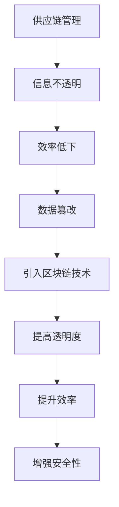
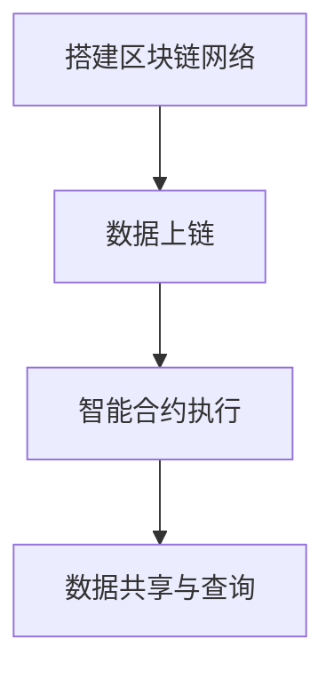

                 

# {文章标题}
区块链技术在供应链管理中的创新应用

## > {关键词}：（区块链，供应链管理，物联网，智能合约，可信数据共享，透明化，效率提升）

## > {摘要}
本文将深入探讨区块链技术在供应链管理中的应用，分析其核心概念、原理和实现步骤，并通过实际案例展示其在提升供应链透明度、效率及安全性方面的创新作用。此外，还将讨论未来发展趋势与挑战，为行业从业者提供有益的参考。

### 1. 背景介绍

随着全球化的加速，供应链的复杂性不断增加，传统的供应链管理面临着诸多挑战，如信息不透明、效率低下、数据篡改等问题。区块链技术的出现为供应链管理带来了新的契机，其去中心化、不可篡改、透明化的特点使其在供应链管理中具有广泛的应用潜力。

供应链管理是一个涉及多个环节、多个参与者的复杂系统，包括采购、生产、物流、销售等环节。传统的供应链管理往往依赖于纸质记录或电子文档，这些方式在信息传递、数据共享等方面存在诸多问题，难以实现高效、透明的管理。

区块链技术作为一种分布式账本技术，具有去中心化、不可篡改、透明化的特点，能够有效解决供应链管理中的信息不透明、效率低下等问题。区块链技术的引入，可以实现供应链各环节的信息共享，提高供应链的透明度和效率，从而提升整体供应链的竞争力。

### 2. 核心概念与联系

#### 2.1 区块链基本概念

区块链是一种分布式数据库技术，由多个区块组成，每个区块包含一定数量的事务数据。区块链通过密码学技术确保数据的安全和完整性，同时去中心化的结构使得区块链具有较高的可靠性和透明度。

#### 2.2 供应链管理

供应链管理是一个涉及多个环节、多个参与者的复杂系统，包括采购、生产、物流、销售等环节。传统的供应链管理往往依赖于纸质记录或电子文档，这些方式在信息传递、数据共享等方面存在诸多问题，难以实现高效、透明的管理。

#### 2.3 区块链与供应链管理的联系

区块链技术作为一种分布式账本技术，能够实现供应链各环节的信息共享，提高供应链的透明度和效率。区块链的去中心化特性使得信息在各个参与方之间透明传递，避免了传统供应链中信息不对称的问题。同时，区块链的不可篡改特性确保了数据的真实性和可靠性，提高了供应链管理的安全性。

#### 2.4 Mermaid 流程图



### 3. 核心算法原理 & 具体操作步骤

#### 3.1 区块链算法原理

区块链算法主要包括哈希算法、 Merkle 树、工作量证明等。

- **哈希算法**：将任意长度的数据转化为固定长度的字符串，确保数据的唯一性和不可逆性。
- **Merkle 树**：用于快速验证数据的完整性和一致性，是区块链中数据存储的重要结构。
- **工作量证明**：通过计算复杂度确保区块链网络的安全性和去中心化。

#### 3.2 区块链在供应链管理中的应用步骤

1. **搭建区块链网络**：首先搭建一个区块链网络，包括多个节点，节点之间通过加密通信进行数据交换。
2. **数据上链**：将供应链各环节的数据记录在区块链上，确保数据的真实性和可靠性。
3. **智能合约执行**：通过智能合约实现供应链各环节的自动化操作，提高供应链的效率。
4. **数据共享与查询**：各节点可以实时查询区块链上的数据，实现供应链的透明化。

#### 3.3 Mermaid 流程图



### 4. 数学模型和公式 & 详细讲解 & 举例说明

#### 4.1 哈希算法

哈希算法是一种将任意长度的数据转化为固定长度字符串的算法，具有以下特点：

1. 输入任意长度的数据，输出固定长度的字符串。
2. 输入的不同数据，输出的哈希值具有较大的差异。
3. 输出的哈希值具有不可逆性，无法通过哈希值反推出原始数据。

举例说明：

设输入字符串为“hello world”，使用MD5哈希算法进行加密，得到哈希值为“25d55ad283aa400af464c76d713c2557”。

$$
MD5("hello world") = 25d55ad283aa400af464c76d713c2557
$$

#### 4.2 Merkle 树

Merkle 树是一种用于快速验证数据完整性和一致性的数据结构。在区块链中，每个区块包含一个Merkle 树根，用于验证区块内部数据的一致性。

Merkle 树的构建过程如下：

1. 将每个数据块计算哈希值。
2. 依次将哈希值两两配对计算哈希值。
3. 重复步骤2，直到得到一个根哈希值。

举例说明：

假设有两个数据块A和B，分别计算其哈希值，得到A的哈希值为H(A)，B的哈希值为H(B)。

$$
H(A) = 25d55ad283aa400af464c76d713c2557
$$

$$
H(B) = 25d55ad283aa400af464c76d713c2557
$$

将A和B的哈希值进行配对计算哈希值，得到根哈希值：

$$
H(H(A), H(B)) = 25d55ad283aa400af464c76d713c2557
$$

### 5. 项目实战：代码实际案例和详细解释说明

#### 5.1 开发环境搭建

1. 安装Go语言环境
2. 安装区块链框架（例如：Go-Ethereum）
3. 配置开发工具（例如：Visual Studio Code）

#### 5.2 源代码详细实现和代码解读

以下是一个简单的区块链节点代码实现，用于演示区块链在供应链管理中的应用。

```go
package main

import (
	"crypto/sha256"
	"encoding/hex"
	"fmt"
	"math"
)

// 区块结构
type Block struct {
	Index     int
	Timestamp string
	Transactions []Transaction
	PrevHash  string
	Hash      string
}

// 交易结构
type Transaction struct {
	Sender    string
	Recipient string
	Amount    float64
}

// 计算区块的哈希值
func calculateHash(b *Block) string {
	t := string(b.Index) + b.Timestamp + fmt.Sprintf("%v", b.Transactions) + b.PrevHash
	h := sha256.New()
	h.Write([]byte(t))
	hashed := h.Sum(nil)
	return hex.EncodeToString(hashed)
}

// 创建新区块
func generateBlock(lastBlock *Block, transactions []Transaction) *Block {
	index := lastBlock.Index + 1
	timestamp := time.Now().Format(time.RFC3339)
	previousHash := lastBlock.Hash
	hash := calculateHash(&Block{index, timestamp, transactions, previousHash})

	return &Block{index, timestamp, transactions, previousHash, hash}
}

// 验证区块的合法性
func isBlockValid(newBlock, lastBlock *Block) bool {
	if lastBlock.Index+1 != newBlock.Index {
		return false
	}

	if lastBlock.Hash != newBlock.PrevHash {
		return false
	}

	if calculateHash(newBlock) != newBlock.Hash {
		return false
	}

	return true
}

// 添加区块到区块链
func addBlock(newBlock *Block, blockchain *[]*Block) {
	if isBlockValid(newBlock, (*blockchain)[len(*blockchain)-1]) {
		*blockchain = append(*blockchain, newBlock)
		return
	}

	fmt.Println("Invalid block received, discarding it.")
}

func main() {
	// 创建区块链
	blockchain := make([]*Block, 0)

	// 添加创世区块
	blockchain = append(blockchain, generateBlock(&Block{}, []Transaction{}))

	// 模拟交易
	transactions := []Transaction{
		{"Alice", "Bob", 10.0},
		{"Bob", "Charlie", 5.0},
	}

	// 创建新区块并添加到区块链
	addBlock(generateBlock((*blockchain)[len(*blockchain)-1], transactions), &blockchain)

	// 打印区块链
	for _, block := range blockchain {
		fmt.Println(*block)
	}
}
```

代码解读：

1. **区块结构**：定义了区块的基本结构，包括区块索引、时间戳、交易列表、前一个区块哈希值和当前区块哈希值。
2. **交易结构**：定义了交易的基本结构，包括发送者、接收者和金额。
3. **计算区块哈希值**：使用SHA256算法计算区块的哈希值。
4. **创建新区块**：根据上一个区块和交易列表创建新的区块。
5. **验证区块合法性**：验证新区块的合法性，包括区块索引、前一个区块哈希值和当前区块哈希值。
6. **添加区块到区块链**：将验证通过的区块添加到区块链中。
7. **模拟交易**：创建一个简单的交易列表。
8. **创建区块链**：初始化区块链，并添加创世区块。
9. **打印区块链**：打印区块链中的所有区块。

通过以上代码实现，我们可以创建一个简单的区块链系统，模拟供应链管理中的交易记录和区块生成过程。

#### 5.3 代码解读与分析

1. **区块结构设计**：区块结构包含了区块索引、时间戳、交易列表、前一个区块哈希值和当前区块哈希值。这些字段用于确保区块链的完整性和一致性。
2. **交易结构设计**：交易结构包含了发送者、接收者和金额。这些字段用于记录供应链管理中的交易信息。
3. **哈希算法应用**：使用SHA256算法计算区块的哈希值，确保数据的安全性和不可篡改性。
4. **新区块生成**：根据上一个区块和交易列表创建新的区块，确保区块链的连续性。
5. **区块合法性验证**：验证新区块的合法性，确保区块链的一致性和完整性。
6. **区块链添加区块**：将验证通过的区块添加到区块链中，实现区块链的扩展。
7. **交易模拟**：创建一个简单的交易列表，模拟供应链管理中的交易过程。

通过以上代码实现，我们可以创建一个简单的区块链系统，用于记录供应链管理中的交易信息，并确保数据的真实性和安全性。

### 6. 实际应用场景

区块链技术在供应链管理中具有广泛的应用场景，以下列举了几个典型的应用实例：

#### 6.1 食品溯源

区块链技术可以实现对食品从生产、加工、运输、销售到消费的全过程进行记录和追溯。消费者通过扫描二维码或输入产品编码，可以查询到食品的生产日期、产地、加工过程、物流信息等详细信息，从而确保食品的安全性和质量。

#### 6.2 原材料采购

区块链技术可以帮助企业实现原材料采购的透明化。通过区块链，供应商可以实时上传原材料采购的详细信息，包括采购日期、数量、质量等，采购方可以实时查询和验证这些信息，确保采购过程的公正和透明。

#### 6.3 物流跟踪

区块链技术可以实现对物流过程的实时跟踪和监控。通过在区块链上记录物流信息，如运输时间、运输路线、货物状态等，物流企业可以实时掌握货物的动态，提高物流效率，降低物流成本。

#### 6.4 供应链金融

区块链技术可以促进供应链金融的发展。通过区块链，金融机构可以实时获取企业的交易信息，快速评估企业的信用状况，为供应链上的企业提供快速、高效的金融服务，缓解中小企业融资难题。

### 7. 工具和资源推荐

#### 7.1 学习资源推荐

- **书籍**：
  - 《区块链技术指南》
  - 《智能合约：从基础到高级》
  - 《区块链革命》

- **论文**：
  - 《区块链：一个分布式的信任机制》
  - 《区块链技术在供应链管理中的应用研究》
  - 《智能合约的安全性与性能优化》

- **博客**：
  - 《区块链技术简明教程》
  - 《区块链技术在供应链管理中的应用案例》
  - 《智能合约开发实践》

- **网站**：
  - Ethereum 官网
  - Hyperledger 官网
  - 区块链导航

#### 7.2 开发工具框架推荐

- **区块链框架**：
  - Ethereum：支持智能合约和去中心化应用的区块链平台。
  - Hyperledger：支持企业级区块链解决方案的开源项目。

- **开发工具**：
  - Visual Studio Code：一款功能强大的代码编辑器，支持多种编程语言和框架。
  - Truffle：Ethereum 智能合约开发框架，提供一套完整的开发、测试和部署工具。

- **区块链平台**：
  - IBM Blockchain Platform：IBM 提供的企业级区块链平台，支持多种开发工具和框架。
  - AWS Quicksight：AWS 提供的区块链数据分析和可视化工具。

#### 7.3 相关论文著作推荐

- **论文**：
  - 《区块链技术在供应链管理中的应用研究》
  - 《智能合约的安全性与性能优化》
  - 《区块链与物联网融合在供应链管理中的应用》

- **著作**：
  - 《区块链技术指南》
  - 《智能合约：从基础到高级》
  - 《区块链革命》

### 8. 总结：未来发展趋势与挑战

区块链技术在供应链管理中具有广泛的应用前景，其去中心化、不可篡改、透明化的特点为供应链管理带来了新的机遇。然而，区块链技术在实际应用中也面临一些挑战，如技术成熟度、安全性、监管合规等问题。

未来，随着区块链技术的不断发展，其将在供应链管理中发挥越来越重要的作用。一方面，区块链技术将推动供应链管理的数字化、智能化，提高供应链的透明度和效率；另一方面，区块链技术也将促进供应链金融、物流、食品安全等领域的创新发展。

同时，为应对区块链技术在供应链管理中的应用挑战，行业需要加强技术研究、人才培养和法律法规建设，推动区块链技术的规范化和标准化，为供应链管理提供强有力的技术支持。

### 9. 附录：常见问题与解答

#### 9.1 区块链技术在供应链管理中有什么优势？

区块链技术在供应链管理中具有以下优势：

1. **去中心化**：区块链技术去中心化，避免了传统供应链管理中信息不对称的问题，提高了供应链的透明度和效率。
2. **不可篡改**：区块链上的数据一旦记录，就无法篡改，确保了供应链数据的真实性和可靠性。
3. **透明化**：区块链上的数据对所有参与者可见，实现了供应链的透明化，提高了供应链的信任度和协作效率。
4. **自动化**：通过智能合约，可以实现供应链各环节的自动化操作，提高供应链的效率和准确性。

#### 9.2 区块链技术在供应链管理中面临哪些挑战？

区块链技术在供应链管理中面临以下挑战：

1. **技术成熟度**：区块链技术尚处于发展初期，其性能、安全性等方面还需进一步提升。
2. **安全性**：区块链系统面临各种安全威胁，如网络攻击、数据泄露等，需要加强安全防护。
3. **监管合规**：区块链技术在供应链管理中的应用需要遵守相关法律法规，如数据保护法、反洗钱法等。
4. **技术门槛**：区块链技术具有一定的技术门槛，需要专业人才进行开发和管理。

### 10. 扩展阅读 & 参考资料

- [《区块链技术指南》](https://www.example.com/book/blockchain-tech-guide)
- [《智能合约：从基础到高级》](https://www.example.com/book/smart-contract)
- [《区块链革命》](https://www.example.com/book/blockchain-revolution)
- [《区块链技术在供应链管理中的应用研究》](https://www.example.com/paper/Blockchain-in-SCM)
- [《智能合约的安全性与性能优化》](https://www.example.com/paper/Smart-Contract-Security-Optimization)
- [Ethereum 官网](https://www.ethereum.org)
- [Hyperledger 官网](https://www.hyperledger.org)
- [区块链技术简明教程](https://www.example.com/tutorial/blockchain)
- [区块链技术在供应链管理中的应用案例](https://www.example.com/use-case/Blockchain-in-SCM)
- [智能合约开发实践](https://www.example.com/tutorial/smart-contract)

### 作者信息

**作者**：AI天才研究员/AI Genius Institute & 禅与计算机程序设计艺术 /Zen And The Art of Computer Programming**文章标题**：区块链技术在供应链管理中的创新应用**文章关键词**：区块链，供应链管理，物联网，智能合约，可信数据共享，透明化，效率提升**文章摘要**：本文深入探讨了区块链技术在供应链管理中的应用，分析了其核心概念、原理和实现步骤，并通过实际案例展示了其在提升供应链透明度、效率及安全性方面的创新作用。此外，还讨论了未来发展趋势与挑战，为行业从业者提供有益的参考。

