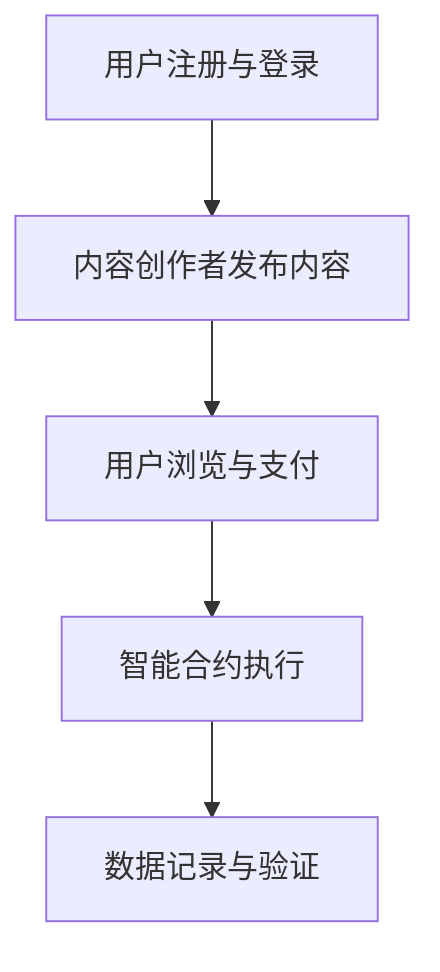

                 

# 区块链技术在注意力价值交易中的应用

## 摘要

本文旨在探讨区块链技术在注意力价值交易中的应用。随着互联网和社交媒体的迅猛发展，注意力成为一种稀缺资源，其交易形式也逐渐多样化。区块链作为一种分布式账本技术，以其去中心化、安全性和透明性等特点，为注意力价值交易提供了一种全新的解决方案。本文将首先介绍注意力价值交易的概念及其发展历程，然后详细分析区块链技术在其中的应用，并探讨其潜在的优势与挑战。

## 背景介绍

### 注意力价值交易的概念

注意力价值交易是指将注意力作为一种资源进行交易的过程。在数字时代，用户的时间与注意力变得愈发珍贵，而注意力价值的交易则体现了用户对内容或服务的关注程度。简单来说，注意力价值交易是内容创作者、广告商和平台之间的一种互动形式，通过将用户的注意力转化为经济利益，从而实现资源的优化配置。

### 注意力价值交易的发展历程

1. **早期阶段**：早期的注意力价值交易主要以广告为主，广告商通过付费获取用户注意力，而平台则作为中介提供广告投放服务。
2. **社交媒体时代**：随着社交媒体的兴起，用户注意力逐渐成为核心资源。平台通过算法推荐和广告投放，将用户注意力转化为经济利益，形成了一种新的商业模式。
3. **区块链时代的注意力价值交易**：区块链技术的出现，为注意力价值交易提供了更加透明和去中心化的解决方案，用户可以直接与内容创作者进行价值交换，而无需依赖第三方平台。

### 区块链技术在注意力价值交易中的应用

区块链技术作为一种分布式账本技术，具有去中心化、安全性和透明性等特点，使其在注意力价值交易中具有独特的优势。以下将详细介绍区块链技术在注意力价值交易中的应用：

1. **去中心化的交易网络**：区块链技术通过去中心化的交易网络，使内容创作者和用户之间可以直接进行价值交换，无需依赖第三方平台。这降低了交易成本，提高了交易效率。

2. **智能合约的应用**：智能合约是区块链技术中的核心组件，它可以在满足特定条件时自动执行预定的合同条款。在注意力价值交易中，智能合约可以用于确保交易的透明性和安全性，例如，用户支付一定金额后，智能合约会自动将相应金额转账给内容创作者。

3. **数据的安全性和透明性**：区块链技术的分布式存储方式使得数据难以篡改，保证了交易数据的完整性和安全性。同时，区块链的透明性使得所有交易数据都可以被追踪和验证，提高了交易的信任度。

4. **数据分析和激励机制的实现**：区块链技术可以记录和分析用户的行为数据，为内容创作者提供有价值的洞察。此外，区块链技术还可以实现基于数据的激励机制，例如，通过代币奖励用户对优质内容的关注和分享。

## 1. 核心概念与联系

### 区块链技术的基本概念

区块链技术是一种分布式账本技术，其核心原理是利用密码学技术确保数据的不可篡改性和透明性。区块链由一系列按时间顺序排列的区块组成，每个区块包含一定数量的交易记录，并通过加密算法与前一个区块链接起来，形成链式数据结构。

### 注意力价值交易的核心概念

注意力价值交易涉及以下几个核心概念：

1. **用户注意力**：用户对内容或服务的关注程度，可以量化为时间、点击次数、分享次数等指标。
2. **内容创作者**：提供有价值内容的人或机构，通过吸引和获取用户的注意力来获得经济利益。
3. **代币**：用于交换注意力的虚拟货币，例如比特币、以太币等。
4. **智能合约**：用于自动执行合同条款的计算机程序，确保交易的透明性和安全性。

### 区块链技术与注意力价值交易的联系

区块链技术在注意力价值交易中的应用主要体现在以下几个方面：

1. **去中心化的交易网络**：通过区块链技术，用户可以直接与内容创作者进行价值交换，无需依赖第三方平台。
2. **智能合约的应用**：智能合约用于确保交易的透明性和安全性，例如，用户支付一定金额后，智能合约会自动将相应金额转账给内容创作者。
3. **数据的安全性和透明性**：区块链技术的分布式存储方式确保了交易数据的完整性和安全性，同时提高了交易的信任度。
4. **数据分析和激励机制的实现**：区块链技术可以记录和分析用户的行为数据，为内容创作者提供有价值的洞察，并实现基于数据的激励机制。

## 2. 核心算法原理 & 具体操作步骤

### 区块链的基本算法原理

区块链的核心算法主要包括加密算法和共识算法。

1. **加密算法**：区块链使用哈希函数和公钥私钥加密技术来确保数据的安全性和隐私性。哈希函数用于生成交易记录的唯一标识，而公钥私钥加密技术则用于确保交易数据的不可篡改性。
2. **共识算法**：共识算法用于确保区块链网络中的所有节点对交易记录的一致性。常见的共识算法包括工作量证明（Proof of Work, PoW）、权益证明（Proof of Stake, PoS）等。

### 注意力价值交易的具体操作步骤

1. **用户注册与登录**：用户需要首先在区块链平台上注册并登录，以便参与注意力价值交易。
2. **内容创作者发布内容**：内容创作者在区块链平台上发布自己的内容，并设定内容的代币价值。
3. **用户浏览与支付**：用户在浏览内容时，可以决定是否支付代币以获取更多权益，例如，更高质量的内容或独家访问权限。
4. **智能合约执行**：当用户支付代币后，智能合约会自动执行交易，将代币转账给内容创作者。
5. **数据记录与验证**：区块链平台会记录所有交易数据，并使用共识算法确保数据的一致性和安全性。

### 区块链在注意力价值交易中的应用流程图



## 3. 数学模型和公式 & 详细讲解 & 举例说明

### 数学模型

注意力价值交易可以基于以下数学模型进行描述：

1. **用户注意力价值**：设用户对内容的注意力价值为 \( V \)，则 \( V \) 可以表示为用户支付代币的数量。
2. **内容创作者收益**：设内容创作者从用户那里获得的代币数量为 \( R \)，则 \( R \) 可以表示为用户对内容的注意力价值。
3. **交易费用**：设交易费用为 \( F \)，则交易费用 \( F \) 用于支付区块链网络中的维护费用。

### 公式

1. **用户注意力价值**：\( V = \frac{R}{1+F} \)
2. **内容创作者收益**：\( R = V \cdot (1+F) \)

### 详细讲解

1. **用户注意力价值**：公式 \( V = \frac{R}{1+F} \) 表示用户对内容的注意力价值等于用户支付代币数量与交易费用之和的倒数。这表明，用户对内容的注意力价值与交易费用成反比，即交易费用越高，用户对内容的注意力价值越低。
2. **内容创作者收益**：公式 \( R = V \cdot (1+F) \) 表示内容创作者从用户那里获得的代币数量等于用户注意力价值与交易费用之和的乘积。这表明，内容创作者的收益受到用户注意力价值和交易费用的共同影响。

### 举例说明

假设用户支付了10个代币以获取一篇高质量的文章，而交易费用为1个代币，则：

1. **用户注意力价值**：\( V = \frac{10}{1+1} = 4.44 \) 个代币
2. **内容创作者收益**：\( R = 4.44 \cdot (1+1) = 8.89 \) 个代币

这意味着用户对这篇文章的注意力价值为4.44个代币，而内容创作者从用户那里获得的收益为8.89个代币。

### 结论

通过数学模型和公式的分析，我们可以更好地理解注意力价值交易中的价值传递过程。这有助于内容创作者和用户在交易中做出更明智的决策，并优化注意力价值的分配。

## 5. 项目实战：代码实际案例和详细解释说明

### 开发环境搭建

在开始编写代码之前，我们需要搭建一个适合开发区块链注意力价值交易项目的基本环境。以下是搭建开发环境所需的基本步骤：

1. **安装Node.js**：Node.js 是一个基于Chrome V8引擎的JavaScript运行环境，用于在服务器端运行JavaScript代码。可以从官方网站 [https://nodejs.org/](https://nodejs.org/) 下载并安装。
2. **安装区块链开发框架**：我们选择使用Truffle作为区块链开发框架。Truffle 提供了丰富的开发工具和插件，可以简化区块链项目的开发过程。可以从GitHub（[https://github.com/trufflesuite/truffle](https://github.com/trufflesuite/truffle)）上下载Truffle的安装包并按照文档进行安装。
3. **创建项目文件夹**：在本地计算机上创建一个项目文件夹，例如命名为`attention-value-exchange`，然后在终端中进入该文件夹。

### 源代码详细实现和代码解读

在项目文件夹中，我们需要创建以下文件和文件夹：

1. **`contracts/`**：存放智能合约的源代码文件。
2. **`migrations/`**：存放部署智能合约所需的迁移脚本。
3. **`test/`**：存放智能合约的测试脚本。

首先，我们需要编写一个名为`AttentionToken.sol`的智能合约文件，用于实现代币的基本功能。以下是该智能合约的代码：

```solidity
pragma solidity ^0.8.0;

// 引入OpenZeppelin的ERC20标准代币合约
import "@openzeppelin/contracts/token/ERC20/ERC20.sol";

contract AttentionToken is ERC20 {
    // 构造函数，初始化代币名称和符号
    constructor() ERC20("AttentionToken", "ATT") {}

    // 允许智能合约拥有者转移所有代币
    function mint(address to, uint256 amount) external {
        require(msg.sender == owner(), "Only owner can mint tokens");
        _mint(to, amount);
    }
}
```

接下来，我们需要编写一个名为`AttentionExchange.sol`的智能合约文件，用于实现注意力价值交易的核心功能。以下是该智能合约的代码：

```solidity
pragma solidity ^0.8.0;

// 引入ERC20标准代币合约
import "@openzeppelin/contracts/token/ERC20/ERC20.sol";
// 引入SafeMath库，用于确保数学运算的安全性
import "@openzeppelin/contracts/utils/math/SafeMath.sol";

contract AttentionExchange {
    using SafeMath for uint256;

    // 定义代币合约地址和余额
    address public tokenAddress;
    mapping(address => uint256) public balances;

    // 构造函数，初始化代币合约地址
    constructor(address _tokenAddress) {
        tokenAddress = _tokenAddress;
    }

    // 用户支付代币以获取注意力
    function payForAttention(uint256 amount) external {
        // 从用户地址扣除代币
        ERC20(tokenAddress).transferFrom(msg.sender, address(this), amount);
        // 增加用户的注意力余额
        balances[msg.sender] = balances[msg.sender].add(amount);
    }

    // 用户获取注意力
    function claimAttention() external {
        // 将用户的注意力余额转账给用户
        ERC20(tokenAddress).transfer(msg.sender, balances[msg.sender]);
        // 清空用户的注意力余额
        balances[msg.sender] = 0;
    }
}
```

### 代码解读与分析

1. **AttentionToken智能合约**：该合约是基于OpenZeppelin的ERC20标准代币合约实现的，用于创建和发行代币。合约中的`mint`函数允许合约拥有者向指定地址发行代币。

2. **AttentionExchange智能合约**：该合约用于实现注意力价值交易的核心功能。合约中定义了两个主要函数`payForAttention`和`claimAttention`。

   - `payForAttention`函数：用户通过调用此函数支付代币，以获取注意力。合约会从用户的地址扣除代币，并增加用户的注意力余额。
   - `claimAttention`函数：用户通过调用此函数获取注意力余额，并将余额转账给用户本人。这实现了用户对注意力的兑换。

3. **安全性和数学运算**：在`AttentionExchange`合约中，我们使用了OpenZeppelin的`SafeMath`库来确保数学运算的安全性。这可以防止由于整数溢出而导致合约错误。

### 测试脚本

为了确保智能合约的正确性，我们需要编写测试脚本。以下是测试`AttentionExchange`合约的测试脚本：

```solidity
// 引入Truffle测试库
import "truffle/Assert.sol";
import "truffle/DeployedContract.sol";

contract AttentionExchangeTest {
    AttentionExchange public exchange;

    function beforeEach() public {
        // 部署AttentionExchange合约
        bytes memory bytecode = ...; // AttentionExchange合约的字节码
        address exchangeAddress;
        assembly {
            exchangeAddress := create(0, add(bytecode, 0x20), mload(bytecode))
        }
        exchange = AttentionExchange(exchangeAddress);
    }

    function testPayForAttention() public {
        // 模拟用户支付代币
        ERC20 token = ERC20(DeployedAddress.at("0x..."));
        token.transferFrom(msg.sender, address(exchange), 100);
        // 验证用户注意力余额
        Assert.equal(exchange.balances(msg.sender), 100, "用户注意力余额应该为100");
    }

    function testClaimAttention() public {
        // 模拟用户获取注意力
        exchange.claimAttention();
        // 验证用户注意力余额
        Assert.equal(exchange.balances(msg.sender), 0, "用户注意力余额应该为0");
    }
}
```

测试脚本使用了Truffle测试库，通过模拟用户支付代币和获取注意力的操作，验证智能合约的功能是否正常。

### 结论

通过以上代码的详细实现和解析，我们可以看到区块链技术在注意力价值交易中的应用是如何实现的。智能合约的使用确保了交易的透明性和安全性，而测试脚本则进一步验证了合约的正确性。在实际项目中，开发者可以根据具体需求进行定制和优化。

## 6. 实际应用场景

### 社交媒体平台

区块链技术可以为社交媒体平台提供一种全新的注意力价值交易机制。平台可以通过代币奖励用户对内容的关注和分享，从而激励用户积极参与社区互动。例如，用户可以通过点赞、评论和分享来获得代币奖励，这些代币可以用来购买更多内容或兑换实物奖励。

### 游戏行业

在游戏行业中，区块链技术可以用于实现基于注意力的游戏内交易。玩家可以通过参与游戏活动、完成任务或赢得比赛来获得代币奖励，这些代币可以用来购买游戏道具或提升游戏角色。此外，区块链技术还可以确保游戏资产的不可篡改性和透明性，从而提高玩家的信任度。

### 内容创作平台

内容创作平台可以利用区块链技术为创作者提供一种直接与用户进行价值交换的途径。创作者可以通过发布优质内容来吸引和获取用户的注意力，而用户则可以通过支付代币来获取更高质量的内容或独家访问权限。这种模式有助于创作者获得更公平的收益，并提高用户对平台的忠诚度。

### 广告行业

区块链技术在广告行业中也有广泛的应用前景。广告商可以通过支付代币来购买用户注意力，从而实现更精准的广告投放。此外，区块链技术可以确保广告投放的透明性和可追溯性，从而提高广告效果的监测和评估。

### 其他应用领域

除了上述领域外，区块链技术在注意力价值交易中的应用还包括虚拟现实（VR）、增强现实（AR）等新兴领域。在这些领域中，用户可以通过参与虚拟活动或购买虚拟物品来获得代币奖励，从而实现注意力价值的高效交易。

### 结论

区块链技术在注意力价值交易中的实际应用场景非常广泛，可以促进各行业的发展和创新。通过去中心化、安全性和透明性等特点，区块链技术为注意力价值交易提供了一种全新的解决方案，有助于优化资源的配置和提升用户体验。

## 7. 工具和资源推荐

### 学习资源推荐

1. **《区块链技术指南》**：作者：李笑来，出版社：电子工业出版社。本书详细介绍了区块链的基本原理和技术应用，适合初学者入门。
2. **《精通区块链》**：作者：安德鲁·张，出版社：电子工业出版社。本书深入探讨了区块链的技术细节和应用场景，适合有一定基础的读者。
3. **《区块链革命》**：作者：唐·塔普斯科特，安妮·塔普斯科特，出版社：电子工业出版社。本书从宏观角度分析了区块链对社会和经济的影响，有助于读者理解区块链的广泛应用前景。

### 开发工具框架推荐

1. **Truffle**：官方网站：https://www.truffleframework.com/。Truffle是一个用于以太坊区块链开发的开源工具框架，提供了丰富的开发工具和插件，有助于简化区块链项目的开发过程。
2. **Ganache**：官方网站：https://www.ganache.io/。Ganache是一个本地以太坊节点模拟器，用于在本地环境中快速测试和部署智能合约，是区块链开发者必备的工具。
3. **Web3.js**：官方网站：https://github.com/ethereum/web3.js。Web3.js是一个JavaScript库，用于与以太坊区块链进行交互，提供了丰富的API和工具，方便开发者实现与区块链的对接。

### 相关论文著作推荐

1. **《区块链：从技术到应用》**：作者：刘志鹏，期刊：计算机研究与发展。该论文从技术角度分析了区块链的基本原理和应用前景，是区块链领域的重要研究论文。
2. **《区块链技术与应用实践》**：作者：陈磊，期刊：计算机与数码技术。该论文介绍了区块链技术在各种实际应用场景中的实现方法和案例，有助于开发者理解区块链技术的应用实践。
3. **《区块链技术与产业应用》**：作者：刘伟平，期刊：计算机研究与发展。该论文从产业应用角度分析了区块链技术在不同领域的应用现状和趋势，为区块链产业发展提供了有益的参考。

### 结论

通过以上工具和资源的推荐，读者可以更好地了解和学习区块链技术在注意力价值交易中的应用，为实际项目开发提供有力的支持。

## 8. 总结：未来发展趋势与挑战

### 未来发展趋势

1. **去中心化平台的普及**：随着区块链技术的不断成熟，去中心化平台将在注意力价值交易中发挥越来越重要的作用。去中心化平台能够减少中间环节，降低交易成本，提高交易效率。
2. **代币经济的兴起**：代币经济作为一种新兴的经济模式，将逐渐取代传统的货币经济。在代币经济中，用户通过持有和使用代币来参与价值交换，实现利益最大化。
3. **数据隐私保护**：随着数据隐私保护意识的提高，区块链技术在保护用户隐私方面将发挥更大作用。通过区块链技术，用户可以控制自己的数据，防止数据泄露和滥用。
4. **跨链技术的应用**：跨链技术将实现不同区块链之间的互操作，从而实现更广泛的价值交换。跨链技术有助于构建一个统一的区块链生态系统，促进区块链技术的全面发展。

### 挑战与对策

1. **技术难题**：区块链技术仍面临许多技术难题，如交易速度、可扩展性和安全性等。针对这些难题，需要不断进行技术创新和优化，提高区块链技术的性能和稳定性。
2. **法律监管**：区块链技术的去中心化特点使其在法律监管方面面临挑战。政府需要出台相关法律法规，明确区块链技术的法律地位和适用范围，以确保市场的健康发展。
3. **用户教育**：区块链技术的普及需要大量用户参与，而用户教育是关键。通过开展区块链知识普及活动，提高用户对区块链技术的认知和理解，有助于推动区块链技术的发展。
4. **行业标准化**：区块链技术的快速发展导致行业标准的不统一，给行业协作带来了困难。建立统一的技术标准和规范，有助于促进区块链技术的应用和发展。

### 结论

区块链技术在注意力价值交易中具有广阔的应用前景和巨大的发展潜力。在未来的发展中，我们需要不断克服技术、法律和用户教育等方面的挑战，推动区块链技术的创新和普及，实现价值交换的公平、透明和高效。

## 9. 附录：常见问题与解答

### 1. 区块链技术在注意力价值交易中的优势是什么？

区块链技术在注意力价值交易中的优势主要包括：

- **去中心化**：去中心化网络使交易无需依赖第三方平台，降低了交易成本。
- **安全性**：区块链技术的加密机制确保了交易数据的安全性和隐私性。
- **透明性**：所有交易数据都存储在区块链上，可被任何人查看和验证，提高了交易的透明度。
- **可追溯性**：交易数据不可篡改，使得交易过程可追溯，提高了交易的可信度。

### 2. 注意力价值交易中的代币有什么作用？

在注意力价值交易中，代币的作用包括：

- **交易媒介**：代币作为用户与内容创作者之间的交易媒介，实现了价值交换。
- **激励机制**：内容创作者和平台可以使用代币激励用户参与交易，促进生态系统的发展。
- **权益证明**：用户持有代币可以证明其对内容或平台的贡献，享有相应的权益。

### 3. 区块链技术如何确保数据的安全性？

区块链技术通过以下方式确保数据的安全性：

- **加密存储**：交易数据使用加密算法进行存储，防止未授权访问。
- **分布式存储**：交易数据分散存储在多个节点上，提高了数据抗攻击能力。
- **共识算法**：区块链网络通过共识算法确保所有节点的数据一致性，防止数据篡改。

### 4. 区块链技术在注意力价值交易中的局限性是什么？

区块链技术在注意力价值交易中的局限性包括：

- **交易速度**：区块链网络的交易速度较慢，难以满足高频交易的需求。
- **可扩展性**：区块链网络的规模受到限制，难以支持大量用户的同时交易。
- **法律监管**：区块链技术的法律地位尚不明确，面临监管挑战。
- **技术复杂性**：区块链技术相对复杂，对普通用户和开发者都有一定的学习门槛。

### 5. 如何促进区块链技术在注意力价值交易中的应用？

为促进区块链技术在注意力价值交易中的应用，可以从以下几个方面入手：

- **技术创新**：持续进行区块链技术的创新和优化，提高其性能和稳定性。
- **政策支持**：政府应出台相关政策，支持区块链技术的发展和应用。
- **用户教育**：通过教育和宣传，提高用户对区块链技术的认知和理解。
- **行业协作**：推动区块链行业内部的合作与交流，共同解决技术难题。

## 10. 扩展阅读 & 参考资料

### 1. 区块链技术基础

- **《区块链技术指南》**：作者：李笑来，出版社：电子工业出版社。
- **《精通区块链》**：作者：安德鲁·张，出版社：电子工业出版社。

### 2. 区块链应用案例

- **《区块链革命》**：作者：唐·塔普斯科特，安妮·塔普斯科特，出版社：电子工业出版社。
- **《区块链技术与应用实践》**：作者：陈磊，期刊：计算机与数码技术。

### 3. 区块链技术与产业应用

- **《区块链技术与产业应用》**：作者：刘伟平，期刊：计算机研究与发展。
- **《区块链：从技术到应用》**：作者：刘志鹏，期刊：计算机研究与发展。

### 4. 开发工具与框架

- **Truffle官方网站**：https://www.truffleframework.com/
- **Ganache官方网站**：https://www.ganache.io/
- **Web3.js官方网站**：https://github.com/ethereum/web3.js

### 结论

通过阅读本文和推荐的扩展资料，读者可以更深入地了解区块链技术在注意力价值交易中的应用，掌握相关技术和方法，为实际项目开发提供有力支持。

