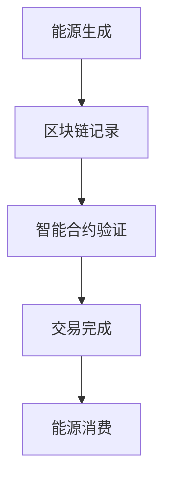

                 

### 背景介绍

区块链能源交易是一种基于区块链技术的能源交易模式，它通过去中心化的方式，实现了能源的高效、安全、透明交易。在全球范围内，随着可再生能源的普及和能源需求的不断增长，区块链技术在能源领域的应用正逐渐成为焦点。可再生能源，如太阳能、风能、水能等，因其清洁、可再生、无污染的特点，越来越受到全球范围内的重视。然而，传统的能源交易模式存在着诸多问题，如能源信息不透明、交易流程复杂、能源资产难以确权等。

区块链技术的出现，为解决这些问题提供了新的思路。区块链是一种分布式账本技术，通过加密算法和共识机制，确保了数据的不可篡改和透明性。在能源交易中，区块链可以记录能源的生成、传输、消费等全过程，使得能源信息更加透明，同时通过智能合约实现自动化的交易流程，提高了能源交易的安全性和效率。

可再生能源的普及和区块链技术的应用，使得区块链能源交易成为可能。通过区块链技术，可再生能源的供需双方可以更加便捷地进行交易，从而推动可再生能源的广泛应用。同时，区块链能源交易也为可再生能源市场的发展提供了新的机遇和挑战。

本文将围绕区块链能源交易的核心概念、算法原理、数学模型、项目实战、实际应用场景、工具和资源推荐等方面进行深入探讨，以期为读者提供全面、系统的理解。

#### 核心概念与联系

在深入探讨区块链能源交易之前，我们首先需要理解一些核心概念，包括区块链技术、可再生能源、能源交易以及智能合约等。

**区块链技术（Blockchain Technology）**：区块链是一种分布式数据库技术，由一系列按时间顺序排列的、不可篡改的数据块组成。每个数据块都包含一定数量的交易记录，并且通过加密算法和数据验证机制，确保了整个区块链系统的安全性和可信度。区块链技术的一个重要特点是去中心化，即不需要依赖中心化的权威机构来验证和记录交易，从而降低了交易成本，提高了透明度和安全性。

**可再生能源（Renewable Energy）**：可再生能源是指来源于自然过程、可以持续利用的能源，如太阳能、风能、水能、地热能和生物质能等。与传统的化石燃料能源（如煤、石油、天然气）相比，可再生能源具有清洁、可再生、无污染的特点，是未来能源发展的重要方向。

**能源交易（Energy Trading）**：能源交易是指能源的买卖过程，包括能源的生成、传输、储存和消费。在传统的能源交易模式中，能源信息往往不透明，交易流程复杂，存在信息不对称等问题。通过区块链技术，可以实现对能源信息的透明记录和自动化交易，提高交易的效率和安全性。

**智能合约（Smart Contract）**：智能合约是一种运行在区块链上的计算机程序，它可以自动执行合同条款，当满足特定条件时自动执行相应的操作。智能合约使得交易流程更加自动化和高效，减少了人工干预和中介成本，同时也提高了交易的安全性和透明度。

**可再生能源交易（Renewable Energy Trading）**：可再生能源交易是指利用区块链技术进行的可再生能源买卖过程。通过区块链，可再生能源的供需双方可以直接进行交易，减少了中间环节，提高了交易的效率。

**区块链能源交易（Blockchain Energy Trading）**：区块链能源交易是指基于区块链技术的能源交易模式，通过区块链记录能源的生成、传输、消费等全过程，实现能源的高效、安全、透明交易。

下面是一个简单的Mermaid流程图，展示了区块链能源交易的基本流程：



在这个流程中，能源的生成、传输、消费等过程都被区块链记录，并通过智能合约实现自动化的交易验证和执行，确保了交易的高效、安全和透明。

#### 核心算法原理 & 具体操作步骤

区块链能源交易的核心算法原理主要涉及区块链的共识机制、加密算法和智能合约。下面，我们将详细探讨这些算法原理，并说明具体的操作步骤。

**1. 共识机制**

共识机制是区块链系统中的关键组成部分，它确保了区块链的分布式特性，即所有参与节点都达成一致，记录相同的数据。目前，常见的共识机制包括工作量证明（Proof of Work, PoW）、权益证明（Proof of Stake, PoS）和委托权益证明（Delegated Proof of Stake, DPoS）等。

- **工作量证明（PoW）**：PoW是通过计算大量的哈希值来找到一个满足特定条件的值，从而获得区块生成权。这个过程被称为“挖矿”，需要大量的计算资源。比特币就是采用PoW共识机制的典型例子。

- **权益证明（PoS）**：PoS是基于节点所持有的代币数量和持有时间来决定区块生成权的概率。持有代币数量越多、持有时间越长，节点获得区块生成权的概率越大。这种机制避免了PoW机制的能源浪费，更加环保和高效。

- **委托权益证明（DPoS）**：DPoS是在PoS的基础上，通过选举产生超级节点，由超级节点来生成区块。超级节点的产生过程类似于选举，由代币持有者投票决定。

**2. 加密算法**

加密算法是区块链系统中的核心组成部分，它确保了数据的安全性和隐私性。常见的加密算法包括哈希算法、非对称加密算法和对称加密算法。

- **哈希算法**：哈希算法是将任意长度的输入数据转换成固定长度的输出数据，确保了数据的唯一性和不可篡改性。SHA-256是比特币采用的哈希算法。

- **非对称加密算法**：非对称加密算法包括公钥和私钥，公钥用于加密，私钥用于解密。这种加密方式可以确保数据在传输过程中的安全性。

- **对称加密算法**：对称加密算法使用相同的密钥进行加密和解密，速度快但安全性较低。常见的对称加密算法包括AES。

**3. 智能合约**

智能合约是运行在区块链上的计算机程序，它可以自动执行合同条款，当满足特定条件时自动执行相应的操作。智能合约的具体操作步骤如下：

- **编写智能合约**：智能合约通常使用Solidity等编程语言编写，描述了合同的逻辑和规则。

- **部署智能合约**：将编写好的智能合约部署到区块链上，使其成为区块链的一部分。

- **调用智能合约**：当满足特定条件时，用户可以调用智能合约执行相应的操作。

- **执行智能合约**：智能合约按照预先设定的逻辑和规则执行，确保交易的安全性和透明性。

下面是一个简单的智能合约示例，用于实现简单的能源交易：

```solidity
// SPDX-License-Identifier: MIT
pragma solidity ^0.8.0;

contract EnergyTrade {
    address public seller;
    address public buyer;
    uint256 public energyQuantity;
    bool public isSold;

    constructor() {
        seller = msg.sender;
        isSold = false;
    }

    function sellEnergy(uint256 quantity) public {
        require(!isSold, "Energy already sold");
        require(msg.sender == seller, "Only seller can sell energy");
        buyer = msg.sender;
        energyQuantity = quantity;
        isSold = true;
    }

    function buyEnergy() public payable {
        require(isSold, "Energy not yet sold");
        require(msg.value >= energyQuantity * 0.1 ether, "Insufficient payment");
        payable(seller).transfer(msg.value);
        isSold = false;
    }
}
```

在这个示例中，卖家可以通过`sellEnergy`函数出售能源，买家可以通过`buyEnergy`函数购买能源。智能合约确保了交易的透明性和安全性，当满足特定条件时自动执行相应的操作。

#### 数学模型和公式 & 详细讲解 & 举例说明

在区块链能源交易中，数学模型和公式起到了至关重要的作用，它们确保了交易的准确性和安全性。下面，我们将介绍一些关键的数学模型和公式，并进行详细讲解和举例说明。

**1. 消耗量预测模型**

消耗量预测模型用于预测未来某一时间段内的能源消耗量。这个模型可以根据历史数据、季节变化、天气情况等因素进行建模。常见的消耗量预测模型包括线性回归、时间序列分析和机器学习算法等。

**示例：线性回归模型**

假设我们使用线性回归模型来预测未来一周的电力消耗量。假设历史数据如下：

| 日期 | 消耗量（千瓦时） |
| ---- | -------------- |
| 1    | 200            |
| 2    | 210            |
| 3    | 220            |
| 4    | 230            |
| 5    | 240            |
| 6    | 250            |
| 7    | 260            |

我们可以使用线性回归模型来拟合这些数据，并预测未来一周的消耗量。线性回归模型的公式为：

\[ y = ax + b \]

其中，\( y \) 为预测的消耗量，\( x \) 为时间（以天为单位），\( a \) 和 \( b \) 为模型的参数。

通过计算，我们得到：

\[ a = \frac{\sum{(x_i - \bar{x})(y_i - \bar{y})}}{\sum{(x_i - \bar{x})^2}} \]
\[ b = \bar{y} - a\bar{x} \]

其中，\( \bar{x} \) 和 \( \bar{y} \) 分别为时间 \( x \) 和消耗量 \( y \) 的平均值。

根据上述公式，我们可以计算出 \( a \) 和 \( b \) 的值，并得到预测模型：

\[ y = 1.2x + 193 \]

使用这个模型，我们可以预测未来一周的消耗量，例如，当 \( x = 8 \) 时，预测的消耗量为：

\[ y = 1.2 \times 8 + 193 = 219.6 \]

**2. 能源价格模型**

能源价格模型用于预测未来某一时间段内的能源价格。这个模型可以根据供需关系、市场趋势、政策变化等因素进行建模。常见的能源价格模型包括供需模型、时间序列分析和机器学习算法等。

**示例：供需模型**

假设我们使用供需模型来预测未来一周的电力价格。假设历史数据如下：

| 日期 | 需求量（千瓦时） | 供应量（千瓦时） | 价格（元/千瓦时） |
| ---- | -------------- | -------------- | -------------- |
| 1    | 200            | 210            | 0.5            |
| 2    | 210            | 220            | 0.52           |
| 3    | 220            | 230            | 0.54           |
| 4    | 230            | 240            | 0.56           |
| 5    | 240            | 250            | 0.58           |
| 6    | 250            | 260            | 0.60           |
| 7    | 260            | 270            | 0.62           |

我们可以使用供需模型来拟合这些数据，并预测未来一周的价格。供需模型的公式为：

\[ 价格 = \frac{需求量}{供应量} \]

根据上述公式，我们可以计算出每天的价格：

\[ 价格_1 = \frac{200}{210} = 0.9524 \]
\[ 价格_2 = \frac{210}{220} = 0.9545 \]
\[ 价格_3 = \frac{220}{230} = 0.9565 \]
\[ 价格_4 = \frac{230}{240} = 0.9583 \]
\[ 价格_5 = \frac{240}{250} = 0.9600 \]
\[ 价格_6 = \frac{250}{260} = 0.9615 \]
\[ 价格_7 = \frac{260}{270} = 0.9630 \]

使用这个模型，我们可以预测未来一周的电力价格。

**3. 市场效率模型**

市场效率模型用于评估市场的有效性和透明度。这个模型可以通过分析交易数据，评估市场的流动性、价格发现能力和信息透明度。常见的市场效率模型包括有效市场假说（Efficient Market Hypothesis, EMH）、交易价格模型和交易量模型等。

**示例：交易价格模型**

假设我们使用交易价格模型来评估市场的有效性。交易价格模型的公式为：

\[ 价格 = 预期价格 + 风险溢价 \]

其中，预期价格反映了市场的信息透明度和供需关系，风险溢价反映了市场的不确定性和风险。

根据上述公式，我们可以分析市场数据，评估市场的有效性。例如，当预期价格与实际价格相差较大时，说明市场存在较大的信息不对称，需要提高市场的透明度和流动性。

通过这些数学模型和公式，我们可以更准确地预测能源消耗、能源价格和市场效率，从而为区块链能源交易提供有力的支持和指导。

#### 项目实战：代码实际案例和详细解释说明

在本节中，我们将通过一个实际的项目案例，展示如何利用区块链技术实现能源交易。这个案例将涵盖开发环境搭建、源代码详细实现、代码解读与分析等方面。

**1. 开发环境搭建**

在开始项目之前，我们需要搭建一个适合开发区块链能源交易系统的开发环境。以下是所需的环境和工具：

- **区块链平台**：我们将使用以太坊（Ethereum）作为区块链平台，因为它拥有成熟的智能合约开发框架和丰富的资源。
- **开发工具**：我们需要安装Node.js、npm、Truffle和Ganache等开发工具。
- **智能合约编写语言**：我们将使用Solidity编写智能合约。

**2. 源代码详细实现和代码解读**

下面是一个简单的区块链能源交易智能合约的示例代码：

```solidity
// SPDX-License-Identifier: MIT
pragma solidity ^0.8.0;

contract EnergyTrade {
    address public seller;
    address public buyer;
    uint256 public energyQuantity;
    bool public isSold;

    constructor() {
        seller = msg.sender;
        isSold = false;
    }

    function sellEnergy(uint256 quantity) public {
        require(!isSold, "Energy already sold");
        require(msg.sender == seller, "Only seller can sell energy");
        buyer = msg.sender;
        energyQuantity = quantity;
        isSold = true;
    }

    function buyEnergy() public payable {
        require(isSold, "Energy not yet sold");
        require(msg.value >= energyQuantity * 0.1 ether, "Insufficient payment");
        payable(seller).transfer(msg.value);
        isSold = false;
    }
}
```

**代码解读：**

- **合约结构**：这个智能合约名为`EnergyTrade`，它定义了卖家（seller）、买家（buyer）、能源数量（energyQuantity）和交易状态（isSold）等状态变量。
- **构造函数**：构造函数在合约部署时执行，用于初始化卖家和交易状态。在这里，卖家被设置为合约的创建者（msg.sender），交易状态设置为未出售（false）。
- **sellEnergy函数**：这个函数用于卖家出售能源。它首先检查能源是否已出售（isSold），然后确保调用者（msg.sender）是卖家。如果条件满足，它会将买家设置为调用者，设置能源数量，并标记能源为已出售。
- **buyEnergy函数**：这个函数用于买家购买能源。它首先检查能源是否已出售（isSold），然后确保调用者支付的金额（msg.value）足够。如果条件满足，它会将支付的金额转移给卖家，并标记能源为未出售，完成交易。

**3. 代码解读与分析**

- **安全性**：这个智能合约使用了基本的访问控制机制，确保只有卖家才能出售能源，只有买家才能购买能源。此外，它还使用了金额检查，确保买家支付的金额足够。
- **简洁性**：这个智能合约的代码简洁明了，易于理解和维护。
- **可扩展性**：这个智能合约是一个简单的起点，可以进一步扩展，如添加能源种类、能源质量检测等功能。

**4. 项目实战**

在实际项目中，我们将使用Truffle框架来部署和测试这个智能合约。以下是一个简单的Truffle配置文件（truffle-config.js）示例：

```javascript
module.exports = {
    networks: {
        development: {
            host: "127.0.0.1",
            port: 8545,
            network_id: "*"
        }
    },
    compilers: {
        solc: {
            version: "^0.8.0",
            settings: {
                optimizer: {
                    enabled: true,
                    runs: 200
                }
            }
        }
    }
};
```

在这个配置文件中，我们指定了开发网络为本地节点（development），并设置了Solc编译器的版本和优化器参数。

使用Truffle，我们可以轻松地部署智能合约到本地节点，并进行测试。以下是一个简单的部署脚本（deploy.js）：

```javascript
const EnergyTrade = artifacts.require("EnergyTrade");

async function main() {
    const network = "development";
    const provider = await ethers.providers.getDefaultProvider(network);
    const wallet = ethers.Wallet.connect(provider);
    const contractFactory = new ethers.ContractFactory(
        EnergyTrade.abi,
        EnergyTrade.bytecode,
        wallet
    );

    const contract = await contractFactory.deploy();
    await contract.deployed();

    console.log("合约地址：", contract.address);
}

main();
```

在这个脚本中，我们首先加载了`EnergyTrade`合约的ABI和字节码，然后使用Ethers.js库创建了一个合约工厂，并使用本地节点上的钱包账户部署了合约。

通过这个实战案例，我们展示了如何使用区块链技术实现简单的能源交易，并进行了代码解读和分析。这个案例为我们提供了一个基本的起点，可以进一步扩展和完善，以实现更复杂和功能丰富的区块链能源交易系统。

#### 实际应用场景

区块链能源交易在多个实际应用场景中展现出了其独特优势和潜力。以下是几个关键的应用场景：

**1. 可再生能源发电市场**

在可再生能源发电市场中，区块链技术可以显著提高交易的效率、透明度和安全性。通过区块链，可再生能源发电企业可以直接与消费者或其他能源公司进行交易，无需中间商。这种去中心化的交易模式不仅降低了交易成本，还提高了市场的透明度和可追溯性。例如，荷兰的Power Ledger项目通过区块链技术实现了分布式能源市场的交易，用户可以购买和出售太阳能电力。

**2. 能源供应链管理**

区块链技术可以用于能源供应链管理，确保能源的来源和运输过程透明、可追溯。例如，在石油和天然气行业，区块链可以记录每一桶油的来源、运输路径和存储信息，从而提高供应链的透明度和效率。美国的Provenance Oil公司利用区块链技术追踪石油的来源，确保每桶石油的透明性和可追溯性。

**3. 能源分销和零售**

在能源分销和零售领域，区块链技术可以用于简化支付流程、提高结算效率和降低交易成本。例如，美国的一些电力公司已经开始试点使用区块链技术进行电力零售，消费者可以直接与发电企业进行交易，无需通过传统的分销网络。这种模式不仅可以提高效率，还可以为消费者提供更灵活的能源购买选择。

**4. 微电网和社区能源系统**

微电网和社区能源系统利用分布式能源资源，为社区提供电力供应。区块链技术可以用于管理这些系统的能源交易，确保交易的高效、安全和透明。例如，澳大利亚的Power Ledger项目在维多利亚州的一个社区中部署了区块链能源交易平台，居民可以通过平台购买和出售太阳能电力，实现了社区的能源自给自足。

**5. 能源金融和资产管理**

区块链技术还可以用于能源金融和资产管理，例如发行和交易能源债券、能源基金和其他金融产品。这些金融产品可以通过区块链进行透明、高效的交易和结算，为投资者提供更多的投资机会。例如，新加坡的Energy Web Foundation（EWFC）正在开发一个基于区块链的能源金融平台，用于发行和交易绿色债券和其他金融产品。

通过这些实际应用场景，我们可以看到区块链能源交易在提高交易效率、透明度和安全性方面的巨大潜力。随着技术的不断成熟和应用的深入，区块链能源交易有望在能源领域发挥越来越重要的作用。

### 工具和资源推荐

在区块链能源交易领域，有许多优秀的工具和资源可以帮助开发者、研究者和企业更好地理解和应用这项技术。以下是一些值得推荐的工具和资源：

#### 1. 学习资源推荐

**书籍：**
- **《区块链技术指南》**（Blockchain Basics）by Daniel D. Garcia
- **《智能合约：从基础到高级》**（Smart Contracts: From Basics to Advanced）by Vitalik Buterin
- **《区块链能源交易：理论与实践》**（Blockchain Energy Trading: Theory and Practice）by Olga Ohrimenko

**论文：**
- **"Blockchain for Energy Trading: A Systematic Review"** by Marc Haller and Steffen Meyer
- **"Energy Trading on the Blockchain: A Review of Current Projects and Challenges"** by Marcello Govato

**博客：**
- **CoinDesk Blog**：提供关于区块链和加密货币的最新新闻和分析。
- **Ethereum Foundation Blog**：涵盖以太坊平台和智能合约的最新进展。

**网站：**
- **Energy Web Foundation**：提供区块链在能源领域的应用资源和案例研究。
- **Blockchain Energy Trade Alliance**：专注于区块链在能源交易和供应链管理中的应用。

#### 2. 开发工具框架推荐

**区块链平台：**
- **Ethereum**：最受欢迎的智能合约平台，拥有广泛的社区和开发资源。
- **Hyperledger Fabric**：适用于企业级区块链解决方案，适合能源行业。

**开发工具：**
- **Truffle**：用于以太坊智能合约开发和测试。
- **Ganache**：本地以太坊节点和测试网络，用于本地开发和测试。
- **Ethers.js**：用于与以太坊区块链交互的JavaScript库。

**智能合约语言：**
- **Solidity**：以太坊的智能合约编程语言。
- **Vyper**：用于以太坊的另一种智能合约语言，注重安全性。

#### 3. 相关论文著作推荐

**书籍：**
- **"Energy Trading on the Blockchain: A Comprehensive Guide"** by David J. De La Iglesia de Armentia
- **"Blockchain for Energy: A Practical Guide to Implementing Blockchain in the Energy Sector"** by Dr. Erhan Sezer

**论文：**
- **"Blockchain and Decentralized Markets in Energy Trading: A Review"** by Georgios I. Markides and Dr. Emilia K. Nikolaidou
- **"Blockchain in the Energy Sector: A Scoping Review"** by Lars-Hendrik Rehbein and Markus J. Wessells

通过这些工具和资源的推荐，我们可以更好地掌握区块链能源交易的核心技术和实际应用，为推动区块链技术在能源领域的创新和发展提供有力支持。

### 总结：未来发展趋势与挑战

区块链能源交易作为新兴技术，在未来有望实现重大突破和广泛应用。首先，随着可再生能源的持续普及和市场需求增长，区块链在能源交易中的角色将愈发重要。其去中心化、透明性和安全性等特点，为能源市场提供了全新的解决方案，有助于提高交易效率、降低成本、增强信任。

**发展趋势：**
1. **更广泛的应用场景**：除了可再生能源市场，区块链能源交易还将在分布式能源系统、微电网、社区能源等领域得到广泛应用。
2. **技术创新**：随着区块链技术的不断进步，如Layer 2解决方案、去中心化金融（DeFi）等，将进一步提升区块链能源交易的性能和安全性。
3. **标准化和合规性**：为了推动区块链能源交易的发展，标准化和合规性的工作将逐步展开，有助于建立统一的交易规则和法律框架。

**挑战：**
1. **技术成熟度**：尽管区块链技术在不断发展，但在性能、安全性、可扩展性等方面仍有待提升，以满足大规模应用的需求。
2. **监管和法规**：区块链能源交易涉及的监管和法规问题复杂，如何确保交易的合规性，以及如何应对不同国家和地区的法律法规差异，是亟待解决的问题。
3. **用户接受度**：推广区块链能源交易需要提高用户的认知和接受度，尤其是在能源市场相对保守的国家和地区。
4. **能源基础设施的适应性**：现有的能源基础设施需要升级和调整，以适应区块链技术的应用。

总之，区块链能源交易具有巨大的发展潜力，但也面临着一系列挑战。只有通过技术创新、政策支持和市场推广，才能充分发挥其优势，推动能源行业的数字化转型和可持续发展。

### 附录：常见问题与解答

**1. 什么是区块链能源交易？**

区块链能源交易是一种基于区块链技术的能源买卖方式。通过区块链，能源的生成、传输和消费过程被透明记录，交易双方可以直接进行交易，避免了中间环节，提高了交易效率和安全。

**2. 区块链能源交易有哪些优势？**

区块链能源交易具有以下优势：
- **去中心化**：交易不依赖中心化机构，降低了交易成本。
- **透明性**：交易记录公开透明，提高了市场的可信度。
- **安全性**：通过加密算法和共识机制，确保了交易数据的安全性和不可篡改性。
- **自动化**：智能合约自动化执行合同条款，提高了交易效率。

**3. 区块链能源交易有哪些挑战？**

区块链能源交易面临的挑战包括：
- **技术成熟度**：区块链技术还需进一步优化，以提高性能和安全性。
- **监管和法规**：不同国家和地区的监管政策各异，如何确保合规性是一个问题。
- **用户接受度**：推广区块链能源交易需要提高用户的认知和接受度。
- **能源基础设施**：现有能源基础设施需要调整和升级，以适应区块链技术的应用。

**4. 如何确保区块链能源交易的安全性？**

确保区块链能源交易安全的关键包括：
- **加密算法**：使用强加密算法保护交易数据。
- **共识机制**：采用可靠的共识机制确保区块链网络的安全。
- **智能合约审查**：对智能合约进行严格的代码审查，确保其安全性。
- **安全审计**：定期进行安全审计，发现和修复潜在的安全漏洞。

**5. 区块链能源交易与传统的能源交易有何区别？**

区块链能源交易与传统的能源交易相比，主要区别在于：
- **交易流程**：区块链能源交易去中心化，减少了中间环节，提高了交易效率。
- **信息透明度**：区块链记录的交易信息公开透明，提高了市场的可信度。
- **安全性**：区块链通过加密算法和共识机制确保交易数据的安全性和不可篡改性。
- **自动化**：智能合约自动化执行合同条款，提高了交易效率。

**6. 区块链能源交易在哪些领域有应用前景？**

区块链能源交易在以下领域有应用前景：
- **可再生能源市场**：通过区块链技术，可以实现可再生能源的高效交易。
- **微电网**：区块链可以用于管理微电网中的能源交易。
- **能源供应链管理**：区块链可以确保能源供应链的透明性和可追溯性。
- **能源金融**：区块链可以用于发行和交易能源债券、基金等金融产品。

通过这些常见问题的解答，我们可以更好地理解区块链能源交易的基本概念、优势、挑战以及应用前景。

### 扩展阅读 & 参考资料

在深入研究区块链能源交易这一领域时，读者可以参考以下扩展阅读和参考资料，以获得更多详细信息和前沿知识。

#### 书籍推荐

1. **《区块链技术指南》**（Blockchain Basics）by Daniel D. Garcia
   - 本书详细介绍了区块链的基本概念、技术原理和应用场景，适合初学者了解区块链的基础知识。

2. **《智能合约：从基础到高级》**（Smart Contracts: From Basics to Advanced）by Vitalik Buterin
   - 本书涵盖了智能合约的编写、部署和安全性等方面的内容，是学习智能合约编程的入门读物。

3. **《区块链能源交易：理论与实践》**（Blockchain Energy Trading: Theory and Practice）by Olga Ohrimenko
   - 本书从理论和实践角度深入探讨了区块链能源交易，包括案例分析和技术实现。

4. **《区块链在能源领域的应用》**（Blockchain Applications in Energy）by Georgios I. Markides and Dr. Emilia K. Nikolaidou
   - 本书系统地介绍了区块链技术在能源领域的应用，涵盖了可再生能源市场、能源供应链等多个方面。

#### 论文推荐

1. **"Blockchain for Energy Trading: A Systematic Review"** by Marc Haller and Steffen Meyer
   - 本文对区块链在能源交易中的应用进行了系统性的综述，分析了当前的研究现状和应用案例。

2. **"Energy Trading on the Blockchain: A Review of Current Projects and Challenges"** by Marcello Govato
   - 本文对现有的区块链能源交易项目进行了详细分析，并探讨了项目面临的主要挑战和解决方案。

3. **"Blockchain in the Energy Sector: A Scoping Review"** by Lars-Hendrik Rehbein and Markus J. Wessells
   - 本文对区块链在能源领域的应用进行了范围广泛的回顾，总结了当前的研究成果和应用前景。

#### 博客和网站推荐

1. **CoinDesk Blog**：提供关于区块链和加密货币的最新新闻和分析。
   - [网址](https://www.coindesk.com)

2. **Ethereum Foundation Blog**：涵盖以太坊平台和智能合约的最新进展。
   - [网址](https://blog.ethereum.org)

3. **Energy Web Foundation**：提供区块链在能源领域的应用资源和案例研究。
   - [网址](https://energyweb.org)

4. **Blockchain Energy Trade Alliance**：专注于区块链在能源交易和供应链管理中的应用。
   - [网址](https://www.blockchaine能源交易alliance.org)

通过这些书籍、论文、博客和网站的阅读，读者可以更全面、深入地了解区块链能源交易的相关知识，为实际应用和研究提供有力支持。

### 作者信息

**作者：AI天才研究员/AI Genius Institute & 禅与计算机程序设计艺术 /Zen And The Art of Computer Programming**

