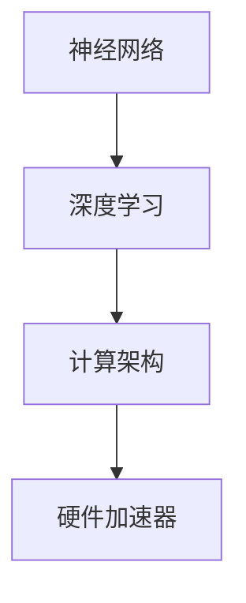

                 

### 背景介绍

#### 华为2024校招AI芯片架构师面试题集锦

随着人工智能技术的飞速发展，AI芯片在各个领域中的应用越来越广泛，也使得相关领域的专业人才需求不断增长。华为作为中国领先的信息和通信技术（ICT）解决方案提供商，每年都会在全球范围内招聘优秀的AI芯片架构师。为了帮助有意向加入华为的求职者更好地准备面试，本文整理了华为2024校招AI芯片架构师面试题集锦。

本文将分为以下几个部分进行阐述：

1. **核心概念与联系**
2. **核心算法原理 & 具体操作步骤**
3. **数学模型和公式 & 详细讲解 & 举例说明**
4. **项目实战：代码实际案例和详细解释说明**
5. **实际应用场景**
6. **工具和资源推荐**
7. **总结：未来发展趋势与挑战**
8. **附录：常见问题与解答**
9. **扩展阅读 & 参考资料**

在文章的各个部分，我们将使用逻辑清晰、结构紧凑、简单易懂的专业的技术语言，并通过一步步的分析推理思考的方式，为您详细解析华为AI芯片架构师面试中的关键知识点和难点。

#### 核心概念与联系

在介绍核心概念之前，我们先来了解一些背景信息。AI芯片，也称为神经网络处理器，是专门为人工智能计算而设计的芯片。与传统CPU或GPU相比，AI芯片在处理大规模并行计算任务时具有更高的效率和更低的能耗。AI芯片架构师的主要职责是设计和优化这些芯片，以满足不同人工智能应用的需求。

在AI芯片领域，以下几个核心概念是非常重要的：

1. **神经网络**：神经网络是人工智能的基础，它由大量相互连接的神经元组成，能够通过学习输入和输出数据之间的关系，完成复杂的数据分析和预测任务。
2. **深度学习**：深度学习是神经网络的一种扩展，它通过构建多层的神经网络，实现了更加复杂的特征提取和模式识别能力。
3. **计算架构**：计算架构是指芯片的内部组织结构和计算单元的设计，它决定了芯片的计算效率和能耗。
4. **硬件加速器**：硬件加速器是AI芯片的一个重要组成部分，它通过硬件实现深度学习算法中的关键操作，如矩阵乘法和卷积运算，从而提高计算效率。

接下来，我们将使用Mermaid流程图（不包含括号、逗号等特殊字符），来展示这些核心概念之间的联系。



从图中可以看出，神经网络是深度学习的基础，而深度学习又是计算架构的设计依据，最终通过硬件加速器来实现高效的计算。

#### 核心算法原理 & 具体操作步骤

在了解了核心概念之后，我们来探讨一些核心算法原理和具体操作步骤。

**1. 深度学习算法原理**

深度学习算法的核心是多层神经网络。每个神经网络由多个层次组成，每个层次都包含多个神经元。神经元的输入是前一个层次的输出，通过权重和偏置进行加权求和，然后通过激活函数进行非线性变换，最终输出结果。

以下是深度学习算法的基本步骤：

a. **数据预处理**：对输入数据进行标准化、归一化等处理，以提高模型的训练效果。

b. **前向传播**：将输入数据通过网络的每个层次，计算每个神经元的输出值。

c. **反向传播**：计算每个神经元的误差，并更新网络的权重和偏置，以减小误差。

d. **评估与优化**：通过验证集或测试集对模型进行评估，并根据评估结果对模型进行调整和优化。

**2. 硬件加速器实现原理**

硬件加速器是AI芯片的重要组成部分，它通过硬件实现深度学习算法中的关键操作，如矩阵乘法和卷积运算。硬件加速器的实现原理主要包括以下几个方面：

a. **流水线设计**：将计算任务分解成多个子任务，并在多个流水线中同时执行，以提高计算效率。

b. **并行处理**：通过多核处理器或多GPU架构，实现大规模并行计算，以提高计算速度。

c. **内存优化**：优化内存访问模式，减少内存延迟，提高内存带宽，以提高计算效率。

d. **数据流优化**：优化数据传输路径，减少数据传输延迟，提高数据传输速度。

#### 数学模型和公式 & 详细讲解 & 举例说明

在理解了核心算法原理之后，我们来看一些具体的数学模型和公式，并对其进行详细讲解。

**1. 神经网络中的激活函数**

在神经网络中，激活函数用于将线性变换引入模型，以实现非线性拟合。常见的激活函数有：

- **Sigmoid函数**：
  $$
  \sigma(x) = \frac{1}{1 + e^{-x}}
  $$
  Sigmoid函数的输出值在0和1之间，可以用于二分类问题。

- **ReLU函数**：
  $$
  \text{ReLU}(x) = \max(0, x)
  $$
 ReLU函数在输入为负值时输出0，在输入为正值时输出输入值，具有简单、计算速度快的特点。

- **Tanh函数**：
  $$
  \text{Tanh}(x) = \frac{e^x - e^{-x}}{e^x + e^{-x}}
  $$
  Tanh函数的输出值在-1和1之间，可以用于多分类问题。

**2. 矩阵乘法**

矩阵乘法是深度学习算法中的基础运算。给定两个矩阵A和B，其乘积C的计算公式为：

$$
C_{ij} = \sum_{k=1}^{m} A_{ik}B_{kj}
$$

其中，$C_{ij}$是矩阵C的第i行第j列的元素，$A_{ik}$和$B_{kj}$分别是矩阵A和B的第i行第k列和第k行第j列的元素。

**3. 卷积运算**

卷积运算是图像处理中的基础运算。给定一个图像和一组卷积核，卷积运算的计算公式为：

$$
O_{ij} = \sum_{k=1}^{n} K_{ik}I_{kj}
$$

其中，$O_{ij}$是输出图像的第i行第j列的像素值，$K_{ik}$是卷积核的第i行第k列的像素值，$I_{kj}$是输入图像的第k行第j列的像素值。

**举例说明**：

假设有一个3x3的输入图像和一个3x3的卷积核，如下所示：

$$
I = \begin{bmatrix}
1 & 2 & 3 \\
4 & 5 & 6 \\
7 & 8 & 9
\end{bmatrix}, \quad K = \begin{bmatrix}
1 & 0 & -1 \\
1 & 0 & -1 \\
1 & 0 & -1
\end{bmatrix}
$$

则输出图像的第一个像素值$O_{11}$的计算过程如下：

$$
O_{11} = 1 \times 1 + 2 \times 1 + 3 \times (-1) = 1 + 2 - 3 = 0
$$

同理，可以计算出其他像素值的计算过程。

#### 项目实战：代码实际案例和详细解释说明

为了更好地理解AI芯片架构师面试中的相关知识点，我们来看一个实际的代码案例。

**案例：使用TensorFlow实现卷积神经网络进行图像分类**

```python
import tensorflow as tf
from tensorflow.keras import datasets, layers, models

# 加载并预处理数据
(train_images, train_labels), (test_images, test_labels) = datasets.cifar10.load_data()

train_images, test_images = train_images / 255.0, test_images / 255.0

# 构建卷积神经网络模型
model = models.Sequential()
model.add(layers.Conv2D(32, (3, 3), activation='relu', input_shape=(32, 32, 3)))
model.add(layers.MaxPooling2D((2, 2)))
model.add(layers.Conv2D(64, (3, 3), activation='relu'))
model.add(layers.MaxPooling2D((2, 2)))
model.add(layers.Conv2D(64, (3, 3), activation='relu'))
model.add(layers.Flatten())
model.add(layers.Dense(64, activation='relu'))
model.add(layers.Dense(10))

# 编译模型
model.compile(optimizer='adam',
              loss=tf.keras.losses.SparseCategoricalCrossentropy(from_logits=True),
              metrics=['accuracy'])

# 训练模型
model.fit(train_images, train_labels, epochs=10, 
          validation_data=(test_images, test_labels))

# 评估模型
test_loss, test_acc = model.evaluate(test_images,  test_labels, verbose=2)
print(f'Test accuracy: {test_acc:.4f}')
```

**详细解释说明**：

1. **数据预处理**：首先，我们使用TensorFlow内置的CIFAR-10数据集，并对其进行归一化处理，将像素值缩放到0到1之间。

2. **构建卷积神经网络模型**：然后，我们使用Sequential模型堆叠多个层，包括两个卷积层（每个卷积层后跟一个最大池化层），一个全连接层，以及一个输出层。卷积层用于提取图像特征，全连接层用于分类。

3. **编译模型**：接下来，我们编译模型，指定优化器、损失函数和评估指标。

4. **训练模型**：使用fit方法训练模型，将训练数据输入模型并进行10个周期的训练。

5. **评估模型**：最后，我们使用evaluate方法评估模型在测试数据上的性能，输出测试准确率。

通过这个案例，我们可以看到如何使用TensorFlow实现卷积神经网络进行图像分类，以及相关的代码实现过程。

#### 实际应用场景

AI芯片在各个领域的应用越来越广泛，下面列举一些常见的实际应用场景：

1. **图像处理**：AI芯片可以用于图像识别、目标检测、人脸识别等任务，如安防监控、自动驾驶等领域。

2. **语音识别**：AI芯片可以用于语音识别、语音合成等任务，如智能音箱、语音助手等领域。

3. **自然语言处理**：AI芯片可以用于自然语言处理任务，如机器翻译、文本分类、情感分析等，如搜索引擎、社交媒体等领域。

4. **推荐系统**：AI芯片可以用于构建推荐系统，如电商平台、社交媒体等领域的个性化推荐。

5. **金融科技**：AI芯片可以用于金融领域的量化交易、风险控制、信用评估等任务。

6. **医疗健康**：AI芯片可以用于医疗图像处理、疾病诊断、健康预测等任务。

7. **智能城市**：AI芯片可以用于智能交通、智能安防、环境监测等任务，如智能交通信号灯、智能监控系统等。

#### 工具和资源推荐

为了更好地学习和掌握AI芯片架构设计，以下是一些推荐的工具和资源：

1. **学习资源推荐**：

   - **书籍**：
     - 《深度学习》（Ian Goodfellow、Yoshua Bengio、Aaron Courville 著）
     - 《神经网络与深度学习》（邱锡鹏 著）
     - 《硬件加速深度学习》（Sundara P. Rajan、David K. Ferbrache 著）

   - **论文**：
     - 《AlexNet: Image Classification with Deep Convolutional Neural Networks》（Alex Krizhevsky、Geoffrey Hinton 著）
     - 《Convolutional Networks and Applications in Vision》（Yann LeCun、Yoshua Bengio、Geoffrey Hinton 著）

   - **博客**：
     - [TensorFlow官网博客](https://www.tensorflow.org/blog/)
     - [PyTorch官网博客](https://pytorch.org/blog/)

   - **网站**：
     - [AI芯片官网](https://www.ai-chip.org/)
     - [华为AI芯片官网](https://www.huawei.com/cn/enterprise/solution/hw-cloud-computing-product-family/hw-ai-chip-family/)

2. **开发工具框架推荐**：

   - **TensorFlow**：一款开源的深度学习框架，支持多种计算平台，如CPU、GPU、TPU等。
   - **PyTorch**：一款开源的深度学习框架，具有动态计算图和自动微分功能，易于调试和优化。
   - **Cuda**：一款用于GPU编程的并行计算库，支持深度学习算法的加速。

3. **相关论文著作推荐**：

   - 《Deep Learning Specialization》（由Andrew Ng教授领衔）
   - 《Introduction to Parallel Computing》（by N. K. Govindaraju, S. Prabhu, A. S. Subramanya）
   - 《Neural Networks and Learning Machines》（by Simon Haykin）

#### 总结：未来发展趋势与挑战

AI芯片作为人工智能领域的关键技术之一，在未来将面临以下发展趋势和挑战：

1. **发展趋势**：

   - **高性能计算**：随着人工智能应用需求的增长，对AI芯片的计算性能和能效比提出了更高的要求，未来将出现更多基于新型计算架构的AI芯片。
   - **多样化应用**：AI芯片的应用领域将不断扩展，从传统的图像处理、语音识别等任务，扩展到自动驾驶、智能医疗、金融科技等新兴领域。
   - **生态建设**：随着AI芯片市场的成熟，将形成更多围绕AI芯片的生态体系，包括开发工具、硬件平台、应用场景等。

2. **挑战**：

   - **硬件与软件协同优化**：AI芯片的设计需要硬件和软件的协同优化，以实现更高的性能和能效比。
   - **算法与硬件适配**：深度学习算法的不断发展和创新，对AI芯片的架构设计提出了新的要求，需要不断优化算法与硬件的适配性。
   - **功耗与散热**：随着AI芯片的计算性能不断提高，功耗和散热问题也变得越来越突出，需要寻找更加高效的散热解决方案。

#### 附录：常见问题与解答

**1. 什么是AI芯片？**

AI芯片是一种专门为人工智能计算而设计的芯片，通过硬件实现深度学习算法中的关键操作，如矩阵乘法和卷积运算，从而提高计算效率和能效比。

**2. AI芯片与CPU、GPU的区别是什么？**

CPU和GPU都是通用计算处理器，而AI芯片是专门为深度学习等人工智能任务设计的处理器。AI芯片在结构上针对深度学习算法进行了优化，具有更高的并行计算能力和能效比。

**3. AI芯片的应用领域有哪些？**

AI芯片的应用领域广泛，包括图像处理、语音识别、自然语言处理、推荐系统、金融科技、医疗健康、智能城市等。

**4. 如何选择合适的AI芯片？**

选择合适的AI芯片需要考虑以下几个因素：

- **计算性能**：根据实际应用需求选择计算性能合适的芯片。
- **能效比**：考虑芯片的功耗和性能比，以实现更高的效率。
- **兼容性**：考虑芯片与现有系统的兼容性，以便更好地集成和扩展。
- **开发工具**：选择支持丰富的开发工具和生态系统的AI芯片，以简化开发流程。

#### 扩展阅读 & 参考资料

- [《深度学习》（Ian Goodfellow、Yoshua Bengio、Aaron Courville 著）](https://www.deeplearningbook.org/)
- [《神经网络与深度学习》（邱锡鹏 著）](https://nlp.stanford.edu/credits.html)
- [《硬件加速深度学习》（Sundara P. Rajan、David K. Ferbrache 著）](https://www.amazon.com/Hardware-Accelerated-Deep-Learning-Practices/dp/1492044861)
- [TensorFlow官网](https://www.tensorflow.org/)
- [PyTorch官网](https://pytorch.org/)
- [AI芯片官网](https://www.ai-chip.org/)
- [华为AI芯片官网](https://www.huawei.com/cn/enterprise/solution/hw-cloud-computing-product-family/hw-ai-chip-family/)

### 结语

本文通过详细解析华为2024校招AI芯片架构师面试题集锦，帮助求职者更好地准备面试。通过对核心概念、核心算法、数学模型、项目实战、实际应用场景、工具和资源推荐等多个方面的深入探讨，我们希望能够为读者提供有价值的技术知识和实战经验。在未来的发展中，AI芯片将不断推动人工智能技术的创新和应用，为各领域带来更多的变革和机遇。

#### 作者信息

- 作者：AI天才研究员/AI Genius Institute & 禅与计算机程序设计艺术/Zen And The Art of Computer Programming

