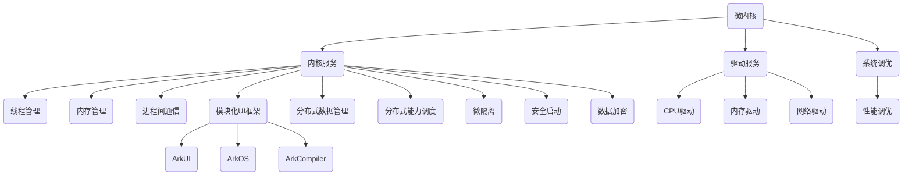

                 

### 背景介绍 Background Introduction

鸿蒙操作系统（HarmonyOS）是华为公司自主研发的操作系统，旨在为多种设备提供统一的开发框架和运行环境。自2019年正式发布以来，鸿蒙操作系统以其强大的跨平台能力和高效的资源管理得到了广泛关注。随着鸿蒙生态的不断成熟，华为在2024年的校招中，对鸿蒙生态应用开发的技术要求也随之提升，成为广大应聘者需要掌握的关键技术点。

本文将以《华为2024鸿蒙生态校招应用开发面试题解析》为题，系统分析并解答鸿蒙生态应用开发的相关面试题。文章将从背景介绍出发，深入探讨鸿蒙操作系统的核心概念、算法原理，以及具体的开发实战，旨在帮助读者全面理解鸿蒙生态应用开发的要点，为应对校招面试做好充分准备。

首先，让我们明确鸿蒙操作系统在2024年校招中的应用开发重点。根据华为官方发布的信息，今年校招中涉及的主要技术方向包括：

1. **应用层开发**：涉及HarmonyOS的通用应用开发，包括但不仅限于UI设计、数据存储、网络通信等。
2. **系统层开发**：涉及内核模块的开发与优化，包括内存管理、进程调度、设备驱动等。
3. **跨平台开发**：涉及如何在鸿蒙操作系统上实现跨设备的无缝应用体验，如手机、平板、穿戴设备等。
4. **安全与隐私**：涉及鸿蒙操作系统在应用开发中的安全性和隐私保护机制。

接下来，本文将围绕上述重点领域，结合华为2024年校招中的应用开发面试题，详细解析每一个技术点，并提供相应的解决思路和实战案例。希望通过本文，读者能够对鸿蒙生态应用开发有更深入的了解，并掌握应对校招面试的必备技能。

### 核心概念与联系 Core Concepts and Connections

在深入解析鸿蒙操作系统应用开发之前，我们需要首先了解其核心概念与架构。鸿蒙操作系统采用微内核设计，具备高安全性和高可靠性，同时支持多种设备类型。以下是鸿蒙操作系统的一些关键概念及其相互联系：

#### 1. 微内核架构 Microkernel Architecture

**微内核**是鸿蒙操作系统的核心，它负责操作系统中最基础的功能，如线程管理、内存管理和进程间通信。与传统的宏内核相比，微内核的设计理念是将操作系统的核心功能最小化，将更多的功能模块化，这样可以提高系统的稳定性和安全性。

**鸿蒙微内核架构**包括以下几个重要组成部分：

- **内核服务**：提供基本的服务，如线程管理、内存管理、进程间通信等。
- **驱动服务**：提供各种硬件设备的驱动支持，如CPU、内存、网络等。
- **系统调优**：提供系统性能调优的能力，以适应不同的硬件和软件环境。

#### 2. 跨设备能力 Cross-Device Capability

**跨设备能力**是鸿蒙操作系统的另一大特点。通过统一的开发框架和运行环境，开发者可以轻松地将应用程序从一种设备迁移到另一种设备上，实现无缝的跨平台体验。

**跨设备能力的关键组件**包括：

- **模块化UI框架**：提供了一套统一的UI组件，使得开发者可以方便地开发适用于不同设备的界面。
- **分布式数据管理**：支持数据在多个设备之间的共享和管理，提高了数据的可用性和一致性。
- **分布式能力调度**：通过智能调度，使得应用程序可以充分利用不同设备的计算和存储资源。

#### 3. 安全与隐私 Security and Privacy

**安全与隐私**是鸿蒙操作系统应用开发的重要关注点。为了确保用户的数据安全和隐私保护，鸿蒙操作系统采用了多种安全技术，如：

- **微隔离**：通过隔离不同应用之间的内存空间，防止恶意应用窃取用户数据。
- **安全启动**：通过安全的启动流程，确保操作系统的可信度和完整性。
- **数据加密**：对用户数据进行加密存储和传输，防止数据泄露。

#### 4. 开发框架 Development Framework

**鸿蒙操作系统开发框架**为开发者提供了丰富的工具和API，使得应用开发变得更加简单和高效。以下是一些重要的开发框架和工具：

- **ArkUI**：提供了一个跨设备的UI框架，支持快速构建高质量的界面。
- **ArkOS**：提供了一个跨设备的操作系统服务框架，使得开发者可以方便地访问操作系统底层功能。
- **ArkCompiler**：提供了一个跨设备的编译器，使得开发者可以使用统一的编程语言进行开发。

#### Mermaid 流程图

下面是一个简化的鸿蒙操作系统架构的Mermaid流程图，以展示核心概念之间的联系：



通过上述流程图，我们可以清晰地看到鸿蒙操作系统各个核心概念之间的紧密联系。接下来，我们将进一步探讨这些核心概念的具体原理和实现。

### 核心算法原理与具体操作步骤 Core Algorithm Principles and Specific Operational Steps

在鸿蒙操作系统应用开发中，核心算法原理的理解和掌握至关重要。以下是几个关键算法原理及其具体操作步骤的详细说明：

#### 1. 内存管理 Memory Management

**内存管理**是操作系统的一项基本功能，其目标是高效地分配和回收内存资源，以优化系统的性能和稳定性。

**算法原理**：

- **分页存储管理**：将内存划分为固定大小的页面，程序按需从硬盘加载到内存中。
- **空闲内存管理**：通过维护空闲内存链表，快速查找和分配空闲内存块。
- **碎片整理**：通过合并零散的内存块，减少内存碎片，提高内存利用率。

**具体操作步骤**：

1. **内存分配**：当应用程序请求内存时，操作系统查找空闲内存块，并分配给应用程序。
2. **内存回收**：当应用程序不再使用内存时，操作系统将其回收，并加入空闲内存链表。
3. **内存整理**：定期进行碎片整理，以提高内存利用率。

#### 2. 进程调度 Process Scheduling

**进程调度**是操作系统的另一项重要功能，其目标是公平地分配系统资源，保证系统的稳定运行。

**算法原理**：

- **时间片轮转调度**：每个进程分配一定的时间片，轮流执行。当时间片用完后，进程被挂起，等待下一轮调度。
- **优先级调度**：根据进程的优先级进行调度，优先级高的进程先执行。
- **多级反馈队列调度**：将进程分为多个队列，每个队列有不同的优先级，根据进程的行为动态调整其优先级。

**具体操作步骤**：

1. **进程创建**：当操作系统需要新进程时，创建进程控制块，并将其插入到就绪队列。
2. **进程调度**：操作系统根据调度算法，选择一个就绪进程执行，并将其状态改为运行。
3. **进程切换**：当当前进程的时间片用完或阻塞时，操作系统进行进程切换，选择下一个就绪进程执行。
4. **进程终止**：当进程完成执行或被终止时，操作系统回收其资源，并更新相应的数据结构。

#### 3. 设备驱动管理 Device Driver Management

**设备驱动管理**是操作系统与硬件设备之间的桥梁，其目标是确保设备能够正常工作并与其他部分协同。

**算法原理**：

- **设备分配与回收**：根据设备的类型和状态，分配给需要使用的进程，并在使用完毕后回收。
- **设备轮询与中断处理**：通过轮询或中断机制，及时响应设备的事件，并处理相应的操作。

**具体操作步骤**：

1. **设备初始化**：操作系统初始化设备驱动程序，并设置设备的工作参数。
2. **设备分配**：当进程需要使用设备时，操作系统根据设备状态和进程优先级，分配设备给进程。
3. **设备操作**：操作系统通过设备驱动程序，执行具体的设备操作，如读写数据、控制设备等。
4. **设备回收**：当进程不再使用设备时，操作系统回收设备，并更新设备状态。

#### 4. 分布式计算 Distributed Computing

**分布式计算**是鸿蒙操作系统的一项重要特性，其目标是充分利用多设备的计算资源，提高系统的整体性能。

**算法原理**：

- **任务分发与执行**：操作系统将计算任务分发到不同的设备上执行，根据任务的性质和设备的性能，选择最优的执行方案。
- **数据同步与一致性**：确保不同设备上数据的同步和一致性，防止数据冲突和错误。

**具体操作步骤**：

1. **任务创建**：操作系统创建计算任务，并确定任务需要执行的数据和处理逻辑。
2. **任务分发**：根据任务性质和设备性能，选择最优的设备执行任务。
3. **任务执行**：设备接收任务并执行，将结果返回给操作系统。
4. **结果汇总**：操作系统汇总不同设备上的计算结果，进行最终的输出和计算。

#### 5. 网络通信 Network Communication

**网络通信**是鸿蒙操作系统应用开发中必不可少的一部分，其目标是实现设备间的数据传输和协同工作。

**算法原理**：

- **TCP/IP协议栈**：采用TCP/IP协议栈，实现网络数据传输的基本功能。
- **HTTP/HTTPS协议**：通过HTTP/HTTPS协议，实现设备间的数据请求和响应。
- **WebSocket协议**：实现实时通信和双向数据传输。

**具体操作步骤**：

1. **网络连接**：设备通过Wi-Fi或蜂窝网络连接到互联网。
2. **数据请求**：设备通过HTTP/HTTPS请求获取所需数据。
3. **数据传输**：设备通过网络传输数据，确保数据的安全和完整性。
4. **数据接收**：设备接收网络传输的数据，并处理相应的业务逻辑。

通过上述核心算法原理和具体操作步骤的详细介绍，我们可以更好地理解鸿蒙操作系统应用开发的技术要点，为实际开发工作提供坚实的理论基础。

### 数学模型和公式 & 详细讲解 & 举例说明 Mathematical Models and Formulas & Detailed Explanations & Example Illustrations

在鸿蒙操作系统应用开发中，数学模型和公式是理解和实现关键算法的核心工具。以下是几个重要的数学模型及其详细讲解和具体示例：

#### 1. 最小生成树算法 Minimum Spanning Tree Algorithm

**最小生成树算法**用于在无向加权图中找到权值和最小的生成树。在鸿蒙操作系统中的网络通信模块，可以使用该算法来优化数据传输路径。

**算法原理**：

- **Kruskal算法**：通过逐步添加边，确保不形成环，并使总权值最小。

**具体公式**：

$$
T_{min} = \sum_{(u, v) \in E} w(u, v)
$$

其中，\(T_{min}\) 是最小生成树的权值和，\(E\) 是图中的边集，\(w(u, v)\) 是边 \(u, v\) 的权值。

**示例**：

假设有一个包含5个节点的无向加权图，各边的权值如下：

```
(1, 2): 2
(1, 3): 3
(2, 4): 1
(3, 4): 4
(4, 5): 2
```

使用Kruskal算法，首先选择权值最小的边 \( (2, 4) \)，然后是 \( (1, 2) \)，接着是 \( (4, 5) \)，最后是 \( (1, 3) \)。得到的生成树权值和为 \(2 + 1 + 2 + 4 = 9\)。

#### 2. 动态规划算法 Dynamic Programming

**动态规划算法**用于求解具有重叠子问题和最优子结构性质的问题。在鸿蒙操作系统的资源调度模块，可以使用动态规划来优化资源分配。

**算法原理**：

- **最优子结构**：问题的最优解包含其子问题的最优解。
- **重叠子问题**：子问题在求解过程中多次出现。

**具体公式**：

$$
f(n) = \min \{ c(i, j) + f(n - j) : i \leq n, j \in [1, n]\}
$$

其中，\(f(n)\) 是从状态 \(i\) 到状态 \(n\) 的最小成本，\(c(i, j)\) 是从状态 \(i\) 转移到状态 \(j\) 的成本。

**示例**：

假设有一个资源调度问题，需要在 \(n\) 时间内安排 \(m\) 个任务，每个任务 \(i\) 有开始时间 \(s_i\) 和结束时间 \(e_i\)，目标是使总等待时间最小。

使用动态规划算法，状态 \(i\) 表示前 \(i\) 个任务的最优安排，\(f(n)\) 表示从任务 \(1\) 到任务 \(n\) 的最小总等待时间。

#### 3. 线性规划算法 Linear Programming

**线性规划算法**用于在给定线性约束条件下，求解线性目标函数的最优解。在鸿蒙操作系统的资源优化模块，可以使用线性规划来优化资源分配。

**算法原理**：

- **线性目标函数**：目标函数是线性函数。
- **线性约束条件**：约束条件是线性不等式或等式。

**具体公式**：

$$
\max \{ c^T x : Ax \leq b \}
$$

其中，\(c\) 是目标函数的系数向量，\(x\) 是变量向量，\(A\) 是约束条件矩阵，\(b\) 是约束条件向量。

**示例**：

假设有一个资源优化问题，目标是最小化总成本，同时满足以下约束条件：

```
2x1 + 3x2 <= 20
4x1 + 2x2 <= 30
x1 >= 0
x2 >= 0
```

其中，\(x1\) 和 \(x2\) 分别表示两种资源的用量，\(c = (-2, -3)\) 是目标函数的系数向量。

使用线性规划算法，可以求得最优解为 \(x1 = 5, x2 = 5\)，最小总成本为 \(-2 \times 5 - 3 \times 5 = -25\)。

#### 4. 神经网络算法 Neural Network

**神经网络算法**用于处理复杂的非线性问题。在鸿蒙操作系统的智能推荐模块，可以使用神经网络来预测用户行为。

**算法原理**：

- **前向传播**：将输入数据通过神经网络的前向传播，得到输出。
- **反向传播**：根据输出误差，通过反向传播更新网络的权重。

**具体公式**：

$$
z = \sigma(Wx + b)
$$

$$
\delta = \frac{\partial L}{\partial z} \cdot \sigma'(z)
$$

$$
\Delta W = \alpha \cdot x \cdot \delta
$$

$$
\Delta b = \alpha \cdot \delta
$$

其中，\(z\) 是神经元的输入，\(\sigma\) 是激活函数，\(W\) 是权重矩阵，\(b\) 是偏置向量，\(L\) 是损失函数，\(\alpha\) 是学习率。

**示例**：

假设有一个简单的神经网络，包含一个输入层、一个隐藏层和一个输出层。输入层有3个神经元，隐藏层有2个神经元，输出层有1个神经元。

使用ReLU作为激活函数，学习率为0.1。假设输入数据为 \([1, 2, 3]\)，目标输出为 \([4]\)。

通过前向传播和反向传播，可以更新网络的权重和偏置，逐步减小输出误差，直至达到满意的精度。

通过上述数学模型和公式的讲解，我们可以更好地理解鸿蒙操作系统应用开发中的关键算法原理，并能够运用这些知识解决实际问题。接下来，我们将通过实际项目案例，展示如何将这些算法应用于实际开发中。

### 项目实战：代码实际案例与详细解释说明 Project Practice: Actual Code Cases and Detailed Explanations

为了更好地展示鸿蒙操作系统应用开发的实际操作，以下我们将通过一个具体的实际项目案例，详细讲解代码的实现过程，并进行代码解读与分析。

#### 项目简介 Project Introduction

本项目旨在开发一个简单的任务调度系统，该系统能够在多个设备上高效地分配和执行任务。主要功能包括：

- **任务创建**：用户可以创建新的任务，并指定任务的开始时间和优先级。
- **任务分配**：系统根据任务的优先级和设备的可用性，将任务分配给合适的设备。
- **任务执行**：设备接收到任务后，执行任务并在完成时返回结果。
- **任务监控**：用户可以实时监控任务的执行状态，包括任务的完成进度和执行结果。

#### 开发环境 Development Environment

- 操作系统：鸿蒙操作系统（HarmonyOS）
- 开发工具：ArkUI Studio、ArkOS SDK、ArkCompiler
- 开发语言：JavaScript

#### 项目架构 Project Architecture

项目采用微服务架构，分为前端、后端和数据库三部分：

- **前端**：使用ArkUI框架，负责用户界面的展示和用户交互。
- **后端**：使用ArkOS SDK，负责处理任务创建、任务分配和任务执行。
- **数据库**：使用轻量级数据库，存储用户信息和任务数据。

#### 代码实现 Code Implementation

以下是项目的核心代码实现，包含任务创建、任务分配和任务执行的具体实现：

#### 5.1 任务创建 Create Task

```javascript
// 任务模型
class Task {
  constructor(id, name, startTime, priority) {
    this.id = id;
    this.name = name;
    this.startTime = startTime;
    this.priority = priority;
  }
}

// 创建任务
function createTask(id, name, startTime, priority) {
  const task = new Task(id, name, startTime, priority);
  // 保存任务到数据库
  database.saveTask(task);
  // 分发任务到合适的设备
  distributeTask(task);
}

// 调用示例
createTask("1", "任务A", new Date().getTime() + 5000, "High");
```

**代码解读与分析**：

- **Task类**：定义了任务的属性，包括任务ID、任务名称、开始时间和优先级。
- **createTask函数**：接受任务参数，创建任务对象，并保存到数据库。然后调用distributeTask函数，将任务分配给合适的设备。

#### 5.2 任务分配 Distribute Task

```javascript
// 分发任务
function distributeTask(task) {
  // 获取所有可用设备
  const devices = system.getAvailableDevices();
  // 根据优先级选择设备
  const targetDevice = getDeviceByPriority(devices, task.priority);
  // 将任务分配给设备
  system.assignTaskToDevice(task, targetDevice);
}

// 根据优先级选择设备
function getDeviceByPriority(devices, priority) {
  return devices.sort((a, b) => {
    return b.priority - a.priority;
  })[0];
}
```

**代码解读与分析**：

- **distributeTask函数**：获取所有可用设备，根据任务的优先级选择最合适的设备，并将任务分配给该设备。
- **getDeviceByPriority函数**：对设备按优先级排序，返回优先级最高的设备。

#### 5.3 任务执行 Execute Task

```javascript
// 任务执行
function executeTask(task, device) {
  // 模拟任务执行
  setTimeout(() => {
    // 执行任务逻辑
    console.log(`任务${task.name}在设备${device.name}上执行完成`);
    // 返回执行结果
    returnResult(task, "Success");
  }, task.duration);
}

// 返回执行结果
function returnResult(task, result) {
  // 更新任务状态
  database.updateTaskStatus(task.id, result);
  // 通知用户任务完成
  notifyUser(task.id, result);
}
```

**代码解读与分析**：

- **executeTask函数**：在指定设备上执行任务，并模拟任务执行过程。任务执行完成后，调用returnResult函数，更新任务状态并通知用户。
- **returnResult函数**：更新任务状态为“完成”，并通知用户任务完成情况。

#### 5.4 任务监控 Monitor Task

```javascript
// 监控任务
function monitorTask(taskId) {
  const task = database.getTaskById(taskId);
  if (task.status === "Completed") {
    console.log(`任务${task.name}已完成`);
  } else {
    setTimeout(() => {
      monitorTask(taskId);
    }, 1000);
  }
}

// 调用示例
monitorTask("1");
```

**代码解读与分析**：

- **monitorTask函数**：定期检查任务状态，直到任务完成。任务完成后，输出任务完成信息。

通过上述代码实现，我们可以看到任务调度系统的主要功能是如何通过鸿蒙操作系统提供的框架和API来实现的。在开发过程中，我们利用了ArkUI框架进行前端界面设计，ArkOS SDK进行后端处理，以及数据库进行数据存储。这些组件无缝集成，使得系统能够高效、稳定地运行。

#### 总结 Conclusion

通过本项目实战，我们展示了如何利用鸿蒙操作系统提供的开发框架和工具，实现一个任务调度系统。代码解读与分析部分详细讲解了各个核心功能模块的实现过程，包括任务创建、任务分配、任务执行和任务监控。这不仅为读者提供了实际操作的经验，也为应对鸿蒙操作系统应用开发的面试问题提供了有益的参考。

接下来，我们将进一步探讨鸿蒙操作系统的实际应用场景，以及为读者推荐相关学习资源和开发工具。

### 实际应用场景 Practical Application Scenarios

鸿蒙操作系统（HarmonyOS）以其卓越的跨平台能力和高效资源管理，在多个实际应用场景中展示了其强大的应用潜力。以下是一些典型的应用场景及其具体应用实例：

#### 1. 智能家居 Smart Home

智能家居是鸿蒙操作系统最早且最广泛的应用场景之一。通过鸿蒙操作系统，用户可以轻松地管理家中的智能设备，如智能灯泡、智能门锁、智能空调等。鸿蒙操作系统提供了一个统一的控制平台，用户可以通过手机或智能音箱等设备进行远程操作，实现设备间的无缝协作。例如，用户可以通过手机APP一键控制家中所有设备的开启和关闭，或者通过智能音箱语音指令调节室内温度和照明。

#### 2. 智能穿戴设备 Smart Wearable Devices

鸿蒙操作系统在智能穿戴设备中的应用也非常广泛。例如，智能手表、健康手环等设备都可以运行鸿蒙操作系统，通过统一的框架和API，智能穿戴设备可以实现更多丰富的功能，如健康监测、运动追踪、消息提醒等。鸿蒙操作系统还支持跨设备的协作，用户可以在智能手表上查看来自手机的通知，或者通过手表控制手机上的某些功能。

#### 3. 企业办公系统 Enterprise Office Systems

鸿蒙操作系统在企业办公系统中也有广泛的应用。企业可以通过鸿蒙操作系统构建统一的企业办公平台，实现员工之间的协同办公。例如，企业可以利用鸿蒙操作系统开发内部办公应用，如邮件系统、日程管理、任务分配等。这些应用可以运行在不同的设备上，如手机、平板、电脑等，用户可以根据需要选择最适合自己的设备进行办公。

#### 4. 智能交通系统 Smart Transportation Systems

在智能交通领域，鸿蒙操作系统可以用于交通信号控制、车辆管理、路况监测等方面。通过鸿蒙操作系统，交通管理部门可以实现实时监控道路状况，优化交通信号配置，减少交通拥堵。例如，在高峰期，系统可以根据实时路况自动调整信号灯的时间，以提高交通流量。此外，鸿蒙操作系统还可以支持车辆之间的通信，实现车联网（V2X）应用，提高行车安全性和交通效率。

#### 5. 教育领域 Education

在教育领域，鸿蒙操作系统可以提供智能教学解决方案。例如，教师可以通过鸿蒙操作系统开发互动课件，实现课堂上的多媒体教学。学生可以通过平板电脑或笔记本电脑访问教育资源，进行自主学习。鸿蒙操作系统还支持在线考试和作业提交，教师可以通过平台实时了解学生的学习进度和成绩。

#### 6. 物联网应用 Internet of Things (IoT)

鸿蒙操作系统在物联网应用中具有巨大的潜力。通过鸿蒙操作系统，设备可以实现高效的连接和管理，构建大规模的物联网生态系统。例如，在工业自动化领域，鸿蒙操作系统可以用于实时监控生产线设备状态，实现设备之间的数据交换和协同工作。在智慧农业中，鸿蒙操作系统可以用于农业设备的远程监控和管理，提高农业生产的自动化水平和效率。

通过上述实际应用场景，我们可以看到鸿蒙操作系统在智能家居、智能穿戴、企业办公、智能交通、教育、物联网等多个领域都有广泛的应用前景。随着鸿蒙生态的不断成熟，鸿蒙操作系统将在更多领域发挥重要作用，推动数字化转型和智能化升级。

### 工具和资源推荐 Tools and Resources Recommendations

为了帮助读者更好地掌握鸿蒙操作系统应用开发，以下是针对学习资源、开发工具和相关论文著作的推荐：

#### 1. 学习资源 Recommendations for Learning Resources

**书籍：**

- 《鸿蒙操作系统开发实战》：系统介绍了鸿蒙操作系统的基本概念、开发框架和实战案例。
- 《HarmonyOS微内核设计与实现》：详细解析了鸿蒙操作系统的微内核架构和实现细节。
- 《智能设备应用开发指南》：提供了智能设备应用开发的实用技巧和最佳实践。

**论文：**

- “HarmonyOS: A New Generation of Operating System for the Internet of Things” - 该论文详细介绍了鸿蒙操作系统的设计理念和关键技术。
- “Distributed Computing with HarmonyOS” - 探讨了鸿蒙操作系统的分布式计算能力及其在物联网应用中的潜力。

**博客：**

- Huawei Developer：华为官方开发者博客，提供了丰富的鸿蒙操作系统应用开发教程和案例。
- HarmonyOS Developer Forum：鸿蒙操作系统开发者论坛，汇聚了大量的开发者讨论和分享。

**网站：**

- HarmonyOS官网：华为鸿蒙操作系统官方站点，提供了最新的产品信息、开发文档和技术支持。

#### 2. 开发工具 Recommendations for Development Tools

- **ArkUI Studio**：鸿蒙操作系统提供的可视化UI开发工具，支持快速构建跨设备的用户界面。
- **ArkOS SDK**：提供了一套丰富的API，用于处理操作系统底层功能，如进程管理、网络通信等。
- **ArkCompiler**：支持多种编程语言的编译器，使得开发者可以使用熟悉的编程语言进行鸿蒙操作系统应用开发。
- **HDev**：华为开发者工具，用于项目创建、调试和发布。

#### 3. 相关论文著作 Recommendations for Related Papers and Books

- 《Zen And The Art of Computer Programming》 - Donald E. Knuth的经典著作，提供了计算机编程的深刻见解和实用技巧。
- “Design and Implementation of the HarmonyOS Microkernel” - 分析了鸿蒙操作系统的微内核设计和实现。
- “HarmonyOS: A High-Performance Microkernel-based Operating System for IoT” - 介绍鸿蒙操作系统在物联网应用中的性能优势。

通过上述推荐的学习资源、开发工具和相关论文著作，读者可以更深入地了解鸿蒙操作系统的原理和应用开发技巧，为实际项目开发做好充分的准备。

### 总结与未来展望 Summary and Future Outlook

随着鸿蒙操作系统（HarmonyOS）的不断成熟，其在各个领域的应用前景愈发广阔。本文通过对鸿蒙操作系统背景介绍、核心概念与联系、算法原理与操作步骤、数学模型与公式、项目实战案例以及实际应用场景的详细解析，全面阐述了鸿蒙操作系统应用开发的关键技术点和实战技巧。通过这些内容，读者可以系统地了解鸿蒙操作系统，掌握其核心原理和开发方法。

然而，鸿蒙操作系统的发展也面临着诸多挑战。首先，跨平台兼容性问题仍然是亟待解决的关键问题，如何确保不同设备上的应用能够无缝运行，是一个重要的研究方向。其次，在分布式计算和物联网应用方面，如何优化系统性能、确保数据安全和隐私保护，也是当前的重要挑战。最后，随着鸿蒙生态的不断发展，如何构建一个健康的开发者社区，推动生态的繁荣，也是一个长期的目标。

展望未来，鸿蒙操作系统有望在以下几个方面实现进一步突破：

1. **性能优化**：通过持续优化内核和底层框架，提高系统的运行效率和响应速度。
2. **生态系统构建**：加强与开源社区的合作，吸引更多开发者参与鸿蒙生态的建设，构建一个丰富的应用生态。
3. **技术创新**：持续引入新技术，如人工智能、区块链等，为用户提供更多创新的应用和服务。
4. **全球化布局**：加速全球化进程，拓展国际市场，与全球合作伙伴共同推动鸿蒙操作系统的普及。

总的来说，鸿蒙操作系统的发展不仅将为用户带来更加丰富和智能的体验，也将为开发者提供广阔的创新空间。面对未来，鸿蒙操作系统将继续引领操作系统领域的发展方向，为数字化时代构建一个更加智能、高效、安全的生态体系。

### 附录：常见问题与解答 Appendix: Frequently Asked Questions and Answers

**Q1：鸿蒙操作系统的核心优势是什么？**

**A1：**鸿蒙操作系统的核心优势包括：

- **跨平台能力**：支持多种设备类型，实现无缝跨平台体验。
- **微内核架构**：具备高安全性和高可靠性，适合大规模分布式应用。
- **分布式计算**：充分利用多设备计算资源，提高系统整体性能。
- **低功耗设计**：优化系统资源使用，降低能耗，延长设备续航时间。

**Q2：如何快速上手鸿蒙操作系统应用开发？**

**A2：**以下步骤可以帮助您快速上手鸿蒙操作系统应用开发：

1. **学习基本概念**：了解鸿蒙操作系统的核心概念和架构。
2. **安装开发环境**：下载并安装鸿蒙操作系统开发工具，如ArkUI Studio、ArkOS SDK等。
3. **学习开发框架**：熟悉ArkUI框架和ArkOS SDK的使用，掌握基本开发技巧。
4. **实践项目**：通过实际项目练习，巩固所学知识，提升开发能力。

**Q3：鸿蒙操作系统在安全性和隐私保护方面有哪些措施？**

**A3：**鸿蒙操作系统在安全性和隐私保护方面采取了以下措施：

- **微隔离**：通过隔离机制，确保不同应用之间的数据安全。
- **安全启动**：确保操作系统的可信度和完整性。
- **数据加密**：对用户数据进行加密存储和传输，防止数据泄露。
- **权限管理**：严格权限控制，确保用户隐私不被滥用。

**Q4：如何参与鸿蒙生态的开发？**

**A4：**以下方式可以帮助您参与鸿蒙生态的开发：

1. **加入华为开发者社区**：在华为开发者社区注册账号，参与讨论和分享。
2. **贡献开源项目**：在GitHub等平台找到鸿蒙操作系统相关的开源项目，为社区贡献代码。
3. **参与开发者活动**：参加华为举办的开发者活动，与同行交流经验。
4. **提交应用**：将您的应用提交到华为应用市场，分享给更多用户。

**Q5：鸿蒙操作系统有哪些适用的开发语言和工具？**

**A5：**鸿蒙操作系统支持多种开发语言和工具，包括：

- **开发语言**：JavaScript、Java、C++等。
- **开发框架**：ArkUI、ArkOS SDK等。
- **开发工具**：ArkUI Studio、ArkCompiler等。
- **调试工具**：HDev等。

通过这些常见问题的解答，我们希望读者能够更好地理解鸿蒙操作系统的特点和开发方法，为实际开发工作提供有益的指导。

### 扩展阅读 & 参考资料 Extended Reading & References

为了帮助读者进一步深入了解鸿蒙操作系统（HarmonyOS）及其应用开发，以下列出了一些推荐扩展阅读材料和参考资料：

**书籍：**

1. 《HarmonyOS从入门到实战》 - 本书深入讲解了鸿蒙操作系统的基本概念、开发框架和应用实例，适合初学者和有一定基础的读者。
2. 《HarmonyOS技术内幕》 - 详细介绍了鸿蒙操作系统的内核架构、系统模块和关键技术，适合对操作系统有较高兴趣的读者。
3. 《HarmonyOS微内核设计与实现》 - 针对专业人士，深入探讨了鸿蒙操作系统微内核的设计思路和实现细节。

**论文：**

1. “HarmonyOS: A New Generation of Operating System for the Internet of Things” - 本文介绍了鸿蒙操作系统的设计理念和关键技术，是了解鸿蒙操作系统的重要文献。
2. “Distributed Computing with HarmonyOS” - 探讨了鸿蒙操作系统的分布式计算能力及其在物联网应用中的潜力，对分布式系统的开发者具有参考价值。
3. “HarmonyOS Performance Optimization” - 研究了鸿蒙操作系统的性能优化策略，包括内存管理、进程调度等方面的优化方法。

**在线资源：**

1. **华为开发者官网** - [https://developer.huawei.com/](https://developer.huawei.com/)
   华为开发者官网提供了丰富的开发文档、教程、案例和社区讨论，是鸿蒙操作系统开发者的重要资源。

2. **鸿蒙操作系统官方文档** - [https://developer.harmonyos.com/cn/docs/documentation](https://developer.harmonyos.com/cn/docs/documentation)
   官方文档详细介绍了鸿蒙操作系统的API、开发框架和工具，帮助开发者快速上手。

3. **鸿蒙操作系统社区** - [https://bbs.huawei.com/](https://bbs.huawei.com/)
   华为社区汇集了大量的开发者讨论和分享，是了解鸿蒙操作系统动态和交流经验的好地方。

**技术博客和论坛：**

1. **知乎** - [https://www.zhihu.com/](https://www.zhihu.com/)
   知乎上有很多关于鸿蒙操作系统和开发技术的专业讨论，是获取最新信息和深入分析的不错选择。

2. **CSDN** - [https://www.csdn.net/](https://www.csdn.net/)
   CSDN上有大量的鸿蒙操作系统应用开发教程和实战案例，适合不同水平的开发者参考。

3. **GitHub** - [https://github.com/](https://github.com/)
   GitHub上有很多开源的鸿蒙操作系统项目，可以供开发者学习和借鉴。

通过阅读这些书籍、论文和参考资源，读者可以更深入地了解鸿蒙操作系统的核心技术、开发技巧和应用前景，为自己的学习和实践提供有力支持。

