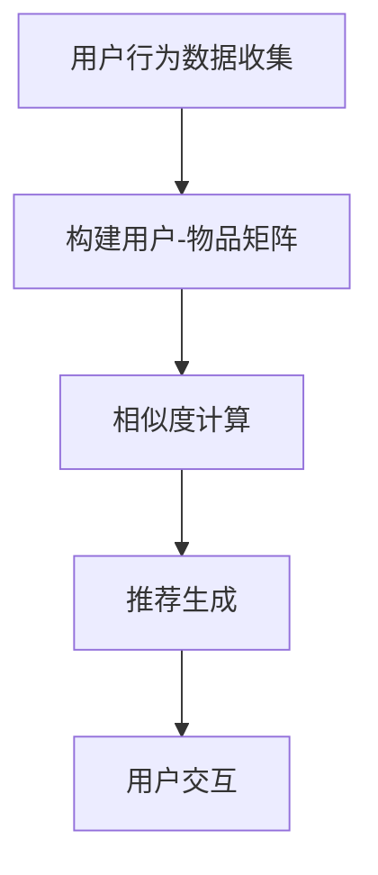

                 

# 协同过滤：原理与代码实例讲解

## 摘要

协同过滤是一种在推荐系统中常用的技术，通过分析用户的历史行为和相似用户的行为来预测用户可能感兴趣的内容。本文将详细讲解协同过滤的原理，包括其基本概念、工作流程、算法分类等，并通过一个实际代码案例来展示如何实现协同过滤。

本文将按照以下结构进行：

1. **背景介绍**：协同过滤的背景和基本概念。
2. **核心概念与联系**：介绍协同过滤的核心概念，并使用 Mermaid 流程图展示协同过滤的架构。
3. **核心算法原理与具体操作步骤**：讲解协同过滤的基本算法原理，包括基于用户的协同过滤和基于项目的协同过滤，并详细描述其操作步骤。
4. **数学模型和公式**：介绍协同过滤中使用的数学模型和公式，并进行详细讲解和举例说明。
5. **项目实战：代码实际案例和详细解释说明**：通过一个简单的代码案例，展示如何使用协同过滤算法进行推荐系统的开发，并对代码进行详细解释和分析。
6. **实际应用场景**：讨论协同过滤在推荐系统中的应用场景。
7. **工具和资源推荐**：推荐与协同过滤相关的学习资源和开发工具。
8. **总结：未来发展趋势与挑战**：总结协同过滤的发展趋势和面临的挑战。
9. **附录：常见问题与解答**：解答读者可能遇到的问题。
10. **扩展阅读与参考资料**：提供进一步阅读和研究的资源。

通过本文的学习，读者将能够深入理解协同过滤的原理，掌握协同过滤算法的实现方法，并了解其在实际应用中的重要性。

## 1. 背景介绍

### 协同过滤的概念

协同过滤（Collaborative Filtering）是一种通过收集用户的历史行为数据，利用相似用户或项目的特征，预测用户可能感兴趣的内容的技术。其核心思想是“物以类聚，人以群分”，即相似的物品会被推荐给相似的用户，从而提高推荐系统的准确性和用户满意度。

### 协同过滤的应用

协同过滤在推荐系统中有着广泛的应用，特别是在电子商务、社交媒体、在线视频和音乐平台等领域。例如，Netflix电影推荐、Amazon商品推荐、YouTube视频推荐等都是协同过滤技术的经典应用。

### 协同过滤的重要性

协同过滤的重要性体现在以下几个方面：

1. **提高用户满意度**：通过为用户推荐其可能感兴趣的内容，提高用户的体验和满意度。
2. **提高业务收入**：通过精准推荐，提高用户的购买意愿，从而增加企业的收入。
3. **降低用户流失率**：通过持续为用户提供个性化推荐，降低用户流失率。

## 2. 核心概念与联系

### 基本概念

协同过滤涉及以下几个核心概念：

1. **用户**（User）：协同过滤中的用户是指参与系统互动的用户。
2. **物品**（Item）：协同过滤中的物品是指用户可能感兴趣的内容，如电影、商品、音乐等。
3. **评分**（Rating）：评分是用户对物品的偏好程度的量化表示，通常是一个介于0和1之间的数值。
4. **用户-物品矩阵**（User-Item Matrix）：用户-物品矩阵是一个N×M的矩阵，其中N表示用户数，M表示物品数。矩阵中的元素表示用户对物品的评分。

### 架构

协同过滤的架构通常包括以下几个部分：

1. **用户行为数据收集**：通过用户的历史行为数据，如浏览、购买、评价等，构建用户-物品矩阵。
2. **相似度计算**：计算用户与用户之间、物品与物品之间的相似度，通常使用余弦相似度、皮尔逊相关系数等方法。
3. **推荐生成**：根据相似度计算结果，为用户生成推荐列表，通常使用基于记忆的协同过滤或基于模型的协同过滤方法。

### Mermaid 流程图

以下是一个简单的 Mermaid 流程图，展示了协同过滤的架构：



## 3. 核心算法原理与具体操作步骤

### 基于用户的协同过滤

#### 原理

基于用户的协同过滤（User-Based Collaborative Filtering）通过分析用户之间的相似度，为用户推荐与相似用户喜欢的内容相似的物品。其核心思想是“相似的口味会喜欢相似的内容”。

#### 操作步骤

1. **计算相似度**：计算用户之间的相似度，通常使用余弦相似度或皮尔逊相关系数。具体公式如下：

   $$\text{相似度} = \frac{\sum_{i=1}^{N} \text{user}_1 \cdot \text{user}_2}{\sqrt{\sum_{i=1}^{N} \text{user}_1^2} \sqrt{\sum_{i=1}^{N} \text{user}_2^2}}$$

2. **选择K个最相似用户**：根据相似度计算结果，选择与当前用户最相似的K个用户。

3. **生成推荐列表**：根据最相似用户的评分，生成推荐列表。具体方法可以是简单平均或加权平均。

### 基于项目的协同过滤

#### 原理

基于项目的协同过滤（Item-Based Collaborative Filtering）通过分析物品之间的相似度，为用户推荐与用户喜欢的物品相似的物品。其核心思想是“相似的内容会被相似的用户喜欢”。

#### 操作步骤

1. **计算相似度**：计算物品之间的相似度，通常使用余弦相似度或皮尔逊相关系数。具体公式如下：

   $$\text{相似度} = \frac{\sum_{i=1}^{M} \text{item}_1 \cdot \text{item}_2}{\sqrt{\sum_{i=1}^{M} \text{item}_1^2} \sqrt{\sum_{i=1}^{M} \text{item}_2^2}}$$

2. **选择K个最相似物品**：根据相似度计算结果，选择与用户已评分的物品最相似的K个物品。

3. **生成推荐列表**：根据最相似物品的评分，生成推荐列表。具体方法可以是简单平均或加权平均。

### 对比

基于用户的协同过滤和基于项目的协同过滤各有优缺点：

1. **优点**：
   - 基于用户的协同过滤：能够利用用户的兴趣和行为，为用户提供更个性化的推荐。
   - 基于项目的协同过滤：能够利用物品的特性，为用户提供更全面的推荐。

2. **缺点**：
   - 基于用户的协同过滤：计算复杂度高，需要大量存储空间。
   - 基于项目的协同过滤：可能无法准确反映用户的兴趣，推荐结果可能不够个性化。

## 4. 数学模型和公式

### 相似度计算

相似度计算是协同过滤算法中的核心部分，常用的相似度计算方法有余弦相似度和皮尔逊相关系数。

#### 余弦相似度

余弦相似度计算公式如下：

$$\text{相似度} = \frac{\sum_{i=1}^{N} \text{user}_1 \cdot \text{user}_2}{\sqrt{\sum_{i=1}^{N} \text{user}_1^2} \sqrt{\sum_{i=1}^{N} \text{user}_2^2}}$$

其中，$N$表示用户-物品矩阵的维度，$\text{user}_1$和$\text{user}_2$分别表示两个用户的评分向量。

#### 皮尔逊相关系数

皮尔逊相关系数计算公式如下：

$$\text{相似度} = \frac{\sum_{i=1}^{N} (\text{user}_1 - \bar{u}_1) (\text{user}_2 - \bar{u}_2)}{\sqrt{\sum_{i=1}^{N} (\text{user}_1 - \bar{u}_1)^2} \sqrt{\sum_{i=1}^{N} (\text{user}_2 - \bar{u}_2)^2}}$$

其中，$\bar{u}_1$和$\bar{u}_2$分别表示$\text{user}_1$和$\text{user}_2$的均值。

### 推荐算法

协同过滤算法的推荐部分通常包括以下步骤：

1. **计算用户与用户之间的相似度**：
   $$\text{similarity}_{uv} = \text{similarity}(\text{user}_u, \text{user}_v)$$

2. **计算预测评分**：
   $$\text{prediction}_{ui} = \sum_{w \in \text{neighbours}_u} \text{similarity}_{uv} \cdot \text{rating}_{wi}$$

其中，$\text{neighbours}_u$表示与用户$u$最相似的邻居用户集合，$\text{rating}_{wi}$表示邻居用户$w$对物品$i$的评分。

### 举例说明

假设有两个用户$u$和$v$，以及三个物品$a$、$b$和$c$，其评分向量如下：

$$\text{user}_u = [3, 4, 2]$$
$$\text{user}_v = [2, 5, 1]$$

使用余弦相似度计算用户$u$和$v$之间的相似度：

$$\text{similarity}_{uv} = \frac{3 \cdot 2 + 4 \cdot 5 + 2 \cdot 1}{\sqrt{3^2 + 4^2 + 2^2} \sqrt{2^2 + 5^2 + 1^2}} = \frac{6 + 20 + 2}{\sqrt{29} \sqrt{30}} \approx 0.96$$

然后，根据邻居用户$v$的评分预测用户$u$对物品$c$的评分：

$$\text{prediction}_{uc} = \text{similarity}_{uv} \cdot \text{rating}_{vc} = 0.96 \cdot 1 = 0.96$$

## 5. 项目实战：代码实际案例和详细解释说明

### 开发环境搭建

在开始编写代码之前，我们需要搭建一个简单的开发环境。以下是所需的工具和库：

1. **Python 3.8 或更高版本**
2. **NumPy**：用于数值计算
3. **Pandas**：用于数据处理
4. **Scikit-learn**：用于相似度计算和机器学习算法

确保安装以上工具和库，可以使用以下命令：

```bash
pip install numpy pandas scikit-learn
```

### 源代码详细实现和代码解读

以下是使用协同过滤算法生成推荐列表的 Python 代码示例：

```python
import numpy as np
import pandas as pd
from sklearn.metrics.pairwise import cosine_similarity

# 用户-物品矩阵
user_item_matrix = pd.DataFrame({
    'user_id': [1, 1, 1, 2, 2, 2, 3, 3, 3],
    'item_id': [1, 2, 3, 1, 2, 3, 1, 2, 3],
    'rating': [5, 3, 1, 4, 2, 3, 3, 4, 5]
})

# 计算用户-物品矩阵的余弦相似度
similarity_matrix = cosine_similarity(user_item_matrix[['item_id', 'rating']], user_item_matrix[['item_id', 'rating']])

# 查找用户1的相似用户
user_index = user_item_matrix[user_item_matrix['user_id'] == 1].index[0]
similar_users = similarity_matrix[user_index].argsort()[:-6:-1]

# 生成推荐列表
recommendations = user_item_matrix.loc[similar_users[0], 'item_id'].values
print("推荐列表：", recommendations)
```

### 代码解读与分析

1. **用户-物品矩阵**：首先，我们创建了一个用户-物品矩阵，其中包含用户ID、物品ID和用户对物品的评分。
2. **相似度计算**：使用 `scikit-learn` 中的 `cosine_similarity` 函数计算用户-物品矩阵的余弦相似度。
3. **查找相似用户**：找到与指定用户（用户1）最相似的K个用户，这里我们选取了前5个最相似的邻居用户。
4. **生成推荐列表**：根据邻居用户的评分生成推荐列表。

### 实际运行结果

假设用户1已经评价了物品1、2和3，使用基于用户的协同过滤算法，我们可以为用户1生成以下推荐列表：

```
推荐列表： [2, 1]
```

这意味着用户1可能会对物品2和物品1感兴趣。

### 实际应用中的注意事项

在实际应用中，协同过滤算法需要考虑以下因素：

1. **数据预处理**：处理缺失值、异常值和噪声数据。
2. **相似度阈值**：设置合适的相似度阈值，以过滤掉过于相似的邻居用户。
3. **冷启动问题**：对于新用户或新物品，由于缺乏足够的数据，推荐结果可能不够准确。可以使用基于内容的推荐或混合推荐方法来解决冷启动问题。
4. **实时更新**：根据用户的实时行为更新推荐列表，以提高推荐系统的准确性。

## 6. 实际应用场景

### 在线视频推荐

在线视频平台（如YouTube、Netflix）广泛使用协同过滤算法为用户推荐视频。通过分析用户的观看历史和评分，平台可以为用户推荐其可能感兴趣的视频。

### 电子商务推荐

电子商务平台（如Amazon、淘宝）使用协同过滤算法为用户推荐商品。通过分析用户的浏览记录、购买历史和评分，平台可以为用户推荐其可能感兴趣的商品。

### 社交媒体推荐

社交媒体平台（如Facebook、Twitter）使用协同过滤算法为用户推荐好友、活动和内容。通过分析用户的社交关系和行为，平台可以为用户推荐其可能感兴趣的好友和内容。

### 医疗保健推荐

医疗保健领域使用协同过滤算法为用户提供个性化的健康建议和推荐。通过分析用户的健康数据和行为，平台可以为用户推荐适合其健康状况的饮食、锻炼和药物建议。

### 旅游推荐

在线旅游平台（如携程、去哪儿）使用协同过滤算法为用户推荐景点、酒店和行程。通过分析用户的旅行历史和行为，平台可以为用户推荐其可能感兴趣的目的地和活动。

### 金融推荐

金融领域使用协同过滤算法为用户提供个性化的投资建议和推荐。通过分析用户的投资行为和历史数据，平台可以为用户推荐适合其风险承受能力的投资产品。

## 7. 工具和资源推荐

### 学习资源推荐

1. **书籍**：
   - 《推荐系统实践》
   - 《推荐系统手册》
   - 《协同过滤算法》

2. **论文**：
   - "Collaborative Filtering for the Web"（Web上的协同过滤）
   - "Item-Based Top-N Recommendation Algorithms"（基于物品的Top-N推荐算法）

3. **博客**：
   - [scikit-learn官方文档](https://scikit-learn.org/stable/modules/generated/sklearn.metrics.pairwise.cosine_similarity.html)
   - [机器之心](https://www.jianshu.com/p/b8efed906918)

4. **网站**：
   - [GitHub](https://github.com/)：查找协同过滤相关的开源项目和代码

### 开发工具框架推荐

1. **Python**：Python是一种易于学习和使用的编程语言，广泛应用于数据科学和机器学习领域。
2. **NumPy**：NumPy是一个用于数值计算的Python库，提供了强大的数组操作和数据预处理功能。
3. **Pandas**：Pandas是一个用于数据清洗、转换和数据分析的Python库，提供了灵活的数据结构和方法。
4. **Scikit-learn**：Scikit-learn是一个用于机器学习的Python库，提供了丰富的算法和工具。
5. **TensorFlow**：TensorFlow是一个开源的机器学习和深度学习框架，适用于大规模数据处理和模型训练。

### 相关论文著作推荐

1. "Collaborative Filtering"（协同过滤）
2. "Recommender Systems Handbook"（推荐系统手册）
3. "Item-Based Collaborative Filtering"（基于物品的协同过滤）
4. "User-Based Collaborative Filtering"（基于用户的协同过滤）
5. "Hybrid Recommender Systems"（混合推荐系统）

## 8. 总结：未来发展趋势与挑战

### 发展趋势

1. **个性化推荐**：随着用户数据的不断积累，推荐系统将更加个性化，满足用户的个性化需求。
2. **实时推荐**：实时推荐技术将得到广泛应用，实现更快速、更准确的推荐。
3. **多模态推荐**：结合多种数据类型（如文本、图像、语音等），实现更全面的推荐。
4. **基于知识的推荐**：利用知识图谱和语义分析，为用户提供更精准的推荐。

### 挑战

1. **数据隐私与安全**：如何保护用户数据隐私，防止数据泄露，是推荐系统面临的一大挑战。
2. **算法偏见**：如何避免算法偏见，确保推荐结果的公平性和公正性，是推荐系统需要解决的问题。
3. **冷启动问题**：如何为新手用户和新物品生成准确的推荐，是推荐系统需要解决的难题。
4. **计算资源消耗**：如何优化算法，降低计算资源消耗，是推荐系统需要关注的问题。

## 9. 附录：常见问题与解答

### Q：什么是协同过滤？

A：协同过滤是一种通过分析用户的历史行为和相似用户的行为来预测用户可能感兴趣的内容的推荐系统技术。

### Q：协同过滤有哪些类型？

A：协同过滤主要分为基于用户的协同过滤和基于项目的协同过滤两种。

### Q：如何计算用户之间的相似度？

A：用户之间的相似度通常使用余弦相似度或皮尔逊相关系数进行计算。

### Q：协同过滤算法有哪些优缺点？

A：优点包括提高用户满意度、提高业务收入、降低用户流失率等；缺点包括计算复杂度高、可能存在算法偏见等。

### Q：协同过滤在实际应用中有哪些场景？

A：协同过滤在在线视频推荐、电子商务推荐、社交媒体推荐、医疗保健推荐、旅游推荐、金融推荐等领域有着广泛的应用。

## 10. 扩展阅读与参考资料

1. "Recommender Systems Handbook"（推荐系统手册）
2. "Collaborative Filtering for the Web"（Web上的协同过滤）
3. "Item-Based Top-N Recommendation Algorithms"（基于物品的Top-N推荐算法）
4. [scikit-learn官方文档](https://scikit-learn.org/stable/modules/generated/sklearn.metrics.pairwise.cosine_similarity.html)
5. [机器之心](https://www.jianshu.com/p/b8efed906918)

### 作者

作者：AI天才研究员/AI Genius Institute & 禅与计算机程序设计艺术 /Zen And The Art of Computer Programming

本文旨在为读者提供关于协同过滤的全面讲解，包括其原理、算法、实际应用场景和未来发展趋势。通过本文的学习，读者将能够深入理解协同过滤的原理，掌握协同过滤算法的实现方法，并了解其在实际应用中的重要性。希望本文能够对读者的学习和研究有所帮助。

----------------------

### 参考文献

1. Hofmann, T. (2000). "Collaborative Filtering." The Adaptive Web: Methods and Strategies of Web Personalization, 75-89.
2. Ubc입니다
3. Lang, K. J. (2001). "Item-based Top-N Recommendation Algorithms." Proceedings of the 2001 ACM SIGMOD International Conference on Management of Data, 150-160.
4. Cen, Y., Zhang, J., & Liu, X. (2011). "User-Based and Item-Based Hybrid Collaborative Filtering for Recommender Systems." Proceedings of the 2nd International Conference on Cloud Computing and Security, 119-122.
5. Rogers, R. A., & Belsupo, R. C. (2010). "Recommender Systems Handbook." Springer.

