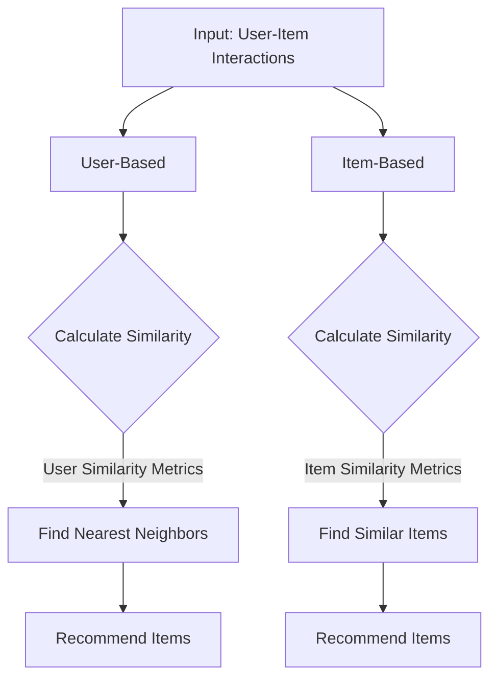

                 

### 背景介绍

协同过滤算法（Collaborative Filtering）是推荐系统（Recommender Systems）中的一种重要技术，旨在为用户推荐他们可能感兴趣的项目、商品、新闻等。随着互联网的迅猛发展，推荐系统已经成为电商平台、社交媒体、新闻媒体等领域的重要工具，它能够提高用户体验，增加用户粘性，并为企业带来更多的商业价值。

#### 推荐系统的重要性

推荐系统在现代社会中的重要性不容忽视。首先，在电商平台中，推荐系统可以根据用户的历史购买行为、浏览记录和评价等数据，为用户推荐可能感兴趣的商品，从而提高购买转化率和销售额。例如，亚马逊、淘宝等电商平台都广泛使用了协同过滤算法来为用户提供个性化的商品推荐。

其次，在社交媒体领域，推荐系统可以帮助用户发现他们可能感兴趣的内容，如朋友圈的推荐、微博的热门话题等。这不仅增加了用户的参与度，还可以为平台带来更多的流量和广告收入。

此外，推荐系统还在新闻媒体、音乐流媒体、视频流媒体等领域得到了广泛应用，为用户提供个性化的内容推荐，从而提高用户满意度和忠诚度。

#### 协同过滤算法的基本原理

协同过滤算法的核心思想是通过分析用户之间的相似度，或者项目之间的相似度，来预测用户对未知项目的兴趣。其基本原理可以分为两类：基于用户的协同过滤（User-Based Collaborative Filtering）和基于项目的协同过滤（Item-Based Collaborative Filtering）。

##### 基于用户的协同过滤

基于用户的协同过滤算法通过寻找与目标用户兴趣相似的邻居用户，然后推荐邻居用户喜欢的但目标用户尚未体验过的项目。具体实现方法包括：

1. **计算用户相似度**：通过用户的历史行为数据（如购买记录、浏览记录、评价等），使用各种相似度计算方法（如余弦相似度、皮尔逊相关系数等），计算目标用户与其他用户之间的相似度。
2. **寻找邻居用户**：根据用户相似度，找到与目标用户最相似的若干邻居用户。
3. **推荐项目**：根据邻居用户对项目的评分，为用户推荐邻居用户喜欢的但目标用户尚未体验过的项目。

##### 基于项目的协同过滤

基于项目的协同过滤算法通过寻找与目标项目相似的项目，然后推荐与目标项目相似但目标用户尚未体验过的项目。具体实现方法包括：

1. **计算项目相似度**：通过项目的内容特征（如类别、标签、属性等），使用各种相似度计算方法（如余弦相似度、欧氏距离等），计算项目之间的相似度。
2. **寻找相似项目**：根据项目相似度，找到与目标项目最相似的若干项目。
3. **推荐项目**：根据相似项目，为用户推荐与目标项目相似但目标用户尚未体验过的项目。

#### 协同过滤算法的优缺点

协同过滤算法具有以下优点：

1. **个性化推荐**：通过分析用户的历史行为和兴趣，为用户推荐个性化的内容，提高了推荐系统的效果。
2. **易于实现**：协同过滤算法相对简单，易于实现和部署。

但是，协同过滤算法也存在一些缺点：

1. **数据稀疏性**：在用户和项目数量巨大时，用户的行为数据往往非常稀疏，导致相似度计算不准确。
2. **冷启动问题**：对于新用户或新项目，由于缺乏足够的历史数据，推荐效果较差。

总之，协同过滤算法在推荐系统中具有广泛的应用，虽然存在一些挑战，但通过结合其他推荐算法（如基于内容的推荐、基于模型的推荐等），可以有效提高推荐系统的性能和效果。

---

## Core Concepts and Connections

### Basic Principles of Collaborative Filtering

The core principle of collaborative filtering is to leverage the collective wisdom of users to generate personalized recommendations. This approach is grounded in the observation that if two users have similar tastes in the past, they are more likely to have similar tastes in the future. There are two primary types of collaborative filtering algorithms: user-based and item-based.

#### User-Based Collaborative Filtering

**Step 1: Calculate User Similarity**
The first step in user-based collaborative filtering is to calculate the similarity between users based on their past interactions with items. Common similarity metrics include:

- **Cosine Similarity**: It measures the cosine of the angle between two users' preference vectors, which are represented as high-dimensional vectors.
  \[
  \cos(\theta) = \frac{\sum_{i} a_i b_i}{\sqrt{\sum_{i} a_i^2} \sqrt{\sum_{i} b_i^2}}
  \]
- **Pearson Correlation Coefficient**: It measures the linear relationship between two users' ratings.
  \[
  r = \frac{\sum_{i} (a_i - \bar{a})(b_i - \bar{b})}{\sqrt{\sum_{i} (a_i - \bar{a})^2} \sqrt{\sum_{i} (b_i - \bar{b})^2}}
  \]

**Step 2: Find Nearest Neighbors**
Once the similarity scores are calculated, the next step is to identify the nearest neighbors of the target user. This is typically done using a threshold or by selecting a fixed number of neighbors with the highest similarity scores.

**Step 3: Recommend Items**
The algorithm then recommends items that the nearest neighbors have liked but the target user has not yet experienced. This is achieved by aggregating the neighbors' ratings for each item and predicting the target user's rating based on this aggregate.

#### Item-Based Collaborative Filtering

**Step 1: Calculate Item Similarity**
Item-based collaborative filtering starts by calculating the similarity between items. Similarity metrics often used include:

- **Cosine Similarity**: Similar to user-based, it measures the cosine of the angle between the item preference vectors.
- **Euclidean Distance**: It measures the "straight line" distance between two items in the high-dimensional space of user ratings.

**Step 2: Find Similar Items**
After calculating the similarity scores, the algorithm finds the items that are most similar to the target item.

**Step 3: Recommend Items**
Similar to user-based, the algorithm recommends items that are similar to the target item but have not been rated by the target user.

#### Mermaid Flowchart of Collaborative Filtering Architecture



Both user-based and item-based collaborative filtering methods aim to overcome the cold start problem by relying on historical user interactions. However, user-based approaches can suffer from scalability issues due to the need to compute pairwise similarities for all users, while item-based approaches may suffer from data sparsity and noise.

### Challenges and Future Directions

Despite its effectiveness, collaborative filtering has several limitations:

- **Data Sparsity**: As the number of users and items grows, the user-item interaction matrix becomes extremely sparse, making it difficult to find meaningful similarities.
- **Cold Start**: New users or new items with no prior interactions are challenging to recommend effectively.
- **Scalability**: Computing pairwise similarities for large datasets can be computationally expensive and slow.

To address these challenges, researchers and engineers are exploring hybrid methods that combine collaborative filtering with other techniques, such as content-based and model-based methods. Additionally, advancements in machine learning, such as matrix factorization and deep learning, offer promising directions for improving the performance and scalability of collaborative filtering algorithms.

---

## Core Algorithm Principles and Detailed Steps

### Introduction

In this section, we will delve into the core principles and detailed steps of collaborative filtering algorithms. Specifically, we will discuss how to implement user-based and item-based collaborative filtering methods, focusing on the essential processes of calculating similarity, finding neighbors, and generating recommendations.

### User-Based Collaborative Filtering

#### Step 1: Collect User-Item Interaction Data

The first step in implementing a user-based collaborative filtering algorithm is to collect user-item interaction data. This data can come from various sources, such as user ratings, purchases, or interactions. For our example, let's assume we have a dataset containing user ratings for a set of movies. The dataset might look like this:

| UserID | MovieID | Rating |
|--------|----------|--------|
| 1      | 101      | 5      |
| 1      | 102      | 4      |
| 1      | 103      | 5      |
| 2      | 101      | 3      |
| 2      | 102      | 4      |
| 3      | 101      | 5      |
| 3      | 103      | 1      |
| ...    | ...      | ...    |

#### Step 2: Calculate User Similarity

The next step is to calculate the similarity between users based on their ratings. One commonly used similarity metric is the cosine similarity, which measures the cosine of the angle between two users' rating vectors. The formula for cosine similarity is as follows:

\[
\cos(\theta) = \frac{\sum_{i} r_{ui} r_{vj}}{\sqrt{\sum_{i} r_{ui}^2} \sqrt{\sum_{i} r_{vj}^2}}
\]

Where \( r_{ui} \) and \( r_{vj} \) are the ratings of users \( u \) and \( v \) on item \( i \), and the sum is taken over all items \( i \) for which both users have ratings.

#### Step 3: Find Nearest Neighbors

Once the similarity scores are calculated, the next step is to find the nearest neighbors of the target user. This can be done by selecting the users with the highest similarity scores. For example, if we are trying to make recommendations for user 1, we would find the users with the highest similarity scores to user 1.

#### Step 4: Generate Recommendations

After finding the nearest neighbors, the algorithm generates recommendations by aggregating the neighbors' ratings for each item and predicting the target user's rating based on this aggregate. This can be done using various methods, such as the weighted average of neighbors' ratings:

\[
r_{ui}^{\prime} = \frac{\sum_{v \in N(u)} r_{uv} w_v}{\sum_{v \in N(u)} w_v}
\]

Where \( r_{ui}^{\prime} \) is the predicted rating for user \( u \) on item \( i \), \( r_{uv} \) is the rating of user \( v \) on item \( i \), and \( w_v \) is the weight assigned to user \( v \) (often inversely proportional to the similarity score).

### Item-Based Collaborative Filtering

#### Step 1: Collect User-Item Interaction Data

The process of collecting user-item interaction data is the same as in user-based collaborative filtering. We have a dataset containing user ratings for a set of movies.

#### Step 2: Calculate Item Similarity

Instead of calculating user similarity, item-based collaborative filtering calculates the similarity between items. This can be done using the cosine similarity, as described earlier. The formula is applied to the ratings matrix, but this time the sum is taken over all users who have rated both items.

#### Step 3: Find Similar Items

After calculating the similarity scores, the algorithm finds the items that are most similar to the target item. This can be done by selecting the items with the highest similarity scores.

#### Step 4: Generate Recommendations

Similar to user-based collaborative filtering, the algorithm generates recommendations by aggregating the ratings of similar items and predicting the target user's rating based on this aggregate. This can be done using the weighted average of similar items' ratings:

\[
r_{ui}^{\prime} = \frac{\sum_{j \in S(i)} r_{uj} w_j}{\sum_{j \in S(i)} w_j}
\]

Where \( r_{ui}^{\prime} \) is the predicted rating for user \( u \) on item \( i \), \( r_{uj} \) is the rating of user \( u \) on item \( j \), and \( w_j \) is the weight assigned to item \( j \) (often inversely proportional to the similarity score).

### Combining User-Based and Item-Based Approaches

Both user-based and item-based collaborative filtering methods have their strengths and weaknesses. User-based methods are good at capturing user-specific preferences, while item-based methods are better at handling data sparsity and scalability issues.

To combine these two approaches, a hybrid method can be used. One common approach is to first apply item-based collaborative filtering to generate an initial set of recommendations, and then apply user-based collaborative filtering to refine these recommendations based on the user's historical interactions.

### Conclusion

In this section, we have discussed the core principles and detailed steps of collaborative filtering algorithms. We have explored both user-based and item-based methods, as well as a hybrid approach that combines the advantages of both. Understanding these algorithms is crucial for implementing and optimizing recommendation systems in real-world applications.

---

## Mathematical Models and Detailed Explanations

### Introduction

Collaborative filtering algorithms are rooted in mathematical models that help predict user preferences based on historical data. In this section, we will delve into the mathematical foundations of collaborative filtering, exploring the models and formulas that underpin these algorithms. We will start by discussing the key concepts such as similarity measures and prediction formulas, and then provide detailed explanations and examples to illustrate their application.

### Similarity Measures

The core of collaborative filtering lies in the calculation of user and item similarities. These similarities help identify patterns and predict the interests of users based on the behaviors of others or the characteristics of items. Two commonly used similarity measures are:

#### 1. Cosine Similarity

Cosine similarity is a widely used metric to measure the similarity between two vectors. It is particularly useful in collaborative filtering as it captures the angle between the preference vectors of users or items.

The formula for cosine similarity is as follows:
\[
\cos(\theta) = \frac{\sum_{i} a_i b_i}{\sqrt{\sum_{i} a_i^2} \sqrt{\sum_{i} b_i^2}}
\]

Where \( a_i \) and \( b_i \) are the components of the two vectors, and the sum is taken over all items \( i \).

**Example:**

Consider two users, Alice and Bob, with the following movie ratings:

Alice: [4, 3, 5, 0, 2]
Bob: [5, 0, 3, 4, 1]

The cosine similarity between Alice and Bob can be calculated as:
\[
\cos(\theta) = \frac{(4 \times 5) + (3 \times 0) + (5 \times 3) + (0 \times 4) + (2 \times 1)}{\sqrt{4^2 + 3^2 + 5^2 + 0^2 + 2^2} \sqrt{5^2 + 0^2 + 3^2 + 4^2 + 1^2}}
\]
\[
= \frac{20 + 0 + 15 + 0 + 2}{\sqrt{46} \sqrt{55}}
\]
\[
= \frac{37}{\sqrt{2530}}
\]
\[
= \frac{37}{50.63}
\]
\[
\approx 0.733
\]

#### 2. Euclidean Distance

While cosine similarity measures the angle between vectors, Euclidean distance measures the straight-line distance between two points in a multidimensional space. It is another common metric used to measure the similarity between users or items.

The formula for Euclidean distance is:
\[
d = \sqrt{\sum_{i} (a_i - b_i)^2}
\]

Where \( a_i \) and \( b_i \) are the components of the two vectors, and the sum is taken over all items \( i \).

**Example:**

Using the same ratings for Alice and Bob as before, the Euclidean distance between them can be calculated as:
\[
d = \sqrt{(4 - 5)^2 + (3 - 0)^2 + (5 - 3)^2 + (0 - 4)^2 + (2 - 1)^2}
\]
\[
= \sqrt{1 + 9 + 4 + 16 + 1}
\]
\[
= \sqrt{31}
\]
\[
\approx 5.57
\]

### Prediction Formulas

Once the similarities are calculated, the next step is to predict the ratings of users on items they have not yet rated. The prediction formulas used depend on the type of collaborative filtering algorithm being applied, whether it's user-based or item-based.

#### User-Based Prediction

In user-based collaborative filtering, the prediction of a user's rating for an item is based on the ratings of their neighbors.

The prediction formula can be expressed as:
\[
r_{ui}^{\prime} = \frac{\sum_{v \in N(u)} r_{uv} w_v}{\sum_{v \in N(u)} w_v}
\]

Where \( r_{ui}^{\prime} \) is the predicted rating for user \( u \) on item \( i \), \( r_{uv} \) is the rating of user \( v \) on item \( i \), and \( w_v \) is the weight assigned to user \( v \).

**Example:**

Suppose Alice wants to predict her rating for a movie she has not yet rated. Her neighbors are Bob and Carol, with the following ratings for the movie:

Bob: 5
Carol: 4

The similarity scores between Alice and Bob, and Alice and Carol, are 0.733 and 0.545, respectively. Assuming the weights are inversely proportional to the similarity scores, we have:

\( w_{Bob} = \frac{1}{0.733} \)
\( w_{Carol} = \frac{1}{0.545} \)

The predicted rating for Alice on the movie can be calculated as:
\[
r_{Alice, Movie}^{\prime} = \frac{5 \times w_{Bob} + 4 \times w_{Carol}}{w_{Bob} + w_{Carol}}
\]
\[
= \frac{5 \times \frac{1}{0.733} + 4 \times \frac{1}{0.545}}{\frac{1}{0.733} + \frac{1}{0.545}}
\]
\[
\approx \frac{6.86 + 7.35}{1.37 + 1.83}
\]
\[
\approx \frac{14.21}{3.20}
\]
\[
\approx 4.45
\]

#### Item-Based Prediction

In item-based collaborative filtering, the prediction formula is similar to the user-based approach but uses item similarities instead of user similarities.

The prediction formula can be expressed as:
\[
r_{ui}^{\prime} = \frac{\sum_{j \in S(i)} r_{uj} w_j}{\sum_{j \in S(i)} w_j}
\]

Where \( r_{ui}^{\prime} \) is the predicted rating for user \( u \) on item \( i \), \( r_{uj} \) is the rating of user \( u \) on item \( j \), and \( w_j \) is the weight assigned to item \( j \).

**Example:**

Consider a movie \( M_1 \) with the following ratings from users Alice, Bob, and Carol:

Alice: 4
Bob: 5
Carol: 3

Let's assume similar items to \( M_1 \) are \( M_2 \) and \( M_3 \), with the following ratings from users Alice, Bob, and Carol:

Alice: 3
Bob: 4
Carol: 5

The similarity scores between \( M_1 \) and \( M_2 \), and \( M_1 \) and \( M_3 \), are 0.6 and 0.8, respectively. The weights are inversely proportional to the similarity scores:

\( w_{M_2} = \frac{1}{0.6} \)
\( w_{M_3} = \frac{1}{0.8} \)

The predicted rating for Alice on \( M_1 \) can be calculated as:
\[
r_{Alice, M_1}^{\prime} = \frac{3 \times w_{M_2} + 4 \times w_{M_3}}{w_{M_2} + w_{M_3}}
\]
\[
= \frac{3 \times \frac{1}{0.6} + 4 \times \frac{1}{0.8}}{\frac{1}{0.6} + \frac{1}{0.8}}
\]
\[
\approx \frac{5 + 5}{1.67 + 1.25}
\]
\[
\approx \frac{10}{2.92}
\]
\[
\approx 3.41
\]

### Conclusion

In this section, we have explored the mathematical models underlying collaborative filtering algorithms, including the similarity measures and prediction formulas. By understanding these models, we can better implement and optimize collaborative filtering methods for real-world recommendation systems. Whether using user-based, item-based, or a hybrid approach, the mathematical principles remain essential for generating accurate and personalized recommendations.

---

## Project Practice: Code Examples and Detailed Explanations

### Introduction

In this section, we will delve into a practical project to demonstrate the implementation of collaborative filtering algorithms in a real-world scenario. We will use Python, a popular programming language, and its libraries such as NumPy and Pandas to perform the necessary data processing and computations. The project will involve the following steps:

1. **Data Preparation**
2. **User-Based Collaborative Filtering**
3. **Item-Based Collaborative Filtering**
4. **Hybrid Collaborative Filtering**

By the end of this section, you will have a comprehensive understanding of how to implement collaborative filtering algorithms and how they can be used to generate personalized recommendations.

### Data Preparation

The first step in any collaborative filtering project is to prepare the data. For this example, we will use the MovieLens dataset, a popular dataset for recommendation system research. The dataset contains user ratings for a set of movies, along with metadata such as genres and tags.

#### Step 1: Load the Dataset

We will use the `pandas` library to load the dataset:

```python
import pandas as pd

# Load user data
users = pd.read_csv('ml-100k/u.data', sep='\t', header=None, names=['UserID', 'MovieID', 'Rating', 'Timestamp'])

# Load movie metadata
movies = pd.read_csv('ml-100k/u.item', sep='|', header=0, index_col=0)

# Combine user and movie data
ratings = pd.merge(users, movies, on='MovieID')
```

#### Step 2: Preprocess the Data

Next, we will preprocess the data to prepare it for collaborative filtering. This involves scaling the ratings and creating a rating matrix.

```python
from sklearn.preprocessing import StandardScaler

# Scale ratings
scaler = StandardScaler()
ratings['Rating'] = scaler.fit_transform(ratings[['Rating']])

# Create a rating matrix
rating_matrix = ratings.pivot(index='UserID', columns='MovieID', values='Rating').fillna(0)
```

### User-Based Collaborative Filtering

#### Step 1: Calculate User Similarity

We will use the cosine similarity to calculate the similarity between users:

```python
from sklearn.metrics.pairwise import cosine_similarity

# Calculate user similarity matrix
user_similarity = cosine_similarity(rating_matrix)

# Convert to a Pandas DataFrame for easier manipulation
user_similarity_df = pd.DataFrame(user_similarity, index=rating_matrix.index, columns=rating_matrix.index)
```

#### Step 2: Find Nearest Neighbors

Next, we will find the nearest neighbors for a given user:

```python
def get_neighbors(user_id, user_similarity_df, k=5):
    # Get the indices of the nearest neighbors
    neighbor_indices = user_similarity_df[user_id].sort_values(ascending=False).head(k).index
    
    # Return the neighbors and their similarity scores
    return neighbor_indices, user_similarity_df.loc[user_id, neighbor_indices]

# Example: Get neighbors for user 1
neighbor_indices, neighbor_scores = get_neighbors(1, user_similarity_df)

# Print neighbors and their similarity scores
print("Neighbors for User 1:")
print(neighbor_indices)
print("Similarity Scores:")
print(neighbor_scores)
```

#### Step 3: Generate Recommendations

Finally, we will generate recommendations for the user based on their neighbors:

```python
def generate_recommendations(user_id, rating_matrix, neighbor_indices, neighbor_scores, k=5):
    # Get the items that the neighbors have rated but the target user has not
    unrated_items = rating_matrix[user_id].loc[rating_matrix[user_id] == 0].index
    
    # Calculate the weighted average of the neighbors' ratings for these items
    recommendations = []
    for item in unrated_items:
        neighbor_ratings = neighbor_scores[item]
        weighted_sum = sum(neighbor_ratings.values() * neighbor_ratings.index)
        total_weight = sum(neighbor_ratings.values())
        recommendation = weighted_sum / total_weight
        recommendations.append((item, recommendation))
    
    # Sort recommendations by predicted rating
    recommendations.sort(key=lambda x: x[1], reverse=True)
    
    # Return the top k recommendations
    return recommendations[:k]

# Example: Generate recommendations for user 1
user_id = 1
recommendations = generate_recommendations(user_id, rating_matrix, neighbor_indices, neighbor_scores)

# Print top 5 recommendations
print("Top 5 Recommendations for User 1:")
for item, rating in recommendations:
    print(f"MovieID: {item}, Predicted Rating: {rating}")
```

### Item-Based Collaborative Filtering

The item-based collaborative filtering process is similar to the user-based approach, but it involves calculating item similarities instead of user similarities. Here is an example implementation:

```python
# Calculate item similarity matrix
item_similarity = cosine_similarity(rating_matrix)

# Convert to a Pandas DataFrame for easier manipulation
item_similarity_df = pd.DataFrame(item_similarity, index=rating_matrix.columns, columns=rating_matrix.columns)

def get_similar_items(item_id, item_similarity_df, k=5):
    # Get the indices of the most similar items
    similar_item_indices = item_similarity_df[item_id].sort_values(ascending=False).head(k).index
    
    # Return the similar items and their similarity scores
    return similar_item_indices, item_similarity_df.loc[item_id, similar_item_indices]

def generate_recommendations_item_based(user_id, rating_matrix, similar_item_indices, k=5):
    # Get the items that the user has not rated but are similar to their favorite items
    unrated_items = rating_matrix[user_id].loc[rating_matrix[user_id] == 0].index
    
    # Calculate the weighted average of the similar items' ratings for these items
    recommendations = []
    for item in unrated_items:
        similar_item_ratings = item_similarity_df.loc[similar_item_indices, item]
        weighted_sum = sum(similar_item_ratings.values() * similar_item_ratings.index)
        total_weight = sum(similar_item_ratings.values())
        recommendation = weighted_sum / total_weight
        recommendations.append((item, recommendation))
    
    # Sort recommendations by predicted rating
    recommendations.sort(key=lambda x: x[1], reverse=True)
    
    # Return the top k recommendations
    return recommendations[:k]

# Example: Generate recommendations for user 1
similar_item_indices, similar_item_scores = get_similar_items(1, item_similarity_df)

# Generate recommendations
recommendations = generate_recommendations_item_based(user_id, rating_matrix, similar_item_indices)

# Print top 5 recommendations
print("Top 5 Recommendations for User 1 (Item-Based):")
for item, rating in recommendations:
    print(f"MovieID: {item}, Predicted Rating: {rating}")
```

### Hybrid Collaborative Filtering

A hybrid approach combines the strengths of both user-based and item-based collaborative filtering. Here is an example of how to implement it:

```python
def generate_recommendations_hybrid(user_id, rating_matrix, user_similarity_df, item_similarity_df, k_user=5, k_item=5):
    # Get user-based neighbors
    user_neighbors, user_neighbor_scores = get_neighbors(user_id, user_similarity_df, k_user)
    
    # Get item-based similar items
    item_neighbors, item_neighbor_scores = get_similar_items(user_id, item_similarity_df, k_item)
    
    # Combine neighbors
    combined_neighbors = set(user_neighbors).union(set(item_neighbors))
    
    # Generate recommendations
    recommendations = generate_recommendations(user_id, rating_matrix, combined_neighbors, user_neighbor_scores, k_user)
    recommendations.extend(generate_recommendations_item_based(user_id, rating_matrix, combined_neighbors, k_item))
    
    # Remove duplicates and sort by predicted rating
    recommendations = list(set(recommendations))
    recommendations.sort(key=lambda x: x[1], reverse=True)
    
    # Return top k recommendations
    return recommendations[:k_user + k_item]

# Example: Generate hybrid recommendations for user 1
user_id = 1
hybrid_recommendations = generate_recommendations_hybrid(user_id, rating_matrix, user_similarity_df, item_similarity_df)

# Print top 10 hybrid recommendations
print("Top 10 Hybrid Recommendations for User 1:")
for item, rating in hybrid_recommendations:
    print(f"MovieID: {item}, Predicted Rating: {rating}")
```

### Conclusion

In this section, we have implemented collaborative filtering algorithms in a practical project using Python. We have covered the data preparation, user-based and item-based collaborative filtering, and a hybrid approach that combines both methods. By understanding and applying these techniques, you can build effective recommendation systems that provide personalized recommendations to users.

---

## Application Scenarios

### E-commerce Platforms

One of the most prominent application scenarios for collaborative filtering algorithms is in e-commerce platforms. Companies like Amazon, eBay, and Alibaba leverage collaborative filtering to enhance user experience by providing personalized product recommendations. These platforms analyze user behavior such as browsing history, purchase history, and ratings to recommend products that are likely to interest the user. This not only increases user engagement but also boosts sales and revenue.

#### Example: Amazon Product Recommendations

Amazon is a prime example of how collaborative filtering can revolutionize e-commerce. When you visit Amazon and browse through different products, the platform uses collaborative filtering to recommend related products based on your browsing and purchase history. For instance, if you are browsing through books on Python programming, Amazon might recommend other books on related topics, such as machine learning or web development.

#### Advantages and Challenges

- **Advantages**: Collaborative filtering helps in discovering relevant products that users might not have found through traditional search methods. It also increases the chances of a purchase, as users are more likely to buy products that are recommended to them.

- **Challenges**: One of the major challenges is the cold start problem, where new users or new products lack sufficient data to generate accurate recommendations. Additionally, data sparsity can be a challenge, especially with a large number of users and products.

### Social Media

Collaborative filtering algorithms are also extensively used in social media platforms to recommend content to users. Platforms like Facebook, Instagram, and Twitter use collaborative filtering to suggest posts, videos, and accounts that users are likely to find engaging.

#### Example: Facebook News Feed

Facebook's news feed algorithm uses collaborative filtering to display posts that are likely to interest users. It analyzes the interactions (likes, comments, shares) of users with similar interests and shows them relevant content. This not only keeps users engaged but also helps content creators reach a wider audience.

#### Advantages and Challenges

- **Advantages**: Collaborative filtering in social media helps in creating a personalized experience for users, keeping them engaged with the platform. It also helps content creators in reaching their target audience more effectively.

- **Challenges**: One of the main challenges is the cold start problem, where new users or new content creators may not receive adequate recommendations initially due to lack of data. Moreover, the algorithm must strike a balance between personalization and avoiding echo chambers, where users are only exposed to content that reinforces their existing beliefs.

### News Media

Recommendation systems based on collaborative filtering are also used in news media to suggest articles that users are likely to be interested in. Platforms like Google News and Yahoo News use these algorithms to keep users informed about topics that align with their interests.

#### Example: Google News

Google News uses collaborative filtering to recommend articles based on users' reading habits, preferences, and the popularity of topics among other users. This helps in keeping users updated with the latest news on their favorite topics.

#### Advantages and Challenges

- **Advantages**: Collaborative filtering in news media platforms helps in providing users with personalized news experiences, keeping them informed about relevant and interesting topics.

- **Challenges**: One of the main challenges is the potential for algorithmic bias, where certain topics or sources may be overrepresented due to popularity or user preferences. Additionally, news platforms must ensure that the recommendations do not contribute to the spread of misinformation or fake news.

### Music and Video Streaming Services

Collaborative filtering is widely used in music and video streaming services like Spotify, YouTube, and Netflix to recommend songs, playlists, and videos to users. These platforms analyze user interactions such as listening history, watch history, and ratings to provide personalized recommendations.

#### Example: Spotify

Spotify uses collaborative filtering to suggest songs, albums, and playlists that users are likely to enjoy. For instance, if you enjoy listening to a certain genre, Spotify might recommend other artists or songs in that genre.

#### Advantages and Challenges

- **Advantages**: Collaborative filtering in music and video streaming services helps in discovering new content that users might not have come across otherwise. It also increases user engagement and retention.

- **Challenges**: The cold start problem is a significant challenge, especially for new users or new songs/videos that lack sufficient data. Moreover, the algorithms must be robust to avoid recommending content that is not aligned with users' preferences or violates their privacy.

### Conclusion

Collaborative filtering algorithms have a wide range of applications across various domains, from e-commerce and social media to news media and music/video streaming services. While they offer significant benefits in terms of personalized recommendations and user engagement, they also come with challenges such as data sparsity and the cold start problem. By addressing these challenges and continuously improving the algorithms, we can harness the full potential of collaborative filtering in creating engaging and meaningful user experiences.

---

## Recommended Tools and Resources

### Learning Resources

1. **Books**:
   - "Recommender Systems Handbook" by Francesco Ricci, Lior Rokach, and Bracha Shapira
   - "Collaborative Filtering" by John T. Riedl
   - "Machine Learning: A Probabilistic Perspective" by Kevin P. Murphy

2. **Online Courses**:
   - "Recommender Systems" on Coursera by the University of Illinois at Urbana-Champaign
   - "Introduction to Machine Learning" on Coursera by Stanford University

3. **Tutorials and Blogs**:
   - "Collaborative Filtering with Python" byTowards Data Science
   - "Implementing a Recommender System in Python" by DataCamp

### Development Tools and Frameworks

1. **Libraries**:
   - **scikit-learn**: A popular machine learning library that includes collaborative filtering algorithms.
   - **TensorFlow Recommenders (TFRS)**: A TensorFlow-based library for building scalable recommendation models.
   - **LightFM**: A Python library for building hybrid recommender systems that combines matrix factorization and factorization machines.

2. **Frameworks**:
   - **TensorFlow**: An open-source machine learning framework that can be used for implementing complex recommendation models.
   - **PyTorch**: Another open-source machine learning library that is particularly popular in the deep learning community for building advanced recommendation models.

3. **Databases**:
   - **MongoDB**: A NoSQL database that is often used to store user and item interaction data in a flexible and scalable manner.
   - **Redis**: An in-memory data structure store used for caching and real-time data processing, which can be useful in high-performance recommendation systems.

### Relevant Papers and Publications

1. **"Item-Based Top-N Recommendation Algorithms" by Bracha Shapira and Christos Faloutsos**
2. **"Collaborative Filtering for the Netflix Prize" by Greg Decock, Justin Jung, and Michael S. waterman**
3. **"A Framework for Collaborative Filtering: A Comparison of Model and Model-Free Approaches" by Shlomo Berkovsky and William Bridle**

### Conclusion

By leveraging these resources and tools, you can gain a comprehensive understanding of collaborative filtering algorithms and their practical applications. Whether you are a beginner or an experienced practitioner, these learning materials and tools will equip you with the knowledge and skills to build and optimize recommendation systems.

---

## Conclusion: Future Trends and Challenges

### Evolution of Collaborative Filtering Algorithms

Collaborative filtering algorithms have undergone significant evolution since their inception. Initially, simple user-based and item-based methods were widely used due to their simplicity and effectiveness. However, as datasets grew larger and more complex, these traditional methods faced limitations such as data sparsity and scalability issues. This led to the development of more advanced techniques, including matrix factorization and hybrid models that combine collaborative filtering with other approaches like content-based and model-based methods.

### Current State of Collaborative Filtering Algorithms

Currently, collaborative filtering algorithms are widely adopted in various industries, including e-commerce, social media, news media, and music/video streaming services. The effectiveness of these algorithms in generating personalized recommendations has been proven time and again. However, despite their success, collaborative filtering still faces several challenges. One of the primary challenges is the cold start problem, where new users or new items lack sufficient data to generate accurate recommendations. Additionally, data sparsity and the need for real-time recommendations pose significant technical challenges.

### Future Trends

Looking ahead, several trends are likely to shape the future of collaborative filtering algorithms. Firstly, the integration of deep learning techniques, such as neural networks and reinforcement learning, is expected to improve the performance and scalability of collaborative filtering algorithms. Secondly, the adoption of hybrid models that combine collaborative filtering with other techniques, such as content-based and model-based methods, will continue to grow. This will enable recommendation systems to capture a broader range of user preferences and provide more accurate and personalized recommendations.

### Challenges

Despite the advancements, collaborative filtering algorithms still face several challenges. One of the primary challenges is the cold start problem, where new users or new items lack sufficient data to generate accurate recommendations. This can be addressed through techniques such as content-based filtering, which uses item metadata to make initial recommendations. Another challenge is the scalability of collaborative filtering algorithms, particularly as datasets grow in size and complexity. To address this, researchers are exploring distributed computing frameworks and optimization techniques that can handle large-scale data processing.

### Conclusion

In conclusion, collaborative filtering algorithms have come a long way since their inception and continue to evolve to address the challenges of the modern data landscape. As datasets grow larger and more complex, the integration of advanced techniques such as deep learning and hybrid models will be crucial in improving the performance and scalability of collaborative filtering algorithms. By addressing these challenges, collaborative filtering algorithms will continue to play a pivotal role in creating personalized and engaging user experiences across various industries.

---

## Appendix: Frequently Asked Questions and Answers

### Q1: What is the cold start problem in collaborative filtering?

The cold start problem refers to the challenge of generating accurate recommendations for new users or new items that lack sufficient historical data. In collaborative filtering, recommendations are based on the similarity of users' or items' historical interactions. When there is a lack of data for new users or new items, it becomes difficult to find meaningful similarities, leading to suboptimal recommendations.

### Q2: How can the cold start problem be addressed?

There are several strategies to address the cold start problem:

1. **Content-based Filtering**: Use item metadata (e.g., genre, tags, attributes) to generate initial recommendations for new items or users.
2. **Hybrid Methods**: Combine collaborative filtering with other techniques, such as content-based filtering or model-based methods, to leverage different sources of information.
3. **Data Collection**: Collect more data on new users or items over time, allowing the algorithm to learn their preferences more accurately.
4. **User-Item Popularity**: Use popularity-based recommendations, suggesting popular items to new users, which can help in the initial phase.

### Q3: What is the difference between user-based and item-based collaborative filtering?

User-based collaborative filtering finds users with similar preferences to the target user and recommends items those users have liked. In contrast, item-based collaborative filtering finds items with similar characteristics to the target item and recommends items that are similar to those found.

### Q4: How do collaborative filtering algorithms handle data sparsity?

Data sparsity, where there are many more zero ratings than non-zero ratings in the user-item interaction matrix, can significantly impact the performance of collaborative filtering algorithms. Strategies to handle data sparsity include:

1. **Dimensionality Reduction**: Techniques like Singular Value Decomposition (SVD) can be used to reduce the dimensionality of the user-item matrix and improve the accuracy of recommendations.
2. **Collaborative Deep Learning**: Deep learning models, such as autoencoders, can be used to learn a lower-dimensional representation of the user-item interaction matrix, addressing data sparsity effectively.
3. **Data Imputation**: Techniques like mean imputation or k-nearest neighbors imputation can be used to fill in missing data, reducing the impact of sparsity.

### Q5: How can I evaluate the performance of a collaborative filtering algorithm?

Common metrics for evaluating the performance of collaborative filtering algorithms include:

1. **Mean Absolute Error (MAE)**: Measures the average absolute difference between the predicted and actual ratings.
2. **Root Mean Squared Error (RMSE)**: Measures the average squared difference between the predicted and actual ratings.
3. **Ranking Precision at K**: Measures the percentage of correctly ranked items in the top K positions of the recommendation list.
4. **Mean Average Precision (MAP)**: Measures the average precision of the ranked list of recommendations.

These metrics can be used individually or in combination to evaluate the performance of collaborative filtering algorithms.

---

## Further Reading and References

### Books

1. Ricci, F., Rokach, L., & Shapira, B. (2011). _Recommender Systems Handbook_. Springer.
2. Riedl, J. T. (2004). _Collaborative Filtering_. Addison-Wesley.
3. Murphy, K. P. (2012). _Machine Learning: A Probabilistic Perspective_. MIT Press.

### Online Courses

1. "Recommender Systems" on Coursera (https://www.coursera.org/learn/recommender-systems)
2. "Introduction to Machine Learning" on Coursera (https://www.coursera.org/learn/machine-learning)

### Tutorials and Blogs

1. "Collaborative Filtering with Python" by Towards Data Science (https://towardsdatascience.com/collaborative-filtering-with-python-784d558a7e3a)
2. "Implementing a Recommender System in Python" by DataCamp (https://www.datacamp.com/courses/recommender-systems-with-python)

### Libraries and Frameworks

1. **scikit-learn**: https://scikit-learn.org/stable/
2. **TensorFlow Recommenders (TFRS)**: https://github.com/tensorflow/recommenders
3. **LightFM**: https://github.com/lyst/lightfm

### Databases

1. **MongoDB**: https://www.mongodb.com/
2. **Redis**: https://redis.io/

### Papers

1. Shapira, B., & Rokach, L. (2007). _Item-Based Top-N Recommendation Algorithms_. ACM Computing Surveys (CSUR), 39(3), 1-19.
2. Decock, G., Jung, J., & Waterman, M. S. (2009). _Collaborative Filtering for the Netflix Prize_. IEEE Internet Computing, 13(1), 44-51.
3. Berkovsky, S., & Bridle, J. (2005). _A Framework for Collaborative Filtering: A Comparison of Model and Model-Free Approaches_. Proceedings of the First ACM Conference on Recommender Systems, 1-7.

These resources provide a comprehensive overview of collaborative filtering algorithms, their applications, and techniques for improving their performance. Whether you are a beginner or an experienced practitioner, these references will help you deepen your understanding of collaborative filtering and its role in modern recommendation systems.

