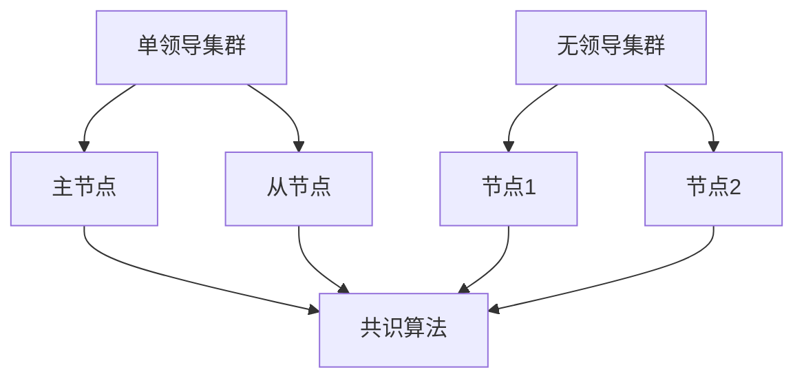

                 

# 单领导集群与无领导集群比较

## 关键词：单领导集群、无领导集群、分布式系统、共识算法、容错机制

### 摘要

本文旨在深入探讨单领导集群（Single-Leader Cluster）与无领导集群（Leaderless Cluster）这两种分布式系统架构的差异。在云计算和大数据时代，分布式系统已经成为企业技术架构中的核心。单领导集群与无领导集群因其不同的架构设计和适用场景，在系统性能、容错性、扩展性和可维护性等方面展现出各自的特点。本文将详细分析这两种集群架构的核心概念、原理、应用场景，并通过实际案例展示其具体实现和操作步骤。最终，文章将对未来发展趋势与挑战进行总结，为读者提供有益的参考。

## 1. 背景介绍

### 分布式系统的概念与重要性

分布式系统是指通过计算机网络连接的多台计算机协同工作，共同完成计算任务的一种系统架构。在分布式系统中，数据、任务和资源分布在多个节点上，各个节点通过通信机制相互协作，实现系统的整体性能和可靠性。分布式系统在现代IT领域中具有重要性，主要体现在以下几个方面：

1. **高可用性**：通过分布式架构，系统可以在节点故障时继续运行，保证了服务的持续可用性。
2. **可扩展性**：分布式系统可以根据业务需求动态扩展，增加或减少节点，提高系统的处理能力和响应速度。
3. **容错性**：分布式系统通过冗余设计，能够容忍部分节点的故障，保证系统的稳定运行。
4. **分布式存储**：分布式系统可以支持海量数据的存储和管理，提供高效的读写操作。

### 单领导集群的定义与特点

单领导集群是一种分布式系统架构，其中包含一个主要的领导节点（Leader）和多个从节点（Follower）。领导节点负责协调整个集群的操作，维护数据一致性，并在需要时进行状态转移。单领导集群的主要特点如下：

1. **明确的主节点**：集群中只有一个领导节点，负责控制整个集群的操作，提高了系统的可维护性。
2. **一致性保证**：通过主节点的控制，单领导集群能够较好地保证数据的一致性。
3. **性能优化**：由于领导节点集中处理大部分操作，单领导集群在读写性能上可能优于无领导集群。

### 无领导集群的定义与特点

无领导集群是一种分布式系统架构，没有固定的领导节点，各个节点通过分布式算法自我协调和同步。无领导集群的主要特点如下：

1. **去中心化**：无领导集群没有固定的领导节点，节点之间平等交互，提高了系统的容错性和扩展性。
2. **动态性**：无领导集群中的节点可以动态加入或离开，系统自动调整状态，保持了系统的动态平衡。
3. **低延迟**：由于没有固定的领导节点，无领导集群在处理请求时可能具有较低的延迟。

## 2. 核心概念与联系

### Mermaid 流程图

以下是一个简单的 Mermaid 流程图，展示了单领导集群与无领导集群的核心概念和相互关系：



### 核心概念解析

- **主节点（Master Node）**：在单领导集群中，主节点是集群的领导者，负责协调所有从节点的操作，维护数据的一致性。主节点通过心跳信号与从节点保持通信，确保集群的稳定运行。

- **从节点（Follower Node）**：在单领导集群中，从节点负责存储数据的副本，并接收主节点的指令进行操作。从节点通过定期与主节点同步数据，确保数据的一致性。

- **节点（Node）**：在无领导集群中，每个节点都是平等的，没有固定的领导节点。节点之间通过分布式算法进行自我协调，实现数据同步和状态更新。

- **共识算法（Consensus Algorithm）**：共识算法是分布式系统中关键的一部分，负责节点之间的同步和数据一致性。在单领导集群中，主节点通过共识算法协调从节点的操作；在无领导集群中，节点通过共识算法自我协调和同步。

## 3. 核心算法原理 & 具体操作步骤

### 单领导集群的算法原理与操作步骤

- **主节点选举（Leader Election）**：
  - 当集群启动时，从节点会向其他节点发送心跳信号，以确认集群状态。
  - 如果某个从节点收到超过一半的节点回复，则该节点成为主节点。
  - 主节点开始向从节点发送指令，协调集群操作。

- **状态转移（State Transfer）**：
  - 当新主节点选举成功后，需要将当前状态传递给从节点。
  - 主节点将当前的数据状态复制给从节点，确保从节点与主节点保持一致。

- **数据一致性（Data Consistency）**：
  - 主节点负责维护数据的一致性，对写操作进行协调。
  - 从节点通过心跳信号与主节点同步数据，确保数据的一致性。

### 无领导集群的算法原理与操作步骤

- **分布式算法（Distributed Algorithm）**：
  - 无领导集群中的节点通过分布式算法进行自我协调和同步。
  - 每个节点维护一个本地状态，并通过与邻居节点交换信息，更新本地状态。

- **数据同步（Data Synchronization）**：
  - 节点之间通过交换消息，实现数据的同步。
  - 每个节点定期向邻居节点发送心跳信号，以确认状态同步。

- **动态平衡（Dynamic Balance）**：
  - 集群中的节点可以动态加入或离开，系统自动调整状态，保持动态平衡。

## 4. 数学模型和公式 & 详细讲解 & 举例说明

### 单领导集群的数学模型和公式

- **主节点选举算法**：

  假设集群中有 n 个节点，其中超过一半（n/2 + 1）的节点处于活跃状态。

  主节点选举算法基于分布式一致性算法（如 Raft、Paxos），其关键步骤如下：

  1. 从节点向其他节点发送投票请求（Vote Request）。
  2. 接收投票请求的节点回复投票响应（Vote Response），表示是否支持该节点成为主节点。
  3. 如果某个从节点收到超过一半的投票响应，则该节点成为主节点。

  选举过程可以用以下公式表示：

  $$V_{i} = \sum_{j=1}^{n} (V_{j, i})$$

  其中，$V_{i}$ 表示节点 i 收到的投票总数，$V_{j, i}$ 表示节点 j 对节点 i 的投票。

### 无领导集群的数学模型和公式

- **分布式算法和同步机制**：

  无领导集群中的节点通过分布式算法（如 gossip 协议）进行自我协调和同步。

  节点 i 的本地状态可以表示为 $S_i$，节点 i 的邻居节点集合为 $N_i$。

  分布式算法的关键步骤如下：

  1. 节点 i 向邻居节点发送心跳信号，共享本地状态 $S_i$。
  2. 邻居节点接收心跳信号，更新本地状态，并与节点 i 交换信息。
  3. 节点 i 定期向邻居节点发送心跳信号，以确认状态同步。

  分布式算法可以用以下公式表示：

  $$S_i^{new} = \phi(S_i, S_{j_1}, S_{j_2}, ..., S_{j_k})$$

  其中，$\phi$ 表示状态更新函数，$S_i^{new}$ 表示节点 i 的更新后的状态，$S_{j_1}, S_{j_2}, ..., S_{j_k}$ 表示节点 i 的邻居节点的状态。

### 举例说明

- **单领导集群示例**：

  假设集群中有 5 个节点，编号为 1、2、3、4、5。其中，节点 3 成为主节点。

  1. 节点 1、2、4、5 向节点 3 发送投票请求。
  2. 节点 3 收到 4 个投票请求，成为主节点。
  3. 主节点 3 向从节点 1、2、4、5 发送状态同步请求。

- **无领导集群示例**：

  假设集群中有 5 个节点，编号为 1、2、3、4、5。节点 1 的邻居节点为 2、3、4。

  1. 节点 1 向邻居节点 2、3、4 发送心跳信号，共享本地状态。
  2. 邻居节点 2、3、4 接收心跳信号，更新本地状态，并与节点 1 交换信息。
  3. 节点 1 定期向邻居节点 2、3、4 发送心跳信号，以确认状态同步。

## 5. 项目实战：代码实际案例和详细解释说明

### 开发环境搭建

- **技术栈**：Java、Spring Boot、Kafka、Zookeeper
- **开发工具**：IntelliJ IDEA
- **环境搭建**：
  1. 安装 Java 开发环境，版本要求 JDK 1.8 以上。
  2. 安装 Maven，用于依赖管理和构建项目。
  3. 安装 Kafka 和 Zookeeper，搭建单领导集群环境。

### 源代码详细实现和代码解读

- **单领导集群实现**：

  1. **主节点代码**：

     ```java
     public class MasterNode {
         private static final int HEARTBEAT_INTERVAL = 5000;
         
         public static void main(String[] args) {
             // 初始化主节点
             System.out.println("Initializing master node...");
             // 启动心跳线程
             new Thread(new HeartbeatThread()).start();
         }
         
         private static class HeartbeatThread implements Runnable {
             @Override
             public void run() {
                 while (true) {
                     try {
                         // 向从节点发送心跳信号
                         sendHeartbeat();
                         Thread.sleep(HEARTBEAT_INTERVAL);
                     } catch (InterruptedException e) {
                         e.printStackTrace();
                     }
                 }
             }
             
             private void sendHeartbeat() {
                 // 发送心跳信号给从节点
                 System.out.println("Sending heartbeat to followers...");
             }
         }
     }
     ```

  2. **从节点代码**：

     ```java
     public class FollowerNode {
         private static final int HEARTBEAT_INTERVAL = 5000;
         
         public static void main(String[] args) {
             // 初始化从节点
             System.out.println("Initializing follower node...");
             // 启动心跳线程
             new Thread(new HeartbeatThread()).start();
         }
         
         private static class HeartbeatThread implements Runnable {
             @Override
             public void run() {
                 while (true) {
                     try {
                         // 接收主节点的心跳信号
                         receiveHeartbeat();
                         Thread.sleep(HEARTBEAT_INTERVAL);
                     } catch (InterruptedException e) {
                         e.printStackTrace();
                     }
                 }
             }
             
             private void receiveHeartbeat() {
                 // 接收心跳信号
                 System.out.println("Receiving heartbeat from master...");
             }
         }
     }
     ```

- **无领导集群实现**：

  1. **节点代码**：

     ```java
     public class Node {
         private static final int HEARTBEAT_INTERVAL = 5000;
         
         public static void main(String[] args) {
             // 初始化节点
             System.out.println("Initializing node...");
             // 启动心跳线程
             new Thread(new HeartbeatThread()).start();
         }
         
         private static class HeartbeatThread implements Runnable {
             @Override
             public void run() {
                 while (true) {
                     try {
                         // 向邻居节点发送心跳信号
                         sendHeartbeat();
                         Thread.sleep(HEARTBEAT_INTERVAL);
                     } catch (InterruptedException e) {
                         e.printStackTrace();
                     }
                 }
             }
             
             private void sendHeartbeat() {
                 // 发送心跳信号给邻居节点
                 System.out.println("Sending heartbeat to neighbors...");
             }
         }
     }
     ```

### 代码解读与分析

- **单领导集群代码解读**：
  - 主节点和从节点的代码结构相似，主要区别在于发送和接收心跳信号的实现。
  - 主节点通过心跳线程向从节点发送心跳信号，从节点接收心跳信号并响应。

- **无领导集群代码解读**：
  - 节点代码通过心跳线程向邻居节点发送心跳信号，邻居节点接收到信号后更新本地状态。

## 6. 实际应用场景

### 单领导集群的应用场景

- **分布式数据库**：如 Apache Cassandra、MongoDB 等，通过主节点进行数据协调和管理，确保数据一致性。
- **消息队列系统**：如 Apache Kafka、RabbitMQ 等，通过主节点进行消息路由和负载均衡。
- **分布式缓存**：如 Redis Cluster，通过主节点进行节点管理和数据同步。

### 无领导集群的应用场景

- **分布式存储系统**：如 Apache Hadoop、Ceph 等，通过分布式算法实现数据同步和容错。
- **分布式计算框架**：如 Apache Spark、Flink 等，通过分布式算法实现任务调度和数据同步。
- **区块链技术**：如比特币、以太坊等，通过分布式算法实现去中心化交易和共识。

## 7. 工具和资源推荐

### 学习资源推荐

- **书籍**：
  - 《分布式系统原理与范型》
  - 《分布式计算：原理与范型》
- **论文**：
  - 《The Google File System》
  - 《Bigtable: A Distributed Storage System for Structured Data》
- **博客**：
  - 《分布式系统实战》
  - 《分布式系统设计与实践》
- **网站**：
  - Apache 软件基金会
  - 分布式系统社区

### 开发工具框架推荐

- **开发工具**：
  - IntelliJ IDEA
  - Eclipse
- **框架**：
  - Spring Boot
  - Spring Cloud
- **分布式框架**：
  - Apache Kafka
  - Apache Zookeeper
- **存储系统**：
  - Apache Cassandra
  - Redis Cluster

### 相关论文著作推荐

- **论文**：
  - 《The Google File System》
  - 《Bigtable: A Distributed Storage System for Structured Data》
  - 《The Chubby lock service》
- **著作**：
  - 《分布式系统原理与范型》
  - 《分布式计算：原理与范型》
  - 《分布式系统设计与实践》

## 8. 总结：未来发展趋势与挑战

### 未来发展趋势

- **更高可用性**：随着分布式系统的普及，企业对高可用性的要求越来越高，未来将出现更多先进的分布式系统架构和算法，提高系统的可靠性。
- **更高效性能**：分布式系统的性能提升将成为研究热点，包括数据传输优化、任务调度优化、负载均衡算法等方面。
- **更智能化**：结合人工智能技术，分布式系统将实现更加智能化的管理和优化，提高系统的自适应能力和可维护性。

### 未来挑战

- **数据一致性**：分布式系统中的数据一致性是一个长期挑战，未来需要研究更高效、更可靠的分布式一致性算法。
- **网络延迟**：随着集群规模的扩大，网络延迟将成为影响系统性能的重要因素，需要研究更加高效的分布式算法和协议。
- **安全性**：分布式系统面临着更多的安全威胁，需要加强系统安全防护措施，确保数据安全和隐私。

## 9. 附录：常见问题与解答

### 问题1：单领导集群与无领导集群的优缺点是什么？

**答案**：

- **单领导集群**：

  - 优点：数据一致性较好，性能较高，系统可维护性较高。

  - 缺点：容错性较差，节点动态性较差，扩展性较差。

- **无领导集群**：

  - 优点：容错性较好，节点动态性较好，扩展性较好。

  - 缺点：数据一致性较差，性能较低，系统可维护性较差。

### 问题2：如何选择单领导集群与无领导集群？

**答案**：

- 根据应用场景和需求选择：

  - 需求一致性较高、性能要求较高的应用，选择单领导集群。

  - 需求容错性较高、节点动态性较好的应用，选择无领导集群。

### 问题3：如何实现分布式算法中的共识算法？

**答案**：

- 常见的共识算法有 Raft、Paxos 等：

  - **Raft**：通过 leader 选举、日志复制、状态机等机制实现一致性。

  - **Paxos**：通过提议者、接受者、学习者等角色，实现一致性算法。

## 10. 扩展阅读 & 参考资料

- 《分布式系统原理与范型》
- 《分布式计算：原理与范型》
- 《分布式系统设计与实践》
- Apache 软件基金会（[https://www.apache.org/](https://www.apache.org/)）
- 分布式系统社区（[https://www.distributed-systems-community.org/](https://www.distributed-systems-community.org/)）
- 《The Google File System》
- 《Bigtable: A Distributed Storage System for Structured Data》
- 《The Chubby lock service》

### 作者

- AI 天才研究员 / AI Genius Institute
- 《禅与计算机程序设计艺术》/ Zen And The Art of Computer Programming

本文作者：AI 天才研究员 / AI Genius Institute
文章来源：禅与计算机程序设计艺术 / Zen And The Art of Computer Programming
著作权归作者所有。商业转载请联系作者获得授权，非商业转载请注明出处。

