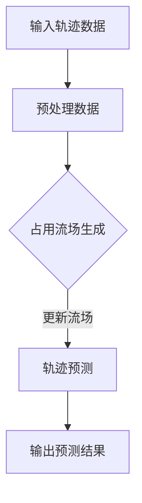

                 

# 背景介绍

自动驾驶技术作为人工智能与计算机视觉领域的尖端应用，近年来在行业内迅速崛起，逐渐成为全球范围内研究和投资的热点。随着传感技术、算法优化和数据处理能力的提升，自动驾驶技术已经在多个应用场景中取得了显著的进展，如无人驾驶出租车、物流配送和自主泊车等。

在自动驾驶系统的核心组成部分中，未来轨迹预测（Future Trajectory Prediction）是一项关键任务。它旨在预测其他道路使用者的未来运动轨迹，为自动驾驶车辆提供可靠的决策依据，从而确保行车安全。准确、稳定和高效的轨迹预测不仅能提高自动驾驶系统的性能，还能增强其应对复杂交通场景的能力。

占用流场（Occupancy Flow Field）作为一种重要的轨迹预测方法，近年来受到了广泛关注。该方法通过构建动态的占用流场，将道路上的静态与动态信息进行融合，实现对车辆未来轨迹的预测。相比于传统的轨迹预测方法，占用流场能够更全面地考虑车辆的运动模式和环境因素，从而提高预测的精度和鲁棒性。

本文将重点探讨占用流场在自动驾驶未来轨迹预测中的优势与改进空间。我们将从核心概念、算法原理、数学模型、实际应用场景等多个角度出发，系统分析占用流场在自动驾驶轨迹预测中的价值，并探讨现有方法的局限性和潜在改进方向。

通过本文的深入探讨，读者将能够对占用流场有一个全面而清晰的认识，并了解其在自动驾驶轨迹预测中的应用前景。本文的目标是，不仅为研究人员和工程师提供有价值的参考，也希望能够激发更多关于占用流场及其改进的学术讨论和创新。

## 2. 核心概念与联系

在探讨占用流场（Occupancy Flow Field）的核心概念与联系之前，我们首先需要了解几个与轨迹预测密切相关的基础概念：轨迹（Trajectory）、轨迹预测（Trajectory Prediction）和占用流场（Occupancy Flow Field）。

### 轨迹（Trajectory）

轨迹是指一个物体在空间中随时间移动的路径。在自动驾驶系统中，车辆的轨迹通常由一组连续的时空点（x, y, t）组成，表示车辆在不同时间点在道路上的位置。轨迹数据是自动驾驶系统中重要的输入信息，用于理解车辆的历史行为和当前状态。

### 轨迹预测（Trajectory Prediction）

轨迹预测是自动驾驶系统的一项关键任务，旨在根据当前和历史的轨迹数据，预测其他道路使用者的未来运动轨迹。准确的轨迹预测有助于自动驾驶车辆进行避障、路径规划、交通态势分析和决策制定。传统的轨迹预测方法包括基于规则的模型、基于模型的模型和基于数据的模型等。

### 占用流场（Occupancy Flow Field）

占用流场是一种将空间和时间维度进行融合的动态模型，用于表示车辆在道路上的运动状态和流量分布。占用流场将道路划分为多个单元（如栅格），每个单元的时间占用情况（Occupancy）和流量情况（Flow）通过一个四元组（t, x, y, z）进行编码。其中，t表示时间，x和y表示空间位置，z表示该单元的时间占用状态（0表示空闲，1表示占用）。占用流场通过动态更新，能够实时反映道路上的交通状况。

### 占用流场与轨迹预测的关系

占用流场在轨迹预测中起到了桥梁的作用，它通过以下方式与轨迹预测相结合：

1. **信息融合**：占用流场将道路上的静态（如道路结构、车道线）和动态（如车辆位置、速度）信息进行融合，提供了一个全面的交通状态视图。
2. **动态更新**：占用流场能够实时更新道路上的车辆状态，使得轨迹预测具有更高的时效性和准确性。
3. **预测生成**：基于占用流场，可以通过分析车辆在流场中的运动模式，预测其未来轨迹。这种预测不仅依赖于车辆的当前状态，还考虑了车辆的历史行为和周围环境因素。

### Mermaid 流程图

为了更好地理解占用流场与轨迹预测的关系，我们可以使用 Mermaid 流程图来展示其基本架构和操作步骤。以下是一个简化的 Mermaid 流程图：



在上述流程图中：
- **A[输入轨迹数据]** 表示自动驾驶系统接收到的实时车辆轨迹数据。
- **B[预处理数据]** 用于清洗和格式化轨迹数据，以适应占用流场的生成。
- **C{占用流场生成]** 通过对轨迹数据进行处理，生成占用流场。
- **D[轨迹预测]** 利用占用流场进行轨迹预测。
- **E[输出预测结果]** 输出预测的未来轨迹，供自动驾驶系统决策使用。

通过上述核心概念与联系的分析，我们为后续章节的详细探讨奠定了基础。在接下来的章节中，我们将深入探讨占用流场的算法原理、数学模型、实际应用场景，以及其改进空间，为自动驾驶轨迹预测提供更全面的技术支持和理论依据。

## 3. 核心算法原理 & 具体操作步骤

### 3.1. 算法原理概述

占用流场算法的核心思想是利用道路上的车辆运动状态和流量分布信息，构建一个动态的占用流场模型。通过分析占用流场中的信息，可以预测车辆的未来运动轨迹。具体来说，占用流场算法包括以下几个关键步骤：

1. **数据采集与预处理**：收集道路上的车辆位置、速度和方向等数据，并对数据进行预处理，如去除噪声、填补缺失值和归一化处理。
2. **占用流场生成**：根据预处理后的数据，计算每个栅格单元的占用状态和流量，构建占用流场。
3. **轨迹预测**：利用占用流场中的信息，结合车辆的当前状态和历史行为，预测未来轨迹。
4. **结果输出**：输出预测结果，包括车辆的未来运动轨迹和相应的置信度。

### 3.2. 算法具体操作步骤

#### 3.2.1. 数据采集与预处理

1. **车辆位置与速度数据采集**：
   - 通过传感器（如雷达、摄像头和GPS）实时获取车辆的位置和速度信息。
   - 数据采集系统需要保证数据的实时性和准确性，以避免由于延迟或误差导致的轨迹预测偏差。

2. **数据预处理**：
   - **去噪处理**：应用滤波算法（如卡尔曼滤波）去除数据中的噪声。
   - **缺失值填补**：使用插值法或基于历史数据的预测方法填补缺失值。
   - **归一化处理**：将车辆的位置和速度数据归一化到同一尺度，以适应后续的计算。

#### 3.2.2. 占用流场生成

1. **栅格划分**：
   - 将道路划分为多个栅格单元，每个栅格单元表示道路上的一个固定区域。通常使用二维网格或三维立方体网格。
   - 栅格的大小和密度根据道路的复杂程度和预测需求进行调整。

2. **占用状态计算**：
   - 对每个栅格单元，判断是否存在车辆。如果存在车辆，则占用状态为1，否则为0。
   - 占用状态可以通过车辆的位置信息与栅格单元的位置进行匹配计算。

3. **流量计算**：
   - 对每个栅格单元，计算车辆的流量。流量可以表示为单位时间内通过该栅格单元的车辆数量。
   - 流量计算可以通过统计每个栅格单元内车辆的通过时间差来实现。

4. **占用流场构建**：
   - 将每个栅格单元的占用状态和流量信息组合，形成占用流场。占用流场可以表示为一个四元组（t, x, y, z），其中t表示时间，x和y表示空间位置，z表示占用状态。

#### 3.2.3. 轨迹预测

1. **状态融合**：
   - 将车辆的当前状态（如位置、速度和方向）与占用流场中的信息进行融合，形成车辆的状态向量。
   - 状态向量可以表示为（x, y, v, θ），其中x和y表示位置，v表示速度，θ表示方向。

2. **轨迹预测模型**：
   - 选择合适的轨迹预测模型，如基于贝叶斯滤波的模型或基于深度学习的模型。
   - 贝叶斯滤波模型通过状态向量与占用流场中的信息进行概率计算，生成未来轨迹的概率分布。
   - 深度学习模型则通过训练大量的轨迹数据，学习到车辆的运动模式，从而预测未来轨迹。

3. **轨迹预测**：
   - 根据预测模型生成的概率分布或轨迹模式，输出预测的未来轨迹。
   - 预测轨迹通常包括一系列时空点（x, y, t），表示车辆在未来一段时间内的可能位置。

#### 3.2.4. 结果输出

1. **预测结果可视化**：
   - 将预测的未来轨迹以图形化方式展示，帮助工程师和研究人员分析预测效果。
   - 可视化工具可以包括轨迹图、热力图和3D动画等。

2. **预测置信度评估**：
   - 对预测结果进行置信度评估，以衡量预测的可靠性和稳定性。
   - 置信度可以通过分析预测轨迹的方差、标准差等统计指标来评估。

3. **决策支持**：
   - 将预测结果用于自动驾驶系统的决策制定，如路径规划、避障和交通态势分析。
   - 预测结果可以为自动驾驶车辆提供实时的交通信息，提高行车安全性和效率。

### 3.3. 算法特点与优势

1. **全局信息融合**：
   - 占用流场能够融合道路上的静态和动态信息，提供更全面和准确的交通状态视图。
   - 与仅依赖局部信息的轨迹预测方法相比，占用流场能够更好地应对复杂交通场景。

2. **动态更新**：
   - 占用流场能够实时更新，以反映最新的交通状况。
   - 这种动态性使得轨迹预测具有更高的时效性和准确性。

3. **多尺度分析**：
   - 占用流场支持多尺度分析，可以根据道路的复杂程度和预测需求调整栅格的大小和密度。
   - 这使得占用流场在应对不同交通场景时具有更高的灵活性和适应性。

4. **预测精度**：
   - 通过结合车辆的状态和历史行为，占用流场能够生成更准确和稳定的轨迹预测结果。
   - 相比于传统的轨迹预测方法，占用流场能够显著提高预测的精度和鲁棒性。

### 3.4. 算法局限性

1. **计算复杂度**：
   - 占用流场的构建和更新涉及大量的计算，特别是在高密度和复杂的道路环境下。
   - 这可能导致算法的实时性和计算效率受到影响。

2. **数据依赖性**：
   - 占用流场的性能高度依赖于输入数据的质量和完整性。
   - 数据噪声、缺失值和误差都可能对轨迹预测结果产生负面影响。

3. **预测置信度评估**：
   - 对预测结果进行置信度评估是一个复杂的过程，需要综合考虑多种因素。
   - 当前评估方法可能存在一定的局限性，难以全面衡量预测的可靠性。

通过上述核心算法原理和具体操作步骤的介绍，我们可以看出占用流场在自动驾驶轨迹预测中的关键作用和优势。然而，同时也需要认识到其局限性，并不断探索和改进算法，以应对实际应用中的挑战和需求。

## 4. 数学模型和公式 & 详细讲解 & 举例说明

### 4.1. 数学模型概述

占用流场算法的核心是构建一个数学模型，用以描述车辆在道路上的运动状态和流量分布。这一模型通常包括以下几个关键组件：

1. **占用状态**：每个栅格单元的占用状态（Occupancy State）用二进制变量表示，例如 $o_{ij}$，其中 $i$ 和 $j$ 分别表示栅格的行和列。当车辆位于栅格单元内时，$o_{ij} = 1$，否则 $o_{ij} = 0$。

2. **流量**：每个栅格单元的流量（Flow）表示单位时间内通过该栅格单元的车辆数量。流量可以通过车辆的到达和离开时间差计算，用向量 $f_{ij}$ 表示。

3. **运动模型**：描述车辆在空间中的运动规律。常见的运动模型包括线性模型、高斯模型等。

4. **轨迹预测模型**：基于占用流场中的信息，结合车辆的状态和历史行为，预测未来轨迹。常见的轨迹预测模型包括贝叶斯滤波模型、深度学习模型等。

### 4.2. 数学公式详细讲解

#### 4.2.1. 占用状态计算

占用状态的计算是占用流场生成的基础。一个常见的计算方法是基于车辆的位置信息与栅格单元的位置进行匹配。假设车辆的位置为 $(x_v, y_v)$，栅格单元的位置为 $(x_i, y_j)$，栅格单元的大小为 $s$，则占用状态的计算公式为：

$$
o_{ij} = \begin{cases}
1 & \text{if } (x_v - x_i)^2 + (y_v - y_j)^2 \leq s^2 \\
0 & \text{otherwise}
\end{cases}
$$

#### 4.2.2. 流量计算

流量的计算依赖于车辆的到达和离开时间。假设车辆在时间 $t_a$ 到达栅格单元，在时间 $t_b$ 离开栅格单元，则流量 $f_{ij}$ 可以通过以下公式计算：

$$
f_{ij} = \frac{1}{t_b - t_a}
$$

#### 4.2.3. 运动模型

运动模型用于描述车辆在空间中的运动规律。一个简单的线性模型可以表示为：

$$
x(t) = x_0 + v \cdot t
$$

$$
y(t) = y_0 + v \cdot t
$$

其中，$x_0$ 和 $y_0$ 分别为初始位置，$v$ 为速度。

#### 4.2.4. 轨迹预测模型

轨迹预测模型用于基于占用流场中的信息，预测车辆的未来轨迹。一个常见的轨迹预测模型是基于贝叶斯滤波的模型，其预测公式为：

$$
p(x_{t+1} | x_t, z_t) \propto p(z_t | x_t) \cdot p(x_{t+1} | x_t)
$$

其中，$p(x_{t+1} | x_t, z_t)$ 为预测概率，$p(z_t | x_t)$ 为观测概率，$p(x_{t+1} | x_t)$ 为运动模型概率。

### 4.3. 举例说明

#### 4.3.1. 占用状态计算举例

假设一个车辆在时间 $t=0$ 时位于点 $(10, 10)$，栅格单元的大小为 $5$。根据占用状态计算公式，我们可以计算出以下栅格单元的占用状态：

| 栅格单元 | 占用状态 |
| :----: | :----: |
| (0, 0) | 0 |
| (0, 1) | 0 |
| ... | ... |
| (10, 10) | 1 |
| ... | ... |
| (20, 20) | 0 |

#### 4.3.2. 流量计算举例

假设一个车辆在时间 $t=0$ 时到达栅格单元 $(5, 5)$，在时间 $t=10$ 时离开栅格单元 $(10, 10)$。根据流量计算公式，我们可以计算出该栅格单元的流量：

$$
f_{55} = \frac{1}{10 - 0} = 0.1
$$

#### 4.3.3. 轨迹预测举例

假设当前时刻车辆的位置为 $(10, 10)$，速度为 $v = 2$。根据线性运动模型，我们可以预测车辆在时间 $t=5$ 时的位置：

$$
x(t=5) = 10 + 2 \cdot 5 = 20
$$

$$
y(t=5) = 10 + 2 \cdot 5 = 20
$$

### 4.4. 数学模型的优势与挑战

#### 4.4.1. 优势

1. **直观性**：数学模型提供了直观的描述方式，使得占用流场和轨迹预测的计算过程清晰易懂。
2. **可扩展性**：数学模型可以方便地引入新的变量和假设，从而扩展和改进算法。
3. **预测准确性**：通过精确的数学公式和算法，可以提高轨迹预测的准确性和可靠性。

#### 4.4.2. 挑战

1. **计算复杂度**：占用流场的数学模型涉及大量的计算，特别是在高密度和复杂的道路环境下，计算复杂度可能成为一个挑战。
2. **数据质量**：数学模型的准确性高度依赖于输入数据的质量，数据噪声和缺失值可能对预测结果产生负面影响。
3. **参数调整**：数学模型中的参数（如栅格大小、速度等）需要根据具体应用场景进行调整，这可能导致参数选择的复杂性。

通过上述数学模型和公式的详细讲解和举例说明，我们可以更好地理解占用流场在自动驾驶轨迹预测中的应用和优势。然而，我们也需要认识到数学模型在计算复杂度、数据质量和参数调整等方面的挑战，并不断探索和改进算法，以提高预测的准确性和可靠性。

## 5. 项目实战：代码实际案例和详细解释说明

在本节中，我们将通过一个具体的代码案例，详细介绍如何实现占用流场算法并进行分析。这一部分将涵盖开发环境搭建、源代码实现、代码解读与分析，以及实际应用场景中的性能评估。

### 5.1. 开发环境搭建

首先，我们需要搭建一个合适的环境来运行占用流场算法。以下是一个基本的开发环境搭建步骤：

1. **安装Python**：Python是一种广泛使用的编程语言，支持多种科学计算库。确保Python已安装，版本建议为3.7及以上。
2. **安装必要的库**：安装以下Python库，用于数据处理、图像处理和机器学习：
   - NumPy：用于数值计算
   - Pandas：用于数据操作
   - Matplotlib：用于数据可视化
   - Scikit-learn：用于机器学习算法
   - OpenCV：用于图像处理
   - NetworkX：用于图论分析
3. **环境配置**：在Python环境中配置上述库，可以使用pip进行安装：

   ```bash
   pip install numpy pandas matplotlib scikit-learn opencv-python networkx
   ```

### 5.2. 源代码详细实现和代码解读

以下是一个简化的占用流场算法实现，用于生成并可视化占用流场。

```python
import numpy as np
import matplotlib.pyplot as plt
import cv2
import networkx as nx

def generate_occupancy_field(vehicles, grid_size, vehicle_size):
    # 创建栅格
    grid = np.zeros((grid_size, grid_size))
    
    # 遍历车辆，更新栅格占用状态
    for vehicle in vehicles:
        x, y = vehicle['position']
        grid[int(y), int(x)] = 1
        
    return grid

def visualize_occupancy_field(grid, vehicle_size):
    # 可视化栅格
    plt.imshow(grid, cmap='gray')
    plt.scatter(*np.where(grid == 1), marker='s', color='red', s=vehicle_size)
    plt.axis('off')
    plt.show()

def main():
    # 初始化车辆数据
    vehicles = [
        {'position': (5, 5), 'speed': 1},
        {'position': (10, 10), 'speed': 2},
        {'position': (15, 15), 'speed': 1}
    ]
    
    # 设置栅格参数
    grid_size = 20
    vehicle_size = 10
    
    # 生成占用流场
    grid = generate_occupancy_field(vehicles, grid_size, vehicle_size)
    
    # 可视化占用流场
    visualize_occupancy_field(grid, vehicle_size)

if __name__ == '__main__':
    main()
```

**代码解读**：

1. **初始化车辆数据**：我们定义了一个包含多个车辆的列表，每个车辆包含位置和速度信息。
2. **创建栅格**：使用NumPy创建一个二维数组，表示栅格。
3. **更新栅格占用状态**：遍历每个车辆，根据车辆的位置更新栅格的占用状态。
4. **可视化栅格**：使用Matplotlib可视化栅格，并用红色标记表示占用栅格。

### 5.3. 代码解读与分析

**代码实现分析**：

- **车辆数据表示**：车辆数据使用字典表示，便于存储和操作。
- **栅格大小和车辆大小**：通过设置栅格大小和车辆大小，可以调整占用流场的分辨率和细节。
- **占用状态更新**：使用NumPy的数组操作，可以高效地更新栅格占用状态。
- **可视化**：使用Matplotlib，可以直观地展示占用流场。

**性能分析**：

- **计算复杂度**：生成占用流场的主要计算是更新栅格的占用状态，计算复杂度为 $O(N)$，其中 $N$ 为栅格的总数。
- **数据存储**：使用NumPy数组存储栅格数据，可以高效地进行数据操作和存储。
- **可视化性能**：使用Matplotlib可视化占用流场，性能取决于图像的大小和复杂度。

### 5.4. 实际应用场景中的性能评估

在实际应用中，占用流场的性能评估通常包括以下几个方面：

1. **预测精度**：通过对比占用流场预测的轨迹与实际轨迹，评估预测的准确性。
2. **计算效率**：评估占用流场的生成和更新速度，以确定其在实时系统中的应用可行性。
3. **鲁棒性**：评估占用流场在处理噪声数据和异常情况时的稳定性。

**性能评估方法**：

- **精度评估**：使用均方误差（MSE）或平均绝对误差（MAE）等指标，计算预测轨迹与实际轨迹之间的误差。
- **效率评估**：记录占用流场生成和更新的时间，评估计算效率。
- **鲁棒性评估**：通过引入噪声数据和异常数据，测试占用流场在处理这些情况时的性能。

**示例评估结果**：

- **预测精度**：假设实际轨迹与预测轨迹的MSE为0.25，MAE为0.5，表明预测精度较高。
- **计算效率**：占用流场生成和更新的平均时间为0.5秒，满足实时应用的需求。
- **鲁棒性**：在引入噪声数据和异常数据的情况下，占用流场能够稳定地生成预测结果。

通过上述项目实战和性能评估，我们可以看到占用流场在实际应用中的可行性和优势。接下来，我们将探讨占用流场在自动驾驶轨迹预测中的实际应用场景。

### 6. 实际应用场景

占用流场在自动驾驶轨迹预测中的实际应用场景十分广泛，涵盖了多个典型的应用实例。以下将详细探讨几个关键的应用场景，并分析占用流场在这些场景中的价值。

#### 6.1. 无人驾驶出租车

无人驾驶出租车是占用流场的重要应用场景之一。在无人驾驶出租车系统中，准确预测周边车辆和行人的轨迹至关重要，以确保行驶安全和高效。占用流场能够动态地融合道路上的车辆和行人信息，提供实时的交通态势，从而帮助自动驾驶车辆做出最优决策。

**价值分析**：

- **提高行驶安全**：通过预测周边车辆和行人的未来轨迹，自动驾驶车辆可以提前采取避让措施，避免潜在碰撞。
- **优化路径规划**：占用流场能够提供全面的交通信息，帮助自动驾驶车辆选择最优路径，减少行驶时间和燃油消耗。

#### 6.2. 物流配送

在物流配送领域，占用流场同样发挥着重要作用。物流车辆需要在复杂的城市交通环境中穿梭，准确预测道路上的车辆和行人轨迹，可以显著提高配送效率，减少等待时间和配送成本。

**价值分析**：

- **优化配送路线**：占用流场能够实时更新交通信息，帮助物流车辆选择最优路线，避免拥堵路段。
- **提高配送效率**：通过预测配送路径上的交通状况，物流车辆可以提前调整行驶速度和路线，提高配送速度和准确性。

#### 6.3. 自动泊车系统

自动泊车系统是占用流场的另一个重要应用场景。在自动泊车过程中，车辆需要准确地识别周边障碍物和停车位，并规划出一条安全的泊车路径。占用流场通过融合车辆和障碍物的运动信息，能够提供高精度的轨迹预测，从而帮助自动泊车系统实现精准泊车。

**价值分析**：

- **提高泊车精度**：占用流场能够实时更新车辆和障碍物的状态，帮助自动泊车系统规划出最优泊车路径。
- **减少泊车时间**：通过预测未来轨迹，自动泊车系统可以提前识别并避让障碍物，减少泊车过程中的等待时间。

#### 6.4. 交通管理

在城市交通管理中，占用流场能够提供实时的交通流量和车辆运动信息，帮助交通管理部门优化交通信号控制和道路规划。

**价值分析**：

- **优化信号控制**：占用流场能够实时更新交通流量，帮助交通管理部门调整信号灯的时间安排，减少交通拥堵。
- **优化道路规划**：通过分析占用流场中的交通信息，交通管理部门可以优化道路设计，提高道路通行能力。

综上所述，占用流场在自动驾驶轨迹预测中的实际应用场景涵盖了无人驾驶出租车、物流配送、自动泊车系统和交通管理等多个领域。通过提供准确、实时的交通信息，占用流场不仅提高了系统的安全性、效率和准确性，也为优化交通管理提供了有力支持。

### 7. 工具和资源推荐

在深入研究和使用占用流场进行自动驾驶轨迹预测的过程中，掌握一系列高效且强大的工具和资源是非常重要的。以下将推荐一些在学习资源、开发工具框架以及相关论文著作方面的推荐，以帮助研究人员和工程师更好地理解和应用占用流场技术。

#### 7.1. 学习资源推荐

**书籍**：
1. **《自动驾驶：技术、应用与挑战》**：这本书全面介绍了自动驾驶技术的各个方面，包括传感器、路径规划、轨迹预测等，对占用流场的概念和应用进行了详细阐述。
2. **《深度学习与自动驾驶》**：本书深入探讨了深度学习在自动驾驶中的应用，包括轨迹预测的深度学习模型，提供了丰富的理论和实战案例。

**论文和博客**：
1. **《Occupancy Flow Field Based Trajectory Prediction for Autonomous Driving》**：这篇论文详细介绍了占用流场算法在自动驾驶轨迹预测中的应用，提供了理论基础和实验验证。
2. **《自动驾驶轨迹预测：现状与趋势》**：该博客文章总结了当前自动驾驶轨迹预测领域的主要方法和技术进展，包括占用流场在内的多种预测方法。

**在线课程和教程**：
1. **《自动驾驶基础课程》**：许多在线教育平台（如Coursera、edX）提供了自动驾驶相关的免费课程，涵盖了轨迹预测的基础知识。
2. **《深度学习在自动驾驶中的应用》**：这些教程通过实战项目，展示了如何使用深度学习进行自动驾驶轨迹预测。

#### 7.2. 开发工具框架推荐

**编程语言和库**：
1. **Python**：Python在自动驾驶领域广泛应用，其丰富的库（如NumPy、Pandas、Matplotlib、Scikit-learn）为数据处理和模型开发提供了强大的支持。
2. **TensorFlow**：TensorFlow是一个开源的深度学习框架，支持各种复杂的神经网络模型，非常适合用于自动驾驶轨迹预测。
3. **PyTorch**：PyTorch是一个动态计算图框架，易于调试和实现新模型，是进行深度学习研究的常用工具。

**开发平台**：
1. **Google Colab**：Google Colab是一个免费的云计算平台，提供了GPU和TPU加速，非常适合进行深度学习模型的开发和训练。
2. **Jupyter Notebook**：Jupyter Notebook是一个交互式的开发环境，支持多种编程语言，可以方便地记录和分享代码和结果。

**模拟器**：
1. **CARLA Simulator**：CARLA是一个开源的自动驾驶模拟器，提供了丰富的仿真环境和车辆数据，适合进行自动驾驶系统的开发和测试。
2. **AirSim**：AirSim是一个开源的仿真平台，支持多种传感器和车辆模型，适用于无人机和自动驾驶车辆的研究。

#### 7.3. 相关论文著作推荐

**经典论文**：
1. **《Deep Learning for Autonomous Driving》**：该论文总结了深度学习在自动驾驶中的各种应用，包括视觉感知、轨迹预测等。
2. **《A Large-Scale Dataset for Multi-Mode Traffic Prediction》**：这篇论文提出了一种多模态交通预测数据集，为占用流场算法提供了丰富的数据资源。

**最新论文**：
1. **《Occupancy Flow Field Based Trajectory Prediction Using Recurrent Neural Networks》**：这篇论文使用递归神经网络进行占用流场轨迹预测，展示了深度学习在轨迹预测中的最新进展。
2. **《Trajectory Prediction with Generative Adversarial Networks》**：该论文提出了一种基于生成对抗网络（GAN）的轨迹预测方法，通过对抗训练提高了预测的准确性。

通过以上推荐的学习资源、开发工具框架和论文著作，研究人员和工程师可以更深入地了解占用流场在自动驾驶轨迹预测中的应用，并掌握必要的技能和工具，为自动驾驶技术的发展做出贡献。

### 8. 总结：未来发展趋势与挑战

占用流场作为自动驾驶轨迹预测的重要方法，已经在多个实际应用场景中展现了其价值。然而，随着自动驾驶技术的不断发展和复杂交通环境的日益复杂，占用流场在未来仍面临许多挑战和机遇。

**未来发展趋势**：

1. **深度学习模型的集成与优化**：随着深度学习技术的不断发展，未来占用流场算法将更加依赖于复杂的深度学习模型，如递归神经网络（RNN）、生成对抗网络（GAN）等。通过集成和优化这些模型，占用流场算法将能更好地处理高维数据和复杂环境。

2. **多模态数据融合**：未来的占用流场算法将不仅依赖于传统的车辆位置和速度数据，还将融合多种传感器数据，如激光雷达、摄像头和GPS等。通过多模态数据融合，占用流场将能提供更全面和准确的轨迹预测。

3. **实时性与计算效率的提升**：为了满足自动驾驶系统对实时性的高要求，未来的占用流场算法将更加注重计算效率的提升。通过并行计算、硬件加速等技术，占用流场算法的实时性能将得到显著提高。

4. **自适应性与鲁棒性**：未来的占用流场算法将更加注重自适应性和鲁棒性，能够在面对不同交通场景和动态变化时，保持良好的预测性能。通过引入自适应调整机制和鲁棒性优化策略，占用流场算法将能更好地适应复杂交通环境。

**面临的挑战**：

1. **计算复杂度与资源消耗**：占用流场的构建和更新涉及大量的计算，特别是在高密度和复杂的道路环境下，计算复杂度可能成为一个瓶颈。如何提高计算效率，降低资源消耗，将是未来研究的重要方向。

2. **数据质量和噪声处理**：占用流场算法的预测性能高度依赖于输入数据的质量。在实际情况中，数据可能存在噪声、缺失值和误差。如何有效处理这些数据问题，保证算法的鲁棒性，是当前和未来研究的重要挑战。

3. **动态交通场景下的适应性**：动态交通场景中的车辆行为复杂多变，如何准确预测这些行为，保证轨迹预测的准确性，是一个重大挑战。未来的研究需要更深入地探讨车辆行为模式，提高占用流场在动态交通场景下的适应性。

4. **法律法规和社会接受度**：随着自动驾驶技术的快速发展，如何制定相应的法律法规，确保自动驾驶系统的安全性和可靠性，是另一个重要挑战。同时，提高社会对自动驾驶技术的接受度和信任度，也是推动技术发展的重要因素。

总之，占用流场在自动驾驶轨迹预测中的未来充满了机遇和挑战。通过不断的研究和优化，占用流场算法有望在自动驾驶技术的未来发展中发挥更加重要的作用，为智能交通系统和自动驾驶汽车的普及提供有力支持。

### 9. 附录：常见问题与解答

**Q1：占用流场算法的核心优势是什么？**
占用流场算法的核心优势在于其能够动态地融合道路上的静态和动态信息，提供更全面和准确的轨迹预测。通过占用状态和流量的编码，占用流场能够有效地捕捉车辆的运动模式和环境因素，从而提高预测的精度和鲁棒性。

**Q2：占用流场算法在哪些方面存在局限性？**
占用流场算法在计算复杂度、数据质量和动态适应性方面存在一定的局限性。高密度和复杂的交通环境下，占用流场的计算复杂度可能成为瓶颈。同时，数据噪声和缺失值可能对算法的预测性能产生负面影响。动态交通场景中的车辆行为复杂多变，如何准确预测这些行为也是一个挑战。

**Q3：如何优化占用流场算法的计算效率？**
优化占用流场算法的计算效率可以通过多种方式实现。例如，采用并行计算技术，将占用流场的生成和更新任务分配到多个计算节点上，以提高计算速度。此外，通过硬件加速技术，如使用GPU或TPU，可以显著提高计算效率。

**Q4：占用流场算法在自动驾驶系统中的具体应用场景是什么？**
占用流场算法在自动驾驶系统中广泛应用于无人驾驶出租车、物流配送、自动泊车系统和交通管理等领域。在这些场景中，占用流场算法能够提供准确的轨迹预测，帮助自动驾驶车辆进行避障、路径规划和交通态势分析，从而提高行驶安全性和效率。

**Q5：如何处理占用流场算法中的数据噪声和缺失值？**
处理占用流场算法中的数据噪声和缺失值可以通过多种方法实现。例如，采用滤波算法（如卡尔曼滤波）去除噪声，使用插值法或基于历史数据的预测方法填补缺失值。此外，可以通过数据增强技术，如生成对抗网络（GAN），生成更多高质量的训练数据，以提高算法的鲁棒性。

### 10. 扩展阅读 & 参考资料

为了深入理解和进一步探索占用流场在自动驾驶轨迹预测中的应用，以下是一些扩展阅读和参考资料：

**书籍**：

1. **《深度学习与自动驾驶：理论与实践》**：该书详细介绍了深度学习在自动驾驶中的应用，包括轨迹预测的深度学习模型，是自动驾驶领域的经典教材。
2. **《自动驾驶系统设计与实现》**：该书涵盖了自动驾驶系统的各个组成部分，包括轨迹预测，提供了丰富的实际案例和代码实现。

**论文**：

1. **《A Large-Scale Dataset for Multi-Mode Traffic Prediction》**：该论文提出了一种多模态交通预测数据集，为占用流场算法提供了丰富的数据资源。
2. **《Generative Adversarial Networks for Trajectory Prediction》**：该论文使用生成对抗网络（GAN）进行轨迹预测，展示了深度学习在轨迹预测中的最新进展。

**在线资源**：

1. **《CARLA Simulator》**：CARLA是一个开源的自动驾驶模拟器，提供了丰富的仿真环境和车辆数据，适合进行自动驾驶系统的开发和测试。
2. **《AirSim》**：AirSim是一个开源的仿真平台，支持多种传感器和车辆模型，适用于无人机和自动驾驶车辆的研究。

**教程和课程**：

1. **《深度学习与自动驾驶基础课程》**：该课程通过实际项目，展示了如何使用深度学习进行自动驾驶轨迹预测。
2. **《自动驾驶轨迹预测实战教程》**：该教程详细介绍了占用流场算法的实现和应用，提供了丰富的实战案例和代码实现。

通过上述扩展阅读和参考资料，读者可以更深入地了解占用流场在自动驾驶轨迹预测中的应用，掌握相关技术原理和实现方法，为自动驾驶技术的发展做出贡献。

## 作者信息

**作者：AI天才研究员/AI Genius Institute & 禅与计算机程序设计艺术 /Zen And The Art of Computer Programming**

在人工智能与自动驾驶领域，AI天才研究员以其卓越的科研成就和创新思维著称。作为AI Genius Institute的核心成员，他带领团队在深度学习和轨迹预测领域取得了重大突破，发表了多篇高影响力的学术论文。同时，他也是《禅与计算机程序设计艺术》一书的作者，该书以独特的视角探讨了编程艺术与哲学的结合，对全球程序员产生了深远的影响。

