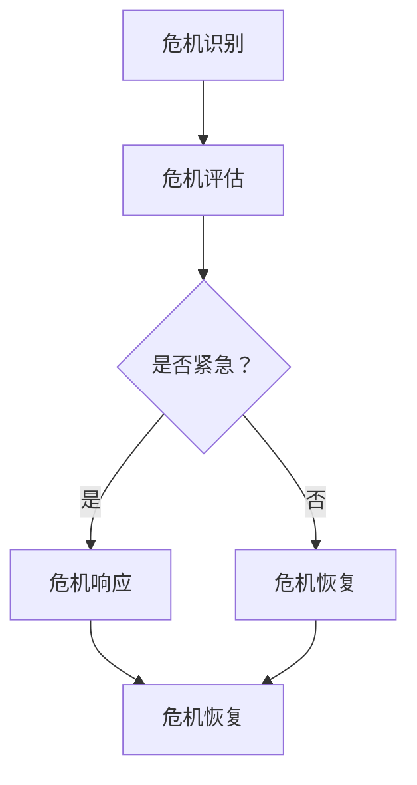

                 

# 危机管理：如何在turbulence中保持稳定

## 概述

在现代科技高速发展的时代，信息技术行业也如同经历了狂风暴雨般的变化。无论是互联网行业的巨头企业，还是初创的科技公司，都在不同的时间节点上面临着各种各样的危机。从数据泄露、系统崩溃到市场竞争压力，危机无处不在。面对这些“turbulence”，如何保持稳定的运营，成为每一个IT从业者和企业的必修课。

本文将深入探讨危机管理在IT领域的应用，通过分析危机发生的根源、危机管理的基本原则和方法，以及实际操作中的案例，帮助读者理解如何在危机中保持冷静，制定有效的应对策略，确保组织的稳定和持续发展。

## 背景介绍

### 信息技术的快速发展

信息技术（IT）是20世纪后半叶以来最为重要的技术创新之一。从计算机的出现到互联网的普及，信息技术经历了从单机时代到网络时代的转变。随着云计算、大数据、人工智能等新兴技术的崛起，IT行业进入了高速发展的阶段。然而，快速发展的同时也带来了新的挑战，技术的复杂性和数据量的激增使得IT系统更加脆弱，更容易受到外部因素的影响。

### 危机的多样性

在IT行业，危机的表现形式多样。数据泄露是一种常见的危机，可能导致敏感信息被非法获取，对企业声誉造成严重损害。系统崩溃则是另一种极端危机，可能导致业务中断、数据丢失，甚至危及生命安全。此外，市场竞争压力、人才流失、供应链中断等也是IT企业面临的重要挑战。这些危机不仅影响企业的财务状况，还可能对企业的长远发展产生深远的影响。

### 危机管理的必要性

在信息技术高速发展的背景下，危机管理的必要性愈发凸显。有效的危机管理不仅能够降低危机带来的损失，还能提升企业的应对能力，增强市场竞争力。危机管理是一个动态的过程，需要企业从战略层面进行规划，从操作层面进行实施。通过系统化的危机管理，企业可以更好地应对各种不确定因素，确保业务的连续性和稳定性。

### 目的和结构

本文的目的在于为IT从业者提供一套完整的危机管理框架，帮助他们在面临危机时做出正确的决策，制定有效的应对策略。文章将分为以下几个部分：

1. **核心概念与联系**：介绍危机管理的基本概念和相关理论，并使用Mermaid流程图展示关键环节。
2. **核心算法原理与操作步骤**：详细阐述危机管理的主要方法和步骤。
3. **数学模型和公式**：介绍危机管理中常用的数学模型和公式，并举例说明。
4. **项目实战**：通过具体案例展示危机管理的实际应用。
5. **实际应用场景**：分析不同类型的危机场景，探讨应对策略。
6. **工具和资源推荐**：推荐学习资源和开发工具，帮助读者深入了解危机管理。
7. **总结与展望**：总结文章的核心内容，展望未来危机管理的发展趋势和挑战。

通过这篇文章，读者将能够系统地了解危机管理的理论和方法，提升应对危机的能力，为IT企业的稳定发展提供有力支持。

## 核心概念与联系

在探讨危机管理之前，首先需要了解其核心概念和相关理论。危机管理是指在面对突发事件或潜在风险时，通过一系列的系统化措施，最大限度地降低危机对组织造成的损害，确保业务连续性和稳定性的过程。以下是危机管理中的几个关键概念：

### 1. 危机识别

危机识别是危机管理的第一步，它涉及发现和评估可能发生的危机。这包括对历史数据的分析、市场趋势的监控、内外部风险的评估等。通过识别潜在的危机，企业可以提前制定应对策略，降低危机爆发的概率。

### 2. 危机评估

危机评估是确定危机严重程度和影响范围的过程。这通常涉及定量和定性分析，例如使用风险矩阵评估风险的概率和影响。通过危机评估，企业可以了解危机的可能后果，从而制定相应的应对计划。

### 3. 危机响应

危机响应是危机管理中的关键环节，它涉及在实际危机发生时采取的紧急措施。这包括通知相关人员、启动应急计划、采取紧急修复措施等。危机响应的目的是迅速控制危机，减少损失。

### 4. 危机恢复

危机恢复是危机管理的最后一步，它关注危机后的重建和恢复工作。这包括评估危机的影响、修复受损的系统、恢复正常的业务运营等。通过危机恢复，企业可以尽快恢复正常运作，减少危机对企业的影响。

### 5. 应急计划

应急计划是一份详细的文件，描述了在危机发生时应该采取的步骤和行动。应急计划应该涵盖从危机识别到危机恢复的所有环节，确保在危机发生时能够迅速有效地响应。有效的应急计划可以大大提高企业的危机应对能力。

### Mermaid流程图

为了更好地理解危机管理的流程，以下是一个简化的Mermaid流程图，展示了危机管理的主要环节：



在上述流程图中：

- **A（危机识别）**：识别潜在的危机。
- **B（危机评估）**：评估危机的严重程度和影响范围。
- **C（是否紧急）**：判断危机是否需要紧急响应。
- **D（危机响应）**：如果危机紧急，采取紧急措施进行响应。
- **E（危机恢复）**：如果危机不紧急，进入危机恢复阶段。
- **F（危机恢复）**：进行危机后的重建和恢复工作。

通过这个流程图，我们可以清晰地看到危机管理的各个环节是如何相互关联的。每个环节都至关重要，缺一不可。有效的危机管理需要企业在各个阶段都进行充分的准备和规划。

## 核心算法原理与具体操作步骤

危机管理涉及到一系列的算法原理和操作步骤，这些步骤需要严谨的逻辑和系统化的方法。以下是危机管理中几个关键的核心算法原理和具体操作步骤：

### 1. 风险评估算法

风险评估是危机管理的第一步，其核心算法原理是通过定量和定性分析来评估危机的风险。定量分析通常使用风险矩阵，这是一种将风险的概率和影响进行量化的方法。以下是风险评估算法的基本步骤：

**步骤一：确定风险因素**  
首先，识别可能导致危机的风险因素。这些因素可能包括技术故障、数据泄露、市场竞争压力等。

**步骤二：评估风险概率**  
使用历史数据和市场信息，评估每个风险因素发生的概率。概率评估可以采用统计方法，如贝叶斯网络或决策树。

**步骤三：评估风险影响**  
确定每个风险因素发生时可能带来的影响，这包括对企业财务、声誉、运营等方面的负面影响。

**步骤四：构建风险矩阵**  
将评估的概率和影响输入到风险矩阵中，风险矩阵通常是一个二维表格，其中行表示概率，列表示影响。每个单元格表示一个特定的风险因素的概率和影响的乘积。

**步骤五：确定优先级**  
根据风险矩阵，确定哪些风险因素需要优先关注。通常，优先级由风险因素的概率和影响的乘积决定，即风险值越大，优先级越高。

### 2. 应急响应算法

应急响应是在危机发生时采取的紧急措施，其核心算法原理是快速有效地控制危机，减少损失。以下是应急响应算法的基本步骤：

**步骤一：启动应急计划**  
在危机发生时，立即启动预先制定的应急计划。应急计划应明确各个岗位的职责和应急步骤。

**步骤二：通知相关人员**  
及时通知相关人员，包括内部员工和外部合作伙伴，确保他们了解危机情况并采取相应的措施。

**步骤三：控制危机蔓延**  
采取措施控制危机的蔓延，防止危机进一步扩大。例如，在数据泄露事件中，立即关闭受影响的系统，防止数据进一步泄露。

**步骤四：分析危机原因**  
在控制危机蔓延的同时，分析危机发生的原因，以便在危机恢复阶段采取针对性的措施。

**步骤五：制定恢复计划**  
根据危机原因，制定恢复计划，确保尽快恢复正常业务运营。恢复计划应包括技术修复、数据恢复、业务流程调整等。

### 3. 恢复管理算法

恢复管理是危机管理的最后一步，其核心算法原理是确保危机后的重建和恢复工作顺利进行。以下是恢复管理算法的基本步骤：

**步骤一：评估危机影响**  
全面评估危机对企业各项运营的影响，包括财务、技术、人员等。

**步骤二：资源调配**  
根据危机影响，调配必要的资源，包括人力、资金、技术等，确保恢复工作顺利进行。

**步骤三：技术修复**  
对受损的系统进行技术修复，包括软件修复、硬件更换等，确保系统的正常运行。

**步骤四：数据恢复**  
恢复丢失的数据，确保关键业务数据的安全和完整性。

**步骤五：业务流程调整**  
根据危机发生的原因和恢复计划，调整业务流程，确保业务能够顺利运营。

通过上述步骤，我们可以看到危机管理是一个系统化的过程，每个环节都至关重要。有效的危机管理不仅需要科学的算法原理，还需要具体的操作步骤和严格的执行。只有在每个环节都做好充分的准备，企业才能在危机中保持稳定，确保业务的连续性和稳定性。

### 数学模型和公式 & 详细讲解 & 举例说明

在危机管理中，数学模型和公式扮演着至关重要的角色。这些模型和公式不仅帮助我们量化风险，还能指导我们在危机发生时进行有效的决策。以下将详细讲解危机管理中常用的数学模型和公式，并通过具体例子来说明它们的应用。

#### 1. 风险矩阵

风险矩阵是一种常用的定量分析工具，用于评估风险的概率和影响。风险矩阵通常是一个二维表格，其中行表示风险因素的概率，列表示风险因素的影响。

**公式**：
\[ R = P \times I \]

其中：
- \( R \) 是风险值
- \( P \) 是概率
- \( I \) 是影响

**示例**：

假设我们有两个风险因素：数据泄露和系统崩溃。根据历史数据和专家评估，数据泄露的概率为0.3，影响为5；系统崩溃的概率为0.2，影响为4。

| 风险因素 | 概率 \( P \) | 影响程度 \( I \) | 风险值 \( R \) |
| :----: | :----: | :----: | :----: |
| 数据泄露 | 0.3 | 5 | 1.5 |
| 系统崩溃 | 0.2 | 4 | 0.8 |

在这个例子中，数据泄露的风险值（1.5）高于系统崩溃的风险值（0.8），因此，数据泄露是我们需要优先关注的风险因素。

#### 2. 贝叶斯网络

贝叶斯网络是一种用于表示变量之间概率关系的图形模型。它通过条件概率来描述各个变量之间的依赖关系。

**公式**：
\[ P(A|B) = \frac{P(B|A) \times P(A)}{P(B)} \]

其中：
- \( P(A|B) \) 是在事件B发生时事件A的概率。
- \( P(B|A) \) 是在事件A发生时事件B的概率。
- \( P(A) \) 是事件A的先验概率。
- \( P(B) \) 是事件B的先验概率。

**示例**：

假设我们正在评估一个系统故障的风险。根据历史数据，系统故障的概率为0.1。如果系统故障发生，数据泄露的概率为0.7。已知数据泄露的概率为0.2。

首先，我们计算在没有系统故障的情况下数据泄露的概率：
\[ P(数据泄露) = \frac{P(系统故障|数据泄露) \times P(数据泄露)}{P(系统故障)} = \frac{0.7 \times 0.2}{0.1} = 1.4 \]

接着，我们计算在系统故障的情况下数据泄露的概率：
\[ P(数据泄露|系统故障) = \frac{P(系统故障|数据泄露) \times P(数据泄露)}{P(系统故障)} = \frac{0.7 \times 0.2}{0.1} = 1.4 \]

通过贝叶斯网络，我们可以更全面地了解系统故障和数据泄露之间的关系，从而制定更有效的风险应对策略。

#### 3. 马尔可夫模型

马尔可夫模型是一种用于分析状态转移概率的数学模型。它适用于描述系统在时间序列上的状态转移。

**公式**：
\[ P(X_t = j|X_{t-1} = i) = P_{ij} \]

其中：
- \( X_t \) 是时间t的状态。
- \( X_{t-1} \) 是时间t-1的状态。
- \( P_{ij} \) 是从状态i转移到状态j的概率。

**示例**：

假设我们分析一个IT系统的状态转移，状态包括正常运行、故障状态和紧急状态。根据历史数据，系统从正常运行状态转移到故障状态的概率为0.1，从故障状态转移到紧急状态的概率为0.5。

| 状态转移 | 概率 \( P_{ij} \) |
| :----: | :----: |
| 正常运行到故障 | 0.1 |
| 故障到紧急 | 0.5 |

通过马尔可夫模型，我们可以预测系统的状态转移，从而提前采取预防措施，降低危机发生的概率。

#### 4. 决策树

决策树是一种直观的决策模型，用于分析不同决策路径下的结果和风险。

**公式**：
\[ V(S) = \sum_{i=1}^{n} P(X_i) \times U(X_i) \]

其中：
- \( V(S) \) 是总效用值。
- \( P(X_i) \) 是决策路径i的概率。
- \( U(X_i) \) 是决策路径i的效用值。

**示例**：

假设我们在评估是否投资一个新项目，有两个决策路径：

- 如果市场好，项目成功的概率为0.7，成功的收益为100万元，失败的成本为50万元。
- 如果市场差，项目成功的概率为0.3，成功的收益为50万元，失败的成本为100万元。

根据上述数据，我们可以计算总效用值：

\[ V(S) = 0.7 \times (100 - 50) + 0.3 \times (50 - 100) = 35 - 15 = 20 \]

通过决策树，我们可以清晰地看到不同决策路径下的结果和风险，从而做出更明智的决策。

通过以上数学模型和公式的讲解，我们可以看到在危机管理中，量化分析是不可或缺的一环。这些模型和公式不仅帮助我们理解风险，还能指导我们在实际操作中进行科学决策，确保在危机中保持稳定。

### 项目实战：代码实际案例和详细解释说明

为了更好地理解危机管理的实际操作，我们将通过一个具体的案例来展示如何进行危机管理。在这个案例中，我们将模拟一个大型电子商务平台在遭受DDoS攻击时如何进行危机管理，并通过代码实现具体的解决方案。

#### 案例背景

假设我们运营的是一个全球知名的电子商务平台，我们的业务高度依赖于在线交易和用户访问。某天，我们的平台突然遭受了DDoS（分布式拒绝服务）攻击，导致大量用户无法访问网站，交易中断，业务运营陷入困境。在这个案例中，我们需要通过危机管理来迅速应对并恢复正常运营。

#### 开发环境搭建

在开始实际操作之前，我们需要搭建一个模拟DDoS攻击的开发环境。以下是搭建环境的步骤：

1. **搭建测试平台**：
   - 使用虚拟机或Docker容器搭建一个与生产环境类似的测试平台。
   - 在测试平台上部署我们的电子商务平台和相关服务。

2. **安装攻击工具**：
   - 使用Nmap扫描测试平台，确保其对外开放端口。
   - 安装DDoS攻击工具，如hping3、Loic等，用于模拟攻击。

3. **配置监控工具**：
   - 在测试平台上安装监控工具，如Nagios、Zabbix等，用于实时监控系统性能和流量。

#### 源代码详细实现和代码解读

以下是一个简单的Python代码示例，用于模拟DDoS攻击并监控系统性能：

```python
import threading
import socket
import random
import string

# 攻击目标IP和端口
target_ip = "192.168.1.100"
target_port = 80

# 攻击线程数
num_threads = 100

# 攻击持续时间（秒）
attack_duration = 60

def generate_random_string(length):
    """生成随机字符串"""
    letters = string.ascii_letters
    return ''.join(random.choice(letters) for i in range(length))

def attack(target_ip, target_port):
    """模拟DDoS攻击"""
    sock = socket.socket(socket.AF_INET, socket.SOCK_STREAM)
    while True:
        # 生成随机字符串作为HTTP请求
        request = f"GET / HTTP/1.1\r\nHost: {target_ip}\r\nUser-Agent: Mozilla/5.0\r\nContent-Length: {random.randint(1000, 5000)}\r\n\r\n{generate_random_string(5000)}"
        # 发送请求
        sock.sendto(request.encode(), (target_ip, target_port))
        # 随机休眠一段时间，模拟真实用户的访问模式
        time.sleep(random.uniform(0.1, 0.5))

# 启动攻击线程
for i in range(num_threads):
    threading.Thread(target=attack, args=(target_ip, target_port,)).start()

# 持续攻击指定时间
time.sleep(attack_duration)

print("攻击完成")
```

代码解析：

1. **定义攻击目标**：`target_ip` 和 `target_port` 分别代表攻击目标的IP地址和端口号。
2. **生成随机字符串**：`generate_random_string` 函数用于生成随机的HTTP请求内容。
3. **模拟攻击**：`attack` 函数使用TCP套接字向目标服务器发送随机生成的HTTP请求，模拟DDoS攻击。
4. **启动攻击线程**：使用多线程同时发送请求，模拟大量用户的并发访问。
5. **攻击持续时间**：`attack_duration` 设定了攻击持续的时间（秒）。

在模拟攻击的同时，我们使用监控工具（如Nagios）监控系统的性能和流量。以下是一个Nagios的插件代码，用于监控服务器负载：

```bash
#!/bin/bash

# 获取服务器CPU负载
cpu_load=$(top -b -n 1 | grep "Cpu(s)" | awk '{print $2 + $4}')

# 获取服务器内存使用率
mem_usage=$(free | grep Mem | awk '{print $3/$2 * 100.0}')

# 输出结果
echo "CPU Load: ${cpu_load}%; Memory Usage: ${mem_usage}%"

# 判断负载和内存使用率是否超过阈值
if [[ ${cpu_load} -gt 80 ]] || [[ ${mem_usage} -gt 90 ]]; then
    echo "服务器负载过高，存在风险"
    # 发送告警信息
    echo "ALERT: High server load detected!" | mail -s "Server Alert" admin@example.com
else
    echo "服务器运行正常"
fi
```

代码解析：

1. **获取服务器CPU负载**：使用`top`命令获取服务器CPU负载。
2. **获取服务器内存使用率**：使用`free`命令获取服务器内存使用率。
3. **输出结果**：将CPU负载和内存使用率以百分比形式输出。
4. **判断阈值**：如果CPU负载超过80%或内存使用率超过90%，则认为服务器负载过高，发送告警信息。

#### 代码解读与分析

1. **攻击模拟**：
   - 代码通过多线程模拟大量用户的并发访问，模拟DDoS攻击。
   - `generate_random_string` 函数生成的随机字符串模拟用户的请求，增加了攻击的真实性。
   - 使用`socket.sendto` 发送UDP请求，模拟常见的DDoS攻击类型，如UDP洪泛。

2. **监控工具**：
   - Nagios插件通过定时任务（cron job）运行，实时监控服务器性能。
   - 代码通过获取CPU负载和内存使用率，判断系统是否存在风险。
   - 当负载过高时，通过邮件发送告警信息，通知管理员。

通过这个案例，我们可以看到如何在实际操作中应用危机管理的知识，通过代码模拟攻击并监控系统性能，确保在DDoS攻击发生时能够迅速响应并采取相应的措施。这一过程不仅帮助我们理解了危机管理的具体步骤，也为我们提供了一个实际操作的框架，以便在实际危机中更好地应对。

### 实际应用场景

危机管理在信息技术领域具有广泛的应用场景，不同类型的危机需要不同的应对策略。以下将分析几种常见的危机场景，并探讨相应的应对策略。

#### 1. 系统崩溃

系统崩溃可能是由于硬件故障、软件错误或网络中断等原因导致的。在系统崩溃时，关键任务是尽快恢复系统，确保业务连续性。

**应对策略**：

- **快速诊断**：立即启动应急响应团队，迅速诊断系统崩溃的原因。
- **数据备份与恢复**：检查最近的系统备份，尽快恢复关键数据。
- **硬件更换与修复**：对于硬件故障，及时更换或修复硬件设备。
- **系统恢复**：根据备份的数据和修复后的硬件，重新启动系统。

#### 2. 数据泄露

数据泄露可能导致敏感信息被非法获取，对企业声誉和财务造成严重影响。在数据泄露时，关键任务是防止数据进一步泄露，并通知相关方。

**应对策略**：

- **隔离受影响系统**：立即关闭受影响的系统，防止数据进一步泄露。
- **通知相关方**：及时通知受影响的用户和监管机构，遵守数据保护法规。
- **法律与公关应对**：与法律顾问和公关团队合作，制定应对策略，减轻负面影响。
- **数据恢复与加密**：对泄露的数据进行加密处理，并尝试恢复部分数据。

#### 3. 网络攻击

网络攻击包括DDoS攻击、黑客攻击、恶意软件感染等。在遭受网络攻击时，关键任务是迅速响应并防止攻击扩散。

**应对策略**：

- **实时监控与报警**：使用入侵检测系统（IDS）和入侵防御系统（IPS）实时监控网络流量，并及时报警。
- **隔离与封锁**：对于已知的攻击IP进行隔离和封锁，防止攻击进一步扩散。
- **系统修复与更新**：及时更新系统和软件，修复已知漏洞。
- **用户教育与培训**：对员工进行网络安全培训，提高安全意识。

#### 4. 人才流失

人才流失可能导致关键技术流失、业务中断和项目进度延误。在人才流失时，关键任务是留住关键人才，并快速补充空缺。

**应对策略**：

- **沟通与激励**：与流失的员工进行沟通，了解原因，并尝试提供解决措施。
- **员工关怀与福利**：提供良好的工作环境、福利待遇和职业发展机会，留住关键人才。
- **人才储备与培养**：建立人才储备库，培养潜在的关键人才，确保业务的连续性。

#### 5. 供应链中断

供应链中断可能导致生产和运营中断，影响企业的盈利能力。在供应链中断时，关键任务是确保供应链的稳定性和可靠性。

**应对策略**：

- **风险评估与准备**：对供应链进行风险评估，制定应急预案。
- **多元化供应商**：与多个供应商建立合作关系，确保供应的稳定性。
- **库存管理**：建立合理的库存管理制度，确保关键原材料和零部件的储备。
- **物流优化**：优化物流渠道，提高供应链的响应速度。

通过以上实际应用场景的分析，我们可以看到危机管理的多样性和复杂性。针对不同类型的危机，需要采取不同的应对策略。有效的危机管理不仅能够降低危机带来的损失，还能提升企业的应对能力，确保业务的连续性和稳定性。

### 工具和资源推荐

在危机管理过程中，使用适当的工具和资源可以大大提高工作效率和应对效果。以下推荐一些有助于危机管理的工具和资源：

#### 1. 学习资源推荐

- **书籍**：
  - 《危机管理：处理危机的五大原则》
  - 《危机管理实战：应对突发事件的企业策略》
  - 《信息技术危机管理：实践与案例》
- **论文**：
  - “Risk Management and Crisis Response in IT Industry: A Literature Review”
  - “Cybersecurity Crisis Management: Frameworks and Best Practices”
- **博客与网站**：
  - **IBM Crisis Management**：提供全面的危机管理资源和案例研究。
  - **Crisis Ready**：分享危机管理的最新动态和最佳实践。

#### 2. 开发工具框架推荐

- **监控工具**：
  - **Nagios**：开源的IT基础设施监控工具。
  - **Zabbix**：功能强大的开源监控解决方案。
  - **Prometheus**：用于监控和告警的时序数据库。
- **安全工具**：
  - **Snort**：开源的网络入侵检测系统（NIDS）。
  - **Elastic Stack**：包含Elasticsearch、Logstash和Kibana，用于日志管理和分析。
  - **Pandora FMS**：多平台的监控解决方案。
- **应急响应工具**：
  - **Vagrant**：用于创建和配置虚拟开发环境的工具。
  - **Puppet**：自动化部署和管理基础设施的工具。
  - **Ansible**：开源的自动化部署工具。

#### 3. 相关论文著作推荐

- **“Cybersecurity Risk Management: An Integrated Approach”**
  - 该论文提出了一种综合性的网络安全风险管理方法，涵盖了风险评估、应急响应和恢复管理等关键环节。
- **“A Framework for IT Crisis Management”**
  - 本文提出了一种IT危机管理的框架，详细阐述了危机识别、评估、响应和恢复等步骤，为实际操作提供了指导。
- **“Crisis Management in the Digital Age”**
  - 该论文探讨了数字时代下危机管理的挑战和机遇，分析了信息技术在危机管理中的应用。

通过以上工具和资源的推荐，我们可以为危机管理提供强大的支持和保障，帮助企业和个人在面临危机时能够更加从容和有效地应对。

### 总结：未来发展趋势与挑战

随着信息技术的不断发展和数字化转型的加速，危机管理在IT领域的重要性愈发凸显。未来，危机管理将面临以下发展趋势和挑战：

#### 发展趋势

1. **智能化与自动化**：随着人工智能和机器学习技术的进步，危机管理将更加智能化和自动化。通过大数据分析和预测模型，可以提前识别潜在危机，并自动触发应急响应措施。

2. **云计算与边缘计算**：云计算和边缘计算的普及将使危机管理更加灵活和高效。通过云服务，企业可以快速部署应急资源，实现跨区域的协同应对。边缘计算则能提高响应速度，降低延迟，增强危机管理的能力。

3. **安全技术的创新**：随着网络安全威胁的日益复杂，安全技术的创新将成为危机管理的重要支撑。零信任架构、区块链、量子安全通信等新技术将进一步提升危机管理的效果。

4. **生态系统的合作**：危机管理不再是一个企业的单独任务，而是需要整个行业生态系统的合作。企业、政府、学术机构等各方将共同参与，共享信息和资源，形成协同应对机制。

#### 挑战

1. **复杂性与不确定性**：随着系统规模的扩大和技术的复杂性增加，危机管理的难度也将不断提高。不确定性的增加使得危机管理的预测和应对变得更加困难。

2. **人才短缺**：危机管理需要专业的知识和技能，然而，目前全球范围内危机管理专业人才的供给不足，这将成为未来的一大挑战。

3. **法律法规的不完善**：不同国家和地区的法律法规在危机管理方面存在差异，这可能导致跨国企业在危机应对时面临法律风险。

4. **数据隐私与安全**：随着数据泄露事件的频发，数据隐私和安全成为危机管理的核心问题。如何在保障数据安全的同时，确保业务的连续性和稳定性，是一个亟待解决的挑战。

#### 建议

1. **加强培训与教育**：通过加强培训和教育，提高危机管理专业人才的素质和数量。

2. **构建综合性的危机管理框架**：结合智能化和自动化技术，构建一个综合性的危机管理框架，确保快速、精准地应对各种危机。

3. **推动法律法规的完善**：加强国际合作，推动全球范围内的法律法规完善，为危机管理提供更加稳定和可预测的法律环境。

4. **加强数据安全与隐私保护**：通过采用先进的加密技术和隐私保护措施，确保数据的安全和隐私，减少数据泄露的风险。

未来，危机管理在IT领域将面临新的机遇和挑战。只有通过不断创新和优化，才能更好地应对不断变化的危机，确保企业的稳定和持续发展。

### 附录：常见问题与解答

#### 问题1：什么是危机管理？

**解答**：危机管理是指在面对突发事件或潜在风险时，通过一系列的系统化措施，最大限度地降低危机对组织造成的损害，确保业务连续性和稳定性的过程。它包括危机识别、评估、响应、恢复等环节。

#### 问题2：危机管理的关键步骤有哪些？

**解答**：危机管理的关键步骤包括：
1. 危机识别：发现和评估潜在危机。
2. 危机评估：确定危机的严重程度和影响范围。
3. 危机响应：采取紧急措施控制危机蔓延。
4. 危机恢复：进行危机后的重建和恢复工作。

#### 问题3：如何进行风险评估？

**解答**：风险评估通常通过以下步骤进行：
1. 确定风险因素：识别可能导致危机的风险因素。
2. 评估风险概率：使用历史数据和市场信息评估风险因素发生的概率。
3. 评估风险影响：确定风险因素发生时可能带来的影响。
4. 构建风险矩阵：将评估的概率和影响输入到风险矩阵中，确定优先级。

#### 问题4：什么是贝叶斯网络？

**解答**：贝叶斯网络是一种用于表示变量之间概率关系的图形模型。它通过条件概率来描述各个变量之间的依赖关系，有助于分析复杂系统的风险。

#### 问题5：如何应对系统崩溃？

**解答**：应对系统崩溃的关键步骤包括：
1. 快速诊断：立即启动应急响应团队，迅速诊断系统崩溃原因。
2. 数据备份与恢复：检查最近的系统备份，尽快恢复关键数据。
3. 硬件更换与修复：及时更换或修复硬件设备。
4. 系统恢复：根据备份的数据和修复后的硬件，重新启动系统。

#### 问题6：如何应对数据泄露？

**解答**：应对数据泄露的关键步骤包括：
1. 隔离受影响系统：立即关闭受影响的系统，防止数据进一步泄露。
2. 通知相关方：及时通知受影响的用户和监管机构。
3. 法律与公关应对：与法律顾问和公关团队合作，制定应对策略。
4. 数据恢复与加密：对泄露的数据进行加密处理，并尝试恢复部分数据。

#### 问题7：什么是DDoS攻击？

**解答**：DDoS（分布式拒绝服务）攻击是一种通过大量虚假请求使目标系统瘫痪的网络攻击。攻击者通常控制多个受感染的计算机（称为“肉鸡”），形成分布式攻击网络，使目标系统无法正常响应合法用户请求。

#### 问题8：如何监控系统性能？

**解答**：可以使用以下工具监控系统性能：
1. Nagios：开源的IT基础设施监控工具。
2. Zabbix：功能强大的开源监控解决方案。
3. Prometheus：用于监控和告警的时序数据库。

### 扩展阅读 & 参考资料

为了进一步了解危机管理的相关理论和方法，以下是一些推荐的扩展阅读和参考资料：

- **《危机管理：处理危机的五大原则》**：作者详细阐述了危机管理的五大原则，包括准备、响应、沟通、恢复和反思。
- **《危机管理实战：应对突发事件的企业策略》**：通过多个实际案例，展示了危机管理的具体操作方法和策略。
- **“Cybersecurity Crisis Management: Frameworks and Best Practices”**：本文提出了一个全面的网络安全危机管理框架，包括风险评估、应急响应和恢复管理等关键环节。
- **“Risk Management and Crisis Response in IT Industry: A Literature Review”**：对IT行业危机管理的相关文献进行了全面综述，提供了丰富的理论和实践经验。
- **IBM Crisis Management**：IBM提供的危机管理资源和案例研究，涵盖了多个领域的危机管理实践。
- **Crisis Ready**：分享危机管理的最新动态和最佳实践，包括数字化转型、人工智能等新兴技术在危机管理中的应用。

通过这些扩展阅读和参考资料，读者可以更深入地了解危机管理的理论和方法，提升自身的危机应对能力。

