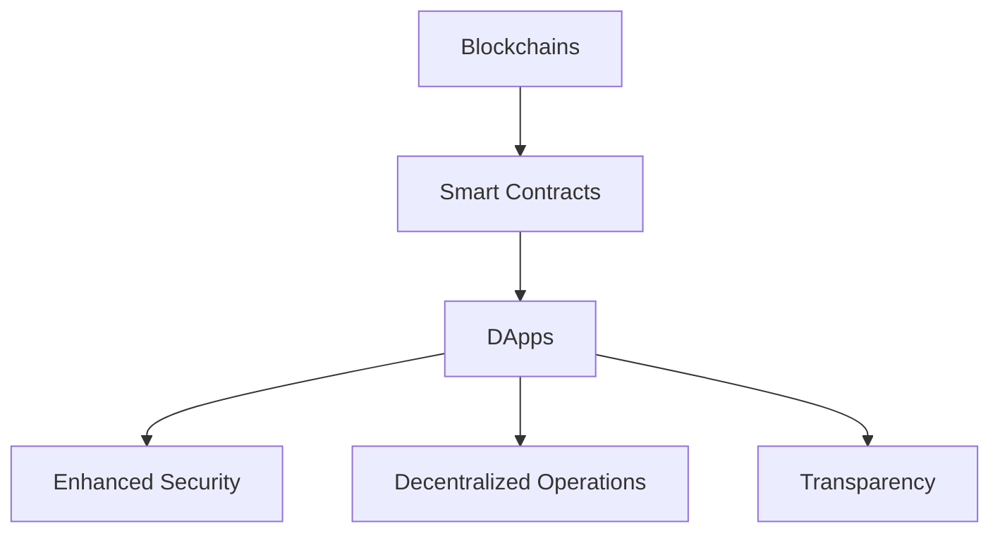

                 

### 背景介绍

去中心化应用（Decentralized Application，简称DApp）是区块链技术的重要组成部分，近年来在全球范围内迅速发展，引起了广泛关注。DApp的核心思想是通过区块链技术实现去中心化的应用，从而解决传统中心化应用中的信任问题、数据隐私问题以及运营效率问题。

区块链技术本身是一种分布式数据库技术，通过加密算法和共识机制保障数据的安全性和不可篡改性。DApp则是在这一基础上，利用区块链的智能合约功能，实现去中心化的应用开发。智能合约是一种运行在区块链上的程序，可以在满足特定条件时自动执行，无需第三方介入。

去中心化应用的出现，对传统互联网应用模式产生了深远的影响。传统的互联网应用通常依赖于中心化的服务提供商，如谷歌、亚马逊等。这些中心化平台虽然提供了便捷的服务，但同时也存在着数据隐私泄露、单点故障等问题。而去中心化应用通过区块链技术实现了数据的去中心化和安全存储，用户可以直接在区块链上进行交易和交互，减少了中介环节，提高了交易的透明度和安全性。

此外，DApp还在许多领域展现出了巨大的潜力。例如，在金融领域，DApp可以实现去中心化的金融交易，如数字货币的交易、借贷等，降低了交易成本，提高了交易效率。在供应链管理领域，DApp可以通过智能合约实现供应链的透明化和可追溯性，提高了供应链的效率和管理水平。在版权保护领域，DApp可以为版权持有者提供更加安全和高效的版权交易和管理服务。

总之，DApp作为一种新兴的去中心化应用模式，正在逐步改变着我们的生活方式和工作方式。了解DApp的开发与创业实践，对于我们把握未来技术发展的趋势具有重要意义。在接下来的内容中，我们将深入探讨DApp的核心概念、算法原理、开发工具和实际应用场景，帮助读者更好地理解和掌握DApp的开发和创业实践。

---

### Core Concepts & Connections

#### 1. Blockchains

At the heart of DApps lies the technology of blockchains. A blockchain is essentially a decentralized ledger that records transactions across multiple computers. These transactions are verified by network participants and then grouped into blocks, which are added to the blockchain in a linear, chronological order. Each block contains a timestamp, transaction data, and a cryptographic hash of the previous block, ensuring the integrity and security of the blockchain.

**Properties of Blockchains:**
- **Decentralization:** Unlike traditional centralized databases, blockchains do not rely on a single authority to maintain the ledger. Instead, the data is distributed across a network of computers, making it resistant to censorship and manipulation.
- **Immutability:** Once data is recorded on the blockchain, it cannot be altered or deleted, ensuring the long-term integrity of the data.
- **Transparency:** All transactions on the blockchain are publicly visible, providing a high level of transparency and accountability.

#### 2. Smart Contracts

Smart contracts are self-executing contracts with the terms of the agreement directly written into code. They run on a blockchain, and their execution is triggered by predefined conditions. These conditions can range from simple mathematical calculations to complex business logic.

**Core Features of Smart Contracts:**
- **Automated Execution:** Smart contracts execute automatically when the conditions specified in the contract are met, eliminating the need for intermediaries.
- **Tamper-Evidence:** Since the code is executed on the blockchain, it is tamper-proof and cannot be altered or deleted.
- **Cryptography:** Smart contracts use cryptographic techniques to ensure the security and privacy of the data.

#### 3. DApps

DApps are applications that run on a blockchain and utilize smart contracts for their functionality. They can range from simple applications to complex decentralized systems.

**Characteristics of DApps:**
- **Decentralized:** DApps operate independently of a central authority, reducing the risk of downtime or censorship.
- **Open Source:** Many DApps are open-source, allowing developers to inspect and modify the code, fostering innovation and community-driven development.
- **Interoperability:** DApps can interact with other DApps and blockchain platforms through standardized protocols, enabling the creation of complex decentralized ecosystems.

#### Connections between Concepts

- **Blockchains enable the creation and execution of smart contracts, which form the backbone of DApps.**
- **Smart contracts automate the execution of agreements, ensuring transparency and immutability.**
- **DApps leverage these features to create decentralized applications that offer enhanced security, privacy, and trustless interactions.**

#### Mermaid Flowchart

The following Mermaid flowchart illustrates the relationship between blockchains, smart contracts, and DApps:



### Core Algorithm Principles & Operational Steps

#### Overview of the DApp Development Process

Developing a DApp involves several key steps, from setting up the development environment to writing and deploying smart contracts. Below, we provide a detailed overview of each step.

#### 1. Development Environment Setup

The first step in developing a DApp is setting up the development environment. This includes installing the necessary software and tools required for blockchain development.

**Tools Required:**
- **Node.js:** Node.js is a JavaScript runtime that allows developers to write server-side code in JavaScript.
- **Truffle:** Truffle is a development framework for Ethereum that provides a development environment, testing framework, and asset pipeline.
- **Ganache:** Ganache is a personal blockchain for developers to run tests and experiments locally.
- **Ethereum Wallet:** An Ethereum wallet is necessary to interact with the Ethereum blockchain.

**Steps:**
1. Install Node.js from the official website (<https://nodejs.org/>).
2. Install Truffle using npm:
   ```
   npm install -g truffle
   ```
3. Install Ganache:
   ```
   truffle install --global ganache-cli
   ```
4. Create a new Truffle project:
   ```
   truffle init
   ```
5. Set up an Ethereum wallet using MetaMask (<https://metamask.io/>).

#### 2. Writing Smart Contracts

The next step is writing smart contracts, which are the core of any DApp. Smart contracts are written in Solidity, a contract-oriented, high-level language for implementing logic on the Ethereum blockchain.

**Steps:**
1. Navigate to the `contracts` folder in the Truffle project directory.
2. Write the smart contract code in Solidity. For example:
   ```solidity
   // SPDX-License-Identifier: MIT
   pragma solidity ^0.8.0;

   contract HelloWorld {
       string public message;

       constructor(string memory initMessage) {
           message = initMessage;
       }

       function updateMessage(string memory newMessage) public {
           message = newMessage;
       }
   }
   ```
3. Save the file with a `.sol` extension.

#### 3. Compiling Smart Contracts

Once the smart contract code is written, it needs to be compiled into bytecode that can be executed on the Ethereum virtual machine.

**Steps:**
1. Compile the smart contract using Truffle:
   ```
   truffle compile
   ```
2. Check the compiled bytecode in the `build/contracts` folder.

#### 4. Deploying Smart Contracts

After compiling the smart contract, it needs to be deployed to the Ethereum blockchain. This can be done using the Truffle console or directly with the Ethereum node.

**Steps:**
1. Start the local Ethereum node using Ganache:
   ```
   ganache-cli
   ```
2. Navigate to the Truffle project directory and open the Truffle console:
   ```
   truffle console
   ```
3. Deploy the smart contract using the following code:
   ```javascript
   const HelloWorld = artifacts.require("HelloWorld");
   const instance = await HelloWorld.new("Hello World!");
   ```
4. The deployed contract address will be displayed in the console.

#### 5. Interacting with Smart Contracts

Once the smart contract is deployed, it can be interacted with using transactions. These transactions are sent to the contract and can trigger specific functions.

**Steps:**
1. Call the contract functions using the Truffle console:
   ```javascript
   const hello = await instance.message.call();
   console.log(hello);
   ```
2. Update the contract state using transactions:
   ```javascript
   await instance.updateMessage("Hello, World!");
   ```

### Core Algorithm Principles & Operational Steps (Continued)

#### 6. Testing Smart Contracts

Testing smart contracts is a crucial step to ensure their correctness and reliability. Truffle provides a testing framework called Mocha along with Chai for assertions.

**Steps:**
1. Navigate to the `test` folder in the Truffle project directory.
2. Write test cases for the smart contract using Solidity or JavaScript. For example:
   ```javascript
   const { expect } = require("chai");
   const HelloWorld = artifacts.require("HelloWorld");

   describe("HelloWorld", function () {
       let instance;

       before(async function () {
           instance = await HelloWorld.new("Hello World!");
       });

       it("should return the initial message", async function () {
           const message = await instance.message.call();
           expect(message).to.equal("Hello World!");
       });

       it("should update the message", async function () {
           await instance.updateMessage("Hello, World!");
           const message = await instance.message.call();
           expect(message).to.equal("Hello, World!");
       });
   });
   ```
3. Run the tests using the following command:
   ```
   truffle test
   ```

#### 7. Deploying to the Mainnet

Deploying a smart contract to the mainnet requires more steps than deploying to a local Ethereum node. This includes acquiring Ether (ETH) for gas fees and using a decentralized exchange (DEX) or an intermediary to transfer funds.

**Steps:**
1. Acquire ETH for gas fees by purchasing it on a cryptocurrency exchange.
2. Use a DEX or intermediary service to transfer ETH to your Ethereum wallet.
3. Connect your Ethereum wallet to the Truffle console or development environment.
4. Deploy the smart contract to the mainnet using a transaction:
   ```javascript
   const HelloWorld = artifacts.require("HelloWorld");
   const instance = await HelloWorld.new("Hello World!", { from: account, gas: 1000000 });
   ```

#### Conclusion

Developing a DApp involves several key steps, from setting up the development environment to deploying and interacting with smart contracts. Understanding these steps and their underlying principles is essential for building robust and secure DApps. In the next section, we will delve into the mathematical models and formulas used in blockchain technology and provide detailed explanations and examples to deepen your understanding.

---

### Mathematical Models and Formulas: Detailed Explanation and Example

Blockchain technology relies on complex mathematical models and algorithms to ensure security, decentralization, and consensus among network participants. In this section, we will explore some of the key mathematical models and formulas used in blockchain technology, providing detailed explanations and examples to enhance your understanding.

#### 1. Cryptographic Hash Function

A cryptographic hash function is a fundamental building block of blockchain technology. It takes an input (message) and produces a fixed-size string of characters, which is typically a hash value. The hash value is unique to the input message, meaning even a small change in the input will produce a significantly different hash value.

**Example:**
Let's consider the SHA-256 hash function, which is widely used in blockchain technology. The SHA-256 hash function takes a message of any length and produces a 256-bit hash value.

**Example Calculation:**
```plaintext
Message: "Hello, World!"
Hash Value: 2cf24dba5fb0a30e26e83b2ac5b9e29e1b161e5c1fa7425e73043362938b9824
```

**Properties:**
- **Collision Resistance:** It is highly unlikely for two different inputs to produce the same hash value.
- **Deterministic:** Given the same input, the hash function will always produce the same output.

#### 2. Digital Signature

A digital signature is a cryptographic technique that provides authenticity and integrity to a message. It ensures that the message has not been altered during transmission and that it originated from a specific sender.

**Example:**
Let's consider the RSA algorithm, which is commonly used for digital signatures.

**Steps:**
1. **Key Generation:** Generate a public-private key pair using the RSA algorithm.
2. **Signing:** The sender signs the message using their private key, creating a digital signature.
3. **Verification:** The recipient verifies the signature using the sender's public key.

**Example Calculation:**
```plaintext
Message: "Hello, World!"
Private Key: (d, n)
Public Key: (e, n)
Digital Signature: s = (hash(m) ^ d) mod n
```

**Properties:**
- **Non-Repudiation:** The sender cannot deny sending the message since the private key is known only to the sender.
- **Integrity:** The message has not been altered during transmission, as any change in the message will result in a different signature.

#### 3. Consensus Algorithm

Consensus algorithms are used to achieve agreement among network participants in a decentralized system. One of the most widely used consensus algorithms in blockchain technology is Proof of Work (PoW).

**Proof of Work (PoW):**
- **Miners:** Network participants who validate transactions and create new blocks.
- **Hashing:** Miners compute a hash value for a block, aiming to find a value that meets specific criteria (e.g., below a certain target value).
- **Difficulty Adjustment:** The difficulty of finding a valid hash value is adjusted to maintain a constant block generation rate.

**Example:**
Let's consider the difficulty adjustment mechanism in Bitcoin's PoW algorithm.

**Steps:**
1. **Initial Difficulty:** The difficulty is set based on the expected block generation rate.
2. **Current Block Time:** Measure the average time taken to generate the current block.
3. **Adjustment Formula:** Adjust the difficulty based on the current block time and the expected block generation time.

**Example Calculation:**
```plaintext
Initial Difficulty: D
Current Block Time: T
Target Block Time: T_target
Adjusted Difficulty: D' = D / (T / T_target)
```

**Properties:**
- **Decentralization:** PoW requires network participants to solve computational puzzles, ensuring no single entity can control the network.
- **Security:** The difficulty adjustment mechanism ensures that the network remains secure and resistant to attacks.

#### 4. Merkle Tree

A Merkle tree is a data structure used to efficiently verify the integrity of data in a blockchain. It is used to create a Merkle root, which is a unique hash value representing the entire data set.

**Example:**
Let's consider a simple Merkle tree with four leaves.

```plaintext
Leaves: A, B, C, D
Merkle Tree:
    A B
   / \
  C D
Merkle Root: hash(A B) ^ hash(C D)
```

**Properties:**
- **Efficiency:** Merkle trees allow for efficient verification of individual data elements without needing to download the entire data set.
- **Security:** The unique Merkle root ensures that even a small change in the data will result in a completely different root value.

In summary, understanding the mathematical models and formulas used in blockchain technology is crucial for building secure and efficient decentralized systems. The cryptographic hash function, digital signature, consensus algorithm, and Merkle tree are essential components that ensure the integrity, security, and decentralization of blockchain technology. In the next section, we will delve into a real-world project case study to showcase the practical implementation of these concepts in a DApp.

---

### 项目实战：代码实际案例和详细解释说明

在本节中，我们将通过一个实际案例——一个简单的去中心化投票DApp，来展示如何编写和部署一个DApp。这个案例将涉及从开发环境搭建到智能合约编写、编译、部署和交互的全过程。

#### 1. 开发环境搭建

首先，确保已经安装了Node.js和Ganache。如果尚未安装，请按照以下步骤操作：

- 安装Node.js：
  ```bash
  # 在命令行中运行以下命令
  curl -fsSL https://deb.nodesource.com/setup_14.x | bash -
  sudo apt-get install -y nodejs
  ```

- 安装Ganache：
  ```bash
  npm install -g ganache-cli
  ```

接下来，创建一个新的文件夹并初始化一个新的Truffle项目：

```bash
mkdir voting-dapp
cd voting-dapp
truffle init
```

#### 2. 智能合约编写

在`contracts`文件夹中，编写一个名为`Voting.sol`的智能合约。以下是一个简单的投票合约示例：

```solidity
// SPDX-License-Identifier: MIT
pragma solidity ^0.8.0;

contract Voting {
    mapping(address => bool) public hasVoted;
    string[] public candidates;

    constructor(string[] memory initCandidates) {
        candidates = initCandidates;
    }

    function vote(string memory candidate) public {
        require(!hasVoted[msg.sender], "You have already voted.");
        require(arrayContains(candidates, candidate), "Invalid candidate.");
        hasVoted[msg.sender] = true;
        emit Voted(msg.sender, candidate);
    }

    function getCandidates() public view returns (string[] memory) {
        return candidates;
    }

    function arrayContains(string[] memory arr, string memory elem) private view returns (bool) {
        for (uint256 i = 0; i < arr.length; i++) {
            if (keccak256(bytes(arr[i])) == keccak256(bytes(elem))) {
                return true;
            }
        }
        return false;
    }

    event Voted(address voter, string candidate);
}
```

#### 3. 智能合约编译

在Truffle项目中，编译智能合约非常简单。首先确保已经启动了Ganache节点：

```bash
ganache-cli
```

然后，在项目目录中运行以下命令以编译智能合约：

```bash
truffle compile
```

编译后，你可以在`build/contracts`文件夹中找到编译后的智能合约文件。

#### 4. 部署智能合约

在Truffle项目中部署智能合约也很简单。在Truffle项目目录中，打开终端并运行以下命令：

```bash
truffle migrate --network local
```

这个命令将使用本地Ganache节点来部署智能合约。部署成功后，你可以在Truffle控制台中查看智能合约的地址：

```bash
truffle console
```

#### 5. 与智能合约交互

部署智能合约后，我们可以使用Truffle控制台与合约进行交互。以下是几个示例：

**查看候选人和投票：**

```javascript
const Voting = artifacts.require("Voting");
const voting = await Voting.at("0x..."); // 替换为部署的合约地址

// 获取候选人
const candidates = await voting.candidates();
console.log(candidates);

// 查看是否有人投票
const hasVoted = await voting.hasVoted.call(account);
console.log(hasVoted);
```

**投票：**

```javascript
// 创建投票事件
await voting.vote("Alice");

// 查看投票结果
const result = await voting.hasVoted.call(account);
console.log(result);
```

#### 6. 代码解读与分析

**Voting合约的核心功能包括：**

- `hasVoted`：一个映射，用于记录哪个账户已经投票。
- `candidates`：一个字符串数组，用于存储候选人名字。
- `vote`：一个函数，允许用户投票。
- `arrayContains`：一个私有辅助函数，用于检查候选人列表中是否包含特定的候选人。
- `Voted`：一个事件，用于通知网络中的其他参与者有人投票。

**合约的安全性分析：**

- `vote`函数中使用了`require`语句来检查用户是否已经投票以及候选人是否有效，从而防止恶意投票。
- `arrayContains`函数使用keccak256哈希函数来比较字符串，这是以太坊上标准的字符串比较方法。

**合约的优化点：**

- 可以考虑使用`stringToBytes32`函数将字符串转换为32字节的字节数组，以提高存储效率。
- 如果候选人数较多，可以考虑使用映射数组来存储候选人及其投票数，以简化逻辑和降低存储成本。

通过这个实际案例，读者可以了解到如何从零开始编写、编译、部署和交互一个去中心化投票DApp。在接下来的内容中，我们将讨论DApp的实际应用场景和工具与资源推荐，帮助读者进一步深入探索DApp的世界。

---

### 实际应用场景

去中心化应用（DApp）在众多领域展现出了巨大的潜力，以下是一些典型的应用场景：

#### 1. 金融领域

在金融领域，DApp被广泛应用于去中心化的金融交易、数字货币交易、去中心化金融（DeFi）平台以及智能投资组合管理。DApp可以提供安全、透明的交易环境，降低交易成本，提高交易效率。例如，去中心化交易平台如0x Protocol和Kyber Network允许用户直接在区块链上进行代币交换，而无需依赖中心化的交易所。DeFi平台如Aave和Compound提供去中心化的借贷和存款服务，用户可以轻松地借贷和投资数字资产。

#### 2. 物流和供应链管理

DApp在物流和供应链管理领域同样具有巨大潜力。通过智能合约和区块链技术，可以实现供应链的透明化和可追溯性。例如，供应链管理平台如Provenance和VeChain可以确保产品从生产到最终交付的每一个环节都被记录在区块链上，从而提高供应链的透明度和可信度。这有助于减少欺诈行为、提高产品质量，并增强消费者的信任。

#### 3. 医疗保健

在医疗保健领域，DApp可以用于医疗记录的管理、药物供应链的追踪以及保险索赔处理。例如，患者可以使用DApp来存储和管理自己的医疗记录，确保这些记录的安全性和隐私性。同时，DApp可以用于跟踪药物的来源和批次，确保药品的真实性和质量。此外，保险索赔可以通过智能合约自动处理，减少人为错误和欺诈行为。

#### 4. 内容创作与版权保护

DApp在内容创作与版权保护领域也发挥了重要作用。创作者可以使用DApp来发行数字作品，并通过区块链技术确保作品的所有权和版权。例如，平台如Funcode和Everipedia允许创作者直接在区块链上发布和销售内容，确保内容不被篡改且所有权清晰。此外，智能合约可以自动执行版权许可和版税分配，简化了版权管理的流程。

#### 5. 游戏和娱乐

在游戏和娱乐领域，DApp提供了一种全新的去中心化游戏体验。玩家可以在DApp中购买、拥有和交易游戏资产，这些资产是真正的区块链资产，而非中心化服务器上的虚拟物品。例如，平台如Axie Infinity允许玩家购买、繁殖和战斗虚拟宠物，并将这些宠物作为真正的NFT（非同质化代币）进行交易。这种模式不仅增加了游戏的乐趣，也为玩家创造了新的经济机会。

#### 6. 社交网络

DApp在社交网络领域也有新的应用前景。通过DApp，用户可以创建去中心化的社交网络，使得内容创作和收益分配更加公平和透明。例如，平台如Steemit和MEDIUM允许用户发布内容并获得代币奖励，这些代币可以在区块链上进行交易。这种模式鼓励用户创造高质量的内容，同时也为创作者提供了直接的收益来源。

#### 7. 身份验证与投票

DApp在身份验证和投票领域也具有巨大潜力。通过区块链技术，可以实现去中心化的身份验证和投票系统，确保投票的隐私性和安全性。例如，平台如GovernanceDAO和Sovrin提供去中心化的身份验证服务，而平台如MolochDAO和ChainLink允许用户参与投票，决定组织的方向和资金分配。

总之，DApp在金融、物流、医疗、版权、游戏、社交网络和投票等多个领域都有广泛的应用。随着区块链技术的不断成熟和普及，DApp的应用场景将继续扩大，为各个行业带来创新和变革。

### 工具和资源推荐

#### 1. 学习资源推荐

**书籍：**
- **《区块链革命》**（"Blockchain Revolution"）by Don Tapscott and Alex Tapscott
- **《智能合约：以太坊开发指南》**（"Smart Contracts: The Ultimate Guide to Building Decentralized Applications on the Ethereum Blockchain"）by Alex Garden
- **《区块链应用实战》**（"Building Blockchain Apps"）by David Meltzer and William M. McCoy

**论文：**
- **“Bitcoin: A Peer-to-Peer Electronic Cash System”** by Satoshi Nakamoto
- **“Ethereum: The World Computer”** by Gavin Andresen
- **“Consensus in Blockchain Systems”** by Yaniv Altshuler, Noam Licht and Amos Fiat

**博客：**
- **Ethereum官方博客**（<https://blog.ethereum.org/>）
- **Consensys开发者博客**（<https://consensys.github.io/>）
- **Blockchain.com博客**（<https://blog.blockchain.com/>）

**网站：**
- **Ethereum官网**（<https://ethereum.org/>）
- **Truffle官网**（<https://www.trufflesuite.com/>）
- **Ganache官网**（<https://www.ganache.io/>）

#### 2. 开发工具框架推荐

**开发框架：**
- **Truffle Suite**：一个完整的开发环境，包括智能合约编译、部署和测试工具。
- **Hardhat**：一个开源的本地以太坊开发环境，提供丰富的调试和优化功能。
- **OpenZeppelin**：一个提供安全性和可复用性的智能合约库，包括ERC20、ERC721等标准合约。

**开发工具：**
- **Web3.js**：一个JavaScript库，用于与以太坊区块链交互。
- **MetaMask**：一个浏览器插件，用于管理以太坊钱包和进行区块链操作。
- **Hardhat Node**：一个用于本地以太坊节点的工具，支持智能合约的本地开发和测试。

**测试工具：**
- **Mocha + Chai**：用于编写和运行智能合约测试的框架。
- **Hardhat Testing**：一个基于Hardhat的测试库，提供更高级的测试功能。

**IDE插件：**
- **Remix IDE**：一个基于Web的智能合约编辑器，提供编译、部署和调试功能。
- **Visual Studio Code + Truffle插件**：一个强大的智能合约开发环境，提供代码高亮、调试和智能合约部署等功能。

#### 3. 相关论文著作推荐

**论文：**
- **“Proof of Stake”** by David Chaum
- **“Cryptocurrencies and Their Unique Characteristics”** by Albert Wenger
- **“The Economics of Cryptocurrency Markets”** by Tuomas Sandholm

**著作：**
- **《智能合约设计模式》**（"Smart Contract Design Patterns"）by Dan Kraft and Nick Johnson
- **《区块链技术指南》**（"Blockchain: Blueprint for a New Economy"）by Melanie Swan
- **《区块链革命：如何利用区块链技术重塑行业、企业和个人》**（"Blockchain Revolution: How the Technology Behind Bitcoin Is Changing Money, Business, and the World"）by Don Tapscott and Alex Tapscott

通过上述资源和工具的推荐，开发者可以更深入地了解区块链技术和DApp开发的各个方面，从而在实际项目中应用这些知识，推动区块链技术的发展和应用。

### 总结：未来发展趋势与挑战

去中心化应用（DApp）作为区块链技术的核心组成部分，正逐步改变着各个行业的运作模式。在未来的发展中，DApp有望在更广泛的领域实现去中心化，推动社会向更加透明、高效和可信的方向发展。

#### 未来发展趋势

1. **技术成熟与普及**：随着区块链技术的不断演进，DApp的开发将变得更加简便和高效。智能合约语言的标准化和工具的优化，将使得更多开发者能够参与到DApp的开发中来。

2. **跨链协作**：不同区块链之间的互操作性将进一步提升，通过跨链技术，DApp可以实现跨平台的资源整合和功能扩展，打造更加复杂的去中心化生态系统。

3. **商业模式的创新**：DApp将为各行业带来全新的商业模式，例如去中心化的金融、供应链管理、版权保护等。这些创新将提高行业的效率，降低交易成本，提升用户体验。

4. **社会治理的变革**：去中心化的投票和治理系统有望在公共领域发挥作用，提高决策过程的透明度和公正性，增强公民参与和监督的能力。

5. **隐私保护与安全性**：随着隐私保护技术的进步，DApp将能够在保障用户隐私的同时，提供更加安全的服务。例如，零知识证明和同态加密等技术将被广泛应用。

#### 挑战

1. **技术难题**：尽管区块链技术在去中心化和安全性方面具有显著优势，但在性能、可扩展性和互操作性等方面仍面临挑战。如何提高交易速度和降低交易成本，是DApp发展的关键问题。

2. **法律法规的不确定性**：DApp涉及金融、版权等多个领域，而相关法律法规尚未完善，这给DApp的发展带来了不确定性。如何在遵守法律法规的同时，推动技术创新，是亟待解决的问题。

3. **安全威胁**：随着DApp的普及，黑客攻击和安全漏洞的风险也在增加。如何提高智能合约的安全性，防范各种形式的攻击，是DApp开发者面临的重要挑战。

4. **用户接受度**：尽管区块链技术具有巨大潜力，但公众对其认知和接受度仍较低。如何提高用户对DApp的信任，增强用户使用的积极性，是DApp推广的关键。

总之，DApp的未来充满机遇与挑战。通过持续的技术创新和跨领域的合作，我们有理由相信，DApp将在未来发挥更加重要的作用，推动社会进步和变革。

### 附录：常见问题与解答

在DApp的开发和创业实践中，可能会遇到一些常见问题。以下是一些常见问题及其解答，帮助您更好地理解和解决这些问题。

#### 1. 什么是DApp？

DApp（去中心化应用）是运行在区块链上的应用，其核心特点是去中心化、不可篡改和高度透明。DApp通过智能合约实现其功能，用户可以直接在区块链上进行操作和交互，无需依赖中心化服务器。

#### 2. DApp与传统互联网应用有何不同？

DApp与传统互联网应用的最大区别在于其去中心化结构。传统应用依赖于中心化服务器进行数据处理和存储，而DApp则通过区块链技术实现数据的分布式存储和智能合约的自动化执行，从而提高了数据的安全性和透明度。

#### 3. 如何搭建DApp的开发环境？

搭建DApp开发环境通常包括以下步骤：
1. 安装Node.js。
2. 安装Truffle和Ganache。
3. 使用Truffle创建一个新的DApp项目。
4. 安装必要的开发工具和库。

#### 4. 什么是智能合约？

智能合约是一种运行在区块链上的计算机程序，其代码被永久性地存储在区块链上。智能合约可以在满足特定条件时自动执行，无需第三方介入。

#### 5. DApp开发中如何处理交易费用？

在DApp开发中，交易费用（如以太坊的气体费用）是一个关键问题。通常，开发者可以通过优化智能合约代码和提高区块链网络效率来降低交易费用。此外，可以使用去中心化交换（DEX）来减少交易费用。

#### 6. DApp的安全问题如何解决？

DApp的安全问题可以通过以下措施解决：
1. 使用安全性的智能合约编程语言，如Solidity。
2. 进行全面的安全审计和测试。
3. 实施防范常见攻击（如重入攻击、智能合约漏洞等）的代码保护措施。
4. 使用区块链浏览器和工具监控智能合约的执行情况。

#### 7. 如何测试DApp？

测试DApp通常包括以下步骤：
1. 使用单元测试和集成测试验证智能合约的正确性。
2. 在本地环境中使用测试网络（如Ganache）进行测试。
3. 部署到主网前，进行全面的性能和安全性测试。

#### 8. DApp如何与外部系统集成？

DApp可以通过以下方式与外部系统集成：
1. 使用Web3.js等库与外部系统进行交互。
2. 通过API与外部服务进行数据交换。
3. 使用跨链技术与其他区块链平台进行互操作。

#### 9. DApp的商业模式如何设计？

DApp的商业模式设计需要考虑以下因素：
1. 确定目标用户和需求。
2. 设计去中心化的支付方式。
3. 提供持续的用户价值和激励。
4. 考虑代币经济学和通证激励。

通过上述常见问题与解答，开发者可以更好地理解DApp的开发和创业实践，并解决实际操作中遇到的问题。

### 扩展阅读与参考资料

对于希望进一步深入了解去中心化应用（DApp）的开发与创业实践，以下资源将为您提供更多的信息和指导：

#### 1. 书籍推荐

- **《区块链技术指南》**：作者Melanie Swan，全面介绍了区块链的基础知识、技术原理和应用场景。
- **《智能合约：以太坊开发指南》**：作者Alex Garden，深入讲解了智能合约的设计与开发。
- **《区块链革命》**：作者Don Tapscott和Alex Tapscott，探讨了区块链如何改变经济和社会。

#### 2. 论文推荐

- **“Bitcoin: A Peer-to-Peer Electronic Cash System”**：Satoshi Nakamoto的经典论文，介绍了比特币的工作原理。
- **“Proof of Stake”**：David Chaum关于权益证明机制的论文。
- **“Cryptocurrencies and Their Unique Characteristics”**：Albert Wenger关于数字货币特性的论文。

#### 3. 开源项目与工具

- **Truffle Suite**：一个完整的开发环境，用于智能合约的编译、部署和测试。
- **OpenZeppelin**：提供安全性和可复用性的智能合约库。
- **Ethereum**：以太坊官方文档和资源库，提供详细的智能合约开发指南。
- **Ganache**：一个用于本地以太坊节点的工具，支持智能合约的本地开发和测试。

#### 4. 在线课程与教程

- **Coursera上的“Blockchain and cryptocurrency technologies”**：由柏林自由大学提供，涵盖了区块链技术的基础知识。
- **edX上的“Blockchain: Foundations and Applications”**：由麻省理工学院提供，介绍了区块链技术的基本原理和应用。
- **Udemy上的“Build DApps on Ethereum: The Complete Developer's Guide”**：详细介绍了如何在以太坊上构建去中心化应用。

#### 5. 博客与网站

- **Ethereum官方博客**：提供最新的以太坊开发资讯和文档。
- **Blockchain.com博客**：涵盖区块链技术、加密货币和市场分析。
- **Consensys开发者博客**：提供关于智能合约和区块链技术的深度文章。

通过这些扩展阅读与参考资料，您将能够更全面地了解DApp的开发与创业实践，为您的学习和项目开发提供有力支持。

