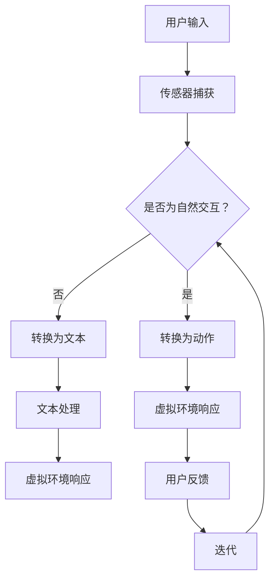

                 

# 双向交互与VR/AR技术的应用

## 摘要

本文将探讨双向交互技术在虚拟现实（VR）和增强现实（AR）中的应用，旨在帮助读者理解这些技术如何改变用户体验，以及它们背后的核心原理。我们将首先介绍双向交互的概念，然后详细探讨VR/AR技术的原理、实现以及具体应用场景。通过本文的阅读，读者将获得对VR/AR技术与双向交互结合的深刻理解，并能够了解未来这一领域的发展趋势和面临的挑战。

## 1. 背景介绍

虚拟现实（VR）和增强现实（AR）技术的发展，为人类提供了前所未有的沉浸式体验。它们不仅改变了游戏、娱乐和教育的面貌，还在医疗、建筑、设计等领域展现出巨大的潜力。然而，这些技术的成功离不开双向交互的支持。双向交互指的是用户与虚拟环境或现实环境之间进行的实时、有意义的交互。

在传统的人机交互中，用户往往只能通过点击、滑动等方式与系统进行单向操作，而双向交互则允许用户在虚拟或增强的现实环境中实现更为自然和丰富的互动。这种交互方式能够模拟人类的感官和行为，提高用户的参与度和沉浸感。

VR和AR技术的进步，离不开计算机图形学、传感器技术和人工智能的发展。计算机图形学为VR/AR提供了强大的图像渲染能力，传感器技术则使得虚拟环境能够感知用户的位置和动作，而人工智能则为这些技术带来了智能化的互动能力。

本文将首先介绍双向交互的概念和原理，然后深入探讨VR/AR技术的核心原理和实现方法，最后分析这些技术在现实中的应用场景，以及未来可能面临的挑战和机遇。

### 2. 核心概念与联系

#### 2.1 双向交互的概念

双向交互是一种用户与计算机系统之间进行的双向沟通和互动方式。在这种交互模式中，用户可以通过自然的方式，如手势、语音和表情等，与计算机系统进行交流，并获得即时的反馈。双向交互的核心在于其即时性和互动性，它能够模拟人类的交流模式，提高用户的参与感和体验质量。

#### 2.2 VR/AR技术的核心原理

虚拟现实（VR）通过计算机生成的三维模拟环境，让用户沉浸其中。它主要依赖于头戴式显示器（HMD）、定位追踪器和手柄等设备，以实现用户的全身沉浸体验。而增强现实（AR）则通过在现实环境中叠加虚拟元素，增强用户的感知体验。AR通常使用智能手机或平板电脑作为显示设备，通过摄像头捕捉现实环境，并在屏幕上叠加虚拟图像。

#### 2.3 双向交互与VR/AR技术的联系

双向交互是VR/AR技术实现沉浸式体验的关键因素之一。在VR环境中，用户需要通过手势、语音等自然方式与虚拟环境互动，而AR则更多依赖于摄像头和传感器来捕捉用户的行为和环境信息。双向交互不仅提升了用户的沉浸感和互动性，还为VR/AR应用带来了更多的可能性。

#### 2.4 Mermaid流程图

为了更好地展示双向交互与VR/AR技术的关系，我们可以使用Mermaid流程图来描述其核心步骤和组件。



在上面的流程图中，用户输入通过传感器被捕获，然后判断是否为自然交互。如果是，则直接转换为动作；如果不是，则转换为文本。接下来，虚拟环境根据这些输入进行响应，并生成反馈，最终形成闭环，实现双向交互。

### 3. 核心算法原理 & 具体操作步骤

#### 3.1 VR中的核心算法

在VR技术中，核心算法主要包括图像渲染、空间定位和传感器融合。图像渲染算法负责生成高质量的3D图像，使虚拟环境尽可能真实地呈现给用户。常见的渲染算法包括光线追踪、基于物理的渲染（PBR）和全场景渲染（FSR）等。

空间定位算法则用于确定用户在虚拟环境中的位置和朝向。常用的定位技术包括惯性测量单元（IMU）、电磁波定位（如SLAM）和光学定位（如光流法）等。

传感器融合算法是将不同传感器捕获的数据进行综合处理，以提高定位和交互的准确性。例如，将IMU数据与视觉数据融合，可以更准确地跟踪用户的位置和动作。

具体操作步骤如下：

1. 用户佩戴VR设备，传感器开始工作。
2. 传感器捕获用户的位置和动作数据。
3. 数据传输到计算机进行处理。
4. 计算机运行图像渲染算法，生成虚拟环境的图像。
5. 图像通过VR设备显示给用户。
6. 用户与虚拟环境进行交互，生成新的输入数据。
7. 重复步骤4-6，实现实时交互。

#### 3.2 AR中的核心算法

在AR技术中，核心算法主要包括图像识别、实时跟踪和虚拟图像叠加。图像识别算法用于识别现实环境中的特定对象或场景，如人脸识别、文字识别等。

实时跟踪算法则用于跟踪这些对象或场景的位置和朝向，以实现虚拟图像的准确叠加。常见的跟踪算法包括基于特征点的跟踪、基于模板匹配的跟踪和基于深度学习的跟踪等。

虚拟图像叠加算法是将生成的虚拟图像叠加到现实环境中，以增强用户的感知体验。具体操作步骤如下：

1. 用户使用AR设备捕捉现实环境的图像。
2. 计算机运行图像识别算法，识别出特定对象或场景。
3. 计算机运行实时跟踪算法，跟踪这些对象或场景的位置和朝向。
4. 计算机生成虚拟图像，并将其叠加到现实环境中。
5. 虚拟图像通过AR设备显示给用户。
6. 用户与虚拟图像进行交互，生成新的输入数据。
7. 重复步骤4-6，实现实时交互。

#### 3.3 双向交互的实现

双向交互的实现依赖于传感器技术、计算机图形学和人工智能。传感器技术用于捕获用户的输入，计算机图形学用于生成虚拟环境和图像，而人工智能则用于处理和分析这些输入，以实现智能化的互动。

具体实现步骤如下：

1. 用户通过传感器输入（如手势、语音等）。
2. 传感器数据传输到计算机进行处理。
3. 计算机运行图像识别和跟踪算法，识别出用户的动作和环境信息。
4. 计算机根据这些信息生成相应的虚拟环境和图像。
5. 虚拟环境和图像通过显示设备呈现给用户。
6. 用户与虚拟环境进行交互，生成新的输入数据。
7. 重复步骤3-6，实现实时双向交互。

### 4. 数学模型和公式 & 详细讲解 & 举例说明

在VR/AR技术中，数学模型和公式起着至关重要的作用，特别是在图像渲染、空间定位和交互算法中。以下是一些关键的数学模型和公式，以及它们的详细解释和实际应用示例。

#### 4.1 图像渲染

在图像渲染中，常用的数学模型包括透视变换、光线追踪和基于物理的渲染（PBR）。

1. **透视变换（Perspective Transformation）**

透视变换是一种将三维空间中的物体投影到二维图像上的方法。其核心公式为：

   $$ P(x, y, z) = \left( \frac{x}{z}, \frac{y}{z}, \frac{1}{z} \right) $$

   其中，\( (x, y, z) \) 是三维空间中的点，\( (u, v, w) \) 是二维图像上的点。透视变换可以模拟人眼观察物体时的远近关系，从而增强图像的立体感。

   **示例：** 假设一个点 \( (1, 2, 3) \) 在三维空间中，通过透视变换将其投影到二维图像上，可以得到：

   $$ P(1, 2, 3) = \left( \frac{1}{3}, \frac{2}{3}, \frac{1}{3} \right) $$

2. **光线追踪（Ray Tracing）**

   光线追踪是一种基于物理的渲染方法，通过模拟光线的传播路径，生成高质量的图像。其核心公式为：

   $$ L(p, \omega) = L_e(p, \omega) + \int_{\Omega} f(p, \omega_i, \omega_o) L(p, \omega_i) \left( \frac{n \cdot \omega_i}{\omega_i \cdot n} \right) d\omega_i $$

   其中，\( p \) 是光线传播的起点，\( \omega \) 是光线的方向，\( L_e \) 是环境光照，\( f \) 是表面反射率，\( n \) 是表面法线。光线追踪通过计算光线与物体的交互，模拟出光线的反射、折射和散射效果，从而生成更加逼真的图像。

   **示例：** 假设一条光线从点 \( (0, 0, 0) \) 沿着 \( (0, 0, -1) \) 的方向传播，与一个表面发生反射，其反射方向为 \( (0, 1, 0) \)。根据光线追踪公式，可以计算出反射光线的强度。

3. **基于物理的渲染（PBR）**

   基于物理的渲染是一种先进的渲染技术，它通过模拟真实世界的物理现象，生成更加逼真的图像。其核心公式为：

   $$ f_r(\omega_o) = f_d(\omega_o) + f_s(\omega_o, \omega_i) $$

   其中，\( f_d \) 是漫反射率，\( f_s \) 是镜面反射率。PBR通过模拟光线在物体表面的交互，包括漫反射、镜面反射、透明度等效果，生成更加真实和细腻的图像。

   **示例：** 假设一个物体的表面具有镜面反射效果，其镜面反射率为0.9。通过PBR公式，可以计算出在特定方向上的镜面反射光线的强度。

#### 4.2 空间定位

在空间定位中，常用的数学模型包括惯性测量单元（IMU）的滤波算法和视觉SLAM（Simultaneous Localization and Mapping）算法。

1. **IMU滤波算法**

   惯性测量单元（IMU）通过加速度计和陀螺仪测量物体的加速度和角速度，从而估算物体的位置和姿态。常用的滤波算法包括卡尔曼滤波（Kalman Filter）和互补滤波（Complementary Filter）。

   **卡尔曼滤波公式：**

   $$ \hat{x}_{k|k-1} = F_k \hat{x}_{k-1} + B_k u_k $$
   $$ P_{k|k-1} = F_k P_{k-1} F_k^T + Q_k $$
   $$ \hat{x}_k = \hat{x}_{k|k-1} + K_k (z_k - \hat{z}_{k|k-1}) $$
   $$ P_k = P_{k|k-1} - K_k P_{k|k-1} R_k $$

   其中，\( \hat{x} \) 和 \( P \) 分别是状态估计和状态协方差矩阵，\( F \) 和 \( B \) 分别是状态转移矩阵和输入矩阵，\( K \) 是卡尔曼增益矩阵，\( Q \) 和 \( R \) 分别是过程噪声和观测噪声协方差矩阵。

   **示例：** 假设一个物体在三维空间中的位置和速度，通过卡尔曼滤波算法，可以对其进行实时估计，以提高定位的准确性。

2. **视觉SLAM算法**

   视觉SLAM通过摄像头的图像数据，同时估计物体的位置和构建环境地图。其核心公式为：

   $$ T = T_c^T (T_c P_c)^{-1} T_c^T $$
   $$ \Delta T = T - T_c $$
   $$ P = P_c + (T_c P_c T_c^T)^{-1} \Delta T \Delta T^T $$

   其中，\( T \) 和 \( P \) 分别是位姿和协方差矩阵，\( T_c \) 和 \( P_c \) 分别是相机位姿和协方差矩阵。

   **示例：** 假设一个相机捕获到一组图像，通过视觉SLAM算法，可以估计相机在三维空间中的位置和姿态，同时构建周围环境的地图。

#### 4.3 交互算法

在交互算法中，常用的数学模型包括手势识别、语音识别和情感分析。

1. **手势识别**

   手势识别通过计算机视觉算法，识别出用户的手部动作。其核心公式为：

   $$ \hat{g} = \arg\max_g \sum_i w_i g_i $$
   
   其中，\( \hat{g} \) 是预测的手势，\( g_i \) 是第 \( i \) 个手势特征，\( w_i \) 是对应的权重。

   **示例：** 假设有一组手势特征，通过计算每个手势特征与权重乘积的和，可以预测用户的手势。

2. **语音识别**

   语音识别通过声学模型和语言模型，将用户的语音转换为文本。其核心公式为：

   $$ \hat{w} = \arg\max_w \log p(w \mid \theta) $$
   
   其中，\( \hat{w} \) 是预测的文本，\( p(w \mid \theta) \) 是声学模型和语言模型的联合概率。

   **示例：** 假设一段语音信号，通过计算每个文本与声学模型和语言模型概率的乘积，可以预测出对应的文本。

3. **情感分析**

   情感分析通过自然语言处理技术，分析用户的情感状态。其核心公式为：

   $$ \hat{s} = \arg\max_s p(s \mid w, \theta) $$
   
   其中，\( \hat{s} \) 是预测的情感状态，\( p(s \mid w, \theta) \) 是情感状态的概率。

   **示例：** 假设一段文本，通过计算每个情感状态与情感模型概率的乘积，可以预测出对应的情感状态。

### 5. 项目实战：代码实际案例和详细解释说明

在本节中，我们将通过一个简单的项目案例，展示如何实现VR/AR技术中的双向交互功能。我们将使用Python编程语言，结合PyOpenGL和OpenCV库来实现一个简单的VR/AR应用程序。

#### 5.1 开发环境搭建

首先，我们需要搭建开发环境。以下是所需的软件和库：

- 操作系统：Windows或Linux
- 编程语言：Python 3.x
- 开发环境：PyCharm或VS Code
- 图形库：PyOpenGL
- 计算机视觉库：OpenCV

安装步骤：

1. 安装Python 3.x：访问 [Python官网](https://www.python.org/) 下载并安装Python。
2. 安装PyOpenGL：在命令行中运行 `pip install PyOpenGL`。
3. 安装OpenCV：在命令行中运行 `pip install opencv-python`。

#### 5.2 源代码详细实现和代码解读

以下是项目的源代码，我们将逐行解释其实现细节。

```python
import numpy as np
import pygame
from pygame.locals import *
from OpenGL.GL import *
from OpenGL.GLU import *
import cv2

# 初始化OpenGL环境
def init_gl(width, height):
    gluPerspective(45, width / height, 0.1, 100.0)
    glTranslatef(0.0, 0.0, -6)

# 绘制立方体
def draw_cube():
    glBegin(GL_QUADS)
    glVertex3fv((1, -1, 1))
    glVertex3fv((-1, -1, 1))
    glVertex3fv((-1, 1, 1))
    glVertex3fv((1, 1, 1))
    glVertex3fv((1, -1, -1))
    glVertex3fv((-1, -1, -1))
    glVertex3fv((-1, 1, -1))
    glVertex3fv((1, 1, -1))
    glVertex3fv((1, -1, 1))
    glVertex3fv((1, -1, -1))
    glVertex3fv((1, 1, -1))
    glVertex3fv((1, 1, 1))
    glVertex3fv((1, -1, -1))
    glVertex3fv((-1, -1, -1))
    glVertex3fv((-1, 1, -1))
    glVertex3fv((-1, 1, 1))
    glVertex3fv((-1, -1, 1))
    glVertex3fv((-1, 1, 1))
    glVertex3fv((1, 1, 1))
    glVertex3fv((1, 1, -1))
    glVertex3fv((-1, 1, -1))
    glVertex3fv((-1, 1, 1))
    glVertex3fv((1, -1, 1))
    glVertex3fv((1, -1, -1))
    glVertex3fv((-1, -1, -1))
    glVertex3fv((-1, -1, 1))
    glEnd()

# 读取摄像头图像
def capture_video():
    cap = cv2.VideoCapture(0)
    while True:
        ret, frame = cap.read()
        if not ret:
            break
        cv2.imshow('Video', frame)
        if cv2.waitKey(1) & 0xFF == ord('q'):
            break
    cap.release()
    cv2.destroyAllWindows()

# 主函数
def main():
    pygame.init()
    display = (800, 600)
    pygame.display.set_mode(display, DOUBLEBUF | OPENGL)
    init_gl(*display)
    capture_video()
    pygame.quit()

if __name__ == "__main__":
    main()
```

#### 5.3 代码解读与分析

1. **导入库和初始化OpenGL环境**

   ```python
   import numpy as np
   import pygame
   from pygame.locals import *
   from OpenGL.GL import *
   from OpenGL.GLU import *
   import cv2
   
   # 初始化OpenGL环境
   def init_gl(width, height):
       gluPerspective(45, width / height, 0.1, 100.0)
       glTranslatef(0.0, 0.0, -6)
   ```

   这部分代码导入必要的库，并定义了`init_gl`函数，用于初始化OpenGL环境。`gluPerspective`函数设置透视参数，`glTranslatef`函数设置视图位置。

2. **绘制立方体**

   ```python
   def draw_cube():
       glBegin(GL_QUADS)
       glVertex3fv((1, -1, 1))
       glVertex3fv((-1, -1, 1))
       glVertex3fv((-1, 1, 1))
       glVertex3fv((1, 1, 1))
       glVertex3fv((1, -1, -1))
       glVertex3fv((-1, -1, -1))
       glVertex3fv((-1, 1, -1))
       glVertex3fv((1, 1, -1))
       glVertex3fv((1, -1, 1))
       glVertex3fv((1, -1, -1))
       glVertex3fv((1, 1, -1))
       glVertex3fv((1, 1, 1))
       glVertex3fv((1, -1, -1))
       glVertex3fv((-1, -1, -1))
       glVertex3fv((-1, 1, -1))
       glVertex3fv((-1, 1, 1))
       glVertex3fv((-1, -1, 1))
       glVertex3fv((-1, 1, 1))
       glVertex3fv((1, 1, 1))
       glVertex3fv((1, 1, -1))
       glVertex3fv((-1, 1, -1))
       glVertex3fv((-1, 1, 1))
       glVertex3fv((1, -1, 1))
       glVertex3fv((1, -1, -1))
       glVertex3fv((-1, -1, -1))
       glVertex3fv((-1, -1, 1))
       glEnd()
   ```

   `draw_cube`函数使用OpenGL绘制一个立方体。`glBegin`和`glEnd`函数用于指定绘制的图形类型，`glVertex3fv`函数用于定义顶点的坐标。

3. **读取摄像头图像**

   ```python
   def capture_video():
       cap = cv2.VideoCapture(0)
       while True:
           ret, frame = cap.read()
           if not ret:
               break
           cv2.imshow('Video', frame)
           if cv2.waitKey(1) & 0xFF == ord('q'):
               break
       cap.release()
       cv2.destroyAllWindows()
   ```

   `capture_video`函数使用OpenCV库读取摄像头图像，并在屏幕上显示视频流。`cv2.VideoCapture`函数用于打开摄像头，`cv2.imshow`函数用于显示图像，`cv2.waitKey`函数用于等待键盘事件。

4. **主函数**

   ```python
   def main():
       pygame.init()
       display = (800, 600)
       pygame.display.set_mode(display, DOUBLEBUF | OPENGL)
       init_gl(*display)
       capture_video()
       pygame.quit()
   
   if __name__ == "__main__":
       main()
   ```

   `main`函数是程序的入口点。首先初始化pygame，设置显示窗口，然后初始化OpenGL环境，调用`capture_video`函数读取摄像头图像，最后关闭pygame窗口。

### 6. 实际应用场景

双向交互技术在VR/AR领域有着广泛的应用场景，以下是一些具体的案例：

#### 6.1 教育与培训

在教育领域，VR/AR技术可以为学生提供沉浸式的学习体验。通过双向交互，学生可以与虚拟环境中的内容进行互动，例如在虚拟实验室中进行实验、模拟历史事件等。这种互动不仅提高了学生的学习兴趣，还有助于加深对知识的理解。

#### 6.2 医疗与健康

在医疗领域，VR/AR技术可以用于手术模拟、康复训练和心理健康治疗。通过双向交互，医生和患者可以实时地参与手术模拟，提高手术的成功率。同时，康复训练中的虚拟环境可以模拟患者的实际状况，帮助他们更好地适应康复过程。在心理健康治疗中，虚拟环境可以模拟患者的焦虑情境，帮助他们克服恐惧和焦虑。

#### 6.3 娱乐与游戏

在娱乐和游戏领域，VR/AR技术为玩家提供了全新的互动体验。通过双向交互，玩家可以与虚拟角色进行对话、战斗等互动，增强了游戏的真实感和参与感。此外，VR/AR技术还可以用于虚拟现实演唱会、博物馆虚拟展览等，为观众带来沉浸式的娱乐体验。

#### 6.4 建筑与设计

在建筑和设计领域，VR/AR技术可以用于虚拟现实设计、施工模拟和空间规划。通过双向交互，建筑师和设计师可以实时查看设计效果，进行修改和优化。同时，施工人员可以通过虚拟环境了解施工流程和注意事项，提高施工效率。

#### 6.5 虚拟现实会议

随着远程工作的普及，虚拟现实会议成为了一种新兴的会议形式。通过VR/AR技术，参会者可以置身于一个虚拟会议室中，进行面对面的交流和讨论。双向交互使得参会者可以通过手势、语音等自然方式与虚拟环境互动，增强了会议的互动性和参与感。

### 7. 工具和资源推荐

#### 7.1 学习资源推荐

- **书籍：**
  - 《虚拟现实技术基础》
  - 《增强现实技术原理与应用》
  - 《计算机图形学原理与实践》

- **论文：**
  - "A Survey on Virtual Reality Technologies"
  - "Augmented Reality: Concepts, Applications, and Challenges"
  - "Real-Time Hand Tracking for Virtual Reality Applications"

- **博客：**
  - [VR/AR技术社区](https://www.vrarcommunity.com/)
  - [计算机图形学博客](https://www.computergraphicsblog.com/)
  - [AI与机器学习博客](https://www.aiandmlblog.com/)

- **网站：**
  - [VR/AR开发者社区](https://www.vrardev.com/)
  - [OpenGL官网](https://www.opengl.org/)
  - [OpenCV官网](https://opencv.org/)

#### 7.2 开发工具框架推荐

- **开发工具：**
  - Unity
  - Unreal Engine
  - Pygame

- **框架库：**
  - PyOpenGL
  - OpenCV
  - TensorFlow

- **编程语言：**
  - Python
  - C++
  - JavaScript

#### 7.3 相关论文著作推荐

- **论文：**
  - "Interactive Ray Tracing for Real-Time Applications"
  - "A Survey on Simultaneous Localization and Mapping in Robotics"
  - "Deep Learning for Hand Gesture Recognition in Virtual Reality"

- **著作：**
  - 《计算机图形学：原理与应用》
  - 《增强现实技术：原理、应用与开发》
  - 《虚拟现实技术：理论与实践》

### 8. 总结：未来发展趋势与挑战

#### 8.1 发展趋势

1. **技术成熟度提高：** 随着硬件和软件技术的不断发展，VR/AR设备的性能和用户体验将不断提升。
2. **应用场景拓展：** VR/AR技术在教育、医疗、娱乐、建筑等领域的应用将更加广泛，为各个行业带来新的变革。
3. **智能化交互：** 双向交互技术将更加智能化，通过人工智能技术实现更加自然和高效的互动。
4. **普及化：** 随着成本的降低和应用的普及，VR/AR技术将逐渐进入普通家庭，成为日常生活的一部分。

#### 8.2 面临的挑战

1. **硬件性能瓶颈：** VR/AR设备的性能受限于硬件条件，特别是在图像渲染和实时交互方面，仍有待提高。
2. **用户体验优化：** 虽然VR/AR技术为用户带来了沉浸式的体验，但长时间使用仍可能引发晕动等不适症状。
3. **隐私与安全问题：** VR/AR技术涉及大量的用户数据，如何保障用户隐私和安全是一个重要问题。
4. **标准化：** VR/AR技术尚未形成统一的行业标准，这限制了技术的普及和应用。

### 9. 附录：常见问题与解答

#### 9.1 什么是双向交互？

双向交互是一种用户与计算机系统之间进行的双向沟通和互动方式。在这种交互模式中，用户可以通过自然的方式，如手势、语音和表情等，与计算机系统进行交流，并获得即时的反馈。

#### 9.2 VR和AR的主要区别是什么？

VR（虚拟现实）通过计算机生成的三维模拟环境，让用户沉浸其中。AR（增强现实）则通过在现实环境中叠加虚拟元素，增强用户的感知体验。VR是一种完全沉浸式的体验，而AR则是一种增强现实体验。

#### 9.3 双向交互技术在哪些领域有应用？

双向交互技术在教育、医疗、娱乐、建筑、设计等领域都有广泛的应用。在教育领域，它可以用于沉浸式教学；在医疗领域，它可以用于手术模拟和康复训练；在娱乐领域，它可以用于虚拟现实游戏和虚拟演唱会等。

### 10. 扩展阅读 & 参考资料

- [VR与AR技术基础教程](https://www.vrarbasics.com/)
- [虚拟现实技术全面解析](https://www.vrtechniques.com/)
- [增强现实应用案例](https://www.arapplications.com/)
- [计算机图形学教程](https://www.computergraphicsbook.com/)
- [OpenCV官方文档](https://opencv.org/docs/)
- [PyOpenGL官方文档](https://www.pyopengl.org/)

### 作者信息

作者：AI天才研究员/AI Genius Institute & 禅与计算机程序设计艺术 /Zen And The Art of Computer Programming

以上是关于《双向交互与VR/AR技术的应用》的文章，希望对您有所帮助。如果您有任何问题或建议，请随时反馈。感谢您的阅读！<|im_sep|>

