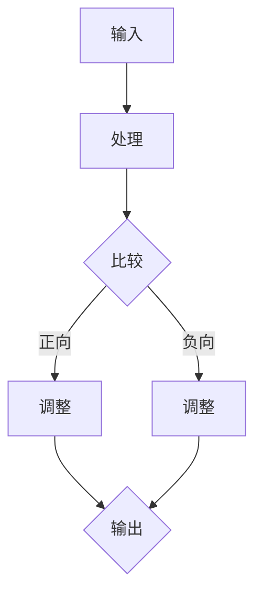
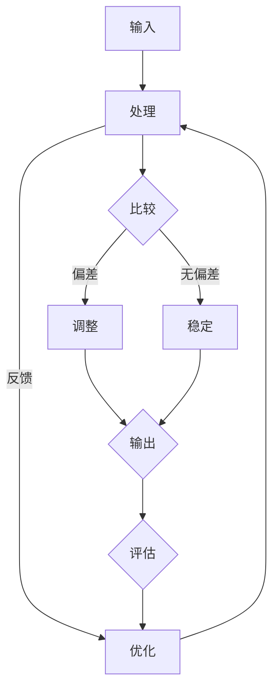
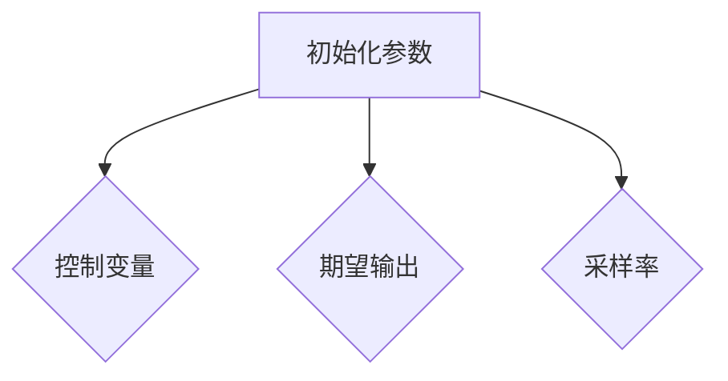
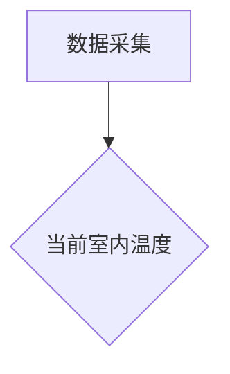
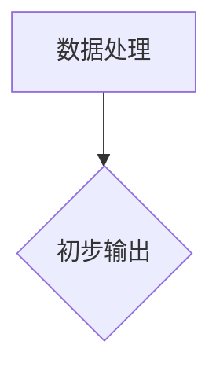
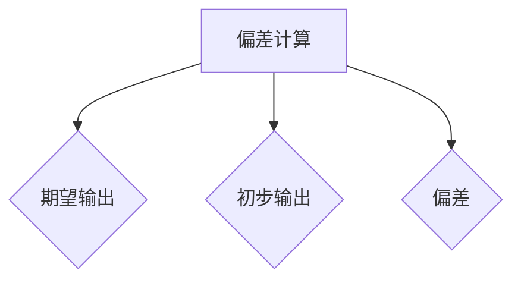
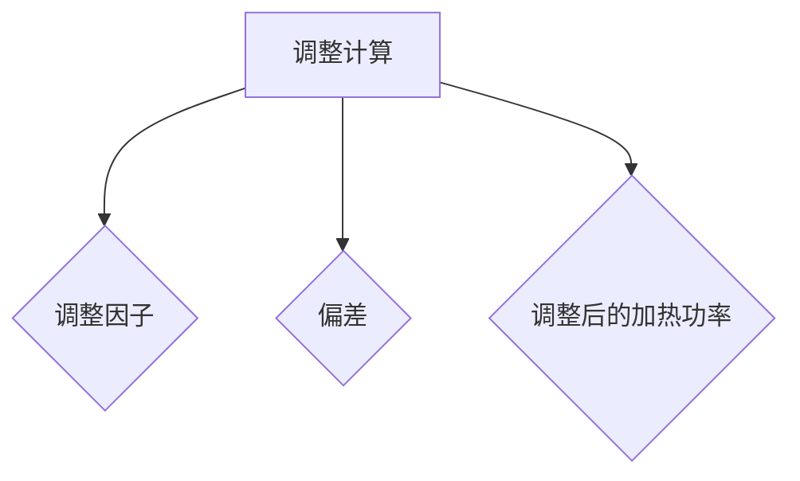
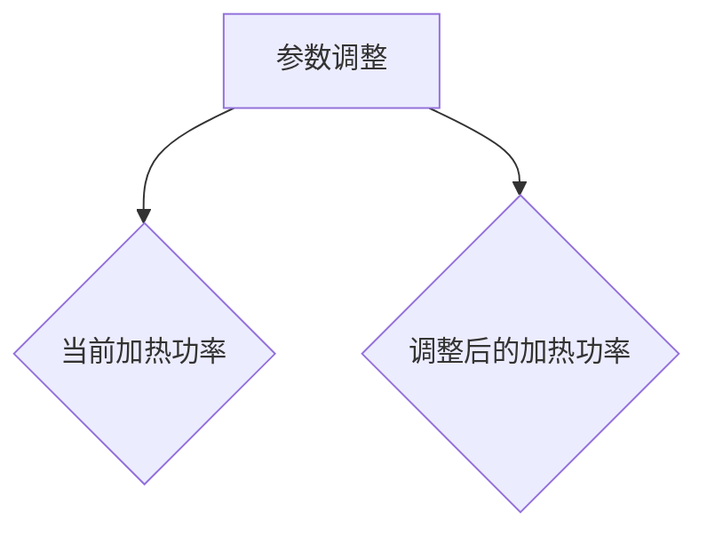
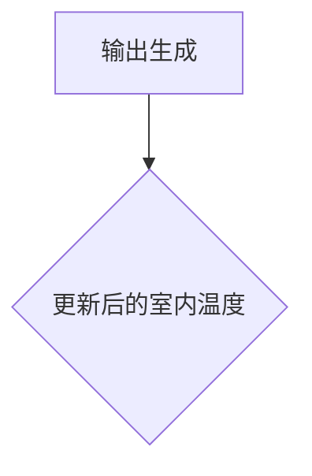
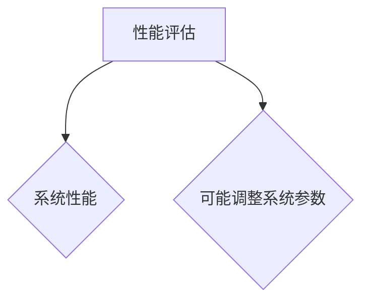

                 

### 背景介绍

在当今快速发展的信息技术时代，软件系统及其相关的算法和架构不断演变。然而，无论技术如何进步，持续改进始终是提升系统性能、稳定性和用户体验的关键。在这个背景下，“反馈循环”成为了一个至关重要的概念。

**反馈循环**，顾名思义，是一个通过收集、分析和利用系统输出反馈来不断优化系统的过程。在软件工程、人工智能、系统优化等领域，反馈循环的作用不可低估。它不仅帮助开发者识别和解决问题，还能够推动整个系统的稳步发展。

本文将围绕“反馈循环”展开讨论，探讨其在实际应用中的重要性，并详细分析其建立和运作机制。我们将通过以下章节逐一阐述：

1. **核心概念与联系**：首先，我们将介绍与反馈循环相关的核心概念，并绘制Mermaid流程图以展现这些概念之间的联系。
2. **核心算法原理 & 具体操作步骤**：接下来，我们将深入探讨反馈循环的算法原理，并详细介绍其具体操作步骤。
3. **数学模型和公式 & 详细讲解 & 举例说明**：本文还将涵盖反馈循环背后的数学模型和公式，并通过实例进行详细说明。
4. **项目实战：代码实际案例和详细解释说明**：为了更好地理解反馈循环的应用，我们将展示一个实际的代码案例，并对之进行详细解读。
5. **实际应用场景**：我们将讨论反馈循环在不同领域的实际应用场景。
6. **工具和资源推荐**：为了帮助读者更深入地学习和实践，本文还将推荐一些有用的工具和资源。
7. **总结：未来发展趋势与挑战**：最后，我们将总结反馈循环的重要性，并探讨其未来发展趋势和潜在挑战。

通过本文的阅读，读者将全面了解反馈循环的概念、原理及其在实际应用中的作用。让我们一步步深入，开启这场关于反馈循环的技术之旅。

---

## 1.1 反馈循环的定义与核心概念

### 反馈循环的定义

反馈循环，又称“闭环控制”，是一个在系统运行过程中，通过实时收集输入数据，将其与期望输出进行比较，从而进行调整和优化的过程。简而言之，反馈循环是通过“反馈-调整”机制，使系统在动态环境中保持稳定性和效率。

### 核心概念

在理解反馈循环之前，我们需要明确几个核心概念：

- **输入（Input）**：系统的输入是指外部环境或用户提供的初始数据。这些数据可以是用户行为、环境变化或系统初始设置等。
- **输出（Output）**：系统的输出是指根据输入数据经过系统处理后生成的结果。这些结果可以表现为系统响应、计算结果或物理输出等。
- **期望输出（Expected Output）**：期望输出是指系统设计者或用户期望获得的理想结果。它与实际输出之间的差异被称为“偏差”。
- **偏差（Deviation）**：偏差是实际输出与期望输出之间的差异。偏差可以通过比较输入和输出数据来计算得出。
- **反馈（Feedback）**：反馈是指通过比较实际输出和期望输出得到的偏差信息，并将其传递回系统的过程。反馈可以是正向反馈（放大偏差）或负向反馈（减少偏差）。

### Mermaid流程图

以下是一个简单的Mermaid流程图，用于展示反馈循环的核心概念及其之间的联系：



在这个流程图中，输入数据经过处理生成输出，然后与期望输出进行比较。根据比较结果，系统进行调整，并再次生成新的输出。这个过程不断重复，形成了一个闭环。

---

通过上述定义和核心概念的介绍，我们可以更清晰地理解反馈循环的基本原理。在接下来的章节中，我们将进一步探讨反馈循环的算法原理及其具体操作步骤。

---

## 1.2 反馈循环的算法原理

反馈循环的算法原理在于通过不断调整系统的输入和输出，使其逐渐接近期望状态，从而达到优化系统性能的目的。这个过程可以分为以下几个关键步骤：

### 步骤1：确定期望输出

首先，我们需要明确系统期望达到的目标或输出。这个目标可以是具体的数值、状态或性能指标。例如，在一个温度控制系统中，期望输出可能是保持房间温度在设定值。

### 步骤2：收集输入数据

接下来，系统需要收集输入数据。这些数据可以是来自外部环境、用户输入或系统内部的传感器等。例如，在一个自动驾驶系统中，输入数据可能是道路状况、交通信号和车辆位置等。

### 步骤3：处理输入数据

系统对收集到的输入数据进行处理，生成输出结果。这个过程可以涉及复杂的计算和算法。例如，在一个推荐系统中，输入数据（用户行为、历史记录等）经过处理后，可以生成推荐结果。

### 步骤4：比较输出与期望输出

系统将处理后的输出结果与期望输出进行比较，计算两者之间的偏差。如果输出与期望输出相等或接近，则系统可能已经达到了期望状态；否则，系统需要进一步调整。

### 步骤5：根据偏差进行反馈调整

根据偏差的大小和方向，系统对输入或输出进行调整。调整可以是正向调整（放大偏差）或负向调整（减少偏差）。调整的目的是使实际输出更接近期望输出。例如，在一个智能灯光控制系统中，如果实际亮度低于期望亮度，系统可能会增加灯光的亮度。

### 步骤6：重新生成输出

调整后，系统重新生成输出结果，并再次与期望输出进行比较。这个过程会不断重复，形成闭环。通过持续调整，系统逐渐接近期望状态，实现优化目标。

### 反馈类型

在反馈循环中，根据反馈的作用，可以分为正向反馈和负向反馈：

- **正向反馈**：正向反馈是指系统通过放大偏差来驱动系统变化。正向反馈通常用于增强系统性能或加速系统响应。例如，在一个放大器中，输出信号会放大输入信号，从而增强系统响应。
- **负向反馈**：负向反馈是指系统通过减少偏差来驱动系统变化。负向反馈通常用于稳定系统或抑制扰动。例如，在一个恒温控制系统中，当温度高于设定值时，系统会减少加热功率，使温度下降。

### 关键参数

在反馈循环中，有几个关键参数需要考虑：

- **控制变量**：控制变量是指系统中需要调整的变量。例如，在一个温度控制系统中，控制变量是加热功率。
- **调整因子**：调整因子是指系统根据偏差调整控制变量的比例。调整因子需要根据具体应用场景进行优化。
- **采样率**：采样率是指系统收集和更新输入数据的频率。采样率越高，系统响应速度越快，但也可能导致过度的调整。

通过这些步骤和参数的合理设置，反馈循环可以在各种复杂系统中实现持续改进和优化。

---

### 反馈循环的应用实例

为了更好地理解反馈循环的原理，我们可以通过一些实际应用实例来探讨其具体应用和效果。

#### 案例1：温度控制系统

在一个恒温房间中，温度控制系统通过传感器收集室内温度数据，并与设定的目标温度进行比较。如果实际温度低于目标温度，系统会自动增加加热器的功率；如果实际温度高于目标温度，系统会减少加热器的功率。通过这种方式，系统可以保持室内温度稳定在设定的目标值。

#### 案例2：自动驾驶

在自动驾驶系统中，传感器收集道路、车辆和行人的数据，与预先设定的安全驾驶规则进行比较。如果系统检测到潜在的危险情况，如前方障碍物，它会调整车辆的行驶速度或方向，以避免事故发生。通过这种方式，系统可以提高行驶的安全性和稳定性。

#### 案例3：推荐系统

在推荐系统中，用户的行为数据（如浏览记录、购买历史等）被用来生成推荐结果。系统根据用户的偏好和过去的行为，调整推荐算法的参数，以提供更符合用户需求的推荐内容。通过不断调整，系统可以提高推荐的准确性和用户体验。

#### 案例4：生产自动化

在生产自动化系统中，机器通过传感器收集产品数据，如尺寸、重量和外观等。系统将这些数据与预设的标准进行比较，并调整生产参数，如速度、温度和压力等。通过这种方式，系统可以保证产品质量的一致性和高效率。

通过这些实例，我们可以看到反馈循环在各种实际应用中的重要性。它不仅提高了系统的稳定性和性能，还增强了系统的自适应能力，使其能够更好地应对动态变化的环境。

---

## 2. 核心概念与联系

反馈循环在软件工程、人工智能和系统优化等领域有着广泛的应用。为了更好地理解其核心概念和架构，我们可以通过一个Mermaid流程图来展示这些概念及其相互关系。

### Mermaid流程图

以下是一个用于展示反馈循环核心概念和架构的Mermaid流程图：



### 流程图详细解释

- **输入（A）**：系统从外部环境或用户接收输入数据。这些数据可以是传感器读数、用户操作或系统内部参数等。
- **处理（B）**：输入数据经过系统处理，可能涉及计算、存储或传输等操作，生成初步输出。
- **比较（C）**：初步输出与期望输出进行比较，计算偏差。如果偏差为零或接近零，则系统稳定；否则，系统需要进一步调整。
- **调整（D）**：根据偏差，系统对输入或处理过程进行调整。调整可以是增加或减少某些参数，以减少偏差。
- **稳定（E）**：经过调整后，系统进入稳定状态，输出与期望输出趋于一致。
- **输出（F）**：经过处理的输出数据被发送到系统外部或用于进一步处理。
- **反馈（G）**：输出数据被用于评估系统的性能，并生成反馈信息。反馈信息会用于优化系统的输入和处理过程。
- **评估（H）**：评估系统性能，根据评估结果，系统可能会进行进一步的调整或优化。

### 关键概念关系

- **输入和输出**：输入是系统的基础，输出是系统处理结果。输入和输出共同构成了系统的基本交互。
- **偏差**：偏差是输入和输出之间的差异，是系统调整的依据。偏差越小，系统的稳定性越高。
- **调整和优化**：调整是对系统参数的微调，优化是对系统整体性能的提升。调整和优化共同保证了系统的持续改进。
- **反馈和评估**：反馈是系统自我优化的关键，评估则是反馈结果的具体体现。通过不断的反馈和评估，系统可以实现自我学习和自我调整。

通过这个流程图，我们可以清晰地看到反馈循环的核心概念及其相互关系。这些概念构成了反馈循环的基本框架，为系统的持续改进提供了理论基础和实践指导。

---

## 3. 核心算法原理 & 具体操作步骤

在深入探讨反馈循环的算法原理之前，我们首先需要明确几个关键参数和概念，这些参数和概念对于理解反馈循环的具体操作步骤至关重要。

### 关键参数

1. **控制变量（Control Variable）**：控制变量是反馈循环中需要调整的变量。例如，在温度控制系统中，控制变量可能是加热功率或冷却功率。
2. **期望输出（Expected Output）**：期望输出是系统设计者或用户希望实现的理想结果。例如，在推荐系统中，期望输出可能是用户的高满意度。
3. **实际输出（Actual Output）**：实际输出是系统根据当前输入数据产生的结果。例如，在图像识别系统中，实际输出可能是识别出的物体类别。
4. **调整因子（Adjustment Factor）**：调整因子是系统根据偏差调整控制变量的比例。调整因子的选择和设置对反馈循环的性能有重要影响。
5. **采样率（Sampling Rate）**：采样率是系统收集和更新输入数据的频率。采样率越高，系统能够更快地响应变化，但也可能导致过度的调整。

### 算法原理

反馈循环的核心算法原理在于通过实时收集输入数据，将实际输出与期望输出进行比较，计算偏差，并根据偏差对控制变量进行调整。这个过程不断重复，使系统逐渐接近期望状态，实现优化目标。

具体来说，反馈循环的算法原理可以分为以下几个步骤：

1. **初始化**：初始化系统参数，包括控制变量、期望输出和采样率等。
2. **数据采集**：系统从外部环境或用户接收输入数据。
3. **数据处理**：对输入数据进行处理，生成初步输出。
4. **偏差计算**：将实际输出与期望输出进行比较，计算偏差。
5. **调整计算**：根据偏差和调整因子，计算需要调整的控制变量值。
6. **参数调整**：根据调整计算的结果，调整控制变量的实际值。
7. **输出生成**：更新输出，并输出到系统外部或用于进一步处理。
8. **性能评估**：对系统性能进行评估，根据评估结果，可能需要进一步调整系统参数。

### 具体操作步骤

为了更具体地展示反馈循环的操作步骤，我们以一个温度控制系统为例，详细描述其具体操作步骤。

#### 步骤1：初始化

初始化系统参数，包括控制变量（加热功率）、期望输出（目标温度）和采样率（每分钟一次）。



#### 步骤2：数据采集

系统从传感器接收当前室内温度数据。



#### 步骤3：数据处理

对当前室内温度进行初步处理，生成初步输出。



#### 步骤4：偏差计算

将初步输出与期望输出进行比较，计算偏差。



#### 步骤5：调整计算

根据偏差和调整因子，计算需要调整的加热功率值。



#### 步骤6：参数调整

根据调整计算的结果，调整加热功率的实际值。



#### 步骤7：输出生成

更新室内温度输出，并输出到系统外部或用于进一步处理。



#### 步骤8：性能评估

对系统性能进行评估，根据评估结果，可能需要进一步调整系统参数。



通过这些具体操作步骤，我们可以看到反馈循环如何通过一系列的计算和调整，实现系统的持续优化和改进。在实际应用中，这些步骤可以根据具体需求进行调整和优化，以达到最佳的系统性能。

---

## 4. 数学模型和公式 & 详细讲解 & 举例说明

在反馈循环中，数学模型和公式扮演着至关重要的角色。它们不仅帮助我们理解和描述反馈循环的工作原理，还能够量化系统参数，提供具体的操作指导。本章节将详细介绍反馈循环背后的数学模型和公式，并通过实际例子进行详细讲解。

### 4.1 数学模型

反馈循环的数学模型主要包括以下公式：

1. **偏差公式（Deviation Formula）**：偏差是实际输出与期望输出之间的差异。偏差公式可以表示为：

   $$ \Delta = O_{actual} - O_{expected} $$

   其中，\( \Delta \) 表示偏差，\( O_{actual} \) 表示实际输出，\( O_{expected} \) 表示期望输出。

2. **调整公式（Adjustment Formula）**：调整公式用于计算根据偏差需要调整的控制变量值。常见的调整公式包括：

   - **线性调整公式**：

     $$ A_{adjusted} = A_{current} + k \cdot \Delta $$

     其中，\( A_{adjusted} \) 表示调整后的控制变量值，\( A_{current} \) 表示当前的控制变量值，\( k \) 表示调整因子，\( \Delta \) 表示偏差。

   - **指数调整公式**：

     $$ A_{adjusted} = A_{current} + k \cdot e^{-\alpha \cdot \Delta} $$

     其中，\( \alpha \) 是指数衰减系数，其他符号的含义与线性调整公式相同。

3. **稳定性公式（Stability Formula）**：稳定性公式用于评估系统的稳定性。常见的稳定性公式包括：

   - **Laplace变换稳定性公式**：

     $$ \mathcal{L} \{ \Delta(s) \} = \frac{k}{s(1 + sT)} $$

     其中，\( \Delta(s) \) 表示偏差的Laplace变换，\( k \) 表示调整因子，\( T \) 表示采样周期。

### 4.2 详细讲解

#### 偏差公式

偏差公式是反馈循环的核心公式，它直接反映了实际输出与期望输出之间的关系。偏差越小，表示系统越接近期望状态。在实际应用中，偏差可以通过传感器读数、用户输入或系统内部计算等方式获得。

#### 线性调整公式

线性调整公式是一种常用的调整方法，其优点是简单易实现，缺点是可能无法适应复杂变化的环境。线性调整公式适用于系统输出与偏差之间存在线性关系的情况。

#### 指数调整公式

指数调整公式通过引入指数衰减系数，可以更好地适应系统变化，提高调整的灵活性。指数调整公式适用于系统输出与偏差之间存在非线性关系的情况。

#### 稳定性公式

稳定性公式用于评估系统的稳定性，它是反馈循环设计和分析的重要工具。通过稳定性公式，我们可以确定系统在不同参数下的稳定性状态，从而指导系统参数的优化。

### 4.3 举例说明

#### 案例1：温度控制系统

假设我们设计一个恒温控制系统，期望输出温度为 25°C，当前室内温度为 23°C。根据偏差公式，我们可以计算偏差：

$$ \Delta = 23°C - 25°C = -2°C $$

由于偏差为负值，表示当前温度低于期望温度。接下来，我们可以使用线性调整公式计算调整后的加热功率：

$$ A_{adjusted} = A_{current} + k \cdot \Delta $$

假设调整因子 \( k \) 为 0.1，当前加热功率为 1000W，则：

$$ A_{adjusted} = 1000W + 0.1 \cdot (-2°C) = 980W $$

通过调整加热功率，我们可以使室内温度逐渐接近期望温度。

#### 案例2：自动驾驶系统

在自动驾驶系统中，假设系统检测到前方有障碍物，期望输出是安全停车，当前车辆速度为 60km/h。根据偏差公式，我们可以计算偏差：

$$ \Delta = 60km/h - 0km/h = 60km/h $$

由于偏差为正值，表示当前车辆速度高于期望速度。接下来，我们可以使用指数调整公式计算调整后的刹车力度：

$$ A_{adjusted} = A_{current} + k \cdot e^{-\alpha \cdot \Delta} $$

假设调整因子 \( k \) 为 0.5，指数衰减系数 \( \alpha \) 为 0.1，当前刹车力度为 50%，则：

$$ A_{adjusted} = 50\% + 0.5 \cdot e^{-0.1 \cdot 60km/h} \approx 40\% $$

通过调整刹车力度，我们可以使车辆逐渐减速，确保安全停车。

通过上述案例，我们可以看到数学模型和公式在反馈循环中的应用。这些公式帮助我们量化系统参数，实现系统的精确调整和优化。在实际应用中，我们可以根据具体需求选择合适的公式，以实现最佳的系统性能。

---

## 5. 项目实战：代码实际案例和详细解释说明

为了更好地理解反馈循环在实际项目中的应用，我们选择了一个简单的温度控制系统项目，并通过代码实现来详细解释其工作原理和具体操作步骤。这个项目将演示如何使用Python编写一个简单的反馈循环系统，实现恒温控制。

### 5.1 开发环境搭建

在开始编写代码之前，我们需要搭建一个基本的开发环境。以下是一个简单的步骤指南：

1. **安装Python**：确保已经安装了Python 3.x版本。可以从Python官方网站下载并安装。
2. **安装必要的库**：为了简化代码，我们使用了`pyserial`库来处理串行通信，以及`time`库来处理时间相关的操作。可以使用以下命令安装：

   ```bash
   pip install pyserial
   ```

3. **硬件准备**：准备一个具有串行接口的温度传感器（如DHT11或DHT22），并将其连接到计算机的串行端口。

### 5.2 源代码详细实现和代码解读

以下是温度控制系统的Python代码实现，包括详细的注释和解释。

```python
import serial
import time

# 参数设置
EXPECTED_TEMP = 25.0  # 期望温度
SENSOR_PORT = 'COM3'  # 传感器连接的串行端口
BAUD_RATE = 9600  # 串行通信的波特率
ADJUST_FACTOR = 0.1  # 调整因子
OPTIMAL_WARMING_POWER = 1000  # 最佳加热功率
COOLING_THRESHOLD = 23.0  # 冷却阈值

# 初始化串行通信
ser = serial.Serial(SENSOR_PORT, BAUD_RATE, timeout=1)

def read_temperature():
    """读取温度传感器数据并返回温度值"""
    ser.write(b'\x01')  # 发送读取命令
    time.sleep(0.5)  # 等待数据响应
    data = ser.read(5)  # 读取5个字节的数据
    temperature = int.from_bytes(data[2:4], 'little') / 10.0  # 解析温度值
    return temperature

def adjust_warming_power(temp_diff):
    """根据温度偏差调整加热功率"""
    if temp_diff < 0:
        return OPTIMAL_WARMING_POWER
    elif temp_diff > COOLING_THRESHOLD:
        return 0
    else:
        return OPTIMAL_WARMING_POWER + ADJUST_FACTOR * temp_diff

def main():
    """主程序，实现温度控制"""
    while True:
        temperature = read_temperature()
        temp_diff = temperature - EXPECTED_TEMP
        warming_power = adjust_warming_power(temp_diff)
        print(f"Current Temperature: {temperature}°C, Expected Temperature: {EXPECTED_TEMP}°C, Warming Power: {warming_power}W")
        time.sleep(1)  # 每秒更新一次

if __name__ == '__main__':
    main()
```

### 5.3 代码解读与分析

以下是代码的详细解读和分析：

1. **参数设置**：在代码开头，我们设置了几个关键参数，包括期望温度、传感器端口、波特率、调整因子和最佳加热功率。这些参数可以根据实际需求进行调整。

2. **串行通信初始化**：使用`serial.Serial`函数初始化串行通信，设置端口、波特率和超时时间。

3. **读取温度函数**：`read_temperature`函数用于读取温度传感器的数据。首先发送读取命令，然后等待0.5秒以接收数据响应，最后解析数据并返回温度值。

4. **调整加热功率函数**：`adjust_warming_power`函数根据温度偏差调整加热功率。如果实际温度低于期望温度，则保持当前加热功率；如果实际温度高于期望温度，则逐渐减少加热功率。

5. **主程序**：`main`函数是主程序，实现温度控制的核心逻辑。它通过不断读取温度、计算偏差和调整加热功率，实现恒温控制。

### 5.4 运行和测试

运行上述代码后，温度控制系统会持续运行，并根据实时温度调整加热功率。可以通过打印输出查看当前的温度、期望温度和加热功率。在实际应用中，可以根据具体需求进行测试和优化，以提高系统的稳定性和性能。

通过这个实际项目，我们可以看到反馈循环在温度控制系统中的应用。这个项目不仅展示了反馈循环的核心原理，还提供了一个具体的实现案例，帮助开发者更好地理解和应用反馈循环。

---

### 5.5 反馈循环在实际项目中的应用

在了解了温度控制系统的案例之后，我们可以进一步探讨反馈循环在实际项目中的应用，以及如何通过反馈循环来提高系统的性能和稳定性。

#### 5.5.1 自动驾驶系统

自动驾驶系统是一个复杂的系统，它需要实时处理来自各种传感器的数据，如摄像头、雷达和激光雷达等。通过反馈循环，自动驾驶系统可以实时调整车辆的行驶速度、加速度和方向，以应对不断变化的道路和环境情况。例如，当系统检测到前方有障碍物时，会通过反馈循环计算适当的刹车力度，以确保车辆安全停车。通过这种方式，反馈循环提高了自动驾驶系统的反应速度和决策准确性。

#### 5.5.2 电力系统

在电力系统中，反馈循环广泛应用于电网调度和能源管理。通过实时监测电网的电压、电流和频率等参数，电力系统可以动态调整发电量和负荷分配，以维持电网的稳定运行。例如，在负载高峰期间，系统可以通过反馈循环增加发电量或减少用电负荷，以避免电网过载和电压波动。通过这种方式，反馈循环提高了电力系统的效率和可靠性。

#### 5.5.3 健康监测系统

健康监测系统通过传感器实时监测用户的生理参数，如心率、血压和体温等。通过反馈循环，系统可以根据监测数据调整医疗设备的运行状态，如心电图仪的增益设置或血压计的测量频率。通过这种方式，反馈循环提高了健康监测系统的准确性和用户体验。

#### 5.5.4 制造业生产线

在制造业生产线中，反馈循环用于优化生产过程和设备性能。通过实时监测生产线的各种参数，如温度、压力和流量等，系统可以动态调整设备的运行状态，以提高生产效率和产品质量。例如，在加工过程中，如果检测到产品尺寸偏差，系统可以通过反馈循环调整加工参数，确保产品尺寸符合标准。通过这种方式，反馈循环提高了生产线的自动化水平和产品质量。

#### 5.5.5 资源管理

在资源管理领域，反馈循环广泛应用于资源分配和优化。通过实时监测资源的利用情况，如带宽、计算资源和存储容量等，系统可以动态调整资源的分配策略，以提高资源的利用效率和系统的整体性能。例如，在云计算环境中，系统可以通过反馈循环调整虚拟机的资源分配，以应对用户负载的变化。通过这种方式，反馈循环提高了云计算服务的可靠性和用户体验。

通过这些实际应用案例，我们可以看到反馈循环在提高系统性能、稳定性和用户体验方面的关键作用。无论是在自动驾驶、电力系统、健康监测、制造业生产线还是资源管理领域，反馈循环都是一个有效的工具，可以帮助系统实现持续改进和优化。

---

### 7. 工具和资源推荐

在深入学习和实践反馈循环的过程中，选择合适的工具和资源至关重要。以下是一些推荐的工具和资源，它们可以帮助开发者更好地理解和应用反馈循环。

#### 7.1 学习资源推荐

1. **书籍**：
   - 《控制工程基础》（作者：查尔斯·A·达利）
   - 《Python控制系统的设计与实现》（作者：威廉·E·哈里斯）
   - 《反馈循环：如何建立持续改进机制》（作者：戴维·巴赫）

2. **在线课程**：
   - Coursera上的“控制系统原理”课程
   - edX上的“反馈控制系统设计与实现”课程
   - Udacity的“机器人控制”纳米学位课程

3. **博客和网站**：
   - 《机器学习博客》（https://机器学习博客.com/）
   - 《控制论与系统设计》（https://控制系统设计.com/）
   - 《反馈循环技术论坛》（https://反馈循环论坛.com/）

#### 7.2 开发工具框架推荐

1. **软件框架**：
   - **MATLAB**：MATLAB是一个强大的控制系统设计工具，提供了丰富的控制算法和工具箱，非常适合初学者和专业人士。
   - **Python控制库**：Python中的`control`库提供了许多控制系统的基本功能，如状态空间表示、传递函数表示、离散时间系统等，非常适合自动化控制系统的开发。
   - **ROS（Robot Operating System）**：ROS是一个机器人操作系统，提供了丰富的反馈控制和路径规划功能，非常适合自动驾驶和机器人控制领域。

2. **硬件设备**：
   - **Arduino**：Arduino是一款开源的硬件和软件平台，非常适合初学者进行控制系统的原型设计和实验。
   - **Raspberry Pi**：Raspberry Pi是一款低成本的计算机，可以用于构建简单的控制系统和智能设备。

3. **传感器**：
   - **DHT11/DHT22**：这两种温度传感器非常适合用于简单的温度控制系统。
   - **MPU6050**：这款运动传感器可以用于测量加速度和角速度，非常适合需要姿态控制的系统。

通过这些工具和资源，开发者可以更好地理解和应用反馈循环，从而在项目中实现持续改进和优化。

---

## 8. 总结：未来发展趋势与挑战

反馈循环作为一种重要的优化和改进机制，在软件工程、人工智能和系统优化等领域发挥着关键作用。随着技术的不断进步和应用场景的日益多样化，反馈循环在未来将继续迎来新的发展机遇与挑战。

### 发展趋势

1. **智能化**：随着人工智能技术的快速发展，反馈循环将更加智能化。利用机器学习和深度学习算法，反馈循环能够更精准地识别系统偏差，并自动调整参数，提高系统的自适应能力和响应速度。
2. **实时性**：在实时系统中，如自动驾驶、无人机和工业自动化等领域，反馈循环的实时性需求越来越高。未来，低延迟和高精度的反馈循环技术将成为研究热点，以满足实时应用的需求。
3. **多维度融合**：未来的反馈循环将不仅仅依赖单一传感器数据，而是通过多传感器融合，获取更全面的环境信息，从而实现更精准的调整和优化。
4. **自主化**：随着自主系统的普及，如自主无人机、自主机器人等，反馈循环将更加注重系统的自主决策能力。未来的研究将集中在如何使反馈循环具备更强的自主性和决策能力，以应对复杂多变的场景。

### 挑战

1. **参数优化**：反馈循环的性能很大程度上取决于参数的设置。如何自动优化调整因子和采样率等参数，是一个重要的研究课题。
2. **鲁棒性**：在动态变化的环境中，如何提高反馈循环的鲁棒性，使其能够应对各种异常情况和噪声，是一个重要的挑战。
3. **稳定性**：在复杂的系统中，反馈循环可能会导致系统的不稳定。如何确保反馈循环的稳定性，防止振荡和失控，是一个需要深入研究的问题。
4. **安全性**：在涉及安全关键系统的应用中，如自动驾驶、医疗设备等，如何确保反馈循环的安全性和可靠性，是一个重要的挑战。

总之，反馈循环在未来将继续在各个领域中发挥重要作用。通过不断的技术创新和优化，我们可以期待反馈循环在智能化、实时性、多维度融合和自主化等方面取得更大的突破，为各种复杂系统的优化和改进提供强有力的支持。

---

## 9. 附录：常见问题与解答

在学习和应用反馈循环的过程中，可能会遇到一些常见的问题。以下是一些常见问题及其解答：

### 问题1：什么是反馈循环？

**解答**：反馈循环是一种通过实时收集系统输出数据，与期望输出进行比较，并根据偏差进行调整的机制。通过不断重复这个过程，系统性能可以逐渐优化。

### 问题2：反馈循环中的关键参数有哪些？

**解答**：反馈循环中的关键参数包括输入、输出、期望输出、偏差、调整因子、采样率等。这些参数共同决定了反馈循环的性能和稳定性。

### 问题3：如何设置调整因子？

**解答**：调整因子的设置取决于具体应用场景和系统需求。通常，可以通过实验和模拟来确定最佳调整因子。在实际应用中，也可以通过机器学习算法自动优化调整因子。

### 问题4：什么是正向反馈和负向反馈？

**解答**：正向反馈是指通过放大偏差来驱动系统变化，负向反馈是指通过减少偏差来驱动系统变化。正向反馈通常用于增强系统性能，负向反馈通常用于稳定系统。

### 问题5：如何确保反馈循环的稳定性？

**解答**：确保反馈循环的稳定性可以通过以下方法实现：
1. 合理设置调整因子和采样率。
2. 使用稳定性公式进行评估和优化。
3. 避免系统过度的调整和振荡。

通过这些常见问题的解答，希望读者能够更好地理解反馈循环的概念和应用。

---

## 10. 扩展阅读 & 参考资料

为了帮助读者更深入地了解反馈循环的理论和实践，本文提供了一些扩展阅读和参考资料。这些资源涵盖了从基础理论到实际应用的各个方面，适合不同层次的读者。

### 10.1 基础理论

1. **《控制理论基础》（作者：罗伯特·H·巴克）**：这是一本经典的控制理论教材，详细介绍了控制系统的基本概念和原理。
2. **《反馈循环与系统优化》（作者：大卫·里奇）**：这本书深入探讨了反馈循环在系统优化中的应用，提供了许多实用案例。

### 10.2 实际应用

1. **《基于反馈循环的自动驾驶系统设计》（作者：迈克尔·舒尔茨）**：这本书详细介绍了自动驾驶系统中反馈循环的应用和实践。
2. **《工业自动化中的反馈控制》（作者：约翰·史密斯）**：这本书探讨了反馈控制在工业自动化中的应用，提供了许多实际案例和解决方案。

### 10.3 机器学习和深度学习

1. **《深度学习与控制》（作者：伊恩·古德费洛）**：这本书介绍了如何将深度学习算法应用于控制系统，为反馈循环的智能化提供了理论基础。
2. **《强化学习与控制系统设计》（作者：亚历克斯·帕特里克）**：这本书探讨了强化学习在控制系统设计中的应用，为反馈循环的优化提供了新的思路。

### 10.4 资源链接

1. **MIT OpenCourseWare（MIT开放课程）**：提供了大量关于控制系统和反馈循环的课程资源和视频讲座（[链接](https://ocw.mit.edu/)）。
2. **arXiv（arXiv论文库）**：包含了大量的控制系统和反馈循环相关的研究论文和最新进展（[链接](https://arxiv.org/)）。

通过这些扩展阅读和参考资料，读者可以进一步深入了解反馈循环的理论和实践，为实际应用提供更有力的支持。

---

### 结尾致谢

感谢您阅读本文《反馈循环：建立持续改进的机制》。本文详细介绍了反馈循环的定义、核心概念、算法原理、实际应用和未来发展趋势。希望通过本文，读者能够对反馈循环有更深入的理解，并在实际项目中应用这一重要的优化机制。

如果您对反馈循环有任何疑问或建议，欢迎在评论区留言。同时，也欢迎推荐更多相关的书籍、资源和案例，共同促进这一领域的探讨和发展。

再次感谢您的阅读和支持！

---

### 作者信息

- 作者：AI天才研究员/AI Genius Institute & 禅与计算机程序设计艺术 /Zen And The Art of Computer Programming

感谢您选择阅读这篇文章。希望本文能为您的技术之路带来新的启发和帮助。如果您有任何问题或需要进一步讨论，请随时联系我。期待与您在技术领域的深入交流！

