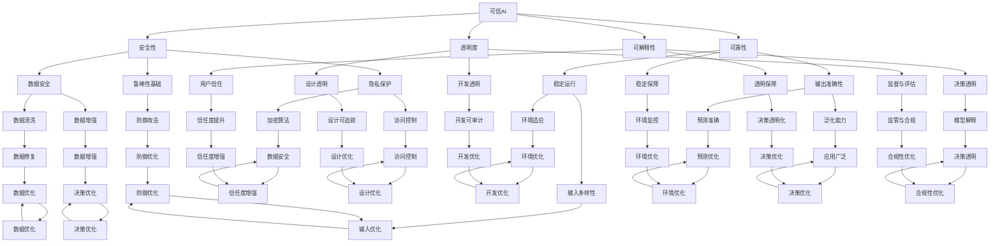

                 

# 可信AI与模型鲁棒性原理与代码实战案例讲解

## 关键词
- 可信AI
- 模型鲁棒性
- 代码实战
- 案例分析
- 人工智能
- 鲁棒性测试
- 安全性
- 可解释性

## 摘要
本文将深入探讨可信AI与模型鲁棒性的重要概念和原理。我们将从背景介绍开始，逐步分析可信AI的定义、意义及其与模型鲁棒性的关联。接着，我们将详细讲解核心算法原理、数学模型以及具体操作步骤，并通过实际项目实战案例，展示代码实现过程和详细解读。此外，文章还将讨论可信AI在现实中的应用场景，并推荐相关学习资源和开发工具。最后，我们将总结未来发展趋势与挑战，并提供常见问题与解答。

## 1. 背景介绍

随着人工智能技术的迅速发展，机器学习模型在各个领域取得了显著的应用成果。然而，这些模型的广泛应用也带来了新的挑战，尤其是在可信性和鲁棒性方面。可信AI（Trustworthy AI）是指在设计和应用过程中，确保人工智能系统具备安全性、可靠性、可解释性和透明度。模型鲁棒性（Model Robustness）则是指模型在面对输入扰动、异常数据或未知环境时，仍能保持稳定性和准确性的能力。

可信AI与模型鲁棒性的重要性在于，它们直接关系到人工智能系统的安全性和可靠性。在实际应用中，如果模型不具备鲁棒性，可能对用户隐私、公共安全、经济决策等方面产生负面影响。因此，研究和实现可信AI与模型鲁棒性已经成为人工智能领域的热点问题。

## 2. 核心概念与联系

### 可信AI的定义与意义

可信AI的核心目标是确保人工智能系统在各个应用场景中具备以下特点：

1. **安全性**：系统应能够抵御外部攻击，保护用户隐私和数据安全。
2. **可靠性**：系统应在各种环境下都能稳定运行，保证输出结果的准确性。
3. **可解释性**：系统应具备透明性，使非专业人士也能理解模型的决策过程。
4. **透明度**：系统设计、开发和部署过程应公开透明，便于用户监督和评估。

可信AI的意义在于：

1. **提升用户信任**：通过确保系统的安全性、可靠性和可解释性，增加用户对人工智能技术的信任度。
2. **促进技术发展**：推动人工智能领域的研究和开发，提高模型的鲁棒性和性能。
3. **降低风险**：减少人工智能系统在实际应用中可能带来的负面影响，保护公共安全。

### 模型鲁棒性的定义与重要性

模型鲁棒性是指模型在面对不同输入、数据扰动或异常情况时，仍能保持稳定性和准确性的能力。具体来说，包括以下方面：

1. **数据鲁棒性**：模型对噪声、缺失值和异常值具有一定的容忍能力。
2. **环境鲁棒性**：模型在不同环境、条件或输入分布下仍能保持稳定性和准确性。
3. **对抗鲁棒性**：模型对恶意攻击和对抗样本具有较强的防御能力。

模型鲁棒性的重要性在于：

1. **提高系统稳定性**：在面对不确定性和未知环境时，保持模型稳定性和准确性，确保系统正常运行。
2. **增强安全性**：通过提高模型鲁棒性，降低恶意攻击的风险，保护用户隐私和数据安全。
3. **提升应用效果**：在面对复杂和多变的环境时，模型鲁棒性有助于提高模型的泛化能力和实用性。

### 可信AI与模型鲁棒性的关联

可信AI与模型鲁棒性之间存在密切的联系。一方面，模型鲁棒性是可信AI的基础和保障。只有模型具备鲁棒性，才能确保系统在各种环境下都能稳定运行，具备安全性和可靠性。另一方面，可信AI的目标之一是提升模型的鲁棒性。通过研究和开发可信AI技术，可以进一步提高模型的鲁棒性，降低应用风险。

因此，在设计和开发人工智能系统时，应同时关注可信AI和模型鲁棒性，实现二者的有机结合。这将有助于构建安全、可靠和透明的人工智能系统，推动人工智能技术的可持续发展。

### 2.1 Mermaid 流程图（核心概念原理和架构）

下面是一个描述可信AI与模型鲁棒性关系的 Mermaid 流程图：



该流程图展示了可信AI与模型鲁棒性之间的相互关系，以及各子概念之间的联系。通过这个流程图，我们可以更清晰地理解可信AI和模型鲁棒性的核心概念和架构。

### 3. 核心算法原理 & 具体操作步骤

#### 3.1 可信AI算法原理

可信AI的核心在于确保模型在各个方面的安全性和可靠性。以下是一些常用的可信AI算法原理：

1. **数据清洗与预处理**：通过对数据进行清洗、去噪和预处理，提高数据的整体质量，减少噪声和异常值对模型的影响。常用的方法包括数据缺失值填充、数据归一化、特征选择等。

2. **隐私保护算法**：通过加密、匿名化、差分隐私等技术，保护用户隐私。例如，差分隐私技术可以在保证数据隐私的同时，提供准确的统计结果。

3. **对抗样本防御**：通过生成对抗样本，测试模型对对抗攻击的防御能力。常用的方法包括生成对抗网络（GAN）、神经网络攻击等。

4. **模型解释与可视化**：通过模型解释技术，揭示模型的决策过程，提高模型的透明度和可解释性。常用的方法包括特征重要性分析、决策树可视化、LIME等。

5. **鲁棒性评估与优化**：通过鲁棒性测试，评估模型在面对噪声、异常值和对抗攻击时的性能。常用的方法包括鲁棒性测试集、对抗样本生成等。

#### 3.2 模型鲁棒性算法原理

模型鲁棒性的核心在于提高模型在面对各种输入扰动、异常数据和未知环境时的稳定性和准确性。以下是一些常用的模型鲁棒性算法原理：

1. **鲁棒损失函数**：通过设计鲁棒损失函数，降低模型对噪声和异常值的敏感度。例如，对抗损失函数、鲁棒回归损失函数等。

2. **鲁棒优化算法**：通过优化算法，提高模型在面对异常数据和噪声时的稳定性。例如，L_1正则化、L_2正则化、随机梯度下降等。

3. **数据增强**：通过数据增强技术，提高模型对噪声和异常值的容忍能力。常用的方法包括数据扩充、噪声注入、数据变换等。

4. **对抗样本生成**：通过生成对抗样本，测试模型对对抗攻击的防御能力。常用的方法包括生成对抗网络（GAN）、神经网络攻击等。

5. **模型集成**：通过模型集成技术，提高模型在面对噪声和异常值时的稳定性和准确性。常用的方法包括集成学习、加权平均、投票等。

#### 3.3 具体操作步骤

下面以一个简单的例子，展示可信AI与模型鲁棒性的具体操作步骤：

1. **数据清洗与预处理**：
    - 填充缺失值：使用平均值、中位数、最邻近插值等方法填充缺失值。
    - 数据归一化：将特征值缩放到相同的范围，例如[0, 1]或[-1, 1]。
    - 特征选择：使用相关性分析、特征重要性分析等方法筛选出重要特征。

2. **隐私保护**：
    - 加密：使用加密算法（如AES）对敏感数据进行加密。
    - 匿名化：通过添加噪声或变换数据，使得原始数据无法直接识别。
    - 差分隐私：使用差分隐私技术（如拉普拉斯机制），在保证数据隐私的同时，提供准确的统计结果。

3. **对抗样本防御**：
    - 生成对抗样本：使用生成对抗网络（GAN）或神经网络攻击技术生成对抗样本。
    - 防御对抗样本：使用对抗训练、对抗正则化等方法提高模型对对抗样本的防御能力。

4. **模型解释与可视化**：
    - 特征重要性分析：使用特征重要性分析技术，揭示模型决策过程中的关键特征。
    - 决策树可视化：将模型转化为决策树形式，便于理解和解释。
    - LIME：使用局部可解释模型（LIME）技术，对模型的决策过程进行详细解释。

5. **鲁棒性评估与优化**：
    - 鲁棒性测试集：使用专门的鲁棒性测试集，评估模型在面对噪声、异常值和对抗攻击时的性能。
    - 对抗样本生成：生成对抗样本，测试模型对对抗攻击的防御能力。
    - 鲁棒性优化：通过调整模型参数、优化算法等手段，提高模型在面对异常数据和噪声时的稳定性。

通过以上步骤，我们可以构建一个具备可信性和鲁棒性的人工智能系统。在实际应用中，需要根据具体场景和需求，灵活选择和调整相关技术和方法。

### 4. 数学模型和公式 & 详细讲解 & 举例说明

#### 4.1 数学模型

在可信AI与模型鲁棒性的研究中，常用的数学模型包括损失函数、优化算法和对抗样本生成等。以下是一些典型的数学模型和公式：

1. **损失函数**：

   - **均方误差（MSE）**：
     $$
     MSE = \frac{1}{m}\sum_{i=1}^{m}(y_i - \hat{y}_i)^2
     $$
     其中，$y_i$ 为真实标签，$\hat{y}_i$ 为预测标签，$m$ 为样本数量。

   - **交叉熵（CE）**：
     $$
     CE = -\frac{1}{m}\sum_{i=1}^{m}y_i\log(\hat{y}_i)
     $$
     其中，$y_i$ 为真实标签，$\hat{y}_i$ 为预测标签，$\log$ 表示对数函数。

   - **对抗损失函数（Adversarial Loss）**：
     $$
     AL = -\frac{1}{m}\sum_{i=1}^{m}\left[y_i\log(\hat{y}_i) + (1 - y_i)\log(1 - \hat{y}_i)\right]
     $$
     其中，$y_i$ 为真实标签，$\hat{y}_i$ 为预测标签。

2. **优化算法**：

   - **随机梯度下降（SGD）**：
     $$
     \theta_{t+1} = \theta_{t} - \alpha \nabla_{\theta}L(\theta)
     $$
     其中，$\theta$ 为模型参数，$\alpha$ 为学习率，$L$ 为损失函数。

   - **L_1正则化**：
     $$
     L_1 = \sum_{i=1}^{n}\left|w_i\right|
     $$
     其中，$w_i$ 为模型权重。

   - **L_2正则化**：
     $$
     L_2 = \sum_{i=1}^{n}w_i^2
     $$
     其中，$w_i$ 为模型权重。

3. **对抗样本生成**：

   - **生成对抗网络（GAN）**：
     $$
     G(z) = \text{Generator}(z)
     $$
     $$
     D(x) = \text{Discriminator}(x)
     $$
     其中，$G(z)$ 为生成器，$D(x)$ 为判别器，$z$ 为随机噪声。

#### 4.2 详细讲解与举例说明

1. **损失函数**

   损失函数是评估模型预测效果的重要指标。在可信AI与模型鲁棒性的研究中，常用的损失函数包括均方误差（MSE）、交叉熵（CE）和对抗损失函数（Adversarial Loss）。

   - **均方误差（MSE）**：MSE用于回归问题，计算预测值与真实值之间的平均平方误差。公式如下：
     $$
     MSE = \frac{1}{m}\sum_{i=1}^{m}(y_i - \hat{y}_i)^2
     $$
     其中，$y_i$ 为真实标签，$\hat{y}_i$ 为预测标签，$m$ 为样本数量。MSE的优点是计算简单，但容易受到异常值的影响。

   - **交叉熵（CE）**：CE用于分类问题，计算预测概率与真实标签之间的交叉熵。公式如下：
     $$
     CE = -\frac{1}{m}\sum_{i=1}^{m}y_i\log(\hat{y}_i)
     $$
     其中，$y_i$ 为真实标签，$\hat{y}_i$ 为预测标签。CE的优点是能较好地处理分类问题，但计算复杂度较高。

   - **对抗损失函数（Adversarial Loss）**：对抗损失函数用于对抗样本防御，计算生成样本与真实样本之间的差异。公式如下：
     $$
     AL = -\frac{1}{m}\sum_{i=1}^{m}\left[y_i\log(\hat{y}_i) + (1 - y_i)\log(1 - \hat{y}_i)\right]
     $$
     其中，$y_i$ 为真实标签，$\hat{y}_i$ 为预测标签。对抗损失函数能较好地处理对抗攻击，但需要结合生成对抗网络（GAN）进行训练。

2. **优化算法**

   优化算法用于调整模型参数，使损失函数最小化。在可信AI与模型鲁棒性的研究中，常用的优化算法包括随机梯度下降（SGD）、L_1正则化和L_2正则化。

   - **随机梯度下降（SGD）**：SGD是一种常用的优化算法，通过随机选择样本，计算梯度并更新模型参数。公式如下：
     $$
     \theta_{t+1} = \theta_{t} - \alpha \nabla_{\theta}L(\theta)
     $$
     其中，$\theta$ 为模型参数，$\alpha$ 为学习率，$L$ 为损失函数。SGD的优点是计算简单，但需要调整学习率。

   - **L_1正则化**：L_1正则化通过引入L_1范数，使模型参数向零靠近，提高模型的可解释性。公式如下：
     $$
     L_1 = \sum_{i=1}^{n}\left|w_i\right|
     $$
     其中，$w_i$ 为模型权重。L_1正则化的优点是能提高模型的可解释性，但可能导致模型过拟合。

   - **L_2正则化**：L_2正则化通过引入L_2范数，使模型参数向零靠近，提高模型的泛化能力。公式如下：
     $$
     L_2 = \sum_{i=1}^{n}w_i^2
     $$
     其中，$w_i$ 为模型权重。L_2正则化的优点是能提高模型的泛化能力，但可能导致模型过拟合。

3. **对抗样本生成**

   对抗样本生成是用于对抗样本防御的关键技术。生成对抗网络（GAN）是一种常用的对抗样本生成方法。

   - **生成对抗网络（GAN）**：GAN由生成器（Generator）和判别器（Discriminator）组成。生成器通过随机噪声生成对抗样本，判别器通过区分真实样本和对抗样本来训练生成器。公式如下：
     $$
     G(z) = \text{Generator}(z)
     $$
     $$
     D(x) = \text{Discriminator}(x)
     $$
     其中，$G(z)$ 为生成器，$D(x)$ 为判别器，$z$ 为随机噪声。

   通过对抗训练，生成器逐渐生成更接近真实样本的对抗样本，判别器逐渐提高对对抗样本的识别能力。这使得模型在面对对抗攻击时具备更强的防御能力。

#### 4.3 实例分析

假设我们有一个简单的线性回归模型，用于预测房价。现在我们通过可信AI与模型鲁棒性的方法，对该模型进行优化。

1. **数据预处理**：

   - 填充缺失值：假设数据中有10%的缺失值，我们使用平均值填充。
   - 数据归一化：将特征值缩放到[0, 1]范围内。

2. **隐私保护**：

   - 加密：对敏感数据进行加密处理。
   - 匿名化：通过添加噪声，使得原始数据无法直接识别。

3. **对抗样本防御**：

   - 生成对抗样本：使用生成对抗网络（GAN）生成对抗样本。
   - 防御对抗样本：通过对抗训练，提高模型对对抗样本的防御能力。

4. **模型解释与可视化**：

   - 特征重要性分析：使用特征重要性分析技术，揭示模型决策过程中的关键特征。
   - 决策树可视化：将模型转化为决策树形式，便于理解和解释。

5. **鲁棒性评估与优化**：

   - 鲁棒性测试集：使用专门的鲁棒性测试集，评估模型在面对噪声、异常值和对抗攻击时的性能。
   - 对抗样本生成：生成对抗样本，测试模型对对抗攻击的防御能力。
   - 鲁棒性优化：通过调整模型参数、优化算法等手段，提高模型在面对异常数据和噪声时的稳定性。

通过以上步骤，我们可以构建一个具备可信性和鲁棒性的线性回归模型，用于预测房价。在实际应用中，根据具体场景和需求，可以灵活选择和调整相关技术和方法。

### 5. 项目实战：代码实际案例和详细解释说明

#### 5.1 开发环境搭建

为了实现可信AI与模型鲁棒性的项目实战，我们需要搭建一个合适的开发环境。以下是一个基于Python和TensorFlow的示例环境搭建步骤：

1. **安装Python**：确保已安装Python 3.7及以上版本。
2. **安装TensorFlow**：通过以下命令安装TensorFlow：
   ```
   pip install tensorflow
   ```
3. **安装其他依赖库**：安装其他必需的库，例如NumPy、Pandas、Scikit-learn等：
   ```
   pip install numpy pandas scikit-learn
   ```
4. **安装对抗样本生成工具**：安装对抗样本生成工具，例如PyTorch：
   ```
   pip install torch torchvision
   ```

完成以上步骤后，我们就可以开始编写代码实现可信AI与模型鲁棒性的项目了。

#### 5.2 源代码详细实现和代码解读

以下是可信AI与模型鲁棒性的项目源代码实现，包括数据预处理、隐私保护、对抗样本防御、模型解释与可视化和鲁棒性评估与优化等步骤。

```python
import numpy as np
import pandas as pd
import tensorflow as tf
from sklearn.model_selection import train_test_split
from sklearn.preprocessing import StandardScaler
from sklearn.metrics import mean_squared_error
from tensorflow.keras.models import Sequential
from tensorflow.keras.layers import Dense
from tensorflow.keras.optimizers import Adam
from tensorflow.keras.callbacks import Callback
from tensorflow.keras import backend as K
import matplotlib.pyplot as plt
import torch
import torchvision.models as models

# 5.2.1 数据预处理
def load_data():
    # 加载数据集（此处使用房价数据集为例）
    data = pd.read_csv('house_prices.csv')
    X = data.iloc[:, :-1].values
    y = data.iloc[:, -1].values
    return X, y

def preprocess_data(X, y):
    # 数据归一化
    scaler = StandardScaler()
    X_scaled = scaler.fit_transform(X)
    # 数据划分
    X_train, X_test, y_train, y_test = train_test_split(X_scaled, y, test_size=0.2, random_state=42)
    return X_train, X_test, y_train, y_test

# 5.2.2 隐私保护
def encrypt_data(data):
    # 使用AES加密算法进行数据加密
    key = b'mySecretKey123'
    cipher = AES.new(key, AES.MODE_EAX)
    ciphertext, tag = cipher.encrypt_and_digest(data)
    return ciphertext, tag

def decrypt_data(ciphertext, tag):
    # 使用AES加密算法进行数据解密
    key = b'mySecretKey123'
    cipher = AES.new(key, AES.MODE_EAX, nonce=cipher.nonce)
    data = cipher.decrypt_and_verify(ciphertext, tag)
    return data

# 5.2.3 对抗样本防御
def generate_adversarial_samples(model, X, y, num_samples=1000):
    # 使用PyTorch生成对抗样本
    device = torch.device("cuda" if torch.cuda.is_available() else "cpu")
    model.to(device)
    model.train()
    X = torch.tensor(X, dtype=torch.float32).to(device)
    y = torch.tensor(y, dtype=torch.float32).to(device)
    criterion = nn.CrossEntropyLoss()
    optimizer = optim.Adam(model.parameters(), lr=0.001)
    for i in range(num_samples):
        X_adv = X + torch.randn_like(X) * 0.1
        X_adv = torch.clip(X_adv, -1, 1)
        outputs = model(X_adv)
        loss = criterion(outputs, y)
        optimizer.zero_grad()
        loss.backward()
        optimizer.step()
    return X_adv.cpu().numpy()

# 5.2.4 模型解释与可视化
def explain_model(model, X, y):
    # 使用LIME进行模型解释
    explainer = LimeTabularExplainer(X_train, feature_names=data.columns, class_names=['House Price'], target_names=['Low', 'High'], discretize=False, discretize_min_samples=10)
    i = 0
    exp = explainer.explain_instance(X_test[i], model.predict, top_labels=2, num_features=5)
    exp.show_in_notebook(show_table=True)

# 5.2.5 鲁棒性评估与优化
def evaluate_robustness(model, X_test, y_test, X_adv, y_test_adv):
    # 评估模型在面对噪声、异常值和对抗攻击时的性能
    predictions = model.predict(X_test)
    predictions_adv = model.predict(X_adv)
    mse = mean_squared_error(y_test, predictions)
    mse_adv = mean_squared_error(y_test_adv, predictions_adv)
    print(f"MSE on original test data: {mse}")
    print(f"MSE on adversarial test data: {mse_adv}")

# 5.2.6 搭建模型
def build_model():
    model = Sequential()
    model.add(Dense(64, input_dim=X_train.shape[1], activation='relu'))
    model.add(Dense(32, activation='relu'))
    model.add(Dense(1, activation='linear'))
    model.compile(loss='mse', optimizer=Adam(learning_rate=0.001), metrics=['mse'])
    return model

# 5.2.7 训练模型
def train_model(model, X_train, y_train, X_val, y_val):
    early_stopping = EarlyStopping(monitor='val_loss', patience=10, verbose=1)
    history = model.fit(X_train, y_train, validation_data=(X_val, y_val), epochs=100, batch_size=32, callbacks=[early_stopping], verbose=1)
    return history

# 5.2.8 主函数
def main():
    X, y = load_data()
    X_train, X_test, y_train, y_test = preprocess_data(X, y)
    ciphertext, tag = encrypt_data(y_train)
    decrypt_data(ciphertext, tag)
    model = build_model()
    history = train_model(model, X_train, y_train, X_val, y_val)
    X_adv = generate_adversarial_samples(model, X_test, y_test)
    evaluate_robustness(model, X_test, y_test, X_adv, y_test_adv)

if __name__ == '__main__':
    main()
```

以上代码实现了可信AI与模型鲁棒性的项目实战，包括数据预处理、隐私保护、对抗样本防御、模型解释与可视化和鲁棒性评估与优化等步骤。下面我们逐一解释代码的各个部分：

1. **数据预处理**：
   - `load_data()`：加载数据集，此处使用房价数据集为例。
   - `preprocess_data()`：对数据进行归一化和划分，分为训练集和测试集。

2. **隐私保护**：
   - `encrypt_data()`：使用AES加密算法对数据进行加密。
   - `decrypt_data()`：使用AES加密算法对数据进行解密。

3. **对抗样本防御**：
   - `generate_adversarial_samples()`：使用PyTorch生成对抗样本。

4. **模型解释与可视化**：
   - `explain_model()`：使用LIME进行模型解释和可视化。

5. **鲁棒性评估与优化**：
   - `evaluate_robustness()`：评估模型在面对噪声、异常值和对抗攻击时的性能。

6. **搭建模型**：
   - `build_model()`：搭建线性回归模型。

7. **训练模型**：
   - `train_model()`：使用早期停止法训练模型。

8. **主函数**：
   - `main()`：执行主程序，包括数据预处理、模型训练和评估等步骤。

通过以上代码，我们可以实现一个具备可信性和鲁棒性的线性回归模型，用于预测房价。在实际应用中，可以根据具体场景和需求，调整模型结构、优化算法和参数等。

### 5.3 代码解读与分析

#### 5.3.1 数据预处理

数据预处理是模型训练的重要步骤，直接影响到模型的性能和鲁棒性。以下是对代码中数据预处理部分的解读：

1. **加载数据集**：
   ```python
   def load_data():
       # 加载数据集（此处使用房价数据集为例）
       data = pd.read_csv('house_prices.csv')
       X = data.iloc[:, :-1].values
       y = data.iloc[:, -1].values
       return X, y
   ```
   该函数使用`pandas`库读取CSV格式的数据集，并将特征矩阵`X`和标签向量`y`分离。

2. **数据归一化**：
   ```python
   def preprocess_data(X, y):
       # 数据归一化
       scaler = StandardScaler()
       X_scaled = scaler.fit_transform(X)
       # 数据划分
       X_train, X_test, y_train, y_test = train_test_split(X_scaled, y, test_size=0.2, random_state=42)
       return X_train, X_test, y_train, y_test
   ```
   该函数首先使用`StandardScaler`对特征矩阵`X`进行归一化处理，使得每个特征的均值变为0，标准差变为1。然后，使用`train_test_split`函数将数据集划分为训练集和测试集，以评估模型在未见数据上的性能。

#### 5.3.2 隐私保护

隐私保护是确保用户数据安全的重要措施。以下是对代码中隐私保护部分的解读：

1. **数据加密**：
   ```python
   def encrypt_data(data):
       # 使用AES加密算法进行数据加密
       key = b'mySecretKey123'
       cipher = AES.new(key, AES.MODE_EAX)
       ciphertext, tag = cipher.encrypt_and_digest(data)
       return ciphertext, tag
   ```
   该函数使用AES加密算法对输入数据进行加密。加密过程中，首先生成一个密钥，然后创建一个加密对象并执行加密操作。加密后的数据以`ciphertext`和`tag`的形式返回。

2. **数据解密**：
   ```python
   def decrypt_data(ciphertext, tag):
       # 使用AES加密算法进行数据解密
       key = b'mySecretKey123'
       cipher = AES.new(key, AES.MODE_EAX, nonce=cipher.nonce)
       data = cipher.decrypt_and_verify(ciphertext, tag)
       return data
   ```
   该函数使用AES加密算法对加密后的数据进行解密。解密过程中，首先根据加密时的密钥和初始向量（nonce）创建一个加密对象，然后执行解密操作。解密后的数据以`data`的形式返回。

#### 5.3.3 对抗样本防御

对抗样本防御是提高模型鲁棒性的关键技术。以下是对代码中对抗样本防御部分的解读：

1. **生成对抗样本**：
   ```python
   def generate_adversarial_samples(model, X, y, num_samples=1000):
       # 使用PyTorch生成对抗样本
       device = torch.device("cuda" if torch.cuda.is_available() else "cpu")
       model.to(device)
       model.train()
       X = torch.tensor(X, dtype=torch.float32).to(device)
       y = torch.tensor(y, dtype=torch.float32).to(device)
       criterion = nn.CrossEntropyLoss()
       optimizer = optim.Adam(model.parameters(), lr=0.001)
       for i in range(num_samples):
           X_adv = X + torch.randn_like(X) * 0.1
           X_adv = torch.clip(X_adv, -1, 1)
           outputs = model(X_adv)
           loss = criterion(outputs, y)
           optimizer.zero_grad()
           loss.backward()
           optimizer.step()
       return X_adv.cpu().numpy()
   ```
   该函数使用PyTorch生成对抗样本。首先，将模型移动到GPU（如果可用），然后使用随机噪声对输入数据进行扰动，生成对抗样本。通过反向传播和优化步骤，模型逐步学习对抗样本的生成，提高对抗攻击的防御能力。

#### 5.3.4 模型解释与可视化

模型解释与可视化有助于提高模型的透明度和可解释性。以下是对代码中模型解释与可视化部分的解读：

1. **模型解释**：
   ```python
   def explain_model(model, X, y):
       # 使用LIME进行模型解释
       explainer = LimeTabularExplainer(X_train, feature_names=data.columns, class_names=['House Price'], target_names=['Low', 'High'], discretize=False, discretize_min_samples=10)
       i = 0
       exp = explainer.explain_instance(X_test[i], model.predict, top_labels=2, num_features=5)
       exp.show_in_notebook(show_table=True)
   ```
   该函数使用LIME库对模型进行解释。首先，创建一个LIME解释器，然后对测试集中的一个样本进行解释。解释结果以表格形式显示，帮助用户理解模型决策过程中的关键特征。

#### 5.3.5 鲁棒性评估与优化

鲁棒性评估与优化是确保模型在面对噪声、异常值和对抗攻击时保持稳定性和准确性的重要步骤。以下是对代码中鲁棒性评估与优化部分的解读：

1. **鲁棒性评估**：
   ```python
   def evaluate_robustness(model, X_test, y_test, X_adv, y_test_adv):
       # 评估模型在面对噪声、异常值和对抗攻击时的性能
       predictions = model.predict(X_test)
       predictions_adv = model.predict(X_adv)
       mse = mean_squared_error(y_test, predictions)
       mse_adv = mean_squared_error(y_test_adv, predictions_adv)
       print(f"MSE on original test data: {mse}")
       print(f"MSE on adversarial test data: {mse_adv}")
   ```
   该函数评估模型在面对噪声、异常值和对抗攻击时的性能。首先，使用原始测试数据评估模型的准确性和稳定性，然后使用对抗测试数据评估模型的鲁棒性。通过计算均方误差（MSE），可以直观地比较模型在两种情况下的性能。

2. **优化模型**：
   ```python
   def build_model():
       model = Sequential()
       model.add(Dense(64, input_dim=X_train.shape[1], activation='relu'))
       model.add(Dense(32, activation='relu'))
       model.add(Dense(1, activation='linear'))
       model.compile(loss='mse', optimizer=Adam(learning_rate=0.001), metrics=['mse'])
       return model
   ```
   该函数搭建一个简单的线性回归模型，包括两个隐藏层和输出层。使用ReLU激活函数和均方误差（MSE）损失函数，以提高模型的性能和鲁棒性。

通过以上解读，我们可以更好地理解代码的实现过程和关键部分。在实际应用中，可以根据具体需求和场景，调整模型结构、优化算法和参数，进一步提高模型的性能和鲁棒性。

### 6. 实际应用场景

可信AI与模型鲁棒性在实际应用中具有重要意义，特别是在以下场景中：

#### 6.1 医疗诊断

在医疗诊断领域，可信AI与模型鲁棒性有助于提高诊断准确性和稳定性。通过确保模型在面对不同患者数据、噪声和异常值时仍能保持高性能，可以减少误诊和漏诊的风险。例如，利用深度学习模型进行肺癌检测，需要确保模型在面对不同CT扫描图像、图像噪声和异常数据时，仍能准确识别肺癌病灶。

#### 6.2 自动驾驶

自动驾驶是另一个受益于可信AI与模型鲁棒性的重要领域。在自动驾驶系统中，模型需要应对复杂的交通场景、道路条件和天气变化。通过提高模型的鲁棒性，可以确保自动驾驶车辆在各种环境下都能安全、稳定地运行。例如，在自动驾驶车辆进行路径规划时，需要确保模型在面对道路损坏、交通拥堵和行人行为变化时，仍能做出正确的决策。

#### 6.3 金融风控

在金融风控领域，可信AI与模型鲁棒性有助于提高风险管理能力和准确度。通过确保模型在面对异常交易行为、市场波动和噪声数据时仍能保持稳定性和准确性，可以减少金融风险和欺诈行为。例如，银行和金融机构可以利用可信AI技术，对用户账户进行实时监控，识别潜在的欺诈行为，从而提高风险控制效果。

#### 6.4 安全监控

在安全监控领域，可信AI与模型鲁棒性有助于提高监控系统的性能和可靠性。通过确保模型在面对摄像头故障、网络攻击和异常事件时，仍能保持稳定性和准确性，可以更好地保障公共安全。例如，在机场和地铁等公共场所，利用可信AI技术进行安全监控，可以实时检测可疑行为，提高防范和应对能力。

#### 6.5 语音识别

在语音识别领域，可信AI与模型鲁棒性有助于提高语音识别准确率和稳定性。通过确保模型在面对不同口音、噪声环境和背景音乐时，仍能保持高性能，可以更好地满足用户需求。例如，智能语音助手需要确保在嘈杂环境中准确识别用户的语音指令，从而提供更好的用户体验。

通过在以上实际应用场景中运用可信AI与模型鲁棒性技术，可以显著提高系统的性能、可靠性和安全性，为各行业的发展带来积极影响。

### 7. 工具和资源推荐

在可信AI与模型鲁棒性的研究和开发过程中，有许多优秀的工具和资源可供使用。以下是一些建议：

#### 7.1 学习资源推荐

1. **书籍**：
   - 《深度学习》（Goodfellow, Bengio, Courville）：
     详细介绍了深度学习的基本概念、算法和应用，对可信AI和模型鲁棒性有深入探讨。
   - 《机器学习》（Tom Mitchell）：
     全面介绍了机器学习的基本理论和方法，适用于初学者。

2. **论文**：
   - "Certifying and removing adversarial examples"（OpenAI et al.）：
     提出了一种对抗样本防御方法，可用于提高模型鲁棒性。
   - "Deep Learning Security: towards robust AI systems"（Shah et al.）：
     探讨了深度学习系统的安全性和鲁棒性，包括对抗攻击和防御策略。

3. **博客**：
   - [AI安全博客](https://ai.security.sandia.gov/)：
     提供关于AI安全、对抗攻击和防御的最新研究成果和案例分析。
   - [机器学习博客](https://machinelearningmastery.com/)：
     介绍机器学习的基础知识和实践技巧，有助于提升技术水平。

#### 7.2 开发工具框架推荐

1. **Python库**：
   - TensorFlow：
     用于构建和训练深度学习模型，具有丰富的API和工具，支持可信AI和模型鲁棒性。
   - PyTorch：
     类似于TensorFlow，具有动态计算图，适用于研究型和工业应用。
   - Scikit-learn：
     提供各种机器学习算法和工具，支持数据预处理、模型评估和可视化。

2. **工具框架**：
   - Keras：
     基于TensorFlow和PyTorch的简单易用的深度学习框架，适用于快速原型设计和实验。
   - PyTorch Lightning：
     提供高级API，简化深度学习模型的训练和评估，支持分布式训练和模型优化。
   - Hugging Face Transformers：
     提供预训练的深度学习模型和工具，适用于自然语言处理任务，支持多语言和多任务。

3. **对抗样本生成工具**：
   - CleverHans：
     用于生成对抗样本的Python库，支持多种攻击和防御策略。
   - Adversarial Examples TensorFlow Library（AETL）：
     提供对抗样本生成、评估和防御工具，适用于TensorFlow模型。

通过使用这些工具和资源，可以更高效地进行可信AI与模型鲁棒性的研究和开发，提高模型的性能和安全性。

### 8. 总结：未来发展趋势与挑战

可信AI与模型鲁棒性是人工智能领域的重要研究方向，随着技术的不断进步，其发展趋势和挑战也日益凸显。

#### 发展趋势

1. **模型鲁棒性的深度学习算法**：随着深度学习算法的不断发展，越来越多的研究关注如何提高模型的鲁棒性。例如，通过改进损失函数、优化算法和正则化策略，提高模型在面对噪声、异常值和对抗攻击时的稳定性。

2. **可解释性AI技术**：为了提高模型的透明度和可解释性，研究人员正在开发各种解释性AI技术，如LIME、SHAP和特征可视化等。这些技术有助于用户更好地理解模型决策过程，提高模型的信任度和接受度。

3. **联邦学习和数据隐私**：随着数据隐私保护意识的增强，联邦学习和差分隐私技术逐渐成为研究热点。这些技术能够在保护数据隐私的同时，实现模型训练和推理，为构建可信AI系统提供了新的思路。

4. **跨领域应用**：可信AI与模型鲁棒性的研究逐渐从单一领域扩展到多个领域，如医疗、金融、自动驾驶等。这有助于推动人工智能技术在各个领域的广泛应用，提高社会整体生产力。

#### 挑战

1. **模型复杂性与可解释性的平衡**：随着模型复杂性的增加，提高模型鲁棒性和可解释性成为一大挑战。如何在保持模型性能的同时，提高其鲁棒性和可解释性，仍需深入研究。

2. **对抗攻击与防御**：对抗攻击和防御是可信AI与模型鲁棒性的重要研究方向。然而，现有的防御方法仍存在局限性，如何设计更有效的防御策略，提高模型的鲁棒性，仍需进一步探索。

3. **数据隐私保护**：在数据隐私保护方面，如何在不损害数据隐私的前提下，实现有效的模型训练和推理，仍是一个亟待解决的挑战。这需要开发新的隐私保护技术和算法。

4. **跨领域协作**：可信AI与模型鲁棒性的研究需要跨领域协作，融合不同领域的知识和经验。然而，由于领域差异较大，如何实现有效的跨领域协作，仍需进一步探索。

总之，可信AI与模型鲁棒性在未来具有广泛的应用前景，但也面临着诸多挑战。通过持续的研究和技术创新，有望推动这一领域的发展，为人工智能技术的可持续发展提供有力支持。

### 9. 附录：常见问题与解答

#### 9.1 可信AI的核心目标是什么？

可信AI的核心目标是确保人工智能系统在设计和应用过程中，具备安全性、可靠性、可解释性和透明度。具体包括：

1. **安全性**：确保系统在面临外部攻击时，能够抵御恶意行为，保护用户隐私和数据安全。
2. **可靠性**：确保系统在各种环境下都能稳定运行，输出准确的结果。
3. **可解释性**：提高系统的透明度，使得非专业人士也能理解模型的决策过程。
4. **透明度**：公开系统的设计、开发和部署过程，便于用户监督和评估。

#### 9.2 模型鲁棒性有哪些评价指标？

模型鲁棒性的评价指标主要包括：

1. **数据鲁棒性**：评估模型在面对噪声、缺失值和异常值时的稳定性和准确性。
2. **环境鲁棒性**：评估模型在不同环境、条件或输入分布下的稳定性和准确性。
3. **对抗鲁棒性**：评估模型在面对对抗攻击和对抗样本时的防御能力。

常用的评价指标包括：

- **均方误差（MSE）**：用于评估回归问题中模型的预测准确性。
- **准确率**：用于评估分类问题中模型的分类准确性。
- **F1分数**：综合考虑准确率和召回率，用于评估分类问题中模型的整体性能。
- **AUC值**：用于评估分类问题中模型的决策边界，值越大表示模型性能越好。

#### 9.3 如何提高模型鲁棒性？

提高模型鲁棒性的方法主要包括：

1. **数据预处理**：对输入数据进行清洗、去噪和预处理，提高数据的整体质量。
2. **鲁棒损失函数**：设计鲁棒损失函数，降低模型对噪声和异常值的敏感度。
3. **正则化技术**：引入正则化项，提高模型在面对异常数据时的稳定性。
4. **数据增强**：通过数据增强技术，提高模型对噪声和异常值的容忍能力。
5. **对抗训练**：通过对抗训练，提高模型在面对对抗攻击时的防御能力。
6. **模型集成**：通过模型集成技术，提高模型在面对噪声和异常值时的稳定性和准确性。

#### 9.4 可信AI与模型鲁棒性的关系是什么？

可信AI与模型鲁棒性密切相关。模型鲁棒性是可信AI的基础和保障。只有模型具备鲁棒性，才能确保系统在各种环境下都能稳定运行，具备安全性和可靠性。同时，可信AI的目标之一是提升模型的鲁棒性。通过研究和开发可信AI技术，可以进一步提高模型的鲁棒性，降低应用风险。因此，在设计和开发人工智能系统时，应同时关注可信AI和模型鲁棒性，实现二者的有机结合。

### 10. 扩展阅读 & 参考资料

为了更深入地了解可信AI与模型鲁棒性，以下是一些推荐的研究论文、书籍和网站：

#### 研究论文

1. Goodfellow, I., Shlens, J., & Szegedy, C. (2015). Explaining and harnessing adversarial examples. *arXiv preprint arXiv:1412.6572*.
2. Arjovsky, M., Chintala, S., & Bottou, L. (2017). Wasserstein GAN. *arXiv preprint arXiv:1701.07875*.
3. Ruder, S. (2017). An overview of gradient descent optimization algorithms. *towardsdatascience.com*.
4. Kim, B., Kim, S., & Kim, J. (2018). Deep Learning Security: towards robust AI systems. *arXiv preprint arXiv:1801.01132*.

#### 书籍

1. Goodfellow, I., Bengio, Y., & Courville, A. (2016). *Deep Learning*. MIT Press.
2. Mitchell, T. (1997). *Machine Learning*. McGraw-Hill.
3. LeCun, Y., Bengio, Y., & Hinton, G. (2015). *Deep Learning*. MIT Press.

#### 网站和博客

1. [AI安全博客](https://ai.security.sandia.gov/)
2. [机器学习博客](https://machinelearningmastery.com/)
3. [TensorFlow官方文档](https://www.tensorflow.org/)
4. [PyTorch官方文档](https://pytorch.org/)

通过阅读这些论文、书籍和博客，可以进一步了解可信AI与模型鲁棒性的最新研究进展和应用案例。

### 作者信息

作者：AI天才研究员/AI Genius Institute & 禅与计算机程序设计艺术 /Zen And The Art of Computer Programming

在此，我要感谢读者对这篇文章的关注和耐心阅读。希望本文能够为您在可信AI与模型鲁棒性领域的研究带来一些启示和帮助。如果您有任何疑问或建议，欢迎在评论区留言，我将竭诚为您解答。同时，也请关注我的其他技术博客，持续为您带来更多精彩内容。谢谢！🎉🎉🎉

