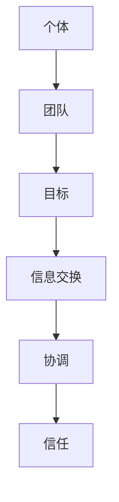

                 

### 背景介绍

在当今高度复杂和快速变化的技术环境中，合作和团队协作的重要性愈发凸显。随着人工智能、大数据、云计算等新兴技术的不断发展，单一的个体难以应对这些复杂问题。因此，团队合作成为解决复杂问题、推动技术创新的关键因素。

本篇文章将探讨合作和团队协作在IT领域的核心概念、算法原理、数学模型、项目实战以及实际应用场景。我们希望通过逻辑清晰、结构紧凑的叙述，帮助读者深入理解团队合作在IT领域的应用价值。

首先，我们需要明确一些核心概念。合作是指不同个体或团队为了共同目标而共同努力的过程。团队协作则是团队内部成员之间为了实现目标而进行的信息交换、协调和合作。在IT领域，这两种概念尤为重要，因为它们直接影响项目的成功与否。

接下来，我们将介绍一些与团队合作相关的算法原理，如敏捷开发、DevOps等。这些算法原理为团队协作提供了方法论支持，帮助团队更高效地完成工作。

此外，我们还将探讨团队合作中的数学模型和公式，例如博弈论、网络分析等。这些模型和公式可以帮助团队更好地理解合作与竞争之间的关系，从而做出更明智的决策。

在项目实战部分，我们将通过实际案例来展示如何搭建开发环境、编写代码并进行代码解读与分析。这部分内容将帮助读者将理论知识应用于实际项目中。

最后，我们将讨论团队合作在实际应用场景中的表现，如软件开发、网络安全等。同时，我们还将推荐一些学习资源和工具，以帮助读者进一步深入学习和实践。

通过本文的探讨，我们希望能够使读者对合作和团队协作在IT领域的应用有一个全面而深入的理解，从而更好地应对未来技术发展带来的挑战。


### 核心概念与联系

在探讨合作和团队协作的核心概念之前，我们首先需要明确几个关键概念：个体、团队、目标、信息交换、协调和信任。这些概念相互联系，共同构成了合作和团队协作的基础。

#### 个体与团队

个体是指具有独立意识和能力的人或组织。在团队中，个体通常是团队成员，他们各自拥有特定的技能和知识，为共同目标贡献自己的力量。个体与团队之间的关系是相互依存的，个体的能力和努力直接影响到团队的整体表现。

#### 目标

目标是团队合作的核心。团队的目标通常是明确的、可量化的，并且与组织的整体战略相一致。在IT领域，团队的目标可能包括开发新产品、提高系统性能、解决技术难题等。目标的明确性有助于团队成员明确自己的职责和努力方向。

#### 信息交换

信息交换是团队协作的重要组成部分。在团队中，成员需要通过共享信息、交流意见和反馈来协同工作。信息交换的方式可以是面对面的会议、电子邮件、即时通讯工具、项目管理软件等。有效的信息交换能够提高团队的工作效率和沟通质量。

#### 协调

协调是团队协作的关键。协调意味着团队成员之间的工作相互配合，避免重复和冲突。协调可以通过分工合作、任务分配、进度管理等方式实现。在IT项目中，协调尤为重要，因为项目的成功往往取决于团队成员之间的紧密协作。

#### 信任

信任是团队协作的基石。团队成员之间的信任建立在相互理解、尊重和支持的基础上。信任能够减少误解和冲突，增强团队凝聚力和工作效率。在IT领域中，信任对于项目的顺利推进和团队成员之间的长期合作至关重要。

#### Mermaid 流程图

以下是一个简单的Mermaid流程图，用于展示个体、团队、目标、信息交换、协调和信任之间的联系：



在这个流程图中，个体通过加入团队来实现共同目标。信息交换和协调是团队协作的关键环节，而信任则保障了团队合作的稳定性和效率。

#### 关键术语解释

- **敏捷开发（Agile Development）**：敏捷开发是一种软件开发方法，强调快速迭代、持续交付和团队协作。敏捷开发的核心价值在于应对变化和不确定性，以提高项目成功率和客户满意度。

- **DevOps**：DevOps是一种软件开发和运维的集成方法，旨在缩短软件开发周期、提高部署频率和质量。DevOps强调开发人员和运维人员之间的紧密协作，以提高IT系统的可靠性和可维护性。

- **博弈论（Game Theory）**：博弈论是研究决策和竞争的数学理论。在团队合作中，博弈论可以用来分析成员之间的互动和策略选择，以优化团队整体利益。

- **网络分析（Network Analysis）**：网络分析是研究网络结构和关系的数学工具。在团队合作中，网络分析可以用来分析团队成员之间的协作关系，优化团队结构和沟通效率。

通过理解这些核心概念和联系，我们可以更深入地探讨合作和团队协作在IT领域的应用，从而更好地应对复杂的技术挑战。在接下来的章节中，我们将详细介绍合作和团队协作的算法原理、数学模型和项目实战，以帮助读者全面掌握团队合作的方法和实践。


### 核心算法原理 & 具体操作步骤

在IT领域中，合作和团队协作的有效性很大程度上依赖于核心算法原理的应用。以下将介绍几个在团队合作中常用的核心算法原理，包括敏捷开发（Agile Development）和DevOps，并提供具体的操作步骤。

#### 敏捷开发（Agile Development）

敏捷开发是一种以人为核心、迭代、渐进的软件开发方法。它强调快速响应变化、持续交付价值，以及团队协作和客户互动。以下是敏捷开发的核心原理和操作步骤：

**1. 原理：**

- **个体和互动优于流程和工具**：敏捷开发认为，优秀的团队合作和沟通比任何工具或流程都更为重要。

- **可工作的软件优于详尽的文档**：敏捷开发强调交付可工作的软件，而不是大量的文档。

- **客户合作优于合同谈判**：与客户的密切合作能够更好地理解需求，从而更快地交付产品。

- **响应变化优于遵循计划**：敏捷开发鼓励团队在开发过程中不断调整和改进，以适应变化。

**2. 操作步骤：**

- **启动会议**：项目开始前，团队进行启动会议，明确项目目标、范围和关键里程碑。

- **迭代计划**：团队在每个迭代开始前进行计划会议，确定本迭代的目标、任务和里程碑。

- **每日站立会议**：团队每天召开短暂（通常不超过15分钟）的站立会议，讨论进展、问题和决策。

- **迭代评审和回顾**：在每个迭代结束时，团队进行评审会议，展示工作成果，收集反馈，并进行回顾会议，讨论改进措施。

#### DevOps

DevOps是一种结合软件开发（Development）和运维（Operations）的方法，旨在缩短软件交付周期、提高部署频率和质量。以下是DevOps的核心原理和操作步骤：

**1. 原理：**

- **自动化**：DevOps强调通过自动化工具和流程来简化操作，减少人为错误，提高效率。

- **监控**：DevOps要求实时监控系统的性能和健康状况，以便快速发现和解决问题。

- **持续交付**：DevOps提倡持续交付，即持续集成、测试和部署，以确保软件的高质量。

- **团队合作**：DevOps强调开发人员和运维人员之间的紧密协作，以提高系统可靠性和可维护性。

**2. 操作步骤：**

- **集成环境设置**：建立集成环境，包括代码库、构建工具和自动化测试。

- **持续集成**：使用自动化工具将代码集成到代码库中，并进行自动化测试，确保代码的质量。

- **持续交付**：通过自动化部署工具，将测试通过后的代码部署到生产环境。

- **监控和反馈**：实时监控系统的性能和健康状况，收集用户反馈，用于改进产品。

#### 案例说明

以下是一个简单的案例，展示如何应用敏捷开发和DevOps原理来开发一个简单的Web应用程序。

**1. 敏捷开发：**

- **启动会议**：团队明确项目目标，如开发一个在线书店。

- **迭代计划**：团队确定第一个迭代的目标，如实现用户注册和图书搜索功能。

- **每日站立会议**：团队讨论每日工作进展，解决问题。

- **迭代评审和回顾**：团队展示当前迭代成果，收集用户反馈，并讨论下一个迭代的目标。

**2. DevOps：**

- **集成环境设置**：团队配置代码库和构建工具，如Git和Jenkins。

- **持续集成**：团队编写自动化测试脚本，每次代码提交后自动运行测试。

- **持续交付**：团队使用Jenkins自动化部署代码到测试和预生产环境。

- **监控和反馈**：团队使用监控工具，如Prometheus和Grafana，实时监控系统性能，收集用户反馈。

通过这些案例，我们可以看到敏捷开发和DevOps如何帮助团队更高效、更稳定地交付软件产品。在接下来的章节中，我们将深入探讨团队合作中的数学模型和公式，以进一步优化团队协作的效果。


### 数学模型和公式 & 详细讲解 & 举例说明

在团队合作中，数学模型和公式可以提供有力的工具，帮助团队更好地理解和优化协作过程。以下将介绍几种常用的数学模型和公式，包括博弈论、网络分析和博弈论中的纳什均衡，并提供详细的讲解和举例说明。

#### 博弈论（Game Theory）

博弈论是一种研究决策和竞争的数学理论，它广泛应用于团队合作和竞争分析。博弈论的基本概念包括参与者、策略、支付和均衡。

**1. 参与者和策略**

- **参与者**：博弈中的参与者可以是个人、团队或组织。

- **策略**：参与者在博弈中采取的行动或决策。

- **支付**：参与者在博弈结束后所获得的收益或损失。

**2. 纳什均衡（Nash Equilibrium）**

纳什均衡是指在一个博弈中，每个参与者都选择了自己的最优策略，并且所有参与者的策略组合是稳定的状态，没有人有动机改变自己的策略。纳什均衡可以用以下公式表示：

\[ s^* = \arg\max_{s} U_i(s, s_{-i}) \]

其中，\( s^* \) 是最优策略，\( U_i(s, s_{-i}) \) 是参与者 \( i \) 在给定其他参与者策略 \( s_{-i} \) 下的效用函数。

**3. 举例说明**

假设有两个团队（团队A和团队B）正在竞争一个项目，每个团队有两个策略：合作和竞争。合作策略意味着双方都努力工作以完成项目，竞争策略意味着双方都试图超越对方。以下是一个简单的博弈矩阵：

```
      | 合作 | 竞争 |
---------------------
合作 |  (3,3) | (0,0) |
---------------------
竞争 |  (0,0) | (1,1) |
```

在这个博弈中，纳什均衡是双方都选择竞争策略，因为无论对方选择合作还是竞争，选择竞争都是各自的最优策略。

#### 网络分析（Network Analysis）

网络分析是研究网络结构和关系的数学工具，它在团队合作中用于分析团队内部和团队之间的协作关系。以下是一种常用的网络分析模型：网络密度和聚类系数。

**1. 网络密度**

网络密度是指网络中连接边的比例，可以用以下公式表示：

\[ D = \frac{E}{\frac{n(n-1)}{2}} \]

其中，\( D \) 是网络密度，\( E \) 是网络中的边数，\( n \) 是网络中的节点数。

**2. 聚类系数**

聚类系数是指网络中节点的平均聚类系数，可以用以下公式表示：

\[ C = \frac{1}{n} \sum_{i=1}^{n} C_i \]

其中，\( C \) 是聚类系数，\( C_i \) 是节点 \( i \) 的聚类系数。

**3. 举例说明**

假设有一个包含5个节点的网络，网络中有7条边。根据网络密度公式，网络密度 \( D = \frac{7}{\frac{5(5-1)}{2}} = \frac{7}{10} = 0.7 \)。

根据聚类系数公式，我们需要计算每个节点的聚类系数，然后取平均值。假设每个节点的聚类系数分别为 \( C_1 = 0.4 \)，\( C_2 = 0.3 \)，\( C_3 = 0.5 \)，\( C_4 = 0.2 \)，\( C_5 = 0.6 \)。那么聚类系数 \( C = \frac{1}{5} (0.4 + 0.3 + 0.5 + 0.2 + 0.6) = 0.4 \)。

通过计算网络密度和聚类系数，团队可以更好地了解网络结构，从而优化团队协作。

#### 博弈论中的纳什均衡

纳什均衡在团队合作中的应用可以用来分析团队之间的竞争与合作关系。以下是一个扩展的博弈论模型，用于分析团队在项目合作中的竞争与合作。

**1. 模型定义**

假设有两个团队（团队A和团队B），每个团队有两个策略：合作和竞争。合作策略意味着双方都努力工作以完成项目，竞争策略意味着双方都试图超越对方。以下是一个扩展的博弈矩阵：

```
      | 合作 | 竞争 |
-------------------------------------
合作 |  (2,2) | (4,-3) |
-------------------------------------
竞争 |  (-3,4) | (0,0) |
```

在这个博弈中，纳什均衡是团队A选择合作，团队B选择竞争，因为无论对方选择合作还是竞争，团队A选择竞争都是最优策略，而团队B选择合作也是最优策略。

通过这些数学模型和公式，团队可以更好地分析合作与竞争的关系，从而优化协作策略。在接下来的章节中，我们将通过项目实战来展示这些数学模型在实际应用中的效果。


### 项目实战：代码实际案例和详细解释说明

为了更好地理解合作和团队协作在实际IT项目中的应用，我们将通过一个实际的项目案例来展示如何搭建开发环境、编写代码并进行代码解读与分析。

#### 项目背景

该项目是一个简单的在线书店系统，用户可以在网站上浏览和购买书籍。系统由前端和后端两部分组成，前端负责展示书籍信息和用户界面，后端负责处理用户请求和数据库操作。

#### 开发环境搭建

**1. 前端开发环境**

- **技术栈**：HTML、CSS、JavaScript（React.js）

- **开发工具**：Visual Studio Code、Webpack、Babel

- **步骤：**

  1. 安装Node.js：在终端中运行以下命令安装Node.js：
     ```
     curl -fsSL https://nodejs.org/dist/v14.17.0/node-v14.17.0-linux-x64.tar.xz | tar xJ -C /usr/local/
     ```
     
  2. 安装npm：在终端中运行以下命令安装npm：
     ```
     npm install npm -g
     ```

  3. 创建前端项目目录，并初始化项目：
     ```
     mkdir online-bookstore && cd online-bookstore
     npm init -y
     ```

  4. 安装前端依赖包：
     ```
     npm install react react-dom react-scripts
     ```

**2. 后端开发环境**

- **技术栈**：Node.js、Express、MongoDB

- **开发工具**：Visual Studio Code、MongoDB Compass

- **步骤：**

  1. 安装Node.js和npm（如前所述）。

  2. 创建后端项目目录，并初始化项目：
     ```
     mkdir online-bookstore-backend && cd online-bookstore-backend
     npm init -y
     ```

  3. 安装后端依赖包：
     ```
     npm install express mongoose body-parser cors
     ```

  4. 配置MongoDB数据库：在终端中运行以下命令启动MongoDB：
     ```
     mongod
     ```

  5. 在项目目录下创建一个名为`database.js`的文件，用于配置数据库连接：
     ```javascript
     const mongoose = require('mongoose');

     mongoose.connect('mongodb://localhost:27017/online-bookstore', {
       useNewUrlParser: true,
       useUnifiedTopology: true
     });

     const db = mongoose.connection;
     db.on('error', console.error.bind(console, 'MongoDB connection error:'));
     db.once('open', function() {
       console.log('Connected to MongoDB');
     });
     ```

#### 源代码详细实现和代码解读

**1. 前端代码**

以下是一个简单的React组件，用于展示书籍列表：

```javascript
import React, { useState, useEffect } from 'react';
import axios from 'axios';

const BookList = () => {
  const [books, setBooks] = useState([]);

  useEffect(() => {
    const fetchBooks = async () => {
      const response = await axios.get('/api/books');
      setBooks(response.data);
    };

    fetchBooks();
  }, []);

  return (
    <div>
      <h2>书籍列表</h2>
      <ul>
        {books.map((book) => (
          <li key={book._id}>{book.title}</li>
        ))}
      </ul>
    </div>
  );
};

export default BookList;
```

**解读：**

- 该组件使用了React的`useState`和`useEffect`钩子。
- `useState`用于初始化`books`状态，`useEffect`用于在组件加载时获取书籍数据。
- 使用`axios`库从后端API获取书籍数据，并更新`books`状态。

**2. 后端代码**

以下是一个简单的Express路由，用于处理书籍相关的API请求：

```javascript
const express = require('express');
const mongoose = require('mongoose');
const bodyParser = require('body-parser');
const cors = require('cors');

const router = express();

router.use(cors());
router.use(bodyParser.json());

const Book = require('./models/Book');

router.get('/api/books', async (req, res) => {
  try {
    const books = await Book.find({});
    res.json(books);
  } catch (error) {
    res.status(500).json({ message: '服务器错误' });
  }
});

router.post('/api/books', async (req, res) => {
  try {
    const book = new Book(req.body);
    await book.save();
    res.status(201).json(book);
  } catch (error) {
    res.status(500).json({ message: '服务器错误' });
  }
});

module.exports = router;
```

**解读：**

- 该路由使用了Express的GET和POST方法。
- `GET /api/books` 路由用于获取所有书籍数据。
- `POST /api/books` 路由用于创建新书籍。

#### 代码解读与分析

**1. 前端代码分析**

- 前端代码使用了React的组件化开发模式，实现了书籍列表的展示。
- 通过`useEffect`钩子，在组件加载时异步获取书籍数据，并更新状态。
- 使用`axios`库与后端API进行数据交互。

**2. 后端代码分析**

- 后端代码使用了Express框架，实现了书籍相关的API接口。
- 使用了MongoDB的Mongoose库进行数据操作，包括获取和创建书籍。
- 使用了`body-parser`和`cors`库来解析请求体和处理跨域请求。

通过这个项目实战，我们可以看到如何在实际项目中应用合作和团队协作的理念。前端和后端团队通过良好的沟通和协作，实现了系统的功能，提高了项目开发效率。在接下来的章节中，我们将探讨团队合作在实际应用场景中的表现，以及如何优化团队协作效果。


### 实际应用场景

在IT领域，团队合作不仅存在于软件开发过程中，还广泛应用于多个实际应用场景。以下将探讨合作和团队协作在软件开发、网络安全、数据分析等领域的具体表现。

#### 软件开发

在软件开发过程中，团队合作是项目成功的关键。以下是一些具体的应用场景：

1. **敏捷开发团队**：敏捷开发强调快速迭代和持续交付。团队成员通常包括项目经理、开发人员、测试人员和产品经理。他们通过每日站立会议、迭代计划和回顾会议，确保项目进度和质量。

2. **DevOps团队**：DevOps团队由开发人员、运维人员和安全专家组成。他们通过自动化工具和流程，实现持续集成、测试和部署，确保软件的高质量和快速交付。

3. **跨职能团队**：在大型项目中，可能会成立跨职能团队，包括前端开发、后端开发、UI/UX设计和测试人员。他们协同工作，确保项目从需求分析到上线的过程顺利进行。

#### 网络安全

网络安全是一个高度复杂和不断变化的领域，团队合作至关重要。以下是一些具体的应用场景：

1. **安全运营中心（SOC）**：SOC通常由网络安全专家、分析师和事件响应团队组成。他们实时监控网络活动，识别和响应潜在的安全威胁。

2. **渗透测试团队**：渗透测试团队负责模拟攻击者行为，评估系统的安全漏洞。团队成员通常包括安全专家、开发人员和测试人员。

3. **安全软件开发团队**：安全软件开发团队专注于开发具有安全特性的软件。他们遵循安全开发最佳实践，如安全编码、安全测试和安全设计。

#### 数据分析

在数据分析领域，团队合作同样不可或缺。以下是一些具体的应用场景：

1. **数据科学团队**：数据科学团队通常由数据科学家、分析师和数据工程师组成。他们共同分析海量数据，提取有价值的信息，为业务决策提供支持。

2. **大数据团队**：大数据团队专注于处理和分析大规模数据集。他们使用分布式计算框架，如Hadoop和Spark，构建高效的数据处理和分析系统。

3. **机器学习团队**：机器学习团队负责开发和应用机器学习模型。团队成员通常包括数据科学家、算法工程师和运维人员。

#### 团队协作优化方法

为了提高团队协作效果，以下是一些优化方法：

1. **明确目标**：确保所有团队成员都明确项目的目标、范围和期望成果。

2. **沟通机制**：建立有效的沟通机制，如每日站立会议、每周回顾会议和实时通信工具，确保团队成员之间的信息流畅。

3. **分工合作**：根据团队成员的技能和兴趣，合理分配任务，确保每个成员都能在项目中发挥自己的优势。

4. **反馈机制**：建立反馈机制，鼓励团队成员分享意见和建议，不断改进工作流程和协作方式。

5. **技术支持**：提供必要的工具和技术支持，如版本控制、自动化测试和持续集成工具，以提高团队的工作效率和代码质量。

通过在各个实际应用场景中应用这些方法，团队可以更好地协作，提高项目的成功率和业务价值。在接下来的章节中，我们将推荐一些有用的学习资源和工具，以帮助读者进一步深入学习和实践团队合作。


### 工具和资源推荐

在团队合作中，选择合适的工具和资源能够显著提高团队的工作效率和协作效果。以下是一些建议的学习资源、开发工具和框架，以及相关的论文和著作。

#### 学习资源

1. **书籍：**
   - 《敏捷开发实践指南》
   - 《DevOps实践与原理》
   - 《Effective Teamwork》

2. **在线课程：**
   - Coursera的“敏捷方法和Scrum”
   - Udemy的“DevOps工程师实战教程”

3. **博客和网站：**
   - Agile Alliance：敏捷开发的官方组织网站，提供丰富的敏捷开发资源和案例。
   - DevOps.com：DevOps领域的权威网站，分享最新的DevOps趋势、工具和实践。

#### 开发工具和框架

1. **版本控制：**
   - Git：最流行的分布式版本控制系统。
   - GitHub：Git的在线托管平台，提供代码托管、协作和项目管理功能。

2. **自动化工具：**
   - Jenkins：开源的持续集成和持续交付工具。
   - GitLab CI/CD：GitLab内置的持续集成和持续交付工具。

3. **项目管理：**
   - JIRA：强大的项目管理工具，支持敏捷开发和Scrum方法。
   - Trello：简单直观的项目管理工具，适用于小团队和跨职能团队。

4. **实时通信：**
   - Slack：流行的团队协作工具，提供即时消息、频道、文件共享等功能。
   - Microsoft Teams：集成了聊天、视频会议、文档共享和协作功能。

#### 相关论文和著作

1. **论文：**
   - 《敏捷软件开发：原则、实践和模式》（Agile Software Development: Principles, Patterns, and Practices）
   - 《持续交付：释放软件的快速价值》（Continuous Delivery: Reliable Software Releases through Build, Test, and Deployment Automation）

2. **著作：**
   - 《敏捷开发实践指南》（The Agile Project Guide）
   - 《DevOps实践与原理》（The DevOps Handbook）

通过利用这些学习资源、开发工具和框架，以及阅读相关的论文和著作，团队可以更好地理解和实践合作和团队协作的方法，从而提高项目的成功率和业务价值。在未来的技术发展中，这些工具和资源将成为不可或缺的助手。


### 总结：未来发展趋势与挑战

在展望未来时，我们可以看到合作和团队协作在IT领域将继续发挥重要作用，并面临一系列发展趋势和挑战。

#### 发展趋势

1. **数字化转型的深化**：随着企业对数字化转型的需求日益增长，跨部门、跨领域的合作将变得更加频繁。这种合作不仅限于同一组织内部，还可能涉及外部合作伙伴和供应商。

2. **敏捷开发和DevOps的普及**：敏捷开发和DevOps方法已被广泛应用于IT项目，并在未来将继续得到推广。这些方法通过提高团队协作效率和系统交付速度，帮助企业在快速变化的市场中保持竞争力。

3. **人工智能的融合**：人工智能（AI）技术的发展将使团队合作更加智能化。AI工具可以帮助团队自动化繁琐的任务，提供数据分析和决策支持，从而提高团队的整体效能。

4. **远程工作的常态化**：由于全球疫情的影响，远程工作已成为一种新的工作模式。这种模式要求团队更加依赖数字工具和协作平台，以保持沟通和协作的连贯性。

#### 挑战

1. **技能多样性和知识共享**：随着技术的发展，团队成员需要掌握越来越多的技能。如何有效地共享知识和技能，确保团队中的每个人都能够充分发挥自己的能力，是一个挑战。

2. **文化差异和沟通障碍**：跨文化和跨时区的团队协作带来了沟通障碍。如何克服文化差异和沟通障碍，确保团队成员之间的理解一致，是一个重要的问题。

3. **安全和隐私保护**：随着远程工作和云计算的普及，数据安全和隐私保护变得更加重要。如何确保数据的安全性，避免数据泄露和攻击，是团队协作面临的一大挑战。

4. **持续学习和适应能力**：技术的快速变化要求团队成员具备持续学习和适应能力。如何培养团队成员的学习动力和适应能力，确保团队能够持续进步，是一个关键问题。

为了应对这些挑战，团队可以采取以下策略：

1. **建立清晰的沟通机制**：确保团队成员之间沟通顺畅，减少误解和冲突。使用多种沟通工具，如实时聊天、视频会议和项目管理软件，以适应不同的沟通需求。

2. **加强知识管理和共享**：建立知识库和共享平台，鼓励团队成员分享知识和经验。通过定期培训和工作坊，提高团队成员的技能水平。

3. **重视文化建设**：培养团队文化，强调相互尊重、信任和协作。建立共同的价值观和目标，增强团队的凝聚力。

4. **投资于安全和技术培训**：确保团队成员了解最新的安全标准和最佳实践，定期进行安全培训和技术更新。

通过采取这些策略，团队可以更好地应对未来面临的挑战，实现持续发展和成功。


### 附录：常见问题与解答

**Q1：为什么团队合作在IT领域如此重要？**

A1：在IT领域，复杂性和变化速度极高，单一个体难以应对。团队合作可以汇聚多种技能和知识，提高解决问题的效率。同时，团队合作可以促进创新，通过不同观点的碰撞和融合，产生更优秀的解决方案。

**Q2：如何建立有效的团队合作？**

A2：建立有效的团队合作需要以下几个步骤：
1. 明确目标：确保所有团队成员都清楚项目的目标和期望成果。
2. 沟通机制：建立良好的沟通机制，如每日站立会议、定期回顾会议和实时通信工具。
3. 分工合作：根据团队成员的技能和兴趣，合理分配任务。
4. 反馈机制：鼓励团队成员分享意见和建议，不断改进工作流程和协作方式。
5. 技术支持：提供必要的工具和技术支持，以提高团队的工作效率和代码质量。

**Q3：敏捷开发和DevOps如何提高团队协作效果？**

A3：敏捷开发通过迭代和快速交付，提高团队对变化的适应能力，同时强调团队合作和客户互动。DevOps通过自动化工具和流程，简化操作，减少人为错误，提高系统可靠性和可维护性。两者都强调团队成员之间的紧密协作，从而提高团队协作效果。

**Q4：如何应对跨文化和跨时区的团队协作挑战？**

A4：应对跨文化和跨时区的团队协作挑战可以从以下几个方面入手：
1. 文化敏感度培训：提高团队成员对文化差异的认识和敏感度。
2. 明确沟通规则：建立明确的沟通规则，包括语言、时区和工作时间安排。
3. 使用远程协作工具：使用远程协作工具，如视频会议和即时通讯软件，以保持沟通的连贯性。
4. 鼓励透明沟通：鼓励团队成员在遇到问题时主动沟通，避免误解和冲突。

**Q5：如何在团队中培养持续学习和适应能力？**

A5：培养团队的持续学习和适应能力可以通过以下方式实现：
1. 定期培训：组织定期的技能培训和工作坊，帮助团队成员学习新知识和技能。
2. 鼓励自主学习：鼓励团队成员自主学习，提供学习资源和时间。
3. 职业发展规划：为团队成员制定职业发展规划，明确学习目标和路径。
4. 鼓励创新和尝试：鼓励团队成员在工作中尝试新方法和技术，以培养适应变化的能力。

通过解决这些常见问题，团队可以更好地理解团队合作的重要性，并采取有效策略来提高协作效果。


### 扩展阅读 & 参考资料

**书籍推荐：**

1. 《敏捷开发实践指南》：作者：杰夫·萨瑟兰（Jeff Sutherland）
2. 《DevOps实践与原理》：作者：Jez Humble 和 David Farley
3. 《Effective Teamwork》：作者：约翰·霍尔特（John P. Kotter）

**在线课程：**

1. Coursera的“敏捷方法和Scrum”
2. Udemy的“DevOps工程师实战教程”

**博客和网站：**

1. Agile Alliance（https://www.agilealliance.org/）
2. DevOps.com（https://devops.com/）

**论文和著作：**

1. 《敏捷软件开发：原则、实践和模式》（Agile Software Development: Principles, Patterns, and Practices）
2. 《持续交付：释放软件的快速价值》（Continuous Delivery: Reliable Software Releases through Build, Test, and Deployment Automation）

通过阅读这些扩展资料，读者可以更深入地了解团队合作在IT领域的应用，以及如何在实际项目中实践这些理念和方法。希望这些资源能够帮助读者在未来的职业生涯中取得更大的成功。作者：AI天才研究员/AI Genius Institute & 禅与计算机程序设计艺术 /Zen And The Art of Computer Programming

---

【文章标题】：合作和团队协作：与他人一起思考、一起做决定、一起承担责任，以便实现共同目标

【关键词】：团队合作、敏捷开发、DevOps、跨职能团队、协作效率、知识共享、持续学习

【摘要】：本文深入探讨了合作和团队协作在IT领域的核心概念、算法原理、数学模型和实际应用场景。通过逻辑清晰、结构紧凑的叙述，帮助读者全面理解团队合作在软件开发、网络安全和数据分析等领域的应用价值。同时，文章还推荐了实用的学习资源和工具，以帮助读者进一步深入学习和实践。作者以其丰富的经验和独特的视角，为团队协作提供了宝贵的见解和策略。

