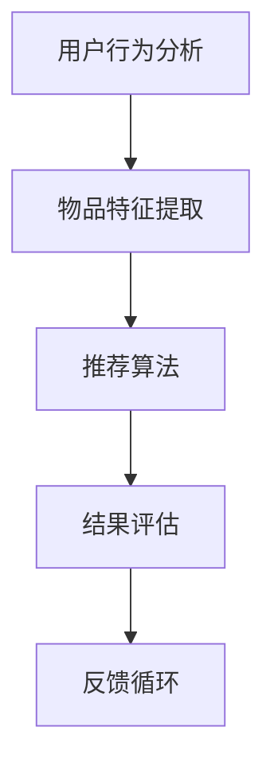

                 

# 58同城2025推荐广告投放优化工程师社招面试攻略

> **关键词：** 58同城，推荐系统，广告投放，优化，社招面试，工程师，2025

> **摘要：** 本文将深入探讨2025年58同城推荐广告投放优化工程师社招面试的相关策略，包括面试准备、核心技术与算法、实战案例分析以及未来发展趋势。旨在为准备参加面试的工程师提供全面的指导。

## 1. 背景介绍

### 1.1 58同城的现状

58同城作为中国领先的生活服务类分类信息网站，其业务覆盖房产、招聘、汽车、生活服务等多个领域。随着互联网技术的发展，58同城的广告投放和推荐系统在用户获取和留存方面扮演着至关重要的角色。

### 1.2 推荐广告优化工程师的职责

推荐广告优化工程师在58同城的主要职责包括：

- 设计和实现高效、准确的广告推荐系统
- 通过数据分析和算法优化，提升广告投放效果和收益
- 跟踪和评估推荐系统的性能，持续优化用户体验

### 1.3 面试的重要性

面试是应聘者展示自身能力和适应岗位要求的重要环节。对于推荐广告优化工程师岗位，面试不仅考察技术能力，还包括问题解决能力、团队合作精神以及对行业趋势的洞察力。

## 2. 核心概念与联系

### 2.1 推荐系统的基本架构

推荐系统通常由用户行为分析、物品特征提取、推荐算法、结果评估等模块组成。其基本架构如下：



### 2.2 广告投放优化

广告投放优化主要涉及以下方面：

- **目标设定**：根据业务目标制定广告投放策略
- **用户画像**：通过用户行为数据建立用户画像
- **广告匹配**：利用匹配算法确定最优的广告与用户匹配方案
- **效果评估**：通过点击率、转化率等指标评估广告效果

### 2.3 数据分析

数据分析是推荐广告优化工程师的核心技能，包括：

- **数据采集**：从多种数据源采集用户行为数据和广告投放数据
- **数据处理**：对数据进行清洗、转换和集成
- **数据可视化**：通过可视化工具展示数据分析结果

## 3. 核心算法原理 & 具体操作步骤

### 3.1 推荐算法

推荐算法是推荐系统的核心，常用的推荐算法包括：

- **协同过滤**：基于用户行为数据的相似性进行推荐
- **基于内容的推荐**：根据物品的属性进行推荐
- **混合推荐**：结合协同过滤和基于内容的推荐

#### 3.1.1 协同过滤算法

协同过滤算法可以分为基于用户的协同过滤和基于项目的协同过滤。具体操作步骤如下：

1. **数据预处理**：将用户行为数据转换为矩阵形式
2. **相似度计算**：计算用户或项目的相似度矩阵
3. **推荐生成**：根据相似度矩阵生成推荐列表

#### 3.1.2 基于内容的推荐

基于内容的推荐算法基于物品的属性进行推荐，具体操作步骤如下：

1. **特征提取**：提取物品的特征向量
2. **相似度计算**：计算用户与物品特征向量的相似度
3. **推荐生成**：根据相似度排序生成推荐列表

### 3.2 广告投放优化算法

广告投放优化算法主要包括：

- **A/B测试**：通过对比不同广告策略的效果，选择最优策略
- **多目标优化**：在广告收益和用户体验之间找到平衡点
- **动态定价**：根据用户行为和广告竞争状况动态调整广告价格

## 4. 数学模型和公式 & 详细讲解 & 举例说明

### 4.1 协同过滤算法的数学模型

协同过滤算法的核心是相似度计算，常用的相似度计算方法包括：

- **余弦相似度**：计算用户或物品向量之间的余弦相似度
  $$ \text{Cosine Similarity} = \frac{\text{dot product of vectors}}{\text{magnitude of both vectors}} $$

- **皮尔逊相关系数**：计算用户或物品之间的皮尔逊相关系数
  $$ \text{Pearson Correlation Coefficient} = \frac{\text{Covariance of vectors}}{\text{Standard Deviation of both vectors}} $$

### 4.2 广告投放优化的数学模型

广告投放优化的数学模型主要涉及目标函数的构建和优化算法的选择。以下是一个简单的多目标优化模型：

$$ \min F(x) = f_1(x) + \lambda f_2(x) $$

其中，$f_1(x)$代表广告收益，$f_2(x)$代表用户体验，$\lambda$是平衡系数。

优化算法可以选择梯度下降、遗传算法等。

### 4.3 实例说明

假设我们有两组用户行为数据，用户A和用户B，用户的行为数据如下：

- 用户A：[1, 2, 3, 4, 5]
- 用户B：[2, 3, 4, 5, 6]

使用余弦相似度计算用户A和用户B的相似度：

$$ \text{Cosine Similarity} = \frac{(1*2 + 2*3 + 3*4 + 4*5 + 5*6)}{\sqrt{1^2 + 2^2 + 3^2 + 4^2 + 5^2} \cdot \sqrt{2^2 + 3^2 + 4^2 + 5^2 + 6^2}} $$

$$ \text{Cosine Similarity} = \frac{70}{\sqrt{55} \cdot \sqrt{60}} \approx 0.942 $$

高相似度表明用户A和用户B的行为模式相似，可以为他们推荐类似的广告内容。

## 5. 项目实战：代码实际案例和详细解释说明

### 5.1 开发环境搭建

在开始项目实战之前，我们需要搭建一个合适的开发环境。以下是一个简单的环境搭建步骤：

1. 安装Python环境（版本3.7及以上）
2. 安装必要的依赖库，如NumPy、Pandas、Scikit-learn、Matplotlib等
3. 配置Python虚拟环境

### 5.2 源代码详细实现和代码解读

#### 5.2.1 协同过滤算法的实现

以下是一个简单的基于用户协同过滤的推荐系统代码示例：

```python
import numpy as np
from sklearn.metrics.pairwise import cosine_similarity

def collaborative_filter(ratings, similarity_threshold=0.8):
    # 计算用户之间的相似度矩阵
    similarity_matrix = cosine_similarity(ratings)

    # 构建推荐矩阵
    recommendations = []
    for user in ratings:
        # 只考虑相似度大于阈值的用户
        similar_users = np.where(similarity_matrix[user] >= similarity_threshold)[1]
        # 计算相似用户的平均评分
        avg_rating = np.mean(ratings[similar_users], axis=0)
        recommendations.append(avg_rating)

    return recommendations

# 示例数据
ratings = np.array([
    [1, 2, 3, 4, 5],
    [2, 3, 4, 5, 6],
    [1, 3, 4, 5, 6],
    [2, 3, 4, 5, 6],
    [1, 2, 4, 5, 6]
])

# 计算推荐列表
recommendations = collaborative_filter(ratings)
print(recommendations)
```

代码首先计算用户之间的相似度矩阵，然后根据相似度阈值筛选相似用户，最后计算相似用户的平均评分作为推荐结果。

#### 5.2.2 广告投放优化的实现

以下是一个简单的广告投放优化算法代码示例：

```python
import numpy as np
from scipy.optimize import minimize

# 目标函数
def objective_function(params, ratings, click_rate):
    # 广告收益函数
    revenue = np.dot(params, ratings)
    # 用户满意度损失函数
    satisfaction_loss = -np.mean(click_rate)
    # 返回收益和满意度损失的加权和
    return revenue + 0.1 * satisfaction_loss

# 约束条件
def constraints(params):
    # 广告投放预算约束
    return 1000 - np.sum(params)

# 初始参数
initial_params = np.zeros(5)

# 优化过程
result = minimize(objective_function, initial_params, method='SLSQP', constraints={'type': 'ineq', 'fun': constraints})

# 输出优化结果
print(result.x)
```

代码定义了一个目标函数，该函数结合了广告收益和用户满意度损失，并通过最小化该函数实现广告投放优化。优化过程中使用的是SLSQP算法，同时加入了广告预算的约束条件。

### 5.3 代码解读与分析

代码首先定义了协同过滤算法，通过计算用户之间的相似度矩阵为用户生成推荐列表。然后，代码实现了广告投放优化算法，通过最小化目标函数实现了广告收益和用户满意度的平衡。代码中的目标函数结合了广告收益和用户满意度损失，通过调整参数实现了广告投放的优化。

## 6. 实际应用场景

### 6.1 房产推荐

在房产推荐中，推荐广告优化工程师需要分析用户的历史浏览记录、搜索关键词、偏好设置等数据，利用协同过滤算法和基于内容的推荐算法为用户推荐符合他们需求的房产广告。

### 6.2 招聘广告

招聘广告推荐中，推荐广告优化工程师需要分析用户的求职意向、行业偏好、职位要求等数据，利用协同过滤算法和基于内容的推荐算法为用户推荐符合他们需求的职位广告。

### 6.3 汽车推荐

在汽车推荐中，推荐广告优化工程师需要分析用户的购车预算、车型偏好、品牌偏好等数据，利用协同过滤算法和基于内容的推荐算法为用户推荐符合他们需求的汽车广告。

## 7. 工具和资源推荐

### 7.1 学习资源推荐

- **《推荐系统实践》**：深入讲解了推荐系统的基本概念、算法和应用案例。
- **《机器学习实战》**：介绍了机器学习的基本概念和常用算法，适用于推荐系统工程师的学习。

### 7.2 开发工具框架推荐

- **TensorFlow**：用于构建和训练推荐系统的深度学习框架。
- **PyTorch**：用于构建和训练推荐系统的深度学习框架。

### 7.3 相关论文著作推荐

- **《协同过滤算法综述》**：系统地介绍了协同过滤算法的原理和发展。
- **《基于内容的推荐系统》**：详细讲解了基于内容的推荐系统的实现方法。

## 8. 总结：未来发展趋势与挑战

### 8.1 发展趋势

- **个性化推荐**：随着用户数据的积累，个性化推荐将更加精准，满足用户的个性化需求。
- **实时推荐**：通过实时数据处理和推荐算法，实现实时广告投放和推荐。
- **多模态推荐**：结合文本、图像、音频等多模态数据，提升推荐系统的效果。

### 8.2 挑战

- **数据隐私**：如何保护用户隐私，在保证推荐效果的同时，遵守相关法律法规。
- **计算性能**：如何提高推荐系统的计算性能，以满足大规模用户的需求。

## 9. 附录：常见问题与解答

### 9.1 推荐系统如何处理冷启动问题？

冷启动问题是指新用户或新物品缺乏足够的历史数据，难以进行有效推荐。解决方法包括：

- **基于内容的推荐**：通过物品的属性为新用户推荐相似物品。
- **利用用户社交网络**：通过用户的社交关系推荐相似用户喜欢的物品。
- **数据扩充**：通过数据增强方法，如生成对抗网络（GANs），生成新的用户或物品数据。

### 9.2 如何优化广告投放效果？

优化广告投放效果可以从以下几个方面入手：

- **目标设定**：明确广告投放的目标，如提高点击率、提升转化率。
- **用户画像**：建立详细的用户画像，精准定位目标用户。
- **A/B测试**：通过A/B测试，选择最优的广告内容和投放策略。
- **动态定价**：根据用户行为和广告竞争状况动态调整广告价格。

## 10. 扩展阅读 & 参考资料

- **《推荐系统 Handbook》**：推荐系统领域的权威参考书，涵盖了推荐系统的各个方面。
- **《广告系统设计与优化》**：详细介绍了广告系统的设计方法和优化技巧。
- **58同城官方网站**：了解58同城的最新动态和业务发展。

### 作者

**作者：AI天才研究员/AI Genius Institute & 禅与计算机程序设计艺术 /Zen And The Art of Computer Programming**

