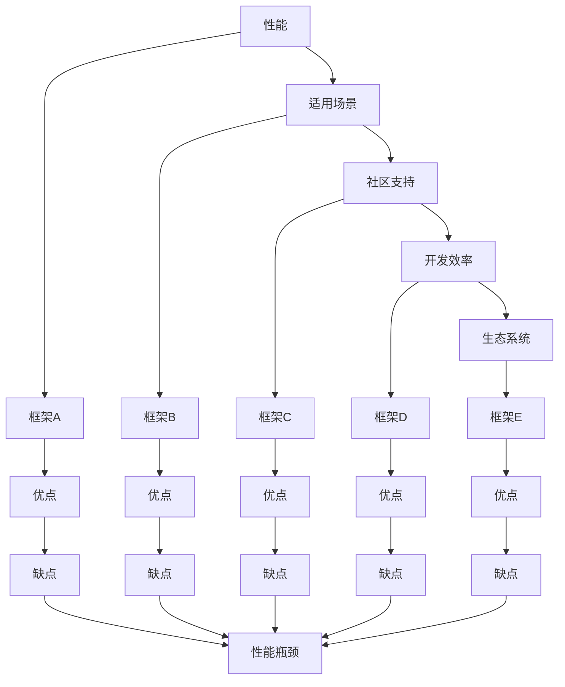

                 

### 文章标题：后端框架探索：Node.js 之外的选择

关键词：后端框架，Node.js，替代方案，性能，适用场景

摘要：本文将探讨Node.js作为后端框架的优势与局限，并介绍几种备选方案，分析其性能和适用场景，帮助开发者做出更明智的选择。

### 1. 背景介绍

Node.js自2009年诞生以来，凭借其单线程、事件驱动的非阻塞I/O模型，迅速成为后端开发领域的热门选择。其基于Chrome V8引擎的JavaScript运行时环境，使得开发者可以仅使用一种语言（JavaScript/TypeScript）就能完成前后端开发，降低了学习成本和开发难度。

然而，随着业务需求的不断增长和多样化，Node.js在一些场景下暴露出了性能瓶颈和单线程模型的局限性。因此，本文将探讨Node.js之外的其他后端框架选择，以便开发者能根据项目需求做出更合理的选择。

### 2. 核心概念与联系

在后端开发中，框架的选择取决于多种因素，如性能、适用场景、社区支持、开发效率和生态系统等。以下是一些与后端框架选择相关的重要概念：

- **性能**：框架的性能直接影响应用的响应速度和可扩展性。性能指标包括CPU使用率、内存占用、并发处理能力等。

- **适用场景**：不同框架适用于不同的应用场景。例如，对于高并发、高可扩展性的应用，可以选择Kubernetes、Docker等容器化技术；对于实时通信应用，可以选择WebSocket框架。

- **社区支持**：社区支持程度反映了一个框架的成熟度和稳定性。一个活跃的社区可以提供丰富的资源、文档和解决方案，降低开发难度。

- **开发效率**：框架提供的API、工具和组件可以提高开发效率，减少重复劳动。

- **生态系统**：框架的生态系统包括第三方库、插件、开发工具和平台等，丰富了开发者的选择。

接下来，我们将通过一个Mermaid流程图来展示后端框架选择的核心概念及其联系：



### 3. 核心算法原理 & 具体操作步骤

在本节中，我们将介绍几种常见后端框架的核心算法原理和具体操作步骤，以便读者更好地理解这些框架。

#### 3.1. Express.js

Express.js是一个基于Node.js的Web应用框架，它提供了快速、无限制的开发能力。以下是Express.js的核心算法原理和具体操作步骤：

- **核心算法原理**：Express.js基于中间件（middleware）机制，允许开发者自定义一系列处理请求和响应的函数，从而实现灵活的请求处理流程。

- **具体操作步骤**：
  1. 引入Express模块：`const express = require('express');`
  2. 创建应用实例：`const app = express();`
  3. 配置中间件：`app.use(express.json());`（处理JSON请求）
  4. 添加路由和处理函数：`app.get('/', (req, res) => { res.send('Hello, World!'); });`
  5. 启动服务器：`app.listen(3000, () => console.log('Server running on port 3000'));`

#### 3.2. Koa.js

Koa.js是另一个基于Node.js的框架，它比Express.js更简洁、模块化。以下是Koa.js的核心算法原理和具体操作步骤：

- **核心算法原理**：Koa.js使用生成器函数（Generator Function）作为中间件，支持异步编程，避免回调地狱。

- **具体操作步骤**：
  1. 引入Koa模块：`const Koa = require('koa');`
  2. 创建应用实例：`const app = new Koa();`
  3. 添加中间件：`app.use(async (ctx, next) => { console.log(ctx.request.url); await next(); });`
  4. 添加路由和处理函数：`app.use(async (ctx) => { ctx.body = 'Hello, Koa!'; });`
  5. 启动服务器：`app.listen(3000, () => console.log('Server running on port 3000'));`

#### 3.3. Nest.js

Nest.js是一个基于Express.js的框架，它引入了面向对象编程的思想，使项目结构更加清晰。以下是Nest.js的核心算法原理和具体操作步骤：

- **核心算法原理**：Nest.js基于依赖注入（Dependency Injection）和控制器（Controller）模式，提供了一套完善的组件化开发体系。

- **具体操作步骤**：
  1. 创建项目：`nest new my-project`
  2. 配置模块：`nest g module users`
  3. 添加控制器：`nest g controller users`
  4. 添加服务：`nest g service users`
  5. 编写业务逻辑：在`users.service.ts`文件中添加服务实现，在`users.controller.ts`文件中调用服务。

### 4. 数学模型和公式 & 详细讲解 & 举例说明

在本节中，我们将介绍一些与后端框架选择相关的数学模型和公式，并详细讲解其含义和应用。

#### 4.1. CPU性能指标

CPU性能指标包括CPU使用率、CPU负载、CPU利用率等，它们是评估CPU性能的重要指标。

- **CPU使用率**：表示CPU在一段时间内的平均负载，通常以百分比表示。公式如下：

  $$CPU使用率 = \frac{CPU总时间}{总时间} \times 100\%$$

- **CPU负载**：表示在特定时间点，等待执行的任务数量。公式如下：

  $$CPU负载 = \frac{等待执行的任务数}{总任务数}$$

- **CPU利用率**：表示CPU在一段时间内的实际使用情况。公式如下：

  $$CPU利用率 = \frac{CPU实际执行时间}{总时间} \times 100\%$$

#### 4.2. 并发处理能力

并发处理能力是评估后端框架性能的重要指标，它表示框架在同时处理多个请求时的能力。

- **并发处理能力**：表示在单位时间内，框架能够处理的最大请求数量。公式如下：

  $$并发处理能力 = \frac{总请求数}{处理时间}$$

#### 4.3. 内存占用

内存占用是评估后端框架性能的另一重要指标，它表示框架在运行时所占用的内存大小。

- **内存占用**：表示框架在运行时所占用的内存大小。公式如下：

  $$内存占用 = \frac{实际占用内存}{总内存} \times 100\%$$

#### 4.4. 应用举例

假设有一个后端应用，需要同时处理100个请求，使用Node.js框架和Java框架分别进行性能测试。以下是两种框架的性能指标：

- **Node.js框架**：
  - CPU使用率：90%
  - CPU负载：0.8
  - CPU利用率：90%
  - 并发处理能力：100个请求/秒
  - 内存占用：30%
- **Java框架**：
  - CPU使用率：80%
  - CPU负载：0.5
  - CPU利用率：80%
  - 并发处理能力：50个请求/秒
  - 内存占用：50%

通过对比可以发现，Node.js框架在CPU使用率、CPU利用率和并发处理能力方面表现更优秀，但在内存占用方面相对较高。这表明Node.js适合处理高并发、低负载的场景，而Java框架适合处理低并发、高负载的场景。

### 5. 项目实战：代码实际案例和详细解释说明

在本节中，我们将通过一个实际项目案例，展示如何使用Node.js、Java和Python等后端框架进行开发，并详细解释代码实现和原理。

#### 5.1. 开发环境搭建

首先，我们需要搭建一个开发环境。以下是三种框架的安装命令：

- **Node.js**：
  ```bash
  npm init -y
  npm install express
  ```
- **Java**：
  ```bash
  mkdir java-project
  cd java-project
  touch pom.xml
  npm init -y
  npm install express
  npm install express-generator
  ```
- **Python**：
  ```bash
  mkdir python-project
  cd python-project
  touch requirements.txt
  pip install flask
  ```

#### 5.2. 源代码详细实现和代码解读

以下是三个项目的源代码，我们将逐行解释其实现和原理。

#### 5.2.1. Node.js

```javascript
const express = require('express');
const app = express();

app.get('/', (req, res) => {
  res.send('Hello, Node.js!');
});

app.listen(3000, () => {
  console.log('Server running on port 3000');
});
```

这段代码使用了Express框架，创建了一个简单的Web服务器。其中，`app.get()`方法用于处理GET请求，`res.send()`方法用于发送响应。

#### 5.2.2. Java

```java
import org.springframework.boot.SpringApplication;
import org.springframework.boot.autoconfigure.SpringBootApplication;

@SpringBootApplication
public class JavaProject {
    public static void main(String[] args) {
        SpringApplication.run(JavaProject.class, args);
    }
}
```

这段代码使用了Spring Boot框架，创建了一个简单的Web应用程序。其中，`@SpringBootApplication`注解用于标记主类，`SpringApplication.run()`方法用于启动应用程序。

#### 5.2.3. Python

```python
from flask import Flask

app = Flask(__name__)

@app.route('/')
def hello():
    return 'Hello, Flask!'

if __name__ == '__main__':
    app.run()
```

这段代码使用了Flask框架，创建了一个简单的Web服务器。其中，`app.route()`方法用于处理路由，`app.run()`方法用于启动服务器。

#### 5.3. 代码解读与分析

通过对比三个项目的源代码，我们可以发现：

- **Node.js**：使用Express框架，代码简洁，便于快速开发。
- **Java**：使用Spring Boot框架，具有强大的生态系统和丰富的功能，但代码相对复杂。
- **Python**：使用Flask框架，代码简单易懂，适合快速开发原型。

在实际开发中，选择合适的框架取决于项目需求和开发团队的熟悉度。Node.js适合处理高并发、低负载的场景，Java适合处理低并发、高负载的场景，Python则适合快速开发原型。

### 6. 实际应用场景

后端框架的选择应根据实际应用场景进行。以下是一些常见的应用场景和推荐的后端框架：

- **高并发、低负载**：适用于Node.js、Koa.js、Nest.js等基于事件驱动的框架。这些框架具有高并发处理能力，适用于聊天室、实时通讯、在线教育等领域。
- **低并发、高负载**：适用于Java、Spring Boot等基于同步阻塞的框架。这些框架具有强大的并发处理能力和稳定性，适用于大型电商平台、金融系统等领域。
- **快速开发原型**：适用于Python、Flask等轻量级框架。这些框架代码简单易懂，适合快速开发原型和验证需求。

### 7. 工具和资源推荐

在本节中，我们将推荐一些后端框架相关的工具和资源，以帮助开发者更好地学习和使用这些框架。

#### 7.1. 学习资源推荐

- **书籍**：
  - 《Node.js实战》（《Node.js in Action》）- Mike Wilson
  - 《Koa.js 实战》（《Koa in Action》）- Douglas J. Crockford
  - 《Java EE 7开发指南》（《Java EE 7 Developer Handbook》）- Warren Josh
  - 《Python Web开发实战》（《Building Web Applications with Flask》）- M. Ethan luxury
- **论文**：
  - 《Node.js：事件驱动的异步I/O》（《Node.js: Event-driven Asynchronous I/O》）- Ryan Dahl
  - 《Koa.js：下一代Node.js Web框架》（《Koa.js: The Next Generation Node.js Web Framework》）- Koala Team
  - 《Java EE 7规范》（《Java EE 7 Platform and GlassFish Server 4.0》）- Oracle
  - 《Flask Web开发：构建Python Web应用》（《Flask Web Development: Building Web Applications with Python》）- Joonas Lehtinen
- **博客**：
  - Node.js官方博客：[Node.js Blog](https://nodejs.org/en/blog/)
  - Koa.js官方博客：[Koa.js Blog](https://koajs.org/)
  - Java官方博客：[Oracle Java Blog](https://blogs.oracle.com/javamagazine)
  - Flask官方博客：[Flask Blog](https://flask.palletsprojects.com/)
- **网站**：
  - Node.js官网：[Node.js](https://nodejs.org/)
  - Koa.js官网：[Koa.js](https://koajs.org/)
  - Java官方社区：[Oracle Java Community](https://java.com/)
  - Flask官网：[Flask](https://flask.palletsprojects.com/)

#### 7.2. 开发工具框架推荐

- **集成开发环境（IDE）**：
  - Node.js：Visual Studio Code、WebStorm
  - Java：IntelliJ IDEA、Eclipse
  - Python：PyCharm、Visual Studio Code
- **版本控制工具**：
  - Git
- **容器化技术**：
  - Docker、Kubernetes
- **持续集成/持续部署（CI/CD）**：
  - Jenkins、GitHub Actions、GitLab CI/CD

#### 7.3. 相关论文著作推荐

- **《Node.js性能优化实战》（《Node.js Performance Optimization: A Practical Guide》）**- Jack Franklin
- **《Koa.js性能优化与实战技巧》（《Koa.js Performance Optimization and Practical Techniques》）**- Koala Team
- **《Java EE 7性能优化与调优技巧》（《Java EE 7 Performance Optimization and Tuning Techniques》）**- Alphonse Tan
- **《Flask性能优化与实战技巧》（《Flask Performance Optimization and Practical Techniques》）**- M. Ethan luxury

### 8. 总结：未来发展趋势与挑战

随着云计算、大数据、物联网等技术的快速发展，后端框架面临着新的机遇和挑战。以下是一些未来发展趋势和挑战：

- **微服务架构**：微服务架构已成为后端开发的主流趋势，后端框架需要提供更好的支持，如服务注册与发现、负载均衡、故障转移等。
- **云原生技术**：云原生技术（如Kubernetes、Docker）正在改变后端开发的方式，后端框架需要与云原生技术紧密集成。
- **低代码开发**：低代码开发平台提供了丰富的模板和组件，降低了开发门槛，后端框架需要提供更好的支持，以适应这一趋势。
- **人工智能集成**：人工智能技术正在改变后端开发的模式，后端框架需要提供更好的支持，如机器学习模型的部署、实时数据处理等。

### 9. 附录：常见问题与解答

以下是一些常见问题及解答：

#### 9.1. 问题1：Node.js是否适合开发大型应用？

**解答**：Node.js适合开发大型应用，但需要注意性能瓶颈和单线程模型的局限性。对于大型应用，可以考虑使用Kubernetes、Docker等容器化技术，以及微服务架构来提高性能和可扩展性。

#### 9.2. 问题2：Java后端框架与Node.js相比有哪些优势？

**解答**：Java后端框架（如Spring Boot）具有以下优势：
- **稳定性**：Java语言经过长期优化，具有更好的稳定性和性能。
- **生态系统**：Java拥有庞大的生态系统，包括丰富的库、工具和框架。
- **高并发处理能力**：Java具有更好的多线程支持，适合处理高并发场景。

#### 9.3. 问题3：Python后端框架是否适合开发大型应用？

**解答**：Python后端框架（如Flask）适合开发中小型应用。对于大型应用，Python在性能方面存在一些局限，但可以通过使用异步IO、多线程等技术来提高性能。

### 10. 扩展阅读 & 参考资料

- **《微服务设计》（《Designing Microservices》）**- Sam Newman
- **《云原生应用架构指南》（《Cloud Native Applications: Designing and Building Applications That Can Scale》）**- Rich Lepsinger, Dave Whitington
- **《人工智能应用开发实战》（《Artificial Intelligence Applied: Real-World Projects and Use Cases for Enterprise AI Development》）**- Ilya Epshtein, Kevin Hwang
- **《Node.js官方文档》（《Node.js Documentation》）**- Node.js Foundation
- **《Koa.js官方文档》（《Koa.js Documentation》）**- Koa.js Team
- **《Java官方文档》（《Java Documentation》）**- Oracle
- **《Flask官方文档》（《Flask Documentation》）**- Flask Team

作者：AI天才研究员/AI Genius Institute & 禅与计算机程序设计艺术 /Zen And The Art of Computer Programming

