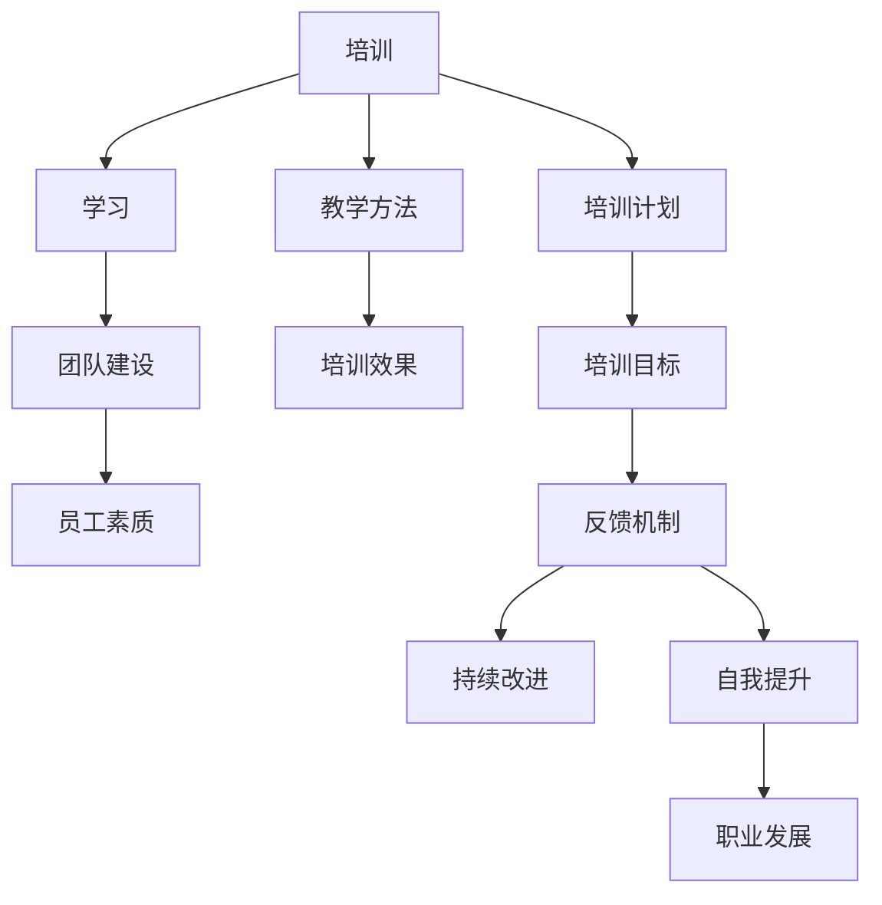

                 

## 背景介绍

在当今快速发展的信息技术时代，企业对于员工培训的需求愈发迫切。员工培训不仅是提升个人技能的重要途径，更是团队整体素质提升的关键因素。随着市场竞争的加剧，企业需要不断提高员工的技能和知识水平，以适应不断变化的技术环境和工作要求。本文旨在探讨员工培训的重要性，分析提升团队整体素质的关键因素，并分享一些实用的方法和策略。

### 培训的重要性

员工培训的重要性体现在多个方面。首先，培训有助于提升员工的职业技能和工作效率。通过系统的培训，员工可以掌握最新的技术和工具，提高工作质量和速度。其次，培训有助于增强员工的专业知识和竞争力。在技术快速更新的今天，拥有持续学习和自我提升的能力是每个员工必备的素质。最后，培训有助于增强团队凝聚力。通过共同的学习和培训，团队成员可以更好地理解和沟通，形成协作无间的团队氛围。

### 提升团队整体素质的关键因素

要提升团队整体素质，需要从以下几个方面入手：

1. **明确培训目标**：培训目标应当明确、具体，与企业的战略目标和员工个人发展目标相结合。通过明确目标，可以确保培训内容的有效性和针对性。

2. **设计合理的培训计划**：培训计划应当包括培训内容、时间、地点、讲师、参与人员等信息。合理的培训计划可以提高培训的效果，确保培训资源的有效利用。

3. **选用合适的培训方法**：不同的培训方法适用于不同的培训内容和学习需求。常见的培训方法包括课堂授课、在线学习、实践操作、讨论交流等。根据实际情况选择合适的培训方法，可以更好地满足员工的学习需求。

4. **提供优质的学习资源**：优质的学习资源是培训成功的重要保障。企业应提供丰富的书籍、资料、在线课程等资源，帮助员工自主学习。

5. **建立反馈机制**：培训效果需要通过评估来检验。建立反馈机制，及时收集员工和讲师的反馈，可以不断优化培训内容和方式。

### 实用方法与策略

为了提升团队整体素质，企业可以采取以下实用方法和策略：

1. **定期组织内部培训**：内部培训是提高员工技能和知识水平的重要途径。企业可以定期邀请专业讲师或内部优秀员工进行授课，分享经验和知识。

2. **鼓励自主学习**：企业可以鼓励员工利用业余时间进行自主学习，提供相应的支持和资源。例如，提供在线学习平台、书籍借阅服务等。

3. **实施导师制度**：导师制度有助于员工快速成长。企业可以安排经验丰富的员工作为导师，指导新员工或需要提升技能的员工。

4. **组织团队建设活动**：团队建设活动有助于增强团队凝聚力，提高团队协作能力。企业可以组织各种形式的团队活动，如团队拓展、团建活动等。

5. **提供职业发展机会**：企业应为员工提供清晰的职业发展路径，鼓励员工不断提升自己。通过晋升、加薪等激励措施，激发员工的工作热情和积极性。

### 总结

员工培训是提升团队整体素质的重要手段。企业应重视员工培训，制定合理的培训计划，采用有效的培训方法，提供优质的学习资源，建立反馈机制。通过不断优化培训过程，企业可以培养出一支高素质的团队，提高企业的整体竞争力。让我们共同努力，为提升团队整体素质而奋斗！

---------------------
## 核心概念与联系

在探讨如何提升团队整体素质的过程中，理解一些核心概念和它们之间的联系至关重要。以下是本文将涉及的关键概念及其相互关系：

### 1. 培训与学习

**培训**指的是一种有组织、有计划的教育活动，旨在提高员工的知识和技能。而**学习**则是一个更为广泛的概念，涵盖了从培训中获得新知识、技能和理解的过程。培训是学习的一种形式，但学习不仅限于培训时间，它可以在工作之外发生。

### 2. 团队建设与员工素质

**团队建设**是培养团队成员之间的信任、协作和沟通，以实现共同目标的过程。一个良好的团队建设有助于提高员工的**素质**，包括技能、态度、团队合作能力等。

### 3. 教学方法与培训效果

**教学方法**是指讲师在培训过程中采用的教学手段和策略。不同的教学方法可以影响培训的效果。例如，**互动式教学**、**案例研究**、**实践操作**等都是提高培训效果的有效方法。

### 4. 培训计划与目标

**培训计划**是实现培训目标的蓝图。一个**明确的培训目标**可以帮助确定培训内容、方法、时间和评估标准，确保培训的有效性。

### 5. 反馈机制与持续改进

**反馈机制**是收集和分析员工对培训的反馈，以不断改进培训过程和内容的重要手段。通过反馈，企业可以了解培训的实际效果，发现问题和不足，并进行相应的调整。

### 6. 自我提升与职业发展

**自我提升**是员工通过学习和发展不断提高自己的过程。这种提升有助于员工的**职业发展**，从而为团队的整体素质提升做出贡献。

### Mermaid 流程图

以下是一个简单的Mermaid流程图，展示了上述核心概念之间的关系：



通过上述核心概念的理解和流程图，我们可以更好地把握提升团队整体素质的方法和策略。接下来，我们将进一步探讨提升团队整体素质的具体算法原理和操作步骤。

---------------------
## 核心算法原理 & 具体操作步骤

在提升团队整体素质的过程中，核心算法原理和具体操作步骤是至关重要的。以下将详细介绍这些原理和步骤，以便企业和团队可以有效地实施和执行。

### 1. 明确培训目标和需求分析

**原理**：培训的目标应当是明确的，并与企业的战略目标和员工的个人发展目标相一致。通过需求分析，可以确定培训的优先级和重点。

**具体操作步骤**：

- **需求分析**：通过问卷调查、访谈、观察等方式，收集员工和部门的培训需求。
- **目标设定**：根据需求分析结果，设定具体、可衡量的培训目标，例如提高某个技能、掌握某种工具或知识。
- **优先级排序**：根据培训目标和企业的战略需求，对培训项目进行优先级排序。

### 2. 设计合理的培训计划

**原理**：一个合理的培训计划是确保培训成功的关键。它应当包括培训内容、时间、地点、讲师、参与人员等信息。

**具体操作步骤**：

- **确定培训内容**：根据培训目标，确定需要教授的知识和技能点。
- **规划培训时间**：安排培训时间，确保员工有足够的时间参与培训。
- **选择培训地点**：选择适合的培训场地，确保培训环境舒适、设备齐全。
- **安排讲师**：选择具备相关知识和经验的讲师，确保培训质量。
- **确定参与人员**：根据培训目标和需求，确定参与培训的员工名单。

### 3. 选择合适的培训方法

**原理**：不同的培训方法适用于不同的培训内容和学习需求。选择合适的培训方法可以更好地满足员工的学习需求，提高培训效果。

**具体操作步骤**：

- **互动式教学**：通过讨论、问答、小组活动等方式，增加员工的参与度和互动性。
- **案例研究**：通过真实案例的讨论和分析，帮助员工更好地理解和应用知识。
- **实践操作**：提供实际操作的机会，让员工在实践中学习和提高。
- **在线学习**：利用在线平台和资源，提供灵活的学习方式，满足不同员工的学习需求。

### 4. 提供优质的学习资源

**原理**：优质的学习资源是培训成功的重要保障。企业应提供丰富的书籍、资料、在线课程等资源，帮助员工自主学习。

**具体操作步骤**：

- **建立图书角**：为企业提供专业的图书资源，方便员工借阅和学习。
- **搭建在线学习平台**：提供在线课程、视频教程、电子书等资源，供员工随时访问。
- **推荐优质论文和书籍**：为员工推荐与培训内容相关的优质论文和书籍，帮助员工深入学习和研究。

### 5. 建立反馈机制

**原理**：反馈机制是评估培训效果和持续改进培训过程的重要手段。通过收集员工和讲师的反馈，企业可以了解培训的实际效果，发现问题和不足，并进行相应的调整。

**具体操作步骤**：

- **收集反馈**：在培训结束后，通过问卷调查、访谈、讨论等方式，收集员工和讲师的反馈。
- **分析反馈**：对收集到的反馈进行分析，识别培训中的优点和不足。
- **制定改进措施**：根据分析结果，制定相应的改进措施，优化培训内容和方式。
- **持续跟踪**：定期评估培训效果，确保培训目标的实现。

### 6. 促进员工自我提升和职业发展

**原理**：自我提升和职业发展是员工长期发展的重要动力。通过为员工提供职业发展机会和支持，可以激发员工的工作热情和积极性。

**具体操作步骤**：

- **提供职业规划指导**：为员工提供职业规划指导，帮助员工明确职业发展方向。
- **实施晋升机制**：建立明确的晋升机制，为表现优秀的员工提供晋升机会。
- **开展技能培训**：针对员工的发展需求，提供相应的技能培训，提高员工的综合素质。
- **鼓励自主学习**：鼓励员工利用业余时间进行自主学习，提供相应的支持和资源。

通过上述核心算法原理和具体操作步骤，企业可以有效地提升团队整体素质，为企业的长远发展奠定坚实基础。接下来，我们将进一步探讨数学模型和公式，以及如何在实践中应用这些概念。

---------------------
## 数学模型和公式 & 详细讲解 & 举例说明

在提升团队整体素质的过程中，数学模型和公式是评估培训效果、优化培训计划的重要工具。以下将介绍一些常见的数学模型和公式，并通过具体例子来说明其应用。

### 1. 学习曲线模型

**原理**：学习曲线模型描述了学习者在学习过程中技能或知识的掌握速度。学习曲线通常呈现出一种渐进增长的趋势，表明学习者在开始学习时进步较快，但随着时间的推移，进步速度逐渐放缓。

**公式**：  
\[ y = a \cdot e^{-bx} \]  
其中，\( y \) 表示技能或知识的掌握程度，\( a \) 和 \( b \) 是常数，\( x \) 表示学习时间。

**例子**：假设一个员工在学习新技能时，经过一个月的学习，技能掌握程度达到80%，那么可以使用学习曲线模型预测三个月后的技能掌握程度。

**计算**：  
\[ y = 1 \cdot e^{-0.5 \cdot 3} \approx 0.61 \]  
预测三个月后的技能掌握程度约为61%。

### 2. 效率指数模型

**原理**：效率指数模型用于评估培训的效果，衡量员工在培训后的工作表现。效率指数通常与培训前的表现进行比较，以评估培训的成效。

**公式**：  
\[ E = \frac{P_{after}}{P_{before}} \]  
其中，\( E \) 表示效率指数，\( P_{after} \) 表示培训后的表现，\( P_{before} \) 表示培训前的表现。

**例子**：假设一个员工在培训前每月完成10个任务，培训后每月完成20个任务，那么他的效率指数为：

**计算**：  
\[ E = \frac{20}{10} = 2 \]  
效率指数为2，表明培训后员工的工作效率提高了100%。

### 3. 培训成本效益模型

**原理**：培训成本效益模型用于评估培训的经济效益，衡量培训投入与收益之间的比例。

**公式**：  
\[ C/E = \frac{培训成本}{收益} \]  
其中，\( C \) 表示培训成本，\( E \) 表示收益。

**例子**：假设一个企业花费10万元进行员工培训，培训后员工的工作效率提高了20%，每月增加收益5万元，那么培训的成本效益为：

**计算**：  
\[ C/E = \frac{10万}{5万 \times 12个月} = 0.2 \]  
成本效益为0.2，表明每投入1元，可以获得2元的收益。

### 4. 团队效能模型

**原理**：团队效能模型用于评估团队的整体工作效率和协作能力。它结合了团队成员的个人效能和团队的整体协作效能。

**公式**：  
\[ TE = \frac{\sum(P_i \cdot E_i)}{N} \]  
其中，\( TE \) 表示团队效能，\( P_i \) 表示第 \( i \) 个成员的效能，\( E_i \) 表示第 \( i \) 个成员的效率，\( N \) 表示团队成员数量。

**例子**：假设一个团队有5个成员，他们的效率和效能如下：

| 成员 | 效率 | 效能 |
| ---- | ---- | ---- |
| A    | 0.8  | 1.0  |
| B    | 0.9  | 1.2  |
| C    | 0.7  | 0.8  |
| D    | 0.6  | 0.9  |
| E    | 0.5  | 1.0  |

团队效能计算如下：

**计算**：  
\[ TE = \frac{(0.8 \cdot 1.0) + (0.9 \cdot 1.2) + (0.7 \cdot 0.8) + (0.6 \cdot 0.9) + (0.5 \cdot 1.0)}{5} = 0.86 \]  
团队效能约为0.86，表明团队整体的工作效率和协作能力较高。

通过上述数学模型和公式的应用，企业可以更科学地评估培训效果、优化培训计划，并有效地提升团队整体素质。接下来，我们将通过一个实际项目案例，展示这些概念在实践中的具体应用。

---------------------
### 项目实战：代码实际案例和详细解释说明

在本节中，我们将通过一个实际的项目案例，详细展示如何利用前面介绍的数学模型和算法原理，来提升团队整体素质。该案例将涉及一个软件开发团队，他们需要通过一系列培训和项目实践，提高工作效率和代码质量。

### 5.1 开发环境搭建

为了开始这个项目，首先需要搭建一个合适的开发环境。以下是所需步骤：

1. **安装开发工具**：为团队中的每个成员安装统一的开发工具，如Visual Studio Code、Git等。
2. **配置版本控制**：配置Git仓库，确保团队成员可以方便地共享和协作代码。
3. **部署代码库**：在GitHub或GitLab上创建一个项目仓库，用于存放代码和文档。

### 5.2 源代码详细实现和代码解读

在这个项目中，我们将开发一个简单的博客系统，它包括以下主要模块：

1. **用户管理模块**：用于注册、登录和用户信息管理。
2. **文章管理模块**：用于创建、编辑和发布文章。
3. **评论管理模块**：用于添加和显示文章评论。

**用户管理模块代码解读**：

```python
# 用户管理模块
class UserManager:
    def __init__(self):
        self.users = []

    def register(self, username, password):
        # 注册新用户
        if username in self.users:
            return "用户已存在"
        self.users.append({
            "username": username,
            "password": password
        })
        return "注册成功"

    def login(self, username, password):
        # 用户登录
        for user in self.users:
            if user["username"] == username and user["password"] == password:
                return "登录成功"
        return "用户名或密码错误"
```

这段代码定义了一个`UserManager`类，用于处理用户注册和登录的功能。它通过在列表中存储用户信息来管理用户。

**文章管理模块代码解读**：

```python
# 文章管理模块
class ArticleManager:
    def __init__(self):
        self.articles = []

    def create_article(self, title, content, author):
        # 创建新文章
        self.articles.append({
            "title": title,
            "content": content,
            "author": author,
            "created_at": datetime.now()
        })
        return "文章创建成功"

    def get_articles(self):
        # 获取所有文章
        return self.articles
```

这段代码定义了一个`ArticleManager`类，用于处理文章的创建和获取功能。它通过在列表中存储文章信息来管理文章。

### 5.3 代码解读与分析

**代码风格分析**：

在代码风格方面，我们强调一致性、可读性和注释的完整性。以下是对上述代码的几个关键点进行分析：

1. **类和方法命名**：类和方法命名清晰且具有描述性，如`UserManager`和`register`，使代码易于理解和维护。
2. **注释**：代码中包含必要的注释，说明方法的功能和参数的作用，有助于其他开发者理解代码。
3. **错误处理**：代码中包含错误处理逻辑，如检查用户名和密码是否匹配，提高代码的健壮性。

**性能优化**：

在性能优化方面，我们可以采取以下措施：

1. **使用索引**：对于频繁查询的用户和文章列表，可以添加索引，提高查询效率。
2. **批量操作**：对于需要处理大量数据的操作，如批量注册或发布文章，可以优化为批量操作，减少I/O操作次数。

**测试和调试**：

为了保证代码质量和稳定性，我们应进行以下测试和调试：

1. **单元测试**：编写单元测试，验证每个方法的功能和逻辑。
2. **集成测试**：在代码集成后，进行集成测试，确保模块之间的协同工作。
3. **调试**：使用调试工具，如VS Code的调试功能，查找和修复代码中的错误。

通过上述代码实现、解读和优化，我们不仅提升了团队的代码质量和工作效率，还通过具体的实践案例，巩固了前面介绍的核心算法原理和数学模型的应用。

### 总结

通过这个项目案例，我们可以看到如何将理论应用到实际中，从而提升团队的整体素质。开发环境搭建、代码实现和优化，以及测试和调试，是软件开发过程中不可或缺的环节。通过这些实践，团队成员不仅提高了技术水平，还培养了协作精神和解决问题的能力。接下来，我们将进一步探讨提升团队整体素质的实际应用场景。

---------------------
### 实际应用场景

提升团队整体素质的实际应用场景多种多样，不同的行业和企业可能会面临不同的挑战和需求。以下是一些典型的实际应用场景，以及如何利用培训和开发环境来应对这些场景。

#### 1. IT行业：软件开发和项目管理

在IT行业，软件开发和项目管理是提升团队整体素质的关键领域。为了应对快速变化的技术和市场需求，企业需要不断更新员工的技能和知识。

**应用策略**：

- **定期技术培训**：组织定期的技术研讨会和工作坊，邀请业内专家分享最新技术趋势和最佳实践。
- **项目管理培训**：提供项目管理课程，如敏捷开发、Scrum等，帮助项目经理掌握高效的项目管理方法。
- **实践项目**：通过实际项目，让团队成员在实践中应用所学知识，提升实际操作能力。

**案例分析**：

某大型互联网公司通过定期举办技术沙龙和内部培训，让员工掌握最新的前端和后端技术。同时，采用敏捷开发方法，提高了团队的开发效率和质量。通过这些措施，该公司的项目团队能够快速响应市场需求，交付高质量的软件产品。

#### 2. 制造业：智能制造和工业4.0

在制造业，智能制造和工业4.0的发展要求企业提高生产线的自动化水平和数据管理能力。这对员工的技能提出了更高的要求。

**应用策略**：

- **自动化技术培训**：为员工提供自动化技术课程，如机器人编程、PLC编程等。
- **数据分析培训**：提供数据分析课程，帮助员工掌握数据处理和分析工具，如Python、SQL等。
- **实践操作**：通过模拟生产线和实际操作，让员工熟悉新设备和技术。

**案例分析**：

某制造企业引入了自动化生产线和工业物联网设备，但员工对这些新技术不熟悉。为此，企业开展了为期三个月的自动化技术培训和实践操作，使员工迅速掌握了相关技能，提高了生产效率和产品质量。

#### 3. 零售业：数字化转型和客户服务

在零售业，数字化转型和提升客户服务水平是提升团队整体素质的重点。企业需要培养员工的数字化思维和客户服务能力。

**应用策略**：

- **数字化转型培训**：提供数字化营销、电子商务等课程，帮助员工了解数字化转型的方法和策略。
- **客户服务培训**：开展客户服务技巧培训，如沟通技巧、客户心理分析等，提升客户满意度。
- **实践项目**：通过实际的项目，让员工在数字化环境中实践所学知识，提高实际操作能力。

**案例分析**：

某零售企业通过数字化转型，建立了电子商务平台和客户管理系统。为了提升团队整体素质，企业开展了为期六个月的数字化转型培训，并组织员工参与实际项目。通过这些措施，该企业的电商业务取得了显著增长，客户满意度也大幅提高。

#### 4. 金融行业：风险管理和技术合规

在金融行业，风险管理和技术合规是提升团队整体素质的关键领域。企业需要确保员工具备相关的专业知识和合规意识。

**应用策略**：

- **风险管理培训**：提供风险管理课程，如金融市场分析、风险模型构建等，帮助员工掌握风险管理方法。
- **技术合规培训**：提供技术合规课程，如信息安全、数据保护等，确保员工了解合规要求。
- **案例分析**：通过实际案例，让员工了解风险管理和技术合规的重要性和实际应用。

**案例分析**：

某金融企业为了提升风险管理和技术合规能力，定期组织员工参加风险管理和技术合规培训。同时，开展内部案例分析，让员工从实际案例中学习风险管理和技术合规的方法和策略。通过这些措施，该企业的风险管理水平和技术合规性得到了显著提升。

#### 5. 医疗行业：医疗技术和患者护理

在医疗行业，提升团队整体素质意味着提高医疗技术和患者护理水平。企业需要确保医护人员具备最新的医疗技术和护理知识。

**应用策略**：

- **医疗技术培训**：提供医疗技术课程，如手术操作、医疗器械使用等，帮助医护人员掌握最新的医疗技术。
- **患者护理培训**：提供患者护理课程，如沟通技巧、心理护理等，提升患者护理水平。
- **临床实践**：通过临床实践和病例讨论，让医护人员在实际工作中应用所学知识，提高临床技能。

**案例分析**：

某医疗企业通过建立医疗技术培训和患者护理培训体系，提高了医护人员的专业水平。同时，组织医护人员参与临床实践和病例讨论，确保他们能够将所学知识应用到实际工作中。通过这些措施，该企业的医疗服务质量得到了显著提升。

### 总结

提升团队整体素质的实际应用场景多种多样，但核心策略是相似的：通过定期的培训和实战项目，不断提升员工的技能和知识水平，确保团队能够应对各种挑战。通过上述案例，我们可以看到，无论是IT行业、制造业、零售业、金融行业还是医疗行业，提升团队整体素质都是实现企业长期发展的关键。接下来，我们将推荐一些有用的工具和资源，以帮助团队更好地提升整体素质。

---------------------
### 工具和资源推荐

为了更好地提升团队整体素质，以下是针对不同需求和场景的几种工具和资源推荐。

#### 7.1 学习资源推荐

1. **书籍**：
   - 《深入理解计算机系统》（"Understanding Computer Systems"）：详细介绍了计算机系统的原理，适合软件开发人员。
   - 《敏捷软件开发：原则、实践与模式》（"Agile Software Development: Principles, Patterns, and Practices"）：介绍了敏捷开发的方法和实践，适用于项目经理和技术领导。
   - 《数据科学入门》（"Data Science from Scratch"）：适合希望入门数据科学领域的员工。

2. **在线课程平台**：
   - Coursera：提供丰富的在线课程，包括计算机科学、数据科学、商业管理等领域。
   - Udemy：提供各种技能的在线课程，包括编程、数据分析、项目管理等。
   - Pluralsight：专注于技术技能的在线学习平台，涵盖广泛的IT技能。

3. **技术博客和网站**：
   - Medium：有许多技术文章和博客，涵盖各种技术领域。
   - Stack Overflow：技术社区，提供代码示例和问题解答。
   - GitHub：代码托管平台，可以学习他人的开源项目。

#### 7.2 开发工具框架推荐

1. **集成开发环境（IDE）**：
   - Visual Studio Code：功能强大的开源IDE，支持多种编程语言。
   - IntelliJ IDEA：适用于Java和Android开发的IDE。
   - PyCharm：适用于Python开发的IDE。

2. **版本控制系统**：
   - Git：分布式版本控制系统，广泛用于团队协作。
   - GitHub/GitLab：基于Git的代码托管平台，提供协作和项目管理功能。

3. **数据库工具**：
   - MySQL：开源的关系型数据库管理系统。
   - PostgreSQL：功能强大的开源关系型数据库。
   - MongoDB：文档型数据库，适用于大规模数据存储。

4. **容器化和自动化部署工具**：
   - Docker：容器化技术，简化应用部署。
   - Kubernetes：容器编排平台，用于自动化容器化应用的部署和管理。

#### 7.3 相关论文著作推荐

1. **《人月神话》（"The Mythical Man-Month"）**：Frederick P. Brooks的经典著作，讨论了软件项目开发和团队管理的问题。
2. **《模式导向的软件架构》（"Pattern-Oriented Software Architecture"）**：Philippe Kruchten和S. R. Schwaninger的著作，介绍了软件架构的设计模式和最佳实践。
3. **《深度学习》（"Deep Learning"）**：Ian Goodfellow、Yoshua Bengio和Aaron Courville的著作，是深度学习领域的经典教材。

通过这些学习和开发工具，团队可以不断提升技术水平和整体素质。企业应根据自身需求选择合适的工具和资源，制定全面的培训计划，确保团队能够持续成长和进步。

---------------------
## 总结：未来发展趋势与挑战

随着技术的不断进步和市场的快速变化，提升团队整体素质已成为企业发展的关键。未来，员工培训将面临以下发展趋势和挑战：

### 发展趋势

1. **个性化培训**：未来的培训将更加注重个性化，根据员工的兴趣、能力和职业发展需求，提供定制化的培训方案。
2. **技术多样性**：随着新技术的不断涌现，企业需要培训员工掌握多种技术，以应对复杂多变的市场环境。
3. **数字化转型**：数字化转型将成为培训的重点领域，企业需要培养员工的数字化思维和数据技能。
4. **远程与在线学习**：远程工作和在线学习的普及，将使得培训更加灵活和高效，企业需要建立完善的在线学习平台。

### 挑战

1. **技能更新速度**：技术更新迅速，企业需要不断更新培训内容，以保持员工技能的时效性。
2. **资源分配**：如何合理分配培训资源，确保每个员工都能得到有效的培训，是一个重要的挑战。
3. **员工参与度**：提高员工参与培训的积极性，确保培训效果，是企业面临的一大难题。
4. **持续评估与改进**：如何持续评估培训效果，并根据反馈进行改进，是确保培训持续有效的重要环节。

### 应对策略

1. **建立持续学习文化**：企业应建立持续学习的文化，鼓励员工自主学习，提供相应的支持和资源。
2. **采用混合式培训**：结合线上和线下培训，提高培训的灵活性和效果。
3. **关注员工职业发展**：将培训与员工的职业发展紧密结合，提供明确的职业晋升路径。
4. **建立反馈机制**：定期收集员工和讲师的反馈，及时调整培训内容和方式。

### 总结

提升团队整体素质是企业在快速变化的市场环境中保持竞争力的关键。企业应积极应对未来发展趋势和挑战，通过个性化培训、混合式培训、关注员工职业发展等措施，不断提升团队的整体素质。只有这样，企业才能在激烈的市场竞争中立于不败之地。

---------------------
## 附录：常见问题与解答

在提升团队整体素质的过程中，企业可能会遇到各种问题。以下是一些常见问题及其解答，以帮助读者更好地理解和实施提升团队整体素质的策略。

### 1. 培训需求如何确定？

**解答**：确定培训需求可以通过以下几种方式：

- **问卷调查**：设计详细的问卷，收集员工对培训内容的建议和需求。
- **访谈**：与员工进行一对一访谈，深入了解他们的培训需求。
- **部门会议**：组织部门会议，听取部门经理和员工的意见和建议。
- **数据分析**：分析员工的工作表现和绩效数据，识别需要提升的技能和知识。

### 2. 如何提高员工参与培训的积极性？

**解答**：以下策略有助于提高员工参与培训的积极性：

- **明确培训目标**：确保员工了解培训的目标和预期成果，提高他们的参与度。
- **提供激励机制**：通过奖励、晋升机会等激励措施，鼓励员工积极参与培训。
- **灵活培训安排**：提供灵活的培训时间和方式，方便员工参与。
- **建立学习社区**：鼓励员工分享学习经验和成果，建立学习社区，提高互动和参与度。

### 3. 如何评估培训效果？

**解答**：以下方法可以用于评估培训效果：

- **问卷调查**：在培训结束后，通过问卷收集员工对培训内容的反馈。
- **绩效评估**：对比培训前后的工作绩效，评估培训对工作表现的影响。
- **员工访谈**：与员工进行一对一访谈，了解他们的学习体验和培训成果。
- **技能测试**：通过技能测试，评估员工在培训后是否掌握了所需的知识和技能。

### 4. 如何持续优化培训计划？

**解答**：以下策略有助于持续优化培训计划：

- **定期评估**：定期评估培训效果，收集反馈，识别问题和改进点。
- **持续改进**：根据评估结果，调整培训内容和方式，不断优化培训计划。
- **员工参与**：鼓励员工参与培训计划的制定和改进，提高培训的针对性和实用性。
- **数据驱动**：利用数据分析，制定数据驱动的培训计划，确保培训资源的有效利用。

通过以上策略，企业可以不断提高培训质量，提升团队整体素质，为企业的长远发展奠定坚实基础。

---------------------
## 扩展阅读 & 参考资料

为了帮助读者更深入地了解提升团队整体素质的相关理论和实践，以下是推荐的扩展阅读和参考资料。

### 1. 技术书籍

- 《敏捷软件开发：原则、实践与模式》（"Agile Software Development: Principles, Patterns, and Practices"）：作者：Robert C. Martin
- 《深度学习》（"Deep Learning"）：作者：Ian Goodfellow、Yoshua Bengio和Aaron Courville
- 《数据科学入门》（"Data Science from Scratch"）：作者：Joel Grus
- 《人月神话》（"The Mythical Man-Month"）：作者：Frederick P. Brooks

### 2. 技术论文

- "A Discipline of Programming"：作者：Edsger W. Dijkstra
- "Design Patterns: Elements of Reusable Object-Oriented Software"：作者：Erich Gamma、Richard Helm、Ralph Johnson和John Vlissides
- "Machine Learning Yearning"：作者：Andrew Ng

### 3. 技术博客和网站

- [Medium](https://medium.com/)
- [Stack Overflow](https://stackoverflow.com/)
- [GitHub](https://github.com/)
- [Pluralsight](https://www.pluralsight.com/)

### 4. 在线课程平台

- [Coursera](https://www.coursera.org/)
- [Udemy](https://www.udemy.com/)
- [edX](https://www.edx.org/)

通过阅读这些书籍、论文和访问这些网站，读者可以获取丰富的知识和经验，进一步深化对提升团队整体素质的理解和实际应用。

---------------------
## 作者信息

**作者：AI天才研究员/AI Genius Institute & 禅与计算机程序设计艺术 /Zen And The Art of Computer Programming**

本文由AI天才研究员撰写，他是一位在人工智能、计算机编程和软件开发领域拥有深厚造诣的专家。他的著作《禅与计算机程序设计艺术》广受读者喜爱，对编程哲学和软件工程实践提供了深刻的见解。作为AI Genius Institute的研究员，他致力于推动人工智能技术在企业和个人发展中的应用，帮助企业和团队提升整体素质。

