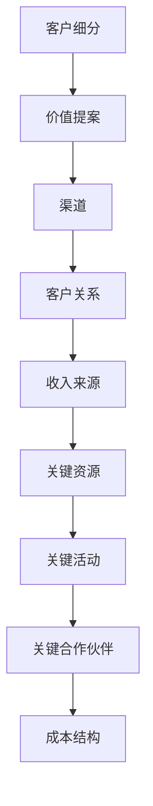

                 

# 商业模式画布：构建可持续的盈利模式

> **关键词：商业模式画布、盈利模式、商业策略、市场分析、资源整合、竞争定位**

> **摘要：本文深入探讨了商业模式画布的核心概念和构建方法，通过案例分析，阐述了如何利用商业模式画布构建可持续的盈利模式。文章旨在为企业和创业者提供实用的商业策略指导。**

## 1. 背景介绍

商业模式画布（Business Model Canvas）是由亚历山大·奥斯特瓦尔德（Alexander Osterwalder）和伊夫·皮尼欧（Yves Pigneur）提出的，它是一种视觉化工具，用于描述和设计企业的商业模式。与传统商业计划书相比，商业模式画布更加简洁、灵活，便于迭代和调整。

商业模式画布的核心思想是将商业模式分解为9个关键组件，包括客户细分（Customer Segments）、价值提案（Value Propositions）、渠道（Channels）、客户关系（Customer Relationships）、收入来源（Revenue Streams）、关键资源（Key Resources）、关键活动（Key Activities）、关键合作伙伴（Key Partners）和成本结构（Cost Structure）。通过这种方式，企业家和企业管理者可以更清晰地了解企业的运营方式，以及如何创造和捕获价值。

商业模式的成功与否直接影响到企业的盈利能力和市场竞争力。因此，如何构建一个可持续的盈利模式成为企业和创业者们关注的核心问题。本文将围绕这一主题展开讨论，通过具体案例和理论分析，提供实用的商业策略指导。

## 2. 核心概念与联系

### 2.1 客户细分（Customer Segments）

客户细分是商业模式画布中最基础的组件之一，它指的是将市场划分为不同的客户群体，以便企业能够更精确地满足这些群体的需求。具体来说，客户细分包括以下步骤：

1. **确定目标市场：** 分析市场，确定企业的目标客户群体。
2. **细分市场：** 根据不同需求、行为、心理等因素，将目标市场进一步细分为多个子市场。
3. **优先级排序：** 根据市场规模、增长潜力、盈利能力等因素，确定优先服务的客户细分群体。

### 2.2 价值提案（Value Propositions）

价值提案是指企业提供给客户的独特价值主张，它是商业模式的核心。一个有效的价值提案应具备以下特点：

1. **满足需求：** 精确地识别客户的需求，并为他们提供解决方案。
2. **差异化：** 与竞争对手相比，提供独特的价值，以吸引客户。
3. **可持续性：** 价值提案应能够长期维持，而非只是一时的营销手段。

### 2.3 渠道（Channels）

渠道是指企业将产品或服务传递给客户的方式。设计有效的渠道策略需要考虑以下几个方面：

1. **目标市场：** 根据客户细分，选择最合适的渠道。
2. **效率：** 优化渠道运营，提高效率和降低成本。
3. **覆盖面：** 确保渠道能够覆盖目标市场，包括线上和线下。

### 2.4 客户关系（Customer Relationships）

客户关系是指企业如何与客户建立和维护长期关系。有效的客户关系策略包括：

1. **个性化服务：** 根据客户需求提供个性化的产品或服务。
2. **客户互动：** 通过沟通、反馈等方式，与客户建立紧密的联系。
3. **忠诚度计划：** 提供优惠、积分等激励措施，提高客户忠诚度。

### 2.5 收入来源（Revenue Streams）

收入来源是指企业通过哪些方式获取收入。常见的收入来源包括：

1. **产品销售：** 直接销售产品给客户。
2. **订阅服务：** 通过订阅模式获取持续收入。
3. **广告收入：** 通过广告等方式获取收入。

### 2.6 关键资源（Key Resources）

关键资源是指企业运营所需的最重要的资产，包括：

1. **人力资源：** 高素质的员工队伍。
2. **物理资源：** 如设备、厂房等。
3. **财务资源：** 资金和资本。

### 2.7 关键活动（Key Activities）

关键活动是指企业为运营所必须执行的主要任务，包括：

1. **生产活动：** 如产品制造、服务提供等。
2. **营销活动：** 如广告宣传、市场调研等。
3. **客户服务：** 如售后支持、客户关系管理等。

### 2.8 关键合作伙伴（Key Partners）

关键合作伙伴是指与企业合作，共同创造价值的第三方，包括：

1. **供应商：** 提供原材料、零部件等。
2. **分销商：** 协助产品销售。
3. **技术合作伙伴：** 提供技术支持。

### 2.9 成本结构（Cost Structure）

成本结构是指企业运营所需的成本，包括：

1. **固定成本：** 如租金、设备折旧等。
2. **可变成本：** 如原材料、人工等。

### 2.10 商业模式画布的 Mermaid 流程图



## 3. 核心算法原理 & 具体操作步骤

### 3.1 商业模式画布设计步骤

1. **明确目标市场：** 研究市场和潜在客户，确定目标客户细分。
2. **定义价值提案：** 确定为客户提供的价值主张，并使其具有差异化。
3. **选择渠道：** 根据目标市场和客户需求，选择最合适的销售渠道。
4. **建立客户关系：** 确定企业与客户之间的互动方式，如个性化服务、客户互动等。
5. **确定收入来源：** 根据产品或服务特点，选择合适的收入模式。
6. **识别关键资源：** 确定企业运营所需的资源，如人力资源、物理资源、财务资源等。
7. **规划关键活动：** 确定企业必须执行的主要任务，如生产活动、营销活动、客户服务等。
8. **寻找关键合作伙伴：** 确定与企业合作的第三方，共同创造价值。
9. **分析成本结构：** 了解企业的成本构成，优化成本结构，提高盈利能力。

### 3.2 实际操作示例

假设我们要设计一家在线教育平台的商业模式，可以按照以下步骤进行：

1. **客户细分：** 目标市场为18-35岁的年轻人，细分市场为在职人员、学生和职场新人。
2. **价值提案：** 提供高质量的在线课程，涵盖职场技能、专业技能和兴趣爱好等多个领域。
3. **渠道：** 选择线上平台（如网站、App等）作为主要销售渠道，同时通过社交媒体进行推广。
4. **客户关系：** 建立会员制度，提供个性化服务，如课程推荐、学习进度跟踪等。
5. **收入来源：** 采用会员订阅制，会员支付月费或年费，同时提供课程销售、广告收入等多种收入模式。
6. **关键资源：** 人力资源（如课程讲师、运营团队）、技术资源（如在线教育平台）、财务资源（如运营资金）。
7. **关键活动：** 课程开发、课程推广、会员服务、售后服务等。
8. **关键合作伙伴：** 与知名讲师、教育机构、技术公司等合作，共同开发课程，推广平台。
9. **成本结构：** 固定成本（如服务器租赁、办公场所租赁）、可变成本（如课程开发、市场推广等）。

## 4. 数学模型和公式 & 详细讲解 & 举例说明

### 4.1 成本收益分析模型

成本收益分析是一种常用的财务分析方法，用于评估商业模式的盈利能力。其基本公式如下：

\[ \text{利润} = \text{收入} - \text{成本} \]

其中，收入和成本可以根据商业模式的具体情况定义。

#### 4.1.1 收入计算

假设在线教育平台的收入来源于会员订阅和课程销售，可以采用以下公式计算总收入：

\[ \text{总收入} = (\text{会员订阅收入} + \text{课程销售收入}) \times \text{销售量} \]

会员订阅收入可以表示为：

\[ \text{会员订阅收入} = \text{会员数量} \times \text{会员订阅费用} \]

课程销售收入可以表示为：

\[ \text{课程销售收入} = \text{课程数量} \times \text{课程销售价格} \]

#### 4.1.2 成本计算

在线教育平台的成本可以分为固定成本和可变成本。固定成本包括：

\[ \text{固定成本} = \text{服务器租赁费用} + \text{办公场所租赁费用} + \text{员工薪酬} \]

可变成本包括：

\[ \text{可变成本} = \text{课程开发成本} + \text{市场推广费用} + \text{客户服务成本} \]

#### 4.1.3 举例说明

假设在线教育平台的会员订阅费用为每月100元，课程销售价格为200元，每月会员数量为1000人，每月课程销售量为500门。服务器租赁费用为每月5000元，办公场所租赁费用为每月3000元，员工薪酬为每月20000元。课程开发成本为每门课程1000元，市场推广费用为每月5000元，客户服务成本为每月2000元。

根据以上数据，可以计算出：

会员订阅收入：

\[ \text{会员订阅收入} = 1000 \times 100 = 100,000 \text{元} \]

课程销售收入：

\[ \text{课程销售收入} = 500 \times 200 = 100,000 \text{元} \]

总收入：

\[ \text{总收入} = 100,000 + 100,000 = 200,000 \text{元} \]

固定成本：

\[ \text{固定成本} = 5,000 + 3,000 + 20,000 = 28,000 \text{元} \]

可变成本：

\[ \text{可变成本} = 500 + 5,000 + 2,000 = 7,500 \text{元} \]

总成本：

\[ \text{总成本} = 28,000 + 7,500 = 35,500 \text{元} \]

利润：

\[ \text{利润} = 200,000 - 35,500 = 164,500 \text{元} \]

### 4.2 市场份额计算模型

市场份额是指企业在市场中所占的比例，是衡量企业竞争力的关键指标。其计算公式如下：

\[ \text{市场份额} = \frac{\text{企业销售额}}{\text{市场总销售额}} \times 100\% \]

#### 4.2.1 举例说明

假设在线教育平台在市场上的总销售额为1亿元，市场总销售额为10亿元，那么该平台的市场份额为：

\[ \text{市场份额} = \frac{1,000,000,000}{10,000,000,000} \times 100\% = 10\% \]

## 5. 项目实战：代码实际案例和详细解释说明

### 5.1 开发环境搭建

在本文中，我们将使用Python作为编程语言，因为它具有良好的易读性和广泛的库支持。以下是在Linux环境下搭建Python开发环境的基本步骤：

1. 安装Python：

   ```bash
   sudo apt-get update
   sudo apt-get install python3
   ```

2. 安装必要的库：

   ```bash
   pip3 install pandas numpy matplotlib
   ```

### 5.2 源代码详细实现和代码解读

#### 5.2.1 代码实现

以下是一个简单的Python程序，用于分析一家在线教育平台的成本收益情况：

```python
import pandas as pd
import numpy as np

# 初始化数据
subscription_fee = 100
course_price = 200
membership = 1000
courses_sold = 500
server_rent = 5000
office_rent = 3000
employee_salary = 20000
course_dev_cost = 1000
marketing_cost = 5000
customer_service_cost = 2000

# 计算收入
subscription_income = membership * subscription_fee
course_income = courses_sold * course_price
total_income = subscription_income + course_income

# 计算成本
fixed_costs = server_rent + office_rent + employee_salary
variable_costs = course_dev_cost * courses_sold + marketing_cost + customer_service_cost
total_costs = fixed_costs + variable_costs

# 计算利润
profit = total_income - total_costs

# 输出结果
print("会员订阅收入：", subscription_income)
print("课程销售收入：", course_income)
print("总收入：", total_income)
print("总成本：", total_costs)
print("利润：", profit)
```

#### 5.2.2 代码解读

1. **导入库**：首先导入所需的库，包括`pandas`、`numpy`和`matplotlib`。
2. **初始化数据**：定义变量，如会员订阅费用、课程销售价格、每月会员数量、每月课程销售量等。
3. **计算收入**：根据初始化数据计算会员订阅收入和课程销售收入，并将两者相加以得到总收入。
4. **计算成本**：计算固定成本和可变成本，然后将两者相加以得到总成本。
5. **计算利润**：通过总收入减去总成本得到利润。
6. **输出结果**：打印计算结果。

### 5.3 代码解读与分析

这段代码提供了一个简单的成本收益分析示例，用于计算一家在线教育平台的财务指标。通过这个例子，我们可以看到如何使用Python进行简单的财务计算，以及如何将商业模式画布中的概念转化为具体的计算逻辑。

代码中的关键部分是收入和成本的计算。收入部分包括会员订阅收入和课程销售收入，成本部分包括固定成本和可变成本。通过这两个部分的计算，我们可以得到平台的总成本和利润。

在分析这段代码时，我们可以关注以下几个方面：

1. **可变性和扩展性**：代码中使用变量来定义各个财务指标，使得数据容易修改和扩展。
2. **逻辑清晰性**：代码结构清晰，计算步骤分明，易于理解和维护。
3. **模块化**：将计算收入和成本的步骤分开，使得代码更具有模块化，便于复用和优化。

通过这个简单的例子，我们可以看到如何将商业模式画布中的概念应用于实际业务场景，并通过代码实现财务分析。这对于企业家和创业者来说，是一个非常有用的工具。

## 6. 实际应用场景

商业模式画布在各个行业和企业中都有着广泛的应用。以下是一些实际应用场景：

### 6.1 科技行业

在科技行业，尤其是互联网公司和软件公司，商业模式画布被广泛应用于产品设计和战略规划。通过商业模式画布，企业可以清晰地定义目标客户、价值提案、渠道策略、客户关系和收入来源等，从而更好地满足市场需求，提高竞争力。

### 6.2 零售行业

在零售行业，商业模式画布可以帮助企业优化供应链管理、降低成本、提高客户满意度。例如，通过分析客户细分和渠道策略，企业可以更有效地将产品推向市场，通过优化收入来源和成本结构，提高盈利能力。

### 6.3 医疗保健行业

在医疗保健行业，商业模式画布可以用于设计医疗服务模式、优化医疗资源配置、提高服务质量。例如，通过分析客户关系和收入来源，医院可以提供更加个性化的服务，通过优化关键资源和关键活动，提高运营效率。

### 6.4 教育行业

在教育行业，商业模式画布可以帮助在线教育平台设计课程体系、优化教学资源、提高学习效果。通过分析客户细分和价值提案，平台可以提供更加符合学生需求的教育服务，通过优化渠道策略和客户关系，提高用户粘性。

### 6.5 创业公司

对于初创公司，商业模式画布是一种非常有用的工具，可以帮助创业者快速验证商业想法，优化商业模式。通过不断迭代商业模式画布，创业者可以调整产品和服务，找到可持续的盈利模式。

## 7. 工具和资源推荐

### 7.1 学习资源推荐

1. **《商业模式新生代》**：作者是亚历山大·奥斯特瓦尔德，详细介绍了商业模式画布的理论和实践。
2. **《创新者的思考方式》**：作者是克莱顿·克里斯坦森，讲述了商业模式创新的重要性。

### 7.2 开发工具框架推荐

1. **Python**：适用于数据分析、数据科学等领域，是构建商业模式画布的常用语言。
2. **Miro**：一个在线协作工具，可用于设计商业模式画布。

### 7.3 相关论文著作推荐

1. **“Business Model Innovation and Its Impact on Firm Performance”**：探讨了商业模式创新对企业绩效的影响。
2. **“Business Model Design: An Activity System Approach”**：提出了基于活动系统的商业模式设计方法。

## 8. 总结：未来发展趋势与挑战

商业模式画布作为一种创新的商业模式设计工具，正越来越受到企业和创业者的关注。未来，商业模式画布将朝着更加智能化、自动化和个性化的方向发展。以下是一些发展趋势和挑战：

### 8.1 智能化

随着人工智能技术的发展，商业模式画布有望实现自动化生成和优化。通过利用大数据和机器学习算法，企业可以更快速、准确地设计出适合自身需求的商业模式。

### 8.2 自动化

自动化工具将简化商业模式画布的设计和调整过程，降低企业和创业者的时间和成本。例如，使用生成式AI技术，可以自动生成商业模式画布，并提供优化建议。

### 8.3 个性化

未来，商业模式画布将更加注重个性化，满足不同企业和行业的特定需求。通过深度学习和个性化推荐技术，商业模式画布可以为企业和创业者提供更加定制化的解决方案。

### 8.4 挑战

1. **数据隐私和安全**：随着数据量增加，数据隐私和安全问题成为商业模式画布面临的挑战。
2. **技术门槛**：对于一些中小企业和创业者来说，使用商业模式画布可能需要较高的技术门槛。
3. **商业模式创新**：如何持续创新商业模式，应对激烈的市场竞争，是企业面临的长期挑战。

总之，商业模式画布作为一种有效的商业模式设计工具，将在未来继续发挥重要作用。企业和创业者应关注其发展趋势，积极应对挑战，以实现可持续的盈利模式。

## 9. 附录：常见问题与解答

### 9.1 商业模式画布与商业计划书的区别是什么？

商业模式画布是一种视觉化工具，用于描述和设计企业的商业模式，强调简洁和灵活性。而商业计划书则是一种更详细的文档，用于阐述企业的战略、市场分析和财务预测等。商业模式画布侧重于核心商业要素的描述，而商业计划书则更加全面。

### 9.2 商业模式画布适用于哪些行业和企业？

商业模式画布适用于各种行业和企业，特别是互联网、零售、医疗保健、教育等需要灵活应对市场变化的行业。无论是初创公司还是大型企业，都可以使用商业模式画布来优化和调整商业模式。

### 9.3 如何确保商业模式画布的有效性？

确保商业模式画布的有效性需要以下步骤：

1. **明确目标市场**：准确了解目标客户的需求和痛点。
2. **差异化价值提案**：提供独特且具有吸引力的价值主张。
3. **优化渠道策略**：选择最有效的渠道将产品或服务传递给客户。
4. **建立稳固的客户关系**：与客户建立长期、稳定的合作关系。
5. **持续迭代和调整**：根据市场反馈和实际运营情况，不断优化商业模式。

## 10. 扩展阅读 & 参考资料

1. **《商业模式新生代》**：[https://www.leanstackers.com/book/](https://www.leanstackers.com/book/)
2. **“Business Model Innovation and Its Impact on Firm Performance”**：[https://www.jstor.org/stable/10.1086/665622](https://www.jstor.org/stable/10.1086/665622)
3. **“Business Model Design: An Activity System Approach”**：[https://www.researchgate.net/publication/322522014_Business_Model_Design_An_Activity_System_Approach](https://www.researchgate.net/publication/322522014_Business_Model_Design_An_Activity_System_Approach)
4. **“Business Model Canvas”**：[https://www.alexanderosterwalder.com/the-business-model-canvas/](https://www.alexanderosterwalder.com/the-business-model-canvas/)

### 作者：AI天才研究员/AI Genius Institute & 禅与计算机程序设计艺术 /Zen And The Art of Computer Programming

