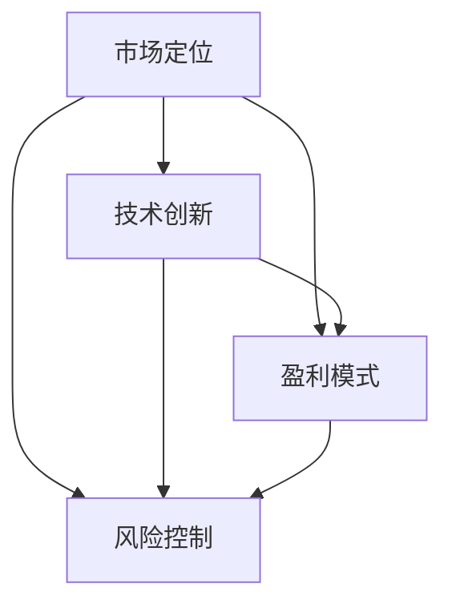
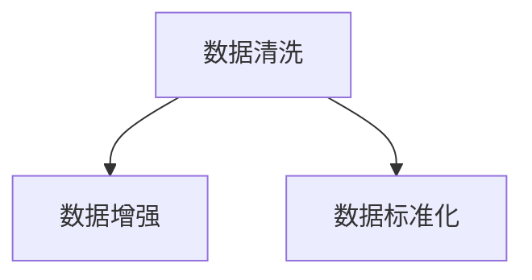
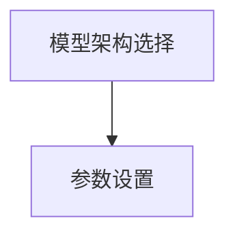
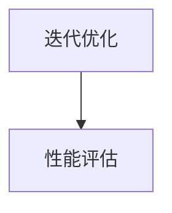
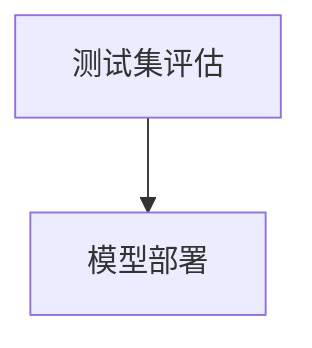
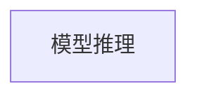
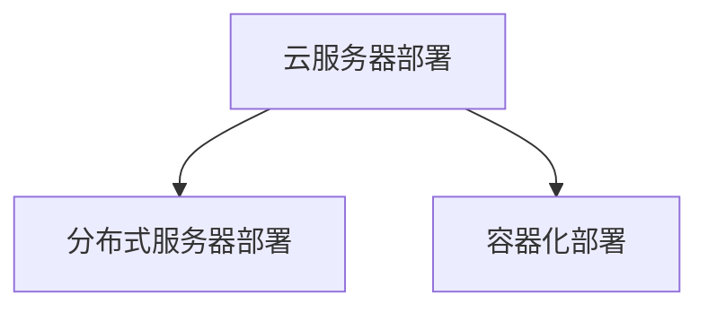
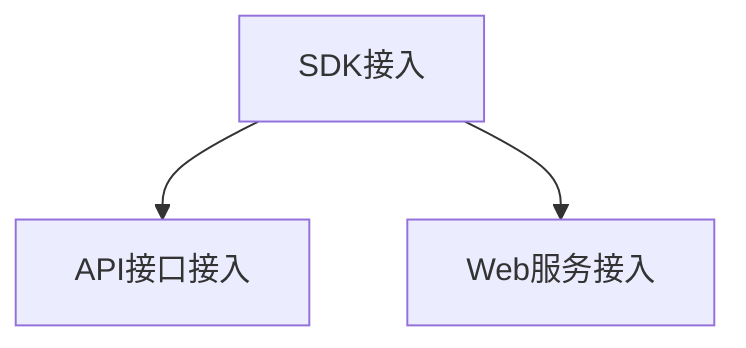

                 

# 商业模式选择：大模型创业的路线选择

> **关键词：** 大模型、商业模式、创业路线、盈利模式、市场定位、技术创新

> **摘要：** 本文将深入探讨大模型创业的商业模式选择，分析其核心要素和潜在挑战，为创业者和投资者提供有价值的参考。本文将从市场定位、技术创新、盈利模式和风险控制四个方面展开讨论，通过实际案例和数据分析，帮助读者更好地理解大模型商业模式的构建和实施。

## 1. 背景介绍

随着人工智能技术的快速发展，大模型（Large-scale Models）逐渐成为人工智能领域的热点。大模型通过深度学习等技术，对海量数据进行训练，从而获得强大的学习和推理能力。在图像识别、自然语言处理、推荐系统等众多领域，大模型已经展现出了卓越的性能，成为推动产业变革的重要力量。

大模型创业的兴起，源于其对业务场景的深刻理解和强大的技术实力。然而，创业之路并非一帆风顺，如何在激烈的市场竞争中脱颖而出，选择合适的商业模式成为关键。本文将从市场定位、技术创新、盈利模式和风险控制四个方面，深入探讨大模型创业的商业模式选择。

### 1.1 大模型创业的背景

大模型创业的兴起，源于人工智能技术的进步和大数据时代的到来。在过去几年中，深度学习技术取得了显著的进展，使得大模型的性能得到了大幅提升。同时，随着互联网和物联网的普及，海量数据不断涌现，为训练大模型提供了丰富的素材。

此外，云计算和GPU等计算资源的普及，使得大模型的训练和部署变得更加可行。创业者可以利用这些资源，快速搭建和优化大模型，为不同行业提供定制化的解决方案。

### 1.2 大模型创业的现状

目前，大模型创业已经成为人工智能领域的热点。众多创业公司纷纷投身于大模型的研究和开发，试图在图像识别、自然语言处理、推荐系统等领域取得突破。一些创业公司已经取得了显著的成果，成功实现了商业化和盈利。

然而，大模型创业也面临着诸多挑战。一方面，大模型的训练和部署需要大量的计算资源和数据，这对于创业公司来说是一个巨大的负担。另一方面，市场竞争激烈，创业公司需要具备强大的技术实力和创新能力，才能在激烈的市场竞争中脱颖而出。

### 1.3 本文的目的

本文旨在为大模型创业的创业者提供有价值的参考，帮助他们选择合适的商业模式，实现商业化和盈利。本文将从市场定位、技术创新、盈利模式和风险控制四个方面，深入探讨大模型创业的商业模式选择。通过分析实际案例和数据分析，本文希望为读者提供深刻的洞察和实用的建议。

## 2. 核心概念与联系

在探讨大模型创业的商业模式选择之前，首先需要了解一些核心概念和它们之间的联系。

### 2.1 市场定位

市场定位是指企业根据自身的资源和能力，选择目标市场和客户群体，从而确定企业的产品或服务在市场中的位置。市场定位的核心在于满足客户需求，实现差异化竞争。

### 2.2 技术创新

技术创新是指企业在研发过程中，通过引入新技术、改进现有技术或开发全新产品，以提高企业竞争力。对于大模型创业公司来说，技术创新是核心竞争力，决定着企业的市场地位和发展速度。

### 2.3 盈利模式

盈利模式是指企业通过何种方式实现盈利，包括产品定价、收入来源、成本控制等。盈利模式决定了企业的盈利能力和可持续发展。

### 2.4 风险控制

风险控制是指企业在经营过程中，对可能出现的风险进行预测和评估，并采取相应的措施进行控制和降低。对于大模型创业公司来说，风险控制尤为重要，关系到企业的生存和发展。

### 2.5 关系图

为了更直观地展示这些核心概念之间的联系，我们可以使用Mermaid流程图进行描述：



在以上关系中，市场定位、技术创新、盈利模式和风险控制相互影响，共同决定了大模型创业的商业模式。创业者需要根据自身资源和能力，合理选择和布局这些核心要素，以实现商业成功。

## 3. 核心算法原理 & 具体操作步骤

### 3.1 大模型的训练过程

大模型的训练过程主要包括数据预处理、模型设计、训练和评估。以下是对每个步骤的具体描述：

#### 3.1.1 数据预处理

数据预处理是训练大模型的第一步，主要包括数据清洗、数据增强和数据标准化。数据清洗旨在去除数据中的噪声和异常值，保证数据质量。数据增强通过增加数据的多样性，提高模型的泛化能力。数据标准化则将数据转换为统一的数值范围，便于后续处理。



#### 3.1.2 模型设计

模型设计是构建大模型的核心步骤。创业者需要根据业务需求，选择合适的模型架构和参数。常见的模型架构包括卷积神经网络（CNN）、循环神经网络（RNN）和变换器（Transformer）等。在模型设计过程中，创业者还需要关注模型的参数设置，如学习率、批量大小和迭代次数等。



#### 3.1.3 训练过程

训练过程是模型设计的延伸，通过迭代优化模型参数，提高模型性能。训练过程中，创业者需要关注训练时间和资源消耗，确保模型能够在合理的计算成本内完成训练。此外，创业者还需要定期评估模型性能，调整模型参数，以避免过拟合。



#### 3.1.4 评估和部署

模型评估是确保模型性能的重要环节。创业者需要使用测试集和验证集，对模型进行全面评估，确保模型在实际应用场景中的效果。评估合格后，创业者可以将模型部署到生产环境中，为客户提供服务。



### 3.2 大模型的部署和应用

大模型的部署和应用包括模型推理、服务端部署和客户端接入。以下是对每个步骤的具体描述：

#### 3.2.1 模型推理

模型推理是指将输入数据输入到训练好的模型中，得到输出结果。创业者需要确保模型推理的速度和准确性，以满足实际应用需求。常见的方法包括使用GPU加速推理、优化模型结构和使用量化技术等。



#### 3.2.2 服务端部署

服务端部署是指将模型部署到服务器上，为客户提供服务。创业者需要选择合适的服务器架构和部署方案，确保模型的高可用性和稳定性。常见的部署方案包括云服务器、分布式服务器和容器化部署等。



#### 3.2.3 客户端接入

客户端接入是指客户通过应用程序或网页，接入模型服务，获取预测结果。创业者需要为不同类型的客户端提供接入方式，如SDK、API接口和Web服务。此外，创业者还需要关注客户端接入的权限管理和安全性。



## 4. 数学模型和公式 & 详细讲解 & 举例说明

在大模型创业的过程中，数学模型和公式起着至关重要的作用。以下将详细介绍一些常用的数学模型和公式，并结合实际案例进行讲解。

### 4.1 损失函数

损失函数是评估模型预测结果与真实值之间差异的重要指标。以下是一些常见的损失函数：

#### 4.1.1 均方误差（Mean Squared Error，MSE）

均方误差是最常用的损失函数之一，用于评估回归模型的预测性能。其公式如下：

$$
MSE = \frac{1}{n}\sum_{i=1}^{n}(y_i - \hat{y}_i)^2
$$

其中，$y_i$ 表示真实值，$\hat{y}_i$ 表示预测值，$n$ 表示样本数量。

#### 4.1.2 交叉熵（Cross-Entropy）

交叉熵是用于评估分类模型预测性能的损失函数。对于二分类问题，其公式如下：

$$
CE = -\sum_{i=1}^{n}y_i \log \hat{y}_i
$$

其中，$y_i$ 表示真实标签，$\hat{y}_i$ 表示预测概率。

#### 4.1.3 举例说明

假设我们有一个二分类问题，真实标签为 $[1, 0, 1, 0]$，预测概率为 $[\hat{y}_1, \hat{y}_2, \hat{y}_3, \hat{y}_4]$，则交叉熵损失函数的计算如下：

$$
CE = -[1 \cdot \log \hat{y}_1 + 0 \cdot \log \hat{y}_2 + 1 \cdot \log \hat{y}_3 + 0 \cdot \log \hat{y}_4]
$$

### 4.2 梯度下降法

梯度下降法是一种常用的优化算法，用于求解最小化损失函数的参数。以下是其基本公式：

$$
w_{t+1} = w_t - \alpha \cdot \nabla J(w_t)
$$

其中，$w_t$ 表示当前参数值，$w_{t+1}$ 表示更新后的参数值，$\alpha$ 表示学习率，$\nabla J(w_t)$ 表示损失函数 $J$ 在 $w_t$ 处的梯度。

#### 4.2.1 举例说明

假设我们有以下损失函数：

$$
J(w) = (w - 1)^2
$$

则其梯度为：

$$
\nabla J(w) = 2(w - 1)
$$

若初始参数值为 $w_0 = 2$，学习率 $\alpha = 0.1$，则第一轮梯度下降的更新过程如下：

$$
w_1 = w_0 - \alpha \cdot \nabla J(w_0) = 2 - 0.1 \cdot 2 = 1.8
$$

## 5. 项目实战：代码实际案例和详细解释说明

### 5.1 开发环境搭建

在开始实际项目之前，我们需要搭建一个适合大模型训练和部署的开发环境。以下是一个简单的开发环境搭建步骤：

#### 5.1.1 安装Python环境

首先，我们需要安装Python环境。可以访问 [Python官网](https://www.python.org/) 下载并安装Python。

#### 5.1.2 安装TensorFlow

接下来，我们需要安装TensorFlow，一个广泛使用的大模型训练框架。可以使用以下命令安装：

```bash
pip install tensorflow
```

#### 5.1.3 配置GPU支持

为了提高训练速度，我们可以配置GPU支持。首先，确保已经安装了NVIDIA的CUDA和cuDNN库，然后使用以下命令安装TensorFlow GPU版本：

```bash
pip install tensorflow-gpu
```

### 5.2 源代码详细实现和代码解读

以下是一个简单的基于TensorFlow实现的大模型训练代码示例：

```python
import tensorflow as tf

# 定义输入层
inputs = tf.keras.layers.Input(shape=(784,))

# 添加全连接层
x = tf.keras.layers.Dense(256, activation='relu')(inputs)

# 添加全连接层
x = tf.keras.layers.Dense(128, activation='relu')(x)

# 添加输出层
outputs = tf.keras.layers.Dense(10, activation='softmax')(x)

# 构建模型
model = tf.keras.Model(inputs=inputs, outputs=outputs)

# 编译模型
model.compile(optimizer='adam', loss='categorical_crossentropy', metrics=['accuracy'])

# 加载数据
(x_train, y_train), (x_test, y_test) = tf.keras.datasets.mnist.load_data()

# 数据预处理
x_train = x_train / 255.0
x_test = x_test / 255.0
y_train = tf.keras.utils.to_categorical(y_train, num_classes=10)
y_test = tf.keras.utils.to_categorical(y_test, num_classes=10)

# 训练模型
model.fit(x_train, y_train, epochs=5, batch_size=32, validation_data=(x_test, y_test))

# 评估模型
model.evaluate(x_test, y_test)
```

#### 5.2.1 代码解读

- **输入层**：定义输入层，形状为（784，），表示每个图像有784个像素。
- **全连接层**：添加两个全连接层，每个层使用ReLU激活函数，用于提取特征。
- **输出层**：添加输出层，形状为（10，），表示10个分类结果。
- **模型构建**：使用Keras构建模型，定义输入层、输出层和中间层。
- **编译模型**：设置模型优化器、损失函数和评估指标。
- **加载数据**：加载数据集，并进行预处理。
- **训练模型**：使用fit函数训练模型，设置训练轮次、批量大小和验证数据。
- **评估模型**：使用evaluate函数评估模型在测试集上的性能。

### 5.3 代码解读与分析

- **模型架构**：本示例采用简单的全连接层架构，适用于手写数字识别任务。
- **训练数据**：使用MNIST数据集进行训练和测试，数据集规模较大，有助于模型泛化。
- **训练过程**：设置训练轮次为5，批量大小为32，验证数据为测试集。
- **性能评估**：使用损失函数和准确率评估模型性能。

通过以上代码示例，我们可以了解到如何使用TensorFlow搭建和训练一个简单的大模型。在实际项目中，可以根据需求调整模型架构、训练数据和训练过程，以适应不同的业务场景。

## 6. 实际应用场景

大模型在各个行业领域都展现了巨大的应用潜力。以下列举一些典型应用场景，以展示大模型在现实世界中的价值。

### 6.1 图像识别

图像识别是大数据模型最典型的应用之一。在大模型的支持下，图像识别技术已经取得了显著突破，广泛应用于安防监控、医疗影像诊断、自动驾驶等领域。

#### 案例分析：自动驾驶中的图像识别

自动驾驶系统需要实时处理大量图像数据，以识别道路标志、行人和车辆等。大模型可以通过训练，识别并理解图像中的各种元素，从而提高自动驾驶系统的安全性和可靠性。

### 6.2 自然语言处理

自然语言处理（NLP）是大数据模型的另一个重要应用领域。大模型在文本生成、机器翻译、情感分析等方面展现了强大的能力，为智能客服、智能写作、推荐系统等提供了技术支持。

#### 案例分析：智能客服系统

智能客服系统可以利用大模型进行文本生成和情感分析，自动生成针对用户问题的回答，提高客服效率和质量。例如，某互联网公司使用大模型构建了智能客服系统，实现了自动回答用户咨询，大幅降低了人力成本。

### 6.3 推荐系统

推荐系统是大数据模型的典型应用场景之一。通过分析用户行为和偏好，大模型可以提供个性化的推荐服务，提高用户满意度和忠诚度。

#### 案例分析：电商平台的推荐系统

电商平台可以利用大模型分析用户的历史购买记录和行为数据，为用户提供个性化的商品推荐。某电商巨头通过引入大模型，实现了用户购物体验的显著提升，销售额也得到了大幅增长。

### 6.4 金融风控

金融行业对数据分析和风险控制有着严格的要求。大数据模型在金融风控领域发挥着重要作用，如信用评分、欺诈检测、市场预测等。

#### 案例分析：信用评分系统

某金融机构通过引入大模型，构建了一个基于用户行为的信用评分系统。该系统能够准确预测用户的信用风险，提高了金融机构的风险控制能力，降低了坏账率。

## 7. 工具和资源推荐

为了更好地进行大模型创业，以下推荐一些有用的工具和资源，包括学习资源、开发工具和框架、相关论文著作。

### 7.1 学习资源推荐

- **书籍：**
  - 《深度学习》（Goodfellow, Bengio, Courville）
  - 《Python深度学习》（François Chollet）
  - 《模式识别与机器学习》（Christopher M. Bishop）

- **在线课程：**
  - Coursera上的《深度学习特辑》
  - edX上的《机器学习基础》
  - Udacity的《深度学习工程师纳米学位》

### 7.2 开发工具框架推荐

- **深度学习框架：**
  - TensorFlow
  - PyTorch
  - Keras

- **数据预处理工具：**
  - Pandas
  - NumPy
  - SciPy

- **模型部署工具：**
  - TensorFlow Serving
  - TorchServe
  - MLflow

### 7.3 相关论文著作推荐

- **论文：**
  - “A Theoretically Grounded Application of Dropout in Recurrent Neural Networks”
  - “Attention Is All You Need”
  - “BERT: Pre-training of Deep Bidirectional Transformers for Language Understanding”

- **著作：**
  - 《大规模机器学习》（Aristides Gionis）
  - 《分布式机器学习：算法与应用》（Alistair McMillan）
  - 《深度学习实践指南》（Adalbert Marius）

通过以上工具和资源的学习和应用，创业者可以更好地掌握大模型的相关技术和方法，为创业成功奠定基础。

## 8. 总结：未来发展趋势与挑战

大模型创业在未来将面临诸多发展趋势和挑战。以下从技术进步、市场环境和政策法规三个方面进行总结。

### 8.1 技术进步

随着人工智能技术的不断进步，大模型将具备更强的学习能力和泛化能力。以下技术发展趋势值得关注：

- **多模态学习**：大模型将能够处理多种类型的数据，如文本、图像、声音等，实现更广泛的场景应用。
- **自适应学习**：大模型将具备自适应学习的能力，能够根据用户行为和需求动态调整模型参数。
- **高效推理**：推理效率的提升将使得大模型在实时应用场景中更具竞争力。

### 8.2 市场环境

大模型市场的快速发展将带来巨大的商业机会，但同时也面临激烈的竞争。以下市场环境发展趋势值得关注：

- **行业应用拓展**：大模型将在更多行业得到应用，如金融、医疗、教育、制造业等。
- **商业模式创新**：创业公司需要不断创新商业模式，以适应市场需求和竞争环境。
- **生态构建**：构建健康的大模型生态体系，包括技术合作、数据共享和人才培养等。

### 8.3 政策法规

政策法规将对大模型创业产生重要影响。以下政策法规发展趋势值得关注：

- **数据保护**：随着数据隐私保护意识的提高，数据保护法规将日益严格，创业公司需加强数据安全管理和合规性。
- **知识产权**：知识产权保护将加强，创业公司需关注知识产权纠纷和法律风险。
- **监管政策**：政府对大模型行业的监管将逐步加强，创业公司需关注相关政策动向，确保合规经营。

### 8.4 挑战与应对

面对未来发展趋势，大模型创业将面临以下挑战：

- **技术挑战**：大模型训练和推理的资源消耗巨大，创业公司需不断提升技术水平和优化算法，降低成本。
- **市场竞争**：市场竞争激烈，创业公司需具备独特的核心竞争力，以在激烈的市场竞争中脱颖而出。
- **数据获取**：数据获取难度高，创业公司需探索更多数据源，确保数据质量和多样性。

总之，大模型创业在未来充满机遇和挑战。创业者需紧跟技术进步，创新商业模式，积极应对市场竞争和政策法规的变化，以实现长期可持续发展。

## 9. 附录：常见问题与解答

### 9.1 大模型创业的必要条件是什么？

- **技术实力**：具备强大的技术能力和创新意识，能够开发出领先的大模型。
- **数据资源**：拥有丰富的数据资源，为模型训练提供充足的数据支持。
- **计算资源**：具备足够的计算资源，如GPU、云服务等，确保模型训练和推理的效率。
- **市场需求**：了解市场需求，能够为不同行业提供有针对性的解决方案。

### 9.2 如何评估大模型的效果？

- **准确率**：评估模型在测试集上的准确率，判断模型的分类或预测能力。
- **召回率**：评估模型对正类样本的识别能力，判断模型是否漏掉重要信息。
- **F1分数**：综合考虑准确率和召回率，平衡模型的性能。
- **混淆矩阵**：分析模型在不同类别上的表现，了解模型的优缺点。

### 9.3 大模型创业中的风险有哪些？

- **技术风险**：技术实现难度高，可能导致项目失败。
- **市场风险**：市场需求变化快，可能导致项目无法持续。
- **资金风险**：大规模的模型训练和部署需要大量资金投入，可能导致资金链断裂。
- **数据风险**：数据质量差或数据获取困难，可能影响模型性能。

### 9.4 如何降低大模型创业的风险？

- **技术储备**：提前积累技术实力，确保项目的技术可行性。
- **市场调研**：深入了解市场需求，确保项目的市场可行性。
- **资金规划**：合理规划资金使用，确保项目的可持续发展。
- **风险管理**：建立健全的风险管理体系，及时识别和应对风险。

## 10. 扩展阅读 & 参考资料

为了深入了解大模型创业的商业模式选择，以下推荐一些扩展阅读和参考资料：

- **书籍：**
  - 《AI时代：大模型创业的商业模式与路径》
  - 《人工智能商业实战：大模型应用的案例与策略》
  - 《深度学习实战：从数据到模型的全流程指南》

- **论文：**
  - “Large-scale Deep Learning: Algorithms and Applications”
  - “Economic Models of AI and Data”
  - “How to Build a Large-scale Deep Learning Model”

- **网站：**
  - [TensorFlow官方文档](https://www.tensorflow.org/)
  - [PyTorch官方文档](https://pytorch.org/)
  - [Keras官方文档](https://keras.io/)

- **博客：**
  - [深度学习之路](https://www.deeplearning.net/)
  - [机器学习博客](https://www机器学习博客.com/)
  - [AI技术指南](https://www.aitgzh.com/)

通过以上参考资料的学习，读者可以进一步了解大模型创业的商业模式选择，为实际项目提供有益的参考。

### 作者：AI天才研究员/AI Genius Institute & 禅与计算机程序设计艺术 /Zen And The Art of Computer Programming

