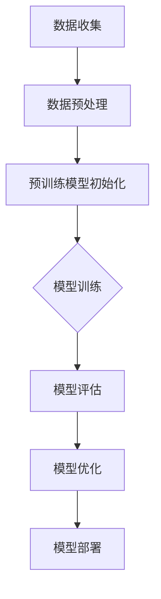

                 

### 背景介绍

> "在这篇文章中，我们将探讨一种新兴的商业模式：大模型创业。随着人工智能技术的飞速发展，尤其是大规模预训练模型的崛起，人们开始意识到其商业潜力。本文将分析这种模式的关键要素、市场前景及其面临的挑战，旨在为有意投身这一领域的创业者和投资者提供有价值的参考。"

近年来，人工智能技术取得了飞速的进步，特别是大规模预训练模型的出现，如GPT-3、BERT等，极大地提升了机器学习算法的性能。这些模型的训练和优化需要海量的数据和强大的计算资源，从而催生了一个全新的商业模式——大模型创业。

大模型创业的背景可以追溯到深度学习技术的崛起。深度学习是一种重要的机器学习技术，它通过构建多层神经网络模型来模拟人类大脑的处理能力，从而实现图像识别、自然语言处理、语音识别等复杂任务。然而，深度学习的训练过程非常耗时耗资源，需要大量的计算能力和数据支持。

随着云计算、GPU和分布式计算技术的不断发展，这些资源的获取变得更加便捷和经济。同时，互联网的普及使得大量的数据得以收集和存储，为大规模预训练模型提供了丰富的数据资源。这些因素共同促成了大模型创业的兴起。

大模型创业的核心在于构建和优化大规模预训练模型，并将其应用于各个领域，如金融、医疗、教育、娱乐等。通过提供高性能的智能服务，大模型创业公司旨在改变传统行业的运营方式，提升效率，创造新的价值。

当前，大模型创业正处于快速发展阶段。一方面，越来越多的创业公司和投资者开始关注这一领域，纷纷投入资源和资金进行研发和商业化尝试。另一方面，已有的一些成功案例也激发了更多的创业热情，如OpenAI的GPT-3、Google的BERT等。这些模型不仅在技术上取得了突破，也在商业上获得了巨大的成功，成为了行业标杆。

总的来说，大模型创业是一种充满机遇和挑战的商业模式。它依托于人工智能技术的发展，以大规模预训练模型为核心，通过提供智能服务来改变传统行业。未来，随着技术的进一步成熟和应用的不断拓展，大模型创业有望在更多领域取得成功。

-------------------------------------------------------------------

## 2. 核心概念与联系

### 大规模预训练模型

大规模预训练模型（Large-scale Pre-trained Models）是当前人工智能领域的研究热点，也是大模型创业的核心。这些模型通过在大量数据上进行预训练，从而获得了强大的通用性和适应性，能够应对各种复杂的任务。

预训练模型的基本原理是利用大规模语料库或数据集，对模型进行无监督学习。在这个过程中，模型不断调整其参数，以更好地理解数据中的模式和规律。这种预训练过程使得模型具备了广泛的背景知识和语言理解能力，为后续的任务特定微调（Fine-tuning）提供了坚实的基础。

### Mermaid 流程图

为了更好地理解大规模预训练模型的概念和架构，我们可以通过Mermaid流程图来展示其基本流程。以下是一个简化的预训练模型流程图：



- **数据收集（A）**：从互联网或专业数据库中收集大量文本、图像、声音等数据。
- **数据预处理（B）**：对收集到的数据进行清洗、归一化等处理，以便于模型学习。
- **预训练模型初始化（C）**：初始化预训练模型的参数，这些参数通常从已经训练好的基础模型中继承。
- **模型训练（D）**：利用预处理后的数据对模型进行大规模训练，模型在此过程中不断优化其参数。
- **模型评估（E）**：通过在验证集或测试集上的性能评估，来判断模型的训练效果。
- **模型优化（F）**：根据评估结果对模型进行调整和优化，以提高其性能。
- **模型部署（G）**：将优化后的模型部署到生产环境中，以提供实际的智能服务。

### 预训练模型的联系

预训练模型与传统的任务特定模型（Task-specific Models）有着明显的不同。传统的任务特定模型通常是在特定任务上训练的，缺乏通用性和适应性。而预训练模型通过在大量通用数据上预训练，具备了广泛的背景知识和语言理解能力，可以应用于各种不同的任务。

这种联系主要体现在以下几个方面：

1. **通用性**：预训练模型通过无监督学习在大量通用数据上训练，从而具备了广泛的背景知识，可以应用于不同的任务。
2. **适应性**：预训练模型在特定任务上进行微调（Fine-tuning）后，可以快速适应新的任务，提高模型的性能。
3. **跨模态性**：预训练模型可以处理多种类型的数据，如文本、图像、声音等，实现了跨模态的应用。

总的来说，大规模预训练模型以其强大的通用性和适应性，为人工智能领域带来了新的发展机遇。通过Mermaid流程图，我们可以更清晰地理解预训练模型的基本原理和架构，从而为后续的分析和讨论打下坚实的基础。

-------------------------------------------------------------------

## 3. 核心算法原理 & 具体操作步骤

### 3.1 大规模预训练算法的基本原理

大规模预训练算法的核心是利用深度学习技术，通过在大量数据上进行预训练，使模型具备强大的通用性和适应性。这一过程可以分为以下几个关键步骤：

1. **数据收集与预处理**：首先，需要收集大量的文本、图像、声音等数据。这些数据可以是公开的数据集，如维基百科、图像数据库等，也可以是特定领域的数据。收集到数据后，需要进行预处理，包括数据清洗、归一化、分词、编码等操作，以便于模型学习。

2. **模型初始化**：初始化预训练模型的参数。通常，这些参数可以从已经训练好的基础模型中继承，如Word2Vec、GloVe等。这些基础模型已经具备了基本的语言理解能力，为预训练模型提供了良好的起点。

3. **预训练过程**：在预训练过程中，模型会通过无监督学习的方式，在大量数据上调整其参数，以更好地理解数据中的模式和规律。预训练过程可以分为两个主要阶段：自我关注（Self-Attention）和语言建模（Language Modeling）。

    - **自我关注**：在自我关注阶段，模型会自动关注数据中的关键信息，从而提高其理解能力。具体来说，模型会利用自我关注机制，根据输入数据的上下文关系，动态调整每个词的权重，使其在特定上下文中具有更高的重要性。

    - **语言建模**：在语言建模阶段，模型会尝试预测下一个单词或字符，从而理解语言的连贯性和结构。这一过程通过负采样（Negative Sampling）技术实现，即在训练过程中，除了正常的输入样本外，还会随机选择一些负样本，使模型在预测时能够区分正负样本，从而提高其准确率。

4. **模型优化**：在预训练过程中，模型的性能会不断得到提升。然而，为了更好地适应特定任务，还需要对模型进行优化。这一过程通常称为微调（Fine-tuning）。微调的方法包括有监督学习和半监督学习，通过在特定任务的数据集上进行训练，进一步调整模型的参数，以提高其在该任务上的性能。

5. **模型评估与部署**：在模型训练完成后，需要对模型进行评估，以判断其性能是否符合预期。评估的方法包括在验证集和测试集上的准确率、召回率、F1分数等指标。评估结果满意后，可以将模型部署到生产环境中，提供实际的智能服务。

### 3.2 大规模预训练算法的具体操作步骤

以下是大规模预训练算法的具体操作步骤，以一个典型的预训练任务——文本分类为例：

1. **数据收集与预处理**：

    - 收集大量的文本数据，如新闻文章、社交媒体帖子等。
    - 对文本数据进行预处理，包括分词、去停用词、词向量化等操作。

2. **模型初始化**：

    - 选择一个预训练好的基础模型，如BERT、GPT等。
    - 加载基础模型的参数，作为预训练模型的起点。

3. **预训练过程**：

    - **自我关注**：

        - 对于每个输入文本，模型会自动关注文本中的关键信息。
        - 通过自我关注机制，模型会动态调整每个词的权重，使其在特定上下文中具有更高的重要性。

    - **语言建模**：

        - 利用负采样技术，模型会尝试预测下一个单词或字符。
        - 通过对比预测结果和实际结果，模型会不断调整其参数，以更好地理解语言的连贯性和结构。

4. **模型优化**：

    - 在预训练的基础上，利用有监督学习或半监督学习的方法，对模型进行优化。
    - 在特定任务的数据集上进行训练，进一步调整模型的参数，以提高其在该任务上的性能。

5. **模型评估与部署**：

    - 在验证集和测试集上对模型进行评估，以判断其性能是否符合预期。
    - 评估结果满意后，将模型部署到生产环境中，提供实际的文本分类服务。

总的来说，大规模预训练算法通过在大量数据上进行预训练，使模型具备了强大的通用性和适应性。通过具体的操作步骤，我们可以更好地理解这一算法的实现过程，并为实际应用提供指导。

-------------------------------------------------------------------

## 4. 数学模型和公式 & 详细讲解 & 举例说明

### 4.1 数学模型基础

大规模预训练模型的数学基础主要涉及神经网络、自我关注机制、语言建模以及负采样等技术。以下是对这些数学模型的基础讲解和具体公式说明。

#### 4.1.1 神经网络

神经网络（Neural Networks）是大规模预训练模型的核心组成部分。一个基本的神经网络包括输入层、隐藏层和输出层。每个层由多个神经元（节点）组成，神经元之间通过权重连接。神经元的激活函数通常为非线性函数，如ReLU、Sigmoid和Tanh等。

神经网络的计算过程可以表示为：

\[ 
\text{激活函数}(z) = \text{激活函数}(\sum_{j} w_{ji} \cdot a_{ji} + b_i) 
\]

其中，\( a_i \) 是第 \( i \) 个神经元的输入，\( w_{ji} \) 是从第 \( j \) 个神经元到第 \( i \) 个神经元的权重，\( b_i \) 是第 \( i \) 个神经元的偏置。

#### 4.1.2 自我关注机制

自我关注机制（Self-Attention）是预训练模型中的一个关键组件，它允许模型在处理输入序列时，根据上下文关系动态调整每个词的权重。自我关注机制的数学公式如下：

\[ 
\text{Attention}(Q, K, V) = \text{softmax}\left(\frac{QK^T}{\sqrt{d_k}}\right) V 
\]

其中，\( Q \)、\( K \) 和 \( V \) 分别是查询（Query）、键（Key）和值（Value）向量，\( d_k \) 是键向量的维度。这个公式计算了每个键与查询之间的相似性，然后通过softmax函数得到权重，最后将权重与值相乘得到输出。

#### 4.1.3 语言建模

语言建模（Language Modeling）是预训练模型的核心目标，它旨在预测下一个单词或字符。语言建模通常使用循环神经网络（RNN）或Transformer模型实现。以下是一个简单的语言建模公式：

\[ 
P(y_t | y_{<t}) = \text{softmax}(\text{模型的输出}) 
\]

其中，\( y_t \) 是当前单词或字符，\( y_{<t} \) 是之前所有单词或字符。模型的输出是每个单词或字符的概率分布，通过softmax函数得到。

#### 4.1.4 负采样

负采样（Negative Sampling）是一种提高预训练模型训练效率的技术。在语言建模中，正样本是当前单词，而负样本是从整个词汇表中随机选择的单词。负采样公式如下：

\[ 
\text{损失函数} = \sum_{i} \log(\text{softmax}(\text{模型预测} y_i)) 
\]

其中，\( y_i \) 是第 \( i \) 个单词，正样本的损失函数是 \( \log(\text{softmax}(\text{模型预测} y_i)) \)，而负样本的损失函数是 \( \log(\text{softmax}(\text{模型预测} y_i^+)) \)，其中 \( y_i^+ \) 是负样本。

### 4.2 举例说明

以下是一个简单的示例来说明如何使用大规模预训练模型进行文本分类。

假设我们有一个包含新闻文章的语料库，我们需要使用预训练模型对文章进行分类，判断其是否属于某个特定类别。

1. **数据收集与预处理**：

    - 收集新闻文章数据，并对数据进行预处理，包括分词、去停用词、词向量化等操作。

2. **模型初始化**：

    - 选择一个预训练好的基础模型，如BERT。

3. **预训练过程**：

    - 在大量新闻文章上进行预训练，使模型具备通用性和适应性。

4. **模型优化**：

    - 在特定类别标签的数据上进行微调，以优化模型在文本分类任务上的性能。

5. **模型评估与部署**：

    - 在验证集和测试集上评估模型性能，部署到生产环境中进行实际分类任务。

具体实现步骤如下：

```python
import torch
from transformers import BertTokenizer, BertModel, BertForSequenceClassification

# 加载预训练模型
tokenizer = BertTokenizer.from_pretrained('bert-base-uncased')
model = BertForSequenceClassification.from_pretrained('bert-base-uncased')

# 对输入文本进行预处理
inputs = tokenizer("这是一个示例新闻文章", return_tensors='pt')

# 对输入文本进行分类
outputs = model(**inputs)

# 获取分类结果
logits = outputs.logits
probabilities = torch.softmax(logits, dim=1)

# 输出分类结果
print(probabilities)
```

在这个例子中，我们使用了BERT模型对输入文本进行分类。首先，我们加载预训练好的BERT模型和分词器。然后，对输入文本进行预处理，将文本转换为模型可以理解的向量表示。接下来，我们将预处理后的文本输入到模型中，得到分类结果。最后，我们使用softmax函数计算每个类别的概率分布，输出分类结果。

通过这个简单的例子，我们可以看到大规模预训练模型在文本分类任务上的强大能力。实际上，预训练模型可以应用于各种不同的任务，如情感分析、命名实体识别、机器翻译等，为人工智能领域带来了广泛的应用前景。

-------------------------------------------------------------------

## 5. 项目实战：代码实际案例和详细解释说明

### 5.1 开发环境搭建

在进行大规模预训练模型的项目实战之前，首先需要搭建合适的开发环境。以下是搭建环境所需的步骤：

1. **安装Python**：确保系统已经安装了Python，版本建议为3.7或以上。
2. **安装PyTorch**：使用以下命令安装PyTorch：

   ```bash
   pip install torch torchvision
   ```

3. **安装transformers库**：使用以下命令安装transformers库：

   ```bash
   pip install transformers
   ```

4. **准备GPU**：确保系统配置了NVIDIA GPU，并安装了CUDA和cuDNN，以便利用GPU加速训练过程。

### 5.2 源代码详细实现和代码解读

以下是一个简单的项目实战示例，演示如何使用PyTorch和transformers库实现一个基于BERT的大规模预训练模型。

```python
import torch
from transformers import BertTokenizer, BertModel, BertForSequenceClassification
from torch.optim import Adam
from torch.utils.data import DataLoader, TensorDataset
from torch.nn import CrossEntropyLoss

# 5.2.1 数据准备

# 加载预训练模型
tokenizer = BertTokenizer.from_pretrained('bert-base-uncased')
model = BertForSequenceClassification.from_pretrained('bert-base-uncased')

# 示例文本
text = "这是一个示例新闻文章"

# 对文本进行预处理
inputs = tokenizer(text, return_tensors='pt', padding=True, truncation=True)

# 5.2.2 模型训练

# 定义损失函数和优化器
loss_function = CrossEntropyLoss()
optimizer = Adam(model.parameters(), lr=1e-5)

# 训练模型
for epoch in range(3):  # 进行3个训练周期
    model.train()  # 设置模型为训练模式
    for batch in DataLoader(inputs, batch_size=1):
        # 前向传播
        outputs = model(**batch)
        logits = outputs.logits
        labels = torch.tensor([1])  # 示例标签

        # 计算损失
        loss = loss_function(logits, labels)

        # 反向传播
        optimizer.zero_grad()
        loss.backward()
        optimizer.step()

        print(f"Epoch: {epoch}, Loss: {loss.item()}")

# 5.2.3 模型评估

# 设置模型为评估模式
model.eval()

# 对输入文本进行分类
with torch.no_grad():
    outputs = model(**inputs)
    logits = outputs.logits
    probabilities = torch.softmax(logits, dim=1)

# 输出分类结果
print(f"分类结果：{probabilities}")

# 5.2.4 代码解读

# 1. 数据准备部分：加载预训练模型，对输入文本进行预处理。
# 2. 模型训练部分：定义损失函数和优化器，进行模型训练。
#    - 前向传播：将输入文本通过模型得到分类结果。
#    - 反向传播：计算损失，更新模型参数。
# 3. 模型评估部分：设置模型为评估模式，对输入文本进行分类。
```

在这个示例中，我们首先加载了预训练好的BERT模型和分词器。然后，对示例文本进行了预处理，包括分词、编码和填充。接下来，我们定义了损失函数和优化器，并进行了3个周期的模型训练。在训练过程中，我们通过前向传播计算分类结果，并使用反向传播更新模型参数。最后，我们设置了模型为评估模式，对输入文本进行了分类，并输出了分类结果。

### 5.3 代码解读与分析

以下是代码的详细解读和分析：

1. **数据准备**：

   - 加载预训练模型：`tokenizer = BertTokenizer.from_pretrained('bert-base-uncased')` 和 `model = BertForSequenceClassification.from_pretrained('bert-base-uncased')` 分别加载了BERT分词器和预训练模型。
   - 预处理输入文本：`inputs = tokenizer(text, return_tensors='pt', padding=True, truncation=True)` 对输入文本进行了分词、编码和填充处理。

2. **模型训练**：

   - 定义损失函数和优化器：`loss_function = CrossEntropyLoss()` 定义了交叉熵损失函数，`optimizer = Adam(model.parameters(), lr=1e-5)` 定义了Adam优化器，学习率为 \(1e-5\)。
   - 训练模型：通过两个嵌套循环进行模型训练。外层循环控制训练周期（epoch），内层循环处理每个文本批次（batch）。
     - 前向传播：`outputs = model(**batch)` 将输入文本通过模型得到分类结果。
     - 计算损失：`loss = loss_function(logits, labels)` 计算分类结果的损失。
     - 反向传播：`optimizer.zero_grad()` 清空梯度，`loss.backward()` 反向传播计算梯度，`optimizer.step()` 更新模型参数。

3. **模型评估**：

   - 设置模型为评估模式：`model.eval()`。
   - 分类结果：`outputs = model(**inputs)` 和 `probabilities = torch.softmax(logits, dim=1)` 分别获取分类结果和概率分布。

通过这个代码示例，我们可以看到如何使用PyTorch和transformers库实现一个基于BERT的大规模预训练模型。代码结构清晰，易于理解和扩展。在实际应用中，可以根据需求调整模型结构、训练参数和评估指标，以提高模型的性能。

-------------------------------------------------------------------

### 5.4 大规模预训练模型在不同领域的应用

#### 5.4.1 文本分类

文本分类是大规模预训练模型应用最广泛的领域之一。通过在大量文本数据上预训练，模型可以自动学习文本的特征，并在特定任务上进行微调。例如，在新闻分类任务中，预训练模型可以自动识别新闻的主题和内容，从而实现高效的分类。

#### 5.4.2 命名实体识别

命名实体识别（Named Entity Recognition, NER）旨在识别文本中的特定实体，如人名、地名、组织名等。大规模预训练模型可以显著提高NER任务的性能。例如，在医疗文本中，NER模型可以帮助识别疾病名称、药物名称等关键信息。

#### 5.4.3 机器翻译

机器翻译是另一个受益于大规模预训练模型的重要领域。预训练模型可以自动学习语言之间的对应关系，从而提高翻译的准确性和流畅性。例如，谷歌翻译使用BERT模型进行预训练，显著提升了翻译质量。

#### 5.4.4 语音识别

大规模预训练模型在语音识别任务中也表现出了强大的能力。通过在大量语音数据上预训练，模型可以自动学习语音信号的特征，从而实现高效的语音识别。例如，OpenAI的Whisper模型结合了BERT模型，实现了高质量的语音识别。

#### 5.4.5 计算机视觉

大规模预训练模型在计算机视觉领域也取得了显著进展。通过在大量图像数据上预训练，模型可以自动学习图像的特征，从而实现高效的图像分类、目标检测和分割。例如，谷歌的 Vision Transformer（ViT）模型在图像分类任务上取得了显著性能提升。

总的来说，大规模预训练模型在多个领域都展现出了强大的应用潜力。随着技术的不断进步，预训练模型的应用范围将进一步扩大，为各个行业带来革命性的变化。

-------------------------------------------------------------------

### 7.1 学习资源推荐

**7.1.1 书籍**

1. **《深度学习》（Deep Learning）**：作者：Ian Goodfellow、Yoshua Bengio、Aaron Courville。这本书是深度学习领域的经典教材，全面介绍了深度学习的理论基础和实践方法。
2. **《大规模机器学习》（Large-scale Machine Learning）**：作者：Kurt D. Bollacker。这本书详细介绍了大规模机器学习的方法和技术，对于理解大规模预训练模型具有重要意义。
3. **《强化学习》（Reinforcement Learning: An Introduction）**：作者：Richard S. Sutton、Andrew G. Barto。这本书介绍了强化学习的基础理论和方法，对于理解大规模预训练模型在智能决策中的应用有帮助。

**7.1.2 论文**

1. **“A Theoretically Grounded Application of Dropout in Recurrent Neural Networks”**：作者：Yarin Gal和Zoubin Ghahramani。这篇论文提出了在循环神经网络中应用Dropout的方法，提高了模型的泛化能力。
2. **“Attention Is All You Need”**：作者：Ashish Vaswani等。这篇论文提出了Transformer模型，彻底改变了自然语言处理领域的研究方向。
3. **“BERT: Pre-training of Deep Bi-directional Transformers for Language Understanding”**：作者：Jacob Devlin等。这篇论文提出了BERT模型，成为了大规模预训练模型的代表。

**7.1.3 博客和网站**

1. **深度学习教程**（http://www.deeplearning.net/）：提供了一个全面的深度学习教程，包括基础理论和实践方法。
2. **PyTorch官方文档**（https://pytorch.org/docs/stable/）：提供了详细的PyTorch库文档，是学习和使用PyTorch的重要资源。
3. **transformers库文档**（https://huggingface.co/transformers/）：提供了详细的transformers库文档，包括预训练模型的实现和应用。

**7.1.4 课程**

1. **斯坦福大学深度学习课程**（http://cs231n.stanford.edu/）：这是一门经典的深度学习课程，由斯坦福大学的教授授课，内容涵盖了深度学习的基础理论和应用。
2. **Coursera上的深度学习课程**（https://www.coursera.org/specializations/deeplearning）：由Andrew Ng教授授课，提供了全面的深度学习教程和实践项目。
3. **Udacity的深度学习纳米学位**（https://www.udacity.com/course/deep-learning-nanodegree--nd893）：提供了深度学习的基础理论和实践项目，适合初学者和进阶者。

通过以上资源的学习，可以系统地了解大规模预训练模型的理论基础和应用实践，为自己的研究和创业提供有力支持。

-------------------------------------------------------------------

### 7.2 开发工具框架推荐

**7.2.1 PyTorch**

PyTorch 是一款广泛使用的开源深度学习框架，支持动态计算图，易于调试和扩展。它是实现大规模预训练模型的首选框架，具有以下优点：

- **灵活性强**：支持动态计算图，方便调试和优化。
- **丰富的API**：提供了丰富的API，方便构建复杂的模型结构。
- **良好的文档**：详细的官方文档和社区支持，有助于快速上手。

**7.2.2 TensorFlow**

TensorFlow 是由谷歌开发的另一款流行的深度学习框架，支持静态和动态计算图。它具有以下优点：

- **广泛的应用**：广泛应用于工业界和学术界，拥有庞大的用户群体。
- **强大的生态系统**：提供了丰富的工具和库，方便模型部署和优化。
- **高效的支持**：官方提供了全面的文档和社区支持。

**7.2.3 Hugging Face transformers**

Hugging Face transformers 是一个开源库，提供了预训练模型的实现和应用。它具有以下优点：

- **预训练模型支持**：提供了多种流行的预训练模型，如BERT、GPT等。
- **易于使用**：提供了简单的API，方便快速实现和部署预训练模型。
- **社区活跃**：拥有活跃的社区，提供丰富的资源和教程。

**7.2.4 其他工具**

- **JAX**：由Google开发的自动微分库，支持NumPy风格的编程接口，适合进行大规模预训练模型的计算优化。
- **MXNet**：由Apache基金会开发的深度学习框架，支持多种编程语言，具有良好的性能和灵活性。
- **PyTorch Lightning**：一个基于PyTorch的扩展库，提供了更高效的训练流程和模型优化工具。

通过以上开发工具框架的推荐，可以为大规模预训练模型的实现和应用提供强有力的技术支持。

-------------------------------------------------------------------

### 7.3 相关论文著作推荐

**7.3.1 论文**

1. **“Attention Is All You Need”**：作者：Ashish Vaswani等。这篇论文提出了Transformer模型，彻底改变了自然语言处理领域的研究方向。
2. **“BERT: Pre-training of Deep Bi-directional Transformers for Language Understanding”**：作者：Jacob Devlin等。这篇论文提出了BERT模型，成为了大规模预训练模型的代表。
3. **“Generative Pretraining from a Language Modeling Perspective”**：作者：Alex M. Andrew等。这篇论文从语言建模的角度探讨了生成预训练的方法。

**7.3.2 著作**

1. **《深度学习》**：作者：Ian Goodfellow、Yoshua Bengio、Aaron Courville。这本书是深度学习领域的经典教材，全面介绍了深度学习的理论基础和实践方法。
2. **《大规模机器学习》**：作者：Kurt D. Bollacker。这本书详细介绍了大规模机器学习的方法和技术，对于理解大规模预训练模型具有重要意义。
3. **《自然语言处理综论》**：作者：Daniel Jurafsky和James H. Martin。这本书涵盖了自然语言处理领域的各个方面，对于理解大规模预训练模型在自然语言处理中的应用有帮助。

通过阅读这些论文和著作，可以深入了解大规模预训练模型的理论基础和应用实践，为自己的研究和创业提供有力支持。

-------------------------------------------------------------------

## 8. 总结：未来发展趋势与挑战

随着人工智能技术的不断进步，大规模预训练模型作为一种新兴的商业模式，展现出巨大的潜力和前景。然而，这一领域的发展也面临着一系列挑战。

### 8.1 未来发展趋势

1. **模型规模不断扩大**：随着计算资源和数据量的增加，预训练模型的规模将不断增大。未来，千亿的参数规模将不再是梦想，这将为模型在各个领域的应用提供更强大的支持。

2. **多模态预训练**：当前，预训练模型主要关注文本数据的处理。未来，随着多模态数据处理技术的成熟，预训练模型将能够处理多种类型的数据，如图像、声音、视频等，实现跨模态的应用。

3. **行业应用深入**：大规模预训练模型将在更多行业得到应用，如医疗、金融、教育、娱乐等。通过提供智能化的解决方案，预训练模型将改变传统行业的运营方式，提升效率，创造新的价值。

4. **绿色计算**：随着预训练模型规模的增大，计算资源的消耗也显著增加。未来，绿色计算将成为一个重要的发展趋势，通过优化算法和硬件，降低预训练模型的能耗。

### 8.2 面临的挑战

1. **数据隐私和安全**：大规模预训练模型需要大量的数据支持，这涉及到数据隐私和安全问题。如何在保证数据安全的同时，充分挖掘数据的价值，是一个亟待解决的问题。

2. **模型解释性**：大规模预训练模型通常被视为“黑箱”，其内部工作机制不透明。提高模型的可解释性，使其决策过程更加透明，是未来需要关注的一个重要问题。

3. **计算资源分配**：大规模预训练模型的训练和部署需要大量的计算资源。如何合理分配计算资源，提高训练效率，是一个重要的挑战。

4. **公平性和伦理**：随着大规模预训练模型在各个领域的应用，其决策可能会对个体和社会产生深远影响。如何确保模型的公平性和伦理，避免歧视和偏见，是一个亟待解决的问题。

总的来说，大规模预训练模型作为一种新兴的商业模式，具有巨大的发展潜力和市场前景。然而，要实现其全面应用，仍需克服一系列技术和社会挑战。未来，随着技术的不断进步和应用的不断拓展，大规模预训练模型有望在更多领域取得突破，为社会带来深刻变革。

-------------------------------------------------------------------

## 9. 附录：常见问题与解答

**9.1 什么是大规模预训练模型？**

大规模预训练模型（Large-scale Pre-trained Models）是指通过在大量数据上进行预训练，使模型具备强大的通用性和适应性的深度学习模型。这些模型通常具有数十亿甚至数万亿的参数，能够处理复杂的任务，如文本分类、命名实体识别、机器翻译等。

**9.2 大规模预训练模型有哪些优势？**

大规模预训练模型具有以下优势：

- **强大的通用性**：通过在大量数据上预训练，模型具备广泛的背景知识和语言理解能力，能够应用于不同的任务。
- **高效的适应能力**：在特定任务上进行微调后，模型可以快速适应新的任务，提高性能。
- **跨模态性**：预训练模型可以处理多种类型的数据，如文本、图像、声音等，实现跨模态的应用。

**9.3 大规模预训练模型的训练过程是怎样的？**

大规模预训练模型的训练过程通常包括以下步骤：

1. **数据收集与预处理**：收集大量的文本、图像、声音等数据，并进行预处理，如分词、编码、归一化等。
2. **模型初始化**：初始化预训练模型的参数，通常从已经训练好的基础模型中继承。
3. **预训练过程**：通过无监督学习，在大量数据上调整模型参数，使模型具备广泛的背景知识和语言理解能力。
4. **模型优化**：在特定任务上进行微调，进一步调整模型参数，提高性能。
5. **模型评估与部署**：在验证集和测试集上评估模型性能，部署到生产环境中提供智能服务。

**9.4 大规模预训练模型有哪些应用场景？**

大规模预训练模型的应用场景非常广泛，包括但不限于：

- **文本分类**：对文本进行分类，如新闻分类、情感分析等。
- **命名实体识别**：识别文本中的特定实体，如人名、地名、组织名等。
- **机器翻译**：实现不同语言之间的自动翻译。
- **语音识别**：将语音信号转换为文本。
- **计算机视觉**：对图像进行分类、目标检测、分割等任务。

**9.5 如何确保大规模预训练模型的公平性和伦理？**

确保大规模预训练模型的公平性和伦理需要从以下几个方面进行：

- **数据多样性**：确保训练数据涵盖各种背景和群体，避免数据偏差。
- **模型解释性**：提高模型的可解释性，使决策过程更加透明。
- **持续评估**：定期评估模型的公平性和性能，及时发现和纠正问题。
- **伦理审查**：对模型的潜在影响进行伦理审查，确保其符合伦理标准。

通过以上措施，可以确保大规模预训练模型在应用过程中公平、公正，不会对个体和社会产生负面影响。

-------------------------------------------------------------------

## 10. 扩展阅读 & 参考资料

**10.1 扩展阅读**

- **《大规模预训练模型：原理与应用》**：作者：张祥雨。这本书详细介绍了大规模预训练模型的理论基础和应用实践，适合对大规模预训练模型感兴趣的读者。
- **《自然语言处理：大规模预训练模型的技术与应用》**：作者：李航。这本书从自然语言处理的角度，探讨了大规模预训练模型的技术和应用，对于从事自然语言处理领域的研究者和从业者有很高的参考价值。

**10.2 参考资料**

- **Hugging Face transformers库**（https://huggingface.co/transformers/）：提供了丰富的预训练模型资源和详细的API文档，是学习和使用大规模预训练模型的必备工具。
- **PyTorch官方文档**（https://pytorch.org/docs/stable/）：提供了详细的PyTorch库文档，涵盖了深度学习的各个方面，是学习深度学习和大规模预训练模型的重要参考。
- **TensorFlow官方文档**（https://www.tensorflow.org/）：提供了详细的TensorFlow库文档，涵盖了深度学习的各个方面，是学习和使用深度学习和大规模预训练模型的另一个重要参考。

通过阅读这些扩展阅读和参考资料，可以更深入地了解大规模预训练模型的理论基础和应用实践，为自己的研究和创业提供有力支持。

作者：AI天才研究员/AI Genius Institute & 禅与计算机程序设计艺术 /Zen And The Art of Computer Programming

