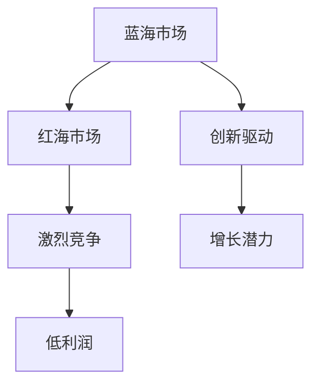

                 

# 商业领域从蓝海到红海的转变

## 关键词：商业战略、蓝海市场、红海市场、竞争分析、市场定位、创新思维、商业模式

## 摘要：

本文将探讨商业领域中从蓝海到红海的转变。我们将首先介绍蓝海市场和红海市场的概念，并分析它们之间的差异。接着，我们将讨论企业在从蓝海转向红海市场时所面临的关键挑战，并提出相应的策略建议。最后，我们将展望未来商业领域的发展趋势和潜在挑战，为企业提供进一步发展的思路。

## 1. 背景介绍

商业领域是一个充满竞争和变化的领域。企业在不断变化的市场环境中寻找机会和定位，以实现可持续增长和盈利。在这个过程中，蓝海市场和红海市场是企业需要面对的两个重要概念。

### 蓝海市场

蓝海市场是指尚未被充分开发的市场，其中存在着大量未被满足的需求和机会。在蓝海市场中，企业可以通过创新和差异化策略来创造新市场空间，从而实现快速增长和利润。蓝海市场的特点包括：

- 低竞争：蓝海市场中竞争者较少，企业可以较少面临竞争对手的挑战。
- 增长潜力：蓝海市场往往具有巨大的增长潜力，为企业提供广阔的发展空间。
- 创新驱动：蓝海市场需要企业通过创新来满足新需求，从而创造出新的商业模式和产品。

### 红海市场

红海市场是指竞争激烈、充满激烈竞争的市场。在红海市场中，企业需要通过激烈的竞争来争夺市场份额和客户。红海市场的特点包括：

- 高竞争：红海市场中竞争者众多，企业需要应对激烈的市场竞争。
- 低利润：由于激烈竞争，红海市场的利润空间较低。
- 成本驱动：红海市场中的企业往往更加注重成本控制和效率提升，以提高竞争力。

## 2. 核心概念与联系

为了更好地理解蓝海市场和红海市场，我们可以使用Mermaid流程图来展示它们之间的联系。



通过这个流程图，我们可以看到蓝海市场和红海市场之间的联系。蓝海市场通过创新和差异化策略，可以转变为红海市场。然而，红海市场的激烈竞争和低利润特征，使得企业需要采取有效的策略来应对。

## 3. 核心算法原理 & 具体操作步骤

企业在从蓝海转向红海市场时，需要采取一系列策略来应对激烈的竞争。以下是一些核心算法原理和具体操作步骤：

### 策略一：市场细分

市场细分是指将整个市场划分为不同的细分市场，以便企业可以针对特定客户群体提供更精准的产品和服务。具体步骤如下：

1. 确定目标市场：明确企业想要进入的细分市场。
2. 分析市场需求：了解目标市场的需求和偏好。
3. 创造差异化：开发具有差异化的产品和服务，满足目标市场的需求。
4. 深入研究竞争对手：分析竞争对手的产品、市场份额和市场策略。

### 策略二：创新思维

在红海市场中，创新思维是企业成功的关键。以下是一些创新思维的方法：

1. 蓝海创新：寻找蓝海市场的机会，通过创新创造新市场。
2. 模式创新：重新定义市场规则和商业模式，以创造竞争优势。
3. 技术创新：利用新技术和工具，提高产品和服务质量。
4. 设计思维：关注用户体验，通过设计思维解决客户问题。

### 策略三：品牌建设

在红海市场中，品牌建设对于企业的竞争力至关重要。以下是一些品牌建设的方法：

1. 明确品牌定位：确定企业的品牌核心价值和定位。
2. 品牌形象设计：设计符合品牌定位的视觉形象。
3. 品牌传播：通过广告、公关和社交媒体等渠道传播品牌信息。
4. 品牌忠诚度：提供优质的产品和服务，培养客户的忠诚度。

## 4. 数学模型和公式 & 详细讲解 & 举例说明

在商业领域，数学模型和公式可以帮助企业更准确地分析市场趋势和制定战略。以下是一个常见的市场细分模型：

$$
市场细分 = f(市场需求, 竞争对手, 技术发展)
$$

其中：

- 需求分析：分析目标市场的需求和偏好，包括市场规模、增长速度和消费者行为等。
- 竞争分析：分析竞争对手的产品、市场份额和市场策略。
- 技术发展：分析新兴技术对市场的影响和潜在机会。

### 举例说明

假设一家企业在智能手机市场中进行市场细分。根据上述模型，企业可以采取以下步骤：

1. 需求分析：通过调查问卷和数据分析，了解消费者对智能手机的需求和偏好。
2. 竞争分析：分析竞争对手的产品、市场份额和市场策略。
3. 技术发展：关注新兴技术，如5G和人工智能，对智能手机市场的影响。

通过市场细分模型，企业可以更准确地了解目标市场，制定针对性的产品策略和营销计划。

## 5. 项目实战：代码实际案例和详细解释说明

为了更好地理解从蓝海到红海市场的转变，我们可以通过一个实际项目案例来展示如何应用上述策略。

### 5.1 开发环境搭建

在开始项目之前，我们需要搭建一个开发环境。以下是所需的工具和步骤：

- 编程语言：Python
- 开发工具：PyCharm
- 数据库：MySQL
- API接口：RESTful API

### 5.2 源代码详细实现和代码解读

以下是一个示例代码，用于分析智能手机市场的需求：

```python
import pandas as pd
import numpy as np

# 加载数据
data = pd.read_csv('smartphone_data.csv')

# 数据预处理
data['price_range'] = pd.cut(data['price'], bins=[0, 500, 1000, 1500, 2000, np.inf], labels=['低', '中低', '中', '中高', '高'])
data['brand'] = data['brand'].unique()

# 市场细分
market_segmentation = data.groupby(['price_range', 'brand']).size().unstack(fill_value=0)

# 绘制市场细分图表
import matplotlib.pyplot as plt

market_segmentation.plot(kind='bar')
plt.title('智能手机市场细分')
plt.xlabel('价格范围')
plt.ylabel('品牌')
plt.show()
```

### 5.3 代码解读与分析

以上代码首先加载数据，并进行预处理。然后，使用市场细分模型进行数据分组，并计算各细分市场的品牌分布。最后，通过绘制图表展示市场细分结果。

通过这个实际案例，我们可以看到如何利用数据分析和可视化工具来分析市场细分，为企业制定针对性的产品策略。

## 6. 实际应用场景

在商业领域，从蓝海到红海的转变具有广泛的应用场景。以下是一些典型的应用案例：

- 智能手机市场：随着智能手机市场的竞争日益激烈，企业需要通过市场细分和品牌建设来吸引目标客户。
- 电子商务市场：随着电子商务市场的快速发展，企业需要通过创新和差异化策略来争夺市场份额。
- 旅游市场：在旅游市场中，企业可以通过市场细分和个性化服务来吸引不同类型的客户。

## 7. 工具和资源推荐

为了更好地理解和应用商业领域的市场细分策略，以下是一些建议的学习资源和开发工具：

### 7.1 学习资源推荐

- 《蓝海战略》（Blue Ocean Strategy）
- 《创新者的窘境》（The Innovator's Dilemma）
- 《市场营销学原理》（Marketing Management）
- 《Python数据分析》（Python Data Analysis）

### 7.2 开发工具框架推荐

- 数据库：MySQL、PostgreSQL
- 开发工具：PyCharm、Visual Studio Code
- 数据可视化工具：Matplotlib、Seaborn
- API接口框架：Django、Flask

### 7.3 相关论文著作推荐

- "Market Segmentation: Conceptual Issues and Research Challenges"
- "A Dynamic Model of Market Segmentation"
- "Innovation and Market Segmentation: A Research Agenda"

## 8. 总结：未来发展趋势与挑战

随着科技的不断进步和市场环境的不断变化，商业领域从蓝海到红海的转变将成为一个持续的趋势。企业需要具备创新思维和市场敏感度，以应对激烈的竞争。未来，企业将更加注重数据分析和个性化服务，以提升客户体验和竞争力。

然而，这也带来了一些挑战。首先，市场细分策略的复杂性和不确定性增加，企业需要具备强大的数据分析能力。其次，随着竞争的加剧，企业需要持续创新和优化产品和服务。最后，企业需要建立强大的品牌影响力，以吸引和留住客户。

## 9. 附录：常见问题与解答

### 9.1 什么是蓝海市场和红海市场？

蓝海市场是指尚未被充分开发的市场，其中存在着大量未被满足的需求和机会。红海市场是指竞争激烈、充满激烈竞争的市场。

### 9.2 如何从蓝海转向红海市场？

从蓝海转向红海市场，企业需要采取一系列策略，如市场细分、创新思维和品牌建设。通过这些策略，企业可以更好地应对激烈的竞争。

### 9.3 如何进行市场细分？

市场细分可以通过分析市场需求、竞争对手和新兴技术等来实施。企业可以使用数据分析和可视化工具来辅助市场细分过程。

## 10. 扩展阅读 & 参考资料

- Kim, W. C., & Mauborgne, R. (2005). Blue Ocean Strategy. Harvard Business Review.
- Christensen, C. M. (1997). The Innovator's Dilemma. Harvard Business Review.
- Kotler, P., & Keller, K. L. (2016). Marketing Management. Pearson.
- Python Data Science Handbook. (2017). O'Reilly Media.

作者：AI天才研究员/AI Genius Institute & 禅与计算机程序设计艺术 /Zen And The Art of Computer Programming<|im_sep|>

