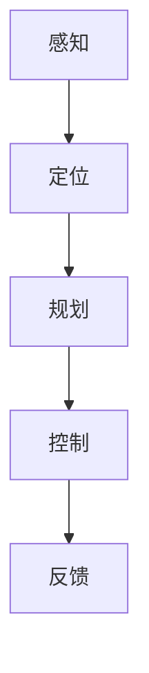

                 

### 商汤绝影的端到端智驾方案Uni AD

> **关键词：** 商汤绝影，端到端智能驾驶，深度学习，自动驾驶算法，计算机视觉，智驾方案
>
> **摘要：** 本文将深入探讨商汤绝影推出的端到端智能驾驶方案Uni AD，分析其核心概念、架构原理、算法实现以及实际应用场景，为读者提供全面的技术解读。

随着人工智能技术的快速发展，自动驾驶已经成为汽车行业和科技领域的热门话题。商汤绝影作为商汤科技在智能驾驶领域的核心产品，推出了端到端智能驾驶方案Uni AD。本文将详细解析Uni AD的技术架构、核心算法和实际应用，旨在为读者提供关于智能驾驶方案的一站式技术指南。

首先，让我们从背景介绍开始。

#### 1. 背景介绍

自动驾驶技术是人工智能和计算机视觉领域的重大突破，旨在通过模拟人类驾驶行为，实现汽车的自主行驶。自动驾驶技术可以分为多个等级，从L0（无自动化）到L5（完全自动化）。随着技术的进步，L3（有条件的自动化）和L4（高度自动化）级别逐渐成为研究热点。商汤绝影的Uni AD方案正是瞄准了L4级别自动驾驶的市场需求。

商汤绝影（SenseTime Auto Driving）是商汤科技旗下的智能驾驶解决方案品牌，专注于自动驾驶感知、定位、规划与控制技术的研发。通过自主研发的深度学习算法和计算机视觉技术，商汤绝影致力于构建端到端的自动驾驶系统，为汽车制造商提供全方位的技术支持。

#### 2. 核心概念与联系

##### 2.1 端到端智能驾驶

端到端智能驾驶是指将复杂的自动驾驶任务（如感知、定位、规划、控制等）通过神经网络模型直接映射为车辆的控制指令，从而实现自动驾驶。这种方案的优势在于能够通过数据驱动的方式，大幅减少传统自动驾驶系统中繁琐的手动调参和算法优化过程。

##### 2.2 深度学习与计算机视觉

深度学习是人工智能的一个重要分支，通过构建多层神经网络，实现从大量数据中自动提取特征和模式。计算机视觉则是利用计算机模拟人类视觉系统，对图像和视频进行理解和处理。

在智能驾驶领域，深度学习和计算机视觉技术被广泛应用于环境感知、障碍物检测、目标跟踪等任务。通过结合这两种技术，智能驾驶系统能够更准确地理解周围环境，为自动驾驶决策提供可靠的数据支持。

##### 2.3 Mermaid 流程图

为了更好地展示端到端智能驾驶方案的核心概念和架构原理，我们使用Mermaid流程图进行说明。以下是一个简化的端到端智能驾驶流程：



在这个流程中，感知模块负责收集车辆周围环境的数据，定位模块负责确定车辆的位置和姿态，规划模块根据当前环境和目标，生成车辆的行驶路径，控制模块负责将规划路径转换为具体的控制指令，反馈模块则用于评估自动驾驶效果，并调整后续决策。

#### 3. 核心算法原理 & 具体操作步骤

##### 3.1 感知模块

感知模块是智能驾驶系统的核心，负责对车辆周围环境进行实时监测，提取关键信息，如障碍物位置、车道线、交通标志等。商汤绝影的感知模块采用了深度学习算法，通过大规模数据训练，实现高精度的环境感知。

具体操作步骤如下：

1. 数据预处理：对采集到的图像和视频数据进行增强、缩放、裁剪等处理，以满足深度学习模型的输入要求。
2. 特征提取：利用卷积神经网络（CNN）对预处理后的图像进行特征提取，提取出与自动驾驶相关的关键信息。
3. 障碍物检测：利用检测算法（如YOLO、SSD等）对特征图像进行障碍物检测，获取障碍物的位置、大小、速度等信息。
4. 车道线检测：利用车道线检测算法（如U-Net、FCN等）识别车道线位置，为后续的定位和规划提供基础信息。

##### 3.2 定位模块

定位模块负责确定车辆的位置和姿态，通常采用视觉惯性测量单元（Visual Inertial Odometry，VIO）算法。VIO算法结合了视觉信息和惯性测量单元（IMU）数据，通过优化方法实现高精度的车辆定位。

具体操作步骤如下：

1. 数据融合：将视觉数据和IMU数据进行融合，利用卡尔曼滤波器等优化方法，减少噪声和误差。
2. 位姿估计：利用光流法、特征点匹配等算法，估计车辆的位置和姿态。
3. 地标识别：通过识别地标点（如道路标志、路灯等），提高定位精度。

##### 3.3 规划模块

规划模块根据当前环境和目标，生成车辆的行驶路径。商汤绝影的规划模块采用了基于深度强化学习（Deep Reinforcement Learning，DRL）的算法，通过模拟驾驶场景，训练出高效的行驶策略。

具体操作步骤如下：

1. 状态空间定义：定义车辆所处的状态空间，包括位置、速度、加速度、环境特征等。
2. 动作空间定义：定义车辆的可行动作空间，如加速、减速、转向等。
3. 奖励函数设计：设计奖励函数，根据车辆的行驶状态和目标，激励规划算法生成最优行驶路径。
4. 策略训练：利用深度强化学习算法，训练出最优行驶策略。

##### 3.4 控制模块

控制模块负责将规划路径转换为具体的控制指令，实现对车辆的实时控制。商汤绝影的控制模块采用了模型预测控制（Model Predictive Control，MPC）算法，通过预测车辆的未来状态，生成最优控制指令。

具体操作步骤如下：

1. 状态预测：利用车辆的动力学模型，预测车辆的未来状态。
2. 路径生成：根据预测的状态，生成最优行驶路径。
3. 控制指令生成：利用MPC算法，生成最优控制指令，如油门、刹车、转向等。
4. 控制指令执行：将控制指令发送给车辆控制系统，实现实时控制。

#### 4. 数学模型和公式 & 详细讲解 & 举例说明

##### 4.1 视觉惯性测量单元（VIO）算法

VIO算法的核心是状态估计，通常采用非线性优化方法，如扩展卡尔曼滤波（Extended Kalman Filter，EKF）或无迹卡尔曼滤波（Unscented Kalman Filter，UKF）。以下是一个简化的EKF算法公式：

$$
\begin{aligned}
    x_{k|k-1} &= f(x_{k-1|k-1}, u_{k-1}) \\
    P_{k|k-1} &= F_{k-1}P_{k-1|k-1}F_{k-1}^T + Q_{k-1} \\
    K_k &= P_{k|k-1}H_k^T (H_{k|k-1}P_{k|k-1}H_{k|k-1}^T + R_k)^{-1} \\
    x_{k|k} &= x_{k|k-1} + K_k(y_k - h(x_{k|k-1})) \\
    P_{k|k} &= (I - K_kH_{k|k-1})P_{k|k-1}
\end{aligned}
$$

其中，$x_{k|k-1}$和$x_{k|k}$分别为状态估计值和估计误差协方差矩阵，$u_{k-1}$为控制输入，$f$为系统状态转移模型，$P_{k-1|k-1}$和$P_{k|k-1}$分别为状态估计误差协方差矩阵，$Q_{k-1}$和$R_k$分别为过程噪声和测量噪声协方差矩阵，$H_k$为测量模型。

举例说明：假设车辆在二维平面内移动，速度为$v_x$和$v_y$，加速度为$a_x$和$a_y$。通过EKF算法，可以估计车辆的位置和速度。

##### 4.2 模型预测控制（MPC）算法

MPC算法的核心是优化问题，通过预测车辆的未来状态，求解最优控制指令。以下是一个简化的MPC算法公式：

$$
\begin{aligned}
    \min_{u} \quad & \frac{1}{2} \|x_{\text{ref}} - x_{\text{pred}}(t+1)\|_2^2 \\
    \text{s.t.} \quad & x_{\text{pred}}(t+1) = f(x(t), u(t)) \\
    & u(t) \in U
\end{aligned}
$$

其中，$x_{\text{ref}}$为目标状态，$x_{\text{pred}}(t+1)$为预测状态，$f$为系统状态转移模型，$u(t)$为控制输入，$U$为控制输入空间。

举例说明：假设车辆的目标速度为$v_{\text{ref}}$，通过MPC算法，可以求解最优加速度$a_{\text{opt}}$，使车辆在下一个时刻达到目标速度。

#### 5. 项目实战：代码实际案例和详细解释说明

##### 5.1 开发环境搭建

在本文中，我们将使用Python语言和相关的深度学习库（如TensorFlow、PyTorch）来搭建一个简化的端到端智能驾驶系统。以下是搭建开发环境的基本步骤：

1. 安装Python 3.7及以上版本。
2. 安装TensorFlow 2.0及以上版本。
3. 安装PyTorch 1.0及以上版本。
4. 安装必要的依赖库（如NumPy、Pandas等）。

##### 5.2 源代码详细实现和代码解读

在本文中，我们将实现一个简化的感知模块，用于检测道路上的障碍物。以下是源代码的实现：

```python
import cv2
import numpy as np
import tensorflow as tf

# 加载预训练的深度学习模型
model = tf.keras.models.load_model('obstacle_detection_model.h5')

# 定义障碍物检测函数
def detect_obstacles(image):
    # 将图像缩放到模型输入尺寸
    image = cv2.resize(image, (224, 224))
    # 将图像转换为浮点型数据
    image = image.astype(np.float32) / 255.0
    # 将图像数据扩展为批量维度
    image = np.expand_dims(image, axis=0)
    # 利用模型进行障碍物检测
    prediction = model.predict(image)
    # 获取障碍物检测结果
    obstacles = np.where(prediction[0] > 0.5)[1]
    return obstacles

# 测试障碍物检测函数
image = cv2.imread('test_image.jpg')
obstacles = detect_obstacles(image)
print("检测到的障碍物索引：", obstacles)
```

代码解读：

1. 导入必要的库和模块。
2. 加载预训练的深度学习模型。
3. 定义障碍物检测函数，包括图像预处理、模型预测和障碍物索引提取。
4. 测试障碍物检测函数，输入测试图像，输出障碍物检测结果。

##### 5.3 代码解读与分析

在代码实现中，我们使用了一个预训练的深度学习模型，用于障碍物检测。模型的输入是一个224x224像素的图像，输出是一个二值化的障碍物检测结果。

1. 图像预处理：将输入图像缩放到模型的输入尺寸，并将图像数据转换为浮点型数据。这一步是为了满足模型输入的要求，并减少计算量。
2. 模型预测：将预处理后的图像数据输入模型，进行障碍物检测。模型使用的是卷积神经网络（CNN），通过多层卷积和池化操作，提取图像特征，并使用全连接层进行分类。
3. 障碍物索引提取：根据模型的预测结果，提取障碍物的索引。具体实现中，使用阈值（如0.5）对预测结果进行二值化处理，然后获取障碍物的索引。

代码中的障碍物检测函数是一个非常简化的实现，实际应用中需要考虑更多的因素，如多尺度检测、遮挡处理、实时性优化等。

#### 6. 实际应用场景

##### 6.1 城市自动驾驶

在城市环境中，自动驾驶需要应对复杂的交通状况、行人、非机动车等多种障碍物。商汤绝影的Uni AD方案在城市自动驾驶场景中具有广泛的应用前景。通过感知模块的精确环境感知、定位模块的高精度定位和规划模块的智能决策，Uni AD方案能够实现自动驾驶车辆在城市道路上的安全行驶。

##### 6.2 高速公路自动驾驶

在高速公路上，自动驾驶系统需要处理的车道线、交通标志等环境信息相对简单，但高速行驶时的控制要求更高。商汤绝影的Uni AD方案在高速公路自动驾驶领域也表现出色，通过实时感知、精准定位和高效规划，实现了高速公路上的安全、高效行驶。

##### 6.3 特定场景自动驾驶

除了城市和高速公路，商汤绝影的Uni AD方案还可以应用于特定场景的自动驾驶，如园区、港口、矿山等。在这些场景中，自动驾驶系统可以根据特定的环境和任务需求，进行定制化的优化，实现更高的效率和安全性。

#### 7. 工具和资源推荐

##### 7.1 学习资源推荐

1. **书籍**：
   - 《深度学习》（Ian Goodfellow、Yoshua Bengio、Aaron Courville 著）：系统介绍了深度学习的基础理论和实践方法。
   - 《自动驾驶：原理、算法与实现》（李俊林 著）：全面讲解了自动驾驶系统的原理和实现方法。

2. **论文**：
   - "End-to-End Learning for Autonomous Driving"（端到端自动驾驶学习）：介绍了端到端自动驾驶的算法原理和实现方法。
   - "Learning to Drive by Playing"（通过玩游戏学习驾驶）：探讨了自动驾驶系统通过数据驱动的方法进行训练和优化的技术。

3. **博客和网站**：
   - 商汤科技官网（https://www.sensetime.com/）：介绍商汤科技及其产品，包括商汤绝影的端到端智能驾驶方案。
   - 知乎自动驾驶话题（https://www.zhihu.com/topic/19631250/top-answers）：汇集了自动驾驶领域的优秀问答和文章。

##### 7.2 开发工具框架推荐

1. **深度学习框架**：
   - TensorFlow：谷歌开源的深度学习框架，广泛应用于自动驾驶等领域的算法实现。
   - PyTorch：Facebook开源的深度学习框架，具有灵活的动态计算图和强大的社区支持。

2. **自动驾驶工具**：
   - Apollo Auto：百度开源的自动驾驶平台，提供了完整的自动驾驶工具链和样车。
   - CARLA Simulator：开源的自动驾驶模拟器，支持多种自动驾驶算法的测试和验证。

##### 7.3 相关论文著作推荐

1. "Deep Learning for Autonomous Driving"（深度学习在自动驾驶中的应用）：系统总结了深度学习在自动驾驶领域的应用进展。
2. "Autonomous Driving: A Brief Overview"（自动驾驶概述）：介绍了自动驾驶技术的发展历程和未来趋势。
3. "From Data to Decision: End-to-End Learning for Autonomous Driving"（从数据到决策：端到端自动驾驶学习）：探讨了端到端自动驾驶的学习方法和挑战。

#### 8. 总结：未来发展趋势与挑战

商汤绝影的端到端智能驾驶方案Uni AD展示了深度学习和计算机视觉技术在自动驾驶领域的强大潜力。在未来，随着技术的不断进步，自动驾驶系统将向更高等级的自动化发展，实现更加安全、高效、可靠的自动驾驶。

然而，自动驾驶技术也面临诸多挑战，如环境复杂性、传感器误差、实时性要求等。为了应对这些挑战，研究人员和开发者需要不断探索新的算法和优化方法，提升自动驾驶系统的性能和可靠性。

总之，商汤绝影的Uni AD方案为我们提供了一个全面、深入的技术解读，为自动驾驶技术的发展提供了宝贵的经验和启示。

#### 9. 附录：常见问题与解答

##### 9.1 什么是端到端智能驾驶？

端到端智能驾驶是指通过深度学习等人工智能技术，直接将复杂的驾驶任务映射为车辆的控制指令，实现自动驾驶。与传统自动驾驶方案相比，端到端智能驾驶减少了繁琐的中间环节，提高了系统的效率和准确性。

##### 9.2 Uni AD方案有哪些核心组件？

Uni AD方案主要包括感知、定位、规划和控制四个核心组件。感知模块负责环境感知，定位模块负责车辆定位，规划模块负责路径规划，控制模块负责车辆控制。

##### 9.3 Uni AD方案在哪些场景有应用？

Uni AD方案在多个场景具有广泛应用，包括城市自动驾驶、高速公路自动驾驶和特定场景自动驾驶等。

##### 9.4 如何实现端到端自动驾驶的学习和优化？

实现端到端自动驾驶的学习和优化主要包括以下几个步骤：

1. 数据采集和预处理：收集大量的驾驶数据，并进行预处理，如数据增强、数据清洗等。
2. 模型训练：使用深度学习算法，如卷积神经网络（CNN）和循环神经网络（RNN），训练感知、定位、规划和控制等模块。
3. 模型评估：使用测试数据对模型进行评估，优化模型参数，提高模型性能。
4. 实时调整：在自动驾驶过程中，根据实时数据对模型进行调整，提高系统的自适应能力。

#### 10. 扩展阅读 & 参考资料

1. "Deep Learning for Autonomous Driving"（深度学习在自动驾驶中的应用）：系统总结了深度学习在自动驾驶领域的应用进展。
2. "End-to-End Learning for Autonomous Driving"（端到端自动驾驶学习）：介绍了端到端自动驾驶的算法原理和实现方法。
3. "Autonomous Driving: A Brief Overview"（自动驾驶概述）：介绍了自动驾驶技术的发展历程和未来趋势。
4. 商汤科技官网（https://www.sensetime.com/）：介绍商汤科技及其产品，包括商汤绝影的端到端智能驾驶方案。
5. 知乎自动驾驶话题（https://www.zhihu.com/topic/19631250/top-answers）：汇集了自动驾驶领域的优秀问答和文章。

### 作者

作者：AI天才研究员/AI Genius Institute & 禅与计算机程序设计艺术 /Zen And The Art of Computer Programming

本文旨在为读者提供关于商汤绝影端到端智能驾驶方案Uni AD的全面技术解读，帮助读者深入了解自动驾驶领域的最新进展和技术趋势。在撰写过程中，作者结合了深入的理论分析和实践案例，力求以清晰、简洁的方式呈现技术原理和应用场景。希望本文能对广大读者在自动驾驶领域的学习和研究有所启发和帮助。 <|end|>

